[🠔 Zur Übersicht: Fenster & Holzschutz](23bausto.md)  
# Fensterprobleme 3 - Isolierfenster / Isolierglas
**Hier wollen wir uns skeptisch mit den Hintergründen der Fensterglasproblematik vom Eintrüben bis zum winterlichen – im Keller auch sommerlichen – Zuschwitzen beschäftigen.**  
_von Konrad Fischer_

## Altbautaugliche Verfahren und Baustoffe 
Kapitel 3: Fensterprobleme - Thema Glas und Fensterkondensat / Schwitzende, nasse Fenster

## Tipps und Tricks zum Thema Glas und Fenster [3]

 _"Schwitzt das Wasser auf dem Glas, wischte ständig ab, was naß"_ - so oder auch "Hastes Fensterglas voll Eis, denkste frostig: "Welch ein ..." oder eher selten: "Nachtabsenkung und pottdicht? Frost sagt Dank mit Glaseisschicht" oder auch "Was am Fenster nicht drannäßt, garantiert Dir Schimmelpest" oder so ähnlich stöhnen fast alle kondensatgeplagten Fensterbesitzer, denen der Winter den Tau auf die vorsätzlich herabgekühlten und dann die Taupunkt-Temperatur unterschreitenden Scheiben und dann den Schweiß auf die Stirn treibt. Und das nicht nur bei Einfach-, Verbund- oder Kastenfenstern - nein, das Scheibenkondensat bis hin zur Eisbildung und Eisblumen aus gefrorenem Schwitzwasser bzw. der Tauwasseranfall an den Rändern bzw. am Randverbund der Fensterkonstruktion gehört inzwischen geradezu zum Kaltwetter-Standard bei fehlgeleiteten Energiegeizern im Winter allerorten. Trotz der von den klammerbeutelgepuderten Klimaschutzpolitikern und ihren korrupten Klimaschutzscharlatanen (Schiller: Brodwissenschaftler) geweissagten globalen Erwärmung, die seit zig Jahren [in Wahrheit eine globale Abkühlung](7argus.md) ist und an Ihrem versifften Fenster abzulesen. 

Nun weiß eigentlich jeder und selbstverständlich auch der verehrte Leser, daß eine allzu hohe Luftfeuchte im Raum nur durch Lüften und vor allem winters - Heizen in den Griff zu bekommen ist. Was das aber wirklich bedeutet, scheint nicht wirklich klar zu sein. Oder? Trübe Scheiben werden also klargewischt, anstelle etwas mehr zu lüften und die Heizung Tag und selbstverständlich auch Nacht (mehr Verwunderliches und Erschröckliches und Spannendes zum Irrsinns-Thema [Nachtabsenkung der Heizung](7temp24.md)) ordentlich aufzudrehen. Freilich hätte man/frau gerne trockene Fenster anstelle Schwitzwasser bis hin zur Eisblumenbildung am vielleicht auch vereisten Fenster jeden Winter. Aber eben auch Energiegeizen um nahezu jeden Preis und am falschesten Platz und ohne wirklich brauchbares Ergebnis. Motto: _"Wasch mir den Pelz, aber mach mich nicht naß"_. 

Hier wollen wir und mal etwas skeptisch mit den Hintergründen der Fensterglasproblematik vom Eintrüben bis zum winterlichen - im Keller auch sommerlichen Zuschwitzen beschäftigen. Vielleicht nutzt es ja auch Ihnen und Sie bekommen darauf Ihre nassen und vereisten Fenster - ja auch und sogar das Isolierglas und sein Randverbund am Fensterrahmen ist gerne vereist, wer hätte das gedacht? - besser trocken. Und gratis Ihre schimmelgeplagt-feuchte Dämm- und Dichtbude auch. 

In der nebenstehenden Grafik von Prof. Dr.-Ing. habil. Claus Meier können Sie übrigens schnell feststellen, ob Wärmestrahlung überhaupt durch das Fensterglas kommt und Sie deswegen als stolzer, aber unsicherer Einfachfensterbesitzer unbedingt wesentlich teurere Doppelscheiben / Zweifachverglasung brauchen. Und um dem verehrten Leser gleich auf die Sprünge zu helfen: Die Antwort heißt schlicht und einfach: 

NEIN. 

Und ja doch, Sie werden durchaus hinter Ihrem Südfenster oder unter Ihrem Dachfenster dolle warm, wenn die Sonne trotz allseits globaler Erkältung mal ausnahmsweise scheint. Aber das ist die Lichtstrahlung, sie wandelt sich erst durch Absorption im belichteten Stoff / Bauteil / Körper zur wohligen Wärmestrahlung (im Volksmund das Spektrum der Energiestrahlung im Infrarotbereich) um. Und denken Sie mal ruhig zurück an Ihre Brennglasexperimente anno dunnemals. Na, dämmert's und schnackelt's? 

Doch zurück zum Fensterproblem rund um schwitzende Fenster im Winter und Sommer, um Kondens-Wasser am Isolierglas / Isolierglasfenster, Tauwasser bzw. Kondensatbildung an der normalen Fensterglasscheibe oder Iso-Verglasung und / oder den Fensterrahmen und den Randverbund bis hin zur Eisbildung und Eisblumen in den Wintermonaten voller Eis und Schnee, Ach und Weh, Frost und Kälte: 

Ist vielleicht ein noch besser isolierendes Iso-Fenster die richtige Lösung zum Energiesparen und Verhindern des ekligen Fensterschwitzens und Vereisens? Top Uw-Wert (w = window, Gesamtwert des Fensters, früher kf-Wert), Ug-Wert (g = glazing - U-Wert der Verglasung), Uf-Wert (f = frame - U-Wert des Rahmens, als teurer Ausweg aus der - in Wahrheit selbstverschuldeten - Schwitzkrise? Die überzogenen Hoffnungen auf die oft nur angeblich überlegenen Eigenschaften der heute so heiß beliebten und brutal beworbenen bzw. von falschen Energieberatern sogar gegen das EnEG-Wirtschaftlichkeitsgebot dem treuherzigen Hausbesitzer aufgeschwatzten Isoliergläser - vielleicht gar mit hyperteurem Wärmeschutzglas oder gar 3-fach-Verglasung / Thermo-Dreifachverglasung - können leider gar schnell eintrüben: 

## Kein Energiespareffekt durch mehr Fensterscheiben

Ja, Sie haben richtig gelesen! Denn je mehr Fensterscheiben Sie zwischen Ihr Zimmer und das direkte oder diffuse Sonnenlicht stellen, umso mehr filtern Sie die kostenlose Solarenergie, die Ihnen das Heizen erleichtert, weg. Jedes Fensterglas blockiert dank seines Filtereffektes - repräsentiert im sogenannten "g-Wert" (Energiedurchlaßgrad: Menge der Sonnenenergie in Prozent, die bei senkrechtem Auftreffen das Glas durchdringt) - etwa 10 Prozent, die geradezu irrsinnigen Wärmeschutz-Dreifachgläser also mehr als 30 Prozent. Hier eine Tabelle zur besseren Übersicht (Quelle: Hessisches Ministerium für Umwelt, Energie, Landwirtschaft und Verbraucherschutz, Energieeinsparung an Fenstern und Außentüren, Wissenswertes über die Erneuerung und Sanierung von Fenstern und Türen, 01 Informationen, Wiesbaden, Ausgabe: 05/04, Überarbeitung: 11/2012): 

Art der Verglasung g-Wert 
Einscheibenglas unbeschichtet 0,90 
Zweischeiben-Isolierglas unbeschichtet 0,71 
Dreischeiben-Isolierglas unbeschichtet (altes Schallschutzglas) 0,63 
Zweifachwärmeschutzglas bis ca. 1985 0,60 
Zweifachwärmeschutzglas ab ca. 1985 0,63 
Dreifachwärmeschutzglas 0,50-0,60 

Die unsinnigerweise weggefilterte Sonnenstrahlung muß der vom Fensterschwindler gelackmeierte Hausbesitzer zusätzlich reinheizen, mit teuer eingekaufter Heizenergie, egal ob Heizöl, Ferngas, Stadtgas oder Flüssiggas, Holzpellets, Holzhackschnitzel, Scheitholz oder elektrische Heizenergie für Wasser-Wasser-, Luft-Luft-, Wasser-Luft-, Luft-Wasser-Wärmepumpen oder auch Nachtstrom oder Direktstromheizung. In meßtechnischer Eindeutigkeit wollen Sie das belegt haben? Bitteschön, ich zitiere aus dem [_"Forschungsprojekt "Climacubes"_](http://www.tfo-meran.it/wp-content/uploads/2012/09/Projektdokumentation Climacubes.pdf), Auswirkungen verschiedener Bauweisen auf Raumklima und Energieverbrauch, Bachelorarbeit 1 zur Erlangung des akademischen Grades Bachelor of Science in Engineering, Studiengang "Umwelt-, Verfahrens- und Energietechnik", Management Center Innsbruck, Betreuer: Dr. Ing. Aldo Giovannini, MCI, Verfasser: Dietmar Holzner." 

Der frischgebackene Bachelor Dietmar Holzner hat dazu bauartgleiche Baukörper mit Zwei- und Dreifachglasfenstern befenstert, beheizt und jahrelang den Heizenergieverbrauch gemessen. Mit folgendem, 2012 publiziertem Ergebnis (S. 39): 

_**"Die solaren Gewinne durch die 50x50cm-Verglasung bewirkten eine geringfügige Energieeinsparung von etwa 10%. Dabei spielte es bei Südfenstern keine Rolle, ob 2fach- oder 3fach-Verglasung verwendet wurde. Während die Energieverluste bei der 3fach-Verglasung kleiner waren, waren die Gewinne bei 2fach-Verglasung durch den höheren g-Wert größer. Allerdings waren die inneren Oberfächentemperaturen bei einer 3fach-Verglasung höher und damit für den Bewohner angenehmer."**_ 

Was heißt das? Keine Angst, ich erkläre Ihnen das ganz genau: 

1. Befensterung spart Heizenergie. Weil die Sonne eben mitheizt. Wieviel, hängt von der Größe und Ausrichtung und Verglasung der Fenster und dem Einsatz von Schutzeinrichtungen wie Außen-, Innen- oder Rolläden ab. Die dann auch nachts für angenehm warme Innenoberflächentemperaturen sorgen und den nächtlichen Energieverlust durch das Fenster dramatisch reduzieren. 
2. In allen Himmelsrichtungen gilt, daß Einfachscheiben dank optimaler Solarenergieausbeute die denkbar allerbesten Energiesparer sind, soweit nachts der Rolladen, Schiebeladen oder Klappladen den öffnungsbedingten Wärmeverlust vorzugsweise gegenüber dem ca. -50 °C kalten Nachthimmel, also wesentlich weniger als gegenüber der kühlen Nachtluft stark verringern. Allfällige Überschuß-Raumluftfeuchte kann das Einfachfenster übrigens - im krassen Unterschied zu modernen Isolierglas-Lippendichtungsfenstern - perfekt bewältigen: Durch minimale, aber ausreichend trocknende Frischluftzufuhr infolge der angemssenen Fugendurchlässigkeit von alten Fensterkonstruktionen ohne Dichtlippe, im Härtefall auch durch leicht abwischbares Innenkondensat (ich erinnere an die Kondensat-Tropfrinne im Fensterbrett raumseits hinter dem Fensterflügel, auch mit Ablaufröhrchen nach außen oder sogar in ein Blechkästchen, das als Schublade unter dem Fensterbrett ein- und ausgeschoben werden kann) blieb die Raumluft insgesamt hübsch trocken und ließ sich so mit wesentlich weniger Heizenergie aufwärmen, als unsere moderne Feuchtschimmelluft. Und genau das war die Top-Gesund-Energiesparmethode unserer Altvorderen, die nur dank unfaßbarer Anstrengungen und Reklamelügen der Fensterprofis und ihrer Betrugswissenschaft zugunsten schimmelpilzriskanter Teuerdichtbefensterung ausradiert wurde. 
3. Das gilt für Altbau genauso wie Neubau. Und nur, weil die Denkmalpflege oft keinerlei belastbares Wissen um das wirkliche Energiesparen hat und heutzutage geradezu alles tut, um der etablierten, aber falschen Bauphysik und Energieberaterei auch am Baudenkmal Vorschub zu leisten, kann sie dem üblen Treiben der Energiebetrüger nur beleidigt zusehen. Und höchstens Holzsprossenfenster fordern, anstatt die altväterliche Energiesparrafinesse in toto zu retten, pflegen und schützen. Gott und der Heiligen Substanzia sei's geklagt! 

## Erblinden von Isolierscheiben im Scheiben-Innenraum / Glas-Zwischenraum

Was ist eigentlich Isolierglas? Das Isolierglas ist eine typische amerikanische Erfindung, wie ja nahezu alles Gute wie Bush, Clinton, MacDonalds, Obamania und die Atombombe. 1865 meldete ein gewisser Thomas D. Stetson sein Patent an: Zwei am Rand verklebte Glasscheiben mit Luftschicht dazwischen. Hat sich allerdings lange nicht so durchgesetzt, da die so entstandene Doppelscheibe nie richtig dicht war - und wenn erblindet, als unsanierbar wegzuwerfen. Ende 19. Jh. kommt es dann zum sogenannten Panzerglas, bei dem zwei Glasscheiben in einem Rahmen gegenübergesetzt werden. Tolle Idee, und immerhin durch Ausbau der einen Verkittung bzw. Glashalteleiste vom notgedrungen eindringenden Feinstaub und Kondensat zu reinigen. Die Panzerglas-Konstruktion erfreute sich im Industriebau einiger Beliebtheit, da sie aber - leider, leider - auch nie dichtzukriegen ist, werden Panzerglas-Fenster im Sanierungsfall meistens weggeschmissen. Im Standadardwerk "Fenster" von Adolf G. Schneck, publiziert in sieben Auflagen von 1927 und 1993, steht dazu, daß es bisher noch nicht gelungen sei,_"den Scheibenzwischenraum der Panzerfenster auf die Dauer mit ausreichender Sicherheit von Staubablagerungen, Kondensatwasserniederschlag und Erblindungserscheinungen des Glases frei zu halten."_ 
(Angaben unter Verwendung von Hermann Klos: Panzerfenster, Sonderdruck (mit Ergänzungen) aus: Denkmalpflege in Baden-Württemberg, 37. Jahrgang 1, 2008, Holzmanufaktur Rottweil, 2008. 

Na, und genau dort sind wir bis heute stehngeblieben. Nur mit dem kleinen Unterschied, daß fast alle Bauherrn so 'ne Murkskonstruktion gerne einbauen lassen, um es dann doch meist sehr ungern wieder wegschmeißen zu müssen oder eben nix mehr durchblicken. Phantastischer Fortschritt, oder? Ein paar weitere Details gefällig? Bitteschön: 

- Isolierglas darf nach DIN gegenüber eindringender Luft eine Leckagerate von ca. 1% im Jahr haben. So akzeptiert DIN das Unvermeidliche. 
- Isoliergläser sind nach spätestens 30 Jahren blind kondensiert und stehen dann zum Austausch an - der Gipfel der modernen "Nachhaltigkeit / Sustainability". 
- Oft erblinden Isoliergläser nach bedeutend kürzerer Zeit, da die raumtypische Kondensatbelastung dies erzwingt bzw. zusätzlich viele qualitätssichernde Maßnahmen bei Herstellung und Einbau in der Rahmenkonstruktion vernachlässigt, nicht beachtet oder schlecht ausgeführt werden. 
- Beanspruchend wirkt auch die ständige Konvex-Konkav-Verformung der inneren und äußeren Isoscheiben durch Luftdruckänderungen. Kleinere Glasflächen neigen deshalb verstärkt zum Glasbruch. 
- Die Praxis zeigt: Der Austausch von erblindeten Isolierfenstern hat für ein dauerhaftes Bombengeschäft der Glaser-/Fensterbaubetriebe gesorgt. Dem Kunden werden alle diese Risiken vorher zuallermeist verschwiegen. Das ist dann Marketing nach dem Motto Kundenbetrug! 

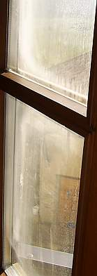 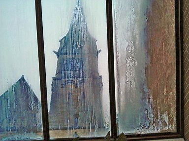 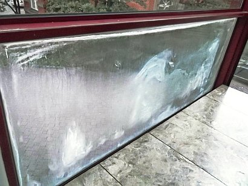 
So sieht ein nach wenigen Jährchen nach ausgiebigem Schwitzen dank dem Glasrahmen innewohnendem Salz zwengs anfänglicher hygroskopischer Aufnahme des unvermeidlichen Kondensats im Scheibenzwischenraum trübe erblindetes Isolierglas von innen aus. Ehrenwort: Kein Schmutz von Außen oder Innen - selbst getestet, Hausfrauen-Adresse und Adresse des Gemeindehauses auf Anfrage! 

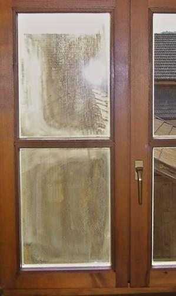 Oder auch so. Der rechte Flügel kommt später dran. Langsam, aber sicher. 

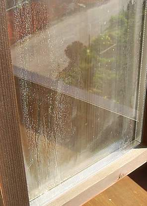 Und so von außen. Wer genau hinguckt, kann das feuchtereglierende Salz herumkristallisieren sehen, das von der eingedrungenen Kondensfeuchte ausgespült wurde und bei trockenerem Scheibenzwischenraum-Innenklima logischerweise hübsch auskristallisiert. Wie war das doch gleich mit den schlimmen Eisblumen an Omas Einfachfenster? Wißt Ihr noch, wie lustig es war, die vereisten Scheiben anzuhauchen, mit der Zunge das Eisblümlein anzutauen, oder auch mit dem Finger? Und dann warten, bis es wieder zufriert? Nebenbei waren die Eisblumen nur ein Resultat übertriebener Dichte (ja, die Wollwürste rund um die Fensterrahmen und das dummerweise verstopfte Abluftröhrli oben in der Zimmerecke!) und Feuchte (genau, das Wasserschiff im Herd!) und nächtlicher Auskühlung (weil niemand den Kachelofen früh um drei nachlud) und die damit verbundene Auskühlung der Gebäudehülle. Letzteres schafft heute die dämliche Nachtabsenkung durch energieverschwendende [Heizungsregelung.](7temp24.md) 
- Spezialbetriebe zur Kondensatabsaugung aus dem erblindeten Fenster inkl. Nachreinigung mit magnetgesteuerter Gummiwischlippe oder anderen Spülverfahren leben auf diesem Markt mit automatisch steigender Wachstumsrate bestimmt nicht schlecht. 

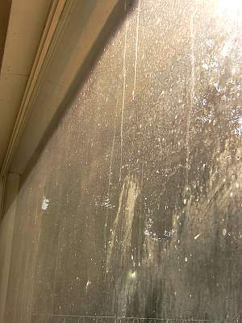 Blick "durchs" Isofenster. Das war mal ein schickes Panorama-Isolierglasfenster im fürnehmen Wohnzimmer mit herrlichem Blick in die schöne und unverbaute Landschaft. Jetzt - dank gewaltigem Innenkondensat und prickelnder Salzkristallisation - mit bester Eignung als Milchglas-Klofenster. 

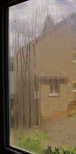 Wie naßfeuchtdicht mag es wohl in diesem Stübchen gewesen sein, daß schon nach kurzer Zeit so viel Kondensat im Isofenster-Glas-Zwischenraum ausgeschwitzt ist!

Daß hier sozusagen vorsätzliche Desinformation des Kunden getrieben wird, belegen die durchaus ehrlichen Aussagen verschiedener Glas- und Fensterhersteller auf der Fenstermesse "frontale 2000" in Nürnberg (sinngemäß zitiert): 

_"Wir bieten bewußt keine Informationen zum Thema "Erblinden" unserer Isolierglasfenster, das würde dem Verkauf schaden."_

und 

_"Natürlich wissen wir, daß wir hier keine Garantien geben können, die Erblindung wird neben den Umgebungsbedingungen maßgeblich sowohl von den eingesetzten feuchteaufnehmenden Substanzen im Randverbund wie auch von der Fertigungsmethode bestimmt, es gibt hier bedeutende Qualitätsunterschiede."_

Aufgepaßt! Trübung der Isolierglasscheiben berechtigt übrigens den Mieter zu 0,5 Prozent Mietminderung in der Küche, so das Amtsgericht Miesbach im Urteil vom 30.10 . 1984 - 3 C 585 / 84 , WM 1985, im Wohnzimmer sogar zu 10%. [Urteilslink Fenster](http://www.preissens.de/recht/miete/fenster.htm). 

Daß das den armen Schweinen nix nützt, die in zu feuchten Buden verrecken oder mindestens chronische Allergien, Nasenlaufen, Unwohlsein, Kopfschmerz, Leibschmerz oder LSR (Laryngitis, Sinusitis und Rhinitis) bekommen, da sich in den fenstermäßig überdichten Räumen Schimmelpilze breitmachen und die Keimrate steigt, dürfte klar sein. Aufge&uumlpaßt: Wenn es muffelt im Raum, stimmt was nicht! Dauermief macht krank, nur frische Luft ist gesund!

Tipp: Fragen Sie beim Hersteller seine Qualitätssicherung einmal betreffend Ihrer Frischluftversorgung und dann betreffend die Dichte seiner Isolierscheiben gegen eindringende Feuchtluft ab, fragen Sie auch seine "Marktbegleiter" (neudeutsch für: Konkurrenten), das weckt Ihr eigenes Qualitätsverständnis und kann Leben (wenn schon nicht Ihres, vielleicht das Ihrer Familie) retten, auf jeden Fall Arztkosten sparen. Und was die technische Seite betrifft: Das gegenseitige (leider oft nur allzu berechtigte) Schlechtmachen der "Marktbegleiter", um sein eigenes Gemurkse an den Mann zu bringen, ist die wahre Grundlage des eigentlichen Baustoffwissens. Von den wahren Problemen des modernen Problemmülls (= "moderne" Baustoffe voller Chemiedreck und Technikblödsinn) kann man nämlich in der sogenannten Fachpresse ebensowenig lesen, wie in der Bildzeitung. Medien leben von den Anzeigenkunden, und wer will die schon an die Merktbegleiter verlieren, nur einer schnöden Wahrheit willen? Sehen Sie!

Einer Reklar-Presseinfo vom November 99 entnehmen wir:

_"[...] Alte Isolierglasscheiben, die in ihrem Innenraum beschlagen sind, wurden bislang ausgetauscht. [...]_

_Die schleichend einsetzende Trübung der Glasscheiben hat ihre Ursache in den hohen Temperaturunterschieden zwischen Sommer- und Wintermonaten. Über viele Jahre hinweg wird so das Dichtungsmaterial porös und Feuchtigkeit kann in den Scheibeninnenraum eindringen, wo sie sichtbare Trübungen hinterläßt. Mit herkömmlichen Reinigungsmitteln war diesem Niederschlag bislang nicht beizukommen. Der kostenintensive Austausch war die einzige Lösung. [...]"_

## Schwitzwasser auf der Innenseite der Isolierscheibe im Innenraum / Schwitzende Fenster

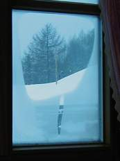 Spannendes Winterrätsel: 

Was glauben Sie, wieviel Raumluftfeuchte hier am gummilippendichten Isofenster kondensiert und wieviel in der Wand? 

Schwitzende Fenster oder schimmelnde Wand, oder beides? - das ist also die Preisfrage. 

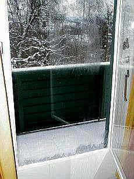Wie gut, wenn das Fensterglas auch in einem Verbundfenster aus zwei - nicht luftdicht! - gekoppelten Fensterflügeln (Bauart Rekord oder Wagner-Fenster) - die nächtlich ausgeschnarchte, abgeschwitzte und ausgefurzte Feuchte kontrolliert abkondensiert.

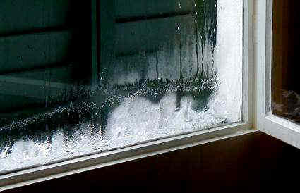Und noch besser, wenn der Fensterrahmen mit guter Leinölfarbe gestrichen ist und solche aufgefrorenen Wasserfälle viele Jahre klaglos verträgt. Das spart Schimmelasthma, Blutvergiftung und verschwärzte Pilzhölzer. Und das nicht nur zur Sommerszeit ... 

Daß der klassische Leinölkitt aus Schlämmkreide und Leinöl nach einigen Jährlein seine flüchtigen Substanzen - die er eben nicht hat - verlieren könnte und dann mehr und mehr aus der Kittfuge wegschrumpft, hat man auch noch nicht gehört. Hier ist demgegenüber zu sehen, wie es der modernen Silikonfuge gehen kann, wenn UV-Strahlung und Temperaturwechsel, gepaart mit etwas Feuchte ihr zerstörerisches Spiel treiben. Der gelbe Pfeil zielt auf die offene Fugenfehlstelle, in die Wasser ohne Ende eindringen kann: 
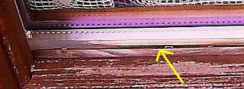 
Alles, was die moderne Alchymie der Synthetikmasse hineingemischt und untergejubelt hat, um dem Kunden weiszumachen, er bekäme ein High-tech-Laborprodukt, von allerklügsten Wissenschaftlern (die Priester unserer Zeit) ersonnen, den traditionellen Lösungen nicht nur in der "Maschinengängigkeit" und pfuschgerechten "Verarbeitungsgeschwindigkeit" meilenweit überlegen, verhält sich grad andersrum, als im Werbeblättla bejubelt. Schon (möglichst) kurz nach der Gewährleistungszeit kann einem der Industriemüll um die Ohren fliegen. Das moderne Prinzip unserer sozialistischen, auf Wachstum angelegten Industrie- und Massengesellschaft greift bis ins Detail: Reparieren unmöglich, Sollbruchstellen ohne Ende, wachsende Müllhalden. Und alle machen mit.

Einer auf der frontale 2000 verteilten _"Kundeninformation"_ eines renommierten Isolierglasfensterherstellers zum Dauerbrenner Schimmel und Schwitzwasser auf Wand und Neufenster entnehmen wir:

"**Richtig lüften**

_Stellen Sie eines Tages fest, daß sich trotz neuer [Isolier]-Verglasung auf den Fensterscheiben Schwitzwasser bildet und die Wände sich womöglich feuchter anfühlen als früher, dann hat dies ganz natürliche Ursachen: Ihre alten Fenster waren nie ganz dicht. Dies hatte den "Vorteil", daß ein regelmäßiger "automatischer" Luftaustausch erfolgte. Sichtbarer Wasserdampf aus Küche und Bad, aber auch die unsichtbare Feuchtigkeitsabgabe durch den Menschen (allein beim Schlafen gibt der Mensch in 8 Stunden etwa 3/4 Liter Feuchtigkeit ab) konnte durch diese "Zwangslüftung" entweichen. Der Nachteil war freilich ein hoher Wärmeverlust und unnützer Heizenergieverbrauch._

Kommentar KF: Den echten Vorteil einer trockenen Wohnung als "Nachteil" so schlechtzureden, zeigt das Ausmaß von Kundenverachtung in vollem Maße. Und bei der früher üblichen Strahlungsheizung gab es auch nie hohe Wärmeverluste, da bedeutend geringere Raumlufttemperaturen genügten, ein als wohlig empfundenes Raumklima zu garantieren. Da dann nur Luft geringer Temperatur durch die Fensterfugen entweichen konnte, war auch der Wärmeverlust bei dem hygienisch immer notwendigen Luftaustausch nur gering. Unnützen Heizenergieverbrauch gibt es also nur bei dem Austausch übertrieben teuer erhitzter Raumluft bei Konvektions-/Radiatoren-Heizung.

_Muß man nun für die bessere Wärme- und Schalldämmung_

Kommentar KF: Die beste Schalldämmung geschlossener und einigermaßen fugendichter Fensterkonstruktionen ist vor allem anderen abhängig vom Scheibenabstand, und der ist nun mal bei Isolierscheiben am geringsten, wenn wir das Einscheibenfenster mal vernachlässigen. In diesem Masse-Feder-Masse-System bildet die Luft die "Feder", die als "Schalldämpfer" wirkt. Damit das künftig nicht mehr gilt, wurde neu genormt. Dadurch werden der hörbare Schallbereich nicht mehr so wie früher gewichtet und die unhörbaren Frequenzbereiche bevorzugt. Ein Taschenspielertrick, wie wir ihn von der Fensterindustrie ja gewohnt sind. Was die Wärmedämmung betrifft, lassen Doppelscheiben weniger kostenlose Solarenergie rein und sorgen mit geringerem Sollkondensatoreffekt auch für höhere Luftfeuchte. Dies kann dann im Effekt mehr Heizenergie kosten, da einmal die durch die Fenster im Raum eingefangene Solarenergie Heizung spart und zum anderen feuchtere Luft mit mehr Energie aufzuheizen ist, als trockene.

_durch die neue Verglasung Überfeuchtung in Kauf nehmen? Nein! Sie sollten lediglich folgende Tips befolgen:_

Lüften Sie morgens alle Räume 20 bis 30 Minuten, vor allen Dingen bei trockener Witterung.

Lüften Sie im Laufe des Tages die Räume je nach Nutzung drei- bis viermal für 10 bis 15 Minuten.

Kommentar KF: Als ob die Industrie nicht wüßte, daß alle Untersuchungen ([z. B. von Prof. Roloff](7wdvs15.md#roloff)) belegen, daß die hier propagierte Stoßlüftung zwar kurzfristig teuer aufgeheizte feuchte Raumluft gegen trockene, kalte Frischluft austauschen, die in die Außenwände einkondensierte Baufeuchte jedoch nicht wirksam reduzieren kann.

Beweis: Messen Sie vor und ca. 1/2 Stunde nach dem Stoßlüften die Raumluftfeuchte. Sie werden die gleichen, ggf. überhöhten Werte feststellen!

_Ist eine solche Stoßlüftung nicht möglich, sollten Sie über die einstellbare Lüftungsmöglichkeit (z.B. Kippstellung), die an ihren Fenstern vorhanden sein sollte, für Frischluft sorgen._

Kommentar KF: Das funktioniert feuchtetechnisch prima. Die Frage bleibt, wieso dann superdichte Luxusfenster kaufen? Wenn man eh' zum Fenster hinausheizen muß, um nicht zu verschimmeln.

_Wer diese Tips befolgt, hat keine Feuchtigkeitsprobleme oder "schwitzende Fenster". Darüber hinaus tun Sie etwas für ein gesundes Wohnklima und sparen dank der exakt schließenden Fenster und des [Isolier]-Glases viel Heizenergie."_

Kommentar KF: Wer diese "Tips" gegen 

### schwitzende Fenster

befolgt und wer Isolierscheibenfenster mit Gummilippendichtung in sein Haus bis zum allerletzten Feuchtraum, Kinderzimmer und Schlafzimmer einbaut, finanziert sich eine Schimmelbude und zahlt teuer für künftige Energieverschwendung. Na ja, aus Schaden wird man klug, auch wenn es dann fast zu spät ist. Die unschuldigen und auch die sinnlos vergeizten Mieter ohne ausreichendes Lüftungsverhalten tun mir als Opfer von Schreinermeistern, modernisierungsumlagegeiler Vermieter und abscheulicher Wärmedämmpropaganda zumindest leid. Aber das ist wohl nur ein altmodisches Gefühl.

Was bei der Kondensation der Raumluftfeuchte in bauphysikalischer Hinsicht wirklich läuft, zeigt die nachfolgende Tabelle. Sie finden links in der Y-Achse die Temperaturen ihrer Raumluft, die X-Achse zeigt in der oberen Reihe / Zeile die möglichen Luftfeuchten und in den Tabellenefeldern finden Sie die Temperaturen der Bauteilflächen / Oberflächentemperaturen bzw. die Temperaturen im Baustoff selbst, bei denen dann die Raumluft auskondensiert - also die Taupunkttemperaturen in Grad Celsius - °C: 

 Taupunkttemperatur für +10 °C bis +30 °C 
bei einer relativen Luftfeuchte von 30% bis 95% 
°C 30% 35% 40% 45% 50% 55% 60% 65% 70% 75% 80% 85% 90% 95% 
30 10,5 12,9 14,9 16,8 18,4 20,0 21,4 22,7 23,9 25,1 26,2 27,2 28,2 29,1 
29 9,7 12,0 14,0 15,9 17,5 19,0 20,4 21,7 23,0 24,1 25,2 26,2 27,2 28,1 
28 8,8 11,1 13,1 15,0 16,6 18,1 19,5 20,8 22,0 23,2 24,2 25,2 26,2 27,1 
27 8,0 10,2 12,2 14,1 15,7 17,2 18,6 19,9 21,1 22,2 23,3 24,3 25,2 26,1 
26 7,1 9,4 11,4 13,2 14,8 16,3 17,6 18,9 20,1 21,2 22,3 23,3 24,2 25,1 
25 6,2 8,5 10,5 12,2 13,9 15,3 16,7 18,0 19,1 20,3 21,3 22,3 23,2 24,1 
24 5,4 7,6 9,6 11,3 12,9 14,4 15,8 17,0 18,2 19,3 20,3 21,3 22,3 23,1 
23 4,5 6,7 8,7 10,4 12,0 13,5 14,8 16,1 17,2 18,3 19,4 20,3 21,3 22,2 
22 3,6 5,9 7,8 9,5 11,1 12,5 13,9 15,1 16,3 17,4 18,4 19,4 20,3 21,2 
21 2,8 5,0 6,9 8,6 10,2 11,6 12,9 14,2 15,3 16,4 17,4 18,4 19,3 20,2 
**20** 1,9 4,1 6,0 7,7 9,3 10,7 12,0 13,2 14,4 15,4 16,4 17,4 18,3 19,2 
19 1,0 3,2 5,1 6,8 8,3 9,8 11,1 12,3 13,4 14,5 15,5 16,4 17,3 18,2 
18 0,2 2,3 4,2 5,9 7,4 8,8 10,1 11,3 12,5 13,5 14,5 15,4 16,3 17,2 
17 -0,6 1,4 3,3 5,0 6,5 7,9 9,2 10,4 11,5 12,5 13,5 14,5 15,3 16,2 
16 -1,4 0,5 2,4 4,1 5,6 7,0 8,2 9,4 10,5 11,6 12,6 13,5 14,4 15,2 
15 -2,2 -0,3 1,5 3,2 4,7 6,1 7,3 8,5 9,6 10,6 11,6 12,5 13,4 14,2 
14 -2,9 -1,0 0,6 2,3 3,7 5,1 6,4 7,5 8,6 9,6 10,6 11,5 12,4 13,2 
13 -3,7 -1,9 -0,1 1,3 2,8 4,2 5,5 6,6 7,7 8,7 9,6 10,5 11,4 12,2 
12 -4,5 -2,6 -1,0 0,4 1,9 3,2 4,5 5,7 6,7 7,7 8,7 9,6 10,4 11,2 
11 -5,2 -3,4 -1,8 -0,4 1,0 2,3 3,5 4,7 5,8 6,7 7,7 8,6 9,4 10,2 
10 -6,0 -4,2 -2,6 -1,2 0,1 1,4 2,6 3,7 4,8 5,8 6,7 7,6 8,4 9,2 

Dieser Datenbereich entspricht den üblichen Raumtemperaturen in Wohnungen und sonstigen Aufenthaltsräumen. Die kritische Oberflächentemperatur, ab der es gewöhnlicherweise (Raumtemperatur ca. 20 °C, ca. 60 % rel. Feuchte) zum Kondensatausfall kommt, und zwar nicht nur an der Glasscheibe - liegt bei etwa +12 °C. 

In der Tabelle sind die Datenreihen / Taupunkttemperaturen für übliche 20 Grad Raumtemperatur einerseits und 60 Prozent Raumluftfeuchte andererseits farbig hervorgehoben- ein kostenloser Service nur für Sie allein! 

Wenn Sie sich dann die kaumübertreffbare Mühe machen und in dieser Tabelle die Minustemperaturen untersuchen, die bei angefrostetem Kondensat der Temperatur Ihres Fensters entsprechen, stellen Sie schnell fest, daß unter ganz bestimmten Umständen, die dann genau bei Ihnen und in Ihrem Raumklima und an Ihren hübschen Fenstern herrschen, allerdings auch bei niedrigsten Raumluftfeuchten entsprechender Kondensatausfall stattfinden kann und auch stattfindet. 

Und das ist dann meist am unteren Bereich des Fensterglases, da Ihre vom Heizungsbauer Ihres Vertrauens dummerweise installierte Konvektionsheizung Luftschichten sehr unterschiedlichster Temperatur erzeugt - oben an der Zimmerdecke so dermaßen schweinisch heiß, daß Sie allein beim Einatmen schon ins Schwitzen kommen, unten in Fußbodennähe dafür saukalt. Eisige Füße, glühender Kopf und Zugerscheinungen ohne Ende gratis inklusive - das Ergebnis für Ihre Gesundheit wird 2009 sinnigerweise Scheinegrippe genannt (näcstes Jahr vielleicht Ochs-Esel-Kindelein-Grippe oder wieder mal was fürden Exotikfreund: Ozeölotgrippe, Pandabärengrippe, Robbenbabygrippe, Walroßgrippe, Delphingrippe, Thunfischgrippe, Elefantengrippe - eben je nachdem, was gerade zum Abschlachten angesagt ist). Mit Husten, Schnupfen, Fieber, Gliederschmerzen undsoweiter. Das stählt uns Weicheier und Warmduscher aber mächtig gewaltig - fast ohne unser Zutun. 

Stellen Sie nun mal ein Thermometer in den verschiedenen Höhen des Raumes auf oder messen Sie die Bauteile in unterschiedlichen Höhen mit dem Infrarotthermometer- werden auch Sie also Atmosphärenphysiker, Klimaforscher und Meteorologe für den Hausgebrauch. Sie werden staunen. Mehr dazu hier: [Schimmelpilzbefall und Kondensat](7sch05.md). 

Wenn Ihre Fenster tatsächlich schwitzen und Schwitzwasser die Glasscheibe herunterläuft, vielleicht gar anfriert, ist das also **_immer_** ein Resultat Ihrer Raumluftfeuchte und Temperaturverhältnisse. Und diese sind eine Folge Ihrer Lebensweise - mit Heizen und Waschen, Duschen, Wischen, Kochen, Backen, Atmen, Zierfischhaltung im Aquarium, großzügig gegossenen Zimmerpflanzen, bestens getränkten Hundileins und Katzileins, undsoweiterundsofort. Und gegen das daraus leider unerbittlich folgende Schwitzen der Fenster hilft - selbstverständlich neben [richtigem (!) Heizen (stetige Hüllflächentemperierung mit Strahlungswärme, nicht Konvektionsheizung inkl. Nachtabsenkung)](7temper.md) - zuallermeist immer noch die stetige Ablüftung der überfeuchten, dampfigen Raumluft und deren Austausch gegen trockene Außenluft bzw. Frischluft. 

Wir reden nicht über schwitzende Fenster beim Duschen oder Kochen. Dagegen hilft dann wirklich nur gleichzeitiges Kippen bzw. Öffnen der Fenster. Bzw. danach sofortiges Fensteröffnen zur Stoßlüftung, bis kein Kondensat mehr auf den Scheiben ist. Und eben Wischen. Ein Heizlüfter kann dann das gleichzeitig drohende Zittern, Bibbern, Frösteln und Frieren auf angenehmste Art und Weise vertreiben. Sagen jedenfalls meine Kinder. 

Wenn Sie aber auch im Schlafzimmer und im Wohnzimmer bzw. Kinderzimmer schwitzende Isolierfenster, vielleicht sogar vereist mit Eisblumen sehen, ist tatsächlich Gefahr im Verzug. Nicht nur für Ihre teuren Fensterkonstruktionen, deren untere Fensterflügelhölzer im Falle von versprödeten und rissigen Kunstharzanstrichen dann vermehrt vom Fensterschweiß auf dem Glas herablaufendes Kondensat aufnehmen, aufquellen, damit ihre Maßhaltigkeit verlieren und obendrein evtl. von zerstörerischen Holzpilzen befallen werden. Oder - wenn innen vereist - auch durch Frostsprengung an Anstrichschicht / Beschichtung und Holzfaser in Mitleidenschaft gezogen bzw. beschädigt werden. 

Denn vor dem Schweißanfall auf der Glasscheibe oder dem Fensterrahmen unten - der Rahmen und oder das Isolierglas läuft innen an, es kommt dabei zur Kondensation an der Isolierverglasung, Kondenswasser läuft am Isolierfenster herab oder tropft vom Rahmen, das Fenster "schwitzt" also - hat es meist schon in die Wand bzw. sehr häufig hinter der Sockelleiste / Fußleiste genäßt bzw. getaut, und dann droht krankmachender Schimmelpilz, oft erst mal unsichtbar und sich hin und wieder bis zum Hausschwammbefall steigernd. Denn Schimmelpilzbefall setzt nun mal ausreichende Feuchte voraus, und die bekommt Ihr Raum locker aus der üblichen Nutzung und dem dann ausfallenden / kondensierenden Tauwasser zusammen. Wenn diese Luftfeuchte nicht stetig abgelüftet wird, ist sehr schnell der Pilzbefall / Schwammbefall da. Weitere Details zur Vermeidung und Bekämpfung von Schimmel / Pilzbefall finden Sie in meinem [Schimmelpilzleitfaden](7schim.md)

Schwitzen dagegen Ihre Scheiben der Kastenfenster oder Verbundfenster, weil die Raumluft durch die undichte Fensterkonstruktion an die äußere Glasscheibe gerät und dort bei ausreichend kaltem Wetter als Schwitzwasser bzw. Raumluftkondensat abschwitzt / abkondensiert, ist das meist nicht einmal so schlimm. Denn bevor es in die Wand kondensiert, ist erst mal die wesentlich kühlere Glasscheibe dran. Und dort kann man die unschädliche Feuchte abwischen. Oder eben weglüften. Haben Sie solche "alten" Fensterkonstruktionen, können Sie eigentlich froh sein - Ihre Wohnung bleibt gesund. Was können Sie aber nun tun gegen die Ursache des Schwitzens an Ihren Fenstern, was hilft? Wenn Sie also partout keine schwitzenden Fenster haben wollen? Bitte lüften Sie ausreichend durch vermehrte Fensteröffnung, dann gibt es eben kein Schwitzwasser am Fensterglas. 

Alternative: 

Stellen Sie einen elektrischen Lufttrockner / Kondensattrockner auf. Kostet zwar Strom, hilft aber auch gegen Schimmelpilzbefall und Fensterschwitzen. 

Und gegen die Vereisung? 

Wenn Sie das Eis / die angefrostete Eisschicht von der Glasscheibe wegbekommen / entfernen wollen, rate ich vom Einsatz eines Föhns ab - da beim Föhnen ganz nebenbei das wärmebedingte Springen des Glases droht. Besser geben Sie etwas Brennspiritus als Taumittel auf den Eispanzer - Alkohol ist ja ein Frostschutzmittel und hilft auch in Ihrer Spritzwasseranlage im Auto. Der Spiritus macht auch die Scheibe sauberer und beugt damit neuerlicher Kondensatbildung sogar etwas vor. Ausprobieren!

Doch wenn Sie wegen dem schon zur Aufrechterhaltung gesunder Raumluft unabdingbaren Luftaustausch Angst haben, Ihren Energieverbrauch durch das Lüften dramatisch zu erhöhen - gönenn Sie sich oder zumindest Ihren Lieben ein bisserl Heizenergie, um gesund zu bleiben. So viel, wie Sie befürchten, ist es nicht. Nach der vorgeschriebenen Luftwechselrate der Energieeinsparverordnung EnEV sollen Sie eh' ca. 19 Mal (stündliche Luftwechselrate 0,6 bis 0,8, also fast jede Stunde mal Luftaustausch) die gesamte Innenluft gegen Frischluft austauschen. Haben Sie das heute schon geschafft? Nein? Vorsicht, das kann mörderisch sein, lesen Sie mal auf diesem [Link, was Sauerstoffmangel alles bewirken kann](http://wien.orf.at/stories/486065)... Und Sie wollen wegen Ihrer weltklimaschützenden und raumklimavernichtenden und selbstmörderischen Heizgeizerei und der dadurch geradezu erzwungenen Kondensat- und Eisbildung auf den Fenstern und Schimmelpilzbildung an der Wand in der Mietwohnung dem bösen, bösen Vermieter die Schuld in die Schuhe schieben und eine Mietminderung durchsetzen - vielleicht sogar mit Hilfe von moralisch unterbelichteten Beratern des Mieterbunds / Mieterschutzbunds? Ts, ts, was es doch heutzutage allet jibt! 

Davon abgesehen - und das haben Sie vielleicht nicht gewußt, heizen Sie feuchte Luft wesentlich teurer mit mehr Energie auf, als trockene, um die gleiche Lufttemperatur zu erreichen. Trockene Luft spart also Energie. 

Und neben der Luftfeuchte geht beim Lüften übrigens auch der Gestank raus, die Schadstoffe, die aus Ihren modernen Möbeln, Bodenbelägen, Klebern, Wandputzen und Farben, dem Spielzeug und den Kleidern in die Raumluft abgegeben werden, werden weniger, die Schadstoffkonzentration sinkt auf ein erträgliches Maß. Um uns ist es nicht schade, das weiß ich, aber die lieben Kinderlein oder Ihr Traumpartner? Ein letzter Tipp am Rande: Wir sind auf die Welt gekommen, um zu leben, nicht um zu sparen ... ;-)

Zur Kondensation an Innengläsern der Isoscheiben - denn auch diese Fenstergläser können schwitzen - ist der _"Richtlinie zur Beurteilung der visuellen Qualität von Isolierglas"_ 10/96 zu entnehmen:

_"Die Tauwasserbildung auf der raumseitigen Scheibenoberfläche wird bei Behinderung der Luftzirkulation, z.B. durch tiefe Laibungen, Vorhänge, Blumentöpfe, Blumenkästen, Jalousetten sowie durch ungünstige Anordnung der Heizkörper o.ä. gefördert."_

Aber kein einziges Wort zur Kondensation zwischen den Scheiben - die eigentliche und unheilbare Krankheit der innerlich schwitzenden Isolierscheiben. Da tut man auf 4 Seiten sozusagen technisch herumsülzen, will "Vertrauen" in ein Produkt gewinnen, und kommt auf das Hauptproblem nicht einmal ansatzweise zu sprechen. Das ist Kundentäuschung pur. Pfui! Diesen Leuten ist auch betr. Bauphysik kein Vertrauen zu schenken.

Tipp: Die gewohnten Verbund- und Kastenfenster im Bestand haben bessere effektive und rechnerische k- bzw. U-Werte sowie viel bessere Schalldämmung als Isolierfenster. Ihr Austausch aus energetischen bzw. bauphysikalischen Gründen ist regierungsamtlich (Beamten, Lobbyisten!) geförderter Schwachsinn. Die Fugendurchlaßfähigkeit traditioneller Fensterkonstruktionen sichert im Normalfall den erforderlichen Luftaustausch. Das schließt zusätzliche Kipplüftung bzw. Stoßlüftung keineswegs aus, wenn es doch mal notwendig wird: Beim bzw. nach dem Duschen, beim bzw. nach dem Kochen, beim bzw. nach dem Schlafen. Und zwar meist ohne teure, keimverbreitende und wartungsintensive Lüftungsanlage. Eine normale Fugenlüftung - nur Fenster ohne Lippendichtung können diese garantieren - hilft Schimmel, Sick-building-syndrom und diesbezügliche Bewohnererkrankung zu vermeiden. Doch wenn es nach den Schlawinern geht, soll besser das ganze Volk im eigenen Mief vergast werden - Ökofaschismus pur! Hauptsache, die Umsätze stimmen.

## Kondensat-Niederschlag auf Isolierglasscheiben außen

Der ISOLARGLAS-Kundeninformation **_"Kondensat auf den Außenflächen von Isoliergläsern"_** ist zu entnehmen:

_" Bei Isoliergläsern gilt: Je geringer der Wärmedurchgang - je kleiner der sog. "k-Wert" -, desto häufiger kann sich auf der äußeren Glasoberfläche Wasser niederschlagen._

_Damit sich auf der äußeren Scheibe bei einem Isolierglas Kondensat bilden kann, muß diese Oberfläche kälter sein als die an sie grenzende Luft. [...]_

_Wieviel Wärme die Außenscheibe abgibt, hängt vor allem von der "Strahlungstemperatur" des Himmels ab. Ein klarer, also "kalter" Nachthimmel hat eine besonders tiefe "Strahlungstemperatur". Diese kann z.B. bei -40 bis -50 oC liegen._

_Wird an der ausgekühlten Glasoberfläche dabei der sog. "Taupunkt" der angrenzenden Luft unterschritten, so kann sich dort Wasser niederschlagen. Das so gebildete Kondensat verschwindet wieder, sobald die Glasoberfläche wieder wärmer wird als die angrenzende Luft, z.B. durch Sonneneinstrahlung."_

Nun ja, die Kondensatfläche vereist natürlich gerne in kalten Wintern - auch im Niedrigenergiehaus und Passivhaus. Messen Sie ruhig mal selber, wie schnell solche Flächen nachts weit unter die Lufttemperatur abkühlen. Selbst mit dem billigsten Infraroth-Thermometer ist das gar kein Problem - damit können Sie übrigens auch die Scheibentemperaturen von verschiedenen Fensterbauarten messen und sich über den Unterschied zu gängigen Berechnungsannahmen prächtig wundern. Und bewundern Sie bitte auch die warmgebliebenen, solarenergiespeichernden Massivmauern. Was das alles für die Dauerstabilität einer hochbeanspruchten Konstruktion bedeutet, ist klar. Und nebenbei bemerkt, dieses Kondensationsphänomen gilt auch draußen für massive oder leider wärmegedämmte Fassaden. Bei letzteren verschwindet die Feuchte nicht so schnell, sondern reichert sich in der dann absaufenden - gegenüber der Umgebungsluft immer kälteren - Dämmschicht an. Ergebnis: Die beschimmelten und bealgten Fassaden, die Sie überall sehen können. Augen auf!

[Utvendig kondens på vindusruter](http://www.byggforsk.no/default.aspx?DokumentID=671&innholdsID=35) - Information des norwegischen Bauforschungsinstitutes über das Kondensatproblem

Doch nicht nur die Feuchte macht dem modernen Glas zu schaffen. Mehr und mehr greifen auch die sogenannten Hitzesprünge in den Isoliergläsern um sich. Während unbeschichtetes Floatglas mit 4 mm Dicke eine Energieabsorption von ca. 9 Prozent aufweist, absorbiert beschichtetes Floatglas 15 Prozent und mehr Solar- und Heizenergie. Wird also um Weltklassen heißer, während das Glas im Rahmenverbund hübsch kühl bleibt. Da kommen locker über 40 Grad Celsius (40 Kelvin) Temperaturunterschied mit entsprechenden Zugspannungen zwischen heiß und kalt zusammen. 

Das Ergebnis heißt Wärmedehnung und Hitzespannung bis zum Hitzesprung, der schon bei einer Temperaturdifferenz von nur ca. 20 Kelvin eintreten kann. Mit Fingerfarben bemalte Drahtgläser bekommen Sprünge (der "thermische Glassprung") durch die lokale Hitzedehnung, Schlagschatten bei gleichzeitiger Sonnenbestrahlung der Restglasfläche, unvollständig wirkender Schattenspender/Beschattung/Lichtschutz, Wärmeschutzbeschichtung, Folienbeklebung, Vorhänge und Jalousie, Mobiliar in Scheibennähe, Heizkörper im Umgebungsbereich des Isolierglasfensters, Glaskantenmängel durch schlechte Glaskantenbearbeitung mit vielen großen und tiefen "Mikroeinläufen" beim Glasschnitt - die Feinde des Isolierfensters, insbesondere mit beschichtetem Wärme-Isolierglas, lauern geradezu überall. Und verursachen dann über kurz oder lang den thermischen Glassprung, bei dem es die Glasscheibe zerfetzt. Verbund-Sicherheitsglas wäre davor gefeit und ist deshalb an bekannten Problembereichen empfehlenswert. Ein Riesenthema in der von Mängelmeldungen verschreckten Fensterbauergilde, bei den vielen betroffenen Hausbesitzern, nur noch nicht ausreichend in der Isolierfensterreklame. Denn sonst verkauft sich der Murks nicht mehr so gut an geizzerfressene Energiespardeppen. 

Deswegen hier noch ein paar Themenlinks: 

[Hitzesprung im Isolierglas](http://www.glasereiways.com/glaskuriositaetenglaserinfo/hitzesprungbeiisolierglaeser/index.php) 
[Kundeninformation zu Hitzesprüngen von OK Glas](http://www.okglas.at/kms/cms/kms.php?ent=standardseite&template=standardseite&str_id=175&parent_str_id=175) 
[Sonderinfo Isolierglas der Glaserei Löser](http://www.glaserei-loeser.de/infoservice/glaslexikon/isolierglas-sonderinfo.html) 
Literatur: Balkow et al.: Hitzesprünge im Isolierglas: Heiß und Kalt verträgt sich nicht, [Fassade 3/2014, Verlagsanstalt Handwerk](http://www.die-fassade.de/). 

Buchtipps: 

****Neu:****[Claus Meier](7waefe.md): **Richtig bauen. Bauphysik im Widerstreit – Probleme und Lösungen,** 475 Seiten, 129 Abb., 49 Tab., Expert-Verlag, Reihe Technik, 5., völlig neu bearbeitete und erweiterte Auflage, Renningen 2008 
Der allerneueste Meier, wegen übergroßer Nachfrage nun in der 5., mächtig ergänzten Auflage: Das Bauen als konstruktive Einheit. Baukultur als ethisches Phänomen zwischen Betrug und Wahrheit, Scharlatanerie und Wissenschaft, Reklame und Technik. Kapitel: Grundsatzüberlegungen, Rechtliche Randbedingungen, Wirtschaftlichkeit, Humane Heiztechnik, Wärmeschutz, Feuchteschutz, Schallschutz, Fragwürdige DIN-Vorschriften, Die Energieeinsparverordnung, Schlußbemerkung und Anhang zu wissenschaftlich-ethischen Fragen. Die wohl fundierteste Generalabrechnung mit der korrupten Baubranche und willfährigen Administration. Mit gut nutzbaren Planungshilfen auch zur Fensterfrage ein unersetzliches Fachbuch für alle, die am guten Bauen wirklich interessiert sind. 
_"Ein Buch, das zum Nachdenken und ggf. auch zum Widerspruch anregt. Aber genau das will der Autor offenbar auch"._ Der Sachverständige. 
_"Der Autor kann sich das Verdienst zugute halten, als Rufer in der Wüste der Blindgläubigen eine dezidierte Gegenposition eingenommen zu haben, von der aus beim Bauen manches neu zu überdenken wäre"._ Deutsche BauZeitschrift. Und neu 2007: "Mythos Bauphysik" - Der Schocker für die Baupfuisicker

Weiter: [4. Historische Bleiglasfenster](23bau04.md)
