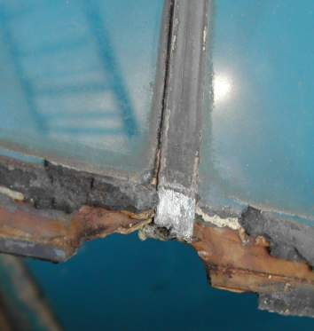
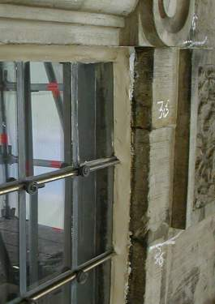
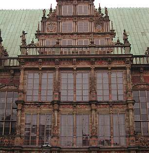

[🠔 Zur Übersicht: Fenster & Holzschutz](23bausto.md)  
# Historische Bleiglasfenster
**Worauf es ankommt bei der Reparatur historischer Bleiglasfenster.**  
_von Konrad Fischer • aktualisiert 09.04.2009_

## Altbautaugliche Verfahren und Baustoffe Kapitel 3 + 4 + 5

## Historische Bleiglasfenster [4]

Einige Hinweise zum komplexen Thema Restaurierung historischer Bleiglasfenster: 

Wichtig ist, von Anfang an das zuständige Denkmalamt (Das Bayerische Landesamt für Denkmalpflege BLfD München ist hier eine exzellente allgemeine Anfrageadresse) beteiligen. Der richtige Weg auch hier (keine Auftragszuschustereien!): 

Exemplarische Schadensbegutachtung, Bemusterung der Reparaturvorschläge, Öffentliche Ausschreibung mit höchsten Anforderungen an die Bieter, deren Baustellencapo die erforderliche Reparaturmethode persönlich nachweisen muß. Auch die bestandsgerechte Materialauswahl und Verarbeitung von passivierendem Rostschutz, von Leinölkitt und -farbe, nicht nur des gängigen Synthetikkrams. Dann bleibt echte Qualität auch im wirtschaftlich vernünftigen Rahmen.

Am Alten Rathaus in Bremen können Sie sich angucken, wie das nach dieser Methode funktioniert hat. Leider nicht mehr das Versagen des Industriekittmülls mit Alkydüberzug vorher.

 
Altes Rathaus Bremen, Schadensbild am Bleiglasfenster

 
Während der Montage des restaurierten Bleiglasfensters mit Leinölkitt

 
Das Ergebnis

Und wenn Sie wissen wollen, welche Formen von Pfusch vorherrschen - fragen Sie die Bewerber auf diesem Markt nach ihren Konkurrenten aus. Dann wissen Sie nach Überwindung der Rumdruckserei schnell, was Ihnen blüht. Aber bitte immer gegenseitig!

[Geschichte des Glases](http://www.glas.ch/geschichte.htm) - glas.ch 
[Die Geschichte des Glases (Glasermeister Wolfgang Gahl)](http://www.glaserei-gahl-berlin.de/Die_Geschichte/die_geschichte.html) 
[Geschichte des Glases aus Frauensicht ;-)](http://www.inkognito.net/members/frauensache/Nachrichten/Informiert/GE00060301.html) 
*******:****[Anneliese Scheder-Bieschin: Rosettenfenster der Blankeneser Kirche (mit hist. Überblick Glasfenster!)](http://www.blankenese.de/Kirche/KircheAmMarkt/13-Geschichte/rosette/inhalt.htm) 
[Fachbegriffe rund ums Thema Glas - Glaserei Kastenholz](http://www.glas-kastenholz.de/Fachbegr.html)

Weiter: [5. Tendenzen der Fensterperversion - Lüften / Dichten](23bau05.md)
