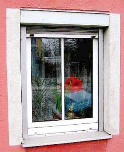

[🠔 Zur Übersicht: Fenster & Holzschutz](23bausto.md)  
# Tendenzen des Fensterperversion - Lüften und/oder Dichten
**Anlässlich der Fensterbaumesse „frontale 2000“ beleuchtet dieser Artikel die katastrophalen Folgen moderner, überdichter Fenster, wie Schimmelpilz und Atemwegsprobleme, und kritisiert das absurde Gegensteuern der Fensterbauer.**  
_von Konrad Fischer_

## Altbautaugliche Verfahren und Baustoffe Kapitel 3 + 4 + 5

## Tendenzen des Fensterperversion - Lüften und/oder Dichten [5]

Anläßlich der Fensterbaumesse "frontale 2000" in Nürnberg schreibt _"Glas+Rahmen 3/00"_ zur Katastrophe rund um den Schimmelpilz und die Asthmatoten durch überdicht-moderne Fenster und das absurde Gegensteuern der Fensterbauer [S. 20]: 

_"Zu Ende geht auch die Zeit der sogenannten Zwangsbelüftungen. Perforierte Dichtungen, Profil-Ausfräsungen und scheinbar Intelligente Lüftungsklappen, die in den letzten Jahren echte Verkaufsknüller waren, werden nach Einführung der verschärften Wärmeschutzverordnung [KF: namens Energieeinsparverordnung EnEV 2002 ff.] kein Thema mehr sein. Doch wo sind die Alternativen?"_

Sie erscheinen _"exotisch"_. Die verschärfte Katastrophe des künftigen Fensterbaus, ein heimtückischer Anschlag gegen Baukultur und Volksgesundheit wird dann noch frech und fast zu offenherzig in der Branche gefeiert [S. 21]:

_"Fensterbauer sollten jedenfalls wachsam sein und offen für Neues durch die Messehallen gehen, denn die exotischen, auf den ersten Blick zu aufwändigen und teuren Lösungen für Fenster, Rollladen, Beschläge und Lüftungssysteme könnten schon bald einträgliche Alternativen im Fenster- und Türenmarkt sein, der zusehends stärker von_ [korrupter? Anm. KF]_Politiker- und Funktionärshand geprägt wird. ..._

 
Schon sähr exotisch, wie ein exotischer Rollo das noch exotischere Sprossenplastikfenster mit Alusohlbänklein im ausländerfreundlich gefärbelten Baudenkmal verschönert. Plus exotisches Blumenarrangschmang. Deitsches Handwürg fom Alärphainsdn.

_... Und die Forderungen nach weitergehenden Anforderungen an den Wärmeschutz und die Einsparung von Energieressourcen werden angesichts der Verschlechterung des Erdklimas in Zukunft noch gewichtiger werden und ein probates Mittel abgeben, um Wählerstimmen zu gewinnen."_

Nun ist wohl auch dem letzten ahnungslosen Wähler klar, wozu die politisch und von Industriefunktionären Hand in Hand angezettelte und weitergeschürte [Klima- und Energiehysterie](7wsvoant.md) dienen soll.

Da das Fenster nun zur Lüftung nichts mehr beitragen soll, wird einige Seiten weiter folgende _"exotische Lösung"_ einer Hunsrücker Firma angepriesen [S. 26]:

_"Auf der fensterbau in Nürnberg stellen die Hunsrücker [...] einen Rolladenkasten mit integriertem Lüftungssystem vor. Er soll auch bei geschlossenem Fenster feuchte Luft nach draußen leiten und so vor Feuchteschäden und Schimmelpilzen schützen. Angebracht wird das Lüftungselement oberhalb des Fensters. [...] Der Kasten ist in verschiedenen Ausführungen erhältlich und auch für Altbauten geeignet."_

Fragen Sie nicht, was das kostet. Und erinnern Sie sich: Bei Großvaddern schaffte diese hochkomplizierte High-tech-Aufgabe ein simples Einfachfenster. (Wenn Sie aber noch die alten Holzrolläden haben, sind diese allermeist sehr gut erhaltungsfähig. Sie können auch simpel nachträglich elektrifiziert und über Funk und Zeitschaltuhr nachgerüstet werden. Und wenn Sie einen schreinermäßig fitten Rolladenbauer mit elektrischem Verständnis finden (es gibt sie wirklich!), bekommen Sie - trotz mancher Macken, verbogener Teile, gebrochener Stäbe und ausgeleierter Scharniere - fast jeden schönen alten Holz-Rolladen gebrauchstauglich nachgerüstet bzw. im alten Schick restauriert - mit vertretbarem Kostenaufwand. Egal ob in der Historismus- oder Jugendstilvilla oder im gehobenen Wohnhaus der 1920er aufwärts.

Zu den fensterbedingten Schimmelpilzen heißt es dann auf S. 100 wiederum klar und deutlich - der Beitrag stammt von einem gerichtserfahrenen Sachverständigen: 

_"...der immer häufiger sowohl bei Neubauten als auch bei Maßnahmen im Bestand auftretende Schimmelbefall [ist] nicht etwa ein "Kavaliersdelikt", sondern ein deutliches Zeichen für einen vorliegenden Bauschaden."_

Für den zunächst der haftpflichtversicherte (bei ihm ist immer was zu holen!) Planer - auch in seiner gesamtschuldnerischen Haftung, dann nachrangig der Fensterbauer (der seinen Pfusch nicht versichern kann und deshalb als unsicherer Kandidat betr. Regreßzahlung gilt) haftet.

Und so schreiben H. Curth und J. Lorenz in: _"Das Fenster als Energie-Funktionselement"_ , _bausubstanz_ 4/2000 zutreffend:

_"Sowohl an Gebäuden mit niedrigem Dämmniveau als auch an Gebäuden mit hohem Dämmniveau treten nach dem Einbau relativ luftdichter Fenster Bauschäden in Form von Tauwasserniederschlag und Schimmelpilzbildung auf. Selbst in Wohnungen, die vorher von dem gleichen Personenkreis schadlos bewohnt wurden, nehmen die Klagen über die Schimmelpilzbildung zu."_

Schärfer kann man die Forderung nach Bestrafung der Fensterprofis für ihren Anschlag auf die Volkswirtschaft und -gesundheit wohl kaum herausarbeiten. Das Lüftungsverhalten spielt also keine Rolle, Wärmebrücken gibt es nicht, die fehlkonstruierten teuren Fenster sind in Verbindung mit heizluftstromunterversorgten kühlbleibenden Raumecken schuld daran, daß Bauschäden en masse und schreckliche Gesundheitsstörungen die Wohnungsnutzer vorsätzlich schädigen. Ein Ergebnis falscher Bauphysik im Dienst der Industrie. Die dann noch mit der Empfehlung, es läge an Wärmebrücken, man müsse mehr dämmen, den doofen Michel noch weiter schröpft. Was wirklich hilft: Bessere Dauerlüftung und [Hüllflächentemperierung](7temper.md).

Den "fensterbau frontale 2000"-Seminar-Unterlagen zum Architektentag/Fensterforum 23.-25. März 2000 des i.f.t. Rosenheim, Institut für Fenstertechnik e.V., Rosenheim, [www.ift-rosenheim.de](http://www.ift-rosenheim.de) und den Antworten auf kritische Nachfragen an die Referenten ist zu entnehmen:

1. Dr. Wolfgang Feist, Passivhaus-Institut Darmstadt hielt einen Fachvortrag: **_"Fenster für Niedrigenergie- und Passivhäuser - Konstruktion und Wirkungsweise"_** für die von seinem eigenen "Institut" "zertifizierten Passivhaus geeigneten Fenster 2000". Offenbar weniger für die eingeladenen schon passivhauszertifierten Architekten, sondern für die von ihm noch unzertifizierten Fensterbauer. Er gab auf Nachfrage zu, daß die übermäßige Dämmung zu erhöhter Kondensat- und Eisbildung auf der Gebäudehülle und den Fenstern von außen hervorrufen kann (logischerweise verbunden mit höchster Konstruktionsbeanspruchung und vorzeitiger Baustoffkorrosion). 

Außerdem mußte Feist eingestehen, daß seine bunten Folien und Tabellennachweise die durch elektrischen Strom erzeugte Heizenergie unterschlugen und nur auf den Öl- bzw. Gasverbrauch bezogen waren. Halbe Wahrheiten. Einer von Prof. Schmid zur Abwürgung kritischer Nachfragen angeregten Vor-der-Tür-Diskussion mit kritischen Architekten entzog sich der dissertierte Physiker vorsichtshalber durch Abreise. 

Daß die von ihm zertifizierten bzw. auf den Dämmwahn hereinfallenden Fensterbauer ebenso wie die dies befördernden Planer möglicherweise einer Prozeßlawine wegen Gesundheitsschädigung ihrer Kunden bzw. Bauschäden durch ihre bei genauer Betrachtung mangelbehafteten und falsch deklarierten Fensterkonstruktionen (vgl. "falsche Inverkehrbringung" gem. ProdHG, Beratung als Nebenpflicht des Planers mit 30jähriger Haftungsfolge gem. BGB - der Kunde bleibt gegenüber den Feuchte- und Gesundheitsrisiken nach Einbau überdichter Fenster unaufgeklärt) entgegensehen, blieb unerwähnt.

2. Es wurde auch von Feist sinngemäß zugegeben, daß die "Fachdarbietungen" sich nur auf Wohnräume mit Konvektionsheizung beziehen, wodurch Nässe- und Schimmelbildung sowie Kaltluftströmung an der gegenüber der erhitzten Raumluft kühleren Bauwerkshüllfläche ohnehin so gut wie erzwungen wird - und dann - in innigster Verbindung mit den so hoch gepriesenen Dicht-Fenster-Konstruktionen - zwangsläufig so aussieht:

 .  
_Schimmelbefall / Schimmelpilz-Befall / Schwarzschimmel (teils abgereinigt) am überdichten und teils kondensatbedingt erblindeten Isolierglasfenster, auf Silikonkittfuge, auf dispersionsgestrichener luftdichter Glasfasertapete und darunter an dispersionsgestrichener Wand an Wand-Boden-Zwickel/-Ecke (Bilder aus Bauberatung)_

3. Prof. Dr. Wolfgang Richter, Institut für Thermodynamik und Technische Gebäudeausrüstung der TU Dresden, gab vor dem Plenum in geschraubter Verklausulierung zu, daß die [kritischen Anmerkungen des Dresdner Prof. Roloffs über die mangelhafte Wirkungsweise der "Stoßlüftung" zur Raumentfeuchtung](7wdvs15.md#roloff) zutreffen, und stieß ins gleiche, mit Roloff angeblich abgestimmte Horn in seinem Vortrag: **_"Welche Möglichkeiten bietet die Fensterlüftung zur Verhinderung des Schimmelpilzbefalls unter den Bedingungen einer nahezu fugendichten Bauweise (Niedrigenergiehaus)"_**. Zitate/Zusammenfassende Kommentierung der Aussagen:

_"Bereits seit längerer Zeit wird auf den Zusammenhang zwischen dem Anstieg des Schimmelpilzbefalls in Wohnungen und der vermehrten nahezu fugendichten Bauweise hingewiesen." "Schimmelpilz nach Fensteraustausch"_ gegen gummilippendichte Wärmedämm-Fenster-Konstruktionen, nach dem angeführten _"Bauschadensbericht der Bundesregierung 1995"_ der wichtigste Schadensfaktor aller Bauschäden, erreicht nach anderen Untersuchungen _"bis zu 40%"_ Bauschadenshäufigkeit _"in Folge von Sanierungsvorhaben",_ womit natürlich "energetische Verbesserung/Sanierung" gemeint ist. 

Diese Zahl könne bei genauer Untersuchung auch höher sein. Maßgeblich ist dabei entgegen früheren Falschannahmen nicht das _"Unterschreiten der Taupunkttemperatur"_ , sondern der wesentlich geringeren _"Schimmelpilzkritischen Temperatur"_ , die eben auch in "_Niedrigenergie- und Passivhäusern"_ schnell erreicht wäre. Dies ist natürlich nur in konvektionsgeheizten Bauwerken bzw. Räumen mit Fußbodenheizung - im Unterschied zur [Hüllflächentemperierung](7temper.md) - überhaupt möglich und kommt nach den Untersuchungen der TU Dresden vorwiegend im Schlafzimmer mit 40%, gefolgt vom Kinderzimmer - 30% und dem Bad mit 13% vor. Und deshalb ist ein ständiger _"Mindestluftwechsel auch ohne Nutzerzutun"_ unabdingbar, um ein erträgliches und schadensfreies Raumklima zu garantieren. 

Daß dies am besten durch Verzicht auf die modernen überdichten Fensterkonstruktionsperversionen möglich ist, wollte und konnte Prof. Richter in der hier nachbohrenden Diskussion nicht widerlegen. Das Zähneknirschen hierzu der anwesenden Fensterbauer und Dämmfanatiker war bis in die letzte Reihe zu hören. Dabei wies Prof. Richter zutreffend darauf hin, daß gerade bei geringen Temperaturunterschieden zwischen Raum und Außenluft die Ablüftung der Raumluftfeuchte erhöhter Luftwechselraten bedarf. Kaltluft ist eben trockener und kann deshalb feuchte Raumluft durch höhere Feuchteaufnahme besser und schneller "entfeuchten". 

Also: Je wärmer es draußen ist, umso länger bzw. intensiver muß gelüftet werden, um Feuchte von innen abzuführen. Die _"Nachlüftung"_ der einmal durchfeuchteten Außenwände durch Stoßlüftung als blanke Illusion belegten Prof. Richters vergleichende Untersuchungen mit eindrucksvollem Datenmaterial. Resultat nach Prof. Richter: _"Ein Drittel aller Deutschen sind mittlerweile Allergiker"_! Der Rest gehört noch zum Kundenpotential der deutschen Fensterbau- und Wärmedämmindustrie.

4. In seinem Beitrag **_"Vergleich der Fensterlüftung mit alternativen Lüftungsverfahren unter den Bedingungen einer nahezu fugendichten Bauweise (Niedrigenergiehaus)"_** kommt Prof. Richter dann zu folgenden Aussagen, die die Falschinformationen und schon oben angesprochenen Halbwahrheiten der Lüftungsbauer und Dämmtheoretiker recht vornehm geißeln:

_"Es verwundert [...] nicht, dass aufgrund völlig gegensätzlicher Auffassungen zu diesem Thema [Lüftungsverhalten des Nutzers] entsprechend unterschiedliche Ergebnisse zur Wirtschaftlichkeit und zur energetischen Effektivität konkurrierender Lüftungsverfahren veröffentlicht werden._

_Auf der Basis von umfassenden und ganzheitlichen Betrachtungen lässt sich zeigen, dass bei Voraussetzung der bisher im allgemeinen zum Einsatz gekommenen Anlagentechnik die Fensterlüftung gegenüber Zu- und Abluftanlagen mit Wärmerückgewinnung aus primärenergetischer Sicht (d.h. unter Einbeziehung der gesamten Prozesskette bis hin zum Kraftwerk) überlegen ist."_

Dies beweist auch die mit diesem Link erreichbare [Untersuchung des Fraunhofer Instituts für Bauphysik an 9 gemessenen "Niedrigenergiehäusern"](7wdvs09.md#rentabilitã¤t+der+anlagentechnik+nicht+nachweisbar), die ausschließlich die reinen Baukosten betrachtet.

Dabei ging Prof. Richter - um die Aussagen der anwesenden weiteren Referenten (Feist/Fröhlich) nicht gänzlich zu konterkarieren? - auf das [Verschleimungs- und Verkeimungsverhalten mit gesundheitsschädigenden Folgen der anlagentechnischen Zwangsentlüftungen](23bau02.md) noch gar nicht ein.

Welche Gesundheitsschäden technisch ahnungslose Familien in zwangsgelüfteten Passiv-"Haus" praktisch erfahren müssen, belegt ansatzweise dieser Forumsbeitrag bei Fachwerk.de: [Niedrige Luftfeuchte im Passivhaus - hilft Lehmputz?](http://www.fachwerk.de/goForum.html?id=39824)

Und wie sich die Fensterkonstruktion zum Entfeuchtungsserfolg verhält, zeigt das Buch _"Bauphysik nach Maß"_ , Beton-Verlag 1995, mit folgenden Werten zum Wasserdampftransport aus Wohnräumen:

Situation: Aw = 38,6 m2 (77,2%) 

AF = 11,4 m2 (22,8%) 

Geschlossene Bebauung 

Klima: Außen 0oC/65% r.F. Innen 22oC/40% r.F. 

Wenig Wind 

Ergebnis: Wassertransport durch **Mauerwerk** **7,4 g/h** 

**Fensterfugen** 

ohne **59,0 g/h** 

mit Dichtung **3,9 g/h** 

**Fensterlüftung** 

Kippstellung **140 g/h** 

ganz geöffnet **4540 g/h** 

Ein schlechter Witz: Die Entfeuchtungsleistung durch die Mauer ist fast doppelt so hoch wie durch lippendichte Fenster. Wer sagt da noch, daß "Wände nicht atmen" können? Wobei die hervorragende Entfeuchtung durch das ganz geöffnete Fenster bei Stoßlüftung nach [Prof. Roloffs Untersuchungen](7wdvs15.md#roloff) nur auf die Raumluftfeuchte wirkt und die schon in den Bauteilenporen gespeicherte Nässe kaum beeinflussen kann.

5. In seinem Beitrag **_"Die neue Energiesparverordnung 2000 - Beachtenswertes für Fenster-, Fassaden- und Türenhersteller"_** trug der Fachhochschul-Dipl.-Ing. und sogar Lehrbeauftragte Hans H. Froelich, langjähriger Mitarbeiter des ift und als Mitglied im Normenausschuß Mitverursacher der [widersinnigsten Regelungen der zugrundeliegenden DIN 4108](7d4108kf.md), zur weiteren Desorientierung der Branche bei. Immerhin mußte er zugeben, daß es viele [Einsprüche gegen den Entwurf der EnEV](7enevrlp.md) gäbe, die nun bearbeitet würden. 

Die immer intelligenteren Verrenkungen der Rechenkünstler, die dem Verbraucher nicht nur ein X für ein U vormachen, sondern zur Steigerung der Begriffsverwirrung nun den k- zum U-Wert umdeklarieren, führte Froelich geradezu zynisch vor. Nur noch mit ausgeklügelten Softwareprogrammen (die dann alle auch total unterschiedliche Ergebnisse liefern!) ist im EnEV-Wahn der "Wärmebedarfsnachweis" vom Einfamilienhaus aufwärts zu bewältigen. Schön für die Softwareschmieden, die Bauphysiker, die Dämm- und die Anlageproduzenten. Wer muß das bezahlen? Der Michel. Wie die Fensterbauer und Bauphysiker das begeistert, zeigte ihr froehlicher Applaus. Was Froelich freilich wie immer verschwieg: 

_**"Der k-Wert steht in keinem mathematischen Verhältnis zum Energieverbrauch eines Gebäudes"** (Therma-Wettbewerb des Bundes)_

Damit sich die Erinnerung an derartige kontraproduktive Forschungsergebnisse möglichst schnell verflüchtigt, nun die "Abschaffung" des k-Wertes zugunsten des U-Wertes.

Daß die Bedarfsversprechungen (Stichwort Wärmepaß) der EnEV weitgreifende Haftungsfolgen für die Planer und das Handwerk bei Beanspruchung durch wirtschaftlich, technisch und gesundheitlich getäuschte/geschädigte Investoren, Vermieter und Mieter zur Folge haben, vermochte Froelich nicht zu widerlegen. Das in der Diskussion vorgebrachte Thema war ihm sichtlich peinlich, er sah sich zur Aussagenkorrektur betr. Realitätsnähe seiner Darlegungen gezwungen. Damit war klar: Der [angeblich niedrige Energiebedarf](7wdvs05.md#wã¤rmedã¤mmung) wird nur auf dem geduldigen Papier und den falschen stationären Rechenannahmen rund um den k/U-Wert existieren.

6. In ihrem Seminarbeitrag **_"Fenster und Fensterwände - Abdichten und öffnen_**[Kleinschreibung im Original, Anm. KF]**_an der richtigen Stelle"_** lassen dann Prof. Dipl.-Ing. Josef Schmid und Dipl.-Ing. Peter Niedermaier, beide vom i.f.t. Rosenheim, dann endgültig die Sau raus [Hervorhebungen KF]:

_"Mit der damit [Wärmedämmung und Abdichtung der Fassade] einhergehenden**Verbesserung der Luftdichtheit** von Gebäuden, dem **Einsatz neuer Fenster** und einer **verbesserten Außenhülle** geht eine **Reduzierung der Luftwechselraten** des Gebäudes einher [...]. Hieraus resultieren im Allgemeinen **höhere Luftfeuchten** im Gebäude und somit höhere **Taupunkttemperaturen** , welche die Wahrscheinlichkeit zur **Schimmel- und Tauwasserbildung** in Bereichen von Wärmebrücken erhöhen, wie beim Baukörperanschluss von Fenstern. Diese Probleme treten sowohl **bei sanierten Altbauten** als auch **bei Neubauten** auf._

_Für die verbleibenden Fugen und Fehlstellen bedeutet dies, dass ein erhöhter Wasserdampftransport durch sie hindurch stattfindet; die**Menge des ausfallenden Tauwassers erhöht sich im Vergleich zum "undichten" Gebäude wesentlich**. Der **gesamte Baukörperanschluss** wird einer **höheren Belastung** ausgesetzt."_

Das heißt auf Deutsch: Pfusch am Bau. Wobei die dank Dichtung erhöhte Feuchte auch mehr zur Holzverrottung und Bauteilkorrosion beiträgt und die Dichte dann extrem erhöhte Vergiftungsraten durch Luftschadstoffe garantiert, haben die Herrschaften vom i.f.t. aus Dummheit oder gar absichtlich? ganz unterschlagen. Daß die beiden Experten dann nicht etwa zur kostensparenden Variante - Belassen des technisch/hygienisch/energetisch hervorragend funktionierenden Bestands und Weiterführung traditionell trockener Bauweisen - sondern zur technofreakigen Konstruktionsperversion mit vorhersehbar schlechtem Ergebnis anraten, ist wohl ihrer Rolle im Marketing und der bekannten Drittmittelabhängigkeit ihrer ganz und gar nicht neutralen "Brotwissenschaftler-Forschungen" [frei nach Schiller] zuzuschreiben. Mit sauberer Kunden- bzw. am "Messe-Architektentag" hochheilig versprochenen "Architektenaufklärung" hat das aber gar nichts mehr zu tun. Sonst hätte man mehr sagen müssen:

 * zur bestenfalls nur kurzfristigen Dauer von kunstharzgestützten Abdichtungssystemen und den bekannten pilzverseuchten abgesoffenen Wärmedämmkonstruktionen im Holzbau,
 * zu den vorliegenden Meßergebnissen des Energieverbrauchs (Therma-Wettbewerb des Bundes, Bossert, [Fehrenberg](7fehrtab.md)) mit katastrophalem Ergebnis für die Dämmtheorie, 
 * zu den kraß unwirtschaftlichen Ergebnissen aufwändiger Dämm- und Dichtungsanstrengungen ebenso wie der empfohlenen Zwangsentlüftung mit Wärmerückgewinnung usw.
 * zur [Unfähigkeit von Dämmstoffen, Temperaturveränderungen zuwiderstehen](2139bau.md),
 * zur Problematik, daß es kühle und deshalb kondensatverurteilte Außenwände/Außenwandanschlüsse nur bei Konvektor-/Radiator-/Fußbodenheizung gibt, nicht jedoch bei der [Hüllflächentemperierung.](7temper.md)

Und nicht die kritischen Diskussionsansätze - so schnell wie es ohne Gesichtsverlust gerade noch geht - abgewürgt. Dafür wurde dann aber ausreichend gejammert über das peinliche Problem, daß an hochdedämmten Fenstern zwar die Scheibenmitte innen warm bleibt, die innere Glas-Rahmen-Kante jedoch als Kondensatfalle "beregnet" wird. Und hier will man abhelfen: Größere Rahmenüberdeckung durch Außendämmung und weitere Komplizierung des Fensterprofils. Das verteuert zwar die Konstruktion - aber bleibt eingestandenermaßen ohne jeglichen Einspareffekt. Heilige Einfalt.

Sehr nachdenklich machten die recht bösartigen Podiumsaussagen über die Schimmelforschung von Prof. Gertis und seine bekannte Empfehlung, Gummilippendichtung im Fenster als schimmelverursachendes Konstruktionsbestandteil nachträglich zu entfernen. Daß dagegen die von Schlechtachtern geforderte Dämmung der Schimmelzonen nichts bringt, hat Gertis zutreffenderweise selbst publiziert (Merke: Erhöhte Wachstumsraten von Schimmelpilzen sind gerade bei gem. WSVO/EnEV/Klimaschutz gedämmten Gebäuden üblich - so Prof. Dr.-Ing. habil. Dr. h.c. mult. Dr. E.h. mult K. Gertis u.a., Fraunhofer Institut für Bauphysik: Klimawirkungen und Schimmelpilzbildung bei sanierten Gebäuden, in: DFG-Forschungsschwerpunkt Bauphysik der Aussenwände, Int. Bauphysikkongress TU Berlin 1997, Fraunhofer IRB Verlag, Stuttgart 1997). Mit der Entlarvung des Dichtungsblödsinns hat Gertis bei den Fensterbaufritzen in ein Wespennest gestochen. Bravo! Ist das gar abgeguckt von dem unvergeßlichen Hamburger Sachverständigen Rolf Köneke (+ 2002)? Schon seit der WSVO-Verschärfung der deutschen Schimmelpest empfahl er, in mindestens drei Wohnungsfenstern die oberen Lippendichtungen auszubauen, um Schimmelgefahren zu verringern. Schade für den Hausbesitzer, wie schnell erfahrungsgestütztes Fachwissen und anständige Handwerker aussterben - aber herrlich für die energiegewendete Baubranche.

Genau so, wie die Dichtungsopfer? Das Superdichten der Fensterbranche ist ja durchaus auch als gewissenloser Anschlag nicht nur auf die Baukultur und den Baugeldbeutel des Hauseignetümers, sondern auch auf Leib und Leben des abgedichteten Wohnungsnutzers zu verstehen. Mehr und mehr Nutzer müssen inzwischen aus superdichten Wohnungen gerettet werden, bevor sie am Kohlenmonoxid ihrer sauerstoffunterversorgten Gasthermen verrecken. ORF berichtet im Winter 2010 von einer geradezu spektakulären ["Serie von CO-Vergiftungen"](http://wien.orf.at/stories/486065) in den energetisch sanierten Wiener Mietlöchern und zitiert einen herbeigerufenen Installateur wie folgt: _""Eine zu dichte Gebäudehülle und neue Fenster bedeuten, dass zu wenig Luft nachströmt, und wir einen Unterdruck im Raum erzeugen" ... Es bilde sich Luftmangel, der zum Austritt von Abgas und zur Bildung von Kohlenmonoxid (CO) führen könne. Verschärft wird das Problem in Badezimmern oft noch durch Abluftventilatoren, die zusätzlich Luft absaugen."_ 

Aha. Die Therme funktioniert mit zu wenig Sauerstoffnachschub nicht wie gewünscht. Und der Mensch? Der muß es eben aushalten oder verrecken, wenn seine Bude von den geldgierigen Schreinerschweinen vorsätzlich mit immer dichteren Hermetikfenstern zugekleistert wird. Ja freilich, ist doch seine Schuld, wenn das dreckige deutsche "Klimaschwein" (Originalton Bütikofer, DIE GRÜNEN) nicht ein paar klimagefährdend-erderwärmende Millisekunden stoßlüftet, um irgendwie doch noch gerade noch notdürftigst zu überleben. 

Und auch das Ausland, das dem deutschen Ökofaschismus nacheifert wie anno dunnemals, muß so sein Erfahrungen machen, wie man die Leute mit feist-deutschem Passivhausunwesen ausrottet: 

["Belgian Passivhaus is Rendered Uninhabitable by Bad Indoor Air](http://www.greenbuildingadvisor.com/blogs/dept/musings/belgian-passivhaus-rendered-uninhabitable-bad-indoor-air), Inward solar vapor drive and damp earth tubes conspire to ruin an expensive new superinsulated home" - sinngemäß auf Deutsch: "Belgisches Passivhaus wird unbewohnbar durch schlechte Raumluft, durch Sommerkondensat verrottende OSB-Platten und feuchte Rohre des Erdwärmetauschers verschwören sich, um ein teures neues supergedämmtes Haus zu ruinieren." Na was, und der Passivhaus-Planer und dessen willige Handwerkshelferleinchens sind da gaaanz unschuldig dran? 

["Dichte Fenster: Dicke Luft an Nürnberger Schulen - Energetische Sanierung sorgt für hohe Formaldehyd-Konzentration](http://www.nordbayern.de/nuernberger-zeitung/nuernberg-region/dichte-fenster-dicke-luft-an-nurnberger-schulen-1.1799733) - NÜRNBERG - Weil nach der energetischen Sanierung der Gebäude die Grenzwerte für Raumluft bei Formaldehyd erreicht und überschritten werden, müssen an drei Nürnberger Schulen Lüftungsmaßnahmen durchgeführt werden. An drei weiteren Schulen sowie an einer Kindertagesstätte wurde 2-Chlorpropan gefunden. Auch in diesen Fällen soll gezielt gelüftet werden, obwohl es keine Richt- und Grenzwerte für diese chemische Verbindung gibt. 2-Chlorpropan wurde früher in hoher Dosierung als Narkose-Gas eingesetzt. ..." Aha, wieder mal ein Gasangriff auf die deutsche Bevölkerung, jetzt werden schon unsere Kinder ins Gas geschickt - und all die willigen Helfer und Helfershelfer sitzen ihren fetten Arsch auf Beamtensesseln wund oder verdienen sogar Geld damit! Auschwitz 2.0 und wieder machen alle mit ... 

Ja, ja, ich kenne schon eure perfide Ausrede, ihr pervers-scheinheilig über Menschenleben, egal ob von Frau, Mann oder Kind, dahinökologisierenden Schreinermeisterleins neudeutschester Prägung: "Die Regierung will es ja so", ja freilich, freilich, die war ja auch früher gaaanz alleine zuständig für das Vergasen und Vergiften der unterprivilegierten Bevölkerungsschichten. Mein Gott, welch krumme Wege die Bevölkerungsdezimierung heute gehen muß, sollte man die überzähligen Prekariatler nicht einfach auf der Straße totschlagen? Dann könnten doch die Ökofaschos der Klimaschutznomenklatura ihren Sadismus direkt und zum Zugucken ausleben. Und die geldgeilen Schreinermeister können dann immer noch die Leichen fleddern und ihre Goldimplantate rausrupfen und ihre sonstigen Arisierungvergnügen ausleben, dann sind sie auch wieder mal zufrieden, oddä? Dämmokratur heute, im Schland der Dichter und Dämmer. 

Weiter: **[Fensterprobleme: 6](23bau06.md)**
