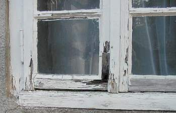
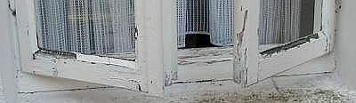
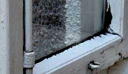
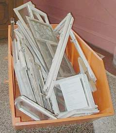
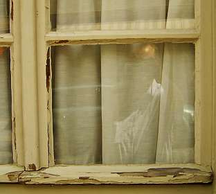

[🠔 Zur Übersicht: Fenster & Holzschutz](23bausto.md)  
# Geeignete und ungeeignete Farbsysteme auf Holzuntergründen im Innen- und Außenbereich
**Geeignete und ungeeignete Farbsysteme auf Holzuntergründen im Innen- und Außenbereich.**  
_von Konrad Fischer_

## Altbautaugliche Verfahren und Baustoffe 
Kapitel 3+4+5 - Fenster / Holzanstrich / Holzschutz

## 4. Geeignete und ungeeignete Farbsysteme auf Holzuntergründen im Innen- und Außenbereich [8] 

Seit dem Einsatz moderner, schnelltrocknender und angeblich von jedem Ungelernten leicht verarbeitbaren Kunstharzbeschichtungen auf Holzuntergründen im Außenbereich ist das Holzfenster in Verruf gekommen. Richtigerweise schreiben Apel/Hantschke in "Oberflächenbehandlung von Holzfenstern: Konstruktion, Anstrich, Wartung", DVA 1982: 

_"[...] der Übergang von Ölfarben auf Alkydharzsysteme beim Anstrich führte zu Schäden, die dem Image des Holzfensters [nach dem zweiten Weltkrieg] schwer geschadet haben." (S. 15)_

Mit derartigen Anstrichsytemen ist der Bauschaden am Fenster und natürlich auch bei allen anderen bewitterten Holzoberflächen wie [Fachwerk](23bau10.md#fachwerkanstrich) vorprogrammiert. Ihre Versprödung, gepaart mit trocknungsblockierender Flächenabdichtung verurteilen jeden bewitterten Holzuntergrund zur vorschnellen Zerstörung. 

Das Fraunhofer-Institut für Holzforschung, Braunschweig schreibt dazu in den ibau-Planungsinformationen am 3.4.01:

**_"Holzfenster: Da ist der Lack noch lange nicht ab!_**

_Braunschweig - ... Möglichst wirksam und lange müssen Lacke das Holz vor Sonne und Regen schützen - und das bei wechselnden Temperaturen. Deckend pigmentierte Lacke erfüllen diese Forderung nur zwei bis fünf Jahre. ... Transparente Lacke für Außenanstriche werden noch gar nicht auf dem Markt angeboten, denn sie weisen einen entscheidenden Nachteil auf: Die Sonnenstrahlen durchdringen den Lack. ...[worauf sich der Lack vom Untergrund ablöst]"_

Schauen Sie sich mal die lackierten Holzfenster Ihrer Umgebung auf Versprödung an. Vor allem an Wetterschenkel, Schlagleisten und Profilkanten. 

Extrem wird der Schadensfortschritt bei "Sanierung" der meistens schon nach Jahreswechsel aufgetretenen Anstrichschäden im gleichen kunstharzhaltigen, wegen seiner schnellen Versprödung erhöht bewitterungsempfindlichen "System". Die Negativeigenschaften der Kunstharzfarben potenzieren sich dann.

 
So schön kann Fensterlack altern ...

 
und auch ein Fenster des späten 19. Jhs. beschädigen. Nicht nur außen, ...

sondern dank herabrinnender Innenkondensation sogar beidseitig.

 
_[Fensterrestaurator Johannes Mosler](http://www.johannes-mosler.de/): Installation Altfenster in Baustellencontainer (Treppenhaus im Landesamt für Denkmalpflege Rheinland-Pfalz, Aufnahme: Konrad Fischer)_ 

Da an diesem Dilemma bestimmt die alten Fenster schuld sind - auf den Müll damit. So läßt sich doch am schönsten Geld verdienen. Das hätte jedoch nicht sein müssen, und zwar aus mindestens zwei Gründen:

Erstens prüfen Sie mal, ob das Fenster überhaupt handwerklich richtig gestrichen ist? Und zwar mit übermalter Glaskante. In der Folge falscher Maltechnik läuft innen das Kondensat und außen jeder Regen in die nicht ausreichend durch Anstrichüberdeckung geschützte Glas-Kitt-Rahemnfalz-Fuge, tränkt dort das Rahmenholz feucht, feuchter geht nicht! Und zwingt damit die sich im Holzquerschnitt aufgrund der typischen Materialsaugfähigkeit verbreitende Feuchte bei allfälliger Trocknung den Weg durch die dünne Farbschicht zu gehen. 

Meine Güte, Wasser hat auch im Holz ungeheuere Kräfte. Ganze Marmorblöcke kann es so mit nassem Plöckli aus dem Gebirgsstock raussprengen. Da wird es mit dem bisserl Lack auf dem unteren Rahmenholz innen und dem Wetterschenkel außen ganz bestimmt noch besser fertig. Und reißt dort die Beschichtung nach Herzenslust durch und kurz und klein. Nur weil "vergessen" wurde, mit ein paar Millimetern horizontaler Kantenüberbemalung ins Fensterglas hinein und auch dort, wo sonst noch Wasser ansteht - also etwa eine Handbreit über der unteren Rahmenholz-Aufstandsfläche an den seitlichen Flügelrahmenprofilen - dem Wasser über die kritische Fuge zu verhelfen. Die sich freilich schon wegen der dort auftretenden Materialspannungen wegen kraß unterschiedlicher Wärmedehnung/Temperaturdehnung immer gerne öffnet und deswegen mit den geeigneten Vorkehrungen (einst Malergrundwissen!) im Griff zu halten ist. 

Noch mehr? Also zweitens: Entscheidend sind auch die Materialeigenschaften der vom Maler verwendeten Malstoffe. 

Auch in den neuen Bundesländern klappt es nicht besser

Das untere Rahmenholz ist dank harzhaltiger Beschichtung schon durchgemorscht. Das obere noch nicht ganz.

Schadensbeispiel am Hause meiner Mutter - Ausführung: ein ortsansässiger Malermeister, Produkte: Eine große "Coatings-Firma". Bereitschaft zur Gewährleistung und Schadensbeseitigung bei beiden: Null und Nix.

1->2->3-> 
3-jähriger Alkydharzanstrich auf Holzfenster - 
Bild 1: Absplitternd, gerissen und blasenbildend - Bild 2: Gerissener, versprödeter, kapillarsaugender Leinölkitt, Blasen-/Schollen-/Rißbildung - Bild 3: Blasenbildung an Innenecke

Diese durch handwerkliche Fehler vorprogrammierte Sanierungsanfälligkeit von Kunstharzbeschichtungen bietet eine lukrative und dauerhafte Einnahmequelle. Allerdings nur solange, wie der Kunde auf sein Reklamationsrecht verzichtet und sich mit diesem Bauschwindel begnügt.

Hin und wieder verdient sogar der Zimmermann an solchen handwerksbedingten Baumängeln - ganze Fachwerkstädte können so durch Sanierpfusch kaputtsaniert werden: Hausschwammdestruktion und folgender Trotzkopfbefall im kaputtgestrichenen Eichenfachwerk. Gefunden durch gezielte Suche bei einer [Bauberatung](2berat.md).

Der wackere ö.b. Sachverständige und Tischlermeister Fritz Jurtschat führt seit Jahren in der Zeitschrift "Bauhandwerk" einen vergeblichen Kampf um das gute Fenster. Gerade die Anstrichprobleme bieten ihm immer wieder Zündstoff, so auch in BHW 3/04. Auszug aus seinem Beitrag:

**_Diagnose: Blau 
Schadensbericht: Bläuebildung auf hell lasierten Kieferholzfenstern_**

_Der Wunsch nach Holzfenstern, bei denen die Holzstruktur sichtbar bleibt, ist ungebrochen. Architekten, Bauträger und Bauherren lassen sich nicht davon abbringen, hell lasierte Fenster einzubauen. Sie ignorieren die Tatsache, dass helle Naturholzfenster im Vergleich zu deckend beschichteten Fenstern eine höchst kostspielige Alternative sind._

_...vornehmlich die zur Gartenseite gelegenen Fenster, aber auch die Fenster in den Gauben der Nordseite in den Brüstungsbereichen und auf den Sprossen dunkelbraune bis blauschwarze Stellen aufwiesen. ... Die Fensterrahmen ... haben eine Oberflächenbehandlung mit hellgelber Farblasur aus Acrylharz erhalten. Deren wesentlicher Unterschied zu herkömmlichen Lacken ist das Dispersionsmittel Wasser._

_Die Mängel waren bei allen geschädigten Fenstern ... gleich: Die unteren Querstücke zeigten vor den Stockabdeckungen, dass die Farblasur aufgeplatzt war und sich Bläue auch in den Brüstungsfugen gebildet hatte. Von den Sprossenrahmen hob sich die Lasurschicht ab. ... der aufrechte Blendrahmen, das untere Querstück und die die Sprossenrahmen-Ecke waren durchfeuchtet, blauschwarz verfärbt und aufgequollen. In der Zwischenzeit waren an der linken unteren Ecke Fruchtkörper des Pilzes "Lencytes" ausgetreten. Dies weist auf eine von innen ausgehende Zerstörung der Holzsubstanz hin. ..._

_Wasser ist ein "Feind" des Holzes. Die Verwendung von Wasser, welches gerade Nadelholz sofort zum Quellen bringt, anstelle von organischen Lösemitteln, die keine Quellung verursachen und zusammen mit fungiziden Stoffen mehrmals angewendet werden können, ist nur mit politischem Druck zu erklären. Diese Vorgehensweise entspricht keineswegs den anerkannten Regeln der Technik. ..._

_Im konkreten Fall hat das Holz - wenn entsprechend lange (im Imprägniermittel) getaucht wurde - Wasser aufgenommen und unter Volumenschwund der Fensterprofile später wieder abgeben. So lassen sich die offenen Brüstungsfugen und die Lackrisse erklären. ... Die schädigende Wirkung des Bläuepilzes tritt bei lackierten Hölzern auf, wenn (nach erster Bläuebildung) erneut Feuchtigkeit ... aufgenommen wird und das Myzel und die Fruchtkörper den Anstrichfilm durchbrechen. Dabei entstehen (im nicht ölhaltig imprägnierten Fenster) Eintrittsöffnungen für Feuchtigkeit, so dass sich unterhalb des (sperrenden, aber aufgebrochenen) Anstrichfilmes im Holz Fäulnis bilden kann, die sich schnell ausbreitet._

_Diese Fäulnis wird vom "Zaunblättling" (Lencytes sepiaria) hervorgerufen ... (ein Substratpilz, dessen) Myzel im Inneren des Holzes wächst. .. zunächst die äußeren Holzschichten befallener Querschnitte noch relativ fest erscheinen, so dass die Zerstörung des Holzes lange Zeit unbemerkt bleibt. ..._

_Die Rezepturen der Lackindustrie wurden ... viele Male geändert, um das beschreibene Quell- und Trocknungsverhalten des Kiefernholzes günstig zu beeinflussen und die sogenannte Nasshaftung auf dem Holz zu verbessern. Das ist bis heute nur unzureichend gelungen. ..."_

Kunstharzanstriche, die die übliche BGB-Gewährleistungszeit von 5 Jahren schadensfrei überstanden (und das müssen sie als Arbeiten an Gebäuden nach der Rechtsprechung!), sind schwer zu finden. Dafür allerdings Ausreden zu Hauf. Oft zu hören und sehr überzeugend: 

"Wir verarbeiten die Kunstharzfarben schon seit vielen Jahren." 

Es scheint sie also nicht zu geben - ganz im Unterschied zu reinen Ölfarbanstrichen, die ja auch im Wartungsfall einzigartige Vorzüge aufweisen. Gut rezeptierte Ölfarben wittern nämlich bei vernachlässigter Bindemittelrückversorgung (übermäßig bewitterte Problemstellen alle paar Jahre mit in Leinöl getränktem Lappen "nachrüsten") sehr langsam, überwiegend flächig ab und können so "beigestrichen" werden. Versuchen Sie das mal bei aufgerissenen versprödeten Kunstharzanstrichen! Außerdem sind Ölfarben betr. [Wärmedehnung](29bausto.md#temperaturdehnung) näher am Holz, als knallhart versprödende Harzfarben.

Schon seltsam, sich nun für die Endbeschichtung der Holzfenster ausgerechnet Plastikfarben zu gönnen, die nach verarbeitungs- und materialbedingtem Versagen den Bauherrn zum Wahnsinn treiben und letztlich für das weitere Überhandnehmen der so wunderhübschen Kunststoffenster aus gut verformungsfähigem Plastik sorgen. Marketing heute.

Jedoch auch Ölfarben können versagen: wenn bei angebrochenen Gebinden pigmentierter Anstriche Leinölhäute vor weiterem Gebrauch ohne adäquaten Ölersatz abgenommen werden, wenn ein zu hoher Lösemittelanteil anstelle gekochtem Leinölfirnis zur leichteren Verstreichbarkeit beigegeben wurde, dann kommt es unausweichlich zu dann kleinteiliger Craquelierung / Versprödung. Wichtig ist also das ausgewogene Bindemittel-Pigment-Verdünnungsverhältnis. 

Es gilt: Quäle den Pinsel, nicht die Farbe. 

Also: Lieber etwas aufwendigere Streicharbeit mit zäherer Farbe, als dünn ausziehbarer Lösemittelmurks, der bald wieder abgeht. Nach Fertigstellung muß ein guter Ölanstrich über Jahre Glanz aufweisen. Dann stimmt der Bindemittelanteil und die Schutzwirkung. Und wenn das Kreiden an der Oberfläche anfängt, ist es ein Leichtes, mit ein bisserl Leinöl auf einem Wischlappen die Oberflächenbindung wieder "aufzufrischen". Einfacher kann man Fensteroberflächen nicht pflegen. Und selbstverständlich darf man beim Entfernenen von Schmutz und Staub keine fettlösenden alkoholhaltigen Glasreiniger bzw. andere Putzmittel einsetzen, da diese das Leinöl lösen. Also: Nur ein Schuß Pril o. ä. ins warme Wischwässerli - das tut gut.

Leider verzichtet die Naturfarbindustrie nicht immer auf - allerdings "natürliche" - Harzbeigaben - meist in der Form von Harzestern. Diese liefern vielleicht etwas schnellere Trocknung (ein gut rezeptierter reiner Leinölanstrich braucht normalerweise auch nicht mehr als 3 x 24 Stunden) und höhere Abdichtung und Endfestigkeit, aber eben keine bessere Verwitterungsstabilität als harzfreie Leinöl-Standöl-Farbsysteme. Weil nämlich das Austrocknungs- und Elastizitätsverhalten auf dem feuchteempfindlichen und immer bewegungsfreudigen Fensterholz die wichtigsten Langzeiteigenschaften eines Anstrichs sind. Die bauphysikalischen Gesetze "von hart nach weich" und "von dicht nach offen" gelten ja nicht nur bei Putzen und mineralischen Anstrichen oder Sandwich-Schichtkonstruktionen, sondern eben immer und überall am Bauwerk. Und was soll die Beschichtung mit hartversprödenden Lacken auf erheblich beweglichen Holzflächen, die bei heutiger stirnholzoffener gehrungsfreier Bauweise von dort noch zusätzlich besonders viele Feuchte begierig aufsaugen? Das muß ja schief gehen.

Im Ergebnis haben die meisten Bauherren nach mehreren vergeblichen Sanierungen mit harzhaltigen Anstrichsystemen die Nase voll und werfen die alten Holzfenster raus. Nun schlägt die Stunde der Kunststoff-Fenster. 

Der Zeitschrift _"Glas+Rahmen 3/00"_ ist dazu zu entnehmen [S. 32 ff., Beitrag Dr. Ernst Josef Spindler]:

_"Kostenmäßig sind PVC-Fenster mit Abstand am günstigsten, vor allem, weil Holzfenster regelmäßig gestrichen werden müssen und Aluminium-Fenster teuer in der Anschaffung sind."_

Das gilt natürlich nur für die sollgemäß äußerst kurzlebigen kunst- bzw. naturharzhaltigen Industriefarbsysteme. Sie bilden - je kurzöliger - desto sprödere Schichten, die bei nahezu jährlich erforderlichen Reparaturanstrichen aufwändigst beschliffen werden müssen. Außerdem kommen regelmäßig besondere Maßnahmen am durch Feuchtestau geschädigten Holz und Kitt dazu, sodaß sich die Folgen von harzhaltigen Anstrichen ständig potenzieren. Wie viel besser gelingt die Instandhaltung und Instandsetzung von reinen Ölfarben, die ohnehin bedeutend mehr Dauerstabilität aufweisen! Daß sie nur selten empfohlen werden, von wenigen Herstellern nur angeboten werden, ist schade. Mit schlechterer Qualität hat es aber nichts zu tun. Im Gegenteil. Themenlink: [Anstrich auf Holzoberflächen](2oel.md).

Weiter: [9. Fensterkonstruktion - quo vadis?](23bau09.md)
