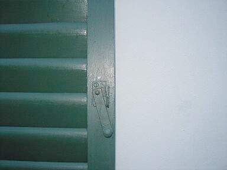
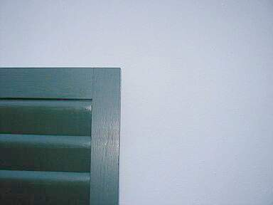

[🠔 Zur Übersicht: Fenster & Holzschutz](23bausto.md)  
# Fensterhandwerk - quo vadis?
**Das anstrichbedingte Umschwenken der Fensterkunden weg vom Holz ist das Ergebnis der Kunststoffindustrie, die mit Versprechungen über "hochwertige" Kunstharz-Farben und Rahmensysteme den Markt erobert.**  
_von Konrad Fischer_

## Altbautaugliche Verfahren und Baustoffe Kapitel 3 + 4 + 5

## Fensterhandwerk - quo vadis? [9]

Das lediglich anstrichbedingte Umschwenken der Fensterkunden weg vom Holz ist natürlich prima Ergebnis aus Sicht der Kunststoffindustrie, die erst mit allerlei Versprechungen betreffend ihrer "hochwertigen" Kunstharz-Farbe und mit ihren sog. "Technischen Merkblättern" Verarbeiter und Endkunden in ihrem Sinne bearbeitet hat und nun mit ebenso "hochwertigen" Rahmensystemen (vergleichen Sie z.B. die thermische Dehnung Holz mit Kunststoff, dessen Versprödungsverhalten mit Kreidungszunahme, dessen Reparierbarkeit im Versagensfall nach der üblichen Überbeanspruchung bei Öffnungsvorgängen der schweren Flügel) dem Holzwerkstoff den Markt abnimmt. Selbst auf dem Biobaustoffmarkt werden angebliche "Leinölfarben" verkauft, die sich dank der mehr oder minder deklarierten Zumixung veresterter "Bio"-Harze dann doch als harzversprödende und übermäßig trocknungsblockierende Harz-Öl-Lacke entpuppen. Aber schön mit Biosiegel und sonstigem "baubiologischem" Geschwafel im Natur-/Öko-/Eso-Jargon an den arglosen Mann/die arglose Frau gebracht.

Manche Bauherren sind aber schon aufgewacht und wehren sich gegen den Produktaustausch. Und bekommen vor Gericht auch mal Recht:

Bauhandwerk/Bausanierung 8/2000:

**_"Ist die Nichtverwendung von Naturprodukten ein Mangel?_**

_... Ob [bei Austausch vertraglich vereinbarter Leinölfarbe gegen Synthetikprodukte] ein nachzubessernder Mangel vorliegt, hatte das Brandenburgische OLG, Aktenzeichen: 4 U 166/98, zu entscheiden. Hier hatte der Bauherr gewünscht, dass Gesimse mit Leinölfirnis und weißer Ölfarbe vorgestrichen werden sollten. Tatsächlich strich der Auftragnehmer mit Relius-Holzschutzgrund sowie mit Herbol-Fensterweiß auf Alkydharzbasis vor. Der Auftragnehmer weigerte sich, die Gesimse nachzubessern, der Bauherr zog darauf eine Gewährleistungsbürgschaft über 30.000.-._

_Zu Recht, wie das OLG feststellt. Die Behandlung des Holzes mit Naturölprodukten war nämlich eine sogenannte zugesicherte Eigenschaft. Bei Fehlen einer zugesicherten Eigenschaft spielt es keine Rolle, ob die alternativ verwendeten Produkte aus technischer Sicht_ [gerne von anderer Seite ins Feld geführt (Anm. KF)]_funktional und optisch gleichwertig oder sogar besser sind. Ebenso spielt es keine Rolle, welche Beweggründe der Bauherr für die Verwendung des Naturproduktes hatte. RA Ralf Schotten."_

In dem "Technischen Merkblatt" des Coatingsherstellers der oben verwendeten Synthetikanstriche liest man z.B.:

_"**Fenstergrund:** 
Feuchtigkeitsregulierender, füllkräftiger Grund- und Zwischenanstrich für Neu- und Renovierungsanstriche auf Holz und Holzfenster außen und innen, [...]- Fenstergrund ist schnelltrocknend, leicht zu verarbeiten und hat eine gute Kantenabdeckung. [...] 
Bindemittelbasis: Alkydharzkombination."_

oder:

_"**Fenster Weißlack:** 
Glanzstabiler, elastischer Deckanstrich für Neu- und Renovierungsanstriche auf Holz und Holzfenster außen und innen, [...]- Fenster Weißlack hat eine gute Fülle, eine erstklassige Kantenabdeckung, eine gute Deckkraft und läßt sich leicht verarbeiten. [...] 
Bindemittelbasis: Alkydharzkombination." _

Praktisch sind bei dem nach einem Jahr eingetretenen schweren Anstrichschaden weder "feuchtigkeitsregulierende" noch "gut/erstklassig kantenabdeckende" oder gar "elastische" Eigenschaften - geschweige denn "leicht" zu verarbeitende Produktqualitäten zu entdecken. Im Gegenteil: Gerissene Anstrichschichten auf Kanten und Flächen innen und außen, Versprödung, Wasserblockade und schwere Holzschäden an allen von diesen Produkten vergewaltigten Holzuntergründen - egal ob Fenster oder sonstige Bauteile. Siehe vorige Schadensbilder 1-3. Ein typischer Fall des "Instruktionsfehlers" und "Produktionsfehlers hinsichtlich begründeter Erwartung" des Produkthaftungsgesetz? Warum kommt es zu solchen Schäden landauf- und ab? Weil harzverschnittene Farben/Lacke leicht verarbeitbar sind und kurzfristig abnahmereife Oberflächen garantieren, während etwas aufwendiger und muskelmäßig mühsamer (verschlichten!) verarbeitete und Handwerksqualität voraussetzende reine Ölfarben am Markt beratungsintensiv sind, und, und, und?.

Aus erfahrenem Gesellenmund wurde mir einst erzählt: 

_"Traditionelle Anstrichtechniken werden uns in der Lehrzeit nicht beigebracht. Leim-, Kalk, Kasein- und Ölfarben sind Fremdworte für uns. Wir werden auf Akkord, nicht auf Kenntnisse und Qualität getrimmt. Wir verarbeiten nur technisch minderwertige Qualitäten, allen ist klar, daß damit dem Kunden nicht gedient ist. Dem Chef geht es eben um die schnelle Mark und den sicheren Folgeauftrag. Genauso machen wir es in der Schwarzarbeit. Der Schaden wird dann letztlich dem schlechten Fenster, dem Wetter oder sonstwas zugeschrieben, nur nicht der schlechten Arbeit mit noch schlechteren Produkten._

_Wer von uns Qualitätsarbeit bringen will, hat keine Chance und verliert den Job. Wenn ich privat Malerarbeiten zu vergeben hätte, würde ich niemals eine Malerfirma beauftragen."_

Nun, gut, das trifft natürlich nicht immer und überall so zu. Selbstverständlich gibt es genügend Firmen auch im Malerhandwerk, die auf äußerste Qualitätssicherung achten und sich sogar dafür bundesweit zusammenschließen. Schwarze Schafe gibt es aber eben auch. Einem Handwerkerschreiben vom 30.10.04 an einen gutwilligen Kollegen entnehme ich (Schreibfehler original):

_"Betr. Oberflächenbehandlung Fenster_

_Sehr geehrter Herr A.._

_bezüglich Ihrer Anfrage zur Oberflächenbehandlung der Fenster mit Ölfarben habe ich mich neben der Anfrage beim Malerbetrieb noch einmal an das ifT Rosenheim und den Verband für Fenstertechnik gewandt. Es ist demnach eindeutig festzustellen, das eine Beschichtung der Fenster mit Ölfarben nicht dem heutigen Stand der Technik entspricht und vor allen Dingen den geltenden Bestimmungen der DIN und RAL-Gütegemeinschaft widerspricht. 
Bei einer Beschichtung wie von Ihnen gewünscht ist kein Bläue- bzw. Holzschutz gegeben. Es kann keine Gewährleistung übernommen werden. 
Außerdem würde ein erheblich Plege- und Wartungsaufwand für den Nutzer entstehen._

_Mit freundlichen Grüßen_

_B."_

Und nu? Den Tischler auffordern, seine Bürgschaft betr. Anstricharbeiten "auf erstes Anfordern" auszustellen und ihm ankündigen, daß man knapp vor Ende seiner 5-jährigen Gewährleistungsdauer mit einem Anstrichfachmann die Qualität seiner bis dahin ungewarteten DIN- und RAL-gerechten Lackbeschichtung mal prüfen wolle. Dann sehen wir mal weiter.

Hans Rottländer, seit 1985 Leiter der Abteilung Farbe bei der Akademie des Handwerks in Raesfeld, schreibt zum Thema in Mikado 9/95 u.a.:

_"[...] im Fensteranstrichbereich damaliger Zeit wurden Leinölprodukte und damit natürliche Werkstoffe verwendet. Erst mit dem Verlangen nach völliger Anschlußdichtigkeit zwischen Fenster und Lichtöffnung, sowie mit der Verwendung von Isolierverglasungen in Verbindung mit Anstrichfarben, deren Film fast wasserdampfdurchlässig ist, treten Probleme auf. Schlechtes Raumklima, Zunahme von Allergien, Schimmelpilzbildung und weitere gesundheitliche Störungen sind die Folge. Der Bausubstanz wurde teilweise irreparabler Schaden zugefügt, deren Ausmaß bis heute noch nicht vollständig ermittelt ist._

_[...] so haben vielerorts synthetische Anstrichmittel der Bausubstanz erheblich geschadet und zu deren schnelleren Zerstörung beigetragen._

_Diese Schäden sind nicht selten auf die absolut dichten, filmbildenden Eigenschaften der modernen Anstrichfarben [...] zurückzuführen. Das Holz konnte nur eingeschränkt atmen, ganz abgesehen vom verhinderten notwendigen, regelmäßigen Feuchtigkeitsaustausch auf dem Diffusionswege. [...]"_

In Hantschke/Hantschke "Lacke und Farben am Bau, Erstanstrich und Werterhaltung, Eine Einführung für Maler, Architekten, Gutachter", Hirzel 1998 heißt es:

_"Lacke und Kunstharze sind [...] versprödend und mangelhaft elastisch [...]. Solche Beschichtungen können, da sie sehr dicht sind, zur Zerstörung des Holzwerks führen." (S. 177)_

_"Unter Versprödungen versteht man die trockene Brüchigkeit des Films, die stellenweise zum Abplatzen führt. In der Regel ist eine Versprödung ein Resultat langjährig bewitterter Alkydharzdeckanstriche bzw. Alkydharzlasuren." (S. 213)_

Natürlich muß Hantschke als ehemaliger Laborleiter eines großen Alkyd- sowie Acrylharzfarbherstellers und auch im Auftrag der Farbindustrie wirkender Sachverständiger hier das Wort "langjährig" einfügen, obwohl er aus seiner Reklamationserfahrung weiß, daß "einjährig" treffender wäre. So schreibt er im gleichen verharmlosenden Stil (aber immerhin!) auf Seite 182:

_"Bei Alkydharzen ergibt sich eine langsam fortschreitende Versprödung, die zu Rißbildung, Abblättern und anderen Anstrichschäden führen kann._

_Eine Bestimmung des Beginns der Alterung ist kaum möglich, sie beginnt praktisch bereits mit der Aushärtung des Alkydharzfilms. Stark wechselnde Temperaturen, Einfluß des UV-Lichts und Feuchtigkeit können die Alterung beschleunigen."_

Genau diese drei Faktoren sind es ja, die am Fenster außen vorliegen, oder? Den Alkydharz- und Ölfarben verleiht der "Hantschke" dann noch folgende Bewertungen betreffend _**"Vergleich der Haltbarkeit"**_**(S. 163):**

Haltbarkeit "Bio-Natur"[=Leinölfirnisfarbe] Basis Alkydharz, lösemittelhaltig 
Alterungsbeständigkeit 

+

-

Elastizität 

-

--

UV-Schutz 

+=

-

Diffusion (Maßhaltigkeit) 

+

-

Blockfestigkeit 

+=

+=

wobei: + : besser, - : schlechter, = : gleiche Bewertung

Im Ergebnis: 

Vorsicht mit Alkydharzfarbe, wenn es um witterungsstabilen Erst- oder Reparaturanstrich auf Holz geht! Auch Bioharze verspröden und verdichten! Wer Ihnen Harzfarbe empfiehlt, sollte zumindest "langölige" meinen und sachlich erläutern, warum er dann nicht gleich zu reinen Ölfarben rät, damit Sie das argumentativ gegenprüfen können. Wenn Sie allerdings die Dauerbaustelle wünschen, gibt's nur ein Rezept: Lassen Sie schnelltrocknend optimierte kurzölige Alkydharzfarben verarbeiten. Und wundern Sie sich nicht über hübsche Reklameschlagworte wie "ventilierend", "Venti-Lack", "feuchteregulierend", "diffusionsfähig", "elastisch" usw. im "Technischen Merkblatt" oder sonstigen Broschürchen. Sie wollten es doch so, oder? Die Probe auf's Exempel: Lassen Sie sich vom Lackempfehler ein vergleichbares Referenzobjekt mit Wetterschenkeln nach drei Jahren Standzeit vor Ort zeigen. Und weiden Sie sich dann an dessen Ausreden.

.  
_Geblitzte Nachtbilder meiner ölgestrichenen 1960er Balkontür vor kalkweißgetünchter Wand. 3 Jahre freie Bewitterung und immer noch der leichte Glanz des Standöls und das kristalline Leuchten der Kalkfläche._

Wenn Sie allerdings Qualität wünschen, fragen Sie nach Referenzen mit Ölanstrichen und prüfen diese kritisch. Fragen Sie nach der Bezugsquelle, nach Rezeptherkunft, nach den Umständen, wieso es am Referenzobjekt tatsächlich zu Ölfarben gekommen ist. Lassen Sie sich auch hier nicht mit falschen Angaben leimen. Die richtige Verarbeitung von Ölfarbe, die ausreichende Malgrundvorbereitung mit Schlifftechnik, die feinsäuberliche Anschlußanbildung an das Fensterglas und die tropfnasenfreie Maltechnik schaffen nämlich nur zwei Personengruppen: Der Bauherr/Die Baufrau in Eigenleistung und ein ehrlicher Handwerker, der Mühsal nicht scheut. Trau, schau, wem.

Wäre die Industrie gezwungen, auch die Risikobereiche ihrer [Produkte voll und ehrlich zu deklarieren](2volldek.md), hätten wir wohl bessere Qualitäten am Bau. So wird mit nichtssagenden Verweisen auf vermarktungsfördernde [Normen und Regelwerke](2mbu.md), die vielleicht nicht alle Verarbeiter ganz durchgelesen bzw. verstanden haben, Technizismus gepflegt und bauschadensträchtiges Bauen durch uninformiertes Verwursten provoziert. Da die Gilde der [Sachverständigen](3gutacht.md) nicht unbedingt immer in der Lage ist, die herstellerabhängigen, also in der Produktion vorprogrammierten Schadensphänomene richtig zuzuordnen, sind im Schadensfall die sonstigen Beteiligten schlecht dran. Armes Bauwesen.

Aussagen gem. dem Protokoll des Amtsgerichts L., AZ 1 H 12/98 (zu einem Beweissicherungsverfahren betr. die oben auf Bild 1-3 dargestellten Anstrichschäden auf Holzfenstern) des von der Handwerkskammer in O. für das Maler- und Lackiererhandwerk ö.b.u.v. "Sachverständigen" X.Y., übrigens ein "Maler- und Lackierermeister": 

_"Ich habe festgestellt, daß Alkydharzlack verwendet wurde. Dieser neigt eher zum Verspröden, als Ölfarbe. Die Verwendung entspricht gleichwohl den anerkannten Regeln der Technik und hat sich in den letzten Jahren durchgesetzt. [...] Das entstandene Problem der Blasenbildung beruht nicht auf der Verwendung des Alkydharzlackes, sondern auf dem von mir festgestellten Uranstrich mit Leinölfarben."_

Fakt: Auch der Uranstrich war schon Alkydharzfarbe, was der "Sachverständige" mit seiner unzureichenden optischen "Untersuchung" nicht feststellte. Die Blasen sind typische feuchtebedingte Schichtabhebungen der überdichten Alkydharzfarbe, die durch ihre Versprödungsrisse und den mangelhaften Glasanschluß zur Auffeuchtung des Holzquerschnitts führt. Die Feuchte kann dann nicht richtig abtrocknen und hebt deswegen durch Dampfdruck die Alkydharzbeschichtung ab. Solche von Schwachverständigen "anerkannten Regeln" der Technik, die besonders versprödungsanfällige und das Fensterholz vernichtende Anstriche befürworten, können uns am Bau gestohlen bleiben. 

_"Es ist bekannt, daß Leinölanstriche bei direkter Sonneneinstrahlung zu Blasenbildung neigen und beginnen können, zu kleben. In der älteren Fachliteratur wurde deshalb empfohlen, die Anstriche regelmäßig nachzuölen."_

Nur die zu dichten Alkydharzfarben auf Leinölfarben oder feuchtebelasteten Untergründen neigen zur Blasenbildung, ein Phänomen der Materialausdehnung bzw. Dampfbildung im Malgrund. Blasenbildung bei Leinölbeschichtungen treten nur bei unsachgemäßer Verarbeitung auf: Wenn auf den nicht ausreichend durchgetrockneten und abgebundenen Erstanstrich der Folgeanstrich aufgetragen wird. Die von außen abtrocknende Oberschicht hebt sich dann unter "Runzelhautbildung" vom weichen Untergrund ab, da die bei Trocknen auftretenden Abbindespannungen nicht vom unabgebundenen Untergrund aufgenommen werden können. Und was Nachölen (simple Anstrichwartung bei witterungsbedingter Bindemittelausdünnung der dann kreidenden, nicht schichtabwerfenden Ölfarben) gegen angebliche Blasenbildung und Verkleben (eben nur möglich, solange unterer Anstrich noch nicht vollständig oxidiert, also abgebunden und aufgetrocknet ist) hilft, ist auch keinem alten Fachbuch zu entnehmen. Solches Sachverständigenwissen ist also für die Katz.

_"Meines Wissens ist die Gefahr von Schäden bei Alkydharzfarben und nicht trockenem Untergrund geringer, als bei Leinölfarben. Woran das liegt, kann ich jetzt allerdings aus dem Stegreif nicht erklären."_

Das ist überhaupt nicht zu erklären. Nichtwissen anstelle Wissen, Schwach- anstelle Sachverstand. Und das als vor Gericht zugelassener und vom Gericht angeforderter ö.b.u.v.S.! Ölfarben lassen bedingt durch ihre typischerweise offenere Schichtstruktur Wasser aus dem Holz sehr viel besser austrocknen, als Kunstharzbeschichtungen. Die technischen Informationen der Naturfarbindustrie bearbeiten diesen Problemkreis sehr nachdrücklich. Ganz im Gegenteil zu den Versprechungen, die uns die Industrieseite sonst gönnt. Kunstharze bilden bedeutend dichtere Schichtstrukturen als reine Ölfarben, bedingt durch die harztypischen Vernetzungs-Eigenschaften. Genau das macht sie ja so rißanfällig bei der an der Fassade immer vorliegenden Wasserdampf-/Kondensat-/Feuchtebelastung.

_"Ob die Alterungsbeständigkeit bei Ölfarben höher ist, als bei Alkydharzfarben, kann ich nicht beurteilen. Ich kann auch nicht sagen, ob die Elastizität von Leinölfarben größer ist. Alkydharzfarben entsprechen dem Stand der Technik. Ob die Haltbarkeit von Leinölfarben größer ist, weiß ich nicht. Dies kann nur ein Chemiker beurteilen. Ich weiß auch nicht, ob der UV-Schutz bei Ölfarben größer ist. Gleiches gilt hinsichtlich der Diffusion. Allgemein muß ich sagen, daß ich die Frage, ob Ölfarben oder Alkydharzfarben haltbarer sind,**nicht** beantworten kann."_

Wie solch' ein ö.b.u.v. Sachverständiger und Meister des Maler- und Lackiererhandwerks, der vor Gericht in mündlicher Verhandlung sein eigenes Nichtwissen in gewerktypischen Fragen eingestehen muß, zu beurteilen ist, überlasse ich dem Leser. Auch, wie ein solcher ö.b.u.v.S. zur Berufung einer Handwerkskammer, wie zum Meisterbrief gekommen ist. Im Gutachten wird dann zu 90% aus mißverstandener und kritiklos übernommener "Fachliteratur" wie das "BFS-Merkblatt Nr. 18" abgeschrieben. Möglichst viele Seiten vorformulierter Textbausteine. Warum er diesen Gutachtenauftrag zu den nachfolgend rekapitulierten Fragen überhaupt angenommen hat und abrechnet, weiß nur Gott allein:

_"Welches sind die Ursachen der Mängel? 
Insbesondere: 
a) War die vom Antragsgegner verwendete Farbe unter Berücksichtigung sach- und fachgerechter Arbeit geeignet? 
b) Ist die verwendete Farbe versprödungsanfällig mit der Folge von Rissbildung, kapillarer Wasseraufnahme, Holzdurchfeuchtung und nachfolgender Behinderung der Wasserabgabe? 
c) Wäre die Verwendung reiner Leinölfarben ohne Harzbestandteil in Hinsicht auf Eignung für Anstriche auf Holzuntergründen die richtige Arbeitsmethode zur gewählten Vorgehensweise des Antragsgegners gewesen?"_

Darauf schrieb der "Sachverständige":

_"Die Beweisfragen liegen in meinem Fachbereich, so daß ich den Auftrag übernehmen kann. [...] Vorab bitte ich darum, nach § 7 Abs. 1 ZSEG, Einvernehmen der Parteien darüber herbeizuführen, daß für den mit meiner Tätigkeit verbundenen Zeitaufwand ein Entschädigungssatz von 120,00 / Std., gem. § 3 Ziff. 3b ZSEG, vergütet wird."_

Mit den Vergütungsfragen kennt er sich also trefflich aus. Mit Seitenschinderei ebenfalls. Und die Fachkenntnisse? Auf jeden Fall deckt der "Sachverständige" und "Meister" seinen Kollegen beim Ausführen schlechter Malerarbeiten mit minderwertigen Farbsystemen.

Genug davon. Und Pardon für die hier durchzuspürende persönliche Betroffenheit. Auch als Architekt im Kampf für die Rechte des Bauherren gegen Pfusch und "sachverständige" Fehlbeurteilungen. Es ist gar nicht so leicht, dieses Ausmaß an Kundenservice einfach so wegzustecken.

Welches bewährte Farbsystem vermeidet Rißbildung, Wasserstau, Vermorschung und Versprödung auf bewitterten Holzuntergründen, respektive Alt- und Neufenstern aus Holz? Egal ob mit oder ohne scharfen Kanten?

[Baustoffinfo und praktische Tips: Anstriche auf Holzoberflächen 
](2oel.md)[Anstrichtipps der Internet-Fragestunde 
](2frag.md)[Fenstertipps der Internet-Fragestunde](2frag26.md)

Vertieften Einblick in die Problematik der alterungstypischen Harzversprödung, die von der Sache her bei Natur- und Kunstharzen vergleichbar abläuft, bietet folgender Fachaufsatz:

Stefan Zumbühl, Richard Donald Knochenmuss und Stefan Wülfert:_**"Rissig und blind werden in relativ kurzer Zeit alle Harzessenzfirnisse; Untersuchungen zur oxidativen Degradation von Dammar- und Mastixfilmen" 
**_in: Zeitschrift für Kunsttechnologie und Konservierung, Mit den Mitteilungen des Deutschen Restauratorenverbandes, Wernersche Verlagsgesellschaft, Liebfrauenring 17-19, 67547 Worms am Rhein, Tel.: 06241-43574, Fax: -45564; Jahrgang 12/1998, Heft 2, Seite 205 ff. Die Ergebnisse zur Untauglichkeit von harzhaltigen Beschichtungen lassen sich ohne weiteres auf synthetische Kunstharzbeschichtungen auf Holz und anderen elastischen/beweglichen/niedrigfesten Malgründen übertragen.

Und natürlich muß vorher der verkrustete Altanstrich runter - oft ein Paket Alkydharz auf originalen Ölfarbresten. Ebenso ist es besser, die versprödeten Kitte ebenfalls abzunehmen. Mit der Kittlampe bzw. dem Speedheater kann das unter größtmöglicher Bewahrung der alten Scheiben geschehen. Ganz ohne Entglasung gelingt es mit einer Entlackung durch geeignete - vorzugsweise CKW-freie - chemische Entlacker (enthalten Lösemittel).

Auf die Anfrage eines alkydharzverzweifelten Kirchenmalers nach einer fachlichen Stellungnahme zu den hier vorgestellten Problemkreisen an den Landes-Innungsverband des Maler- und Lackierer-Handwerks eines deutschen Freistaats entblödete sich der "Technische Betriebsberater" zu folgender Antwort:

**_"Landes-Innungsverband des [...] Maler- und Lackierer-Handwerks_**

**_Technische Betriebsberatung_**

_8.11.1999_

_Altbau-Denkmalpflege-Info´s / Konrad Fischer_

_Sehr geehrte Damen und Herren,_

_wir bedanken uns für die Zusendung der o.g. Unterlagen und bitten um Entschuldigung für die verzögerte Beantwortung._

_Bezüglich der Ausführungen im Kapitel "4. Geeignete und ungeeignete Farbsysteme auf Holzuntergründen im Innen- und Außenbereich" hat der Autor auf eine fachlich begründete Argumentation verzichtet und lediglich versucht, durch verletzende Polemik und Halbwissen das fehlende Fachwissen zu ersetzen. Damit entzieht er sich jeder fachlichen Diskussion._

_Ohne im Detail auf die Ausführungen eingehen zu wollen, ist festzustellen, daß der Verfasser die äußerst komplexe Thematik der Schäden an maßhaltigen Aussenbauteilen aus Holz vereinfacht einem angeblich falschen Beschichtungsstoff zuordnet. Dies bewerkstelligt er, indem er,_ [falsche Kommasetzung im Original, Anm. KF] _lediglich Aussagen anderer aus dem Zusammenhang gerissen zitiert (siehe Anlage) und daraus seine laienhaften Schlüsse zieht._

_Der Autor glaubt, unter dem Motto der "guten alten Zeit" (war die wirklich so gut?) die Problematik mit Leinölanstrichen beseitigen zu können. Daß dies nicht so ist, bedarf wohl keiner weiteren Begründung._

_Mit freundlichen Grüßen_

_**LANDESINNUNGSVERBAND DES [...] MALER- UND LACKIERERHANDWERKS 
**[...] 
Technischer Betriebsberater 
Anlage"_

Ja, so einfach und in der Sache unbegründet und kenntnisfrei kann man es sich machen, wenn man die Kunstharzfixiertheit und den Kundenservice auf die Spitze treibt. Und die [fachgerecht ausgeführten Leinölanstriche](2oel.md) nicht genug schätzt. Der armselige Handwerker wird so weiter im Regen stehen und sich mit der Gewährleistung für untaugliche Kunstharzbeschichtungen auseinandersetzen müssen. Bauherren, Architekten und Handwerker, wollt Ihr Euch das ewig weiter gefallen lassen?

Im Austauschfall sieht es aber nicht immer schlecht für den Endkunden, also den Verbraucher, aus. Auch dem Henkel-Magazin Profi Fussbodentechnik Nr.48 Mai 2000 entnehmen wir die schon oben gebrachte einschlägige Entscheidung, etwas anders aufgemacht:

**_"RECHTS § FRAGEN_**

**_Vertrag ist Vertrag_**

_Bei der Bestellung seiner hölzernen Gesimsprofile legte ein Bauherr besonderen Wert auf Naturölbehandlung; Holzteer und Farben auf Alkydharzbasis lehnte er ausdrücklich ab. In der Leistungsbeschreibung stand deutlich: Die Gesimse sind aus schwedischer Kiefer, mit Leinölfirnis und weißer Ölfarbe grundiert." An diese Vereinbarung aber hielt sich der Bauunternehmer nicht und benutzte synthetische Farben - woraufhin der Bauherr auf den Vertrag pochte und die Sache vor Gericht brachte._

_Dort argumentierte der Unternehmer, es handele sich um einen unbedeutenden Mangel. Das Brandenburgische Oberlandesgericht war nach Durchsicht des Schriftwechsels zwischen Bauherr und Bauunternehmer anderer Ansicht. Der Auftraggeber habe erkennbaren Wert auf Naturölprodukte gelegt. Dass der Auftragnehmer seine vertraglich Zusage nicht eingehalten habe, sei somit alles andere als unbedeutend. Der Bauunternehmer habe die Mängel zu beseitigen oder die Kosten der Nachbesserung durch den Bauherren zu tragen. (OHL, 4U 166/98)_
