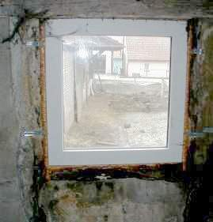

[🠔 Zur Übersicht: Fenster & Holzschutz](23bausto.md)  
# Reparaturplanung für historische Fensterkonstruktionen
**Im Altbau und besonders am Baudenkmal geht es um Substanzerhaltung - nicht allein aus Denkmalliebe, sondern um sinnlose Baukosten zu sparen.**  
_von Konrad Fischer • aktualisiert 09.04.2009_

## Altbautaugliche Verfahren und Baustoffe Kapitel 3 + 4 + 5

**(aktualisiert 9.04.09)** 

## Reparaturplanung für historische Fensterkonstruktionen [14]

### Die Fensterreparatur - Reparaturplanung für alte Fenster

Im Altbau und besonders am Baudenkmal geht es um Substanzerhaltung - nicht allein aus Denkmalliebe, sondern um sinnlose Baukosten zu sparen. [Altfenster - egal aus welcher Bauzeit und egal, in welcher Bauweise - erhalten bzw. fachgerecht nachrüsten ist regelmäßig preisgünstiger als ihr Austausch gegen Neu](23bausto.md#fensterkosten). Nichts geht über die Schalldämmwerte eines Kastenfensters, zu dem die meisten alten Einfachfenster unproblematisch umgerüstet werden können: Durch Vorbau einer inneren Fensterebene, also eines meist zweiflügelig genügenden Vorsatzfensters mit Einfachverglasung. Auch der Fugendurchlaßwiderstand alter Fenster entspricht auch ohne Dichtungslippe den baupraktischen Anforderungen im Gegensatz zu lippendicht raumabklebenden Fenstern. Bei letzteren kann keine wie auch immer geartete "Stoßlüftung" die tatsächlich erforderliche Raumluftentfeuchtung sicherstellen. Dies beweist Wissenschaft und Praxis [5]. 

### Fensterglas und Bauphysik

Moderne Fensterkonstruktion mit erblindungsverdammtem Isolierglas und erhöhter Abdichtung mögen die Rechenmystik der [EnergieEinsparungsVerordnung EnEV](enev.md) erfüllen. Im Bauwerk erhöhen derartig überzogene Konstruktionen aber die Feuchtigkeitsprobleme wie Schwamm und Schimmel, Atemluftverkeimung und erfordern erhöhten Energie- und Lüftungsbedarf. In Häusern mit "modern" abgedichteten Fenstern herrscht meistens ein grauenhaft gesundheitsschädigendes Raumklima, das nicht nur den Schimmelpilzbefall begünstigt, sondern auch viele leichtere bis schwere Gesundheitsprobleme und Krankheiten wie Husten, Heiserkeit und Shcnupfen, Asthma, Bronchialentzündung und vielfältige allergische Reaktionen / Allergien. Grund: Der hohe Keimbesatz und geringe Sauerstoffgehalt in verbrauchter und überfeuchteter Raumluft in den Rümen mit hermisch schließenden Fensterkonstruktionen. [Energie läßt sich damit praktisch nicht sparen](2131bau.md), trotz aller Reklame der rechnenden Bauphysik, der erdölverbrauchenden Wärmedämmproduzenten und der dogmatisch unterstützenden [Klimaapokalyptik](7thuene1.md) [6]. Selbst in der alten DIN 4108 steht ja, daß der U-Wert nur im Labor (stationärer Beharrungszustand im Unterschied zur instationären Baupraxis mit Tag und Nacht, Sommer und Winter, Trockenheit und Feuchte) gilt, was soll er also an der bewitterten Fassade und im Fensterbau? Natürlich liefert der U-Wert-Wahn gute Geschäfte, muß das aber auf Kosten des Altbaus und der Volksgesundheit gehen? Richtig Energie sparen erfordert den Massivbau, die Raumluft sicher trocken haltende dichtungslippenfreie Fensterkonstruktionen mit Sollkondensatorfunktion sowie eine technisch, gesundheitlich und wirtschaftlich überlegene Heizmethode - die wärmestrahlungsintensive [Hüllflächentemperierung](7temper.md).

### Bestandsaufnahme

Bei der Reparatur alter Fenster geht es um die handwerksgerechte Ergänzung der funktionalen Bauteile (Holz, Glas, Beschlag, Dichtung zum Wandanschlag und der Glas-Holzverbindung) und des schützenden Anstrichs. Die erforderliche Datengundlage liefert die Bestandserfassung mit dem [Raumbuchsystem](11rabus.md).

Ohne vertieften Einblick in die handwerklichen Grundlagen und Möglichkeiten wird die Reparaturplanung nicht gelingen. Aus Kostengründen, vielleicht auch in Tradition historischer Reparaturpraxis ist dabei der Ersatz von Glas und Beschlag mit modernen Teilen kein Tabu, wenn auch Bruch mit dem Denkmalpathos (Gebläseltes Echtantik, Mondglas und vergoldeter Silberknopf bitte nur in gerechtfertigten Ausnahmen - wenn Reichtum herrscht und man dem Architekten die dadurch steigenden Honorare von Herzen gönnt!).

### Fensteranstrich außen

Allerdings sollte der [Anstrich nur aus reiner Leinölfarbe ohne jeglichen Harzzusatz](2oel.md) bestehen, um dauerhaft und instandhaltungsfähig zu werden. Das qualitativ hochwertige Bleiweißpigment gibt es nach amtlicher Bestätigung betr. Denkmalpflegebedarf und ist von Fachbetrieben risikolos verarbeitbar. Unverschnittene Leinölfarben bedürfen Trocknungszeit für ihre drei Auftragsschichten (Grundierung, Zwischen- und Endanstrich): Mindestens eine Woche bei günstigen Umgebungsbedingungen dauert es, bis die sich tief und spannungsarm im Untergrund verankernde Anstrichschicht durch Sauerstoffaufnahme (Oxidation) chemisch abgebunden hat. Günstigere Wartezeiten gibt es bei vorkonfektionierten reinen (harzfreien!) Leinölfarben, da dann die Leinöl- und Lösemittelsorte, der Pigmentaufschluß und die Zugabe von Trockenstoffen optimiert sind.

Doch die "Wartezeit", bei entsprechend angepaßtem Arbeitsablauf ja kein Problem, lohnt sich: Alle "modernen" Anstrichsysteme mit schnelltrocknenden Harzbeigaben wirken schichtbildend, reißen wegen Überhärte (vgl. Putzregel!) schnell vom weicheren/feuchtebelasteten Untergrund ab, sind stark versprödungs- sowie rißanfällig und sperren im Rißsystem kapillar eingesaugtes Wasser aus Regen oder Dampfdiffusion im Holz ein. Folge: Vermorschung! Auch als Fensterkitt sollte nur reiner Leinölkitt zum Einsatz kommen. Er liefert ebenfalls die besten Ergebnisse, soweit er nach ausreichender Standzeit mit Leinölfarbe gestrichen wird. Kunstharzfarben werden aber auch Leinölkitt durch ihre Rißanfälligkeit und mangelnde Elastizität vorzeitig zerstören. Wobei das Hauptproblem eigentlich der mangelhaft oder gar nicht überstrichene Anschluß der Fuge zwischen den unteren Bereichen des Flügelrahmenholzes und der Glasscheibe ist. Dort wird regelmäßig nur auf dem Holz und Kitt gestrichen und die Glasscheibe "beschnitten" bzw. ausgespart. Die Fuge zwischen den sich unter Temperatur stark verschieden bewegenden Werkstoffen öffnet sich, Wasser dringt ein und wird vom Rahmenholz / Wetterschenkel begierig aufgesaugt. Und von dort über die gesamte Oberfläche abgetrocknet. Auf der Oberfläche reißt dann die Beschichtung durch den Dampfdruck, die Anstrich ist in seiner schützenden Wirkung zerstört und läßt danach weiteres Wasser eindringen, das dann das Schadensbild weiter hochschaukelt. Jeder kennt diese Schadensbilder, die von industrieabhängigen "Schwachverständigen" der Fensterkonstruktion und mangelnder Anstrichwartung zugeschrieben werden. Abhilfe: Glasanschluß sorgfältig mit überstreichen. 3 bis 5 Millimeter Glasanstrich bzw. in die Glasfläche hineingestrichen muß sein.

### Fensteranstrich/Holzanstrich innen

Wichtig ist also die Berücksichtigung des Wasserhaushalts im Holz. Da Holzergänzungen oft mit modern-dichten Kunstharzleimen angesetzt werden, ist deren entfeuchtungsblockierende Wirkung zu beachten. Auch eine nur außen erfolgende Anstricherneuerung kann die gleiche Folge haben: Rückhaltung der von innen und außen ins Holz eingedrungen Feuchte. Sie liegt regelmäßig flüssig und nicht dampfförmig vor. Der Verweis auf Dampfdiffusionseigenschaften von Baustoffen/Beschichtungen ist also nur die halbe Wahrheit bzw. gänzlich irreführend. Konsequenz für den Praktiker im Fensterbau (und alter Handwerksgrundsatz!): Erhöhte Dichtigkeit der Anstriche innen gegenüber außen. Man erreicht das durch bewußt verringerten Verdünnungsanteil bei den für innen verwendeten Anstrichen bzw. durch einen zusätzlichen Zwischenanstrich innen. Wichtig ist die gute Überdeckung des Glas-Fensteranschlusses auch von innen her. Da das Glas in einem guten Fenster eine zuverlässige Sollkondensatfläche bietet, an der überhöhte Raumluftfeuchte "eingefangen" wird, bevor sie andere Bauteile schädigt bzw. zur Schimmelbildung führt, liegt am Übergang zum Flügelprofil erhöhte Feuchtebelastung vor. Eine sorgfältige Anstrichausführung berücksichtigt das: Auch innen muß über die Holz-Kitt-Glasfuge der Glasanstrich 3 bis 5 mm hoch erfolgen.

### Rahmenanschluß

Der Anschluß zum Bauwerk sollte wie früher mit Flachs/Hanf und nach Erfordenis Holzverleistung erfolgen. Der unter Baupfuschern so sehr beliebte Montageschaum ist dafür leider nicht geeignet. Er gast aus, verringert sein Volumen, stört und blockiert die Entfeuchtung in diesem kritischen und kondensatbelasteten Bereich und ist nicht verrottungsstabil. Auch die Vermörtelung mit reinem Luftkalkmörtel ist hier eine traditionsgerechte und bewährte, da nicht wassersperrende Technik. Die hier natürlich ganz ohne Chancen wäre - Bilder aus meiner Bauberatung an einem "teilsanierten" ländlichen Denkmal:

+ 
Schäumt der Fensterbauer hinter dem Mist, leert sich der Beutel und das Handwerk bleibt, was es ist ...

### Vertragsrecht

Um den verteuernden Einsprüchen und Bedenken "moderner" Fensterbauer betr. DIN- und Regelwerkverstoß der Reparaturplanung entgegenzutreten, sollte man diese rechtswirksam ausschließen. Sonst wird der Bauherr nur unnötig verunsichert. Dazu werden folgende Vertragsvereinbarungen empfohlen:

1. Architektenvertrag 
Haftungsausschluß betr. DIN- bzw. regelwerkgerechten Anforderungen und Eigenschaften, soweit diese im Widerspruch zu handwerksgerechter Reparaturplanung stehen. Diesbezügliche "DIN-Neubau"-Eigenschaften sollen und müssen im Altbau nicht zugesichert werden.

Dazu gehört auch die Vereinbarung, einen [Ausnahme-/Befreiungsantrag von den unsinnigen Anforderungen der Energieeinsparverordnung EnEV](7temp24.md) zu stellen. Aus ihnen ergeben sich unwirtschaftliche und zur Fehlkonstruktion führende Ausführungen im Fensterbau.

2. Werkvertrag mit Handwerker 
Ausschluß/Haftungsfreistellung "normgemäß" zuzusichernder/herzustellender Eigenschaften, soweit diese der handwerksgerechten Ausführung laut Planung/Leistungsbeschreibung widersprechen.

Verweis auf die vorliegende/beantragte [Ausnahme/Befreiung von den Anforderungen der Energieeinsparverordnung](7temp24.md). Zusicherung, daß diesbezügliche Ansprüche ausgeschlossen sind.

Selbstverständlich benötigen solche Vertragsvereinbarungen entsprechend wirtschaftlich/rechtlich qualifizierte Bauherrnberatung durch den Architekten. Aber genau dies gehört ja zu seinem Berufsbild.

Weiter: [15. Kostenberechnung und Ausschreibung für die Instandsetzung historischer Fensterkonstruktionen](23bau15.md)
