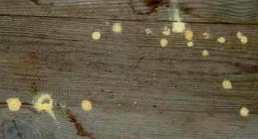

[🠔 Zur Übersicht: Fenster & Holzschutz](23bausto.md)  
# Info zu Schädlingsbefall und holzzerstörenden Befall
**Umfassende Informationen zu Schädlingsbefall und holzzerstörenden Organismen wie Hausschwamm, Hausbock, Holzwurm, Termiten. Effektiver, vorbeugender und bekämpfender Holzschutz – auch ohne Gift.**  
_von Konrad Fischer_

## Altbautaugliche Verfahren und Baustoffe Kapitel 3 + 4 + 5

### 5. Info zu Schädlingsbefall und holzzerstörenden Befall durch Hausschwamm, Brauner Kellerschwamm, Weißer Porenschwamm, Moderfäule, Hausbock, Holzwurm, Gescheckter Nagekäfer, Termiten, Messingkäfer, ... 
Wirksamer bekämpfender und vorbeugender Holzschutz mit und ohne Gift [16]

Nehmen wir mal an, Sie entdecken in Ihrem Altbau oder gar Ihrer geliebten Kirche angekrümelte und morsche Hölzer, Kirchenbänke, hölzerne Bestandteile der Orgel wie Orgelpfeifen, Orgelgehäuse, Orgelspieltisch, Hölzer am Altar, Taufstein, Kanzel, hölzerne Bilderrahmen oder Holz-Epitaphien, Holz-Totenbretter, Holz-Kirchendecke oder andere wertvolle Möbel und sonstige Ausstattungsbestandteile aus Holz vielleicht Fluglöcher, Nage- und Fraßspuren von holzzerstörenden Insekten, verwesende Mäuse in den Spelzen und dem sonstigen organischen Spreu der Zwischenböden / Bodenfüllung des Blindbodens zwischen den Holzbalkenlagen, möglicherweise sehen Sie auch Holzmehlhäufchen oder gar die lieben Käferlein - vielleicht auch eklige Messingkäfer (Diebskäfer, Niptus hololeucus), Motten, Schaben, Kakerlaken, Silberfische oder andere Hausungeziefer und Vorratsschädlinge - selbst herumtoben. Wollen Sie wissen, was da Ihr Holz zermalmt, ihr Haus wegfrißt, ihre Bude verkotet, die Lebensmittel versaut, die Kleider wegnagt, Kinder und Mieter vergrämt? Dann probieren Sie mal diesen Link: [www.holzschaedling.com/schaedlingfrage.asp](http://www.holzschaedling.com/schaedlingfrage.asp) oder auch diesen: [Dr. Wolfgang Poltz: Natur, Garten und Haus - ein Soforthelfer](http://www2.uni-siegen.de/~ag-lamu/faqs/faqs.html), oder auch diesen: [lexikon-der-schaedlinge.de/](http://lexikon-der-schaedlinge.de/), da können Sie es online herausbekommen. 

Was dann? Na klar, ein kluger Holzschutzsachverständiger, Schimmeljäger, Hausinspektor, Hausdoktor oder gleich der Hausvergifter bzw. Kammerjäger muß her, der wird Ihnen sagen, wie es weitergeht, was Sie tun sollten, könnten und lieber unterlassen. 

Falls nun der große Schädlingsexperte oder Insektenforscher oder auch nur Bauexperte oder Referent des Kirchbauamtes aus seiner übergroßen Weisheit und Erfahrung zum Urteil kommt, daß Ihre Hölzer bzw. das Haus zur Bekämpfung des Schädlingsbefalls - nur dieser krümelt und morscht ja ein Holz an - doch etwas Gift nach Holzschutz-DIN und anderen Perversionen der Chemiewaffenkunst wie Kontaktinsektizide, Begasung mit Kampfstoffen wie Stickstoff, Kohlendioxid, Phosphorwasserstoff oder Sulfuryldifluorid und Zyklon B (Blausäuregas) abkriegen müssen, wird er Ihnen gaaaanz sicher auch verraten,

- wie lange die abwehrende und bekämpfende Schutzwirkung voraussichtlich vorhält und wann sie nachläßt, 
- in welche Sondermülldeponie sie bei späteren Reparaturen das vergiftete Holz bzw. den Rest von Ihrer geschützten Bude bringen müssen und wat dat z.B. derzeit kost, 
- welche Arbeitsschutzmaßnahmen inkl. Blutbildkontrollen bei dem Vergiften laut Berufsgenossenschaft erforderlich werden, 
- und welche Arbeitsschutzmaßnahmen später bei Reparaturen im Umfeld der vergifteten Hölzer und sonstigen Bauteile erforderlich werden und wat dat z.B. derzeit kost, 
- wie Sie die Einwirkung der zugelassenen Giftstoffe auf Ihr Wohnumfeld oder den Arbeitsraum oder gar den Beichtstuhl oder Betschemel oder Museumsraum (Schloßmuseum, Burgmuseum, Kunstmuseum, Heimatmuseum ...) beurteilen müssen, die zugelassene Freisetzungsrate der zugelassenen und im ungünstigen Einzelfall abgegebenen Giftstoffe usw., 
- welch geradezu [idiotischen Fehler beim Heizen oder Nichtheizen, Lüften oder Nichtlüften](7temper.md), [Trockenlegen oder Nichttrockenlegen](2aufstfe.md) Ihres Bauwerks genau dafür verantwortlich sind und waren, daß Ihre Hölzer als schmackhaftes Futter für die lästigen Tierchen geradezu vorprogrammiert wurden und wie das nun nach der scheußlichen Bekämpfung genauso oder eben reingarnicht weitergeht, 
- wie Sie all die sinnlose Bekämpferei gleich sparen können, weil Sie mit den vom Experten benannten simplen Maßnahmen die alles entscheidenden überfeuchten Lebensbedingungen Ihrer netten, aber leider unerbetenen Hausgenossen so beeinflussen können, daß sie ihre Zelte bei Ihnen auf immer und ewig abbrechen und lieber den nächstbesseren bzw. nächstdümmeren Nachbarn beehren / heimsuchen, 
- welche möglichen gesundheitlichen Beeinträchtigungen sie laut DIN-Sicherheitsdatenblatt für das vorgeschlagene Giftmittel (legt er Ihnen bestimmt vor) befürchten müssen, 
- alle weiteren zur Verfügung stehenden Maßnahmemöglichkeiten des vorbeugenden und bekämpfenden Holzschutzes ohne Gift, z.B. durch konstruktiven und klimatechnischen Holzschutz bzw. was es sonst noch alles geben mag (z.B. Brennesseltee?, starke Beruhigungsmittel aus der Apotheke für den Hausbesitzer und die Nutzer?).

Wenn Sie aber diese Auskünfte nicht kriegen, bitte Vorsicht - es ist dann nicht die ganze Wahrheit. 

Im Interesse der gesundheitsgefährdeten Bauwerksnutzer, der Anwender und der haftungsgefährdeten Holzschutz-Sachverständigen und Planer: Der Einsatz von giftigen Holzschutzmitteln und sonstigen Schädlingsbekämpfungsmitteln auf der Grundlage von Kontaktgiften (wasserempfindliche und holzstrukturzerstörende Borsalzpräparate, Lindan, ...) und gefährlichen organischen Lösemitteln ist nicht unbedingt notwendig, auch wenn DIN, RAL und der Verordnungsgeber alles tun, die Giftlobbyisten hier restlos zufrieden zu stellen. Meist mit Hilfe willfähriger - um nicht zu sagen gewissenloser - Schwachverständiger, "Tragwerksplaner" und Unternehmer. 

Natürlich sollte seitens des verantwortlichen Planers das ganze Wenn und Aber in Betracht gezogen zu werden: erstmals um der Hausbenutzer und Auftraggeber willen, dann wegen des Haftungsrisikos. Denn wenn es schiefgeht mit der Gift-, Hitze- und Feuchtebelastung wg. Holzschutzanwendung, an wen wird sich der Betroffene wohl zuerst wenden? Klar, an den Planer. Der hat ja die Maßnahme in seiner Ausschreibung gefordert und die resultierende Bauwerksschäden bis zur Nutzervergiftung deswegen auch mit zu vertreten. Oder? 

Was man dabei ruhig wissen sollte: Gerade im modernen [Pseudo-Niedrigenergie-Pottdicht-Haus](7poly.md) mit aufgeklebten und reingestopften Dämmschichten, Dampfsperre und Dampfbremse, gummilippendich hermitsch versiegelnden Isolierfenster und kondensateinlagernde Nachtabsenkung der Heizanlage feiert der zu Recht am meisten gefürchtete Zerstörer, der echte Hausschwamm (Wissenschaft heuchelnde Latinismen sparen wir uns hier, Deutsch: "die heulende Heulsuse"), aber auch alle seine anderen Freunde vom Karneval der Tiere fröhliche Urständ. Es war halt schon immer etwas teurer, einen besonderen Geschmack zu haben. Alles ÖKO-versiegelt. Befall auch nach entsprechender Sanierung Ihres vorher so gut wie nicht befallenen Altbaues garantiert.

Und gerade bei den von Wahnsinns-Bankheizungssystemen geplagten Kirchen bzw. den auf geradezu dümmste Art rauf- und runtergeheizten historischen Räumen bzw. Bauwerken und deren so ungeheuer klugen Baubetreuern, Planern und Baubehördenmitarbeitern - ganz egal ob privat, selbsständig, angestellt, beamtet, kirchlich oder staatlich, ist es zu 99,9 Prozent genau das falsche Heizen und Lüften (z.B. kondensatschwanger-warmfeuchte Sommerluft oder Besucherschweiß und Besucheratemluft an ausgekühlten Holzbauteilen), das die Viecher anzieht und sogar den Schwammbefall der wertvollen Bauteile aus Holz bedingt - vom Käferbefall in den historischen Textilien (Teppiche, Wandteppiche, Bodenteppiche, Wandbehänge, Gobelins, Wandbespannung, Textiltapete, Möbelstoffe, museale Kleidungsstücke, Trachtbestandteile, Uniformen ...) ganz abgesehen.

Nun gibt es für den giftfreien Holzschutz gegen Befall mit Hausschwamm, Porenschwamm, Kellerschwamm, Holzbock, Termiten, Anobien, Messingkäfer, Staubmilben, Läuse und andere auch Alternativen. Konstruktive und [anlagentechnische](7temper.md) Konstruktionsschutz-, Hausschutz- und Holzschutzmethoden bieten oft den ersten Weg, um das Grundübel, zu hohe Materialfeuchte, zu besiegen.

 
_So geht es oft los mit den Unannehmlichkeiten. Holzwürmli (Fränk.: Anopium bungdadumm) lieben feuchtes Holz. 
Gibts auch Schimmel in verdeckten Ecken? Hausschwämmli, Trotzköpfli, Holzböckli? _

 
_Ei, jetzt muß doch trotzdem mal der Keksperte gugge! 
Oder einfach Schwämmli drübber oder morsches Büdli besser glei wegrüpfli?_

Dann gibt es anstrichtechnische Lösungen verschiedenster Art wie alkoholbasierte (Feuergefahr!), wasserbasierte "physikalische" Wirkungsmechanismen oder biochemische Methoden wie mit Pflanzenextrakten (Thüringer Waid), vielleicht auch beschwörungsgestützte Schamanismen, deren genaue Kenntnis ich mangels ausreichend esoterischem Bewußtsein aber nicht einschätzen kann. Außerdem gegen das übliche Hausungeziefer auch allerlei Sprays und Pulver, Mäusefallen-Systeme und Vergrämungsmaschinchen. Vielleicht mag auch Handauflegen bei Vollmond helfen. Ist jedenfalls nicht allzu gefährlich.

Fraglich bleibt neben der Zulassungsfrage und des dauerhaften Wirkungsnachweises im Allgemeinen z. B. beim Heißluftverfahren mit energiereich aufgeheizter Luft und Vergasung mit Giftgas wie Phosphorwasserstoff oder Sulfuryldifluorid und Blausäuregas die Vorbeugung gegen Neubefall und Objektsicherheit gegen Überhitzungsschäden bzw. Gasreaktionen (z.B. bildet Blausäuregas mit den Metalloxiden im Mörtel farbige Blutlaugensalze. Nur Gifttunken sind übrigens RAL-zulassungsfähig, der Rest - ob er nun wirkt oder nicht, bleibt außen vor. Ganz schön schlau. Und gerissen: die Zulassung des Mittels beruht nämlich auf der nachgewiesenen Giftigkeit seines Wirkstoffs, nicht auf der Wirkung des Mittels selbst. Das führt dazu, daß Borpräparate, soweit trocken aufgesalzt, dann vielleicht kaum wirken, da dies feuchten Zustand voraussetzen würde. Ebenso können die hochreaktiven Kontaktgifte durch Ionenaustausch im Gebinde ihre sicher tödliche Wirkung durch Abbau der Wirkstoffkonzentration schon bei Transport und Lagerung - also vor der Anwendung - verlieren. Hier mußte schon gewisses Zeugs wieder vom Markt genommen werden, wie eingeweihte Kreise hinter vorgehaltener Hand (wer wacht schon früh gerne mit einer massiven Bleivergiftung im Kopf auf oder trainiert mit gekappten Bremsschläuchen oder gelösten Radmuttern irgendwo im Alltag als Formel-1-Pilot?) herumflüstern. Ungelöst auch der Nachweis von Wirktiefe und Nachhaltigkeit beim Hochfrequequenzverfahren in einem hochspezialisierten, nicht ganz gefahrlosen Verfahren, während mit als "harmlos" deklarierten - aber dennoch zellschädigenden - Giften nach wie vor die tödliche Endlösung (?) für die Schadensorganismen bei gleichzeitiger Gefährdung von Umwelt und Mensch angestrebt wird. Obwohl genug Fälle bekannt sind, in denen Borsäure/Borat/Bor/Natriumtetraborat- und andere Giftanwendungen bald oder gleich (die giftig-toxischen Wirkstoffe können schon in der Dose durch den Einfluß von Metallionen abgebaut werden!) versagten und Neubefall zuließen. Bei gleichzeitiger Aussonderung der Anwender aus dem Arbeitsleben wegen Blutbildveränderungen (Fragen Sie die Bau-Berufsgenossenschaft).

Gnadenlos nehmen die genormten Vergifter dabei in Kauf, daß sich die von ihnen "geschützten" Bauwerke/Objekte in dauergefährlichen Sondermüll verwandeln, der nicht nur die Anwender, sondern auch Nutzer und spätere Entsorger gravierend und auf lange Dauer mit ihrem Chemiewaffencocktail gefährden. Und spätere Reparaturen im Bestand sehr verteuern. Welch irrsinige Anstrengungen unternommen werden, um von den Normholzköpfen vergiftete Kunstwerke z. B. mit überkritischem Kohlendioxid zu entgiften, repräsentiert dieser Link: [Wertvolle Holzkunst entgiften](http://www.innovations-report.de/html/berichte/verfahrenstechnologie/bericht-11121.html)

Es gibt auch andere Methoden der Schadstoffbegrenzung und Dekontaminierung, die entweder zur Giftreduzierung im Holz führen (Entfernen vergifteter Teile, Gift-Auswaschung in Lösemitteln), schädliche Giftsubstanzen deaktivieren (detoxifizieren)/umwandeln oder eben nur gegen Umweltexposition möglichst dauerhaft abdecken/maskieren. Eine Wissenschaft für sich. Und natürlich ein Geschäftchen, das Handwerksmann seinen ebenfalls giftspritzenden Norm-Vorfahren zu verdanken hat. Im musealem Umfeld sogar sog. Restauratoren, die im Anwenden von chemiekampfbewährten Mittelchen nicht immer große Bedenken zeig(t)en. Und statt Beherrschung der raumklimatischen Bedingungen (Luftfeuchte, Temperatur), die erst Holzschädlingsbefall ermöglichen, mittels präventiver Konservierung wie der [Hüllflächentemperierung](7temper.md) setzt man im Museum wie in Kirchenräumen ausgerechnet auf teure Heiz- und Lüftungsysteme, die den Schaden geradezu provozieren. Nach dem Motto: Das ideale Museumsklima.

Hier weiter: [Kapitel 17 - Neue Konzepte für den dauerstabilen und giftfreien Holzschutz bewitterter Holzoberflächen aus Skandinavien (Schweden) ...](23bau17.md) 

**Fachliteratur Holzschutz** 

