[🠔 Zur Übersicht: Fenster & Holzschutz](23bausto.md)  
# Haus und Holz vergiften und zerstören mit giftigen Holzschutzmitteln nach DIN 68 800 oder giftfreien Holzschutz gegen Widerstände verwirklichen [17]
**Giftfreie, in Deutschlands Chemievergiftungs-/Bauwerkertränkungs-Holzschutznorm DIN 68 800 ausgeblendete Holzschutzverfahren und -maßnahmen gegen Gefahren im Holzschutzgewerk.**  
_von Konrad Fischer_

## Altbautaugliche Verfahren und Baustoffe Kapitel 3 + 4 + 5

## Haus und Holz vergiften und zerstören mit giftigen Holzschutzmitteln nach DIN 68 800 oder giftfreien Holzschutz gegen Widerstände verwirklichen [17]

Den typischen und wirklichen Gefahren im Holzschutzgewerk - vom normengläubigen Holzschutzschwachverständigen bis zum ängstlich herumförmelnden Oberbedenkenträger aus dem "Handwerk", der sich eben gar nicht auskennt und schon deswegen bei jeder sich bietenden Gelegenheit die rote Bedenkenkarte zieht, kann vorgebeugt werden: Giftfreie, in Deutschlands Chemievergiftungs-/Bauwerkertränkungs-Holzschutznorm DIN 68 800 ausgeblendeter vorbeugender und bekämpfender Holzschutzverfahren bekommt man durch:

 * 1. Volle Aufklärung des Objektverantwortlichen und -nutzers über die gegebenen Risiken und Möglichkeiten vorhandener genormter und ungenormter Holzschutzverfahren auch im Rahmen der ohnehin gegebenen Beratungspflichten der Architekten und Ingenieure. Er muß wissen, daß deutsche Holzschutzsiegel, RAL und DIN satzungsgemäß _nur vergiftete_ Holzschutzchemikalien zulassen - vollkommen unabhängig von jeder Form des Wirkungsnachweises der giftfreien Alternativen. Ein echt feiner Trick, um überlegene bzw. giftfreie / ungiftige Holzschutzmittel vom Markt fern zu halten - auf Kosten des Verbrauchers, des Umwelt- und Gesundheitsschutzes.

 * 2. Durchführung des Holzschutzgutachtens mit Maßnahmenempfehlung ausgehend von den tatsächlich gegebenen Lebens- und Wachstumsbedingungen der Holzschädlinge sowie einer konstruktiven (Bewitterung, Kondensateintrag), anlagentechnischen ([Vermeidung schädlingsbegünstigender Baufeuchte und Auffeuchtung der im Bau vorhandenen Holzbauteile und Möbel durch angemessenen Umgang mit Raumklima und Bauwerkshüllfläche im Zusammenspiel Lüftung und Heizung](7temper.md)) und chemisch-physikalisch sinnvollen und giftfreien Schutzmaßnahmen. Sonst wird man trauriges Opfer übertriebener Eingriffe und giftiger Chemiekampfstoffe der auf ihrer alten Mähre blankziehenden Normenritter. Die Volldurchtränkung des Bauwerks mit Hektolitern wässriger Giftbrühe - Vorzugsmethode der auf Zulassungstricks und Normenschwachverstand bauenden "Experten" (sog. Holzschutzgutachter, Holzschutzfachberater, Holztschutztechniker) - beweist vor allem eines: keine Ahnung von den Lebensbedingungen der Schadpilze und von den simplen "trockenen" Methoden der Schädlingsbekämpfung und Vorbeugung (bekämpfender und vorbeugender Holzschutz). 

 * 3. Übernahme der gutachterlichen Empfehlungen in eine Holzschutz-[Leistungsbeschreibung](9pbs.md) mit allen erforderlichen Qualitätssicherungssystemen von der Vergabe an den qualifiziertesten und gleichzeitig wirtschaftlichsten Bieter über die Vertragsgestaltung bis zur technischen und rechtsgeschäftlichen Zwischen- und Endabnahme. Dabei müssen raffinierte Angsthasen aus der Bieterreihe mangels Eignung rechtzeitig ausgeschlossen werden. Später braucht es dann ausreichende Kontrolle betr. erf. Umfang der Holzschutzmaßnahmen in Bereichen, die erst im Bauablauf zugänglich werden. 

Werden dieser 3 Punkte nicht fachgerecht gelöst, bleibt die alternative Holzschutzmaßnahme bei allem guten Wollen eine Zitterpartie von A-Z - mit zweifelhaftem Ausgang. Und immer gilt: Jede Methode hat Vor- und Nachteile. Man muß sie aber kennen. Aus den Herstellerinfos sind sie schwerlich alle herauszulesen. Ausnahmen bestätigen die Regel. Wer schreibt und berichtet schon wirklich gerne und in aller Offenheit über Versagensfälle, Anwendungsgrenzen, Alterungsphänomene, Dauerstabilität über die Gewährleistungszeit hinaus usw., Verträglichkeitsprobleme und Reaktionsmöglichkeiten mit den Beschichtungen auf oder den Holzbauteilen selbst? - wo noch nicht einmal alle Inhaltsstoffe und ihre Nebenwirkungen wie bei den Beipackzetteln von Medikamenten offen deklariert werden? Na eben.

Immer gilt: Nicht mit Kanonen auf Spatzen schießen! Es ist das Geld des Bauherrn, das verbraten wird und wir müssen ihm und nicht unserem Erwerbssinn dienen.

Dieses Kapitel meiner Homepage ist nicht nur für Planungs- und Holzschutzkollegen geschrieben, sondern auch zur Ermutigung für Handwerker und Hausbesitzer/Bauherrn. Wer führt schon hierzulande wirklich gerne Chemiewaffenkrieg? Vielleicht nicht mal die Hersteller der Kampfstoffe, bei denen ja vielleicht nur die F+E (Forschung + Entwicklung) schläft. 

 
_So mißt man im Zuge einer Gebäudediagnostik (mit begleitender Analytik/ Laboranalyse und Laborauswertung) die Vergiftung der Raumluft mit Holzschutz- und anderen Giften, die aus Oberflächenbehandlungen, Bohrlochtränkungen, Objektbeschichtungen wie Farben, Lacke und Kunststoffe, Textilausrüstung, Fraßschutzmittel und anderen Dämmstoffveredelungen von Bio- und Nichtbioschäumen, -fasern und -gespinsten ausdünsten._ 

Es gibt freilich beim Holzschutz Alternativen, wenn es nun unbedingt Bekämpfung und Vorbeugung sein muß, und andere Methoden dies nicht ausreichend sicherstellen können. Eine davon ist z.B. nur im nicht EU-Ausland zugelassen, und kombiniert verschiedene Wirkungen (für nicht bewitterten Bereich):

- Durch Maskierungstechnik erkennt das Schadinsekt das behandelte Holz nicht mehr als Eiablageplatz und verwertbares Nahrungsmittel. Befall wird so verhindert. 
- Lebende Larven werden im Eindringbereich des Holzschutzmittels "verkieselt" und in Verbindung mit der festigenden Wirkung am Schlüpfen mit nachfolgender Eiablage behindert. 
- Die wasserglasbedingte Verkieselung ist als Versteinerungsprozeß wirksam. Sie kann weiche Holzqualitäten erheblich verbessern und sogar total zerbröselndes Altholz wieder in schnittfeste Holzstruktur zurückführen. Alte und neue Fußböden erhalten so besseren Abriebwiderstand. 
- Die versteinerte Holzoberfläche hat erheblich bessere Brandschutzqualität, ihre Entflammbarkeit ist deutlich herabgesetzt. 
- Durch physikalische Abwehrreaktion wird auch Pilzbefall sicher verhindert. 
- Durch Aufnahme in den Pilzorganismus bei befallenem Holz mit nachfolgender Trocknung werden die Pilzzellen zerstört und der Neubefall verhindert.

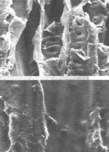 
_"Die REM*-Aufnahme bringt es an den Tag. Während auf einer unbehandelten Holzoberfläche (oben) die Holzzellen völlig offen liegen, zeigt das Bild der behandelten Partie (unten) eine gleichmässig abgeschlossene und für Insekten undurchdringbare Schicht. 
* REM = RasterElektronenMikroskop 
Holz: Fichte, gehobelt, Vergrösserung 600x"_ 
[Auszug aus einem Technischen Merkblatt zu einem silikatisch verkieselnden Mittel]

Im bewitterten Bereich galten bisher einige Einschränkungen, die bei der Anwendung eben bedacht werden müssen. Dann konnte man wie bei diesem Balkonbelag aus Lärche immerhin bedingte Schutzwirkungen erzielen.

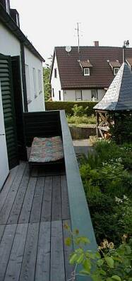. 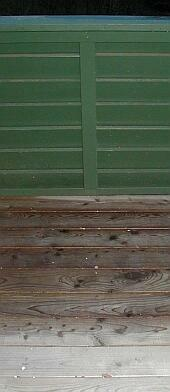. 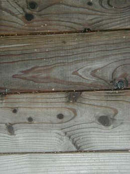 
_Frei bewitterter Balkonbelag nach drei Jahren - (1) im Sommer; (2) im Winter, nach abgetauter Beschneiung (man beachte auch den mehrjährigen Leinölanstrich auf der 1960er Balkonbrüstung inkl. waagrecht bewittertem Deckbrett); (3) wie 2, Detail an der Grenzschicht naß-trocken. Keine algige Schmiere und rutschgefährliche Belagsbildung wie sonst auf vielen frei bewitterten Holztreppen, Bohlen, Stufen, Spielgeräten auf dem Kinderspielplatz, Freizeitpark und sonstigen Holzflächen in Garten- und Landschaftsbau! Gut trittsichere Oberfläche sowohl naß wie trocken._

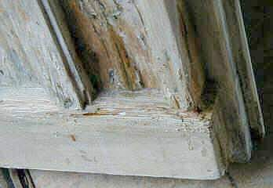. 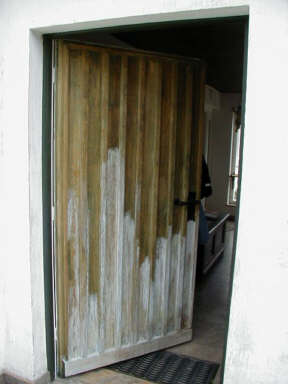 
_(1) Detail Türecke unten rechts; (2) Tür gesamt bei Anstrich mit mineralischem Holzschutz 
Hier sieht man, welch morscher Untergrund mit der verfestigenden und holzschützenden Wirkung des mineralischen Holzschutzmittels wieder als stabilen Malgrund im ständig wasserbelasteten Bereich aufbereitet wurde. Allerdings ist wegen nicht abstellbarer Wasserbelastung der Schadstelle genau an dieser Ecke der Anstrich immer wieder abgeschält (abbeizende Wirkung alkalischer Mittel). 95 Prozent der Türfläche, wo nur verdünntes Holzschutzmittel hinkam, blieben aber einwandfrei. Bild 2 zeigt den kurz nach dem Auftragen aufgetrockneten Holzschutz mit mineralischer Kristallisation auf Oberfläche._

Eine neue Lösung der Oberflächenstabilisierung mit einer zusätzlichen Wetterschutzimprägnierung gibt es inzwischen in Skandinavien:_ 
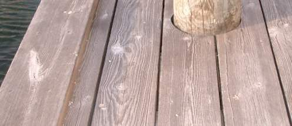 Erst schmierig vergrünter, dann mit Holzschutz und Wetterschutzimprägnierung als umweltfreundlich-giftfreiem Gesamtsystem behandelter Bootsteg - so sieht die Oberfläche nach fünf Jahren aus. [Details](2hsm.md)_

Das gleiche Schutzsystem - durch Ausbildung der Mineralisierung nach einiger Standzeit aufgehellt - auf einer Gartenterrasse durch die Jahreszeiten Sommer 05-Winter-Frühling-Sommer 06: 
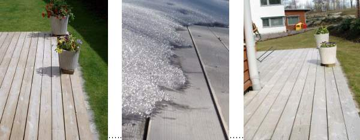.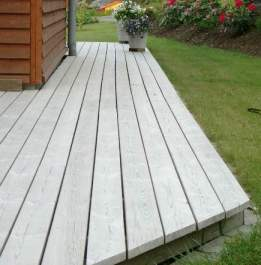

Schneefracht auf der Holz-Terrasse Winter 05 im Detail: 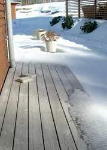

Am 15. August 2008 von mir persönlich nach drei Jahren Bewitterung fotografiert:  

Und ein paar Häuser weiter, das gleiche Schutzsystem, offenbar ansteckend: 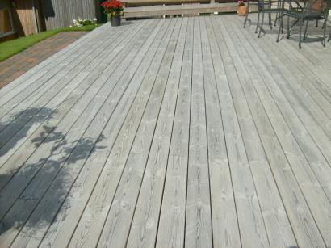 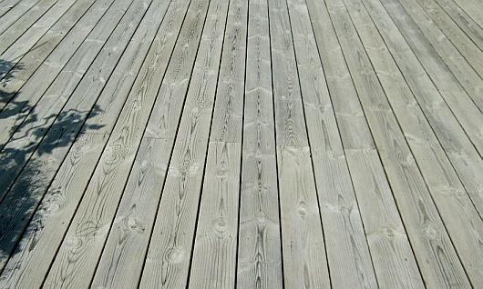 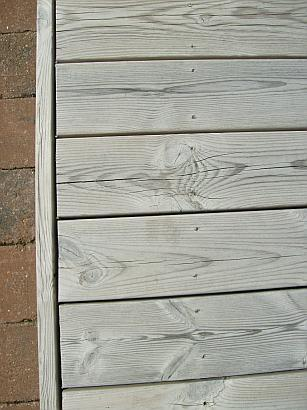 

Ein Nachbar war schlauer und hat seine Terrasse lackiert. Das Ergebnis nach einem Jahr: 
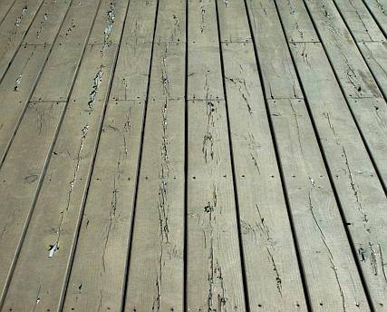 

Doch nicht so schlimm, wenn er renoviert, kann er ja auch was Gscheites nehmen ... 

In der gleichen Siedlung probieren Hausbesitzer das neue Schutzsystem auch an der Fassade aus. Sie haben Lärchenholz-Verkleidungen. Raten Sie, welche zwei Fassaden geschützt sind: 
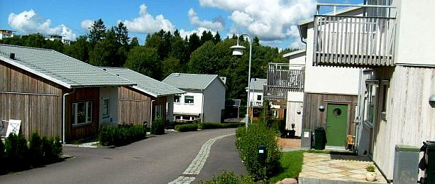 
Und zwar einfach durch Überstreichen der schon schwarz angewitterten Lärchenbretter. Die so bei den "ungeschützten" Nachbarn aussehen: 

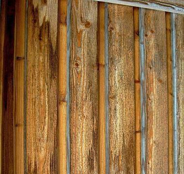 
Verwittert halt. 

Ist die geschützte Oberfläche zu schön? 
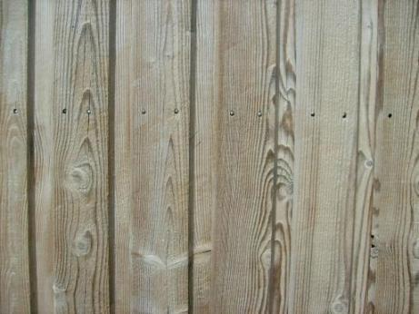 
Geschmackssache. 

So sieht es nach einigen Jährchen Bewitterung im Gebirge aus - erst mal die UV-belasteten und deswegen natürlicherweise verschwärzten / schwarz gewordenen / geschwärzten Sonnenseiten Ost, Südgiebel (ebenso West): 
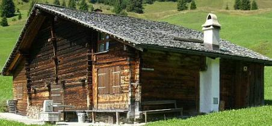 

Und so an der Nordseite: 
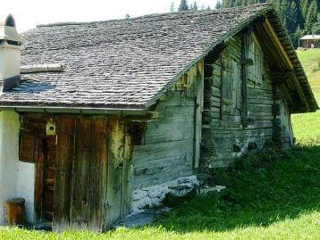 
Typisch Lärche, im UV-Bereich verschwärzend, im Nordbereich vergrauend / grau werdend. Noch einige Lärchen-Impressionen: 

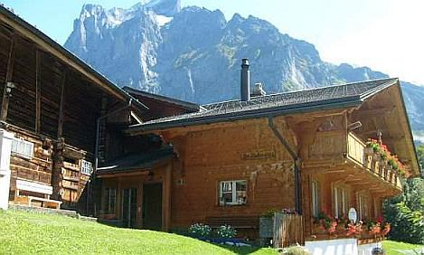 
Wenn etwas Wasser auf die frische Lärchenoberfläche kommt, wäscht es auf unbehandelten Holzoberflächen zunächst mal die lärchentypischen leicht löslichen Holz-Inhaltsstoffe aus. Das ist dekorativ! Und mit der Zeit verwächst / verwäscht sich das doch ... 
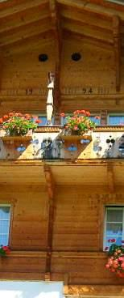 
Baujahr 1994, Aufnahme 2008. An den stärker besonnten Oberflächen setzt die Verschwärzung zuerst ein. 

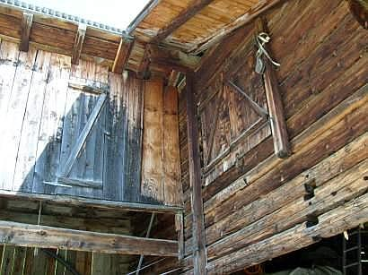. 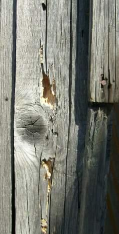 
Natürliche Oberflächen bieten im Bewitterungsfall keinen Schutz gegen Insektenbefall. Wo sich Feuchte in Ritzen, Fugen und Hirnholzbereichen anreichern kann, droht Befall mit Holzschädlingen. 

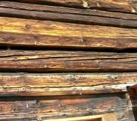. 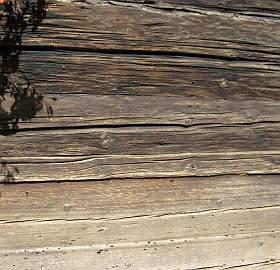. 

Lärche - egal ob frisch, vergraut oder geschwärzt - kann vom Holzschädling Hausbock/Holzbock befallen werden. 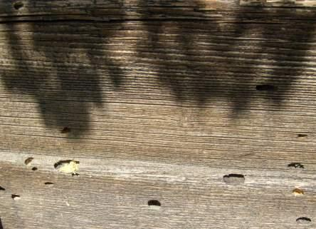. 

Weitere Fallbeispiele: 
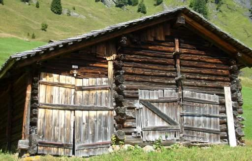. 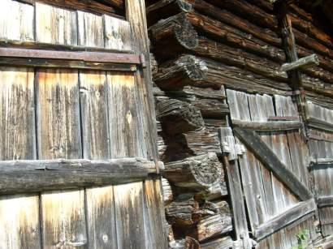.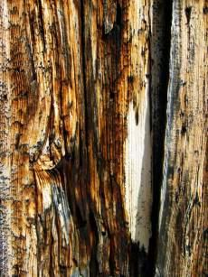 

Ungeschützte Lärchenschindeln verwittern. Wenn genug Wasser dran kommt, wäscht das schwärzende Zeugs aus dem Lärchenholz vollkommen aus und die Oberfläche der Lärchenschindel wird silbergrau. Darunter leidet auch die Stabilität der Holzfaserbindung. 
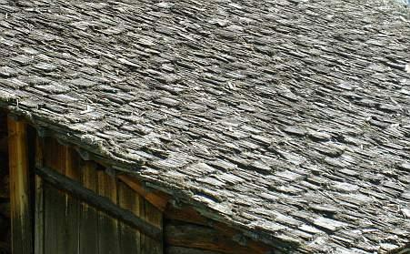. 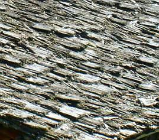. 
Eine Almhütte 

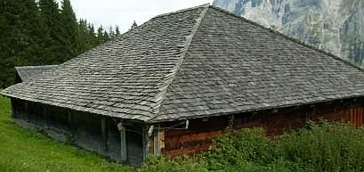. 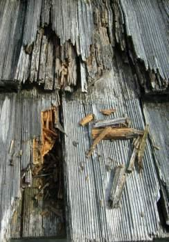 
Ein alpiner Schutzbau für Kühe/Schafe aus Lärche pur, schon etwas länger bewittert. 

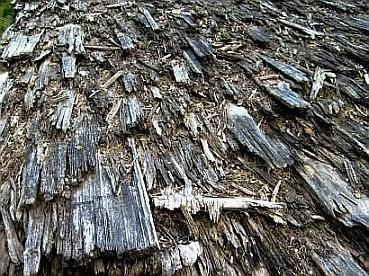 
Für dieses vermoderte Lärchenschindeldach wäre ein mineralisierendes und wetterstabiles / regensicheres Holzschutzsystem vielleicht sinnvoll gewesen ... 

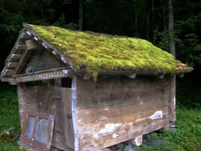 
Auch eine natürliche Alternative! 

Vorsicht: Vorhandene Holzschutzgifte können bei lösemittelhaltigen Präparaten für den Anwender/Nutzer gefährdend ausgetrieben werden. Ein mineralisches Holzschutzmittel kann sie hingegen im Holz einkapseln! Beachte: - die hohe Alkalität des streichfähigen flüssigen mineralischen Holzschutzmittels ätzt Farbbeschichtungen an, löst Harzbestandteile und kann zu Holzverfärbungen führen. Deswegen immer vorher auf referenztauglicher Testfläche ausprobieren. Bei gefaßten Hölzern sind andere Mittel/Methoden einzusetzen.

Präparate mit toxischen Boraten als Schutzgift:

Borathaltige Präparate auf Öl-/Harz-Basis für den Außenbereich (Schutzklasse III) sind zwar witterungsabweisend, ihre Zulassung basiert aber auf der nachgewiesenen Toxizität also Giftigkeit der Borate. Hierzu ist auch folgende amtliche Stellungnahme zur Totenkopfkennzeichnung der Boratpräparate interessant: 

_"Borsäure und ihre Derivate wirken fruchtschädigend und können die Fortpflanzungsfähigkeit beeinträchtigen. Aufgrund der jüngsten Einschätzung der Befunde zu fortpflanzungs- und fruchtschädigenden Effekten von Borsäure durch den zuständigen Expertenausschuss der EU ist davon auszugehen, dass Borsäure und Borate in naher Zukunft gemäß der EU-Direktive 67/548/EEC als CMR-Stoff gekennzeichnet werden müssen (Reproduktionstoxisch E,F, Kategorie 2)."_ (aus: [Bundesanstalt für Arbeitsschutz und Arbeitsmedizin (BAuA): Begründung zu Borsäure und Natriumborate in TRGS 900](http://www.baua.de/nn_38856/de/Themen-von-A-Z/Gefahrstoffe/TRGS/pdf/900/900-borsaeure-und-natriumborate.pdf), dort auch umfangreichere Detailinfo zum Vergiftungspotential der ach so harmlosen Borpräparate in jeder nur erdenklichen Anwendungsform (flüssig, fest, gas- und staubförmig), die sie nicht nur in vielen Dämmstoffen, sondern eben auch als "geeignete" und "zugelassene" und RAL- bzuw. DIN-konforme Holzschutzmittel finden. Man gönnt sich ja sonst nix. 

Ein Wirkungsnachweis der vergifteten Holzschutzmittel, die die Borate in organischen Filmen einbinden, ist als solcher nicht unbedingt gegeben. Ist sie auch zu erwarten, wenn die abzuwehrenden Schädlinge mit den eingekapselten Boratkristallen gar nicht in Kontakt kommen können? Die Wirkung ölhaltiger Boratmittel wird meist nur aus der grundsätzlichen Giftigkeit der Borate selbst abgeleitet. Das Problem zeigt sich dann als Neubefall nach einiger Zeit trotz Behandlung.

Borate sind Kristalle. In das Holz können sie auch in flüssiger Lösung kaum eindringen. Um Eindringtiefen in Zulassungsverfahren zu simulieren, werden die Hölzer vor der Auftragung mit scharfer Nitroverdünnung ausgewaschen - in die Hohlräume kann dann etwas Giftlösung einwandern. Alternativ/zusätzlich wird die Holzoberfläche mit Nagelwalzen o.ä. Folterwerkzeugen perforiert. Wer macht das aber in der Praxis?

Borate bilden somit vorwiegend kristalline Schichten auf dem Holz, die dann krakelieren, verspröden und sich mangels echter Anhaftung über kurz oder lang wieder mehr oder weniger vom Holz ablösen. Viele kennen das interessante Geglitzer, das diese Giftkristalle auf der Holzoberfläche dem interessierten Auge bieten. Freigesetzte toxische Boratkristallstäube entstehen vorwiegend bei wasser- bzw. lösemittelhaltigen Holzschutzmitteln, die auf öl-/harzhaltige Bindemittel verzichten. Sie sind lungengängig. Und wo bleibt die dauerhafte Schutzwirkung der für teuer Geld und bei bleibendem Gesundheitsrisiko aufgeschmierten Kampfstoffe?

TIPP: Quetschen Sie Ihren Holzschutzfachmann aus.

[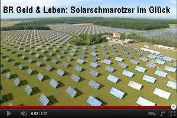](https://youtu.be/xBp0lAxF-nU) 
Deutsche Giftmischer zum Wohle der Umsätze in der Baubranche 

Außerdem: Wenn der konstruktive Holzschutz beachtet wird, kann bei den in DIN 68800-2 "Baulicher Holzschutz" genannten Fällen (Wohnhäuser in Holzbauweise) auf chemischen Holzschutz egal welcher Zusammensetzung ganz und gar verzichtet werden. Voraussetzung ist aber nach Norm, daß man die Verrücktheiten der Abdichtungsmanie mitmacht und für eine luftdichte Gebäudehülle mit für Verzicht auf chemischen Holzschutz zugelassenen Dämmstoffen sorgt. Daß dies gerade in einem bewegungsfreundlichen Holzhaus über kurz oder lang schiefgehen muß, ist zumindest jedem Baufachmann klar. Um dennoch diesen Unsinn zu erzwingen, drohen dämmfreundliche Holzschutzexperten so (Prof. Dr.-Ing. F. Colling: Ursachen für Schäden an Holzbauten, in: Bauhandwerk/Bausanierung 6/2000): 

_"Wer also in bewährter Manier imprägnierte Sparren einbaut, dem droht eine böse Überraschung: man wird ihm leicht nachweisen können, dass er mit einfachen Maßnahmen auf einen vorbeugenden chemischen Holzschutz hätte verzichten können, so dass seine Ausführung als mangelhaft einzustufen ist."_

Meine Meinung: Konstruktiver Holzschutz nach den allgemein anerkannten Regeln der Baukunst - also ohne danebengehende Luftdichtheiten, in deren Folge Feuchtekonvektion zur Pilzbrutanlage pervertieren muß, ohne Schichtbauweise, ohne Dämmstoffstopferei, ohne Unsinnsmaßnahemen wie eingespritzte oder eingesägte Horizontalisolierung und flächiger Folienverkleberei gegen [nicht vorhandene aufsteigende Feuchte](2aufstfe.md) - und Verzicht auf chemischen Holzschutz aller Art. Wer sich das nicht zutraut - dann eben Holzschutz giftfrei.

In den Nürnberger Nachrichten vom 6. Juni 1998 erschien folgender Artikel zum Thema (leicht gekürzt):

_"Restaurator Hofmann setzt[natürliches Holzschutzmittel](2hsm.md) ein 
**Kampf dem Hausbock 
So kann er auf teures Begasen der Balken verzichten - Larven**_

HOLLFELD - Wer den Hausbock im Haus hat und in der abendlichen Stille sein knarzendes Fressen aus den Dachbalken herausklingen hört, verzweifelt. Was kann er tun? Aufwendiges Begasen oder Erhitzen, [...] für Zehntausende von Mark [...], übersteigt oft die Verhältnisse. Der [...] Restaurator [...] kam jetzt auf eine sehr preiswerte Lösung. Er entdeckte das (giftfreie) Holzschutzmittel.

Dieses natürliche, schadstoffreie Mittel ist nicht nur für Holzwurm, Hausbock und andere Freßinsekten geeignet, sondern auch für Hausschwamm oder Pilz auf Mauern.

Der Trick [...] ist sein Verkieselungs-Effekt. So streicht Hofmann die Flüssigkeit auf Holz und macht es so zu hart für die Larven der Schädlinge. Oder er bohrt durch die Balken, bis er die inneren Gänge trifft, und füllt das Mittel ein. Damit werden die Wände der Freßbahnen innen verhärtet. Die Larven - sie sind die knabbernden Fresser, nicht der später schlüpfende Hausbock - finden kein weiches Holz mehr und verhungern. Oder sie werden selbst ... erwischt und versteifen.

**Sein Lebenssinn**

[...] Hofmann ist es allerdings nicht ganz wohl bei dem, was er macht. Denn er ist ein naturverbundener, ganzheitlich denkender Mann: "Der Herrgott hat alle Lebewesen gegeben. Wir wissen zum Beispiel nicht, wozu der Hausbock gut ist. Er ist ein winziges Steinchen im Mosaik der Natur. Drum mache ich mir schon, bevor ich an so etwas rangehe, meine Gedanken..."

Das neue Holzschutzmittel besteht aus Baumsäure, Holzstoff (Lignin), Holzzucker, Kieselsäure, Naturharzen, Silikaten, Soda, pflanzlichen Ölen und Zellstoff. Trifft es auf Pilze, zersetzt es deren Zellen. Trifft es auf Holz, bildet es eine harte Schicht. Diese Schicht gast jedoch nicht aus, sie ist nicht giftig und stört keine anderen Insekten, etwa die Bienen. Das Holz ist danach überstreichbar. [...] -tk-"

Kommentar KF: Letzteres würde ich nur für unbewitterte, feuchtegeschützte Bereiche bestätigen wollen bzw. nur für alkalistabile Anstrichsysteme, wie jüngst in Skandinavien entwickelt ([Details](2hsm.md)).

Weiter: [18. Sind zugelassene vergiftete Holzschutzmittel unschädlich? / Surftips für Dialektiker - Gegenteilige/Ergänzende Links - Nix + niemand glauben - Bilden Sie sich eine eigene Meinung](23bau18.md) 

**Fachliteratur Holzschutz** 

