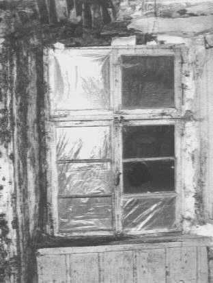
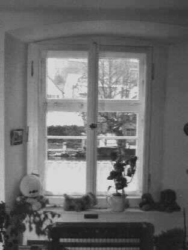
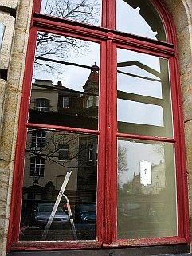
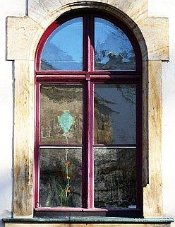
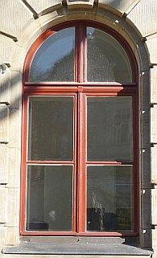
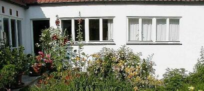
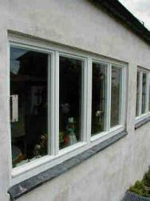
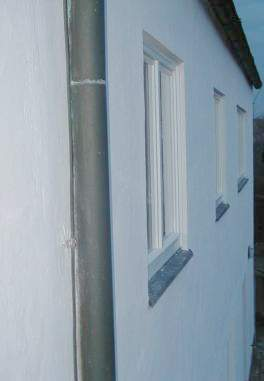

[🠔 Zur Übersicht: Altbau Restaurierung](20bausto.md)  
# Alte Fenster - Erneuern oder Erhalten?
**Analyse der Probleme beim Austausch alter Fenster und Türen: Heizkostenersparnis vs. Schimmelbildung. Ein Fallbeispiel zeigt die Risiken moderner, komplettdichter Fenster.**  
_von Konrad Fischer_

## Altbautaugliche Verfahren und Baustoffe 
Kapitel 3+4+5 - Fenster / Holzanstrich / Holzschutz

> [!abstract]+ Kapitelübersicht: Fenster & Holzschutz  
> 1. **Alte Fenster - Erneuern oder Erhalten?**
> 2. [Die Schadensfolgen moderner Fenster - Problem Lüftungsanlage + Klimaanlage, kontrollierte Wohnraumlüftung [2]](23bau02.md)
> 3. [Fensterprobleme 3 - Isolierfenster / Isolierglas](23bau03.md)
> 4. [Historische Bleiglasfenster](23bau04.md)
> 5. [Tendenzen des Fensterperversion - Lüften und/oder Dichten](23bau05.md)
> 6. [Feuchte- und Energieproblematik am Fenster](23bau06.md)
> 7. [Zu guter Letzt - warum dennoch gute Fenster weggeschmissen und mit Pfuschfenstern gnadenlos erneuert werden [7]](23bau07.md)
> 8. [Geeignete und ungeeignete Farbsysteme auf Holzuntergründen im Innen- und Außenbereich](23bau08.md)
> 9. [Fensterhandwerk - quo vadis?](23bau09.md)
> 10. [Hinweise zum Thema: Fachwerkanstrich außen](23bau10.md)
> 11. [Bestandsaufnahme und Ausschreibung für die Erhaltung von alten Fenstern](23bau11.md)
> 12. [Praxistaugliche Bestandsaufnahme von Fensterkonstruktionen - Anforderungen und Ziele](23bau12.md)
> 13. [Arbeitsvoraussetzungen der Bestandsaufnahme von historischen Fensterkonstruktionen](23bau13.md)
> 14. [Reparaturplanung für historische Fensterkonstruktionen](23bau14.md)
> 15. [Kostenberechnung und Ausschreibung für die Instandsetzung historischer Fensterkonstruktionen](23bau15.md)
> 16. [Info zu Schädlingsbefall und holzzerstörenden Befall](23bau16.md)
> 17. [Haus und Holz vergiften und zerstören mit giftigen Holzschutzmitteln nach DIN 68 800 oder giftfreien Holzschutz gegen Widerstände verwirklichen [17]](23bau17.md)
> 18. [Sind zugelassene vergiftete Holzschutzmittel für Menschen unschädlich?](23bau18.md)
> 19. [Historische / Alte Fenster und Türen - erhalten / instandsetzen oder erneuern / modernisieren?](11fet.md)
> 20. [Anstrich auf Holzoberflächen](2oel.md)

Hinweis: Wie es um die Erhaltung oder Erneuerung alter Fenster und Türen aussieht, wie man dafür eine kostengünstige Bestandsaufnahme, Planung und Ausschreibung erstellt, lesen Sie im Detail hier: 

[Historische / Alte Fenster und Türen - erhalten / instandsetzen oder erneuern / modernisieren?](11fet.md). 

_"Zum Unglück hat sich mit der Industrie ein System verbunden, 
das Profit als den eigentlichen Motor des gesellschaftlichen Fortschritts betrachtet, 
den Wettbewerb als das oberste Gesetz der Wirtschaft, 
Eigentum an den Produktionsgütern als absolutes Recht, 
ohne Schranken, 
ohne entsprechende Verpflichtung der Gesellschaft gegenüber. [...] 
Noch einmal sei feierlich daran erinnert, 
dass Wirtschaft im Dienst des Menschen steht." 
_Papst Paul IV. 
(in seiner Enzyklika über den Fortschritt der Völker - [POPULORUM PROGRESSIO - Volltext deutsch](http://www.christusrex.org/www1/overkott/populo.htm) ) 

**Das Bild zum Thema:**[Frans Francken - Der Tod und der Kaufmann (1620)](http://www.religionsunterricht.de/ifr/ifr45zd2.htm)

## 3. Alte Fenster - Erneuern oder Erhalten? [1]

Barockfenster vor ... ... und nach Reparatur und Ergänzung durch Innenfenster 

Zum Einstieg - aus einer Kundenzuschrift: 

"Für Ihre Bausünden-Anekdoten-Ecke, hier unsere Fenstersanierungsgeschichte: 

Nachdem sich mein Schwiegervater, in dessen Haus meine Frau und ich wohnen, dazu entschieden hatte, etwas angespartes Kapital in diese Immobilie zu investieren um deren Wert zu steigern, fiel seine Wahl auf den Komplettaustausch der Fenster. In einem Informations- bzw. Verkaufsgespräch mit einem Mitarbeiter des Fensterherstellers hieß es: _„ nach der Maßnahme werden Sie mindesten ein Drittel Ihrer jetzigen Heizkosten einsparen.“_ 

Gesagt, getan, die alten Holzfenster – nicht etwa marode sowie bereits in zweifach verglaster Verbundbauweise - wurden gegen die neue Kunststoff-komplettdicht-Hitec-Variante ausgetauscht. Nach dem Einbau war die Freude zunächst allseits groß, ein wirklich hübscher Anblick. Doch das war es dann leider auch schon. die Freude währte nämlich nicht allzu lange: 

Im darauf folgenden Winter siedelten sich in den Raumecken der gesamten Hausnordwand, insbesondere im Schlafzimmer und im Bereich der Fenstergesimse, schwarze Mitbewohner an, und vermehrten sich in schreckenerregendem Maße. Nach intensiver Beschäftigung mit den möglichen Ursachen sowie mehreren tausend Euro für die fachmännische Sanierung der betroffnen Räume, war die Erklärung gefunden: 

Die natürliche Luftzirkulation im Fensterbereich, verursacht durch die naturgemäß nicht zu 100% luftdichten Holzfensterrahmen, verhinderten eine zu starke Feuchtigkeitssättigung der Luft und damit deren Kondensation im innenbereich der Hausnordwand. Die neuen Fenster sorgen nun praktisch dafür, dass die bisher eher harmlosen Wärmebrücken des 70er Jahre Hauses nun in Ruhe ihr Unwesen treiben können – mit dem Resultat, dass die vom Hauseigentümer ebenso wohlgemeinte wie kostspielige (ca. 16.000,00 €) _„Energiesanierung“_ nichts gebracht hat – außer Schaden. Damit sind nicht nur die Kosten für die Schadensbehebung aufgrund des Schimmelbefalls gemeint; nein, der Heizaufwand mit den neuen Fenstern ist sogar gestiegen statt gesunken, da die hermetisch eingesperrte Feuchtigkeit jetzt nur noch mit einer höheren Raumlufttemperatur unter Kontrolle gehalten werden kann 

Und wer glaubt, das war es jetzt : 

Mittlerweile denkt mein Schwiegervater darüber nach, dem Problem des Schimmelbefalls mit einer Wärmedämmung der Außenfassade (für ca. 25.000,00 €) beizukommen. Diese Lösung (des vorher gar nicht existenten) Problems propagiert zumindest die Baustoffindustrie und der nette Handwerker von nebenan. Gott sei Dank habe ich inzwischen Sie, Herr Fischer, und Ihren pragmatischen Lösungsvorschlag (Kosten der Umsetzung ca. 0,00 €) zu diesem Thema kennen gelernt, und weiß meinen Schwiegervater und auch mich selbst zukünftig vor dem grenzenlosen Unfug vermeindlich moderner Bauphysik zu bewahren. 

Viele Grüße 
Jürgen Jensch, Neunkirchen 
[www.jenschmedia.de](http://www.jenschmedia.de) - [www.milchtankstellen.de/](http://www.milchtankstellen.de/)" 

Der alte Fensterbestand, regelmäßig in handwerklicher Manier aus gut abgelagerten, astfreien und feinjährigen Hölzern gefertigt, ist früher vorwiegend mit harzfreien Leinölfarben gestrichen worden. Die modernen Folgeanstriche mit synthetischen [Alkyd- und Acrylharzanstrichen](2oel.md) haben dem alten wie auch dem neuen Holzfenster nicht immer genutzt. Da heutzutage fast immer nur von innen und außen an das Glas herangestrichen wird, verbleibt oder entsteht dort eine Kapillarfuge, die Kondensat und Regen einsaugt. Diese Feuchte verteilt sich dann im Holzquerschnitt, kann durch die Trocknungsblockade der Anstrichschicht nicht mehr flächig abtrocknen und drückt deshalb einerseits die Anstriche auf dem unteren Flügelrahmen innen und außen ab, andererseits kann in der feuchten Fuge zwischen Glas, Kittbett und Rahmenholz Pilzbefall entstehen, der sich dann "schwarz" bemerkbar macht. Wenn Altfenster instandzusetzen sind, und dies ist nach aller Erfahrung auch bei in Holz-, Glas- und Beschlag teilgeschädigten Konstruktionen technisch und wirtschaftlich meistens sinnvoll, kann entschieden werden, die noch brauchbaren, da intakten Holzbschichtungen zu erhalten und nur an geschädigten Stellen diese in geeigneter - also bestandskompatiblen Techniken und Beschichtungssystemen zumindest technisch korrekt oder insgesamt mit technisch überlegenen Farbsystemen von Grund auf neu zu beschichten. Wobei es bei beiden Varianten immer darauf ankommt, die Beschichtungsflächen so anzulegen, daß künftigem Wassereintritt in das beschichtete Holzprofil von innen und außen gleichermaßen vorzubeugen. Es muß also ein paar Millimeter in die Glasfläche hineingestrichen werden. Eine Kunst, die offenbar kein eiziger Maler, geschweige den Schreiner bzw. Tischler bzw. Fensterbauer beherrscht. Hierzu finden Sie [hier weitere Hinweise](23bau08.md).

Konrad Fischer: Fassaden energetisch richtig und kostensparend sanieren 1 

[Teil 2](http://www.youtube.com/watch?v=Y1NSxAW15Cc) [Teil 3](http://www.youtube.com/watch?v=RAT7VzBo8k0) [Teil 4](http://www.youtube.com/watch?v=6TBII25iVQk) [Teil 5](http://www.youtube.com/watch?v=Kb0C4KiZvVA) 

**Beispiel aus einer aktuellen (2009) Fenstersanierung:**

1 + 2 + 3 
100 Jahre alte Kastenfenster (Typ Rundbogen) vor (1, 2) und nach (3) Instandsetzung / Sanierung. Die vergleichende Auswertung der Vollkosten bei verschiedenen Saniervarianten ergibt nach unserer Schlußabrechnung für den Auftraggeber - ein Staatliches Bauamt - folgende Ergebnisse - inkl. Nebenkosten für Planung nach System Fischer ([Bestandsaufnahme mit Raumbuchsystem](11rabus.md), [Auschreibung mit Positionsbausteinsystem](9pbs.md)): 

Instandsetzung 2009 durch Ausbau der Flügel, Entlackung, Instandsetzung der Schäden an Holzkonstruktion, Beschlag und Glas, Einfräsen Dichtungsnut in Innenfensterebene, Einbau Dichtung, Neuanstrich mit reiner Leinölfarbe oder langöliger Alkydharzfarbe: 4.600 EUR inkl. 19 % MWST 
Rekonstruktion Neufenster nach altem Vorbild: 5.700 EUR inkl. 19 % MWST 
Erneuerung mit Isolierglasfenster moderner EnEV-Bauart, Sprossenteilung konstruktiv: ca. 5.000 EUR inkl. 19 % MWST 

**Das Problem**

Für den Bauherrn des Altbaus beginnt das Fensterproblem immer mit falschen Aussagen seiner eigennützigen Berater (Schreiner, Fensterproduzenten, Planer, Bauphysiker): Das alte Fenster lohnt sich nicht aufzuarbeiten, es muß ein neues her. Das spart Planungsaufwand, Angebotskalkulation und bringt den Beratern einfach verdientes Geld.

Die simple, problemlose und dauerhafte Saniervariante - meistens ist nämlich nur der zu straffe, zu harte und zu spröde Kunstharzanstrich zum x-sten Mal zerstört und das Fensterholz und die Falzdichtung nach Abnahme der störenden Lackschichten relativ ok, die verzogenen Teile können durch Nachjustieren der Beschläge leicht gerichtet werden, die evtl. sinnvolle Zusatzdichtung von (meist durch Beschlagabnutuzung) verzogenen Fensterkonstruktionen kann durch Besch&oumllagreparatur und nachfolgendem Einfräsen einer Dichtungsnut mit Einbau einer weichmacherfreien Spezialdichtung leicht nachgerüstet werden - wird verschwiegen: 

 * Entlackung mit geeigneten [Reinigungsverfahren](29bau08.md);
 * Handwerkliche Reparatur der meist nur geringfügigen Schäden an Holz, Glas und Beschlag;
 * Konstruktionsverbesserung nach Bedarf
 * [Neuanstrich mit harzfreien reinen Leinölanstrichen](2oel.md) in möglichst hellem Farbton (weiß), um die thermische Belastung des maßhaltigen und bei Bestrahlung sich stark erwärmenden und ausdehnenden Fensters möglichst gering zu halten.
 * Im Falle von Schlafzimmer, Küche und Bad / Dusche / WC u.a. feuchtegefährdeten Räumen sowie bei ausreichender Dichtheit auch unter hygienischem Aspekt Verzicht auf Verschlimmbesserungen wie Einfräsen einer Dichtlippennut, Aufmontage von Zusatzscheiben usw.

Diese Arbeiten kosten selbst nach Stundennachweis nur einen Bruchteil des Neufensteraufwands. Obendrein lassen sich regelmäßig die Zusatzarbeiten im Gewändebereich vermeiden, da die Altfensterrahmen im eingebauten Zustand saniert werden können. Die Deponiegebühren für die wg. Kunstharzanstrich als teurer Sondermüll zu entsorgenden Altfenster entfallen ebenfalls. 

Hier einige Vergleichskosten als Einheitspreise, ermittelt aus unseren bundesweit öffentlichen Ausschreibungen von Fensterreparaturen in neuen und alten Bundesländern:

Holzfenster ohne Sprossen

Austausch oder Reparatur - Kostenvergleich (Stand 2004)

 **AUSTAUSCH** . . . . **REPARATUR** . . . . . . . 
Leistung Holz 
Kunststoff 
Leistung 
Verbund/Kasten 4-flg. 

Einfach 2-flg. 

Kosten in EUR/qm Fensterfläche (Ansicht) 

Kosten in EUR/qm Fensterfläche (Ansicht) 

Einzelleistung kumuliert Einzelleistung kumuliert 

Einzelleistung kumuliert kumuliert Einzelleistung kumuliert kumuliert 
Altfenster ausbauen, entsorgen 50 
50 
Notfenster 
20 

20 

ISO-Fenster, 1-flg., Dreh-/Kipp, herstellen, liefern, einbauen, SSK III dB 35 335 **385** 275 **325** Flügel ausbauen, in Wst. transportieren, einbauen 
28 **48** 
18 **38** 

Putz- u. Malerarbeiten Leibung 100 **485** 100 **425** Anstrich entlacken, erneuern mit Leinöl einseitig 80 **128** 
80 **118** 

Verleistung außen 40 **525** 40 **465** 
allseitig 200 
**248** 140 
**178** 

Flügel/Beschläge richten 
85 **213** **333** 85 **203** **263** 

Wetterschenkel neu 
40 **253** **373** 40 **243** **303** 

Die Schweinerei im Mietrecht, wonach ausgerechnet der Fensteraustausch gegen den Mieter wirtschaftlich, technisch und gesundheitlich benachteiligende sog. Isolierglas/Wärmeschutzfenster von ihm mittels Modernsierungsumlage refinanziert werden müssen, die in jeder Hinsicht günstigere Reparatur der guten alten Fenster jedoch nicht, hat den Austauschwahn leider massenhaft begünstigt. Die Folgen: Die deutsche Schimmelpest, keine Energieeinsparung, schlechterer Schallschutz, dauerkranke Bewohner. Da lacht sich die Fensterbranche aber herzlich ins Fäustchen. Und sagt ganz scheinheilig: Der böse Staat ist halt schuld. Und der Kunde, der das ja alles bestellt hat.

In der nachfolgenden Tabelle, beruhend auf der 2014 aktualisierten Studie ["Im neuen Licht: Energetische Modernisierung von alten Fenstern"]() des Verbands Fenster und Fassade VFF und des Bundesverbands Flachglas BF, können wir erkennen, daß noch viele Millionen Einfachglasfenster ihrer Vernichtung durch den Energiesparwahn harren und sie mit ihrem formidablen "g-Wert" besser als die modernen Ersatzgläser das tagsüber kostenlose Licht ins Haus lassen. Werden wir also demnächst Energiesparfenster bekommen, nach deren Einbau auch tagsüber das elektrische Licht - selbstverständlich aus Energiesparlampen - eingeschaltet werden muß?

Typ Beschreibung Menge Mio. qm Hauptsächlich verbaut Durchschnittlicher g-Wert in % 
Typ 1 Fenster mit Einfachglas 21 bis 1978 87 
Typ 2 Verbund- und Kastenfenster mit Einfachglas 48 bis 1978 76 
Typ 3 Fenster mit unbeschichtetem Isolierglas (Zweifachglas) 220 1978-1995 76 
Typ 4 Fenster mit Zweischeiben-Wärmedämmglas (low-E) 274 1995-2008 60 
Typ 5 Fenster mit Dreischeiben-Wärmedämmglas (low-E) 32 ab 2005 50 

Ein besonders krankes Beispiel, wie es wirklich aussieht mit dichten und sich selbst zerstörenden Modern-Fenstern und der vermaledeiten Niedrigenergiebauweise können Sie im Forum von K.H. Ries studieren: [http://www.khries.de/forum/showthread.php](http://www.khries.de/forum/showthread.php?s=a4d10340397c77b03d7a957ee435118b&threadid=1671)

 
_6/03: Mit Leinöl-/Standölfarbe 8/00 instandgesetzte Verbund-Fenster Baujahr 1962 im neu gekalkten Architektenheim (Vorsicht! In unserem Biogartendschungel verstecken sich vielleicht lebendige Schlangen, Kröten und Tiger, auf jeden Fall Molche und Hoppel, der weiße Widderhase)._

 
_Hier war das Fenster schon ein Jahr gestrichen, die kalkgetünchte Fassade mit 20 Jahren Standzeit noch nicht._

 
_Nachtblitzbild 12/03 der 9/02 neugetünchten Kalkfassade und den seit 8/00 bewitterten leinölgestrichenen Fenstern._

Sowieso - und das wird dem Bauherrn auch nicht verraten - sind historische Fensterkonstruktion im Schall- und Wärmeschutz, in der Ausbeute von Licht und Solarenergie ebenso wie in der raumklimatisch noch wesentlicheren Entfeuchtungsleistung und Abführung von Raumluftschadstoffen neuen Fensterperversionen haushoch im Einzelvergleich und erst recht in der Summe der technischen Eigenschaften haushoch überlegen.

Im _stern_ wird dieser Witz so behandelt: [Auszug aus "Dämmen wir uns krank?"](21316bau.md#stern)

Der unkritische Bauherr fällt so hilflos auf die falsche´Beratung - oft bewußte Irreführung des Verbrauchers - herein und läßt den technisch überlegenen Altfensterbestand gegen minderwertige teure neue Fenster ersetzen. Dabei kauft er als Katze im Sack Folgeschäden, die ihm seine "Berater" verschwiegen haben. Ein **Urteil des LG Berlin vom 8.1.04, Az. 67 S 312/01** hat die hier gerade für Vermieter gegebene Brisanz klargemacht:

Der klagende Mieter bemängelte eine nachgewiesene **Tageslichteinbuße** in seiner Wohnung von sagenhaften **23 Prozent** durch den Austausch seiner alten Fenster gegen **Isolierglasfenster**. Damit hat der Mieter eine nicht hinzunehmende "erhebliche Beeinträchtigung der Wohnnutzung" erlitten, der Fensteraustausch wurde als vom Vermieter "herbeigeführter Mangel" bewertet. Demzufolge wurde dem Mieter eine saftige **Mietminderung** zugesprochen:**Drei Prozent je Fenster!** Und er bekam einen "Mängelbeseitigungsanspruch": der Vermieter muß die "vor der Modernisierung vorhandene größere Glasfläche wieder herstellen." Wie das allerdings praktisch gehen soll, entzieht sich meiner Kenntnis. Neben jedes Fenster ein neue 25%-Lichtlucke durch die Fassade stoßen? Das fehlende Licht täglich in Säcken aus Schilda herbeitragen? Oder?

In ähnliche Richtung dann das [Urteil](http://www.rechtstipps.de/mieten-vermieten/mietalltag/verkleinerung-der-glasflaeche-durch-fensteraustausch-fuehrt-zur-mietminderung) wiederum des LG Berlin vom 6.11.2013, Az. 67 S 502/11: Er gab dem Mieter Recht, pro diesmal mit 28,85 Prozent lichtgemindertem Isolierglasfenster jeweils drei Prozent von der Miete abzuziehen. Drei mal acht Fenster mit Verkleinerung der Glasfläche: Satte 24 Prozent Mietminderung. Damit kann man sich wohl ein paar Mehrstündchen Elektrofunzelbeleuchtung leisten. 

Damit haben die schlauen Vermieter wohl nicht gerechnet, als sie anstelle der selbst zu tragenden Reparatur der alten Fenster den Mieter mittels "Modernisierungsumlage" für neue Isofenster drankriegen wollte. Ätschbätsch! Sicher weiß sein Fensterbauer wieder wohlfeilen, eben fensterbauer / -bäuerinnenschlauen Rat. Und wäre es nicht seine Pflicht und Schuldigkeit gewesen, um dem Vorwurf des vorsätzlichen Betrugs gem. [§ 263 Strafgesetzbuch StGB](http://www.gesetze-im-internet.de/stgb/__263.html) zu entgehen, dem Bauherrn vorher eine angemessene Risikoaufklärung angedeihen zu lassen und das fehlende Licht und das damit einhergehende Mieterrecht auf Mietminderung sachgerecht als unabdingbarer Werkmangel zu verraten, schriftlich mit Einschreiben und Rückschein? Oder dürfen Berliner Schreiner alles, wenn es ums Geschäftemachen geht? Haftung, Gewährleistung und Schadensersatz ausgeschlossen?

Wie oft hat der Fensterbauer schon raffiniert verschwiegen, daß sein Energiesparfenster gerade und ausgerechnet im Energiesparen schwerste Mängel hat: Sehr oft übertrifft ja die Solarausbeute eines simpelsten Einfachfensters dank perfektem g-Wert (Maß für Durchlässigkeit des Glases für kostenlose und energiereiche Solarstrahlung), die nur im Labor geltenden U-Werte und ihre nur rechnerisch vorhandenen Energiespareffekte _auch rechnerisch_ bei weitem! Folge: Energieverlust und Geldverlust bei Austausch der guten Altsubstanz gegen teure "Energiesparfenster". Das nennt man normalerweise "Betrug".

Was der moderne Fensterkunde dann von der Materialqualität erwarten darf, geht auch aus den Wärmedehnzahlen der angepriesenen Rahmenmaterialien hervor (Quelle: Dipl.-Ing. Jürgen Estrich, Tischlermeister, iBAT Institut des Tischlerhandwerks, Hannover: "Anforderungen an die Ausführungen von Fugen und Bauanschlüssen" in: Bauhandwerk 12/2006):

Material Wärmedehnung in mm/m 
Kunststoff dunkel (Plastik) 2,4 
Kunststoff weiß 1,6 
Aluminium 1,2 
Holz (im Mittel) 0,4 
And the winner is ...? Wo reißt es also rund ums Fenster am meisten und schnellsten auf, was kluge Tischlermeister herumgeschäumt haben? Wobei wir über die Dauerstabilität der verwendeten Spritzmassen gar nix sagen wollen, sonst gibts wieder mal Geheule. Eins aber doch: Gestopftes Zeitungspapier dürfte länger halten ... 

**Themenlinks:** 
ARD Ratgeber Bauen & Wohnen - 8.5.04: [Ist Fensteraustausch sinnvoll?](http://web.archive.org/web/20040622224645/http://www.wdr.de/tv/ardbauen/archiv/040508_3.phtml) 
Deutscher Siedlerbund DSB e.V. - [Streitthema Wärmedämmung: Contra](http://web.archive.org/web/20110818040725/http://www.siedlerbund.de/bv/on9953) 
[bau.de/forum/fenster-tueren/1846.htm#1092905449](http://www.bau.de/forum/fenster-tueren/1846.htm#1092905449#1092905449) 
[Das virtuelle Online-Fenstermuseum - Das muß man gesehen haben!](http://www.fenstermuseum.de) 
[Das Fenstermuseum in der Schweiz - zum Anfassen](http://www.vogel-fensterbauer.ch/kp5.htm) 
Weitere [Info und Tipps zu Fenster, Tischler, Schreiner, Holz, Gartenhaus, Gartenhäuser, Terrasse, Hobel, Elektrohobel, ...](http://schreinereien.com) 

[Das Deutsche Schloss- und Beschlägemuseum in Velbert](http://www.velbert.de/stadtinfo/museum.htm)

 Weiter im Text: **[Die Schadensfolgen moderner Fenster - Betrug am Kunden durch Schwachverstand? [2]](23bau02.md) [Klimatisierung und Lüftungsanlage](23bau02.md#klimatisierung)**
