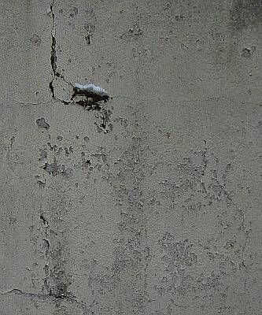
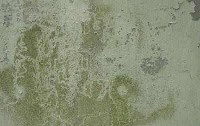
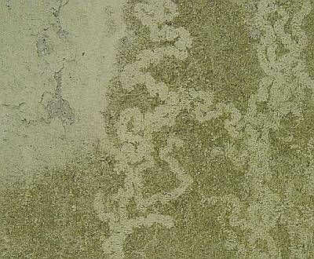
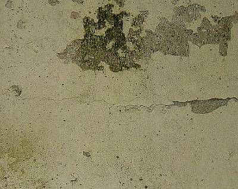
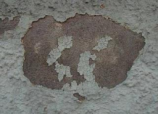
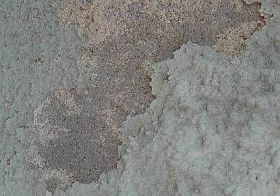
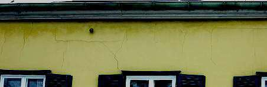

[🠔 Zur Übersicht: Kalk](26bausto.md)  
# Mineralische untergrundverträgliche Anstrichsysteme
**Kritische Betrachtung moderner Anstrichsysteme mit Kunststoffen, die oft schnelle Verarbeitung, aber keine dauerhafte oder substanzverträgliche Fassadenschutzwirkung bieten. Fokus auf Probleme und Alternativen.**  
_von Konrad Fischer • aktualisiert 31.03.2009_

 

## 6. Luftkalkrezepturen
Mörtel für Mauerwerk, Innen- und Außenputze, Estrich, Dachdeckerbedarf, Verfugung und Verpressung

> [!abstract]+ Kapitelübersicht: Mineral-Anstriche  
> 1. **Mineralische untergrundverträgliche Anstrichsysteme**
> 2. [Luftkalkmörtel und Kalkanstriche 8](26bau08.md)
> 3. [Problematische Anstrichsysteme](26bau09.md)
> 4. [Lustige Kunststoffpampereien und ihre Folgen](26bau10.md)
> 5. [Oberflächenprobleme und Schimmelpilzbefall](26bau11.md)

** **7. Mineralische untergrundverträgliche Anstrichsysteme 1** 
****Kapitel 7 - Anstriche: Seite 1** [2](26bau08.md) [3](26bau09.md) [4](26bau10.md) [5](26bau11.md)** 

**(aktualisiert 31.03.09)** 

Die Ausrüstung moderner Farben mit Kunststoffen (z.B. Acrylate, kurz- und langkettige Siliconharze, Polyvinylacetat, ...), Wassergläsern und Hydraulkomponenten mag zwar geschwinde Verarbeitung, sog. Wasserabweisung und Industrienormerfüllung bringen, die dauerhafte und substanzverträgliche Fassadenschutzwirkung ist damit nicht unbedingt erreicht. Mangels [ausreichender Deklaration der Inhaltsstoffe und Problembereiche](2volldek.md), gezielter Irreführung und Fehlbeurteilung von nur im Labor bzw. auf freigesetzten Kleinpröbchen gültigen Meßwerten sind viele eher substanz- und [gesundheitsschädigende ](7wsvoant.md)Anwendungen zu beobachten. Und die allergeizigsten Bauherrn sind geradezu die Lieblingstreuekunden gutmeinendster Malermeister, die zwar von ihren Grundlagen (Pigmente, Bindemittel, Füllstoffe und ihre Komposition in bestandsverträglicher und dauerhafter Rezeptur) nichts mehr verstehen (Handwerk ist ja kein Kopfwerk), vom Bauherrnbeuteln jedoch umso mehr. Ein besserwisserischer Architekt, der mal einige Schäden hinter sich gebracht hat und auch Baustoffbüchlein liest, stört dabei doch sehr arg. Und will noch Geld dafür! Nein, es muß auch ohne gehen. Einige Beispiele solcher Handwerkerkunst: 

 
Kunstharzfarbe auf feuchtebelastetem Untergund. Ein Schneehäubchen sitzt auf dem Moospolster, das sich auf dem wasserübelasteten Malgrund gebildet hat. Farbe flächig aufgerissen und teils abgängig. Rißsysteme, durch die sich das eingesperrte Wasser verzweifelt seinen Trocknungsweg sucht. 

. 
In besonders feuchten Bereichen umfangreiche Veralgung - nicht nur wie gewohnt auf WDVS-Flächen, sondern auch eben auch auf plastikpampenvergewaltigter Massivwand.

 
Großflächig springt die Kunstharzschwarte ab. Und reißt und reißt und reißt. Und hinterläßt Moos- und Algenparadiese.

 
Eine andere Wand, ein anderer sparsamer Bauherr, ein wiederum toller Malermeister. Naßpampige Bröckelplasteschwarte auf Naturstein. Unsere Fassaden sind voll davon - schaun Sie sich nur mal kritisch um. Alles Malermeisterqualität. Schnell verarbeitete Industriemüllbeschichtung - nach dem bewährten Handwerksmotto "Hui aber Pfui".

 
Was mag der örtliche Malermeister sich hier die Hände gerieben haben. Nun ja, jedem, wie er es eben verdient.

 
Wobei solch ein bewegungsfreudiges Fachwerkhaus als Verputz bestimmt besser weichelastischen Luftkalkmörtel vertragen hätte, als zementär verschnittene Feinsandschwartensprödkruste mit überhöhter Wärmedehnung und Feuchterückhaltung.

Weiter: **[Kapitel 7 - Anstriche: Seite 2](26bau08.md)**
