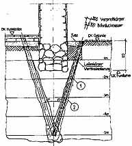

[🠔 Zur Übersicht: Altbau Restaurierung](20bausto.md)  
# Ertüchtigung historischer Gründungen
**Verschiedene technische Spezialtiefbau-Verfahren zur nachträglichen Ertüchtigung historischer Gründungen werden vorgestellt, inklusive Auswirkungen und Herausforderungen.**  
_von Konrad Fischer • aktualisiert 30.03.2009_

> [!abstract]+ Kapitelübersicht: Fundament  
> 1. **Ertüchtigung historischer Gründungen**
> 2. [Zur Instandsetzung historischer Gründungen durch konstruktive Verstärkungen oder Stopfen des Bodens](2gustopf.md)
> 3. [Baugrund-Stabilisierung durch Stopfen](stopfen.md)

[Was moderne Bauweisen für unerfahrene Bauherren bedeuten können](2mbu.md#das ergebnis) 

 

## Aufwendige Spezialtiefbauverfahren und ihre Risiken

Es gibt verschiedene technische Spezialtiefbau-Verfahren wie z.B. das HDI-Verfahren, die Bohrpfahlgründung und Kleinbohrpfähle, mit denen historische Gründungen nachträglich ertüchtigt werden können. Je nach Bodenbeschaffenheit (setzungsanfällige Auffüllungen, schluffige Böden mit hohem Setzungspotential, Tone, Kies, Sand, Flutablagerungen, Morast, Holzpfahlroste, Moor-/Torfschichten, ... in mehr oder weniger lockerer oder verdichteter Lagerung) und baulicher Situation sind sie mehr oder weniger geeignet. Die allerdollsten werden logischerweise besonders gerne angewendet, da diese den fachlich Beteiligten am meisten Geld einbringen sei es als Gewinn aus der Verfahrensdurchführung für die beteiligten Spezialtiefbauunternehmen oder auch als Extraertrag durch Erhöhung der anrechenbaren Baukosten für die Planung bis ins Unermeßliche. Daß dabei durch Injektionsmaterialien Schäden und Verseuchungen im Untergrund angerichtet werden können, daß manche Verfahren substanzgefährdende Zwischenbauzustände, rißfördernde Bodenerweichungen und maximale Kassenplünderung bedingen, die es bei alternativen Verfahren nicht gäbe, sollte ein kritischer und vor allem auch ein armer Bauherr schon wissen.

### Häufige Schadensursache

Eine typische Fallkonstellation, die zu ungeheuerlichen Gebäuderissen / Bauwerksrissen führen kann, ist die Ausspülung von Fundamentbereichen infolge von Grundleitungsleckagen. Die undichten Kanalrohre lassen im Lastfall Wasser / Abwasser ausströmen, das aus dem Umfeld Bodenmaterial verflüssigt und über den Kanal abtransportiert. Es verbleiben: Immer größer werdende Fehlstellen / Löcher / Auskolkungen im Fundamentbereich bzw. nahebei. Folge: das Bauwerk geht mehr und mehr in die Knie. Ein krasses Beispiel für Fundamentausspülung lieferte der tragische Unglücksfall am Kölner Stadtarchiv, das infolge der U-Bahn-Bau-bedingten Fundamentunterspülungen nicht nur Rißschäden und Setzungen erlitt, sondern am Ende seiner Resttragfähigkeit mit einem Schlag einstürzte und dabei noch mehrere benachbarte Bauwerke mit in die Tiefe riß. Von den verschütteten Toten gar nicht zu reden.

Um nun bei den hier vorgestellten Verfahren zur nachträglichen Baugrundstabilisierung und Baugrundertüchtigung mit der Zielstellung einer Verstärkung der Fundamente bzw. der Fundamentbereiche eines alten Bauwerks das eingesetzte Auffüllmaterial nicht in die Leckagen der Grundleitungen abzupumpen - bekanntlich folgt eingepreßtes Material dem Weg des geringsten Widerstands, muß entsprechend vorgebeugt werden:

Zunächst sind die Grundleitungsbereiche mit entsprechender Inspektionstechnik wie die Befahrung mit einer Kanalkamera auf Leckagen zu untersuchen (Schadensortung).

Die entdeckten Öffnungen / Leckagen im Kanalsystem kann man dann sofort verschließen, indem man den geschädigten Bereich freilegt / ausgräbt und danach die Schadstellen lokal behebt. 

In Fällen, bei denen damit Risiken für das betroffene Bauwerk selbst einhergehen - man arbeitet ja in mehr oder weniger unsicherem Gelände, das Bauwerk ist rißgeschädigt und vielleicht schon bei geringen Erschütterungen einsturzgefährdet, kann es erforderlich sein, die Leckagen durch Maßnahmen zu verschließen, die keinen gravierenden Eingriff im Boden bedingen. Dann kann beispielsweise ein Stützschlauch in den geschädigten Bereich eingebracht werden, der vor dem Verfahren mit Wasser gefüllt wird, sich dadurch "aufpumpt" und quasi als Inliner-Rohr das Eindringen von Injektionsmittel in die Rohrleckagen verhindert. Eine elegante "Notlösung". Und wenn die Bodenverbesserung abgeschlossen ist und das Bauwerk wieder sicher steht, kann dann das Kanalsystem im gesicherten Umfeld repariert bzw. erneuert werden.

## Weniger invasive Verfahren zur Bodenverbesserung

Zu den bescheideneren Verfahren zur Bodenverbesserung gegen überlastungs- und/oder ausspülungsbedingte Setzungsschäden von Gründungen / Fundamenten, gegen Setzrisse im Mauerwerk und anderen Bauteilen wie Decken und Böden sowie Hohlraumauffüllung, teils sogar Rückbewegung von Setzungen und Verformungen gehören das PUR-Expansionsverfahren (Injektionshebetechnik / Tiefeninjektionsmethode (UDI) mit Zweikomponenten-PUR-Expansionsharz, das durch Injektionslanzen in den Untergrund eingespritzt wird), sowie **das patentierte Stopfverfahren nach Prof. Gerd Gudehus, mit folgenden Vorteilen:**  

- keine verfahrensbedingte Verflüssigung/Erschütterung des Baugrunds, dadurch kein gefährlicher Zwischenbauzustand, 
- keine denkmalfeindlichen Eingriffe und Verluste am historischen Fundamentmauerwerk, 
- keine Stahlbetonmanschetten am Fundament, 
- keine einbetonierten Bohrpfähle, 
- keine irreversiblen Eingriffe im Baugrund, 
- keine zementöse/silikatische Einklebung der wichtigen archäologischen Fundsituation am Fundamentbereich, 
- kein salzabspaltendes, bodenfremdes Injektagematerial, 
- preisgünstig.

  
Kloster Waldsassen - Baugrundertüchtigung Ostflügel mit Stopfverfahren (Planverfasser: Architektur- und Ingenieurbüro Konrad Fischer, Projektdurchführung 1998) 

### Anwendungsbereich und Grenzen der Verfahren

Dieses bewährte, aber nicht allgemein bekannte Verfahren des Spezialtiefbaus ist am Baudenkmal bei entsprechenden Bodenverhältnissen vorteilhaft. Bei ungeeigneten Bodenverhältnissen oder Bauwerksbedingungen gibt es andere Möglichkeiten, um dann z. B. mit expandierendem Injektionsmaterial den Baugrund mit geringstem Aufwand zu verbessern und abgesackte Bereiche millimetergenau zu heben. Man muß eben die ganze Palette an alternativen Spezialtiefbauverfahren kennen, um im Einzelfall das Beste - und preisgünstigste - zu finden. Ein Binsenwahrheit, pardon.

- Dipl.-Ing. Klaus Maisch: **[Detaillierte Erläuterung Stopfverfahren](stopfen.md)**  
- Prof. Dr.-Ing. Gerd Gudehus: **[Zur Instandsetzung historischer Gründungen durch konstruktive Verstärkungen oder Stopfen des Bodens](2gustopf.md)** - Ein kurzer Überblick (mit Systemzeichnungen!)  

**[Uni Karlsruhe, Institut für Bodenmechanik und Felsmechanik Abteilung 1,](http://www.ibf.uni-karlsruhe.de/)** ehem. Leitung, jetzt Mitarbeiter: Prof. em. Dr.-Ing. Gerd Gudehus
