[🠔 Zur Übersicht: Natur- & Ziegelstein](29bausto.md)  
# Rekonstruktion oder Reparaturmörtel?
**Die Wirtschaftliche Alternative zum Austausch schadhafter Natursteinfassaden.**  
_von Konrad Fischer_

[🠔 Zur Übersicht: Natur- & Ziegelstein](29bausto.md)

**Die Wirtschaftliche Alternative zum Austausch schadhafter Natursteinfassaden.**  
_von Konrad Fischer_

Im Unterschied zum Austausch schadhafter Fassadenteile aus Naturstein gegen Vierungen bzw. Vollkopie ebenfalls aus Naturstein bieten Fehlstellenergänzungen aus Ergänzungsmörtel wirtschaftliche Alternativen. Daß die gern von besonders ahnungslosen Bauherren und Handwerkern aus Kostengründen eingesetzten Betonkopien, also Kopien nach dem Original aus armiertem Stahlbeton, Schutzüberzüge typische Vertreter des modernen Sanierens sind, zeigte sich nicht nur an der Martin-Luther-Kirche in Gütersloh. Landauf, landab rotten diese reparaturunfähigen Ersatzkopien aus allerdümmstem Material - selbstzerstörerischer Stahlbeton mit korrosivem Betonstahlkern / Eisenarmierung - vor sich hin, werfen abgerostete Bruchstücke und ganze Teile ab und beschädigen obendrein den noch originalen Bestand nach Kräften. In traditioneller Manier der Handwerkskunst würden bestandsschonendere Lösungen aus kalkigen Ergänzungsmörteln demgegenüber vielerlei Vorteile bieten. Sie könnten auch Problembereiche wie Fehlstellen und Risse in Ziegel- und Natursteinmauerwerken überdecken, ohne gestaltungsbedingten Bestandsaustausch. Es kommt dabei freilich auf objektgerechte Rezeptur und Ausführungstechnik an, die vorteilhafterweise immer erst an belastungsexponierten Baubereichen ausgetestet werden sollte.

An den historischen Naturwerksteinbauten lernen wir, daß derlei Fehlstellenergänzung mit Reparaturmörtel (und Flicken, oft aus Ziegel) jahrhundertelang die übliche Instandhaltungsmethode war. Sie ist auch heute nicht verboten, nur auf synthetische Bindemittel wie Harz und hydraulische wie Trass und Zement darf man verzichten. Macht aber niemand, da die Verantwortlichen in Denkmalpflege, Planung und Handwerk von den bauphysikalischen Nachteilen der Polymere und Hydraulen weder kennen, verstehen, noch sich dafür interessieren und immer nur machen, was der so arg freundliche Produktvertreter souffliert. Gibt ja auch so schöne Incentivs dazu und wer läßt sich schon Rentierschlitten sechsspännig ausgerechnet zum Weihnachtsfest entgehen? Und so werden grundsätzlich extrem wasserrückhaltende und trocknungsblockierende Restauriermaterialien wie seit anno dunst eingesetzt, die dafür in irgendeinem marginalen Eigenschaftsspezifikum herausragende Werte nachweisen können. Daß beispielsweise die dafür oft herhaltenden Diffusionseigenschaften von sozusagen überhaupt keinem Belang sind, juckt wiederum niemanden der Verantwortlichen. Denn da hätte man erst wissen müssen, daß Feuchtetransporte 1000:1 flüssig und nicht dampfförmig stattfinden und es deswegen nur auf die Kapillaraktivität des Materials ankommt, um gut und schnell zu trocknen. Und die ist bei den "modernen" Werkstoffen kaum bis gar nicht vorhanden. 

Das pseudodenkmalpflegerische Brüsten mit "Wir arbeiten nur mit Vierungen" kann vielleicht das Ego des Bauamtsleiters, der im Geld schwimmenden Dombauhütte mit ihrem Dombaumeister oder des hochwohllöblichen Natursteinfritzen befriedigen. Mangels Beurteilungsfähigkeit der Naturstein-Handelsqualitäten im Detail kann aber auch dollster Schrott zum Einbau kommen (was natürlich auch für die Beurteilung der Reparatur-/Ergänzungsmörtel gilt, siehe vor). Vor allem, wenn - gut gemeint aber schlecht gedacht - gegenüber dem Bestand dichtere Steine (vielleicht gar mit zementär bzw. kunstharz"vergütetem" Setz- bzw. Fugmörtel) eingebaut werden. Dann staut sich das eindringende Wasser über und hinter diesen Bereichen und frostet und rostet - jawohl - es gibt auch armierende Eisen in historischen Bauwerksfassadenstrukturen! - alles auf. Der Steinaustausch an der Nürnberger Lorenzkirche gibt ein trauriges Beispiel solcher Verschlimmbesserungen (vgl. Konrad Bedal (Hrsg.): _Unter Dach und Fach_ , Bad Windsheim 2002, S. 101).- Fazit: Die Vierung ist immer die allerteuerste und maximal bestandsvernichtendste Lösung, und alles unter den gestrengen Augen und in Verantwortung der Denkmalpflege, des zuständigen Kirchbauamts und der Bauhütte bzw. Natursteinfritzen. Sehr beliebt bei allen finanzmittelveraasenden Baumeistern. Wer sich das heute noch leisten kann - Glückwunsch!

**Reparaturbaustoffe**

Beharrt der Denkmalpfleger/Bauherr auf Natursichtigkeit der Fassade, kann man mit kunstharzfreiem Mörtel Natur- und Backstein bestandsschonend ergänzen: ohne Störung der erforderlichen Kapillartrocknung und erhöhte Wasserrückhaltung, ohne riskante Bestandsgefährdung durch Alterungsprozesse der Antragsmaterialien, ohne untergrundbelastende unterschiedliche Schrumpf- und Quellvorgänge. Seit eh und je sind dafür Luftkalkmörtel und Schlämmen besonders geeignet. Sie führen keine bauschädlichen bzw. treibmineralbildende Salze zu, blockieren die Trocknung nicht und machen die Bauwerksbewegungen am besten mit.

Dazu im Gegensatz bilden sich zwischen den Auftragsschichten der kunstharz"vergüteten" Mörtel Plastikhäutchen, die den Haftverbund verschlechtern und die Kapillartrocknung blockieren. Obendrein umhüllen Plastikzusätze die Kalkteilchen und verhindern deren Karbonatisierung. Beachten muß man aber die kalktypischen Unterschiede: Es gibt bei schlechter Rezeptur und auch Verarbeitung schnelles Versagen und betr. Salz- und Frostbelastung ungünstige Eigenschaften aufweisen (vom Baustellenexperten zusammengepanscht, mit praxisfern theoretisierender Mineralogenhilfe und unter [Mißachtung aller Handwerksregeln](2kalkfel.md) auf das Bauwerk geschmiert?). Und sieht die Planung dank ausgiebiger Bemusterung hochwertige Baustoff- und Verarbeitungsqualitäten vor, ist eines so sicher wie das Amen in der Kirche: Der Baustellensäftl wird gegen Billigschund austauschen und grausamst schlecht verarbeiten. Egal, unter welchem Anspruch des hochwohllöblichen Diplomrestauratorendoktorentums er auch angetreten sein mag. Zum Schluß murksen Praktikanten, Aliens und Inkludierte auf der Baustelle herum, notdürftigst angeführt von irgendeinem dahergelaufenen Natursteinscherzperten. Man muß ja sparsam wirtschaften und für wo am nötigsten sparen um jeden Preis. Eben "saving the penny and losing the pound". Das sind übrigens Erfahrungswerte nach über 40 Jahren Natursteinbaustellen.

Einen typischen Fall beschreibt die Zeitschrift Monumente 11/12-2006 der Deutschen Stiftung Denkmalschutz. Es geht um die weltberühmten Chorschranken der Liebfrauenkirche in Halberstadt: _"Der Hallenser Konservator Konrad Riemann hatte seit den 1950er Jahren versucht, die Chorschranken konservatorisch zu versorgen. Nach bestem Wissen und Gewissen und gegen die Materialprobleme seiner Zeit arbeitete er entsprechend dem internationalen Standard bis 1997 mit viel Kunstharz zur Sicherung der lockeren Farbschichten. ... Heutige Restauratoren ... stehen ... vor dem Problem, die akribisch aufgetragene Kunstharzschicht so schonend wie möglich wieder zu entfernen. Längst hat sich herausgestellt, daß das vermeintliche Allheilmittel im Zuge seiner Alterung große Schäden verursacht. Zudem lösen sich ganze Teile der Figuren von ihrem Kalksteinuntergrund."_ Schön gesagt. Verschwiegen bleibt, wieviel dreiste Rest-Aura-Thoren auch heute noch fröhlich, unbefangen und von der einschlägigen Bauchemiebude schlagkräftig beraten immer weitermachen mit der synthetisch gestützten Zerstörung historischer Oberflächenfassungen, Natursteinoberflächen, Putzoberflächen und Ziegelsteinoberflächen. Und freilich auch mit geflissenlicher Unterstützung von irre hohen Denkmalfördermitteln, auch der Deutschen Stiftung Denkmalschutz. Oddä?

Ein weiteres Beispiel zur chemisch "vergüteten" "Restaurierungs"-Praxis publizierte die Allgemeine Bauzeitung am 30. Juni 2017 unter: 
_"Stein-Elefant unter Denkmalschutz - Bremer Anti-Kolonialdenkmal aufwendig instandgesetzt"_ zum berühmten Backsteinelefanten aus dem Jahre 1932 nach dem Entwurf des Bildhauers Fritz Behn. Nach der Voruntersuchung war es _"5 Minuten vor Zwölf ... ein weiterer strenger Winter und Frostsprengungen würden für unwiderrufliche Zerstörungen sorgen."_ Warum? _"Defekte Fugen bewirkten eine hohe Wasseraufnahme und führten zu einem schwachen Verbund zwischen Mörtel und Ziegel. Die Folgen: Flankenabrisse, Auswaschungen, Frostschäden und Bewuchs."_ 

Ach ja? Und warum kein Wort von den dafür verantwortlichen Hydralbindemitteln in dem hier im Laufe einer früheren Instandsetzung eingesetzten Zementmörtel? Kein Wort von den feinstverteilten Ettringitphasen im zementtypischen Calcium-Silikat-Hydrat, die sowohl die hohe Wasserrückhaltung, die mehr als doppelte Temperaturdehnung des Mörtels im Vergleich zum Backstein und auch die darauf beruhende Neigung zum Abscheren als Flankenabriß an der Kontaktzone verursachen? Kein Wort von den immer vorhandenen Sulfatbelastungen in bewitterten Kalkzementmörteln, die in Verbindung mit Feuchte und dem Zement zu den gefürchteten Treibmineralien Ettringit (Trisulfat 3CaO*Al2O3*3CaSO4*32H2O) und Thaumasit (CaSiO3*CaSO3*CaSO4*32H2O) führen, die dank ihrer schlimmen Volumenvergrößerung infolge der Kristallwassereinlagerung (32 H2O!) das Mauerwerksgefüge auseinandertreiben, oft schlimmer als der Frost? Warum nur, warum? Weil vielleicht als geniale Lösung für die Fugeninstandsetzung eine "Fugenschlämme", "eine feinkörnige Schlämme mit sulfatbeständigem Bindemittel", "die Fugenerneuerung durch Einbringen eines speziellen, hydraulisch härtenden Materials" zum Einsatz kam, unter wohlwollender Anteilnahme und Befürwortung der überlegenen Denkmaldogmatik des unfehlbaren Bodenpersonals des Sankt Monumentus Historikus. Da ist es dann auch wurscht, daß es "sulfatbeständig" recht eigentlich gar nicht gibt und auch angeblich "sulfatbeständige" Rezeptur keinesfalls - wie vom Werbeslogan "sulfatbeständig" dem Ahnungslosen suggeriert - absolute Freiheit von jeglicher Treibmineralbildung garantieren kann, soweit die hier angepriesenen Zemente mit Feuchte zusammenkommen. Denn ein komplettes Herausfiltern der dafür verantwortlichen Aluminate (Trikalziumaluminat C3A) und Sulfate ist technisch gesehen eben ein Ding der Unmöglichkeit. 

Doch nicht nur das: Es gibt ja auch mannigfaltige weitere Treibreaktionen, die dem Zementmörtel kurz-, mittel- bis langfristig den Garaus machen. Schaune Sie doch mal in die Zementanalyse des verwendeten Zements, der Hersteller hat sie und Sie dürfen sie für Prüfzwecke anfordern. Da wäre zunächst mal das Magnesiumoxid MgO. Ist immer in irgendwelchen Resten drin. Und reagiert sehr langsam zum voluminöseren Brucit Mg(OH)2. Der nicht abgelöschte Branntkalk CaO reagiert mit dem Anmachwasser und später eindringendem Wasser zum voluminöseren Portlandit Ca(OH)2, und dann dank hinzukommndem Kohlendioxid CO2 weiter zum noch fetteren Kalkkarbonat/Kalkstein CaCO3, das dann noch jedes feinstettringitisierten Zementmörtelgefüge kleinstzermürbt. In gut besonnten Zementmörteln - wie sie vor allen an den südlichen, westlichen und horizontalen Elefantenoberflächen vorliegen - ist dann auch die Bildung von Sekundärettringit nicht ausgeschlossen. Vor allem, wenn es bei der abendlichen Auskühlung regnet und dann aus dem schon festen Mineralgefüge neuerlich Ettringt gebildet wird. Durch die sogenannte Umkristallisation können die genannten Treibmineralien Mischkristalle durch Einlagerung von Carbonat und Hydroxyd bilden. Und da wir hier - bei einer fachgerechten Bestandsaufnahme - nahe der Nordsee mit meersalzangereicherter sowie wegen Lage in der Stadt mit tausalzangereicherter Atmosphäre rechnen dürfen, stehen auch atmospährisches Natrium und Chlorid zur Verfügung, die dann mit dem Zementmörtel ebenfalls voluminöse Kristalle bilden können, wie beispielsweise Mirabilit (Na2SO4**10H2O) und Epsomit (MgSO4*7H2O). Dazu dann die obligatorischen Nitrate als Ergebnis des öffentlichen Urinierens und Kotens von Mensch, Hund und Tier im ökologischen Umfeld des Backsteinelefanten. Alles zusammengenommen also gute Argumente, auf ein Problembindemittel wie Zement zu verzichten, oder?

Witzigerweise bringt der Fachartikel noch einen weiteren Hinweis auf die das Mißlingen der früheren Instandsetzung vorprogrammierenden Sanierzutaten, ohne freilich die dafür verantwortlichen Scherzperten anzudeuten, geschweige denn zu benamsen: _"Weitere Schäden verursachten Reparaturmaßnahmen in den 80er Jahren. Seinerzeit war im Sockel des Denkmals eine Abdichtung gegen Regen eingebaut worden und das war kontraproduktiv."_ Warum? Weil sich darunter das Wasser im Bauwerk staute, das infolge von nie ausschließbaren Wasserhinterdringungen den Abdichtungsebene zur Vollvernässung mit entsprechenden Frosteffekten führte, so die Meinung vor Ort. Doch ist der Frost in Bremen wirklich so ein dolles Problem im dunkelrotbraunen Massivbaukörper des Backsteinelefanten? Gibt es dazu beispielsweise eine Messreihe der winterlichen Oberflächentemperaturen, aus der das Frostrisiko im Baukörper nachweisbar wäre? Will sagen: Ist nicht eher die wasserbedingte Umkristallisation im Zementmörtel das treibende Problem? So könnte jedenfalls mal gefragt werden. Vor allem, wenn man weiß, welch erhebliche Oberflächentemperaturen und Wärmespeicherungen geradezu typisch für alle Backsteinmassivkörper sind.

Was weiter nur gemutmaßt werden kann, welcher Art die "Abdichtung" des Sockels war. Aller Voraussicht nach ein scheußliches Polymerprodukt der Bauchemie, die Silikonharz- und Acryl- und sonstige Kunststoffsynthesechemie hat da ja unterschiedliche Pamppen und Suppen im Köcher, sei es als in den Baustoff eindringende Hydrophobierung mit wasserabweisender Wirkung oder als auf den Baustoff aufgeklebte Abdichtbeschichtung. Früher wie heute. Allen diesen ist gemeinsam, daß ihre abdichtende Wirkung nach einiger Zeit durch alterungsbedingte Zerfallsprozesse infolge UV-Belastung, Belichtung und Erwärmung bzw. Temperaturwechsel durch Änderung der Intensität der Solar- und Umgebungsstrahlung Ost-West, Tag-Nacht, Sonne-Regen und Sommer-Winter sowie Änderung der Lufttemperaturen der Umgebung und auch durch feuchtebedingtes Einwirken der Bewitterung nachläßt und dann Wassereindringen in das Mikrorißgefüge der Schicht nicht mehr auszuschließen ist. Jetzt käme es auf das Kapillartrocknen an. Doch das liegt nahe Null bei all den Chemieprodukten der Abdichtungschemie. Dank intensiver Polymervernetzung der eingesetzten Kunstharze, von denen jedenfalls die Bautechnik 1932 keinen Gebrauch machte. Auf die ursprünglich eingesetzte Bautechnik am Baudenkmal, die immerhin trotz aller witterungs- und instandsetzungsbedingter Angriffe von 1932 bis 2017 einigermaßen standgehalten hat, im Sinne einer tradierten Material- und Bestandsgerechtigkeit kann sich ein Bauchemiekonzept jedenfalls nicht berufen. Welche Logik liegt also letztlich darin, wenn es dann im Bericht weiter heißt: _"Die abdichtende Lage wurde mit ... [einer neuartigen] Reaktivabdichtung [, hoch] druckbelastbar und risseüberbrückend bis 2 mm [mit den vereinten Eigenschaften einer kunststoffmodifizierten Bitumendickbeschichtung (PMBC) und mineralischen Dichtungsschlämme (MDS) als flexible polymere Dickbeschichtung (FPD) aus Polymerbindemittel, Zement, Additiven, Spezial-Füllstoffen]"_ auf einem _"Haftgrund"_ aus den festigenden und abdichtenden Chemikaliengemisch mit den gefährlichen Inhaltsstoffen Kaliumsilikat (Kaliwasserglas) und Kaliulmethylsiliconat ausgeführt? Könnte das nicht auch über kurz, mittel oder lang ähnlich enden, wie die Restaurierungssuperleistung aus dem Jahre 2008? Fragen über Fragen ...

Bei stark bewitterten Fassadenbereichen erscheint Angsthasen auch das Bindemittel Zement offenbar nach wie vor unverzichtbar, oft in der irrigen Annahme, das wäre auch bei bewährten Bautraditionen das Mittel erster Wahl. Hochfeste hydraulische Bindemittel liefern aber Salze und überhöhte Festigkeiten/Abdichtung in den vorgeschädigten Natursteinbestand wie oben angedeutet. Das kann Steinzerfall und zukünftige Aufträge ohne Ende programmieren. 

 Eine Meldung der Badischen Nachrichten, Ausgabe Freiburg vom 13.10.2009 macht den traditionellen Umfang der Zerstörungswut der ach so begnadet wirkenden Dombauhütten allerorten (wer hat denn im 19. Jh. all die Salzsäure-Kübel über unseren Domen ausgeschüttet, um sie "alterwürdig-steinsichtig" erscheinen zu lassen, wer hat sie denn mit sonstig ungeeignetsten Chemiepampen seit den Anfängen der Bauchemie malträtiert, vielleicht der Wind, der Wind, das himmlische Kind?) und eben auch in Freiburg (links: Meine Bleistiftskizze vom Freiburger Münster) mehr als deutlich - Auszug: 

_"Zwei Jahre länger hinter Gittern. Münsterturm: Risse machen Sorgen ... 

Die Schäden am Sandstein der 700 Jahre alten Turmpyramide des Münsters sind schlimmer als erwartet. Nach Einschätzung von Münsterbaumeisterin Yvonne Faller könnten sich die Arbeiten bis ins Jahr 2013 hinziehen und auch teurer werden. ... 

"Wir sind auf Probleme gestoßen, die man eben erst dann sieht, wenn man am Turm arbeitet. ... Folgen der vorhergehenden Sanierungen des Turmhelms aus den 1920er und 1960er Jahren. "Wir müssen sehr viel zurückbauen" ... 

In den 20er Jahren war poröser Sandstein eingesetzt worden, der schneller verwittert als der mittelalterliche Originalstein. ... vor rund 50 Jahren wurde moderner Zementmörtel eingesetzt, den man als härter und damit besser erachtete als den mittelalterlichen Kalkmörtel. Ein Trugschluss: Der Zementmörtel lässt das Wasser nicht abfließen, was dann wiederum die mittelalterlichen Ringanker, die den Turm zusammen halten, rosten ließ. 

Die Sanierung wird auch teurer, die Finanzierung ist nicht einfach"._ 

Kommentar zum Ersten: Teurer und länger soll es dauern, als geplant. Und wieso? Vielleicht der typische Planungsmurks, der ohne ausreichende Bestandsaufnahme inkl. Schadensuntersuchung und Bemusterung vor Ort zur dann alle überraschenden Tat schreitet? 

Kommentar zum Zweiten: Die auch hier wieder mal erwiesene (frühere) Unkenntnis bezüglich einer materialgerechten und bestandsverträglichen, aber eben auch termintreuen und budgetsicheren Saniertechnik / Restaurierungstechnologie in hochmögenden Bauverwaltungen ausgerechnet an unseren wertvollsten Baudenkmalen überrascht nicht. Sie ist mehr als typisch, wenn man die Restaurierungsgeschichte und den damit verbundenen Erhaltungszustand der Bauwerke etwas näher kennt. 

Kommentar zum Dritten: Spannend dann die Frage, wie es heutzutage weitergeht? Ein Sanierschaden jagt den anderen, begleitet von extremsten Kostenexplosionen und Terminverzögerungen? Auch heute gibt es noch "moderne" Baustoffe für Mörtel und Oberflächenbeschichtung, die von Seiten der bauchemisch verseuchten Hersteller alles versprechen, was BaumeisterInnen und SteinrestauratorInnen gerne glauben. Und doch nicht halten, da sie sich wiederum abwenden von den historisch bewährten Macharten auf Luftkalkbasis - die man eben nicht mehr beherrscht, vor allem, was Rezeptur und Abbindevoraussetzungen mit maximaler Karbonatisierung und minimalstem Aufbrennen betrifft. Also kommt es dazu, Restaurierbaustoffe mit gräßlichen Hydraulfaktoren und Synthetikprodukten angeblich zu "vergüten", in Wahrheit aber bestandsgefährdend und bestandsschädigend zu versauen. Das wollen freilich die beteiligten Scherzperten, egal ob Mineralogen, Chemiker, Bauphysiker, Denkmalpfleger, Architekten und Igenieure, Restauratoren und Handwerker keinesfalls hören, oder? 

Wie es beim Freiburger Münster weitergeht, entzieht sich zwar meiner Kenntnis, von anderen Kirchbaustellen / Denkmalrestaurierungen sind mir jedoch ausreichend solche Schweinereien bekannt geworden, auch aus den täglich ins Büro flatternden hochglänzend bebilderten Werbefeldzügen der Hexenküchenmeister und ihrer im modernen Material-Aberglauben befangenen Jünger. "Weiche, Satan! Weiche!" möchte man da zähneklappernd herausbibbern, jedoch umsonst, denn allzu oft hilft der schnöde Mammon ja mit beim Teufelswerk des neuzeitlichen Produktmarketings ... Yvonne, sieh Dich vor! 

Hier ein Bilderbogen des gottververfluchten Restauratorenfleißes mit teuflisch-zementären Mörtelpampen an einem Bauwerk aus Kalkstein und Kalkmörtel - erst natursteinsichtig der verschärften Verwitterung ausgesetzt, dann mit Zementmörteln feste weiter kaputtiert: 

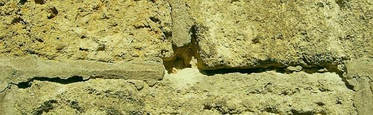 
Ausgebrochener Zementmörtel in denkmalgeschütztem Natursteinmauerwerk. 

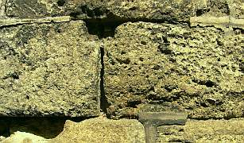 
Die überharten Zementmörtel halten Wasser zurück und frieren ab. 

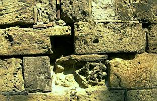 
Unter dem dichten Zementmörtel wird das Natursteinmauerwerk weiter geschädigt. 

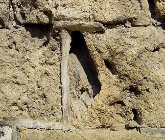 
Schwer vorstellbar, daß das ein Ergebnis von sorgsamer Denkmalpflege an einem bedeutenden Baudenkmal sein soll. 

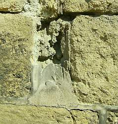 
So kann das Resultat von amtlich empfohlenen Restauratoren nach einigen Jahren aussehen. 

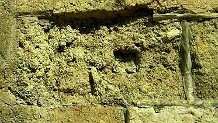 
Die durch Zementmörtel gestörte Entfeuchtung der Fassade verursacht tiefgreifende Schädigung der Natursteine: Abblättern, Rißbildung, Hohllagen, Schollenbildung. 

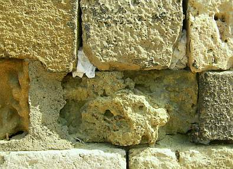 
Nur noch punktuell vorhandener zementhaltiger Restaurierungsmörtel / Steinrestauriermörtel in Denkmalfassade. Einige Tempotaschentücher, mit denen kundige Betrachter ihre tränenden Äuglein auswischten, inklusive. 

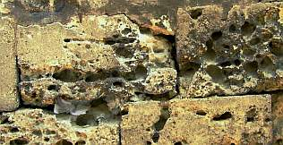 
Fragmentierte Zementmörtel im Umfeld der kavernenartig ausgespülten freigelegten - einst durch Kalkschlämmen geschützten - Natursteinoberflächen. 

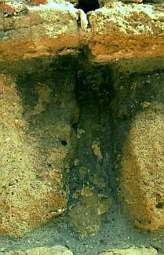 
Die kläglichen Reste des zementären Restaurierungsmörtels im Natursteinmauerwerk. 

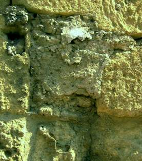 
Fragmentierte Zementmörtel, mürbe und hohlstehende Steinflächen 

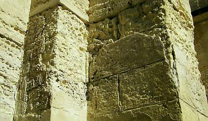 
An geschützteren Bauwerkspartien sind die ungeeigneten Zementmörtel und Zementputze noch etwas 'besser' erhalten. 

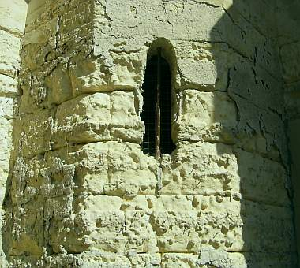 
Daß harte Zementmörtel und Zementputze auch wesentlich höhere Temperaturdehnung als der Untergrund aufweisen und deswegen bei entsprechender thermischer Belastung (jahreszeitliche und im Tag-Nacht-Rhythmus stattfindende Temperaturwechsel) abspringen, ist bei vielen Restauratoren, Denkmalplanern und Denkmalpflegern grundsätzlich unbekannt. 

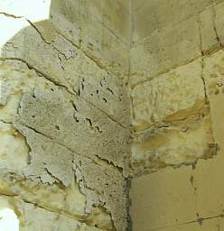 
Die ungeeigneten Zementschwarten müssen aus materialbedingten bzw. bauphysikalischen Gründen abblättern. Nicht ohne vorher den originalen Untergrund weiter zu schädigen. 

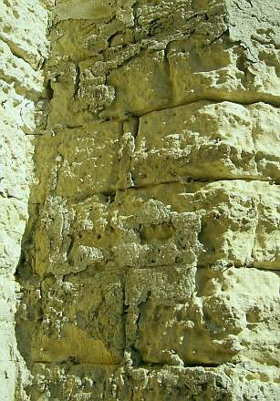 
Restaurierungsschrott am Baudenkmal - von staatlicher Denkmalpflege und 'erfahrenen' Denkmalschützern verbrochen. Auf Kosten der Steuerzahler und hochherziger Spender. 

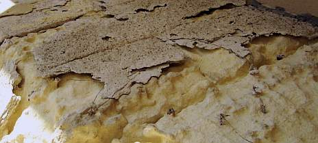 
Schäden am spröden Zementputz trotz metallischer Putzträger, feinfühlig in den originalen Putzgrund - Natursteinbauteile - verankert. 

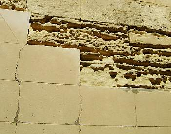 
Die Zementmörtelschwarten mit 'denkmalgerecht' natursteinfarbig pigmentiertem Deckputz / Oberputz fallen dem allzu neugierigen Betrachter hin und wieder auf die Rübe. 

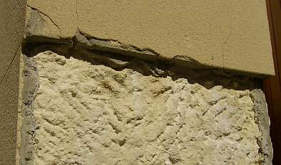 
Die Restaurierungskunst auf Zementbasis im Detail. Da sich die Temperaturspannungen an den Bauwerkskanten überlagern, springen die Stirnflächen der Stützpfeiler als erstes herab.

Wenn man daran denkt, wie in Anbetracht der immer zu knappen Mittel der staatlichen, kirchlichen und privaten Denkmalpflege diese quasi vom Mund abgesparten Gelder dann von einer zement- und kunstharzverliebten Restaurierbranche nach besten Kräften und mit übelsten Folgen für das eigentlich schützenswerte Bauwerk verjuckt und vergeudet werden, versteht man den Sinn des schönen Spruchs "Armut ist der beste Denkmalpfleger" schon besser. 

Denkmalschonende Reparaturkonzepte auf der Grundlage eines ausreichenden Materialverständnisses und vertiefter Einblicke in das Zusammenspiel von Bauphysik und Bauchemie am Altbau sowie Reparaturbaustoffe in traditionsbewährter Zusammensetzung verzichten auf Zement und andere hydraulische Bindemittel wie Traß und Hydraulkalk / hydraulischen Kalk NHL, geschweige denn ebenso schwachsinnige Wasserglasprodukte sowie Kunstharzpampen mit ebenfalls erhöhter Temperaturdehnung und Trocknungsblockade der damit versauten Restauriermörtel / Antragsmörtel, Injektionsmassen, Kitte und Oberflöchenbeschichtungen / Anstriche / Farben (siehe hier [Problem Silikatanstrich / Dispersionssilikatfarbe / 'Mineralfarbe' / Silikonharzfarbe](22bausto.md)). Ihre unter verschiedensten Bewitterungssituationen (Meeresnähe, Binnen- und Hochlage) bisher erreichten und kritisch begleiteten Ergebnisse überzeugen. Vor Wundern muß freilich gewarnt werden. Handwerksprodukte stellen nämlich auch verstandesmäßige Anforderungen an die Handwerkskunst. Schon ein "simpler" Kalkmörtel, eine Kalktünche oder gar eine Kalkinjektion können die diesbezüglichen Kompetenzen üblicher "Ausführender" - auch im baskenmützengeschmückten Restauratorengewand - überfordern. Temperaturbedingungen, Feuchtebedarf und -angriff, Verarbeitungsablauf, Zwischenaufmischung, Werkzeugeinsatz, Vor- und Nachbearbeitung von der Untergrundreinigung und Vornässung über die kalkige Haftbrücke bis zur aufbrennverhindernden und karbonatisierungsfördernder Nachversorgung und krustenverhindernden Nachverdichtung des steifen Frischmörtels, Materialwahl und kalktypische Baustoffkenntnis - wo sind die Handwerker, die das beherrschen und mit langjährig erfolgreichen Referenzen belegen können? Bitte zum Fußkuss anmelden: 09574-3011 (0-24Uhr). Aber kein Gschmarri, sondern prüffähige Fakten! Besonders schlimm: Der sich "erfahrener" Restaurator schimpfende akademisch angehauchte Herumwurstler, -pamperer und -schmierer, dem schon der simpelste Handwerksverstand für die Einsatzbedingungen des Materials total abgeht (vom oft massenweise auftretenden Reinexemplar dieser Überlegenheitsbrillanz rühren meine ergrauenden Haare, Suizidversuche und kummervollst verzweifelten Totalbesäufnisse mit schnödestem Fusel). Wer das mal an sich kritisch prüfen will, hier nachlesen: "[Die häufigsten Fehler bei der Anwendung von luftkalkgebundenem Putz und Mörtel"](2kalkfel.md)

Ein interessanter Materialhinweis aus der Praxis genialischer Backstein-Baumeister:

_"Wichtiger als (gestalterische) Besonderheiten der Technik ist die Möglichkeit, beim Nachfugen der Gefahr entgegenzuarbeiten, die darin beruht, daß die Wirkung der Fuge unter den Einflüssen der unreinen Großstadtluft schnell verwischt wird und so gut wie verschwindet: man kann zum Ausfugen ein besonders ausgesuchtes Material wählen, nämlich eine Mischung, die möglichst glatt und möglichst hart wird, damit sie den äußeren Einflüssen zu widerstehen vermag._

Umfangreiche Versuche nach dieser Richtung, die bei den Hamburger Staatsbauten gemacht wurden, haben ergeben, daß in der rußreichen Hamburger Witterung eine Mischung von 2 Teilen Muschelkalk, 1 Teil Weißkalk und 2 Teilen Sand eine glatte, nicht sehr blanke und nicht mehr ritzbare Fugenfläche ergab; wurde ein Teil Muschelkalk genommen, so war die Wirkung der Fläche die gleiche, aber sie wurde ritzbar; nahm man statt Weißkalk 1 Teil Zement, so wurde die Masse blank und nahm noch zu an Härte; wählte man statt des Muschelkalks 1 Teil sogenannten weißen Zement (englisches Fabrikat), so war das Ergebnis blank, aber ritzbar; Meteor-Kalk machte es weniger blank und rauher.

Die natürliche Farbe aller dieser Mischungen war ein angenehmes Grau. Wollte man ein stärkeres Weiß haben, so wurde das erzielt durch 1 Teil Weißkalk, 1 Teil Lüneburger Kronkalk und 1 bis 2 Teile Sand; das Ergebnis war weiß, glatt, blank und sehr hart. Im allgemeinen dürfte die Mischung von 2 Teilen Muschelkalk, 1 Teil Weißkalk und 2 Teilen Sand zu empfehlen sein." (aus: Fritz Schumacher: Das Wesen des neuzeitlichen Backsteinbaues, München 1920, S. 101 ff.)

Hätte Schumacher schon gewußt, daß hydraulische Bindemittel wie Hydraulkalk, Portland- und Weißzement ausblühfähige Schadsalze sowie mobile Sulfate und Magnesium enthalten, mit sulfat-/gipsbelasteten Untergründen Treibmineralien bilden, den Wasserbedarf und das Schwinden erhöhen, gegenüber Ziegelstein deutlich langsamer austrocknen und wegen ihrer überhöhten Härte und Temperaturdehnung auch zum Flankenabriß inkl. Kapillarwasseraufnahme wg. erhöhter Wärmedehnung gegenüber Ziegel aufweisen, wäre er den genannten Hydraulen gegenüber wohl etwas kritischer gewesen. Und die heutzutage geübte undeklarierte Verpanschung des (angeblichen) Muschelkalks mit Hüttensand oder anderen Schadsalz- und Härtelieferanten hätte er bestimmt auch nicht gut geheißen.

Natürlich spült der Regen auch aus verdursteten, aufgebrannten oder - gar nicht so selten - in dem für solche Arbeiten ganz und gar ungeeigneten Winterhalbjahr mit grundsätzlich gestörten und frostgefährdeten Austrocknungs- und Abbindebedingungen möglichst ohne ausreichenden Schutzverbau des Gerüsts hergestellten - Kalkmörtelverfugungen - ebenso wie bei zementären Varianten - oder einer undichten Betonattika die unabgebundenen Bindemittel - Calciumhydroxid Ca(OH)2 - nach außen. Diese bilden dann durch die Aufnahme von Kohlendioxid die herrlichsten Versinterungen als Weißschleier aus Calciumcarbonat (Ca(OH)2+CO2->CaCO3) auf der Fassade. Und müssen dann mit Ameisen-, Zitronen- oder gar Salzsäure in passabler Verdünnung mit folgender Neutralisierung (Wasserspülung!) abgesäuert, im Einzelfall sogar mechanisch (Strahlverfahren mit selbstauflösendem Granulat wie Trockenschnee, Hammer und Pickel, ...) abgenommen werden. Wenn man sie nicht als Pfuschdokument erhalten will. Eine gegen die Feuchtezufuhr gedachte Hydrophobierung mit allerlei Chemiewaffen bringt da nichts, da weder die Feuchtezufuhr damit dauerhaft unterbunden werden kann, noch die schon eingedrungene Bawerksfeuchte noch kapillar - und nur so geht es(!) - austrocknen. Danach kann man sich um die defekten Mörtel kümmern und sie fachgerecht in aufbrennsicherer Manier gegen bessere (zement- und kunstharzfreie!) Rezepturen austauschen. Siehe hierzu auch die weiteren Ausführungen dieser Seiten. 

Tipp: Bemustern, ausreichend lange warten (möglichst einmal überwintern bis eventuelle Abbindestörungen als Ausblühung zutage treten), begutachten und erst dann ausführen - ebenso vorgehen vor der Abnahme! Denn:

Gerade für die Handwurstler besitzt die Rucki-Zucki-Verarbeitung "erdfeuchter" Fug- und Versetzmörtel mit Fugeisenverdrucksung und Naßbepinselung eine geradezu unfaßbare Anziehungskraft. Man vermeint dabei Zeit zu gewinnen, spart Bewässerung der Einbausituation, muß nicht die Steinflanken gegen Bindemittelverunreinigung aus gut feuchten Mörteln schützen, braucht nur wenig nachzureinigen, rechnet mit dem "klugen" Bauleiter und Auftraggeber, die den ganzen Humbug abnehmen und redet sich dann nach Auftreten der Flächenausblühung mit allem Möglichen heraus: lieferantenseitige Materialfehler, auftraggeberseitige Planungs-, Fristsetzungs- und Jahreszeitfehler, Weißnixvongarnixniemalswas - eben das große Einmaleins der Ichdochnichtgarniemalsnie-Gewährleistung. Aber im Brustton der Überzeugung! Was kann man hier - nicht nur in vielen Fällen in Deutschlands hohem Norden - für Erbärmlichkeiten der schmieraxeligen Handwurstelbrunst kennenlernen - und nicht nur vor der Apotheke ...

Themenlink: [Schädliche Hydraulbestandteile](2beton16.md#hydraulsalze)

.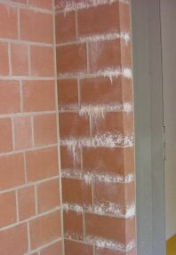 
Sinterkrusten auf staatsbauamtlichem Betonsteinmauerwerk aus verdurstetem Kalkzement-Trockenmörtel eines renommierten Herstellers blühen krustig aus 
_(Bildautor:[Peter Schneider](http://www.fassadenreinigung-und-instandsetzungsservice.de/) 12.5.03)_

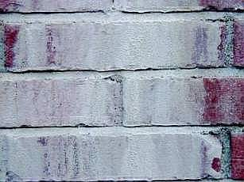 
Dem privaten Bauherrn eines riesigen backsteinverblendeten Stararchitekturbaus ging es auch nicht besser.

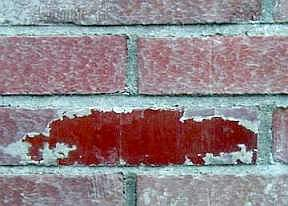 
Die kalkwasserhinterläufige Grafitti-Schutzbeschichtung schützt dabei nur bedingt: Erst wenn ihre Kalkeiterbeulen aufplatzen, können die Kalziumhydroxidkristalle zu Kalziumkarbonat aussintern. So war das aber nicht bestellt.

Und ob das staatliche Autobahnklohäuslbauamt den ihm aufgeschwatzten Graffitischutz genau so haben wollte? 
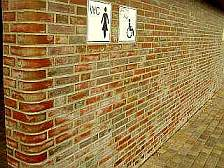. 
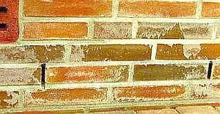.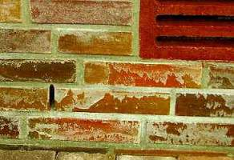 
Wohl eher nicht - oder doch? Wären da Grafittis nicht netter?

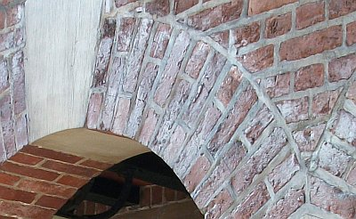. 
Oder hier, justament frisch aufgetragener Graffitischutz auf die Baudenkmalsubstanz - das Weiße vom Ei? (Bildquelle: Peter Schneider) 

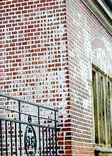 
Auch mit gut gemeinten Kalkverfugungen kann schnell alles [schiefgehen](2kalkfel.md), wenn der Zementfugmörtel das Vorbild für Rezeptur und Verarbeitung liefert und der Regen einfach so in die ungenügend abgebundenenen Frischmörtelfugen reinsuppt und die Fuge dauerfeucht hält.

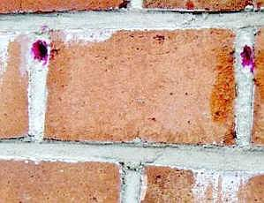 
Der Luftkalkmörtel kann dann auch nach Jahren nicht karbonatisieren, denn wo soll das CO2 denn hin, wenn überall H2O ist? Ein Phenolphtaleintest belegt das sehr schön buntfarbig, abgefrostete Mörtelschollen ebenso. Oh, deutsches Handwerk!

  
Aus meiner [Bauberatung ](2berat.md)(Foto Bauherr): Versalzte Wand, falsch verputzt - das Ergebnis: 
Zementputzversaute Mauerziegelschale wird durch [Salzkristallisation](2salz.md), Feuchtestau und Frost abgesprengt. 
Das freigelegte Fundamentmauerwerk im speicherfähigen Erdreich hält die Schadsalzbefrachtung aus. 
Dort gibt es ja wg. Dauerfeuchte weniger Kristallisationsdruck, wg. Speicherfähigkeit weniger Frostangriff und keinen Feuchteblockerverputz. 
Die Mörtelfugen im Fundament waren natürlich auch hinüber.

 
Ähnlicher Schadensfall aus [Bauberatung ](2berat.md)(Foto Bauherr): Hier liegen nur teilweise Salzüberlastungen vor - ein Unding, wenn man an ["aufsteigende Feuchte"](2aufstfe.md) glaubt - die ja eine von unten nach oben einheitliche Salzlösung und Salzbeladung und Schädigung des Mauerwerks hervorbringen sollte. 
Feuchteblockender Zementverputz schädigt dann an den salzüberlasteten Mauerpartien am meisten. 
Die morschbröseligen Mauerziegel lassen sich mit dem Finger herauspulen. Wie es hier weitergeht? 
Fragen Sie mal versuchsweise drei Mauertrockenleger. Da tropft das salzige Wasser aus Ihren Äuglein! (zum [Handwerkerquiz](10hoai13.md))

Weiter: [[Natursteinrestaurierung 3: Reparaturmörtel / Restauriermörtel - Fluch oder Segen?]](29bau03.md)
