[🠔 Zur Übersicht: Natur- & Ziegelstein](29bausto.md)  
# Reparaturmörtel - Fluch oder Segen?
**Reparaturmörtel müssen vor allem auf die Verträglichkeit des betroffenen Objekts eingestellt werden – nicht wie bei der Betonsanierung gewohnt auf die optimale Methode aus Verarbeitersicht.**  
_von Konrad Fischer • aktualisiert 02.02.2008_

Altbautaugliche Verfahren und Baustoffe 
Kapitel 9. Natursteinrestaurierung, 10. Wandbildner im Vergleich und 10.a Fachwerkinstandsetzung 

## [9.3] Reparaturmörtel - Fluch oder Segen?

**(aktualisiert 2.02.08)** 

Unterkapitel - **9. Natursteinrestaurierung** : [[1]](29bausto.md) [[2]](29bau02.md) [[3]](29bau03.md) [[4]](29bau04.md) [[5]](29bau05.md) [[6]](29bau06.md) 
**Steinboden** : [[7]](29bau07.md) 
**Reinigungstechnik** : [[8]](29bau08.md) 
**10. Wandbildner im Vergleich** : [[9]](29bau09.md) [[10]](29bau10.md) [[11]](29bau11.md) [[12]](29bau12.md) [[13]](29bau13.md) [[14]](29bau14.md) [[15]](29bau15.md) 
**10.a Fachwerk/Blockbau** : [[16 - Die schärfsten Tipps zur Fachwerkrestaurierung: Woran erkennst Du einen Fachwerk-Experten?]](29bau16.md) [[17]](29bau17.md) [[18]](29bau18.md) [[19.1]](29bau19.md) [[19.2]](29bau192.md) 
**Bodenaufbau/Holzboden** : [[20]](29bau20.md) 

Reparaturmörtel müssen vor allem auf die Verträglichkeit des betroffenen Objekts eingestellt werden - nicht wie bei der Betonsanierung gewohnt auf die mit Kunstharz mistifizierte optimale Hui-und-Pfui-Methode aus Verarbeitersicht. Die technischen Parameter des Mörtels müssen gegenüber dem Bestand eine deutlich erhöhte Entfeuchtungsleistung und deutlich niedrigere Festigkeiten gewährleisten. Wichtig ist auch eine möglichst identische Temperaturdehnung und Vermeidung von Schwundrissen durch die gewohnten Verarbeitungsfehler 

- zu trockene Mörtelflanken entziehen Frischmörtel Wasser zu schnell (Aufbrennen), 
- zu hoher Feuchtegehalt des Mörtels bzw. Verwendung zu hoher Feinanteile im Mörtel (bindet zu viel Wasser und verursacht deswegen Schwundrisse beim Trocknen), 
- zu viel Nachnässung im Frischmörtelzustand (keine Naßbepinselung!), 
- keine Entfernung der trocknungsblockierenden Sinterhaut (ungleichmäßiges Trocknen durch geringer verdichtete Mörtelzonen verursacht dort Schwundrißbildung, 
- kein Nachdrücken des angebundenen Frischmörtels mit geeignetem Fugwerkzeug (kann dennoch entstandene Rißzonen rechtzeitig schließen) und 
- kein Baustellenschutz während der Verarbeitung gegen Bewitterungsschäden. 

Dadurch wird die Belastung des Bestands aus zu hohen Festigkeiten, Schadsalzgehalten, Bewegungsspannungen, Kapillarrißbildung mit hoher Feuchteeinlagerung oder zu hoher Dichte des Neumörtels verringert. In den besonders beanspruchten Bereichen und tiefen Fehlstellen können dann auch die sehr teuren Natursteinvierungen die richtige Entscheidung sein.

Der Verzicht auf Kunststoffzusätze führt im Unterschied zu konkurrierenden Produktrezepturen zum steinverträglicheren Ergebnis: Die rein mineralischen Ergänzungsmörtel begünstigen die Kapillarentfeuchtung (= 99,9 % des Feuchtetransports im Bauwerk!) und blockieren sie nicht. Der von der Kunstharzfraktion propagierte Begriff "Dampfdiffusionsoffen" ist hier eine bewußte Irreführung. Wo sitzt denn das Männlein mit Tauchsieder im Baustoff, das eingedrungene Feuchte verdampft? Das Abdunsten findet nur auf der obersten Zone der luftumspülten und sonnenbeschienenen Baustoffoberfläche statt. Wenn dort eine Kunstharzhaut, eine Zementkruste oder Wasserglaspelle ansteht, staut sich darunter das Wasser bzw. die sich dann innenseitig immer mehr anreichernde Salzlösung. Bis die Schwarte kracht. Das dauert gar nicht so lange und fördert das Absaufen des Baustoffs. So tragen die meisten Restaurierprodukte der unseligen Bauchemiefront auf der Grundlage von Synthetikzutaten und Silkaten / Silikonen mangels ausreichender Kapillartrocknungsfähigkeit schon den Keim der Vernichtung ihrer selbst, tragischerweise auch der angeblich damit geschützten Bausubstanz in sich. Dochdas ist wohl so gewollt von der diesen Fassadenmüll propagierenden staatlichen und gewerblichen Restaurierbranche. So sichert man Unentbehrlichkeit, Aufträge, Umsätze und nette Präsente bis in alle Ewigkeit.

_Objektbeispiel - So wäre es richtig: Handwerklich einwandfreie, dauer- und froststabile Luftkalkmörtelfugen (Ausführung:[Peter Schneider, Bad Zwischenahn](http://www.fassadenreinigung-und-instandsetzungsservice.de/)) im von seiner oberflächenzermürbenden Zementverschlämpung und -nachverfugung mühsam freigelegten Backsteinmauerwerk (an Deutschlands Küste!) - Pfeilermauerwerk und Verfugungsdetail:_

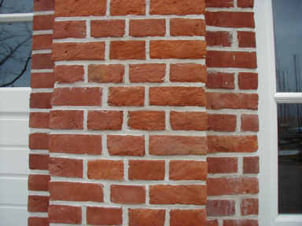. 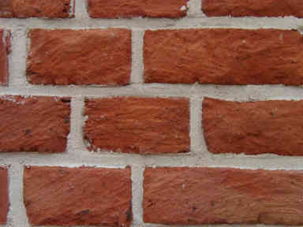

Um mal in der Historie zu kramen - denn richtiges Bauen kommt nur aus der Erfahrung, hier drei Beispiele für Verfugung von Ziegelsteinfassaden:

Die Zementmörtellösung nach nur wenigen Jährchen: 

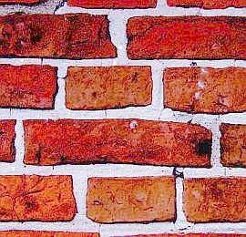Hier auch.

Alles aufgerissen, alle Flankenanschlüsse der Fugmörtel abgelöst, Backsteinfronten wegen schädlicher Hydrophobierung extra ordentlich abgescherbelt, Fugnetz desolat hoch drei, Wasser dringt in Wand ein und durch. Eben klassische Moderne des aufgeklärten Menschen.

Die Kalkmörtellösung nach mehreren hundert Jahren: 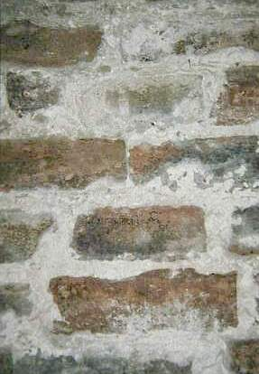

Fugennetz zwar dolle ausgeapert, aber keine Abscherbelungen der Steine, keine Flankenablösungen der Fugmörtel, keine explosive Zerstörung der Fug- und Setzmörtel. Liegt das nur dran, weil die Mauerer dieser Kirchfassade streng katholisch waren und auf göttlichen Beistand rechnen konnten?

Technisch und wirtschaftlich hat ein Schutzüberzug der Steinfassaden mit natürlich vergüteten Kalk-/Kalkkasein-Anstrichen oder Kalkmörteln/-schlämmen Vorteile: Der Fassadenschutz wäre im Sinn bewährter Bauweise gesichert, sein Unterhalt unproblematisch und substanzverträglich. Für Natur- und Patinafreaks kann man solche Anstriche auch farblich einstimmen. Vom Selbstversuch ist hier allerdings abzuraten. Es bedarf großer Rezepturkenntnisse, um das Bindemittel/Pigment/Korn-Verhältnis bedarfsgerecht einzustellen. Hier drohen grausamste Enttäuschungen.

Vorsicht: Es gibt Versuche, die typischen Eigenschaften kunststofffreier Mörtel in anderen Produktkonfigurationen - mit unüberblickbaren Risikoeigenschaften - nachzustellen. Lassen Sie sich nicht reinlegen, bemustern Sie rechtzeitig und verlangen Sie [Volldeklaration](2volldek.md)! Auch der Einsatz von dauerhaft wirksamen Trocknungsblockern wie Hydrophobierungsmittel und Methylzellulose - gerade ersteres allen leichtgläubigen und firmenabhängigen Planern seit jeher am liebsten als Zauberwaffe gegen Feuchte aufgeschwätzt - ist kritisch zu hinterfragen. Grausames Beispiel:

Die teuerstkostige Kaputtierung von Baudenkmalen durch nach allerbestem Wissen handelnde Billigmacherteams 
Aus Jörg Fanelli-Falcke/Bernhard Recker: 

"**_Umgang mit Backsteinbauten, speziell von Bernhard Hoetger" 
_**in: _Berichte zur Denkmalpflege in Niedersachsen 3/2002_ ... 

_"[...] Eine erste Sanierung fand um 1960 durch örtliche Handwerker statt. Hierbei wurde offensichtlich das Zusammenwirken von weichem Mörtel (Muschelkalk) und weichem Ziegelstein nicht berücksichtigt, so dass dieser Instandsetzung kein dauerhafter Erfolg beschieden war. 
1980 war man sich bei einer weiteren Sanierung sicher, den richtigen Weg gefunden zu haben. Zusätzlich zu den Reparaturen wurde dank einer großzügigen Spende der chemischen Industrie eine Hydrophobierung des Objektes vorgenommen. 
Dramatische Schäden machten 1998/99 eine erneute grundlegende Sanierung erforderlich. ... viele der Steine Abplatzungen aufwiesen und [...] Schalenbildung auftrat. Überall [...] lagen teils großformatige Ziegelstücke auf dem Boden, deren Bruchstücke eine permanente Gefahr für den Besucherverkehr am Denkmal bildete. ... 
Durch die Hydrophobierung schien [das Denkmal] zwar einerseits gegen eindringende Feuchtigkeit vorübergehend geschützt zu sein, andererseits hatten über zahlreiche Risse eindringende Niederschlagswässer zu einer massiven Durchfeuchtung des Denkmals geführt, die wegen der hydrophoben Oberflächen auf kapillarem Wege nicht mehr nach Außen gelangen konnte. 
Das Riss- und Schadensbild wurde durch aus unterschiedlichen Materialeigenschaften resultierenden Spannungen - so war der Reparaturmörtel der 1980er Jahre mehr als doppelt, der damalige Stein mehr als viermal so fest wie das Originalmaterial - noch verschärft. Hinzu kam ein völlig unterschiedliches Saugverhalten der Ziegel. [...] 
Der innere, völlig durchnässte Kern bestand im Wesentlichen aus Kalksandstein. Die Tragkonstruktion aus Eisenträgern mit angeschweißten Ankern war soweit korrodiert, dass eine Gefährdung - Abstürzen von ganzen Mauerwerksteilen - nicht auszuschließen war. [...]"_

Wir lernen: Trotz intensivster denkmalpflegerischer Hinwendung, trotz schlaumerischster Restaurierungskonzepte unter Zuhilfenahme beliebter Denkmalcracks und Bauchemiker, trotz Sparen an allen Enden (wohl vorwiegend am materialverständigen und HOAI-gerechtem Planen und Honorieren) - so zerdeppert "man" (man kennt all diese "Mans" und "Fraus") Bauwerke zum Deppendenkmal. 

Und so sieht das dann praktisch aus - das finden wir an arg vielen Backsteinfassaden einige Jahre nach Hydrophobierung:

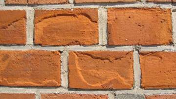 
_(Hydrophobierungsbedingtes Abscherbeln hinterfrorener Backsteinoberfläche irgendwo in Norddeutschland - Aufnahme: Dr. Frank Schlütter, MPA Bremen)_

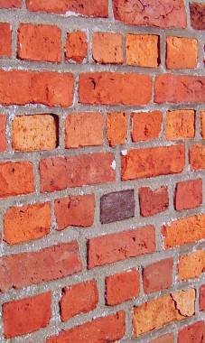 
_(Und das von mir persönlich im Norden fotografiert)_

Wir wollen gar nicht fragen, wie viele kluge Baubeamte, erfahrene Handwerker, renommierte Restauratoren und sachverständigste Planer nach besten Kräften dabei mithalfen. Denn wir wissen es. Genau so geht es ja überall zu, auch dank kräftigster Förderung durch oberknappsigste, niemals nicht HOAI-finanzierungsbereite Haushaltvergeudungsmittel, Denkmal- und Städtebauvernichtungsförderungen, die den produzentenabhängigen Planer geradezu vorschreibt. Und das nicht nur zur Winterszeit. Oder nur bei erniedrigten Sachsen. Denn die Mittel der Chemiepampenproduktion sind gewaltig und setzen auf den überall anzutreffenden geneigten Planer. Er arbeitet teuer für Billighonorar. Dank Hinzuziehung der umsatzbesessenen Chemieverkäufer zur Planung. Die ihm jeden Wunsch von den Augen ablesen, wenn er nur 

1. auf fachgerechte, d.h. zur Ausführung kompatible und gegenüber angegeiltem Firmengeflüster hyperkritische Bestandsaufnahme und -analyse verzichtet, 
2. auch nicht das geringste Grundwissen von Baustoffeigenschaften und Reparaturtechniken in seine Planung einbringt und deshalb 
3. umsatzfördernde Teuersinnlosverfahren der produzentenabhängigen "Bausanierung" - mißbraucht oft sogar als "Kompetenznachweis" - seinem unkundigen Bauherrn aufschwätzt, 
4. VOB-verbotenermaßen Sanierungsmüll "oder gleichwertig" ausschreibt (Risiko, dabei von der Rechnungsprüfung erwischt zu werden, nimmt er auftrags- und gefälligkeitshalber hin), damit 
5. die Baukosten und den Produzentenumsatz maximal nach oben treibt und 
6. durch den bestandsvernichtenden Chemiewaffenangriff die nächste Sanierung der Sanierung baldmöglichst vorprogrammiert. Die kriegt dann der noch billigere Planungskonkurrent, natürlich als Wiederholung des bewährten Spiels. Dafür sorgen schon die zugehörigen Bauherrnentscheidungen. Bestes Beispiel für solche Absurditäten sind unsere kommunalen, staatshochbauamtlichen und kirchlichen Bauherren landauf und -unter.

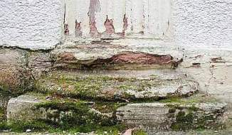 
_Das ist das stein- und fassadenzerrottende Ergebnis einer wasserabweisenden Mineralfarbbeschichtung nach drei Jahren. 
Planer: Staatsbauamt, Ausführendes Unternehmen: Innungsbetrieb 
Objekt: Regierungsgebäude, Verwaltungsnutzung 
Steuergeld: Vernichtet 
Zählt das dann auch zur Regierungskriminalität?_

 Und hier ein Planungsergebnis bzw. Restaurierungserfolg aus Fachberatung Chemiewaffenhersteller und Bundesbahnbauamt, in den ersten Jahren heftigst bundesweit in buntem Hochglanz beworben, schon bald danach heftig verschwiegen, inzwischen schon wieder in neuerlicher und leider umfangreichst erforderlicher Restaurierung begriffen. 

Warum, sieht man dem nachfolgenden bunten Kaleidoskop der Schadensbilder an, die vom Steinzerfall der hydrophobierten und damit wassersperrend-trocknungsblockierenden Bauteiloberflächen, Mörtelbröckeln, kunststoffvergüteten Zementfugenreißen, Bemoosen, Veralgen, Auffeuchten, Auffrosten, Frostsprengung, Baustoff-Dilatation, -Erosion, -Korrosion, Absandeln, Abscherbeln, Zermürben, Schollenbildung, Hohllagigkeit, Abreißen, über die Beschichtungsablösung wegen Hinterdringung mit Feuchte, Craqueleé der kunstharzhaltigen Beschichtung (Silikonharzfarbe / Siliconharz-Emulsionsfarbe) mit nachfolgendem Kapillarsaugeffekt bis zur massiven Abscherung ganzer Steinpartien keine Grausamkeit auslassen, die mit schädlichen Wunderwaffen der bauchemischen Sanierindustrie heutzutage als denkmalbewärte Ergebnisse doktorierter Bauwissenschaftlerei via korruptionsgestützes und alle Gebote der Produktneutralität im öffentlichen Ausschreibungswesen gem. VOB verletzenden An-den-Mann-bringen im sogenannten Denkmalschutz hierzulande und weltweit gang und gäbe sind: 

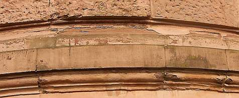 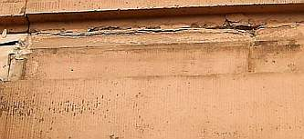 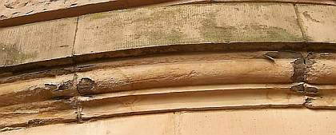 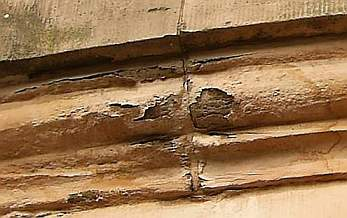 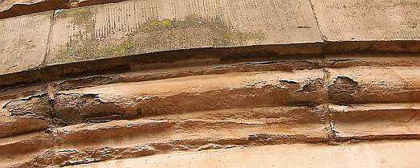 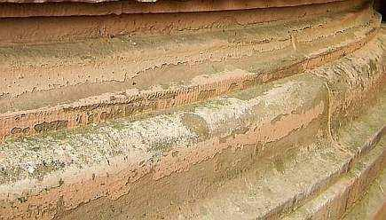 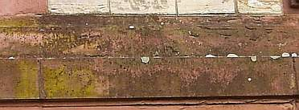 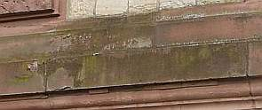 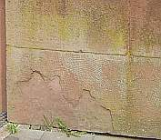 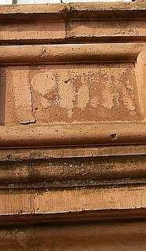 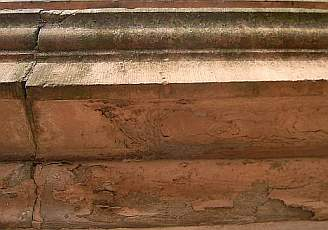 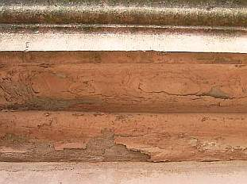 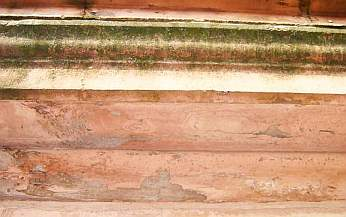 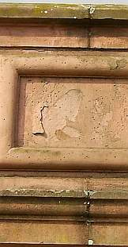 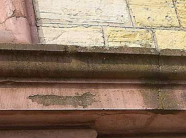 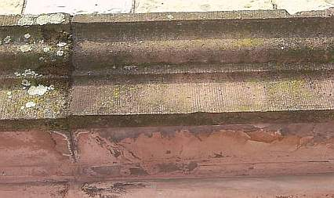 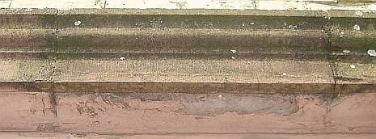 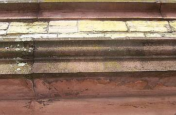 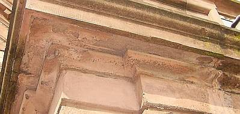 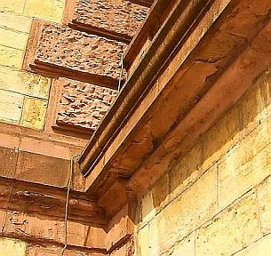 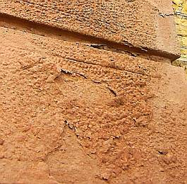 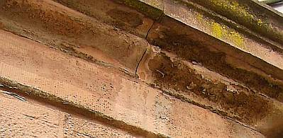 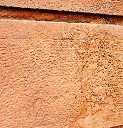 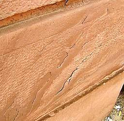 

Dabei gäbe es bestandsverträgliche Handwerks-Alternativen: Gegenüber Anstrichsystemen mit wasserabweisenden, kunstharzhaltigen, schadsalzabspaltenden und überfestigenden Zusätzen bieten kalkbasierte Anstrichsysteme ohne Kunstharzverschneidung eine traditionsbewußte Lösung. Es geht auch ohne Silikonharzemulsionen, echt! Im Innenbereich und bei weniger beanspruchten Steinpartien außen ist auch die Reprofilierung mit [Luftkalkmörtel](2kalk.md) eine denkmalverträglich Lösung. Er darf aber nicht mit wasserabweisend/überdichten/überfesten kunststoff- oder silikathaltigen Anstrichen beschichtet werden, um die zur Abbindung und auch später erforderliche Trocknung, Karbonatisierung und Rißheilung durch Nachversinterung notwendigen bauphysikalischen Eigenschaften nicht zu verlieren. Bestandsschonend und denkmalgerecht ist auch die Injektion von Hohlräumen und Schollenpartien mit Kalkmassen und das Nachfestigen absandelnder Partien mit Kalksinterwasser. Hier ist keine üble Reaktion überfestigter Krusten zu befürchten, wie sie sonst so gerne auftritt. 

Ein immer wieder zu beobachtender Brutalverstoß gegen die kalktypischen Handwerksregeln ist das bedenkenlose Abweichen von der Vierkornregel gerade bei mehlfeinen Spachtelmassen (ein bewährtes Haarißfüllmaterial, gut geeignet auch für das Anböschen von pellenartig abgesprungenen Fehlstellen an der Abrißkante zur Originaloberfläche!): Schichtstärke höchstens 4 x Korndurchmesser, bei haarigen Einbausituationen weniger! Alles andere ist von großem Übel und haut nicht hin. Nachlesen: [Typische Fehler](2kalkfel.md)

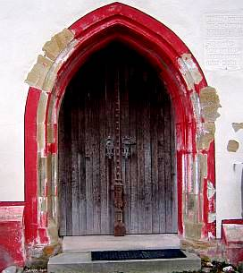 
_Ein kirchbau- und denkmalamtlich betreute Fassadensanierung in "jahrhundertelang bewährter" Silikat- und Zement-Restauriermörteltechnik nach wenigen Jahren (Übersicht) und im Detail:_

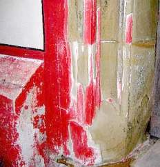+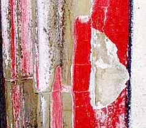 
_Für solche silikatisch-hydrophobische Sanierkunst schmeißt man doch gern und alle Jahre wieder den letzten Knopf in den Klingelbeutel._

**Anmerkung** : Leider werden historisch wertvolle Natursteinfassaden - egal ob aus Kalkstein oder Sandstein, aus Granit oder Tuff - durch die einer romantisierenden Naturästhetik entspringenden Forderungen nach "Natursichtigkeit" am meisten der Zerstörung ausgesetzt. Nur ein traditionell bewährter, das heißt nicht feuchteblockierender Anstrich schützt aber als Opferschicht die Natursteinoberflächen und Fugen vor dem Verwitterungsangriff. Um dem vorherrschenden Naturalismus entgegenzukommen, kann der Anstrich auch im Steinton pigmentiert werden. Bei entsprechendem Rezepturwissen und Handwerksgeschick gelingt dies sogar bei Kalkanstrichen auch in intensiveren Farbtönen. 

_Eine Untersuchung von historischen Mörteln, sog. "Muschelkalkmörtel" (recte Hüttensand-Mörtel) und anderen Restauriermörteln, die dem Verständigen indirekten Klartext spricht, stellt die MPA Bremen ins Netz (pdf):[Schlütter/Juling: Mikroskopische Untersuchungsmethoden in der Analytik historischer Putze und Mörtel](http://www.mpa-bremen.de/pdf/Nimbschen2000.pdf) Das sollte jeder Restaurierungsschlaumeier mindestens gelesen, wenn nicht sogar verstanden haben!_

Weiter: [[Kapitel 4: Wasserabweisung/Hydrophobierung - Details / Festigung - Probleme]](29bau04.md)
