[🠔 Zur Übersicht: Natur- & Ziegelstein](29bausto.md)  
# Restaurierung Naturstein und Fachwerk, Wandbaustoffe im Altbau ...
**Bestandsgerechte Natursteinrestaurierung - geht das mit Zement? Gruselbeispiele zuhauf.**  
_von Konrad Fischer • aktualisiert 06.04.2009_

Altbautaugliche Verfahren und Baustoffe 
Kapitel 9. Natursteinrestaurierung, 10. Wandbildner im Vergleich und 10.a Fachwerkinstandsetzung 

## [9.5] Zementästhetik

Unterkapitel - **9. Natursteinrestaurierung** : [[1]](29bausto.md) [[2]](29bau02.md) [[3]](29bau03.md) [[4]](29bau04.md) **[5]** [[6]](29bau06.md) 
**Steinboden** : [[7]](29bau07.md) 
**Reinigungstechnik** : [[8]](29bau08.md) 
**10. Wandbildner im Vergleich** : [[9]](29bau09.md) [[10]](29bau10.md) [[11]](29bau11.md) [[12]](29bau12.md) [[13]](29bau13.md) [[14]](29bau14.md) [[15]](29bau15.md) 
**10.a Fachwerk/Blockbau** : [[16 - Die schärfsten Tipps zur Fachwerkrestaurierung: Woran erkennst Du einen Fachwerk-Experten?]](29bau16.md) [[17]](29bau17.md) [[18]](29bau18.md) [[19.1]](29bau19.md) [[19.2]](29bau192.md) 
**Bodenaufbau/Holzboden** : [[20]](29bau20.md) 
**(aktualisiert 6.04.09)**

**Zementästhetik**

Zur ästhetischen und bautechnischen Problematik der "romantischen" Mode der Steinsichtigkeit ein Zitat aus Pat Gibbons: "Case studies of traditional lime harling - a discussion document, Technical conservation, research and education division, Historic Scotland, 1996:

_"Früher waren viele Gebäude mit verschiedenen Arten von Oberflächenschutz beschichtet. Sie waren üblicherweise aus kalkgebundenen Baustoffen und bedeckten nicht nur das Mauerwerk, sondern auch die Architekturdetails._

_Nach einiger Zeit verschlissen diese Schutzschichten und wurden oft nicht mehr ergänzt, der wichtigste Grund für ihre Vernichtung war aber die victorianische Mode [des 19. Jahrhunderts], Oberflächenbehandlungen mittelalterlicher und nachmittelalterlicher Bauwerke zu entfernen. Hieraus folgte für die dann entblößten Gebäude nicht nur, daß sie sehr unterschiedlich im Vergleich zu ihrem gewohnten Erscheinungsbild aussahen, sondern sich auch ganz ungeeignet verhielten._

_Die bis ins späte 20. Jahrhundert fortgesetzte Mode, Mauerwerkfassaden zerstörerisch freizulegen, wurde in seiner schädigenden Wirkung noch verstärkt durch überall eingesetzte zementhaltige Fugen- und Putzmörtel._

_In beiden Fällen ist das Ergebnis eine Parodie auf das historische Erscheinungsbild und eine dauerhaft schlechtere Widerstandsfähigkeit des Bauwerks gegen Bewitterung." (Übersetzung Konrad Fischer)_

Dabei ist zu berücksichtigen, daß zementhaltige Fugenmörtel dem Bauwerk nicht nur schädliche Salze zuführen, sondern auch durch ihre Überhärte Temperaturspannungen und sonstig bedingte Bauwerksbewegungen nicht mehr wie elastische Kalkmörtel aufnehmen können. Folgen: Vermehrte Rißanfälligkeit, Rißbildung im Zementmörtel, dem Fugenflankenbereich und sogar durch die Steine mit der Folge ständig erhöhter Wasseraufnahme. Da außerdem Zementmörtel (s-Wert 2,5) 10mal höhere Wasserrückhaltung als Kalkmörtel (s-Wert 0,25) aufweisen, ist eine 10fach erhöhte Wasserbelastung, Trocknungsverzögerung und Frostanfälligkeit der Fassade das traurige Ergebnis moderner Bauweise. 

Daraus darf aber nicht unbedingt abgeleitet werden, zementäre Flicken und Fugennetze müssen prinzipiell herausgeschlagen werden. Natürlich stehen sie meist hohl, sind stark gerissen, von vielen Fugenflanken abgerissen, und schädigen den Bestand. Jedoch: Ihr Herausschlagen bzw. mühseliges Herausfräsen geht nicht ohne erheblichen Verlust des originalen Bestands vor sich und kostet irrsinige Geldsummen. Nebenbei handelt es sich auch bei altem Zementkram um baugeschichtliche Ereignisse im Sinne der Denkmalpflege. Bis ins 19. Jh. reicht die bestandsvernichtende Industriegläubigkeit der Bauzunft ja schon zurück, alle wichtigen Baudenkmale durften schon darunter leiden. Es kommt also oft darauf an, geeignete Reparaturstrategien zu finden, die sowohl den Bestand erhalten, ihn vor unvertretbarer Feuchtebelastung schützen und kurz- bis langfristig das wirtschaftlichste Ergebnis liefern. Eine Rückführung auf historisierend-rekonstruktive Verputzung muß das nicht liefern. Es gibt Zwischenstufen, die das gewünschte Ergebnis auch ohne Gestaltwandel bewerkstelligen. Dabei spielt die aktuell verfügbare Kalktechnologie (natürlich vergütete Kalkbindemittel, -mörtel und -schlämmen nach bewährtem Vorbild) und ihre handwerksgerechte Umsetzung eine wichtige Rolle. Auch hier gilt: Vorsicht vor Pseudolösungen, die den guten Namen des Kalkes mißbrauchen und dennoch Hydraulen, Industrieabfälle (ausblühfreundlicher Hüttensand!), Synthetiks, Wasserrückhalter und anderen Chemiekrempel hineinbugsieren - am liebsten undeklariert.

Ein Beispiel aus meiner eigenen Praxis der oberfränkischen Kirchenbaurestaurierung, als ich 1984 noch an deutsche Restauratorenkunst, wohlmeinende Fachberatung der Mörtelindustrie, praxistaugliche Denkmalbehördenempfehlung und klugkompetente Kirchbauamtsreferenten glaubte (Aufnahmen 12/03):

 
Vom Bamberger Natursteinrestaurierungsfachbetrieb - sehr empfohlen von Denkmalamt! - brutal geweiterte Fuge, Zementmörtel (Produkt ...os) schon herausgesprungen, späterer roter (!) Reparaturmörtel über altem Restauriermist auch schon. Wasser rinnt ins Bauwerk - das ist die gewohnte Handwerkskunst der Restauratoren im Steinmetzgewerk! Überall anzutreffen, Augen auf!

 
Zementäre Originalreparatur (aus der von mir zu vertrenden Restaurierphase 1984) abgängig, Nachfolge-Restaurierung bringt es noch besser zustande: Zementschleierige Verschmierung der Schadstelle. Was einzig rissefreie hält: der originale Kalkmörtel (siehe freiliegenden Fugenbereich oben). Hat bloß niemand gewußt, offenbar bis jetzt noch eines der größten Baugeheimnisse.

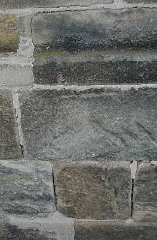 
Alte und neue Reparaturschäden bunt gemischt. 

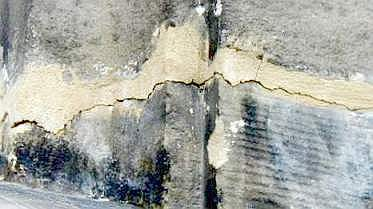 
Auch das soll Handwerkskunst sein - mit Zementmörtel - auch wenn als Restauriermörtel des berühmten Sanierbaustofflieferanten getarnt - leider ganz unmöglich. Selbst in Norddeutschland.

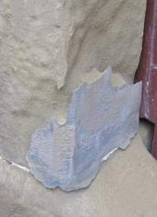+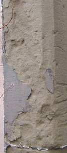 
Genau wie in Süddeutschland. Das ist die zementäre Handwerkskunst renommierter Steinrestauratoren am denkmalgeschützten Torgewände, wenn etwas Zeit drüber gegangen ist. Reparaturmörtel gar kunstfertig scharriert!

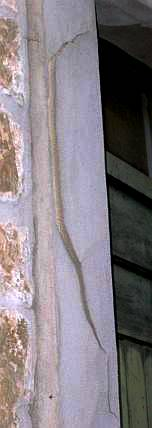+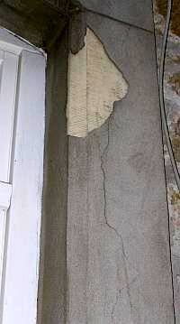 
Baustoffeinsatz nach dem Verstand des Steinrestaurors. Zementäre Schwarte über scharriertem Original. Zustand nach drei Jahren (VOB-Gewährleistung abgelaufen!)

Zementmörtel sind halt wirklich das letzte, auch wenn sie von chemiebessenen Diplomchemikern, Doktoren und Mineralogen äußerst gerne mit Acrylaten kunstharzvergütet werden und dann als "Dispersionsmörtel" dem unschuldigen Bauwerk bzw. seinen Fugen und Fehlstellen als kapllardichte Trocknungsblocker aufgezwungen werden. Sie halten alles einkondensierte und auch durch Hinterläufigkeiten und Kapillarrisse eingedrunges Wasser zurück, trocknen als reine Zementmörtel - neuerdings meist mit wasserrückhaltender Methylzellulose / Tylose zur schärferen Abbindung - "veredelt" um den Faktor 10 und mehr - im Falle von kapillardichten Zement-Dispersionsmörtel und dispersionsgebundenen Anstrichsystemen auf acrylatdispersionsgebundenen Steinergänzungen nahezu unendlich schlechter als Kalkmörtel, bewegen sich bei Temperaturbeanspruchung erheblich mehr als die Umgebung und müssen reißen, reißen, reißen, auffrieren und abschälen. Sie können eben deswegen über kurz oder "lang" all den Werbeaussagen der "Restaurierwissenschaft" zum Trotz versagen. Als verschwiegenen Nebeneffekt haben sie leider auch die Zerstörung der verbliebenen Originalsubstanz im weiträumigeren Umfeld auf dem Gewissen. Denkmalfreunde, schaut schärfer hin und vertraut nicht leichtgläubig und krawattengeblendet den Werbefotos zwei Tage nach der Fertigstellung! Geschweige denn dem platten Dummdröhn der "erfahrenen" Kunstharzzementverpamper namens "Natursteinrestauratoren".

Ich habe nun meine Restaurier-Verbrechen bitter gebüßt, Blut, Schweiß und viele Tränen ausgeschwitzt (weil sorgfältiges Planen ja nie Konjunktur hat bei all den Mindestsatzunterschreiterluschen am Markt) und daraus wenigstens für mich Schlüsse für den Umgang mit [bestandsverträglichem Baumaterial](2kalk.md) (nach dem ich mühsam immer weiter nach dem Motto "Trau, schau, wem?" suche) und Konstruktionsdetails ebenso wie für Bestandsaufnahme- und [Bemusterungsstrategien](11erhins.md#musterachse bremen) sowie [Ausschreibungsfinessen](9pbs.md) gezogen. Manche Mitwettbewerber kupfern das fleißig ab, in Weimar tut einer sogar so, als wäre meine [Bestandsaufnahme-Systematik](11rabus.md) dann sogar auf eigenem Ossimist gewachsen und trägt es als Würze seines Binsenweisheitsgelabers auf Seminaren vor. 

Mehr Liebe zum Detail, notfalls halt gestohlene Planungssystematik wären auch der staatlichen Hochbaukunst und Denkmalpflege im allgemeinen sehr zu wünschen. Hier treiben leider noch einige produzenteninduzierte Zement+Synthetikverschwörungen ihr Unwesen und lassen den intelligentesten Restaurierpfuschern, die sich heutzutage geradezu als Denkmalwissenschaftler verkaufen, nach wie vor freien Lauf. Beispiel die jüngst "restaurierte" Sandstein-Fassade der weltberühmten Balthasar-Neumann-Basilika Vierzehnheiligen:

 
Geweitete Fugen, zementär überschmierte Kalkoriginalfugen, Zementmörtelplomben alle abgerissen, teils rausgefallen und kapillar wasserziehend. Wobei nicht auszuschließen ist, daß wie bei Hochbauämtern nicht gerade ungewöhnlich, krassteste VOB-Verstöße mit Produktnennung der grundsätzlich "homogenen" (also gegen jeden gleichartigen Müll anderer Hersteller ohne weiteres austauschbare) Baustoffe des Mörtelproduzenten Voraussetzung solcher Handwerksschweinereien "oder gleichwertig" waren. Der industrielle "Umsonst"-Zuarbeiter muß halt auch seine Brötchen verdienen. Wieso prüft das eigentlich kein Rechnungshof, wo doch in den staatlichen "Anweisungen zur Korruptionsverhütung" auch in Bayern diese Kinder beim Namen genannt werden? Was da der notleidende Staatshaushalt an Rückführungen mißbräuchlich verausgabter Mittel gewinnen könnte, und den Bauwerken und zukünftigen Investitionen täts doch auch ganz gut, wa?

 
Die mit dem Eisen aus dem dünnfugigen Originalbestand herausgebrochene Fuge im Detail. Nur, damit der Zementmörteldreck "sich besser verankern kann". Vermutlich sogar im LV so vorgesehen, oder Angabe staatliche Bauleitung? Man beachte den innenliegenden originalen Kalkmörtel.

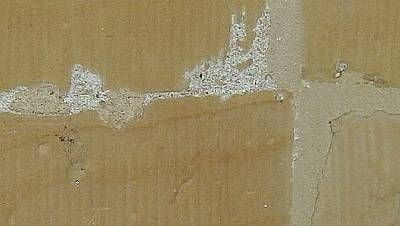 
Dabei hat das Bauwerk so schön bewiesen, was wirklich rißfrei bleibt - der originale Kalkmörtel. Natürlich nicht vom Trockenmörtelfabrikant wie der abgerissene Murks daneben.

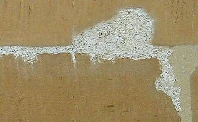 
So flankenabrißfrei sitzt eben nur Kalkmörtel. Seit über 200 Jahren.

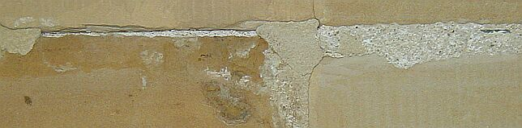 
Und der Zementmist springt vom Bauwerk, jedoch nicht ohne vorher salz- und feuchteinduzierte Umfeldschäden verursacht zu haben.

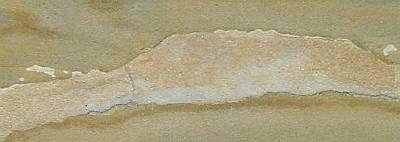 
Der abrißfreundlichen Zementkrempel, blüht obendrein (untere Hälfte) noch aus. Und zwar Schadsalze. Man beachte den feuchtstehenden unteren Fugenrand.

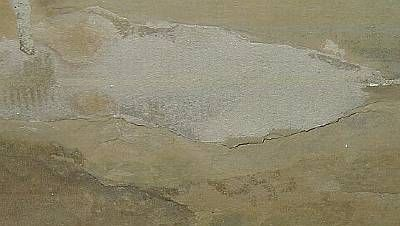 
Man ahnt die Kalkfuge unter der geschmierten, unten schon abgerissenen und kapillarwasserziehenden Zementplombe.

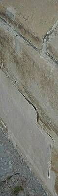Um das Sockelmauerwerk maximal zu bewässern: Hinterläufige Zementmörtelflächen!

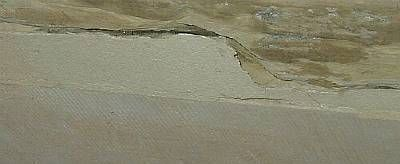Im Detail.

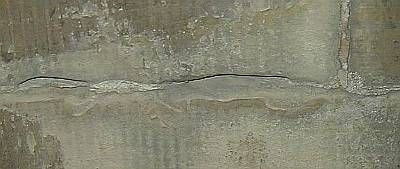Oder so, ganz in der Nähe.

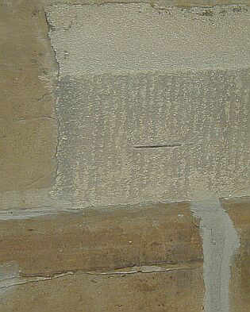Auch nicht schlecht: eine an der Steinflanke abgerissene, aber fein säuberlich edelstahlarmierte Zementmörtelplombe. Sehr schön die überschmierte Fuge weiter unten.

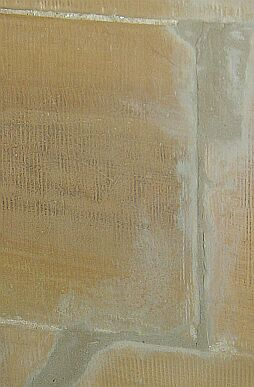Das Überschmieraxel läßt sich offenbar noch steigern.

 
Alle Zementmörtelpflatschen und -fugen schon lose und hinterläufig. Nur nicht der originale Kalkmörtel.

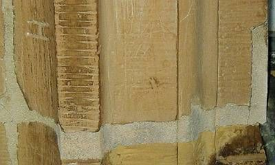Im Detail.

Fazit: Ein wunderbares Anschauungsbeispiel, an dem die hundertausenden Besucher jährlich lernen können, was deutsche Baukunst heutzutage zu leisten im Stande ist. Wirklich schade, daß echte Natursteinfreaks Bamberg heutzutage zu meiden scheinen.

Und ein paar Bauwerke weiter, die architektenfreie Handwerkerlösung:

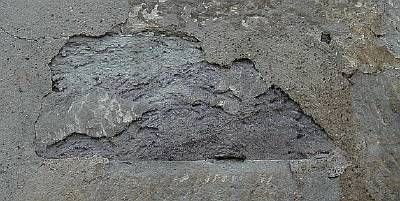Hier hat die "Restaurier"-Mörtelindustrie nicht mitgemischt, das kam vom Baumarkt. Zementmörtel auf Naturstein - eine immer zerstörerische Komposition. 

Die auch vor einem Backstein nicht zurückschreckt, bis er reiner Blätterteig ist.

Vorschlag: Wer dem Natursteinbauwerk zementäre "Restauriermörtel" aufzwingt, sollte keinesfalls den Ehrentitel "Restaurator" tragen dürfen, sondern als "Zerstörator" gebrandmarkt werden. Und was meinen Sie, wieviele klugschwätzende "Restauratoren" dann zu "Zerstöratoren" umbenannt werden müßten? Null oder 100 Prozent? Richtig!!!

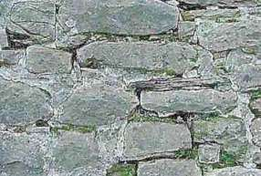Die zementär verfugte Schloßmauer eines der berühmtesten Ruinenschlösser Deutschlands (in staatlicher Obhut und Baupflege). Alle Fugen klappern, soweit nicht schon den Hang heruntergesprungen.

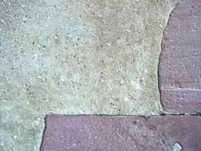Am gleichen Schloß - Mehrhundertjähriger Kalkputz mit idealer Kornabstufung. Trotz Westfront immer noch dicht. In der Preßfuge Schieferplättchen als Versetzhilfe und Knirschlager.

Auch n einem mittelwestdeutschen Bundesland kann das staatliche Bauamt vulgo Gebäudemänätsch(ze)ment auch mit allerbestens steinzerfetzenden Gruselfugen an historisch allerwertvollster Baudenkmalsubstanz aufwarten - und da heißt es immer, gute Leute gehen in die Wirtschaft (tut mir leid, ohne Sarkasmus krieg ich das net hin, wo doch so viel Geld und Substanz allerorten durch "Verantwortung" versaut wird - ist das nicht auch mein bisserl Steuer und meiner Kinder Zukunft, die da verhackstückt wird?)!:

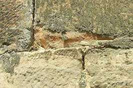.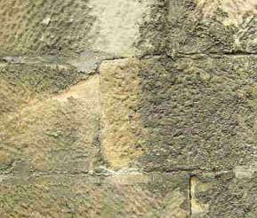.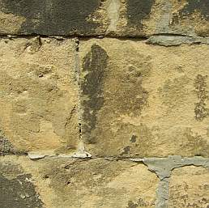. 
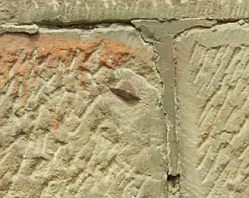.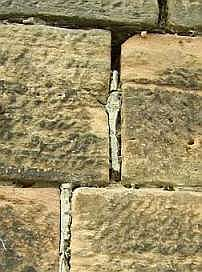 
Und was sehen wir da? Steinzerstörung und Oberflächenverschmutzung durch Zement- und Traßbestandteile, durchfeuchtungsfördernde Kapillarrißnetze an Zementmörtelflanken, logische Folge: auf- und weggefrostete Klappertraßzementfugen.

Themenlink: [Krachende Schwarten? Ein kritischer Blick auf Mörtel, Putz und Anstriche am Baudenkmal](http://www.dimagb.de/info/baualt/ahfas01.html) 
[Beschädigt durch Restaurierung](http://www.ba.no/nyheter/article1762277.ece) - ein Bericht über grauenhafte Restaurierungsschäden durch Zementmörtel an norwegischen Baudenkmalen

Weiter: [[Die Kunst der Fuge]](29bau06.md)
