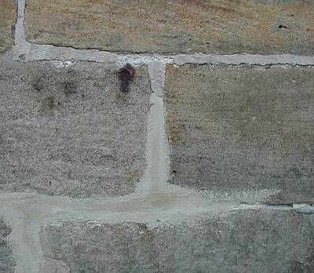
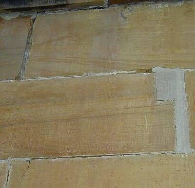
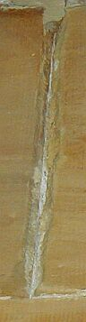
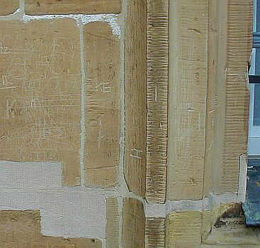

[🠔 Zur Übersicht: Natur- & Ziegelstein](29bausto.md)  
# Die Kunst der Fuge
**Bestandsgerechte Baustoffe und -verfahren - Die Kunst der Fuge. Zerstörerischer Fugenausbau und falsche Fugmörtel als typischer Restaurierpfusch oder ...**  
_von Konrad Fischer • aktualisiert 28.09.2009_

 Altbautaugliche Verfahren und Baustoffe Kapitel 9+10 

### Natursteinrestaurierung, Wandbildner und Fachwerkinstandsetzung [6]

Seite in Unterkapitel aufgeteilt - Naturstein:[[1]](29bausto.md) [[2]](29bau02.md) [[3]](29bau03.md) [[4]](29bau04.md) [[5]](29bau05.md) **[6]** Steinboden: [[7]](29bau07.md) Reinigungstechnik: [[8]](29bau08.md) Wand: [[9]](29bau09.md) [[10]](29bau10.md) [[11]](29bau11.md) [[12]](29bau12.md) [[13]](29bau13.md) [[14]](29bau14.md) [[15]](29bau15.md) Fachwerk/Holzbau: [[16]](29bau16.md) [[17]](29bau17.md) [[18]](29bau18.md) [19.1](29bau19.md) Bodenaufbau/Holzboden: [[20]](29bau20.md) 

**(aktualisiert 28.09.09)** 

Auch bei der Endbehandlung der Fugmörteloberfläche aus Luftkalkmörtel durch Nachverdichtung bzw. feuchter Verschlämmung ist Vorsicht geboten: Erfolgt sie zu früh, sind Bindemittelanreicherungen mit nachfolgend frostgefährdeter, da zu stark abdichtender und zu fester Krustenbildung bzw. Sinterhaut die Folge. Auf der Fugenoberfläche erscheint dann ein recht heller oder glasiger Kalkbelag - deutlich unterschieden von der normalen Mörtelfarbigkeit. Der Sinn der Fugenvermörtelung mit elastischem, porösem Kalkmörtel - Ausgleich von Spannungen und Bauwerksbewegungen sowie vorrangige Fassadenaustrocknung über das gut wasserabgebende Fugennetz - wird dann in Frage gestellt, wenn nicht ganz zunichte gemacht.

Erst nach ausreichender Frühfestigkeit (nach ca. 3-5 Stunden) dürfen bzw. müssen die Fugen mit einem geeigneten Werkzeug (z.B. mit hartborstigem Pinsel die durch einen Papp- oder Textilstreifen abgedeckten Fugen nachverdichten, fallweise leistet auch eine schmale Holzspachtel gute Dienste) endbehandelt werden. Also: Früh verfugen, gegen Abend Nachbehandeln. Dabei werden die möglicherweise entstandenen kapillaraktiven Schwundrisse wieder zuverlässig verschlossen, die trocknungsblockierende Sinterhaut (Grund der Frostprobleme bewitterter Kalkfugen) aufgebrochen. Bei hydraulischen Fugmörteln ist diese Methode allerdings wenig effektiv. Ihr schnelles Abbinden verhindert die an sich technisch sinnvolle Nachverdichtung, ohnehin ist ihre Trocknungsblockade zu hoch. Das gestaute Wasser muß dann nach innen oder durch den Stein abtrocknen. Feuchte- und Frostschäden sind die Folge. 

Im Umgebungsbereich der wasserblockierenden und schadsalzbelasteten harten Zementmörtelfugen wittern die regelmäßig weicheren und poröseren Mauersteine schneller ab - zurückliegende Steinköpfe und hervortretende Zementmörtelfugen, in denen das Regenwasser direkt aufgefangen und langfristig gespeichert wird, entstehen. Obendrein wird das freie und bestens wasserlösliche CaOH2 - bis zur endgültigen Carbonatisierung noch jahrzehntelang im hinteren Fugenbereich vorhanden (auch wegen Carbonatisierungsblockade durch typischerweise dauerfeuchte Zementfugen) - ausgewaschen und lokal in Ausblühbelag aus Kalksinter oder in Verbindung mit Schwefelsäure in schwärzliche Gipskrusten "verwandelt". Der für überharte Zementmörtel übliche Fugenabriß an der oberen Steinflanke und die entsprechenden Haarrisse quer zum Fugenverlauf wirken natürlich als kapillare Pumpe zur größtmöglichen Befeuchtung des hinteren Fugenbereichs.

Das in die dichten Zementmörtelfugen eingedrungene Kondens- und Regenwasser reichert sich dort mit den zementösen Schadsalzen an und bildet mit den immer vorhandenen Sulfaten Treibmineralien, die die Fugenoberfläche ablösen. Der hintere Fugenbereich verwandelt sich alsdann in Fugenmehl. Damit der Zementmörtel auch den Mauerstein maximal schädigt, wandert die zementöse Salzlösung vorzugsweise in die poröseren Mauersteine. Durch den trocknungsblockierenden Mörtelpfropf dringt nämlich weinig Wasser nach außen. Ohnehin trocknet Zementmörtel ja um den Faktor 10 schlechter aus als Kalkmörtel. Dort schädigt es die Steinstruktur und deponiert bei der Austrocknung seine Salzfracht. Vermehrte hygroskopische Wasseraufnahme der Steine und deren frost- und kristallisationsdruckbedingte Korrosion sind die logische Folge.

Interessanterweise belegen die neuesten materialprüfungsgestützen Untersuchungen an Fugmörteln im Labor und in der Praxis draußen am bewitterten Bauwerk, daß hydraulische Mörtel (mit Zement, Traß und Hydraulkalk als Bindemittel) geradezu grauenhafte Korrosionsschäden erleiden, wenn sie bestimmten - durchaus üblichen - Feuchte- und Trocknungsbedingungen ausgesetzt sind: Sie erhärten zunächst wie gewünscht, nach einiger Zeit jedoch entfestigen sie sich, da die Feuchte und Kristallisationseffekte (z.B.Karbonatisierung der Ca(OH)2-Gruppen und Kristallisationsumlagerung) die nur scheinbar feste Mörtelmatrix nachhaltig zerstören. 

Bei allen Vergleichen war übrigens nur der reine Luftkalkmörtel von derartigem Versagen nicht betroffen. Er wird zwar nicht so schnell dermaßen hart wie die hydraulischen Brüder, dafür bekommt er eben nach einiger Zeit seine Endfestigkeit und verliert sie nicht mehr. Wichtig ist allerdings, daßer in der Früherhärtungsphase nicht aufbrennt oder durch Überwässerung ausspült. Viele Handwerker haben von diesen simplen Fakten leider aber keine Ahnung. 

Brauchen sie auch nicht, da eh die Mörtelindustrie und Bauchemie ihren Plunder durch ihre vom Denkmalamt immer wärmstens empfohlene Vorzugs-Planer an den Bau bringt und nachdenkliche Handwerker das schöne Geschäft eher stören würden. Also: Weiter so, immer feste druff! Bausubstanz und Kosten schietegal. Hauptsache, der Rubel rubbelt und die Kohle verkohlt.

Die schädigende Treibmineralbildung von Zementmörteln im typischerweise sulfatbelasteten Umfeld jeder alten Steinfassade (!, will aber auch keiner wissen) soll übrigens nur bei Zementmörteln der "neuesten" Generation (BMFT-Forschungsprojekt) ausgeschlossen sein. Kleinste Zellstoffbestandteile aus Papierfaserhäcksel sorgen dort für die Keimung von amorphem Ettringit, das die langnadeligen Kristallformen verhindert.

Zementhaltige defekte Fugenmörtel bieten dann auch bei der erneuten Restaurierung besondere Probleme:

_"Hervorstehende zementöse Verfugung kann durch sorgfältiges Abnehmen entfernt werden, aber wenn sich das Fugmaterial der Abnahme widersetzt, wird es notwendig sein, die bei der Belassung drohende Schädigung gegen die Zerstörung durch Abarbeiten abzuwägen._

Manchmal mag das Belassen solcher Verfugungen und Hinnahme der gegebenen, möglicherweise unangemessenen Erscheinung die beste Lösung sein."

(aus: Preparation and use of lime mortars, Historic Scotland, Technical advice note 1, Edinburgh 1995 - Übersetzung Konrad Fischer)

Sehen wir uns dann aber die bisher übliche Praxis des Ausbaus der Fugen aus Sichtmauerwerk genauer an (macht gottseidank niemand, kein Denkmalpfleger, kein Bauherr, kein Finanzier, kein Pfarrer und auch kein Pfarrgemeinderat, die Sauerei ist nämlich offenbar gottgegeben) überkommt uns Atheisten das kalte Grausen: 

Brutalste Meißelhackerei, die den Druck des flachen Meißelschlages in die oft vorgeschädigten Flanken des Mauersteins eintreibt und dort für tiefe Ausbrüche sorgt, dazu kommt das maschinelle Ausfräsen der Fugmörtel mit Winkelschleifern, eine sichere Methode, nicht nur um in den Ecken kein vernünftiges Ausräumergebnis hinzukriegen, sondern auch um angrenzende Mauersteine mit frechen Frässchlitzen zu verschneiden und die Fassade und angrenzende Innenräume bzw. Umgebungsbereiche durch den dabei entstehenden Schleifstaub feinkörnigst zu verschmutzen, offenbar eine moderne Dekotechnik am Steinfassdenbau, oder auch ganz modern: fassadenversauende und aufnässende Hochdruck-Wasserstrahl-Fräsen, die mangels exakter Strahlführung ebenfalls zur kaputtierenden Verwüstung des Steinumfelds führen (Historisches Rathaus Lübeck!), sind der Standard. 

So sieht das beispielsweise an berühmten fränkischen Kirchenfassaden aus, wir erinnern uns an viele Vergleichsbeispiele allerorten: 
     
Und das geschieht alles unter den Augen mir bestens bekannter berühmtester Staats- und Kirchen- und Denkmalbauherren und durch die Lieblingspfuscher (frech Restauratoren genannt) aus wohlberühmten Restaurierklitschen allerbesten Namens und weltweitesten Auftretens. Mehr souch i niä, weils eh alla su machn. Höchstens nuch teurä oder a bisserla billichä. 

Das aufwendige Fugenpfuschwerk gerät dabei mehr und mehr hintenrum (Subunternehmer) oder gleich vornherum (Tarnfirmen) in die Hand asiatischer Bausklaven, die das staubig-teure Gesochse am billigsten anbieten und deren Silikose, logische Folge der brutalstmöglichen Fugmörtelzertrümmererei ohne den so arg teuren Arbeitsschutzaufwand dann in den berühmten anatolischen Luftkurorten am Fuße des Ararat auskuriert werden darf. Oder nicht mal das, da sie die Heimat eh niemalswiedersehen.

Die Ergebnisse des ganzen Zerstörungsaufwandes mittels Aushauen und Auskratzen bzw. mit dem Winkelschleifer wild herausschneiden inkl. die Standfestigkeit des Gefüges verletzende Glättung der Fugenflanken dürfen wir dann auch an unseren wertvollsten Baudenkmalfassaden bewundern, egal ob barocke Kirche oder gotisches Backsteinrathaus. Daß es hier inzwischen viel besseres Werkzeug als übliche Fugenfräsen und das meißelmäßige Draufhauen gibt, ist der Steinklopferbranche bisher jedenfalls fast unbekannt geblieben. Millimetergenaues (ab ca. 3 mm), unschlagbar schnelles, ausreichend tiefes (2,5 - 3 cm, max. ca. 15 cm) und für den Stein zerstörungsloses Ausräumen der Fugen? Egal, ob waagrecht oder senkrecht, horizontal oder vertikal, alles mit einer motorisierten Einstechklingen-Handsäge inkl. Absaugtrichter und Staubsaugeranschluß? Damit könnte man ja das erste Mal die für fachgerechtes Verfugen erforderliche Fugentiefe ausfugen ohne den fürchterlichen Dreck zu hinterlassen und die halbe Fassade kaputtzuhauen! So viel Know-how muß aber bestimmt nicht sein. Eine weitere Entwicklung in diesem Bereich wären die Spezial-Fugenmeißel mit geriffelter Sägezahn-Schneide, die insbesondere das rechtwinkelige Ausarbeiten der Fugenanfänge und Fugenenden sowie - dank der raffinierten Riffel-Kante / gerillten Schneidenfläche - das Ausräumen der Fugen ohne den üblichen zerstörerischen Kantendruck zulassen. 

Wer sollte das aber bezahlen? Ist doch echt total egal! Wer will schon den Sklaven ihre schöne Arbeit wegnehmen und für das arme Denkmal ist es bestimmt sogar wesentlich besser, wenn nur die paar Millimeter Fugentiefe und die grauenhaften Steinverluste im Umfeld drumherum als beeindruckendes Ergebnis des krampfhaften Bemühens dann mit Vierungen und schlechtester Hydraulchemiepampen-Mörtel zugeblockt werden. Wofür hat denn die schlaue Sanierindustrie all die synthetischen Aufbrennhemmer in den Fugmörtelsand geschmissen? Weil es eben ohne nicht geht. 

Lassen wir's. Es ist doch sowieso unbeschreibbar, was da an denkmalverachtender Sanierkunst auf deutschen Denkmal-Baustellen auch von den berühmtesten Sanierdoktoren geboten wird. Und von den klugen Bauherren, Denkmalkoryphäen und -harpyien sowie Planern kümmert sich eh kaum jemand um derartige Lappalien. Hauptsache, es wird nicht historisiert, sondern krasse Bauhauskünstelei am Neuteil abgeliefert, auch wenn sie jedem 0/8/15-Auge schmerzend ins Auge sticht. Genau dann ist es ja gekonnt!

Und baupraktisch wichtig ist eben, daß die Ausschreibung für das der Fassadenzertrümmerung folgende Zementchemiemörtelprodukt schnell genug aus dem Hause müllermeierschulze.de rüberwächst, schwer bepackter Weihnachtsbesuch inklusive. Dort hat man nicht die Substanzschonung im Auge, sondern die Umsatzmaximierung für Zementtrockenmörtel und synthetische Pampen und Brühen - freilich alles rein mineralisch-silikatisch-silikonisch. Um das Wohl des Bauwerks, das nur mit technisch ausgereifter Leistungsbeschreibung etwas in den vertragsrechtlich und praktisch beherrschbaren Bereich gerät, schert man sich dort jedenfalls nicht viel. Das Standard-LV kommt von der Matrize der 1960er oder früher, nur die wunderlichen Produktnamen müssen alle paar Jahre wieder mal ausgetauscht werden, wenn der Name für den ewig gleichfalschen Mist durch ausreichende Schäden verbrannt ist. Relaunch heißt diese Markentechnik im Marketingjargon. Inzwischen unterstützt aus angeblichen Restaurierungsfachplanungsunternehmen, justament geboren aus den Pampenherstellerfirmen. Da werden jetzt sogar noch die korrupten Zwischenhändler/Planer eingespart. Vom 100%igen zum 1000%igen Vertriebsmodell, pfui Deibi!

Doch auch der vom Denkmalamt "bevorzugte" Steinrestaurator, der hinten- oder vornherum ein "qualifiziertes" LV ausarbeitet, will von solch mickrigen Bestandsschonungs-Details nicht viel wissen und wird vielleicht auch erst dank geflissentlicher Zuarbeit von müllermeierschulze.de (bzw. dessen umsatzsteigenrnden Fachplanungsunternehmens!) in die Lage versetzt, den Anschein eines fachlich befriedigenden Ausschreibungstextes für spätere Zusicherung des Auftrags zu trickreich überhöhten Preisen (Hintenrum-Modell) oder eben teuer Geld vornherum vorzulegen. Die VOB und ihre Feinheiten sind jedenfalls nicht unbedingt seine klassischen Interessensfelder. Deswegen sind die Ausschreibungstexte auch nie produktneutral. Verboten? Dem Bauherren egal, die anderen Beteiligten bestehen darauf.

So wird das Fugenausräumen durch konfektionierte Werktrockenblockiermörtel bestens geheilt /saniert /kaschiert/fortgesetzt/gesteigert. Hinterher noch eine flächig fassadenzerstörende Hydrophobierpampe, dann funzt es für alle Beteiligten am besten. So ist das ja branchenüblich, wen sollte das also stören? Und alle Bauherren wollen es ja offenbar so haben. Das spart HOAI! Und ist die Verdreifachung der Gesamtkosten und maximierte aktuelle und künftige Substanzzerstörung bestimmt wert.

Die ständig erhöhte Mauerfeuchte bei der Verwendung zementhaltiger Fassadenprodukte gefährdet natürlich auch in die Fassade eingebundene Holzbauteile wie Deckenbalkenköpfe, Schwellen und die historisch gebräuchlichen Holzankersysteme. Auch sonstige innenseitige Wandausstattungen wie Malereien, Bespannungen und Holzverkleidungen lieben bekanntlich überhöhte Wandfeuchte. Und natürlich auch die allerlei Eisenteile, die als Versetzkeile, Ankereisen oder Stürze das herrliche Sichtmauerwerk erst technisch ermöglichten und seitdem lustig vor sich hin rosten. Schön, daß die Trockenmörtelindustrie und das geniale Handwerk so viel tun, um sogar die widerstandsfähigsten Altbauten einer möglichst schnellen Verwitterung zuzuführen. Das spart Flugzeugangriffe und schont Menschenleben.

## Zum Abschluß

Die nationalromantisch und teils bauarchäologisch/denkmaldogmatisch verbrämte Natursichtigkeit vernachlässigt also den langfristigen Gebäudeschutz und karikiert das historisch und technisch sinnvolle Erscheinungsbild oft der wichtigsten Baudenkmale. Das krampfhafte Bemühen um den gleichwohl gewünschten Fassadenschutz begünstigt inzwischen eine ganze Industrie, die mit wasserabweisend-farblosen oder pigmentierten Chemiesuppen aus synthetischen Harzen (Silikone, Erdölderivate) das Wasser im Bauwerk eher einsperrt als von ihm abhält. Daß auch die seit etwa 100 Jahren übliche Anstreicherei mit Wasserglas bzw. Silikatfarben das Abtrocknungsverhalten und die Oberflächenfestigkeit des Natursteins sehr zum Negativen hin beeinflußt, ist zumindest unter Fachleuten inzwischen unbestritten. Trotzdem schmiert man solche schädigenden Pampen nach wie vor auf wertvolle Steine. Das sichert spätere Sanieraufträge. 

Weiter: [Steinboden [7]](29bau07.md)

[Link zum Silikatproblem](22bau4.md)

Denkmalzerstörung durch falsch verstandene und gegenüber den gewandten Produktverkäufern bzw. den auf diese setzende Architekten leichtgläubige Denkmalpflege?

Andreas Rentmeister 

**Instandsetzung von Natursteinmauerwerk** 

Band 9 der Reihe Altbaumodernisierung 
Deutsche Verlags-Anstalt 
Stuttgart/ München 
2003 

[Ein Verriß von Restaurator Jens Linke](http://www.pons-asini.de/Restaurierung/instnaturstein.html)
