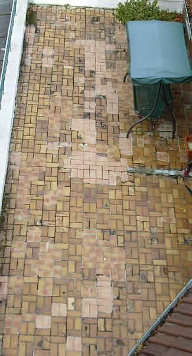

[🠔 Zur Übersicht: Natur- & Ziegelstein](29bausto.md)  
# Thema Boden/Verkleidung keramisch/mineralisch: Estriche und Bodenbeläge
**Altbautaugliche Verfahren und Baustoffe für Boden und Wand: Analysiert schadensträchtige Estriche, Bodenbeläge und die Risiken moderner Verlegemethoden gegenüber traditionellen.**  
_von Konrad Fischer • aktualisiert 06.04.2009_

 Altbautaugliche Verfahren und Baustoffe Kapitel 9+10 

### Natursteinrestaurierung, Wandbildner und Fachwerkinstandsetzung [7]

Seite in Unterkapitel aufgeteilt - Naturstein:[[1]](29bausto.md) [[2]](29bau02.md) [[3]](29bau03.md) [[4]](29bau04.md) [[5]](29bau05.md) [[6]](29bau06.md) Steinboden: **[7]** Reinigungstechnik: [[8]](29bau08.md) Wand: [[9]](29bau09.md) [[10]](29bau10.md) [[11]](29bau11.md) [[12]](29bau12.md) [[13]](29bau13.md) [[14]](29bau14.md) [[15]](29bau15.md) Fachwerk/Holzbau: [[16]](29bau16.md) [[17]](29bau17.md) [[18]](29bau18.md) [19.1](29bau19.md) Bodenaufbau/Holzboden: [[20]](29bau20.md) 

**(aktualisiert 6.04.09)** 

## 9.a) Thema Boden/Verkleidung keramisch/mineralisch

**_Estriche und Bodenbeläge sind die schadensträchtigsten Bereiche im Bauwesen. 
_**Aus dem BDB Bezirksgruppe Bamberg-Rundbrief 2/2005 

Nicht nur für den energetisch immer überlegenen speicherfähigen Massivbau, sondern auch für die **Boden- und Flächengestaltung** sind Natursteine neben Vollziegeln/Backsteinen/Keramikplatten auch heute noch eine sehr dauerhafte und damit wirtschaftliche Baustoffe. Selbstverständlich sind sie an vielen Einsatzbereichen den Kunststoffsurrogaten nicht nur technisch, sondern auch gestalterisch und im Hinblick auf schädliche Ausdünstungen in das Raumklima überlegen. Das gilt natürlich nur, wenn sie nicht durch die in allzureicher Zahl angebotenen kunstharzhaltige Tunken "versiegelt" oder gar "patiniert" wurden. 

Leider haben nur noch wenige Handwerksbetriebe Erfahrung mit der traditionellen Verarbeitung bzw. Verlegung in Kalkmörtel. Zement-, Traß- und kunstharzhaltige Klebe- und Verlegemörtel sorgen deshalb für ein bereicherndes Betätigungsfeld der Sachverständigen. Abriß-, Verfärbungs- und Ausblühungsschäden sind ihre Stärke. Steigern kann man diese Effekte durch saure Reinigungsmittel zur Zementschleierentfernung (sind Rostenferner, entfärben Eisenoxide im Stein (braun-gelb-rot), Tip: Verbot mineralischer Säuren für Reinigung) und die übliche Oberflächenversiegelung, die ebenfalls herrlichste Verfärbungsschäden erzwingt. Grund: die feuchteblockierende Wirkung gegen Austrocknung der Unterboden- u. Mörtelfeuchte sowie des durch immer vorhandene Kapillarfugen eindringenden Wischwassers. Obendrein neigen Zementestriche in ihrer Frühphase zum konkaven Schüsseln und darauf folgend zum langfristigen konvexen Aufwölben - bei ungenügender Belagreife und zu harten und zu dichten Belagschichten der vorprogrammierte Bauschaden mit für den Laien hohem Überraschungswert. 

Die moderne Schichtbauweise mit wassersaugenden und energieverschwendenden [Dämmschichten](213baust.md), für die thermisch-hygrische Belastung oft nicht langzeittauglichen Ankersystemen und unterdimensionierten Steinstärken sorgen für den Schadensnachschub im Fassadenbereich. 

Gerade hochwertig gestaltete Steinböden, aber auch "Normalböden" mit großen oder kleinen Formaten genießen die Vorteile der Verlegung in elastischem, spannungsarmem Luftkalkmörtel-Dickbett besonders: 

1. Keine Dehnungsfuge notwendig, egal bei welcher Fläche; 
2. Steinrisse durch Übertragung aus dem Untergrund oder Fugenzwängung (bei sachkundiger Verlegung, nicht knirsch und auf ausreichend verlegereifem, nicht mehr wölbungsgefärdetem Estrich) stark vermindert. 
3. Steinausbau, aus welchem Grund auch immer, ist ohne wesentliche Steinbeschädigung wieder möglich, da Untergrundverbund mechanisch gut lösbar.

Jedoch: Das Normengeheul der Beteiligten aus Handwerk und Steinindustrie ist schwer erträglich, wenn man wieder normal, also gegen Zement- und Traßverlegung, bauen will. 

Und die fachgerechte Verlegung in Kalkmörtel, die Vermeidung von Aufbrennschäden des Mörtelverbunds, die kleinen Handwerkskniffe zur Verfugung ohne Totalsauerei, die dann Absäuerung der Kalkmilch aus saugfägigen Oberflächen der Keramik- und Natursteinplatten erzwingt, die korrekten Wartezeiten zwischen den Arbeitsgängen, die schonend verschmutzungsschützende Oberflächennachbehandlung und Wischpflege mit natürlichen, bewährten und materialverträglichen Stoffen und Methoden, die es teils im Supermarkt-Sonderangebot gibt - all das und noch mehr sind inzwischen recht große Geheimnisse geworden, deren Kenntnis im Fliesenlegerhandwerk jedenfalls nicht mehr überall vorauszusetzen sind.

Es bedarf also besonderer Planungs- und Handwerkskenntnisse sowie Vergabekriterien, um die hochrangige Bauaufgabe auch mit qualifiziertem Handwerk zu verbinden und die unterqualifizierte Anbietermasse auszusondern. Referenzen, Musterachsen und spezielle [Ausschreibungssystematik ](9pbs.md)können dazu geeignet sein. Dafür bleiben dann die Weihnachtspräsente der am Planerpfusch interessierten Kreise aus ...

Ein aktueller Fall aus der Praxis beleuchtet die gegebene Problemstellung rund um das Bodenlegerhandwerk:

In einem Klostergang über einem kühlen Gewölbekeller wird ein neuer Bodenbelag aufgebracht. Aufbau gem. Planung: Betonboden (über 20 Jahre alt), z. T. zementärer Schnellestrich d: 3-6 cm als Ausgleich (Belagreif nach 48 Stunden), Trennlage, Zementestrich ZE 6 cm, Mörtelbett ca. 3 cm - Teilfläche in Luftkalkmörtel, Teilfläche in hydraulischem Romankalkmörtel, Belag: Solnhofer Platten 1,6 cm, Verfugung. 

Nach ca. 3 Monaten Austrocknung während der kühlen Bauphase über den Winter mit parallel laufenden Neuputz- und Anstricharbeiten an Wand und Decke erfolgt im Winter die Dickbettverlegung des Plattenbelags auf den augenscheinlich ebenen Zementestrichs. Die CM-Feuchtemessung ergibt angeblich akzeptable Werte der Estrichfeuchte, der Bodenleger legt los. Der Bodenleger baut in der Gesamtfläche zwei Fugen ein. Es dauert nur wenige Wochen - der Bodenbelag im hydraulischen Dickbett (nach Öffnung gemessene Druckfestigkeit: sagenhafte 15 N/mm2, also B 15-Güte) wölbt sich kuppelförmig bis zu ca. 1 cm auf. Abriß an Bewegungsfuge. 8 Wochen später wölbt sich auch der Belag im Luftkalkmörtel. Woher kommen die Aufwölbungen?

1. Durch Trennlage wird ein bewegungsstabiler Estrichverbund ver- und Abtrocknung in den Untergrund behindert. Das erleichtert zunächst die mit freiem Auge kaum wahrnehmbare Estrichschüsselung der Frühphase (Oberfläche trocknet und schwindet, verkürzt sich gegen Unterseite, Ränder schüsseln nach oben), die durch Dickbett ausgeglichen wird. 
2. Der Dickbettmörtel feuchtet den oberseitig teiltrockenen Estrich wieder etwas auf. Die Gesamttrocknung wird gebremst. Die Schüsselung bildet sich allmählich zurück. 
3. Der Steinboden wirkt gegenüber der Restfeuchte im Mörtel und Estrich als Trocknungsbremse, obwohl er die Trocknung selbst gut ermöglicht (im Unterschied zu glasierten Fliesen). Das Feuchteprofil weist nach unten abnehmende Feuchtefracht auf. So ergibt der kapillar wirksame Feuchtetransport zur Luft hin eine unterseitige Schwindverkürzung im ZE, wobei noch feuchtere obere Bereiche des ZEs nicht schwinden. Vom kühlen Kellergewölbe kann übrigens keine Feuchtediffusion erfolgen. Feuchte diffundiert nur von warm nach kalt - der Keller ist aber deutlich kühler als das Erdgeschoß. 
4. Der hydraulische Mörtel beschleunigt das Aufwölben, denn er wirkt im Sinne des Bimetalleffekts und unterstützt das Aufwölben des Zementestrichs. 
5. Der Gesamtbelag ab UK ZE steht über der Trennlage auf und wölbt sich kuppelförmig zur Bodenfeldmitte. Estriche auf Trennschicht sind ja besonders empfindlich für Verformungen - mangels bewegungsverhinderndem Verbund mit dem Verlegegrund. 
6. Wer ist schuld? Oft beißen den Letzten die Hunde. Hätte der Bodenleger den Verlegegrund besser auf Belagreife untersucht. Und tiefgründige Materialproben auf Feuchte geprüft. Nachgefragt bzw. bei ausreichender Tiefenprüfung den Estrich auf Trennlage als besonders hohes Aufwölbungsrisiko rechtzeitig erkannt. Und für eine längere Austrocknung durch längeres Offenstehen der unverschlossenen Fugen gesorgt, bzw. diesbezügliche Bedenken erhoben und sich dadurch haftungsfrei gestellt und dem Auftraggeber ermöglicht, zusätzliche Estrichtrocknung und gestrecktere Terminplanung zu veranlassen. Oder das Risiko voll zu übernehmen.

Sanierung? Verformte Partien rausreißen. Aus dem Luftkalkmörtel lassen sich die Platten ohne Beschädigung ablösen, im Hydraulmörtel leider nicht. Neuverlegung entweder 1. auf nach Einschnitt eingesacktem ZE, Schnittfugen verharzt oder komplett neu in 2. Gußasphaltestrich oder 3. Luftkalkmörtelestrich, der kein Wölben kennt. Erstere Lösungen gehen schneller.

Außerdem ein Tipp unter Freunden: Anstelle der Betonbodenplatte im Keller, die auch nach 10 Jahren ihre üble Feuchte noch nicht abgegeben hat, eine stabile Pflasterkonstruktion und weiterer Schichtenaufbau in feuchteverträglicher Trockenbauweise. Ohne jeglichen Dämmstoffunterbau selbstverständlich. Das ist nicht verboten!

Doch bei der Bodenbelegung von flachdachähnlichen Terrassen und Balkonen wird es mit irgendwelchen Plattenbelägen auf Mörtelbett immer Probleme geben, die dieses Bild wohl klar genug erahnen läßt: 

**Weitere Informationen: 
**[Andreas Rohatsch: Materialkundliche Betrachtungen in Schloß Hellbrunn und seinen Grotten](http://www.ig.tuwien.ac.at/institute/members/AndreasRohatsch/materialkunde-1.html) - Thema: Naturstein am Denkmal 
[Labor Köhler: Zerstörungsfreie Untersuchungsmethoden an Stein- und Architekturdenkmälern](http://www.labor-koehler.de/methdn.htm)

 

****[Die Adresse 
'Rund um den Naturstein' 
im deutschsprachigen Web](http://www.naturstein-netz.de)****

[Der Deutsche Natursteinverband](http://www.dnv.naturstein-netz.de) 
Fachberatung (vom Verfasser getestet: ***!) Juramarmor/Solnhofer: [www.biv-juramarmor.de](http://www.biv-juramarmor.de) 
[Fachzeitschrift STEIN/STEINtime Naturstein+Architektur](http://www.stein-netz.de) 
**Neu:** [Fachzeitschrift STONEPLUS Naturstein Architektur Technik](http://www.stoneplus.de) 
[Geodienst Dr.rer.nat. Olaf Otto Dillmann, Diplom-Geologe](http://www.geodienst.de/) - Mit tollen Links rund um den Naturstein! 
[LUA NRW Jahresbericht 1998 Aufsatz 9](http://www.lua.nrw.de/jab98/jb98a19.htm) zum Verwitterungsverhalten von Materialoberflächen 
[Diplomarbeit](http://diplom.de/db/diplomarbeiten2106.html) zum Thema Hydrophobierung von Natursteinen 
[Bodenleger.de](http://www.bodenleger.de/) - Fachwissen pur!, ebenso in: [FUSSBODENBAU ONLINE](http://www.fussbodenbau.de/)

Weiter: [Reinigungstechnik:[8]](29bau08.md)
