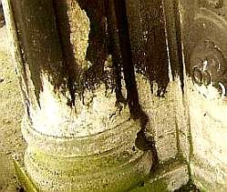
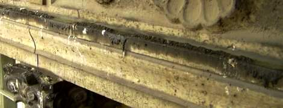
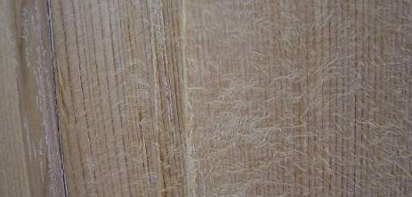
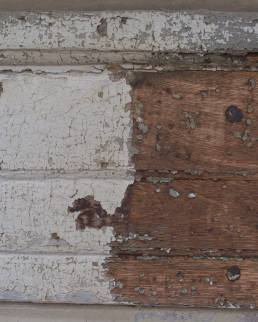
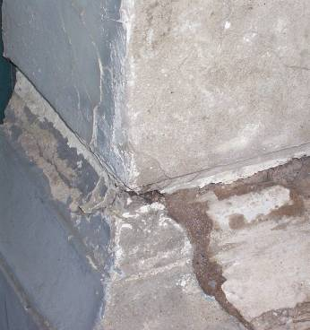

[🠔 Zur Übersicht: Natur- & Ziegelstein](29bausto.md)  
# Reinigungsverfahren für verschmutzte Altoberflächen an Fassaden, Bauteilen und Kunstwerken
**Analyse und Bewertung von Reinigungsverfahren für verschmutzte Altoberflächen an Fassaden, Bauteilen und Kunstwerken aus Naturstein, mit Fokus auf substanzschonende Methoden.**  
_von Konrad Fischer_

 Altbautaugliche Verfahren und Baustoffe Kapitel 9+10 

### Natursteinrestaurierung, Wandbildner undFachwerkinstandsetzung [8]

Seite in Unterkapitel aufgeteilt - Naturstein:[[1]](29bausto.md) [[2]](29bau02.md) [[3]](29bau03.md) [[4]](29bau04.md) [[5]](29bau05.md) [[6]](29bau06.md) Steinboden: [[7]](29bau07.md) Reinigungstechnik: **[8]** Wand: [[9]](29bau09.md) [[10]](29bau10.md) [[11]](29bau11.md) [[12]](29bau12.md) [[13]](29bau13.md) [[14]](29bau14.md) [[15]](29bau15.md) Fachwerk/Holzbau: [[16]](29bau16.md) [[17]](29bau17.md) [[18]](29bau18.md) [19.1](29bau19.md) Bodenaufbau/Holzboden: [[20]](29bau20.md) 

## 9.b) Reinigungsverfahren für verschmutzte Altoberflächen an Fassaden, Bauteilen und Kunstwerken

Vorab zum Thema Verschmutzung

Der übliche Dreck in der Luft lagert sich natürlicherweise auch an Fassaden an. Je nach Witterungseinfluß, elektrostatischer Anziehungskraft und Feuchterückhaltung der Fassadenoberfläche eben mehr oder weniger. Und gibt es lang anhaltende Befrachtung mit Dreck und Nässe, können gerade Natursteinfassaden dank Gipsverkrustung kohlrabenschwarz werden. Auch grüne oder sonstig bunte Veralgung und Beschimmelung gehören in das Spektrum des Bekannten.

Aus technischer Sicht muß bei einer Fassadeninstandsetzung geklärt werden, ob irgendwelche Schmutzreste nicht als Patina erhaltungswürdig sind und ihre Beseitigung mehr Kosten und Schäden am ehrwürdigen Bestand bzw. Original bewirkt, als ihre mühsame Beseitigung. Oft genug sitzen Gipskrusten nämlich schon ewig und nahezu schadensfrei auf dem Untergrund namens Bausubstanz. Und selbstverständlich kann es auch schädigende Ablagerungen auf der altehrwürdigen Fassade geben, die dann vielleicht sogar ohne Substanzverlust abgenommen werden können.

So kann das im Falle eines an- und abgewitterten Muschelkalksteins mit teils erheblichen Gefügeaufrissen aussehen. Da liegt freilich der Gedanke nahe, verschwärzte Gipskrusten gleich insgesamt wegzureinigen, man verspricht sich oft bauphysikalische Vorteile davon. In diesem Fall an einer Rathausfassade zeigte aber die naturwissenschaftliche Materialanalyse von unabhängiger Seite(!, von Bauchemie mal nicht gesponsort), daß die schwarzen Gipskrusten meist auf einer gerissenen Kalksteinoberfläche aufsitzen, deren obere Risse ebenfalls mit Gipsablagerungen fest verschlossen waren und die gleiche Wasseraufnahme zeigten, wie die meisten der weiß abgewitterten Partien, die ebenfalls feste Gipseinlagerungen in der gerissenen Oberzone zeigten. Fazit: Nur die blumenkohlartig aufgewachsenen Gipskrusten wurden mit geeignetem Holzwerkzeug nach Vorweichen abgenommen, die eben und fest aufsitzenden schwarzen Krusten, die im Unterschied zu den weißen Verwitterungsbereichen oft noch die originale Oberflächengestaltung wie Scharrierung ablesen ließen und somit "der letzte Träger plastischer Formverläufe" (nach Romstedt) sind, bleiben erhalten. Eine dramatische Weiterung des Schadensbildes durch schwefelige Abgase ist angesichts der heutzutage viel geringeren Luftverschmutzung ohnehin nicht zu erwarten, der verwitterungsbedingte Schwarz-Weiß-Wechsel in der Fassade bleibt also prinzipiell unangetastet. Das spart Substanzverlust, Intervention und Bares.

Die tatsächlichen Gefügestörungen mit Möglichkeiten des Wassereindringens in tiefere Steinschichten, Materialverluste, die Bereiche mit hinterläufigen Flanken hinterließen und weitere Rißzonen mit ungünstiger Wasserhaltung werden dann sowohl im schwarzen wie im weißen Bereich lokal und farblich an Umgebung eingestimmt geschlossen - im Sinne eines "konservatorischen Oberflächenverschlusses" (Möller), ohne grundsätzliche Reprofilierung der Gesamtfehlstelle, teils nur mit sparsamer Anböschung - und grundsätzlich mit technisch überlegenem Luftkalkmaterial - ganz und gar entgegen der üblichen Restauriererei durch substanzschädigende Reparaturmaterialien. Synthetikverschnittene und zementäre Restauriermaterialien bedingen ja nur Trocknungsblockade bzw. überhöhte Materialspannungen - alles nicht bedacht bzw. von interessierter Seite vielleicht gar unterschlagen bei der parametergläubigen Verwissenschaftlichung des Restaurierunswesens. Bei Vergipsung und Zement droht obendrein bei hinreichender Feuchte die Treibmineralbildung.

Man kann sich schon wundern, wie bedenkenlos oft auch an bedrohtesten und berühmtesten Baudenkmalen gegen die einfachsten Gesetze der Materialphysik verstoßen werden - na, die schlauen Fachleute werden schon wissen, warum. Denkmalpflege darf aber wenigstens hin und wieder auch schonend (und preiswert!) sein und muß nicht alle Vorstellungen des Ortsverschönerungsvereins - aber auch nicht der an Drohpotential so reichen Restauratorenzunft oder gar Bauchemieproduktion 1 zu 1 umsetzen. Allein das simple Wissen um die Feuchtetransporte in Baustoffen - wg. Wasserstoffbrückenbildung finden sie bis zur luftumspülten Oberfläche 1000:1 in flüssiger Phase kapillar gegenüber Gasphase bzw. Dampfdiffusion statt - fehlt auch der doktoriertesten Schlaumeierei auf breitester Front. Die damit zusammenhängenden Fehler im Bereich Oberflächenbeschichtung sind und bleiben folglich Legion.

Auch die Bekotung von Tauben ist problematisch und kann mineralische Bauteile angreifen. Ob man freilich so weit gehen muß, wie diese aktuelle fränkische Rathausausrüstung mit Vergrämungstechnik gegen drei gemeine Luftratten an Fassade und im Arkadenbereich, ist abzuwägen:

+ 
Irgendwie eine sehr gelungene Mischung aus Christoscher Verpackungskunst und Fakirschlafplatz, oder? Der überraschte Tourist lacht sich jedenfalls kaputt, fällt tot um und dann als gastronomische Dauererwerbsquelle aus bzw. dem örtlichen Bestatter ins Haus. Die überraschenderweise unverkoteten (Ehrenwort!) Fassaden am restlichen Marktplatz werden freilich neidisch und sicher bald auch so vorteilhaft nachgerüstet.

So gruselversoßt zeigt sich nach einiger Zeit eine weitere schlaue Variante der Taubenbekämpfung mittels silikonölhaltigem Vergrämungspastenwurstelgel, auf dem die Tauben angeblich wegen Rutschgefahr nicht sitzen und scheißen wollen. Der frische Taubenschiß zeigt, daß es hier wohl Ausnahmen geben mag. Und die versiffte Natursteinkante sowie das ebenso versaute Kapitell lassen nachdenken, ob das wirklich das Gelbe vom Ei war. Das Zeug widersetzt sich jedenfalls Reinigungsversuchen sehr hartnäckig. Taubenschit, den der Hausmeister bzw. die Gebäudereinigung hin und wieder einfach abnimmt, wäre einem Denkmalfreund da schon lieber.

Bei gefaßten Objektoberflächen stellt sich ebenso die Grundsatzfrage, ob denn wirklich bis auf den Urgrund zu Noahs Zeiten freigelegt werden muß. Darüber kann man sich denkmalpflegerisch und ideologisch erdolchen. Leicht fällt die Freilegerei ja immer dann, wenn der Steuerzahler den Schwindel zahlen muß und der an den Kosten keinesfalls privat beteiligte Freilegungsentscheider mit der neufalschen Pracht sein Pfauenrad schlagen kann.

Einige Worte nun zu derzeit gängigen Reinigungsverfahren für verschmutzte Fassaden, metallische, mineralische und organische Bauteile, Kunstwerke, auch im Hinblick auf Graffiti, Entfernung Altbeschichtungen und Bewuchs mit Schimmel und Algen:

Zur Verfügung stehen die unterschiedlichsten Verfahrenstechniken: Mechanisch und chemisch wirkende, mit Hitze, Laser und neuerdings auch Kältetechnik. Sie sind objektgerecht auszuwählen, am besten durch Bemusterung, gegebenenfalls von Alternativen im Vergleich. Manchmal kann aber auch eine gealterte, verschmutzte Oberfläche mit allen oder nur reparierten Gefügestörungen weitertradiert und erhalten werden. Wenn es wirklich (Skepsis!!) sein muß, werden die folgenden Kriterien wichtig: 

- Grundsätzliche Wirksamkeit auf gegebene Verschmutzung 
- Abstufung der Reinigungswirkung entsprechend Verschmutzungsgrad und Objektempfindlichkeit 
- Schichtgenaue Reinigung bzw. Freilegung 
- Tiefenreinigung bei eingedrungener und geruchsintensiver Verschmutzung (z. B. bei Brandsanierung verschmauchter und brandgeschädigter Bauteilflächen) 
- Nebenwirkung betr. Substanzveränderung, Substanzbeeinträchtigung, Substanzverlust, Farbveränderung im Original 
 
_Bildbeispiel (Foto: Christina Kondler): So flott kann es aussehen, wenn ein reinechter Handwerker ohne Einschaltung des Verstandes ein historisches Türblatt ablaugt. Griech mer billich alles runner - Substanzversalzung - siehe weißliche Ausblühungen - inklusive und umeinsünst. Der nächste Arbeitsschritt dürfte dann Rasur oder Faconschnitt heißen. Plus Waschen, Legen, Fönen. 
_- Folgewirkung auf Substanz und Umfeld im technischen und gestalterischen Sinn, Eignung betr. Beschichtungsuntergrund 
- Verschmutzung durch Strahlgut, Beizrückstände, abgetragene Verschmutzungs- und Beschichtungsreste 
- Verfahrensrisiko betr. Arbeitsschutz, Nutzerschutz, Objektschutz, Feuchteschutz, Frostschutz, Brandschutz, Umweltschutz

Weitere [Info und Tipps zu Gebäudereinigung, Gebäudereiniger, Industriereinigung, Facility Manager, ...](http://gebaeudereinigung24.com)

- Verfahrensrisko betr. Entstabilisierung eigentlich objektzugehöriger Oberfläche bzw. erhaltungswürdige Altbeschichtung und "Patina" 
- Verfahrensrisiko bei unterschiedlich feuchtehaltigen, temperierten und vom Untergrund her geschwächten Objekten 
- Aufwand für ggf. vorherige, die Reinigungstechnik erst ermöglichende Objekt- bzw. Untergrundfestigung und Oberflächenentfestigung 
- Vorbereitungsaufwand und erforderliche Nebenleistungen wie Techniktransport an Einsatzstelle, Energiebereitstellung, Strahlgutaufbereitung und -zuführung, Schutzverkleidung, Bauablaufstörung usw. am Objekt und seiner Umgebung 
- Entsorgungsaufwand 
- Verfahrensaufwand insgesamt und Preis

Da will schon lange der Kopf geschüttelt sein, bevor man aus dem Wust der Flächenreinigungssysteme das Beste wählt. Meist fehlt es an Verfahrenskenntnis und Marktübersicht auf Bauherrnseite.

Was das Oberflächenzerdeppern mit Strahlgut betrifft - wer die feinstverteilte Verschmutzung durch Wasser, Dampf, Getreide-, Kokos-, Glas-, Sand-, Mehl-, Alu-, Gold- und Silberkörner oder -flocken oder was dergleichen noch aufs Bauwerk gepustet wird, kennt, wünscht sich hin und wieder den vergleichsweise wenig verdreckten Vorzustand zurück. Alternativ dazu steht verschmutzungsarme Technik wie z.B. mit trocken selbstauflösendem mehlfeinem Strahlgut aus Kohlensäureschnee bzw. Trockeneisstrahlen mit Kohlendioxid-Pellets aus gepreßtem Trockeneis, die vergleichsweise preisgünstig sein kann und auf nahezu alle oberflächlich anhaftenden Verschmutzungsarten wie Kunstharzbeschichtung;/Dispersionsfarbe, aufsitzende Vermoosung und Algen / Veralgung auf einigermaßen stabilen Oberflächen aus Mörtel, Sichtbeton, Naturstein und Holz freilegend wirkt. Dabei werden die ca. 3 mm großen Eispellets entweder in dieser Partikelgröße oder über einen Verkleinerungsaufsatz (Icecrusher) bzw. eine vorgeschaltete "Schrotung" in Partikelstrahlgut bis zu ca. 0,3 mm zerkleinert mit ca. 0,5 bis 12 bar Druckluft (Kompressor!) auf bis zu ca. 300 m/s beschleunigt. 

Beim Auftreffen auf die zu reinigende Oberfläche gehen die Eispellets bei minus 78,5 °C vom festen auf den gasförmigen Aggregatzustand über. Dadurch vergrößern sie ihr Volumen um das 500- bis ca. 1000-fache. Der dabei an der Oberflächenschicht ausgelöste Kälteschock löst bzw. sprengt infolge der unterschiedlichen Wärmeausdehnung gegenüber dem Untergrund den Schmutzbelag ab. Der Untergrund aber dadurch aber nicht ebenfalls schockgefrostet und thermisch überbeansprucht, sondern "erleidet" lediglich eine Temperaturabsenkung um ca. 20 Grad. Die thermische Belastung des Untergrunds ist folglich nur minimal, die mechanische Belastung abhängig vom Luftdruck, mit dem die Eispellets aufgedüst werden. Dabei bleibt im gravierenden Unterschied zu den konkurrierenden Strahlverfahren nur 20-30% des üblichen Drecks übrig, der dann nur aus entfernten Partikeln und nicht zusätzlich auch aus zugeführtem Strahlgut oder Schmutzwasser besteht - abhängig vom gegebenen Dreck in dann mehr oder weniger großen Bröckli bzw. feinstaubigen Partikelgrößen.

Freilich kann auch dieses Verfahren nicht so ohne weiteres harte Schichten von weichen, aufgequollenen oder gar zermürbten Untergründen (die Problemstellung bei feuchten, mit wasserrückhaltenden und -abweisenden Farben gestrichenen oder mit krustenbildenden, zerfrostungsfördernden Farben wie [Silikatfarben](22bausto.md) zerstörten Putzuntergründen sowie bei kunstharzlackierten Weichhölzern) abnehmen, ohne den vorgeschädigten Untergrund - soweit eben kaputt, abzustrahlen. Auch porentiefe Reinigung von stark zerklüfteten Untergründen, in die die Pellets gar nicht richtig eindringen können oder auch das Abfrosten von tief in das Porengefüge eingedrungenen Verrußungen, Verölungen oder auch Rostflecken sind mit dem Eisstrahlverfahren kaum abzubekommen. Wunder gibt es zwar immer wieder, bei sowas jedoch eher nicht.

Es muß dann versucht werden, erst die harten Schichten mit geeigneten Vorbehandlungen anzuweichen - und danach probieren, was der Untergrund noch aushält. Angeweichte Untergründe können mit der Schneereinigung gut entfernt werden, wenn der Untergrund darunter wenigstens etwas härter dagegensteht. Auch Gemengelagen in der Oberfläche mit unterschiedlich harten Bestandteilen fordern - wie übrigens jedes Reinigungsverfahren - mehr oder weniger angepaßte Vorgehensweise.

 
Historisches Gesimsbrett (Hartholz) mit verschiedensten festsitzenden, craquelierten alten Synthetik-Fassadenanstrichen vor und nach Kohlensäureschneereinigung, zementäre Verkittungen im Holzuntergrund noch vorhanden (müssen mechanisch entfernt werden).

 
Mineralischer Untergrund (Sandstein) mit fünf verschiedenen festsitzenden alten Fassadenanstrichen (ein Kalk- und vier Dispersionsfarben) vor und nach Kohlensäureschneereinigung.

Heißreinigungs- und Ablösetechniken mit Temperaturentwicklung bis zu 1000o C (Laser) brutzeln auf Altoberflächen herum und entwickeln dort vielleicht noch nicht ganz zu übersehende Gefügestörungen bzw. störende Einwirkungen auf verbleibende Beschichtungsreste im Untergrund. Hitze kann einige Jahrhunderte an Objektalterung simulieren und auch Pigmentbestandteile im Bestand (auch oxidische Buntheiten in Natursteinen) ent- bzw. verfärben! Ein heißgeföhnter Kunstharzkrempel geht von dem Fensterflügel schon ab, schade nur, daß vorher unversehrte Glasscheiben dabei zerspringen. Und die Geruchsbelästigung und Gesundheitsgefährdung!

Naßtechniken müssen im Hinblick auf den folgenden Trocknungsaufwand, aber auch der Untergrund- und Umgebungsauffeuchtung eingeschätzt werden. Unfein, wenn im sauberen Objekt danach der weiße oder gar der schwarze Schimmel wiehert.

Kälteanwendung mit sich in der Umgebungsluft selbstauflösendem Strahlgut (bis ca. -80°C) ist eine Alternative zur Heiß- und Naßtechnik. 

Und Chemie? Sie gehört in sehr risikobewußte Hände, wenn überhaupt. Alternativen gibt es immer, nicht nur mit Skalpell und Preßluftmeißel. Ihre Umfeldfolgen erfordern meist viele Nacharbeiten wie Neutralisierung, Nachlackierung, aufwendige Ausspülung von Salzbildnern und weitere Vorsichts- und Schutzmaßnahmen im Hinblick auf die weitere Nutzung und Beanspruchung des gereinigten Bereichs. Synthetische "organische" und natürliche Lösemittel, ätzende Beizen und Säuren können ja meist nicht untergrundschonend eingesetzt werden. Von der Umweltschonung gar nicht zu reden ...

Machen Sie sich also kundig über all die Möglichkeiten. Nutzen Sie Beratung, auch von konkurrierenden Anbietern, die Sie möglichst nach den Nachteilen der Wettbewerber fragen sollten. Dann gehen Ihnen die Augen über, was alles verschwiegen, mindestens verharmlost wird. Vielleicht kennt sich auch am Denkmalamt jemand mit der aktuellen Marktsituation aus. Zu guter Letzt: Erst Beweis der Objekttauglichkeit durch ernsthaft geprüfte Referenzen (keine faulen Sprüche und wunderschöne Objektlisten akzeptieren. Gerade unsere allerschönsten Denkmale wurden oft am häufigsten schlecht behandelt, geplagt von sittenverderbendem Geldüberfluß, Denkmalpfleger- und Restauratorenengagement und -neugier usw.), besser noch Objektmuster 1:1. Man schaut als Hausbesitzer immer wieder sehr überrascht, wenn das so billige Vorzugsverfahren nicht nur die gereinigte Oberfläche fetzig schändet, sondern auch partout kein Neuanstrich auf dem dann doch nicht perfekt gereinigten Untergrund anbappen will. Na, was soll's - Viel Glück und: Wird schon schiefgehen!

Weiter: [Steinboden [7]](29bau09.md)
