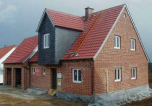
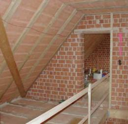
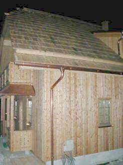
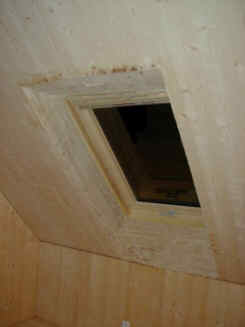
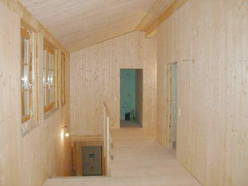
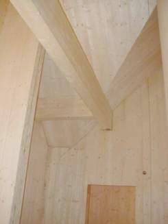

[🠔 Zur Übersicht: Altbau Restaurierung](20bausto.md)  
# 10. Wandbildner im Altbau (und überhaupt) im Vergleich
**Wandbildner im Altbau (und überhaupt) - was ist der mieseste Wandbaustoff?**  
_von Konrad Fischer_

> [!abstract]+ Kapitelübersicht: Wand & Fachwerk  
> 1. **10. Wandbildner im Altbau (und überhaupt) im Vergleich**
> 2. [Feuchte- und Brandverhalten sowie Radioaktivität von Baustoffen](29bau10.md)
> 3. [Wärmespeicherung von Baustoffen](29bau11.md)
> 4. [Restaurierung Naturstein und Fachwerk, Wandbaustoffe im Altbau ...](29bau12.md)
> 5. [Temperaturdehnung / Linearer Ausdehnungskoeffizient von Baustoffen](29bau13.md)
> 6. [Mischbauweise und Schäden durch falsche Baustoffwahl](29bau14.md)
> 7. [Rißbildung im historischen Mauerwerk](29bau15.md)
> 8. [Fachwerksanierung](29bau16.md)
> 9. [Woran erkennt man den Fachwerk-Experten?](29bau17.md)
> 10. [Woran erkennst Du einen Fachwerk-Experten?](29bau18.md)
> 11. [Fachwerkrestaurierung, Hausschwammbefall und Hausschwammsanierung [19.1]](29bau19.md)
> 12. [Energiesparen durch Wärmedämmung im Holzhaus, Fachwerk und Fachwerkhaus, Fachwerkrestaurierung und Fachwerkinstandsetzung](29bau192.md)
> 13. [Fußbodenaufbau allgemein/Holzboden](29bau20.md)
> 14. [Holzschutz ohne Gift: Sanierung statt Vergiftung](2hsm.md)

 Altbautaugliche Verfahren und Baustoffe 

## Wandbildner [9]

Die Kapitel 9-10 wurden in folgende Unterkapitel aufgeteilt - **9. Natursteinrestaurierung** : [[1]](29bausto.md) [[2]](29bau02.md) [[3]](29bau03.md) [[4]](29bau04.md) [[5]](29bau05.md) [[6]](29bau06.md) 
**Steinboden** : [[7]](29bau07.md) 
**Reinigungstechnik** : [[8]](29bau08.md) 
**10. Wandbildner im Vergleich** : **[9]** [[10]](29bau10.md) [[11]](29bau11.md) [[12]](29bau12.md) [[13]](29bau13.md) [[14]](29bau14.md) [[15]](29bau15.md) 
**10.a Fachwerk/Blockbau** : [[16 - Die schärfsten Tipps zur Fachwerkrestaurierung: Woran erkennst Du einen Fachwerk-Experten?]](29bau16.md) [[17]](29bau17.md) [[18]](29bau18.md) [[19.1]](29bau19.md) [[19.2]](29bau192.md) 
**Bodenaufbau/Holzboden** : [[20]](29bau20.md)

## 10. Wandbildner im Altbau (und überhaupt) im Vergleich

_Zum Einstieg -[das Professorenrätsel](7wdvs17.md). 
Der Crash-Kurs zur modernen Bauphysik in 5 Minuten. 
Ohne Berechnungen und Formelkram._

Die im Altbau eingesetzten Wandbaustoffe sind traditionell Vollholz, Lehm, Back- und Naturstein. Für die Reparatur und Ergänzung bieten diese "Grundbaustoffe" technisch oft die beste Lösung. Natürlich kann man auch künstliche Wandbildner nehmen, die letztlich alles Surrogate bzw. billiger und technisch nachteiliger Ersatz für den guten alten Massivbau mit Natur- oder Backstein und Vollholz sind und von einer sich immer wilder gebärdenden Baustoffindustrie mit Pseudoqualifikationen und viel Werbung auf den Markt geschmissen werden. Prinzip Sieb: "Loch an Loch hält es doch" oder vollvergiftete Pappendeckel-Plastiktüte mit durchnäßter Schaumgespinstkruste und blauem Engel dekoriert. 

Nun, es gibt auch dolle Ökoalternativen wie den mit Lehm oder Zementmörtel verschmierten Strohballenbau. Schon lustig, daß deren Befürworter über die Haltbarkeit der lumpigen Plastikschnürli, die den Schnipselkram zusammenhalten, und ebenso über die gar unterschiedlichen physikalischen Beschaffenheiten der dabei in Verbund gezwängten Baustoffe nie genauer nachdenken. Und was tagaus und tagein passiert, wenn die nur gering speicherfähigen Strohfassaden allnächtlich durch Temperaturdehnung auseinandergetrieben, obendrein betaut und aufkondensiert werden? Ja, ich weiß, nur Termiten fressen Stroh und Mäuse gehen nur am Anfang rein und überhaupt muß halt im schönen trockenen und heißen Sommer gebaut werden, damit die Chose von Anfang an trockenst bleibt. Ja saachamol, wo leben die denn? In Marokko? Jedenfalls bestimmt nicht im sommerverregneten Mittel- bis Nordeuropa. Wissenswertes auch aus dem Utopia-Strohballen-Forum: 

_"Die Entomologin (Insektenforscherin) Linda Wiener aus Santa Fe, New Mexiko konnte in mehrjährigen Beobachtungen in Strohballenhäusern folgende Kleininsekten feststellen (Reynolds, 1990): 
* mehrere Arten von kleinen Käfern (silken fungus, minute fungus, minute brown scavenger, hairy fungus), 
* kleine Wespen, die in den Halmen nisten, allesamt nicht größer als 3 mm. Diese ernähren sich ausschließlich von Schimmelpilzen im Stroh und konnten auch nur bei feuchtem Stroh festgestellt werden (bzw. Stroh, das über einen gewissen Zeitraum feucht war und deshalb Schimmelpilze enthielt)."_ - Niedlich, wa?

Surftipp: [www.moderner-lehmbau.de](http://www.moderner-lehmbau.de)

Gegenüber neuen Verbundkonstruktionen aus vergiftetem Holz, kunstharzverleimten Hackschnitzeln, kunststoffkaschierten Folien und Pappen sowie allerlei ["Dämm"stoffen](213baust.md) mit technisch sowie hygienisch unübersichtlichsten Inhaltsstoffen und den "modernen" industriell gefertigten, starkwasserrückhaltenden Wandbaustoffen ist also durchaus gesunde Vorsicht angebracht. Fragen Sie sich immer, woher die Werbebotschaft für irgendeinen Ersatzbaustoff herstammt, also "Cui bono" - wem dient es? Ökobegeisterte Planer in der Jesuslatschen-Marktnische, Chemiesoßenproduzenten, Handwerkssimpl - die Palette möglicher Infoquellen ist gar nicht mal so groß. Und denken Sie - hinter jeder Information steckt jemand, der etwas in Sie hineinformen will. Um dann vielleicht etwas dicke Kohle aus Ihrer Tasche herauszuformen. So ist es Brauch seit altersher und fällt auch keinem heute schwer.

Im Neubau - meine aktuellen Bildbeispiele der Rohbauphase von qualitativ hochwertigen Massivbauten im bewährten Baumeisterstil (echt retro, oder wat?) zeigen das - darf man überraschenderweise sogar noch anständig bauen. Und unsere Baubehörden gehen bei solider Argumentation durchaus da mit. Eben "[gewußt wie](11form.md#enevantrag)"!

_Beispiel 1 - Vollziegel massiv (gibt es tatsächlich noch bei einigen Ziegeleien) luftkalkvermörtelt (Kalkputz fehlt noch) an Wand, Decke, Boden und sogar Dach (!)._

_Na gut, das massiv ausgefachte Fachwerk-Badzwerchhaus habe ich dann verschiefern lassen, es steht ja im Oberfränkischen und warum hätte ich sonst bei Prof. Helmut Gebhard "Ländliches Siedlungswesen" und "Bauen auf dem Lande" studiert (vom anderen TUM-Entwurfs- und Konstruktionsgschmarri will ich lieber nicht reden) und bei meinem noch im "1000jährigen" Reich das Studium beginnenden Architektenpapa fleißig aufgepaßt, was länger hält als BGB-Gewährleistung?_

. 

_Beispiel 2 - Fassaden- und innenwandfertige Vollholz-Schnellbauplatte aus kreuzweise mit Polyurethan PUR verleimtem BSH Brettsperrholz / KLH Kreuzlagenholz massiv (dafür gibt es massenweise Hersteller von Systembauteilen) an Wand, Decke, Boden und Dach (!) - die eher "alpine" Variante ländlichen Bauens (vor der Farbfassung mit reinen Leinölfarben und -lasuren)_

. 

. 

Sieht das nicht "handwerklich" aus? Vielleicht kein modernbeschimmelter Architekturkäse Marke "Alter Dessauer", für den Bauherrn trotzdem nicht so übel. Es soll ja noch zurückgebliebene Architekten geben, die auch darauf Wert legen. Und vor allem - Kalk, Ziegel, Holz - das sind eben Vorteilsbaustoffe nicht nur was Heimeligkeit betrifft, sondern auch Energiesparen, Dauerstabilitität, Feuchtehaushalt, Raumklima, Thermostabilität, Temperaturamplitudendämpfung undsoweiterundsofort. Wobei der Massivholzbau vor allem bei Gartenhütten seine positiven Seiten nach wie vor und allerorten vorführen und beweisen darf, mit hinterdämmtem Vorblendblockbau, holzbeplanktem Ständerbau und WDVS-verdämmter Massivholzfassade in eingeschränkter Form auch im Wohnhausbereich. Und man sich hier unter verschiedensten Fügetechniken - genagelt, geklebt, verkämmt und gedübelt - entscheiden darf, mondgschlägert und aus den heiligen 12 oder sonstwievielen Rauhnächten zwischen Weihnachten und Dreikönig meistergestreichelt vom Alpensteilkamm herabgeschlittert nach Wahl. 

Wobei ganz unter uns der Fällzeitpunkt auch frühers schitegal war, wenn die Mannschaft zwischen Zahnarzt, Kälbern, Befruchtung, Frondienst, Kriegstreiben, Schneehöhe und schnapsbedingtem Dickkopf eben verfügbar war, gings in den Wald zur Holzarbeit. So die historischen Quellen und Datenauswertungen aus genug von dendrochronologischen Untersuchungen, verglichen mit zugehörigen Bauabrechnungen. 

Und der so sehr alles entscheidende Wasser- und Saftgehalt des Baumes, der doch so arg von Jahreszeit und Mondphase abhängig ist? Ok, ok, aber am Ende des Tages wird doch eher das gebeilte Kernholz eingesetzt, und das ist sommer wie winters, vollmonds oder schwarzmonds ziemlich gleich ausgetrocknet, denn der Safttransport findet doch bekanntermaßen in der Bastzone unter der Rinde statt, und das wird weggeschnitten, oder? Und wenn nicht, haben dort eben ein paar Holzböcke und Holzwürmer ein paar Jahre gutes Auskommen, da früher wie heute das geschlagene Holz schnell, und oft allzuschnell verarbeitet wurde. Da ist das kammergetrocknete Holz genau der entscheidende Fortschritt zu besserer Verarbeitungsqualität gewesen, egal was der mondsüchtige Meister der Holzschlägermythologie daherschwafelt. 

Und wie nun, geklebt, geleimt, genagelt, gedübelt? Na ja. Metallverbindungen im unbewitterten Bereich sind eben mal zulässig und dauerstabil. Werden sie ausgiebig bewittert, stehen sie im extremen Wechselklima, kann sich freilich ein rostiger und eher angemorschter Vorhof rund um das Metallprofil bilden. Das ist auch der Grund, warum alte Schieferdecknägel sich plötzlich als nicht mehr haltbar erweisen: Ihr Nagelbett ist quasi ausgelutscht, die notwendige Rückhalte-Reibung nicht mehr vorhanden. Ok. Muß man halt bei der Detailausbildung berücksichtigen. Und eher kein Problem bei vielleicht sogar gekonterten Schrauben / Schraubverbindungen. Über Elektrosmog will ich hier eigentlich nicht groß rumdiskutieren, aber genagelte Holzschichten dürften da wohl eher abschirmend wirken. Und der Leim? Na gut, es gibt Kunstharzleime wie Resorcin und Melamin, die letztlich immer was emittieren / ausdünsten. Wie das Holz ja auch. Und dann der Polyurethanleim PUR, der nur ein paar Minuten nach der Leimung nach Isocyanat ausgast, dann aber auf ewige Dauer gar nix mehr. Und genau der PUR-Leim wird ja meistens bei der Verleimung von Brettschichtholz eingesetzt. Als sehr preisgünstige Fügungsvariante im Vergleich zur Nagelei und Dübelei. 

Und ja, selbstverständlich ist auch der moderne Holzbau ein reiches Betätigungsfeld moderner Schamanen, und auch das folgt den Bedürfnissen des Marktes, in dem Zahnarztgattinnen und alleinerziehende Oberlehrersfrauen keine Ausnahmeerscheinung sein dürften. 

Dazu dann Weichholzfaserplatten oder sonstwas als Dämmung? Gott bewahre, dümmer geht's nümmer. Massivholz alleine selbstverständlich. Für die Klimaschutzgesetze dann die [Befreiung von den Anforderungen aus wirtschaftlichm Grund!](21311bau.md)

Wenn sich irgendeiner der geneigten Leserschaft dafür interessieren würde, wie z.B. die Massivbauweise im Allgemeinen oder gar die Ziegelbauweise im Besonderen im Hinblick auf Solidität, Marktwert und Vermarktungsstrategie seitens der Branche, die das wohl am besten beurteilen kann - die Immobilienmakler - beurteilt wird, hier ein paar Zitate aus den Immobilienanzeigen in der Süddeutschen Zeitung: webimmoblinien Nr. 9, Oktober 2009, PLANETHOME: 

_"Das Einfamilienhaus wurde 1932 in bester Ziegelbauweise erbaut ... das Einfamilienhaus in Massivbauweise errichtet ... Das 1969 in solider und gesunder Ziegelbauweise erstellte Reiheneckhaus ... in bester und gesunder Ziegelbauweise ... Wohnanlage in gesunder Ziegelbauweise ..."_ 

Will sagen, daß auch die zukünftige Wertentwicklung und Dauerstabilität und Vermarktungsfähigkeit und Instandhaltungsfähigkeit und Instandsetzungsbedürftigkeit über die gesamte Lebensdauer einer Immobilie zumindest für gewiefte Bauherren und marktorientierte Immobilienfachleute eine wesentliche Rolle bei der Konstruktionswahl spielen kann, also nicht nur "In welchem Style sollen wir bauen?", sondern auch "Mit welchem Wandbildner / Baustoff?" 

Einige bauphysikalische und seltsamerweise trotzdem draußen **am Bauwerk gültige** Daten verdeutlichen die erheblichen Unterschiede im Wasserhaushalt von Baustoffen:

**Trocknungsdauer "t"** in Tagen nach Roger Cadiergues (aus: Poroton-Handbuch, 5. Auflage, Februar 1991: t = s x d2 
Hierin ist d = Wanddicke in cm und s = Baustoffkenngröße, z.B.:

Kalkmörtel: 0,25 Fichtenholz: 0,90 Porenbeton: 1,20 Schwerbeton: 1,60 
Ziegel: 0,28 Kalkstein: 1,20 Bimsbeton: 1,40 Zementmörtel: 2,50 

Das heißt beispielsweise, daß Kalkmörtel um den Faktor 10 besser austrocknet als Zementmörtel, Ziegel etwa um den Faktor 4 besser als Porenbeton.

Ein nasses, z. B. frisch vermauertes oder im Hochwasser oder mittels leckenden Rohrleitumngen abgesoffenes Ziegelmauerwerk trocknet also so aus: 

17,5 cm: 86 Tage, 24 cm: 161 Tage, 30 cm: 252 Tage, 36,5 cm: 373 Tage, 49 cm: 672 Tage!!!

Berechnen Sie mal selbst, was das für die anderen Baustöfflein bedeutet. Da guckste, wa? Und brauchst Zusatzheizung und -lüftung, um hier möglichst schimmelfrei nachzuhelfen. Früher taten das "ärmere" Bevölkerungsschichten, die dafür notfalls sogar umsonst Brennholz erhielten, um auf Kosten der Gesundheit patschnasse Neubauten "trockenzuwohnen". Das erste Jahr dem Feind, das zweite dem Freund, im dritten ziehste selbst ein. Heute geht das natürlich umgekehrt. Da macht man den unterprivilegierten Mieterschichten die Buden hausbesitzerseits möglichst dicht, bis sie drin ersoffen, erstickt, weggeschimmelt und im eigenen Mief vergast sind. Die Umweltmedizin kann ihr Liedchen darauf singen. Den Dr. Mengele braucht's da nimmer.

Aus Sicht der Austrocknungsbeiwerte ist es also ganz besonders schlau, Ziegelfassaden mit [Zementmörtel](2beton.md) zu vermauern. Das ist typisch [DIN](2mbu.md), sicherer kann man Frostschäden nicht vorprogrammieren: Erst reißt die Zementfuge wegen höherer Wärmedehnung von den Steinflanken ab, dann saugt sie kapillar Wasser ein, dann läßt sie kaum mehr raus und zwingt den Stein zu Feuchtestau und mühseligster Trocknung, die winters oft vom Frost überrascht wird. An porosierten Steinen im Klebmörtelbett sieht man das regelmäßig kurze Zeit nach Erbauung. Die Wärmedehnungen reißen logischerweise auch gleich den Putz mit durch. 

Praktisch ist der nässespeichernde Baustoff zum Feuchte- und Frostschaden bauphysikalisch verurteilt. Das zeigen auch folgende Tabellenwerte nach Eichler zu in Kühlhäusern der DDR gemessenen Feuchtewerten (Auszug, ergänzt mit Lehm nach Prof. Jörg Schulze):

**Baustoff** 

**Dichte [kg/m 3]**

 **Durchschn. Feuchtegehalt 
in Masseprozent [M-%]** 
Ziegel in Außenwänden 

1800

0,6

Hochlochziegel 

1400

1,0

Lehm 

400-800

2,5-4,5

Stahlbeton 

1800

2,5

Gasbeton 

</= 800

4,5

Innenputz Kalkgipsmörtel 

1400

2,0

Weichholz 

500

12,0

Mineralfasermatten 

100

5,0

Polystyrol-Schaumplatten 

15

13,3

Wie steht es eigentlich um die allerorten an der Wand veralgten und im Dach abgesoffenen und verschimmelten Dämmstoffschichten? Aus den bei Kühlhäusern innen angebrachten Dämmschäumen entstand im Zusammenhang mit der von den Ölverkäufern gepuschten "Ölkrise" angeblich die Idee, die aus Öl hergestellten Schäume außen auf die Buden draufzuklatschen. Nun werden diese Schäume/WDVS eben außen naß, vergrünen, verschwärzen und verschmimmeln, [Dämmbauschäden](213baust.md) ohne Ende. Ohne irgendwelche Energie zu sparen, das beweisen beispielsweise diese [diese Forschungsergebnisse](7fehrtab.md). Im Gegenteil: Die vor sich hin schillernd-versauenden Fassadendämmpakete verringern als Wandbeschichtung den Solarenergieeintrag in die Massivwand und feuchten auf. Auch innen. Das kostet zusätzliche Heizenergie und Instandhaltungsaufwand.

Themenlinks: 
Prof. Weinspach: Gerade alte Bauten mit dicken und schweren Wänden schneiden bei [Vergleichen des Energiebedarfs mit "sehr gut" ab](http://www.mythen-post.ch/datei_news_25_5_02/prof_weinspach_5_10_01.htm) 
Bestätigung aus Finnland, daß Mauerwerk viel besser ist, als ein k-Wert je rechnen kann: [Impact of the Exterior Wall Structure on the Energy Efficiency of Building](http://www.kolumbus.fi/finnmappartners/rym/eng/ttkk.htm) - in Deutsch dank Kollege Bumann: [www.dimagb.de/info/bauneu/mbbph2.html](http://www.dimagb.de/info/bauneu/mbbph2.html)

Wie unerfreulich für die Praxis das normgläubige, aber falsche Vorgehen bei der Konstruktion von Dämmbuden war, ist folgender Seminareinladung (11.-12.10.2000) des e.u.z - energie+umwelt zentrums am Deister, Springe zu entnehmen:

_**"Feuchtemanagement**_

**... Praxis-Seminar mit Dr.-Ing. Hartwig Michael Künzel**

**... Inhalt**

Dampfdichte Bauteile haben sich als besonders schadensanfällig erwiesen, da sie unplanmäßig eingedrungene Feuchte im Inneren gefangen halten. Die Feuchte sollte deshalb weder aus- noch eingesperrt werden, sondern sich in angemessenem Umfang in Gebäude und Bauteilen bewegen können. Was angemessen ist, bestimmt die Feuchtebilanz und die maximal tolerierbare Feuchtebelastung. Deshalb muß das Austrocknungspotential im Laufe eines Jahres größer sein als das Befeuchtungepotential. Außerdem dürfen bestimmte Grenzwerte von Feuchte und Temperatur nicht überschritten werden, um die Gebrauchstauglichkeit eines Bauteils nicht zu gefährden.

Die bislang übliche Praxis, die gemäß DIN 4108-3 ausschließlich die stationäre Dampfdiffusion unter vereinfachten Randbedingungen berücksichtigt, bietet in vielen Fällen keinen ausreichenden Schutz gegen Feuchteschäden. ..."

Das schrieb auch Prof. Dr.-Ing. Claus Meier, Nürnberg, Mitglied im Beirat für Denkmalerhaltung der [Deutschen Burgenvereinigung e.V.](http://www.deutsche-burgen.org), seit vielen Jahren an das DIN und in der Fachpresse. Tausende Häuser und vor allem Dämmbuden mußten verschimmeln und verpilzen, ihre Bewohner erkranken, ihre Erbauer und Planer strafrechtlich belangt werden, bis der stationäre Wahn des Normenausschusses nun öffentlich eingestanden wird. Wann wird die Wärmeschutz-DIN 4108, voll von derart katastrophalen Irrtümern, insgesamt kippen? Natürlich nie. Man weiß ja, wer im Normenausschuß regiert. Doch wenn der Bauschaden da ist, ist auch der gute Rat oft teuer. Wenn Sie da einen kompetenten Baurechtler brauchen, haben Sie bessere Chancen. Auf WDVS-Schäden spezialisiert ist übrigens der Rechtsanwalt Wolfgang Haegele, seine [Webseite](http://www.haera.de) bietet einen Einstieg.

Lesen Sie die Normeinsprüche und zugehörigen Schriftwechsel Prof. Meiers: 

****DIN 4108**** 
**[Teil 2 Kurzfassung](7d4108kf.md) 
[Getürkte Bauphysik?](7d41082e.md) 
[Teil 3](7d41083.md)**

 Und wie verhält sich eigentlich die Gesamtwirtschaftlichkeit eines Fassadensystems, wenn man eine längere Zeitperiode betrachtet? Dirk Fanslau-Görlitz, Martin Pfeiffer, Janet Simon und Yasemin Wildebrand stellten sich diese drängende Frage auch und geben in ihrem "Atlas - Bauen im Bestand", Verlagsges. Müller, 2008, im Kapitel I.3: "Nachhaltige Modernisierung" auf Seite 59 eine Tabelle an, aus der die folgenden Kostendaten und Instandsetzungszyklen für verschiedene Fassadensysteme bei Betrachtung einer Periode von 80 Jahren aufgeführt werden. Dieses Buch kann als wahre Fundgrube bezeichnet werden, soweit man sich für Baukosten und Wirtschaftlichkeitsbetrachtungen gerade im Zusammenhang mit derzeit anstehenden Neubauten oder auch Sanierungen interessiert. 

Und wenn der schlaumeiernde Leser denkt, daß man ja die Instandhaltungszyklen fast nach Belieben dehnen kann, nur das: Dann steigen halt die jeweils anfallenden Instandhaltungskosten entsprechend. Vielleicht sogar exponentiell. 

Hier nun ein wohl mehr als aufschlußreicher Auszug aus der aufschlußreichen Tabelle, die auf einer entsprechende Untersuchung des Instituts für Bauforschung e.V. IFB in Hannover (Erklärte Ziele u.a.: Kostengünstiges Planen, Bauen und Betreiben) aus dem Jahre 2001 aufbaut: 

Tabelle I.45: 
**Instandsetzungsintervalle und Instandsetzungskosten ausgewählter Bauteile im Wohnungsbau** [Auszug] 
Bauteil, Art der Leistung Instand- 
setzungs- 
intervall Kosten Jahre Kosten nach 80 Jahren 
[inkl. Neben- 
kosten + Ust 
Inflation 2%] Kosten im 
Jahresdurch- 
schnitt 
Außenwände [Jahre] [EUR/m²] 5 10 15 20 25 30 35 40 45 50 55 60 65 70 75 80 [EUR/m²] [EUR/m²] 
Außenwand mit Verblendmauerwerk 284,73 3,56 
Verfugung ausbessern 20 7,67 . . . x . . . x . . . x . . . x 89,10 1,11 
Gerüstvorhaltung 20 7,67 . . . x . . . x . . . x . . . x 89,10 1,11 
Mauerwerk säubern 40 15,34 . . . . . . . x . . . . . . . x 106,53 1,33 
Außenwand mit Standardputz (mit Anstrich) 566,36 7,08 
Neuer Anstrich 15 25,56 . . x . . x . . x . . x . . x . 333,09 4,16 
Putzausbesserung 15 10,23 . . x . . x . . x . . x . . x . 133,32 1,67 
Gerüstvorhaltung 15 7,67 . . x . . x . . x . . x . . x . 99,95 1,25 
Außenwand aus Holzständerwerk mit Holzschalung 650,47 8,13 
Streichen 5 5,11 x x x x x x x x x x x x x x x x 205,92 2,57 
Gerüstvorhaltung 5 7,67 x x x x x x x x x x x x x x x x 309,63 3,87 
neue Holzschalung 50 51,13 . . . . . . . . . x . . . . . . 134,92 1,69 
Außenwand mit Wärmedämm-Verbundsystem 1.314,05 16,43 
Reinigung und Pflege 5 7,67 x x x x x x x x x x x x x x x x 309,63 3,87 
Gerüstvorhaltung 5 7,67 x x x x x x x x x x x x x x x x 309,63 3,87 
Putzausbesserung 10 7,67 . x . x . x . x . x . x . x . x 162,21 2,03 
Neues WDVS 40 76,69 . . . . . . . x . . . . . . . x 532,58 6,66 

Nun soll mir mal ein Planer oder Energieberater erklären, wie sich das grottige WDVS-Ergebnis in der oberen Tabelle mit dem Umweltschutz, dem [Klimaschutz](7klima.md), der Energieeinsparung und vor allem der Wirtschaftlichkeit verträgt? Ist es angesichts dieser wissenschaftlich erhobenen Daten nicht geradezu ein abscheulicher Betrug, unkundigen und vertrauensseligen Bauherren weiszumachen, daß WDVS zu großen Vorteilen führe? Und selbst der dickste KfW-Zuschuß - von den mickrigen Zinsvorteilen gar nicht zu reden - kann die hier wohl Jedem auf den ersten Blick sichtbare Unwirtschaftlichkeit der [WDVS-Bauweise](213bausto.md) jemals heilen. Geschweige denn die selbst gemäß DIN und EnEV "regelrechte" Ermittlung der Heizkostenersparnis als Grundlage der Anfangsinvestition in ein Wärmedämmverbundsystem. Und aufgepaßt: Ein Bauherr kann wohl mit Fug und Recht erwarten, daß sein studierter Planer und auch sein zertifizierter Energieberater die einschlägige Fachliteratur zum Thema beherrscht und seinen Bauherrn deswegen auf Basis gesicherter Erkenntnis vollumfänglich auch wirtschaftlich korrekt berät! Wenn nicht? Das ist dann eine Frage für die Gerichte ... 

[Hier weiter: [Kapitel 10]](29bau10.md)

Weitere [Info und Tipps zu Gerüstbau, Baugerüst, Rollgerüst, ...](http://www.geruestbau.org)
