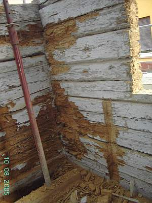

[🠔 Zur Übersicht: Wand & Fachwerk](29bau09.md)  
# Feuchte- und Brandverhalten sowie Radioaktivität von Baustoffen
**Feuchtegehalt, Brandgasentwicklung und Brandverhalten sowie Krebsrisiken / Radioaktivität / Radonemission von Baustoffen**  
_von Konrad Fischer_

 Altbautaugliche Verfahren und Baustoffe 

## Wandbildner [10]

Die Kapitel 9-10 wurden in folgende Unterkapitel aufgeteilt - **9. Natursteinrestaurierung** : [[1]](29bausto.md) [[2]](29bau02.md) [[3]](29bau03.md) [[4]](29bau04.md) [[5]](29bau05.md) [[6]](29bau06.md) 
**Steinboden** : [[7]](29bau07.md) 
**Reinigungstechnik** : [[8]](29bau08.md) 
**10. Wandbildner im Vergleich** : [[9]](29bau09.md) **[10]** [[11]](29bau11.md) [[12]](29bau12.md) [[13]](29bau13.md) [[14]](29bau14.md) [[15]](29bau15.md) 
**10.a Fachwerk/Blockbau** : [[16 - Die schärfsten Tipps zur Fachwerkrestaurierung: Woran erkennst Du einen Fachwerk-Experten?]](29bau16.md) [[17]](29bau17.md) [[18]](29bau18.md) [[19.1]](29bau19.md) [[19.2]](29bau192.md) 
**Bodenaufbau/Holzboden** : [[20]](29bau20.md)

Daß nur bewährte und deswegen auf diesen Seiten bevorzugte Baustoffe das einwandfreie _"Feuchtemanagement"_ beherrschen, weiß die Baukunst seit anno dunnemals. Es brauchte schon Kriegsnotzeiten und Industrienormen (vor allem der Pappendeckelbudenproduzenten), um davon mit Hilfe gelahrter "Expertisen" williger "Bauforschung" abzuweichen - Zum "Stand der Technik" wurden und werden diese Konstruktonsutopien - im Gegensatz zum "Allgemein anerkannten Stand der Technik" - hochgejubelt. Der Auftragsforschung wegen, klaro. Aber: Aus Margarine wird trotzdem keine Butter, aus Schaumgespinsten, Porenschwammblöcken, Kunststofffolien und sonstigem Verpackungsmüll kein vernünftiger Baustoff.

Haben wir das nicht schon immer gewußt? Daß der Ausweg für die abhängigen "Forscher" nun in immer aufwendigeren Simulationen und anlagentechnischer Entlüftung und Entfeuchtung liegt, ist klar. Wo bliebe sonst das schöne Geschäftsfeld, dem Bauherrn ein X für ein U vorzumachen, ihn mit allen Mitteln psychischer Beeinflussungskunst vom traditionsbewährten Bauen wegzulocken? Empfehlung: Lassen Sie sich nicht türkien!

Nicht uninteressant zur Bewertung der Ersatzbaustoffe in brandschutztechnischer Hinsicht ist diese Tabelle (Quelle: Dr.-Ing. Wolfgang J. Friedl, vfdb-Zeitschrift 9/99), sie zeigt die unterschiedliche Menge an tödlichen Brandgasen, die im Brandfall aus verschiedenen brennbaren Stoffen freigesetzt werden, Die Schaumstoffe, zu denen ja auch Polystyrol gehört, können da jedenfalls mit vergleichsweise sehr hohen Rauchgasmengen aufwarten:

**Brandgasvolumenstrom in verschiedenen Materialien**

**Material (10 kg)** **Brandgase in m 3/h** 
Schaumgummi 25.000 
Schaumstoff 23.000 
Papier 10.000 
Polypropylen 7.000 
Spanplatten 7.000 
GFK-Kunststoff 5.000 
PVC-Kunststoff 4.000 
Linoleum 2.500 

Wie die Ausstattung mit qualmfreudigen "Baustoffen" die Personenrettung in Einfamilien-Dämmbuden verunmöglicht, lesen sie auf diesem Link:

[ Mutter und vier Kinder starben bei Brand eines vollpolystyrolisierten EFHs in Tegernheim](http://www.welt.de/print-welt/article367052/Fuenf-Tote-bei-Brand-eines-Einfamilienhauses.html)

[Passivhäuser brennen anders](http://www.badische-zeitung.de/passivhaeuser-stellen-die-feuerwehr-vor-neue-herausforderungen--print) - Zum extremen Brandrisko im Passivhaus / Brandgefahr Passivhausbauweise

Eine interessante Meßwert-Tabelle zum praktischen Feuchtegehalt findet sich auch bei Hohmann/Setzer (Auszug, ergänzt um Lehm, Holz und Stroh nach Prof. Dr.-Ing. Jörg Schulze):

**Baustoff** 

**Praktischer Feuchtegehalt 
in Volumenprozent**

Ziegel 

1,5

Lehm 

3

Kalksandstein 

5,0

Beton, geschlossenes Gefüge, dichte Zuschläge 

5,0

Beton, geschlossenes Gefüge, porige Zuschläge 

15,0

Leichtbeton, haufwerkspor. Gefüge, dichte Zuschläge 

5,0

Leichtbeton, haufwerkspor. Gefüge, porige Zuschläge 

4,0

Gasbeton 

3,5

Gips/Anhydrit 

2,0

Gußasphalt 

etwa 0

Holz und Stroh 

10-15

Frage: Was passiert in feuchten Buden? Richtig, es schimmelt, man fröstelt und wird sterbenskrank. Obendrein steht der Feuchtegehalt auch in Beziehung zur Saugfähigkeit. Das Aufbrennen und nachfolgende Hohlstehen von Putzschichten auf Kalksandstein ist ja diesbezüglich ein bekanntes "heißes Eisen". Erneuern oder nachträgliches Anbinden an den Putzgrung mit Kalktechnik sind dann die Alternativen.

Auch beim **Lehmbau mit Lehmgefachen, Lehmputzen und Lehmfarben** sollte man schon genauer wissen, was man tut. Feuchtetechnisch kann es hier extreme Probleme geben, wenn man die tatsächlichen Eigenschaften von Lehm und Ton vernachlässigt und auf die auch auf diesem Sektor geradezu ungeuerlichsten Märchen von "interessierter Seite" hereinfällt. 

Deswegen hier als Info mein etwas überarbeiteter Beitrag aus dem [Fachwerkforum bei fachwerk.de - Innendämmung mit Lehm oder was?](http://www.fachwerk.de/goForum.html?id=90779): 

 So kann ein innengedämmtes Holzhaus nach ein paar Jahren Nutzung aussehen. Dabei handelte es sich um eine kalkverputzte Heraklithverkleidung. Es kommt immer etwas Feuchte hinter die Dämmung, und die gedämmte Wand ist halt kälter, und dann kondensiert es ein - abhängig von der Raumluftfeuchte, die in dicht gedämmten Buden gerne höher ist. Von außen kommt fallweise der Schlagregen dazu. Die Wand kann folglich auffeuchten, die Feuchte wird dann in der kalten Jahreszeit nimmer richtig rausgeheizt. 

Eine zusätzliche Lehmschale halte ich für ebenso falsch. Wichtig ist doch, daß die Fachwerkwand in der Heizperiode genug Wärme bekommt, um eben ausreichend auszutrocknen. Und genau dem steht jegliche Art von Innendämmung entgegen. 

Wichtig: [Richtig (!) heizen und lüften](7temper.md), also stetig und nicht ständig rauf und runter bzw. unsinnige Stoßlüfterei. Dann bleibt auch der Energieverbrauch niedrig. 

Und: Ein funktionierendes System wie die historisch bewährte Fachwerkwand bitte nicht zu Tode dämmen, egal ob industriemäßig mit Schaum/Gespinst, mit mondscheingestampftem ÖKO-Leichtlehm oder handgezupft- pobedrückten BIO-Haschischplatten. Nebenbei stehen die [Dämm-Kosten nie in einem akzeptablen Verhältnis zu den (theoretischen) Einspareffekten](7fehrtab.md) - das sage ich als EnEV-Sachverständiger, der ständig - streng nach EnEV, versteht sich - Wirtschaftlichkeitsberechnungen betr. [EnEV-Befreiung](7temp24.md) vornimmt. 

Wenn es mal dauerhaft keine Schäden durch Fachwerk-Innendämmung geben sollte, ich will das ja nicht abstreiten, liegt das 

- an der dank guter Dauerlüftung ausreichend trockenen Raumluft, 
- an fehlender Bewitterung der Wand von außen, bzw. 
- [Dauerbetrieb einer Hüllflächentemperierung](7temper.md). 

Doch damit wird die Innendämmung noch lange nicht wirtschaftlich. Und bleibt ein Risiko, wenn die genannten Voraussetzungen irgendwann mal nicht mehr funktionieren, sei es durch Leerstand oder sonstige bauliche Änderungen. 

Selbstverständlich macht es bei vorhandener Innendämmung Sinn, die Feuchte darin zu messen. Noch mehr Sinn machte es, anhand einer Freilegung an einer kritischen Partie wie Außenwandecke sich die Sache mal genauer anzusehen. 

Und ansonsten wette ich, daß der historische Oberputz ein Luftkalkmörtel war, auf welchem Gefachaufbau auch immer (Ziegel, Bims, Lehm). Und genau das würde ich ggf. wieder so machen, denn er kann im Unterschied zum Dichtbaustoff Lehm (ideal für Fundament- und Teichabdichtung) wirklich Raumluftfeuchtespitzen puffern und bestens wieder abtrocknen. 

Und die Biodämmstoffe sind in Bezug auf Schimmel keineswegs besser als Industrieware: Sie halten Feuchte gräßlich zurück mangels Kapillarsystem - vergleichbar Mineralwollfilz oder machen dicht wie z.B. Lehm. Wenn nun Feuchte da ist, schimmelt's eben. Und Holz rottet dann. Habe selbst in diesem Forum schon irgendwo Schimmel auf Bio gesehen, und zwar nicht nur in meinen Bildern ... 

Jeder kann selbst zum Baustoffprüfer werden: Probieren Sie doch mal die Feuchteaufnahme und -abgabe eines Lehmputzes mit dem eines Luftkalkmörtels zu vergleichen. Das kann man auf einer Küchenwaage machen, mit der Küchenuhr als Zeitmesser. Und dann wird der Unterschied klar. 

Davon abgesehen ist mir kein Beispiel bekannt, wo sich die gar nicht mal so geringen Kosten einer Leichtlehmzusatzschale durch damit erzielbare Energieeinsparungen wirtschaftlich gegenrechnen würden. 

Freilich haben dickere Wände besseren Schallschutz. Doch die heizungsbedingte Austrocknung der winterlich beregneten Fachwerkwand wird dann ein Problem. Warum nicht die Erfahrung unserer Vorväter nutzen? Die Meister des Fachwerkbaus haben auf derlei Späßchen verzichtet - aus Armut oder Blödheit oder weil eh der Knecht das Holz gehackt und verschürt hat? 

Wenn der Lehm ins Fachwerkgefache eingebaut ist, ist er bedeutend nasser als das Holz. 

Folge: Das trockenere Holz nimmt Feuchte an und - quillt. 

Dann kommt die Trocknungsphase: 

1. Das Holz schwindet. 
2. Der Lehm schwindet. 

Folge: Eine zwischen Lehm und Holz klaffende Fuge. Diese ist kapillar aktiv und kann bei Beregnung Unmengen Wasser reinsaugen. Das nimmt nun aber nicht der (dichtere) Lehm auf, sondern vorzugsweise das Holz. 

So kann es zu Überfeuchten im Holz kommen, abhängig von der Bewitterungssituation. Deswegen haben die alten Meister bzw. die geschädigten Hausbesitzer die stark bewitterten Fachwerkfassaden entweder gleich oder nach Schadenseintritt durch entsprechende Schutzkonstruktionen (Dachvorsprung, Abweisbrettgesimse, Vollverkleidung mit Vorsatzschale) geschützt. Wenn der Lehm irgendwelche Holztrocknungseigenschaften und nicht diese vermaledeite Neigung zur schwundbedingten Fugenbildung gehabt hätte, wäre das natürlich nicht notwendig gewesen. 

Auch wenn man die zunächst entstehende Fuge nachverdichtet - mit nassem Lehm - bleibt der Quell- und Schwundeffekt, die Kapillarwirkung der Fuge steigt mit geringerer Fugenbreite. 

Natürlich ist die Fuge auch bei allen anderen Mörteln existent, profimäßig macht ja man extra einen Kellenschnitt als "Bewegungsfuge". Nur trocknen Kalkmörtel selber weitaus schneller und besser als Lehm. 

Was dann bei Beregnung übrigens noch dazukommt: 

Kalkmörtel entlastet die Fuge am Schwellholz/unterem Rähm um Weltklassen besser, da er von vornherein in seiner Fläche mehr Wasser "kurzfristig" wegsaugt - um es baldigst wieder abzugeben. Es sei denn, ein Heini hat das Gefach mit wasserabweisenden Farben nach Künzelscher Fassadentheorie zugepappt. 

Freilich, auch Holz ist nicht der Renner betr. Feuchteaufnahme und -abgabe. Und ist deswegen ein bewährtes und auch dichtes Dachmaterial (Schindel). Aber das steht hier nicht zur Diskussion. 

Wissen sollte man nur betr. Innendämmung, daß Holzweichfaserplatten bedeutend mehr Kondensat (und selbstverständlich auch Wasser) reinsaugen (Meßwerte an die 30 % in WDVS-Wanddaämmplatten und Dachdämmungen sind kein Ding der Unmöglichkeit!), als Massivholz, und mangels Kapillarität dann äußerst lange zurückhalten können. Deswegen schimmelt das Zeugs ja auch nicht schlecht, sobald die Umgebungskonditionen passen. Nicht umsonst werden den seltsamen Putzen für den Einsatz auf Holzweichfaserplatten ausreichende Mengen giftiger Fungizide beigesetzt. Nebenbei werden "moderne" Holzweichfaserplatten auch gerne mit Kunstharzleimen und Kunststoff-Stützfasern versehen, die für manchen überzeugten Ökohengst deren so arg gepriesenen ökologischen Vorteile etwas in Mitleidenschaft ziehen und im Entsorgungsfall höhere Kosten verursachen (keine Kompostierbarkeit). Hier etwas Zusatzinfo zum Problemmüll "Ökodämmung" von Holzweichfaser über Hanf und Flachs bis zur Schafwolle und sonstigen künstlichen Dämmstoffen: 

[AID-Info zu nachwachsenden Dämmstoffen](http://www.aid.de/landwirtschaft/haus_daemmstoffe.php) [Kompetenzzentrum Bauen mit nachwachsenden Rohstoffen - Inhaltsstoffe von Dämmmaterialien](http://www.knr-muenster.de/index.php?id=78) 

Und zweitens: 

Die frühere Lehmbauerei hatte Zeit. Die brauchte der Lehm unbedingt zum ordentlichen Durchtrocknen der eingebauten Lagen. Heutzutage fehlt es nicht an teurem Lehmpamp, sondern an Zeit. Und so geht eben so einiges beim Lehmbau schief. 

Kommt nun die typische Innenkondensation durch überfeuchtes Energiespar-Raumklima zustande, ist die äußere raumseitige Zone des Lehms ein Problem. Seine organganischen Zuschlagsstoffe und die typischen Methylzelluloseanstriche / Bioanstriche sind perfektes Substrat für den Schimmelbefall. Und seine vergleichsweise dichte Struktur saugt eben nicht das ankommende Kondensat schnell weg, wie es ein Kalkmörtel im Vergleichsfall könnte. Das dürfte inzwischen klar sein, daß es ein bedeutendes Schimmelrisiko bei Lehmputzen gibt. 

Was mich befremdet, ist das Propagieren der Lehmerei ohne ausreichendes Risikobewußtsein und Beachtung der Reaktionen der beteiligten Konstruktionen bei Feuchte. Märchen wie unübertreffbare Feuchtepufferung (sehen wir mal von der schnell erreichten Auffeuchtung der Oberzone und extrem sandhaltigen/abgemagerten Mischungen ab), Rauchverzehrung und Holzaustrocknung / Trockenhaltung durch Lehm sollten wir uns als Fachleute sparen. 

Lehmbau - gegen den ich freilich garnix habe, setzt eben wie alle anderen Bauweisen konstruktive Kenntnisse voraus, um Material und Verarbeitung sowie den späteren Gebrauch in den Griff zu bekommen. 

_Einwand eines Forumsteilnehmers: 
Nach einem Versuch des FEB. Uni Kassel (Prof. Gernot Minke) kann dieser bis zu 300 g Wasser aus der Raumluft pro m² innerhalb 48 Stunden aufnehmen. Zum Vergleich: Gebrannte Ziegel liegen hier bei 10-30 g "andere" Putze lagen zwischen 26-76 g._

Antwort: Was die Wissenschaft betrifft, muß man immer fragen, wer sie finanziert bzw. veranlaßt. Haben Sie eine zuverlässige Tabelle der Desorptionsfähigkeiten von Lehm und Kalkmörtel im Vergleich? Das könnte die anstehende Frage im Sinne von "Wissenschaft" beantworten. 

Die zitierte Laborforschung liegt mir inkl. der den Versuchsaufbau bestimmenden Randbedingungen nicht vor. Vorstellen könnte ich mir schon, daß unheimliche Mengen Raumluftkondensat auf einer kalten Lehmschicht in der obersten Zone niederklatschen und dann deren Feuchtegehalt massiv erhöhen, bis es von der Wand rinnt. 

Nebenbei ist die Feuchtebeaufschlagung einer Konstruktion vorwiegend abhängig vom Verhältnis Raumluftfeuchte-Lufttemperatur-Oberflächentemperatur. Und der Anstieg der Oberflächentemperatur eines Raumes ist beim Aufheizvorgang mit Heizluft von der Materialdichte (Rohdichte). 

Ein schwerer Baustoff wie Lehm wird also viel langsamer erwärmt als ein leichter Porenziegel oder gar ein Dämmstoff. Bleibt also zunächst wesentlich kälter und verschlingt unter Laborbedingungen gegen eine kaltbleibende Außenluft (Klimakammer) auch mehr Nachheizbedarf, um seine Oberflächentemperatur zu halten. 

Womit wir bei den möglichen Parametern wären, die bei einem Absorptionsversuch von Kondensat in Raumoberflächen zu beachten sind, neben so einigen weiteren. Beim Versuchsaufbau kommt es eben genau darauf an, wenn man faire Vergleichsuntersuchungen machen will. 

Ansonsten ist es die leichteste aller Übungen, durch geeignete Versuchsaufbauten so gut wie jedes gewünschte Versuchsergebnis vorzuprogrammieren. 

Aber die Transportleistung des Kalkmörtels, der Kondensat ins Innere wegtransportiert, es nicht an der Oberfläche schimmelriskant anreichert und danach ohne Anstrengung schnell wieder abgibt, KANN Lehmputz niemals erreichen. Na gut, im Mischungsverhältnis Sand/Lehm = 99/1 schon, aber das ist Illusion. 

Wenn Sie mal die Pettenkofermethode anwenden und Baustoffe "durchpusten", werden Sie schnell selber herausfinden, welches Material für Diffusion und auch Feuchte um Weltklassen durchströmbarer ist. Meine unwissenschaftliche Prognose: 

Lehm kann nur der zweite Sieger sein. 

Oft muß man sich auf den begrenzten Verstand und die Erfahrung und nicht auf die Auftragswissenschaft verlassen. 

Das wäre ja auch eine Methode. Und vielleicht nicht die schlechteste. 

Ich zitiere auszugsweise aus einer Abdichtanleitung für Teichbau: 

_"Es gibt prinzipiell mehrere Möglichkeiten einer Teichabdichtung mit Lehm. ...: 

1. **Stampflehmabdichtung** 
Fetter Lehm (mindestens 30% Tonanteil) wird in erdfeuchter, krümeliger Konsistenz in einer Schichtstärke von 15-18 cm auf dem Teichboden aufgebracht und festgestampft. ... 

2. ... **Verlegen von ungebrannten Lehmsteinen - sogenannten Grünlingen**. 
Am besten verwendet man hier das Doppelformat mit 12x12x25 cm. Die Fugen zwischen den Steinen sollten möglichst klein sein und werden ebenfalls mit krümeligem Lehm verfüllt. Sie können aber auch mit einer Lehmschlämme, die Sie sich aus den aufgeweichten Grünlingen herstellen, zugegossen oder zugestrichen werden. Anschließend wird die Lehmoberfläche mit Wasser besprüht, sodaß die Lehmsteine noch etwas aufquellen können und sich eventuelle Fugen noch schließen. ... 

3. Am einfachsten ist es, **Fertigteil-Lehmelemente** zu verlegen oder die **Abdichtung mit tonhaltigen Vliesen** ..."_

Soviel zum profimäßigen Dichten mit Lehm&Ton. Reimt sich doch geradzu unheimlich gut mit meinen obigen Aussagen zusammen - oder? 

Hier der Link zur Quelle: [Forum nawaro.com: Christian A. Rauch: Teichabdichtung mit Lehm](http://www.nawaro.com/cgi-bin/forum.pl?action=show&groupid=2) 

Interessant auch der Belastungsgrad des Innenraums durch das Radonnukleid Rn-222, das baupraktisch den größten Strahlungseinfluß durch seine lungengängige "Darbietungsform" aus der Baustoffexhalation darstellt:

**Radioaktivität von Baustoffen**

B a u s t o f f 

Exhalationsrate 
für 10 cm Dicke 
in Bq/m2h

 Quelle 
Ziegel, Klinker 0,2 4 
Leichtbetonsteine 
aus 

Blähton

0,4 2 

Hüttenbims

0,9 1 

Naturbims

1,8 2 
Naturgips 0,4 3,1 
Industriegips 
aus 

Apatit

0,4 3,1 

Phosphorit

24,1 1 
Kalksandstein 0,6 2 
Beton 0,7 2 
Porenbeton 1,1 3,1 
empf. Grenzwert </= 5 

Quellennachweis: 
1) Keller, Gert: Einfluß der natürlichen Radioaktivität, arcus Heft 5, 1984. 
2) Prüfbericht des Boris-Rajewski-Instituts für Biophysik der Universität des Saarlandes. 
3) Der Bundesminister des Inneren: Umweltradioaktivität und Strahlenbelastung. Jahresbericht 1982. 
4) Meßwerte 1987 u. 1990 gem. Prüfberichten des Boris-Rajewski-Instituts für Biophysik.

Die ibau-Planungsinformationen schreiben am 15.9.00 zum Problem rund um [Radon](http://de.wikipedia.org/wiki/Radon) (das Isotop 222Rn der Uran-Zerfallsreihe) in superschadstoffeinsperrenden dichten Dämmbuden:

**_"Krebsrisiko durch Wärmedämmung_**

_München (vwd/AP) - Die Wärmedämmung von Häusern kann das Krebsrisiko der Bewohner erhöhen. Der stellvertretende Generaldirektor der Internationalen Atomenergiebehörde, Werner Burkart, sagte bei einer Konferenz über den Schutz vor natürlicher Strahlung in München: "Brisant ist die Art, wie wir unsere Häuser nach außen abdichten, um weniger Wärmeverluste zu haben." 

Mit der Abdichtung steige nämlich die natürliche Strahlenbelastung durch das radioaktive Edelgas Radon, das im Erdreich_ [Anm. KF: Und in den o.g. Baustoffen!]_entstehe._

_Wie Hans Landfermann vom Bundesumweltministerium erklärte, steigt die Lungenkrebsrate ab einer Belastung von 250 Becquerel pro Kubikmeter Luft messbar an. ... Burkart sagte, schwedischen (allerdings umstrittenen) Studien zufolge verursache Radon in Häusern 10 bis 15 Prozent der Lungenkrebs-Toten. ... Landfermann räumte ein, dass die von der Bundesregierung geplante Förderung der Wärmedämmung bei Altbauten mit dem Strahlenschutz "etwas konkurriert". Allerdings werde geprüft, wie eine Steigerung der Radon-Belastung vermieden werden könne. ..."_

Vielleicht durch endgültiges staatliches Verbot gängiger Massivbaustoffe? Das würde die Dämmstofffritzen aber sehr freuen! Alles nur eine Frage des Preises für die käuflichen Besucher der Lobby.

Ausgangspunkt der die German Angst nach besten Kräften instrumentalisierenden Meldungen über unerträgliche / riskante / gesundheitsbedrohende / tödliche Strahlung aus dem Keller bzw. Baustoffen ist immer wieder das Helmholtz Zentrum München - Deutsches Forschungszentrum für Gesundheit und Umwelt (Neuherberg / Oberschleißheim). mit seinen diversen Instituten, z.B. für Gesundheitsökonomie, Epidemologie und eben auch das [ISS, Institut für Strahlenschutz](http://www.helmholtz-muenchen.de/forschung/institute-abteilungen/strahlenschutz-iss/index.html). Der frühere Boß des letzteren, Prof. Wolfgang Jacobi, hatte ein besonders schönes Steckenpferd: Die Radonforschung. Mit exzellenten Medienkontakten - vorzugsweise in die Sudelpresse (SPIEGEL usw., die obige IBAU-Meldung ist auch ein Kind dieses Marketinggags) - gelang es ihm, sein Forschungsgebiet in der öffentlichen Angst fest zu verankern und öffentliche Fördermittel in rauen Mengen einzuheimsen. Immer wieder machten dafür entsprechende Katastrophenmeldungen die Runde und versetzten den deutschen Kellerbesitzer in Strahlenpanik. 

Beispiel gefällig? Bittschän: [Radon: Ritzen verstopft. Wissenschaftler warnen vor dem Edelgas Radon, der "Radioaktivität aus dem Untergrund" - einer vernachlässigten Gefahr.](http://www.spiegel.de/spiegel/print/d-13489287.html) (Der Spiegel 21.01.1991), oder auch [Verseuchte Häuser - Strahlenschutzbehörde warnt vor Krebsgefahr durch Radon](http://www.spiegel.de/wissenschaft/mensch/verseuchte-haeuser-strahlenschutzbehoerde-warnt-vor-krebsgefahr-durch-radon-a-573186.html). Von Heike Le Ker (Der Spiegel 20.08.2008) 

Das Zitieren dubiosester "Studien" - eine von den staatlich instrumentierten gesellschaftszerstörenden - aber geschäftstüchtigen Umweltaktivisten schon seit langem entdecktes und oft benutztes Instrument, mit käuflichen Wissenschaftlern die käufliche Medienlandschaft aufzuwühlen und das deutsche Michelhirn zu kneten - beförderte freilich nicht nur die drittmittelfinanzierte Strahlenforschung, unterhielt einen sauteuren Gerätepark, sondern auch das lukrative Geschäft mit der Angst. Krebsangstbesessene Hausbesitzer können ja was dagegen tun, daß in ihrem gefährlichen Hüttchen die ach so tödliche Radonexhalation abgemindert wird: 

Ob man das Haus gleich abreißt und einen flotten Ersatzneubau für 1,2 Millionen Euro - zugemüllt mit eklen Dämmstoffen - in die Gegend stellt, wie es 2012 die Bayerischen Staatsforsten mit ihrem Forstamt im oberfränkischen Fichtelberg praktizierten (ja, wir wissen es, Geld spielt da keine Rolle, es ist ja nicht das eigene), oder ob man den Keller mit wunderbarherrlichsten Kunstharzpampen hermetisch versiegelt und abdichtet, ob man in jedes Eck einen Dosimeter installiert oder sich eine großzügige Lüftungsanlage / Zwangslüftung mit herrlichsten Keimschleudereigenschaften anschafft, der Phantasie des verängstigten Bauherren sind die Grenzen ja nur im eigenen Geldbeutel gesetzt. Günstiger und umweltschützender wäre es freilich, sich und die Seinen gleich ohne weitere Umschweife umzubringen. Das würde auch dem scheußlichen Bevölkerungswachstum aus globaler Sicht sehr guttun. Und führt sicher direkt in den Ökohimmel. 

Da wir heute als moderne Menschen aufgeklärt-gottlos sind und darauf auch noch stolz, sind jedweden depressiven Panikattacken, Verzagtheiten und psychotischen Traumatisierung nun wirklich keine Grenzen mehr gesetzt. Na denn Prost! Oder Schoko? Oder gleich beides? Na klar, eine Schnapspraline! 

Oder vielleicht zur [Radonkur in den Radon-Heilstollen nach Bad Steben](http://www.bad-steben.de/kur-gesundheit/heilmittel/fragen-zur-radontherapie.html)? Ob sich der Arafat da heimlicherweise zu lange aufgehalten hat? Er soll ja von dem obersten Staatsführer Israels, einem gewissen Ariel Sharon/Scheinermann, nach den bewährten Methoden demokratischer Regimes mit dem schwer nachweisbaren (wenn man nicht grad zufällig danach sucht) Radon-Zerfallsprodukt Polonium umgebracht worden sein, wenn wir dem israelischen Friedenskämpfer [Uri Avneri und seinen Quellen](http://www.uri-avnery.de/news/195/15/Vergiftung-Arafats) trauen dürfen. Oder wieder mal über den Atlantik fliegen, oder in die Berge, die Täler, die Meere, die Wüsten? Ach, auch der radioaktiven Belastung - übrigens ein ganz natürlicher Prozeß, dem sogar gesundheitsfördernde Wirkung nachgesagt wird (ganz klar, von den daran verdienenden Profis) - sind ja keine Grenzen gesetzt. Was hat sich der schöpferische Zufallsgenerator dabei nur gedacht? Ts, ts! 

Um das Strahlengeschäft neuerlich wieder mal kräftig anzuheizen, hat nun das ISS am Helmholtz Zentrum keine Kosten und Mühen gescheut und seine [ForscherInnen sogar bis China und Indien](http://www.helmholtz-muenchen.de/iss/experimentelle-radiooekologie/arbeitsgebiete/thoron-und-radon-in-innenraeumen/index.html) geschickt, um neue Verdächtige auszumachen. Und hat sie gefunden: Lehmhäuser, die [Thoron](http://www.internetchemie.info/chemiewiki/index.php?title=Thoron) - ebenfalls ein radioaktives Isotop, diesmal 220Rn der Uran-Zerfallsreihe - ausstrahlen. Das zerfällt zwar dank kurzer Halbwertszeit ganz schnell vor sich hin, doch egal. Hauptsache, Spiegel Online berichtet (18.04.2012): 

["Radioaktivität - Forscher warnen vor Strahlung in Lehmhäusern." Von Holger Dambeck](http://www.spiegel.de/wissenschaft/technik/lehm-oeko-material-erhoeht-radioaktivitaet-in-haeusern-a-828031.html). 

Und Deutschland erstarrt wie immer vor Schrecken. Die Strahlenforschung geht weiter. Dem Spiegel sei Dank. Besonders lustig: Jetzt trifft es all die Lehmbaunostalgiker. Sogar in einer alten Fachwerkhütte im Bamberger Umland wurden Thoronexhalationen gefunden. Besser konnte es nicht sein. Jetzt lauert der Tod in jeder Biohütte. Statt daß man sich den wirklich unangenehmen Eigenschaften des Lehms in Richtung Feuchte und Schimmelpilz widmet, tun sich dem deutschen Baubiologen wieder mal ein herrlicher Nebenkriegsschauplatz auf. Ob nicht auch ein bisserl Elektrosmog aus der Strahlung kommt? Viel Spaß! Und wie war das eigentlich mit dem Krebs, kommt der nicht aus Beziehungsstörungen und psychischem Druck? Ach nee, es muß für den aufgeklärten Menschen ja immer eine materialistische Ursache haben, gegen Gottlosigkeit helfen ja Tabletten. Heilige Sanct Simplicitas, bitt für uns! 

In Schweden, die den Deutschen in Ängsten bestimmt an nichts nachstehen, wurden angeblich schon 35000 Häuser radonsaniert, in den nicht minder verblödeten USA wären Häuser ohne "Radonpaß" inzwischen unverkäuflich. Quelle solcher Panikmeldungen: [Heinrich Rösl](http://www.bdse-ev.de/ueber-uns.php), Präsident des Bundesverbands Deutscher Siedler und Eigenheimer - der seinen 80000 Mitgliedern alleine in Bayern - bundesweit 120000 - einen [verbilligten Dosimeter verkaufen](http://www.np-coburg.de/regional/franken/schauplatzregionnp/Strahlung-aus-dem-Keller;art83463,2052593) will. Weil - siehe diesbezügliche Holcausterei im Presselink - schreckliches Gas in den Keller ahnungsloser Hausbesitzer dringt. So Journalist Joachim Dankbar, dem Herr Rösl/Bösl für solches Marketing bestimmt dankbar sein kann. Ein Schelm, der Böses dabei denkt ... ;-) 

Übrigens: Die Strahlungsdosis in [Sievert Sv](http://de.wikipedia.org/wiki/Sievert_\(Einheit\)) (früher Rem = 10 mSv) ergibt sich aus der Strahlungsaktivität eines Stoffes, also dem Zerfall von Atomkernen je Sekunde, gemessen in [Becquerel](http://de.wikipedia.org/wiki/Becquerel_\(Einheit\)). Die Aktivität je Kubikmeter Raumluft Bq/m³ führt dann zu [Belastungswerten](http://de.wikipedia.org/wiki/Strahlenbelastung), die mit recht undurchsichtigen Grenzwerten kräftig problematisiert werden. Diffuse Befürchtungen und unbeweisbare Besorgnisse aller Art werden da sehr "seriös" unter dem wohlfeilen Deckmantel eines immer mehr ins Kraut schießenden Expertentums ins Feld geführt - doch: Nix Genaues weiß man eben NICHT! Ein herrliches Betätigungsfeld also für Nachwuchswissenschaftler, alte und neue Geschäftsfelder und Ablenkungsmanöver aller Art. Denn die massenweise Gefährdung des deutschen Hauses und Geldbeutels durch normgerechtes und gesetzlich vorgeschriebenes Bauen bleibt dabei außen vor. Und so soll es ja offenbar auch sein. 

Dialektische Themenlinks für die eigene Meinung zwischendurch: 
[Prof. Hugo van Dam: Sind niedrige Strahlendosen gefährlich?](http://www.eike-klima-energie.eu/climategate-anzeige/sind-niedrige-strahlendosen-gefaehrlich/) - [Strahlentelex: Strahlenfolgen (Kritische Literaturauslese)](http://www.strahlentelex.de/Strahlenfolgen.htm) 

Weiter: [[Wandbildner Kapitel 11]](29bau11.md)
