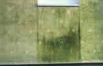

[🠔 Zur Übersicht: Wand & Fachwerk](29bau09.md)  
# Wärmespeicherung von Baustoffen
**Wärmespeicherung von Baustoffen - wichtig oder nicht? Wer speichert am schlechtesten?**  
_von Konrad Fischer • aktualisiert 01.01.2002_

 Altbautaugliche Verfahren und Baustoffe 

## Wandbildner [11]

Die Kapitel 9-10 wurden in folgende Unterkapitel aufgeteilt - **9. Natursteinrestaurierung** : [[1]](29bausto.md) [[2]](29bau02.md) [[3]](29bau03.md) [[4]](29bau04.md) [[5]](29bau05.md) [[6]](29bau06.md) 
**Steinboden** : [[7]](29bau07.md) 
**Reinigungstechnik** : [[8]](29bau08.md) 
**10. Wandbildner im Vergleich** : [[9]](29bau09.md) [[10]](29bau10.md) **[11]** [[12]](29bau12.md) [[13]](29bau13.md) [[14]](29bau14.md) [[15]](29bau15.md) 
**10.a Fachwerk/Blockbau** : [[16 - Die schärfsten Tipps zur Fachwerkrestaurierung: Woran erkennst Du einen Fachwerk-Experten?]](29bau16.md) [[17]](29bau17.md) [[18]](29bau18.md) [[19.1]](29bau19.md) [[19.2]](29bau192.md) 
**Bodenaufbau/Holzboden** : [[20]](29bau20.md)

## Wärmespeicherung von Baustoffen

Die für das praktische Bauen wesentliche Wärmespeicherfähigkeit von Baustoffen können wir mit den Zahlen der folgenden Tabelle beurteilen: 

**Stoff** **Wärmespeicherfähigkeit Q s in Wh/qmK 
für eine 10cm dicke und 1qm große Platte 
(nach Prof. Meier)** 
Wasser 

117

Stahl 

86,4

Glas 

70

Vollziegel 1800 

50,4

Hochlochziegel 1200 

33,6

Holz 

34,8

Polystyrol 

0,84

Luft 

0,035

Wie es mit der praktischen Temperaturleitung von angeblichen Dämmstoffen wirklich aussieht, zeigt dieses von Jedermann nachprüfbare [schreckliche Meßergebnis (Das Lichtenfelser Experiment)](2139bau.md#lichtenfelser experiment).

Für manche zählt auch der riesige Unterschied in den Brandversicherungsprämien zwischen Pappendeckelhäusern und Massivbauten. Daß die Kartonagenbude sowieso teurer und schadensanfälliger als der traditionelle Massivbau ist, dürfen inzwischen mehr und mehr verblendete Bauherren lernen. Da heißt es Augen aufreißen, wenn die Feuchte durch die Fugen pfeift und der [schwarz-grüne Algenschimmelbewuchs](213baust.md) vor sich hin wuchert. 

Den grünen Ökoheini und beschissenen Mieter erkennt man heutzutage sofort an seiner Fassade. So kann das einst weiße Grün über kurz oder gar nicht so lang aussehen: 

Schön, wie sich die besseren Speichereigenschaften der Dübel an der geringeren Vergrünung sofort punktgenau nachweisen lassen.

(Abbildung "Algenbefund auf der WDVS-Fassade" aus "[Forschung] Wärmedämmung; Zur EnEV: 1. Grünes Hinweisschild + 2. Schotten dicht" 
in: _[Bautenschutz+Bausanierung, Zeitschrift für Bauinstandhaltung und Denkmalpflege](http://www.bautenschutz-bausanierung.de)_ , Januar 2002, S. 44, Bildautor: Hochschule Wismar, Bildbearbeitung K.F.)

Einem Beitrag unter der Rubrik "Informationen" im Deutschen Architektenblatt 1/2000, S. 99, ist zu entnehmen:

**_"Wohnen ohne Thermoskannenklima_**

_[...] Der Bauschadensbericht der Bundesregierung stellt fest: "Hausbesitzer müssen für die Instandhaltung der Gebäude in 80 Jahren bei Mauerwerk ca. 10%, bei Holzbauweise ca. 50% der Herstellkosten ausgegeben._

_[...] Ein Holzfertighaus ist nicht in jedem Fall auch ein ökologisches Haus, denn ein solches Fertighaus hat meist lediglich einen Holzanteil von 15%. Alle anderen Bauteile sind mit chemischen Produktionsvorgängen hergestellte Elemente. Will man diese Elemente heute entsorgen, muss man sie als Sondermüll deklarieren."_

Wie hier: Schön gedämmt und in kürzester Zeit totalvermorscht ist bei nicht fachgerecht errichteten Holzständerbauten schnell geschafft, wie es auch dieses traurige Beispiel eines total danabengegeangenen Ökobioenergiesparallergikerhauses zeigt: [Holzhaus nach kurzer Standzeit verfault](http://www.nw-news.de/owl/kreis_herford/herford/herford/9162247_Holzhaus_nach_zehn_Jahren_verfault.html) 

Bauen ist nämlich eine große Kunst. Man verbindet dabei Werkstoffe unterschiedlichster physikalischer und chemischer Eigenschaften, von der Gestaltung mal abgesehen. Und alle Werkstoffe haben ihr Eigenleben, das beim Konstruieren sorgfältig bedacht werden muß. Daß muß der Planer erledigen. Der aber das nicht in ausreichender Detailtiefe gelernt hat und sich deswegen von sogenannten Sonderfachleuten helfen lassen muß. Doch nicht nur das. Hinter dem Rücken des Bauherrn zieht er auch gerne mal sogenannte Firmenberater als Helferlein bei. Nicht nur, um nach dem Empfang von Kostenlosplanung und dem damit automatisch folgenden manipulativen und verbotenen Begünstigen dieser Helferlein bei der Vergabe schöne Kickbacks zu genießen. Sondern, weil er sich fälschlicherweise darüber nicht im Klaren ist, daß diese Helferlein wie er auch nur schnödeste Eigeninteressen verfolgen und kein Interesse am großen Ganzen, geschweige denn dem Wohl des Bauherren haben, den lieben Gott einen guten Mann sein lassen und ansonsten Tag und Nacht nur dem Herren dieser Welt huldigen. Man könnte das als modernen Satanismus brandmarken. Und so entsteht eben Baupfusch allerorten, gepaart mit Kostenexplosionen, auch allerorten. Und jedem Kundigen und auch Laien mit einem kurzen Blick in das Leistungsverzeichnis sofort auffallen könnte: Dort stehen nämlich verbotenerweise Produkte, für Dummies verbotenerweise getarnt mit dem Pseudoneutralisierer: "oder gleichwertig". 

Wir müssen hier sorgfältig abwägen zwischen den Vor- und Nachteilen für das Bauwerk und seine Bewohner, die sich aus derartigen Surrogaten traditioneller Bautraditionen sowie den dahinter ebenfalls stehenden Vergabemanipulationen ergeben können. Auch die Verfälschung tradierter Baustoffe zählt hierzu. Leider unterstützen die Porosierer der deutschen Ziegelindustrie die gefälschte Bauphysik. Wirklichkeitsfremde k-Wert/U-Wert-Theorie, stationäres Denken, manipulierte Forschung und Betrug mit angeblichem Klimaschutz und erlogener Energieeinsparung charakterisieren diesen Anschlag auf Volkswirtschaft und Volksgesundheit.

Die deutschen Ziegler (oder besser "Porosierer"), die entgegen mancher Vermutung meine dämmstoffverachtenden Seiten ebensowenig wie andere hier benamste Produzenten _nicht_ sponsorieren (wo kämen wir denn da hin?), tanzen mit auf diesem Totentanz zu ihrer Vernichtung und führen bisweilen gar die Trommel. 

Der technische Geschäftsführer der Arbeitsgemeinschaft Mauerziegel, Michael Gierga, scheut sich nicht, in einem dreiseitigen Schreiben vom 25. Mai 2000 an einen Technischen Bauberater eines Ziegelwerkes abschließend mitzuteilen:

**_"Seit mehr als 5 Jahren arbeiten wir in der Arbeitsgemeinschaft Mauerziegel intensiv daran, die Ziegelphysik zu Grabe zu tragen, damit der Mauerziegel überleben kann."_**

Inzwischen entwickeln manche Ziegelproduzenten den Mauerziegel nur noch als kleberverbundenes schaumig-poriges Verpackungsmaterial für Luftlöcher, Schaumstoff bzw. Klebeunterlage für transzendente/transparente Wärmedämmung. Wieso eigentlich? Zur Schonung des Lehmressourcen? Nein: weil Sie von zentraler Stelle (Arbeitsgemeinschaft Mauerziegel-AMz-Bericht 5/97) mit ausgewählten Ergebnissen der aus diesem Bemühen entsprungenen Begräbnis-Gutachten versorgt werden, in denen z.B. das Fraunhofer-Institut Stuttgart folgende Meßergebnisse zur **Solarabsorption auf Außenwänden** produziert:

Wandelement Außenoberfläche 
Tab. 1 Temperaturbezogene 
Wärmestromdichte(W/m2K) 

Nr. Aufbau Farbe Struktur k-Wert W/m2K ohne Einstrahlung mit Einstrahlung 
1 

2

3

4

5

6

7

6 Leichtziegel 36,5 cm /Süd weiß rauh 0,50 0,60 +/- 0,03 0,59 +/- 0,03 
8 Leichtziegel 36,5 cm /Süd weiß glatt 0,50 0,59 +/- 0,03 0,59 +/- 0,03 
13 Leichtziegel 36,5 cm / Nord weiß rauh 0,50 0,55 +/- 0,03 0,55 +/- 0,03 

Prof. Dr.-Ing. habil. Claus Meier, der im Zusammenhang mit diesem hervorragenden Ergebnis deutscher Wissenschaft - Versuchsaufbau: "Messen" des Solareinflusses an der Innenwandoberfläche! - schon zweifach von der Mauerziegelindustrie mit Rechtsschritten bedroht wurde (Schreiben der Geschäftsführung vom 19.11.1997, der Hauptgeschäftsführung vom 2.12.1997 und vom 26.1.2000) kommentiert diese bauphysikalischen Wunder wie folgt (Schreiben an den Hauptgeschäftsführer der ARGE Mauerziegel vom 8.12.1997):

_"Diesen drei Zeilen [Nr. 6, 8, 13] können folgende "Erkenntnisse" entnommen werden:_

_1. Ein nach DIN 4108 für den stationären Fall (Beharrungszustand) gerechneter k-Wert von 0,50 W/m 2K (Spalte 5) wird unverständlicherweise auf 0,60, 0,59 und 0,55 W/m2K abgemindert (Spalte 6 "ohne Einstrahlung)._

_2. Gegenüber dem nach DIN 4108 errechneten k-Wert von 0,50 W/m 2K (Spalte 5) erzielt die Südwand einer weißen Ziegelwand "mit Einstrahlung" (Absorptionsgrad mit 0,15 angenommen) nur einen k-Wert von 0,60 bzw. 0,59 W/m2K (Spalte 7), also einen schlechteren k-Wert (Nr. 6 und 8). 
Damit würde Solarenergie ja sogar schädlich für die energetische Bilanz einer Außenwand sein._

_3. Eine weiße Ziegelwand liefert "mit Einstrahlung" (Spalte 7) und "ohne Einstrahlung" (Spalte 6)_gleiche_ k-Werte (Nr. 8 und 13). 
Bei der gewählten Forschungsmethode hat die Solarstrahlung hier also überhaupt keinen Einfluß auf das Minderungspotential._

_4. Der Tabelle kann auch entnommen werden, daß eine weiße "Nordwand ohne Einstrahlung" mit k = 0,55 W/m 2K (Nr. 13, Spalte 7) energetisch _günstiger_ ist, als eine "Südwand mit Einstrahlung" mit einem k-Wert von 0,59 W/m2K (Nr. 8, Spalte 6). 
Etwas Absurderes und Abstruseres als dies ist bis jetzt noch nicht verbreitet worden._

_[...] Es ist Ihr Problem, wie Sie Ihren Mitgliedern [der ARGE Mauerziegel], die ja durch Sie vertreten werden und die auch sicher Geldbeträge zu diesen Forschungsarbeiten beigesteuert haben, diesen Unsinn klarmachen und begründen wollen. [...]_

_Generell kann gesagt werden, daß die mit dieser Aktion verbreiteten Solargewinne viel zu gering sind; praktische Erfahrungen bestätigen dies._

_Es bleibt Ihnen überlassen, wie Sie diese eindeutigen Fakten bewerten und die dadurch hervorgerufene energetische Benachteiligung einer schweren Wand vielleicht nun sogar als "Sieg für die Ziegelindustrie" umdeuten. [...]"_

Merke: 

Nur die allerdümmsten Kälber wählen ihren Metzger selber. Ein Prof. G. fungiert als "der" geladene Honorardauergast auf Zieglerforen. Daß in manchen Abteilungen des Fraunhofer Instituts babylonischste Sonnenfinsternis herrscht, oder gar die berühmte "schwarze" Sonne scheinen muß, ist nach derartigen Forschungsergebnissen jedenfalls nicht mehr ganz auszuschließen.

Und so liest man in einem redaktionell aufgemachten Marketingartikel für die porosierte Schaumschlägerei in traurige Wahrheiten verpackte Bauintelligenz:

bau-zeitung Nr. 53, (1999) 9

_Dipl.-Ing. Bernhard Schlötzer, München: "Niedrigenergiehäuser - eine Herausforderung für den Planer"_

_[...] Nachträglich durch zusätzliche Dämmmaßnahmen ein Niedrigenergiehaus "hinzurechnen", ist unwirtschaftlich. [...]_

_Massive Ziegelhäuser nutzen optimal alle Wärmegewinne aus solarer Einstrahlung und hausinternen Wärmequellen (Kamin, elektrische Geräte). Ihre Wärmespeichermassen nehmen überschüssige Wärme vorübergehend aus und geben sie, wenn es kühler wird, wie ein Kachelofen an den Raum zurück. Untersuchungen von Prof. Werner, Bauphysik-Energieberatung im Hochbau (veröffentlicht in: Parameterstudie über energetische Einflußgrößen auf den Heizenergiebedarf von Gebäuden ...") belegen Einsparungen von ca. 10%. In der künftigen Energiesparverordnung dürfen diese Einflüsse rechnerisch angesetzt werden. [...]_

_Wenn heute viele Fertighaushersteller diese_[schnell verkeimenden und Sick-Building-Syndrom-fördernden bzw. wohngiftanreichernden Lüftungs-(Anm. KF)] _Anlagen serienmäßig oder als Extra anbieten, beruht dies nicht auf besonderer Kundenfreundlichkeit, sondern auf der Notwendigkeit, muffiges Raumklime und Schimmelbildung in dieser stärker gefährdeten Bauweise zu vermeiden. [...]_

_Als Außenwände [für Niedrigenergiehäuser] kommen einschalige Ziegelaußenwände ohne und mit Zusatzdämmung in Frage._

_[...] Zur Verbesserung der Feuerwiderstandsdauer empfiehlt sich, nichtbrennbare Wärmedämmverbundsysteme zu verwenden. [...]_

**_Was bringt die EnEV 2000?_**

_Um die Jahrtausendwende ist mit einer Verschärfung der Anforderungen an den Wärmeschutz zu rechnen. Zusätzlich steigt die Anzahl der in die Energiebilanz eingehenden Parameter. [...] Der Wärmeschutznachweis wird somit wesentlich realistischer. [...]"_

Kommentar: 

Ausgerechnet den Prof. Werner, der die DIN 4108-2 "Wärmeschutz und Energieeinsparung in Gebäuden" zu neuen Gipfeln der Bauintelligenz deformiert hat, führt der Autor dieses Propagandaartikels für die [EnEV](enev.md) als Garant an. Lesen Sie hierzu den denkwürdigen und sachlich immer noch zutreffenden [Einspruch Prof. Meiers gegen die neue Normfassung,](7d4108kf.md) die unvergeßlichen [Einsprüche der Architektenkammern Rheinland-Pfalz und Hessen](7enevrlp.md) sowie [der Bundesarchitektenkammer gegen die erste EnEV](7enevbak.md). Nicht vergessen: Unsere [Petitionen gegen diese EnEV](enev.md). Dann bekommen Sie zumindest eine kleine Vorstellung von den Erkenntnissen des Diplomingenieurs Schlötzer. Und warum auch heute (2017) noch immer rein gar nix stimmt, was auf Basis der gültigen "Parameter" berechnet wird. 

Wenn man den Einspruch des Bundesverbandes der Deutschen Ziegelindustrie e.V. gegen die DIN 4108-2 vom 29.9.1999 - ein Tag vor Ende der Einspruchsfrist eine einseitige Tabelle mit vier redaktionellen Ergänzungsvorschlägen (z.B. _"letzter Satz ändern: "Es gelten die** _Maueröffnungsmaße_** ""_) - kennt, stellen sich doch recht verblüffende Fragen. Das mag verstehen, wer will. Porenziegel mit WDVS, neuerdings auch mit Dämmstoffauffüllung / Dämmstoffverpressung - wenn das der Ziegelbranche Weisheit letzter Schluß ist, gönnt man ihnen den Markterfolg von styrolisierten Kalksandstein- und Pappkartonbuden von ganzem Herzen. Nicht nur als Waldbesitzer.

Den Gipfel falschen Marketings beschreibt dann Ernst K. Jung, Geschäftsführer der JUWÖ POROTON-WERKE, in seinem Brief an unseren Mitstreiter Dipl.-Ing. Architekt Paul Bossert vom 26.6.01:

_"Sehr geehrter Herr Bossert,_

_über unser Gespräch vom 13.06.01 habe ich die Geschäftsführer und Vorstände der Arbeitsgemeinschaft Mauerziegel informiert, insbesondere auch darüber, wie Sie beabsichtigen, die EnEV noch in letzter Minute zu kippen._

_Leider muss ich Ihnen mitteilen, dass man Ihrer Argumentation, vor allem auch der empirischen Beweisführung, nicht folgen will, weil uns auch der zu erwartende Imageverlust für die Branche nicht kalkulierbar erscheint._

_Mit freundlichem Gruß_

_(Unterschrift) 
Ernst K. Jungk"_

Bossert hat nämlich mit seinen langjährigen Energieverbrauchsanalysen auch 2001 an vielen teuer "sanierten" Häusern wieder nachgewiesen, daß die k-Wert-orientierten Dämmverpackungen keine Heizenergie sparen. Auch der [Professor und ö.b.u.v.Gerichtssachverständige Jens Fehrenberg hat dies sehr umfänglich nachgewiesen](7fehrtab.md). Peinlich für die Garde der Schaum- und Porenschläger. Sogar im fernen Finnland ist man schon auf der richtigen Spur: [Impact of the Exterior Wall Structure on the Energy Efficiency of Building](http://www.kolumbus.fi/finnmappartners/rym/eng/ttkk.htm)

Drücken Sie die Stirn des Affen...

 [Weiter? Hier!](29bau12.md)
