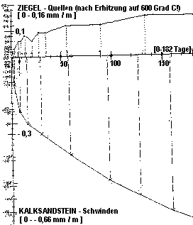

[🠔 Zur Übersicht: Wand & Fachwerk](29bau09.md)  
# Restaurierung Naturstein und Fachwerk, Wandbaustoffe im Altbau ...
**Altbautaugliche Verfahren und Baustoffe Kapitel 9+10: Natursteinrestaurierung, Wandbildner und Fachwerkinstandsetzung [12]. Holz oder Stein, und wenn ja, welcher?**  
_von Konrad Fischer_

 Altbautaugliche Verfahren und Baustoffe 

## Wandbildner [12]

Die Kapitel 9-10 wurden in folgende Unterkapitel aufgeteilt - **9. Natursteinrestaurierung** : [[1]](29bausto.md) [[2]](29bau02.md) [[3]](29bau03.md) [[4]](29bau04.md) [[5]](29bau05.md) [[6]](29bau06.md) 
**Steinboden** : [[7]](29bau07.md) 
**Reinigungstechnik** : [[8]](29bau08.md) 
**10. Wandbildner im Vergleich** : [[9]](29bau09.md) [[10]](29bau10.md) [[11]](29bau11.md) **[12]** [[13]](29bau13.md) [[14]](29bau14.md) [[15]](29bau15.md) 
**10.a Fachwerk/Blockbau** : [[16 - Die schärfsten Tipps zur Fachwerkrestaurierung: Woran erkennst Du einen Fachwerk-Experten?]](29bau16.md) [[17]](29bau17.md) [[18]](29bau18.md) [[19.1]](29bau19.md) [[19.2]](29bau192.md) 
**Bodenaufbau/Holzboden** : [[20]](29bau20.md) 

## Holz oder Stein?

Dem Bauschadensbericht der Bundesregierung ist zu entnehmen: 

 **Konstruktion** **Instandhaltungskosten in 80 Jahren 
in Prozent der Herstellkosten** 
Holzbauweise ca. 50 % 
Mauerwerk massiv ca. 10 % 

Außerdem sollte man wissen, daß ein Holzfertighaus meist nur ca. 15% Holzanteil hat. Die chemikalisierten Restbaustoffe von ca. 85 % müssen im Entsorgungsfall als Sondermüll behandelt werden. Ein prima Wohnumfeld neben Schimmel und anderen Atemluftverbesserer wie Milben und die unter VOC bekannten Luftschadstoffe aus Baustoffausgasungen. Viel Spaß beim Immunisieren. Nur hoffnungslose Traditionalisten setzen ja noch auf klassische Ziegel und Kalk.

**[Diskussion zur EnEV - Position des Bundesverbandes der Deutschen Ziegelindustrie e.V., mit Link zum allgemeinen Forum und zur Position der Porosierer](http://www.gre-online.de/EnEV/forum/06ziegel.htm)**

Zur bautechnischen Folge der Porosiererei am Ziegelstein schreibt z.B. Dipl.-Ing. Erwin Gierlinger in "Stein-Putz-Risse auf Mauerwerk", Bauhandwerk/Bausanierung 6/99 (Auszüge):

_"Die guten handwerklichen Erfahrungen mit verputztem Ziegelmauerwerk bezogen sich lange auf das früher vorwiegend verwendete kleinformatige Voll- und Hochlochziegelmauerwerk. Diese Mauerziegel waren durch Rohdichten zwischen 1,2 kg/dm 3 und Wärmeleitzahlen im Bereich von 0,7 bis 0,5 W/m2K gekennzeichnet. Gestiegene Anforderungen an den Wärmeschutz _[in Wahrheit die falsche [k-Wert-Theorie](7wdvs05.md), Erg. K.F.] _und der Zwang zur Rationalisierung führten zu leichteren und großformatigen Mauersteinen und maschinenverarbeitbaren Putzmörteln. Mauerstein- und Putzmörtelhersteller sowie die Verarbeiter haben leider die notwendige Anpassung der handwerklichen Regeln an die veränderten Baustoffe nicht frühzeitig gemeinsam entwickelt und zudem die letztlich erst aus Schadensfällen gewonnenen Erkenntnisse nur langsam umgesetzt. [...]_

Die generelle Ursache für Stein-Putz-Risse ist das unmittelbare Zusammenwirken von Putz und Untergrund während des Schwindens des Putzmörtels. [...]

Bei der Ursachenermittlung von Stein-Putz-Rissen wird immer wieder über das mögliche chemische Quellen von Ziegeleierzeugnissen diskutiert. Diese durchlaufen bekanntermaßen einen Brennprozeß bei etwa 1000oC. Dabei verlieren sie sowohl Restfeuchte als auch chemisch gebundenes Wasser. Mit dem Erkalten des Materials baut sich unter üblichen Klimabedingungen eine Ausgleichsfeuchte auf, und dieser Vorgang kann - je nach Rohstoff und Brennbedingungen - mit geringfügigem Quellen der Ziegel verbunden sein. Doch laufen diese Vorgänge innerhalb von Stunden, allerhöchstens 2 bis 3 Tagen im Ziegel ab, und sie sind unumkehrbar. Für die Verarbeitung zu Mauerwerk und das anschließende Putzen sind sie also ohne Bedeutung. [...]

Die Schwindverformung ist für die Rißgefahr die maßgebendste Eigenschaft der Putzmörtel. Als Schwinden wird die Volumenverminderung des Mörtels bei Austrocknung und Erhärtung bezeichnet. Wenn die Wassermoleküle zwischen den Feststoffmolekülen verdunsten, können sich letztere dichter aneinander anlagern, und das Volumen wird insgesamt kleiner. Bei systematischen Untersuchungen der Schwindverformung von Mörteln bei 28 Tagen und 90 Tagen Luftlagerung hat sich herausgestellt, daß Leichtmörtel die höchsten Schwindwerte haben. Die leichten Zuschlagswerte können kein abstützendes Korngerüst aufbauen und dem Verkürzungsbestreben des Bindemittels dadurch keinen Widerstand entgegensetzen. Betroffen hiervon waren vor allem wasserabweisend eingestellte Putzmörtel mit langsamer Austrocknung und dadurch verzögertem Schwinden. Die Forderung, daß Leichtputze wasserabweisend sein müssen, ist hinsichtlich Austrocknung und Rißgefahr nachteilig. [...]

Die Saugfähigkeit des Untergrunds ist ein weiterer, oft unterschätzter, maßgebender Einfluß auf die Entwicklung der Putzeigenschaften und damit auch auf die Rißgefahr. [...] Wird überschüssiges Wasser rechtzeitig abgesaugt (in den ersten Stunden der Erhärtung), beschleunigt sich die Festigkeitsentwicklung. Auf die Endfestigkeit hat die unterschiedliche Saugfähigkeit dagegen einen geringen Einfluß. Die aus den Saugfähigkeitsunterschieden des Untergrundes in der Erhärtungs- und Schwindphase bewirkten Festigkeitsunterschiede des Putzes und die Feuchteverteilung sind Hauptgründe für die bevorzugte Entstehung von Putzschwindrissen über Mauerwerksfugen.

Feuchte Putzmörtel haben zudem eine deutlich geringere Druckfestigkeit und dementsprechend ebenfalls verringerte Zugfestigkeit. In den ersten Stunden liegen damit über den Fugen so ungünstige Festigkeitsverhältnisse vor, daß in dieser Zeit, in der die Entwicklung der gleichmäßig verteilten Schwindspannungen verstärkt einsetzt, Risse zumindest in Form von Gefügestörungen bevorzugt an dieser schwächeren Stelle entstehen.

In einem aufgerauhten oder abgezogenen Unterputz sind derart feine Risse nicht zu erkennen. Sie öffnen sich erst bei weiterer Austrocknung und dem dadurch bewirkten Restschwinden, im ungünstigsten Fall nach Auftrag des Oberputzes. Die oft vorgetragene Feststellung, daß Risse erst nach der ersten Heizperiode aufgetreten seien, ist so zu erklären. [...]

Erfolgversprechend ist es, durch weiche und schnell trocknende Putze (wenig Wasserabweisung) dafür zu sorgen, daß die Schwindverformung und die Zugspannungen entweder durch Relaxation (Spannungsabbau durch Mikrorißbildung) oder durch Rißbildung abgebaut sind, bevor der dünne und dadurch in sich nicht rißgefährdete Oberputz aufgetragen wird. [...]

Einen erheblichen Einfluß auf die Konzentration von Schwindrissen über den Mauerwerksfugen haben auch die geometrischen Verhältnisse an den Fugen. Ein Versatz von beispielsweise 5 mm zwischen benachbarten Steinen bedeutet bei einem 20 mm dicken Putz bereits eine Querschnittsänderung um 25%. Die dadurch bedingten Sprünge im Querschnitt können allein wegen ihrer Kerbwirkung dazu führen, daß die normalen Schwindspannungen an diesen Stellen Risse auslösen. [...]"

Baustoff light korrespondiert meistens mit Haltbarkeit light. 

Holzauge, sei wachsam und lies beispielsweise nach im DAB 2/99, Schadensberichte von Helmut Künzel!

Auszüge: 

_"Die Querdruckfestigkeit in Längsrichtung beträgt bei porosierten Leichtziegeln im Mittel nur 20% der Normaldruckfestigkeit. Hinzu kommt, daß der Leichtmauermörtel zusätzlich noch eine größere Verformung ermöglicht (kleinerer Querdehnungsmodul als bei Normalmörtel). [...]_

Durch den Fenstersturz werden die Kräfte auf die Wandbereiche seitlich der Fenster konzentriert und im Bereich der Fensterbrüstung gibt es wieder eine Kraftumlenkung. Dadurch entstehen Querkräfte in der Ebene der Wandfläche. Aber auch senkrecht zur Wand entstehen Querkräfte, wenn die auf den Wänden exzentrisch aufliegende Betondecke beim Trocknen schwindet. Wenn die dadurch entstehenden Kräfte von der Wand nicht aufgenommen werden können, entstehen Risse." [...]

"die Risse (sind) erst nach etwa zwei Jahren im Verlauf der Trocknung in Erscheinung getreten." [...]

"Zwar ist der hier verwendete Außenputz ein Leichtputz mit Styroporzusatz, aber viel zu hart. Die Härte entspricht nach Messungen an einer entnommenen Probe etwa der eines normalen P II-Putzes. Zusammenfassend: Der Schaden ist auf die geringe Querschubfestigkeit des [porosierten] Mauerwerks in Verbindung mit einem ungeeigneten, zu harten Außenputz zurückzuführen."

[...] das größere Steinformat, die in Verbindung mit Leichtmauermörtel gegebene "Beweglichkeit" und die geringe Querfestigkeit sind Fakten, wodurch sich das moderne [rißanfällige] Ziegelmauerwerk vom altbewährten Mauerwerk füherer Zeiten unterscheidet.

[...] infolge Schwindens bei zementgebundenen Blocksteinen oder infolge der erläuterten geringeren Querfestigkeit bei Leichtziegelblöcken (können) Formänderungen bzw. Spannungen vom Putzgrund her auf das Putzsystem einwirken.

[...] Die aus dem Jahr 1985 stammende Putznorm ist veraltet und gibt hierzu keine Hinweise."

Und aus dem nächsten Mauerrißschaden:

_"In beiden Fällen waren aber die Putzoberflächen mit Dispersionsanstrichen behandelt worden. Das bei Regen an der gestrichenen Fassade ablaufende Wasser konnte über die Risse verstärkt eindringen und sich im saugfähigen Mauerwerk verteilen. Die Trocknung war hingegen durch den wasserabweisenden Putz und Anstrich stark unterbunden. Die Mauerfeuchte hat sich bis zur Sättigung aufgeschaukelt, wodurch vor allem bei dem exponierten Gebäude Fall 2 Frostschäden aufgetreten sind._

[...] Dieser Schaden ist grundsätzlicher Art und hängt nicht mit dem gewählten Steinmaterial - Ziegel oder Kalksandstein - zusammen. Es mag sein, daß im Fall 1 das Schwinden des Kalksandsteins noch eine zusätzliche "Bewegung" in die Mauerschale eingebracht hat, weshalb sich das Rißbild nach zweieinhalb Jahren verstärkt gezeigt hat."

Zum Fall 1 gönnen wir uns etwas weitere Aufklärung:

Aus den Untersuchungwerten am Institut für Bauforschung an der RWTH Aachen erhalten wir nachfolgende Grafik, die das Verformungsverhalten des Ziegels (Quellen, positiver Graph) dem des Kalksandsteins (Schwinden, negativer Graph) gegenüberstellt.

Dabei wurde (gar um den Ziegel zu benachteiligen?) der Ziegel vor der Messung auf 600o C erhitzt. Sonst wäre wahrscheinlich bei ihm 0 + Nix "gequollen". 

Aber auch so ist das Ergebnis eindeutig. Schade, daß schon nach 182 Tagen abgebrochen wurde. Die weitere KS-Kurve wäre spannend gewesen.

Frage: Welcher Stein ist im Mauerwerk rißanfälliger, der sich viel oder der sich weniger verformt? Na eben!!

Interessant ist auch folgende Tabelle:

**Verformungswerte für Kriechen, Schwinden und Temperaturänderungen 
Rechenwerte nach DIN 1053**

**STEINART** 

**Endkriechzahl 
**Steinfestigkeitsklasse 
2-6

**Endkriechzahl 
**Steinfestigkeitsklasse 
12-60

Endwert der 
**Feuchtedehnung 
**(Schwinden, 
chem. Quellen) 
mm / m

**Wärme- 
dehnungs 
koeffizient 
**10-6 / K

**Mauerziegel 
(unporosiert)** 

0,75

0,75

0

6

**Kalksand-, 
Gasbetonstein** 

2,0

1,5

-0,2

8

**Beton- u. 
Leichtbetonstein** 

2,0

1,5

-0,2 
(-0,4 bei 
Naturbims)

10 
(8 bei 
Blähbeton)

In "Wie verputzt man Leichtziegel-Mauerwerk?", DAB 8/2000, legt Helmut Künzel noch nach und schreibt:

_"Das Verputzen von Ziegelmauerwerk war früher kein Problem im Gegensatz zu Mauerwerk aus großformatigen Leichtbeton- oder Porenbetonsteinen. Wenn sich Stoß- und Lagerfugen im Putz durch Risse abgezeichnet haben, dann konnte man dies auf das Schwinden dieser Materialien zurückführen. Ziegel schwindet aber nicht und ermöglicht infolge seiner Saugfähigkeit eine gute Putzhaftung._

Deshalb war man umso mehr verwundert, als mit der Verwendung von großformatigen, porosierten Lochziegeln ebenfalls [fugenfolgende] Putzrisse auftraten. Die Ziegelhersteller wollten nicht wahrhaben, dass die immer filigraner gewordenen Ziegel die Ursache sind und schoben die Schuld auf die Putzhersteller oder -ausführenden.

Kommentar KF: Eine sehr vornehme Umschreibung der gewissenlosen Machenschaften der Produzenten von Murksbaustoffen. Wieviel Leid hat diese Verweigerungshaltung über Handwerker, Bauherrn und Planer gebracht!

_... das heutige Leichtmauerwerk [aus Leichtbeton, Porenbeton oder Leichtziegel], aufgemauert mit Leichtmörtel, besitzt nicht mehr die Stabilität wie das frühere Mauerwerk aus kleinformatigen Vollsteinen, bei dem nur Temperatur- und Feuchteeinwirkungen vom Außenklima her als Beanspruchung auftreten. ..._

Bei Leichtmauerwerk sind aber zusätzlich auch gewisse Bewegungen vom Mauerwerk her zu berücksichtigen... Die Ursachen der "Instabilität" oder "Beweglichkeit", die vom Mauerwerk her Formänderungen bzw. Spannungen auf den Putz übertragen können, sind bei den verschiedenen Arten von Leichtmauerwerk unterschiedlich:

- Bei Leicht - und Porenbeton ist es das Schwinden...

- Bei porosierten Leichtziegeln ist es die Anisotropie der Steine, d.h. die unterschiedliche Festigkeit in Richtung der normalen Tragbelastung und senkrecht dazu.

**Folgen der Anisotropie**

Die heutigen, großformatigen Leichtziegel sind auf die erforderliche Tragfähigkeit und Standsicherheit für tragende Wände ausgerichtet, haben aber zur gleichzeitigen Erzielung einer hohen Wärmedämmung infolge der Lochung eine deutlich geringere Querdruckfestigkeit. Je nach Fabrikat und Lochanordnung kann die Querdruckfestigkeit nur 5% bis 40% der Normaldruckfestigkeit betragen. Die Verwendung von Leichtmauermörtel oder der Verzicht auf Stoßfugenvermörtelung mindern die "Querstabilität" der Wand. Infolge von Querkräften können Mauerrisse entstehen, die sich auf den Außenputz übertragen...

Solche Querkräfte treten bei jeder Maueröffnung (Fenster, Türen) auf oder infolge von Deckenschub bzw. -zug. Wenn eine Betondecke im Verlauf der Trocknung schwindet, dann können Mauer- und Putzrisse auftreten ... [Im gezeigten Beispiel] wurden die Risse erst etwa zwei Jahre nach der Bauerstellung festgestellt, bedingt durch das langsame Schwinden der Decke im Laufe der Bautrocknung.

Die von Künzel in diesem Aufsatz auch empfohlenen Leichtputze zur Vermeidung der Rissbildung haben es aber in sich und sind nur wenig geeignet, diese Schäden zuverlässig abzustellen: Sie sind bindemittelreich und haben nur kleine Körnung. Die Überfestigkeit gegenüber dem schwächelnden Putzgrund ist dadurch vorprogrammiert. Ihre Porenbildner mögen labortauglich sein, auf den Baustellen zählen mehr die Versagensfälle. Das gegenseitige Rausgerede der Stein- und Putzproduzenten im Schadensfall ist ein Affentheater, das sich Baupraktiker und streitvermeidende Bauherrn sparen können. Keine Murksbaustoffe auf unseren Baustellen! 

Die diesbezüglich jüngste Verirrung sind die Plansteine. Sie werden mit sehr exakten Baumaßen hergestellt und sollen nur zusammengeklebt werden. Mit Hilfe eines zeitsparenden "Mörtelschlittens" Genialer Irrsinn: Weichsteinriesen mit millimetrigem Hartklebemörtel zusammengefügt. Folge: Regenwassereinpumpende Kapillar-Fugenrisse zuhauf, auch durch den Verputz. Das ist eben die Praxis am Bau. Man bekommt fast den Verdacht, daß die Produktentwickler von arbeitslosen Juristen bestochen werden, um die Baubranche und die geplagten Bauherrn vor Gericht aufeinander zu hetzen. 

Nun bietet die geniale Trockenmörtelbranche und das noch genialere Baustoffgeschick der Verputzer keinerlei Putz, trotz aller Normübererfüllung, das dem Luftlochziegel (geschweige denn den synthetischen, noch bewegungsfreudigeren Dämmstoffen) gewachsen ist. Deswegen windet sich das brave Handwerk nun aus der Verantwortung für die voraussehbaren rissigen Bauschäden, die man eben nur dem Bauherrn gönnt, mit solchen (sicherheitshalber von mir anonymisierten) Schreiben:

_"Landesverband ...ischer Bauinnungen, Geschäftsstelle (Adresse, Briefkopf) 27.08.2001_

**_Putzschäden bei Leichtziegelmauerwerk_**

_Sehr geehrte Damen und Herren, verehrte Mitgliedsfirmen,_

_in letzter Zeit häufen sich bei uns die Beschwerden wegen der Probleme, die Leichtziegel im Zusammenwirken mit dem Putz erzeugen. Damit Sie als Putzunternehmen in Zukunft keine Probleme haben, empfehlen wir Ihnen, bei einem entsprechend vorliegenden Sachverhalt das beiliegende Schreiben an die Bauherrschaft zu senden. Sie befreien sich mit einem solchen Schreiben dann aus der Haftung._

_Mit freundlichen Grüßen_

_"Hans Wurst" 
Rechtsanwalt _

---

_An die Bauherrschaft ……. Datum_

_Betreff: Ihr Bauvorhaben …….._

_Sehr geehrte Bauherrschaft,_

_für Ihr Bauvorhaben ist die Verwendung von so genannten Leichtziegeln vorgeschrieben. Die Verwendung dieser Ziegel bedeutet für uns Probleme bei der Anbringung des Putzes. Diese Ziegel und unser Putz haben verschiedene Ausdehnungskoeffizienten. Es ist deshalb die Gefahr von Rissebildungen gegeben. Wir melden deswegen Bedenken an und bitten um Anweisung, welche Art von Putz wir auf welche Weise anbringen sollen._

_Mit freundlichen Grüßen_

Das hat man nun davon als braver Bauherr, der das Weltklima auf behördliche Anweisung und dank äußerstem Planergeschick mit seiner Hauswand auf eigene Kosten retten will. Wo ist unsere Fähigkeit zum zivilen Ungehorsam gegen die Abzockmaschinerie, die Politik, Industrie und die mächtigen Medien gegen uns mittels Ökosteuer, Erneuerbare Energien Gesetz und Energieeinsparverordnung angeworfen haben?

Und so mixen die schlauen Planer/Ingenieure immer weiter die dafür ungeeignetsten Baustoffe miteinander in einen Konstruktions-"Verbund", der schon temperaturhalber bald auseinanderreißen muß. 

Praktisch für die Folgeaufträge der Baubranche, für den Bauherrn wieder einmal dumm gelaufen.

Lesen wir doch noch mal nach, was in den frühen 70ern noch brauchbarer Stand der Bautechnik, der Bauforschung und des verbürgten Wissens war: 

Aus Heinrich Schmitt "Hochbaukonstruktion" 5. Auflage, Bertelsmann, 1974, S. 395 ff.: 

_"Mauerwerksbau 
Daß sich in den letzten zehn Jahren auch das Ziegel- und Kalksandstein-Mauerwerk auf dem Gebiet des Hochhausbaues - bis zu 16 Stockwerken - noch behaupten konnte, ist ein eindrucksvoller Erfolg der Oualitätssteigerung, der verfeinerten Berechnungsmethoden („Ingenieurmäßiger Mauerwerksbau"] und einer sinnvoll, von der Konstruktion her geleiteten Entwurfs- und Ausführungsplanung. Die entscheidenden Forschungen und Versuche gingen von der Schweiz aus. Dort wurden die ersten Wohnhochhäuser in Ziegelmauerwerk errichtet. 

Ziegelmauerwerk 

ln umfangreichen Versuchen an geschoßhohen Pfeilern und Wänden hat man das Verhalten von Backsteinmauerwerk unter schärfsten Bedingungen studiert. Die wesentlichen Ergebnisse dieser Schweizer Versuche waren folgende: Bei zentrischem Druck dehnen sich die Mauersteine und der Mörtel quer zur Normalspannung, d. h. also senkrecht zur Kraftwirkung aus. Wegen der Haft- und Reibungskrafte müssen sich Steine und Mörtel in gleichem Maße querdehnen. Durch die leichtere Dehnbarkeit (Querdehnung) des weichen Mörtels entstehen Zugspannungen senkrecht zur Kraftwirkung in den Steinen, die schließlich die Bindersteine über den Stoßfugen autspalten. Die Mauersteine werden also nicht durch die Druckkräfte zerstört, sondern zuvor durch die in ihnen auftretenden Zugspannungen aufgespalten. Der Mauerkörper zerlegt sich in mehrere Säulen. Es zeigte sich, daß zu dicke Lager- und Stoßfugen die Querzugspannungen steigern. 

Errichtet man einen Mauerkörper jedoch mit zu wenig Fugenmörtel, so wird je nach der größeren oder geringeren Unebenheit der Lagerflächen die Gesamtlast nur über mehrere oder wenigere Punkte verteilt übertragen_ [KF: wie im "modernen" Mauerwerksbau mit miesen Porensteinen, egal, ob mit oder ohne Dämmverstopfung]. _Die auf diese Weise ausgelösten Zugspannungen lassen die Steine schneller aufreißen als beim Vorhandensein ausreichender Mörtelfugen. 

Ist die Lagerfläche der Steine stark durch Löcher vermindert, so reißen sie entsprechend schneller. Für die Tragfähigkeit abträglich erweisen sich ferner unregelmäßige Ouerschnittsformen und Verdrehungen, die entweder größere Ausbiegungen, örtliche Exzentrizitäten oder Spannungskonzentrationen ergaben. Bei hohen und dünnen Wänden (1/2-Stein stark) bewegt sich während des Aufmauerns der obere Teil hin und her (Wackeleffekt). Besonders bei stark saugenden Steinen verliert der Mörtel rasch an Plastizität und wird nach den Rändern abgewalzt. Bei zentrischer Belastung ergeben sich hierdurch Spannungskonzentrationen in der Wandmitte, bei exzentrischer Belastung ist mit einer größeren Ausbiegung des Mauerkörpers und einem entsprechenden Abfall der Tragfähigkeit zu rechnen. 
Der Wasserentzug läßt sich nicht ohne Nachteil für die Druckfestigkeit des Mauerkörpers durch Annässen der Steine ersetzen. Die Mauersteine dürfen nur wenig Wasser aufnehmen. Ein harter und druckfester Mörtel wird unter der Belastung weniger zusammengepreßt, und seine Querdehnung ist geringer, so daß sich für die Bindersteine auch geringere Zugspannungen ergeben. 

Nach Hart, „Der Mauerziegel“ sind bei der Planung von Hochbauten in reiner Ziegelbauweise von 6 Geschossen aufwärts folgende Gesichtspunkte zu beachten: 

- Die Grundrisse sämtlicher Geschosse müssen deckungsgleich sein. 
- Der Grundriß soll so geplant sein, daß die tragenden und aussteifenden Wände möglichst quadratische oder annähernd quadratische Räume umschließen, so daß sich Deckenlasten und Windkräfte möglichst gleichmäßig auf das Wandgefüge verteilen. 
- Sämtliche Raum- und Mauermaße sowie die Geschoßhöhen sind nach der Maßordnung bzw. nach dem Ziegelformat zu planen. Der regelrechte Verband sollte in Schichtplänen festgelegt werden. 
- Sämtliche Aussparungen und Schlitze für Installation müssen eingeplant und hinsichtlich ihres Einflusses auf die Standsicherheit geprüft werden. Nachträgliche Stemmarbeiten sind unzulässig. 
- Ein statischer Nachweis ist in jedem Fall erforderlich. 

Bei der Bauausführung ist zu beachten: 
- Die Druckfestigkeit der Mauerziegel und des Mörtels ist laufend zu überprüfen. 
- Die aussteifenden Ouerwande müssen gleichzeitig mit den belasteten Wänden hochgeführt werden. Die in DIN 1053/2.21 vorgesehenen Erleichterungen sollen nicht in Anspruch genommen werden. 
- An die Qualität der handwerklichen Ausführung, vor allem hinsichtlich der Maßgenauigkeit, sind höchste Anforderungen zu stellen."_ 

Was man in der Schweiz wagte (ja, das Abenteurertum der Eidgenossen ist ja geradezu sprichwörtlich): Man führte die Außenwände des 16-Geschossers überwiegend in 50 Zentimer dickem Vollsteinmauerwerk aus Kalksandsteinen aus. Heinrich Schmitt führt dazu aus: 

_"Wegen der geringeren Wärmedämmung muß man die Außenwandstärken größer als bei den gebrannten Hochlochziegeln nehmen, was wieder den Material- und Arbeitsaufwand und den Brutto-Rauminhalt (umbauten Raum) erhöht. Der höhere Materialaufwand bringt aber gerade im Wohnungsbau wiederum Vorteile. Das höhere Gewicht und die größere Masse von Außen- und Innenwänden bieten einen besseren Schallschutz und eine höhere Wärmespeicherkapazität. Bei aller Rationalisierung im Baubetrieb erforderte dies die Rückkehr zu starkwandigeren Bauten früherer Zeiten, welche - mäßige Fenstergrößen vorausgesetzt - sich insbesondere durch angenehm kühle Räume im Sommer auszeichneten."_ 

Aus den 1940er bis 1960er Jahren sind uns eine Unmenge Wohnbauten mit nur 24 Zentimeter Außenwandstärke erhalten geblieben. Ziegelstein! Und aus Villingen kenne ich ein von einem Energieberater geprüftes Wohnbauwerk mit nur ca. 10,4 Liter Heizölverbrauch je Quadratmeter im Jahr (mit der Deppenformel für den "Energiebedarf" übrigens auf über 15 Liter hochgepuscht). Ja, ich weiß, das klingt alles nach Mittelalter! Na und? Ich liebe Gregorianische Choräle, Sie etwa nicht? Na denn, und jetzt Alle: "Humba, humba, humba, täterä, täterä, täterä!" 

[Weiter? Hier!](29bau13.md)
