[🠔 Zur Übersicht: Wand & Fachwerk](29bau09.md)  
# Temperaturdehnung / Linearer Ausdehnungskoeffizient von Baustoffen
**Tabelle zur Temperaturdehnung von Baustoffen bei Temperaturveränderung, wie beim Aufheizen der Fassade durch Sonneneinstrahlung. Analyse von Bewegungsdifferenzen und Schäden.**  
_von Konrad Fischer_

 Altbautaugliche Verfahren und Baustoffe 

## Wandbildner [13]

Die Kapitel 9-10 wurden in folgende Unterkapitel aufgeteilt - **9. Natursteinrestaurierung** : [[1]](29bausto.md) [[2]](29bau02.md) [[3]](29bau03.md) [[4]](29bau04.md) [[5]](29bau05.md) [[6]](29bau06.md) 
**Steinboden** : [[7]](29bau07.md) 
**Reinigungstechnik** : [[8]](29bau08.md) 
**10. Wandbildner im Vergleich** : [[9]](29bau09.md) [[10]](29bau10.md) [[11]](29bau11.md) [[12]](29bau12.md) **[13]** [[14]](29bau14.md) [[15]](29bau15.md) 
**10.a Fachwerk/Blockbau** : [[16 - Die schärfsten Tipps zur Fachwerkrestaurierung: Woran erkennst Du einen Fachwerk-Experten?]](29bau16.md) [[17]](29bau17.md) [[18]](29bau18.md) [[19.1]](29bau19.md) [[19.2]](29bau192.md) 
**Bodenaufbau/Holzboden** : [[20]](29bau20.md) 

## Temperaturdehnung / Linearer Ausdehnungskoeffizient von Baustoffen

Die nachfolgende Tabelle gibt darüber Auskunft, wie sich Baustoffe bei Temperaturveränderung, wie beispielsweise beim Aufheizen der Fassade / Außenwand durch Sonneneinstrahlung / Sonnenstrahlung / Sonnenstrahlen / Besonnung / Solarstrahlung bewegen - gnadenlos und ohne Rücksicht auf Verluste. Entscheidend sind hier die sich bei der Temperaturdehnung im Sinne des Bimetalleffekts einstellenden Bewegungsdifferenzen / Spannungen / Verformungen zwischen unterschiedlich dehnfähigen bzw. sich ausdehnenden und schrumpfenden / schwindenden Baustoffen - der oft entscheidende Faktor zur Korrosion / Zerstörung und Wasseraufnahme mit folgenden Quellschäden, konstruktiven Rissen / Rißbildung, Bauteilrissen, Baufugen, Abscherung, Abriß, Abtrennung, Schichtablösung, Schichtentrennung, Verbundtrennung, Gefügestörung (Schaum) mit nachfolgender Wasserdampfaufnahme und Kondensation flüssigen Wassers im geschlossenzelligen oder offenporigen Zellschaum, Gefügezerstörung und Frostschäden. Dabei interessiert die baupraktische Temperaturdifferenz an der Außenhülle zwischen - 20 und + 80 °Celsius = 100 Kelvin (Quellen: Tipler, P. A.: Physik. Spektrum Akademischer Verlag Heidelberg, Berlin, Oxford, 1994; Eichler, F., Arndt, H.: Bauphysikalische Entwurfslehre. VEB Verlag für Bauwesen Berlin 1981; Fischer, O.E.: Wärmelehre. VEB Verlag für Bauwesen Berlin, 1986; Klimaton Ziegel aktuell, WEB-Datei Mauerwerk.pdf, 13.7.1998, S. 2.2; H. Buss: Aktuelles Tabellenhandbuch Feuchte, Wärme, Schall, WEKA-Fachverlage, Verlage für Baufachliteratur, Kissing 1987; G. Harkort: So bleibt die Wärme im Haus, Das Haus, November 79, S. 113; Cziesielski, E.; Daniels, K.; Trümper, H.: Ruhrgas Handbuch - Haustechnische Planung. Hrsg. Ruhrgas AG, Karl Krämer Verlag Stuttgart 1985, Scholz: Baustoffkenntnis, 10. Auflage, Düsseldorf 1984, Beer et al., Einfluss der Verformung des Putzgrundes auf das Entstehen schädlicher Risse in Außenputzes, Forschungsbericht 2/07, Köln, Aachen, 2007), www.ogerstung.de/tabellen/physik.html, isoliertechnik.blogspot.com, http://www.technisol.nl/du/dachisolierung_und_wandisolierung.html: 

**Lineare Ausdehnung von Baustoffen bei 100 Kelvin Temperaturdifferenz in mm/m (Temperaturdehnung / Temperaturdehnzahl, linearer Ausdehnungskoeffizient a, alpha hier: 10^-5 1/K, Umrechnung in 10^-6 1/K: Hier angegebenen Wert mit 10 multiplizieren)**

**Baustoffgruppe** **Baustoff** **mm/m100K** 
**_Wandbildner / Wandbaustoffe_** Ziegelstein 

0,36 - 0,58 

Vollklinker, Hochlochklinker 

0,4 

Porosierter Hochlochziegel / Porenziegel 

0,55 - 0,69

Ziegelmauerwerk 

0,5 - 0,6 

Vollziegel, Lochziegel 

0,5 

Marmor 

0,5 - 1,6

Ton (10% Feuchte) 

0,6

Kalksandsteinmauerwerk 

0,7

Sandsteine 

0,7 - 1,2

Betonstein 

0,7 

Leichtbeton (Blähton, etc.) 

0,7 

Kalksandsteine 

0,8 

Gasbeton, Bims 

0,8 

Granit, Basalt, Muschelkalk 

0,8 

Haufwerkbeton (nichtporiger Zuschlag) 

1 

Gassilikatbeton 

1,1 

Leichtzuschlagstoffbeton 

1,1 

Normalbeton 

1,2 

Stahlbeton <Bk 25 

1,2 

Haufwerkbeton (poriger Zuschlag) 

1,2 

Stahlbeton >Bk 25 

1,5 

Leichtbeton (poriger Zuschlag) 

0,6 

Hölzer (trocken) senkrecht zur Faser 

3 - 7

Fichte senkrecht zur Faser 3,41 
Fichte parallel zur Faser 0,54 
**_Mörtel/Putz/Estrich_** Kalkmörtel mit Kalksteinbrechsand MG I 

0,47 - 0,48 

Kalkmörtel mit Grubensand MG I 

0,73 - 0,89 

Außenputz MG II 

0,9 

Zementmörtel und -estrich 

1,1 

Außenputz MG III 

1,1 

Zementmörtel und -estrich 

1,1 

Außenputz MG III 

1,1 

Kunstharzputz 

1,2 

Wärmedämmender Putz 

1,5 

Gips 

2,5 

Kalkgips- und Gipsmörtel 

2,5 

**_Wandbekleidung/Bodenbeläge/Holzwerkstoffe_** Linoleum 

0,2 

Keramik 

0,6 – 0,8 

Gasbeton-Bauplatten 

0,8 

Fliesen 

0,9 

Keramik- und Glasmosaik 

0,9 

Betonwerksteinplatten 

1,2 

Gips-Wandbauplatten 

1,5 

Sperrholz 

2 

Gipskartonplatten 

2,5 

Fichte, Kiefer, Tanne, Buche, Eiche 

5 

Asbestzementplatten 

6 

HWL-Platte 

6 

**_Metalle_** Gußeisen 

1,04-1,05 

Stahl 

1,2 

Stahl V2A 

1,6 

Bronze 

1,75 

Kupfer 

1,7 

Messing 

1,8-1,9 

Zinkblech 

2,1-3,3 

Aluminium 

2,4 

Walzblei 

2,9

**_Dämmstoffe_** Korkdämmstoffe 

0,1 

Faserdämmstoffe mineralisch, pflanzlich) 

0,1 

Poröse Holzfaserplatten 

0,1 

Schaumglas 

0,8 

Polystyrol 

6 - 10

Polystyrol Hartschaum 

7

**_Sonstige_** Glas 

0,43 

Fensterglas 

0,9 

Bitumen, Dachbahnen 

2 

Polyurethan (PU) Hartschaum 

5-8 

2K-Polyurethan Isolierschaum 

5-10

Eis 

5,1 

Phenolharz 

6 

PVC-Folien, Polyäthylen-Folien 

7 

Polymethacrylester (z.B. Plexiglas) 

7 - 10

PVC 

15 - 20

Asphalt 

17 - 23

Zur Verdeutlichung hier eine Grafik mit der Wärmedehnzahl / Temperaturdehnzahl (z.T. Mittelwerte aus obiger Tabelle) der üblichen Wandbildner und Mörtel/Putze: 
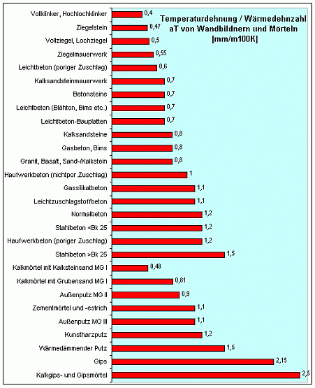

Im Ergebnis darf man für temperaturbeanspruchte Konstruktionen nur nah benachbarte Baustoffe miteinander verbinden. Sonst reißt der bewegungsfreudigere Baustoff vom anderen ab. Vor allem die "spannenden" Schichtaufbauten, die das moderne Bauen für Dach und Fassade bereithält! Probieren Sie mal den Fall: Abgesoffenes Polystyrol-WDVS auf Ziegel-Altbau, auf Altputz MG II mehr oder minder gut angebappt mit kunstharzverschnittenem Zementklebemörtel, hin und wieder angefrostet bei -20 °Celsius. Na eben.

So könnte das im Endergebnis aussehen (Bildzitat aus "Bauhandwerk mit Bausanierung 2/01, Foto: Frank Dieter Balkowski):

 Und so im Falle eines dummerweise mit Zementmörtel (a = 1,1) gemauerten und verfugten Bauwerks aus Ziegelsteinen / Backstein (a = 0,5) im hohen Norden - ein Autohaus mit durchaus anspruchsvoller Gestaltung - aber bautechnisch eben fragwürdigster Ausführung im Sinne der industrieregierten Mauerwerksnormen - eine wenig innige Verbindung zweier Baustoffe, von denen der eine - bewegungsfreudiger Zementmörtel - sich nahezu doppelt so arg thermisch dehnt, wie der gutmütige Ziegel altväterlicher - und nicht temperaturdehnungserhöhender porosierter (!) - Machart: 

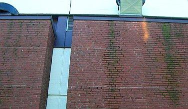 
Rißempfindlicher und trocknungsblockierender Zementmörtel und Backsteinmauerwerk - wo es etwas erhöhte Feuchte / Beregnung gibt, wird die Bude naß, Grünalgen und Moos setzen sich an den dauernassen Fugen und Ziegelsteinen an. 

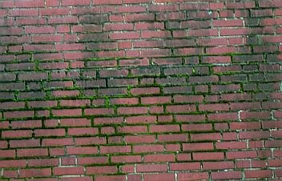 
So sieht das mitten in der Fläche aus: Algen, Moose, Risse, Mörtelverluste, Bindemittelausschwemmung / Versinterung. 

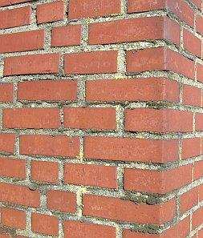 
Zementmörtel und Backsteinmauerwerk: An den ausreichend sonnenbeschienenen Fassadenseiten langt es für die Grünalgenbildung / Vergrünung / Veralgung nur bedingt. Dem etwas genügsameren Moos langt das Feuchteangebot jedoch dicke. 

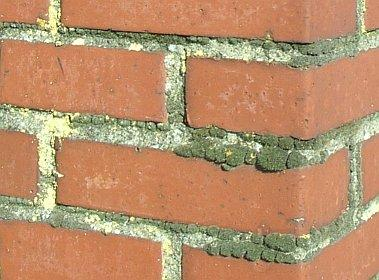 
Detail Moosbewuchs (graugrün) und Flechtenbewuchs (gelb) 

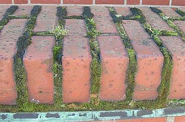 
Die Backsteinmauer-Rollschicht zeigt, wo es drauf ankommt bei der erfolgreichen Mooszucht: Rißempfindliche Fugmörtel mit guter Trocknungsblockade rundum - ein zementärer Werktrockenmörtel kann das locker bieten, selbstverständlich auch jeder ordentlich zementierte Baustellenmörtel. Bemooste Biotope bieten auch besten Öko-Kundenfang für Luxuskarossenkäufer. 

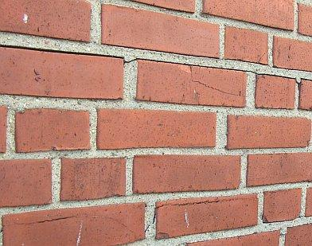 
Will man möglichst rißempfindliches Ziegelmauerwerk, ist die Vermörtelung / Vermauerung und Verfugung mit Zementmörtel / Kalkzementmörtel die allererste Wahl. Kaum hat die Mauer ein paar Quadratmeter sonnenbeschienene Fläche, reißt sie an allen Ecken und Enden, den Zement-Fugmörtel treibt es aus den Fugen, er bildet alle paar Zentimeter Spannungsrisse, da dringt dann kapillar der Regen in das Mauerwerk und wütet in der Frostperiode auf seine Art und Weise. 

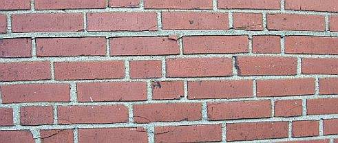 
So hinreißend zieht sich das durch alle sonnenexponierten Fassadenbereiche. 

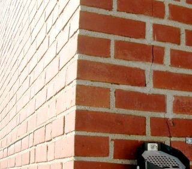 
An den Bauwerksecken der sonnenbeschienenen Ziegelfassaden reißt dann das starr in Zementmörtel gelagerte Mauerwerk komplett auf. Links sieht man die sich herausquetschende Mörtelfuge - ein Regenfänger par excellence. 

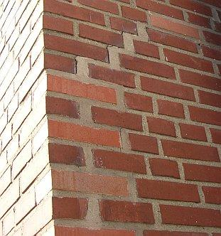 
An einer anderen Ecke hat man das in die Risse eindringende Regenwasser durch Reparaturmörtel / Reparatur-Vermörtelung zu stoppen versucht. Ganze Steine brachen dort auseinander und wurden komplett ersetzt (heller rot, höchstwahrscheinlich eine bewußte Gestaltungsmaßnahme des beratenden Designers). Und klaro - nach nur kurzer Zeit reißt die Ecke wieder auseinander. Die ewige Baustelle - dank professioneller Hilfe von Tragwerksplaner, Gebäudeplaner, Handwerk und Mörtellieferant inkl. Fachberatung. Das sind sie, die Fälle, die die Rechtsverdrehergilde reich machen. 

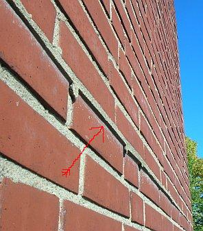 
Unglaublich, welche Kräfte die übertriebene Temperaturdehnung des Zementmörtels zu entwickeln vermag. Aus der Lagerfuge, an der sich die Dehnungsspannungen feste überlagern, zwingt es die ganze Mörtelfuge nach vorne - System Regenfänger und Auffrostungshilfe. Die ebenfalls systematisch abgerissenen Stoßfugen haften an der sich ausdehnenden Lagerfuge an und treten ebenfalls nach vorne. 

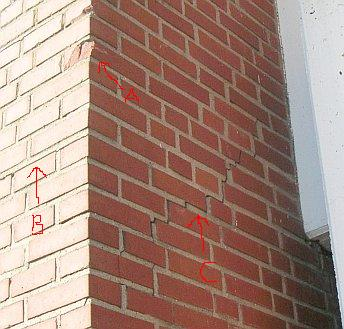 
Zementmörtel und Backsteinmauerwerk -eine Zusammenschau der vorprogrammierten Zerstörung durch falsche Materialwahl ohne jegliches kosntruktive Verständnis: A) Steinzerstörung, B) Fugenabriß, C) Mauerwerksriß. Eine echte Herausforderung für eine fachgerechte und dauerhafte Sanierung! 

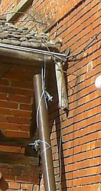 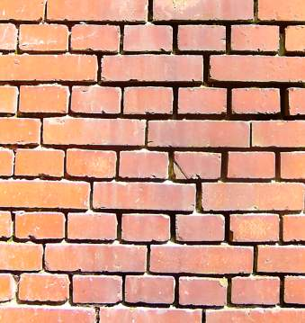 
Dahingegen: Kalkmörtel und Backsteinmauerwerk nach etwa 20 Jahren Bespülung durch anspritzendes Regenwasser aus leckender Dachrinne - Übersicht und Flächendetail. Die Fugen sind bis zu 10 cm zurückgewittert - das Mauerwerk sitzt trotzdem noch wie eine Eins - keine Risse, keine Deformationen, keine Veralgung, keine Bemoosung. Das nennt man störungstolerantes Bauen. Heute eine ziemlich verschüttete Kunst. 

In _"Münchner Liebfrauendom. Eine Kirche wird trockengelegt. Seine Fassade ist seit Jahren ein Sorgenkind: Jetzt verschwindet der Dom, das Wahrzeichen der Stadt, für Jahre hinter Baugerüsten. Von Monika Maier-Albang, SZ 30.01.2009"_ erscheint exemplarisch die traurige Wahrheit der Restauriererei an wertvollsten historischen Bauwerken durch falsche Baustoffwahl. Wer hat das zu verantworten? Pfuscher? Hansln? Keksperten? Denkmalpfleger? Kirchliche und staatliche Baubeamte? Diözesanbauverwaltung? Ach, wer weiß das schon? Lesen Sie hier die Fakten (Auszug): 

_"Jetzt hat das Staatliche Bauamt eine Generalsanierung der bröckelnden Fassade in Angriff genommen. Der Dom bleibt deshalb für einige Jahre verhüllt. Seit Jahren ist die Domfassade ein Sorgenkind: 

Ziegel- und Gesteinsbrocken lösen sich; ... Teile der Fassade mit Netzen gesichert. ... dazu übergegangen, ... Dom zweimal im Jahr mit ... hydraulischen Kran abzufahren, um loses Gestein einzusammeln. ... Vor allem an der Wetterseite hat Regenwasser dem Mauerwerk stark zugesetzt. Die bis zu vier Meter dicken Wände sind so durchnässt, dass Michael Hauck, der vom staatlichen Bauamt als Experte hinzugezogene Leiter der Passauer Dombauhütte, "irreparable Schäden" befürchtet für den Fall, dass jetzt nicht gehandelt werde. Die Sanierung wird sich über Jahre hinziehen. Wie lange und zu welchen Kosten, dazu wagt momentan niemand eine Prognose. Hauck spricht nur von einer "gewaltigen Aufgabe". ... Kurt Bachmann, Leiter des staatlichen Bauamtes München I, vermutet, dass vor allem die nach dem Krieg notdürftig durchgeführten Reparaturen dem Mauerwerk zusetzen. Der im 15. Jahrhundert unter dem Baumeister Jörg von Halspach errichtete Liebfrauendom war ursprünglich aus gebrannten Ton-Lehmziegeln errichtet und mit_ [KF: gaaanz sicher absolut zementfreiem!!!] _Kalkmörtel verfugt worden. Die alten Ziegel sind bis heute gut erhalten. Bei den Nachkriegsziegeln indes ist die Oberfläche porös geworden. Der Mörtel, den man damals verwendete, ist mit Zement versetzt, was ihn eigentlich stabiler machen sollte. De facto aber ist er heute brüchiger als der ursprüngliche reine Kalkmörtel. Beides bietet Bachmann zufolge "Angriffsfläche für das Regenwasser". Hinzu kommt, dass der an den Bögen verwendete Tuffstein das Wasser offenbar regelrecht in das Mauerwerk saugt. Ursprünglich war der Naturstein mit Kalkmörtel verputzt, der heute fehlt. 

Ziegel trocknen nicht mehr aus. 

Nun wäre das Regenwasser allein kein Problem. Dass die Ziegel ab und an nass werden, ist normal. Normalerweise müssten sie aber auch wieder austrocknen. Diese Fähigkeit zur Selbstregulation ist der Domfassade abhanden gekommen. Von einer "Störung im Feuchtehaushalt", spricht Hauck. Woran das liegen könnte, wissen die Spezialisten noch nicht. Sie vermuten, dass bei Ausbesserungsarbeiten in den vergangenen Jahrzehnten Materialien verwendet wurden, die die Verdunstung behindern."_ (Link auf [Online-Artikel am 29.01.09](http://www.sueddeutsche.de/muenchen/905/456573/text/)) 

Aha und nanu? Was mögen denn das für "Materialien" gewesen sein? Verdunstungsverhinderer? Kaugummi? Gummistiefel? Nylonhemden? Plastikfolien? Wollmer raten?: 

Bestimmt porenverklebende / trocknungsblockierende synthetisch verharzte Hydrophobierungsmittel oder Festigungsmittel oder eben beides. Wie es bei der "Restaurierung" wertvollster Kapellen, Kirchen, Dome, Kathedralen und sonstiger sakraler und profaner Baudenkmäler nicht nur bei den am Bau tätigen Vollspastikern [auch der Verfasser dieser polemisch-gehässigen Zeilen - Pardon, meine Liebe zu den Wunderwerken der historisch-traditionellen Bauwerken geht wieder einmal mit mir durch! - gehörte einst vor vielen Jahren dazu und weiß, wovon die Rede ist, mea maxima culpa!] in Bayern leider auch an wertvollsten Baudenkmälern üblicher Standard war und oft noch ist. 

Ich kenne die so unvergleichlich "seriösen" Fachfirmen, die in Bayern sowas an die Wände schmieren, ich kenne auch die unheimlich "unabhängigen" Experten, die derlei Schweinereien im Brustton der Überzeugung empfohlen haben und vertrauensseligen Denkmalexperten, Planern, Restauratoren und Bauherren, die mit Anlauf - teils auch wegen sehr angenehmer Vergünstigungen, Leberkässemmeln und sonstig maßgenscheiderter Streicheleinheiten - darauf hereinfallen, immer noch - gegen teuer Geld! - empfehlen. Ich kenne auch die bundesweit Schwachsinn absondernden sog. Sachverständigen (recte: Schwachverständigen) und Gutachter (recte: Schlechtachter), die Kalkmörtel für die Verfugung eines bewitterten Ziegelmauerwerk wegen nicht gegebener DIN-Konformität ablehnen. Sie wahrscheinlich auch, oddä? 

Hier geht's weiter: [[Kapitel 14: Mischbauweise Kalksandstein/Porosierter Ziegel und Schäden durch falsche Baustoffwahl]](29bau14.md)
