[🠔 Zur Übersicht: Wand & Fachwerk](29bau09.md)  
# Mischbauweise und Schäden durch falsche Baustoffwahl
**Analyse der Probleme bei Mischbauweisen und resultierenden Schäden durch inkompatible Baustoffe, wie Zement auf Kalkmörtel, mit praktischen Beispielen und Erklärungen.**  
_von Konrad Fischer_

 Altbautaugliche Verfahren und Baustoffe 

## Wandbildner [14]

Die Kapitel 9-10 wurden in folgende Unterkapitel aufgeteilt: 

**9. Natursteinrestaurierung** : [[1]](29bausto.md) [[2]](29bau02.md) [[3]](29bau03.md) [[4]](29bau04.md) [[5]](29bau05.md) [[6]](29bau06.md) 
**Steinboden** : [[7]](29bau07.md) 
**Reinigungstechnik** : [[8]](29bau08.md) 
**10. Wandbildner im Vergleich** : [[9]](29bau09.md) [[10]](29bau10.md) [[11]](29bau11.md) [[12]](29bau12.md) [[13]](29bau13.md) **[14]** [[15]](29bau15.md) 
**10.a Fachwerk/Blockbau** : [[16 - Die schärfsten Tipps zur Fachwerkrestaurierung: Woran erkennst Du einen Fachwerk-Experten?]](29bau16.md) [[17]](29bau17.md) [[18]](29bau18.md) [[19.1]](29bau19.md) [[19.2]](29bau192.md) 
**Bodenaufbau/Holzboden** : [[20]](29bau20.md)

## Mischbauweise und Schäden durch falsche Baustoffwahl

Die Kunst des Bauens, Konstruierens und Fügens setzt doch eigentlich eine eingehende Auseinandersetzung mit der Chemie und Physik der Baustoffe voraus. Leider wird diese Kunst heute recht wenig geübt, sowohl bei Planern wie auch bei Handwerkern. Deswegen dürfen wir überall Schäden, aus denen man klug werden könnte, bewundern. Als Einstieg mal was zur treibenden Wirkung der Aluminate im Zement: 

Keramikfliesen, verfugt mit Kunstharz-Zement-Fugmörtel auf Kunstharz-Zementkleber-Dünnbett auf MG 2 1,5 cm auf Natursteinmauerwerk mit Kalksetz- und Lagerfugen, an Ecken und in der Fläche mit auf Gipsmörtelbatzen angesetzten Putzschienen aus verzinktem Stahlblech. Und jetzt nehmen Sie die damit ausgestattete Küche in Betrieb und reinigen die Fliesensockel mit kochendem Wasserstrahl. Genau! Die Fuge wandert auseinander, der gipsig-sulfathaltige Ansetzmörtel der Putzschiene treibt, da sich unter Enwirkung der C3A-Bestandteile des Zements Treibmineralien mit erheblicher Wasseranlagerung und damit explosiver Treibwirkung bilden, Ettringit oder auch Zementbazillus genannt. So sieht der Abriß aus: 

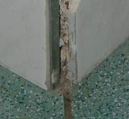

Straffer Zementputz auf kalkvermörtelter "weicher" Altfassade ist auch ein immer heißes Thema, hierzu eine kleine Bildergalerie zum Kennenlernen:

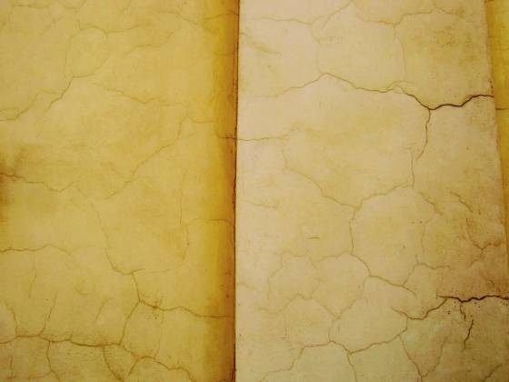 
So hinreißend zieht sich das durch alle sonnenbeschienenen Fassadenbereiche. 

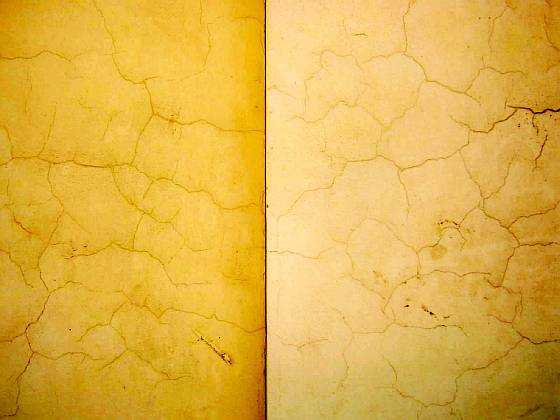 
Das Rißnetz zeigt, daß ein Zementmörtel weder seine enormen Abbindespannungen, noch seine enorme Temperaturdehnung in weniger tragfähige Putzgründe - hier eine mit Kalkmörtel errichtete Bruchsteinfassade des 19.Jahrhunderts - schadensfrei bzw. rißfrei einbringen kann. 

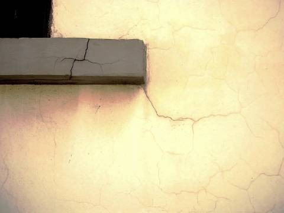 
Geradezu wahrnsinnig ist natürlich die Zementmörtel-Verwendung an besonders witterungsexponierten und aus der Fassade herausspringenden Bauteilen wie dieser Fenster-Sohlbank. Obendrein extra dunkel gestrichen zur vermehrten Absorption der Solarstrahlung. Ganz schön schlau! Ob das die Entscheidung des Denkmalpflegers, des Bauherren, des Architekten, des Handwerks, des produzentenseitigen Firmenfachberaters war? Rätsel über Rätsel. 

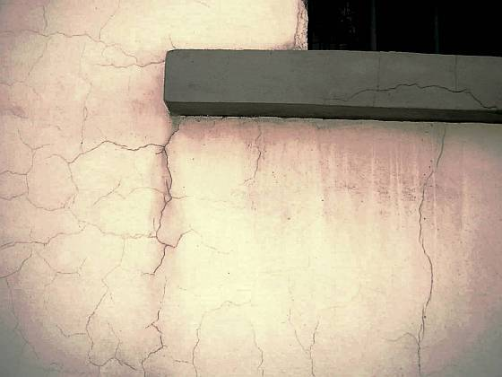 
Ein typischer Systemschaden eben. 

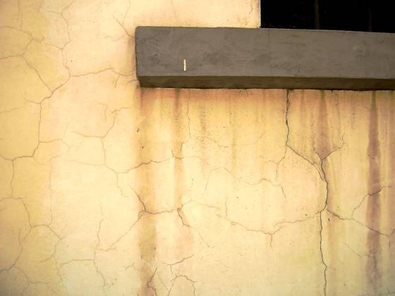 
Mal 30 etwa. 

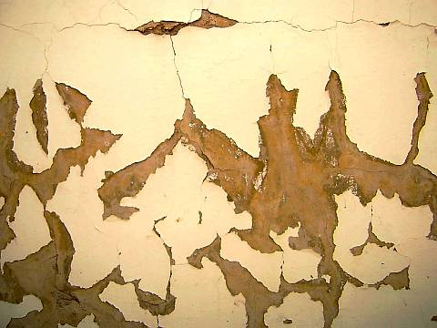 
Kaum zu toppen: Zementmörtel auf kalkvermauerter Fassade mit Kunstharzanstrich / Kunstharzfarbe / Kunststoff-Farbe / Kunststoffanstrich / Dispersionsfarbe / Dispersionsanstrich beschichtet - der Spritzwasserbereich am Sockel. Das reißt und nässt auf und schollt und bröckelt und ist schon (fast?) Kunst. 

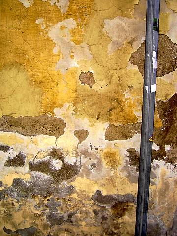 
So sieht es dann aus, wenn der Sockelbereich zusätzlich schadsalzbelastet (Streusalz, Fäkalien) ist. Mit [aufsteigender Feuchte hat das aber nix zu tun, sie gibt's ja gar net](2aufstfe.md). 

Ein schöner Schadensmechanismus ist auch die die handwerkstypische und in alle Ewigkeit den Folgeauftrag sichernde Verwendung von dichten Schichtbildnern mit nach außen zunehmendem Dampfdiffusionswiderstand in Fassaden. Dazu zählen nicht nur zwangscraquelierende Kunstharzputze und kunstharzhaltige Anstriche auf den kondensatanreichernden Wärmedämmverbundsystemen, sondern auch Keramikplatten, Verblender oder Vormauerziegel - am besten mit dichtem Zementmörtel versetzt - als äußere Schicht vor absaufverurteilter Kerndämmung oder auch nur "normalem" Hintermauerziegel. Sehr zu empfehlen ist diesbezüglich:

Franke, L; Deckelmann, G. u.a.: "Schlagregenschutz und hygrisches Verhalten von Wärmedämmverbundsystemen mit Deckschichten aus baukeramischen Platten", Abschlußbericht. Lehr- und Forschungsbereich Bauphysik und Werkstoffe im Bauwesen, TU Hamburg-Harburg, Okt. 1998

Demnach durchfeuchten derartige temperatur- und feuchtedehnungsgefährdete Schichtfassaden nach Schlagregen grandios, es bilden sich folglich Ausblühungen, kalkhaltige Ablauffahnen, Fassadenteile stürzen ab. Die Dübelsysteme sind nämlich nicht immer auf das Zusatzgewicht von abgesoffenen Wärmedämmschichten und Vorsatzschalen berechnet, die schon aufgrund ihrer nicht ausreichenden Wärmespeicherfähigkeit jede Nacht stundenlang unter den Taupunkt auskühlen und dabei Unmengen an Kondensat aus der abkühlenden Außenluft auffangen müssen. Das Fraunhoferinstitut hat das untersucht:

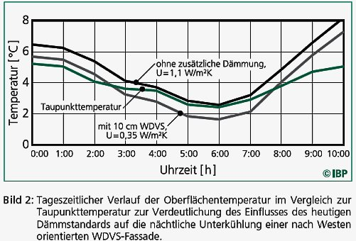

Auch die moderne Unsitte des Mischmauerwerks aus z.B. Ziegel (Wärmedehnzahl 0,4) und KS (Wärmedehnzahl 0,8!) birgt ihre Risiken:

Allgemeine Bauzeitung 30.3.01:

__HOMOGENES MAUERWERK GEFORDERT 
_**Mischbauweise führt zu Problemen**_

_Von Dr.-Ing Volker Tribius_

WEIMAR/SCHMITTEN. - Mischmauerwerk ist die Verwendung verschiedener Wandbausteine in einer Mauer. ... Meist steht (die Mischbauweise) lediglich für "Pfusch am Bau". In besonderen Fällen, in denen auf die Zusammenführung verschiedener Baustoffe nicht verzichtet werden kann, muss das Mischmauerwerk allerdings bei der Putzausführung berücksichtigt werden. ...

Die Probleme der Mischbauweise treten in drei großen Komplexen auf: Verformungsdifferenzen, Wärmebrücken und unterschiedlicher Putzgrund.

Das größte Problem der Mischbauweise sind jedoch die Verformungsdifferenzen. Unterschiedliche Mauersteine verhalten sich hinsichtlich Kriechen (das bleibende Nachgeben unter statischer Last), elastischer Verformung (das reversible Nachgeben unter Last), Schwinden (Verkleinerung beim Abbinden und Trocknen, Vergrößerung beim Quellen) und Temperaturverformung unterschiedlich. ...

Treten in einem Gebäude Mauerwerkswände aus unterschiedlichen Baustoffen zusammen, werden sie auch auseinanderreißen. Auch die Stumpfstoßtechnik wirkt sich in dieser Hinsicht nicht günstig auf die Risssicherheit aus, sondern nur rissverlagernd. Aber das der Riss am Wandstoß mindestens ein schallschutztechnisches Problem sein kann, ist damit niemand geholfen. ...

Wände, die sich gegenseitig auch auf Zug stützen sollten (aussteifende und auszusteifende Wände) tun dies nicht mehr, wenn sie durch einen Riss getrennt werden ...

Lastumlagerung und völlig geänderte Bedingungen sind die Folge, wenn unter Decken einige Wände stärker nachgeben und dann keine Last mehr aus der Decke übernehmen. .. Eine weitere Möglichkeit ist die Verdrehung des einen Deckenauflagers, wenn das andere Deckenauflager nachgibt.

Hinzu kommen Rissbildung in den Querwänden, wenn die Mittelwand nachgibt, und Undichtheiten in Wänden, mit einem negativen Einfluss auf die Wärmedämmung und Tauwasserbildung in der Konstruktion. ..."

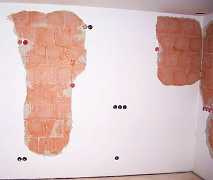 Und so (Bildquelle: Beratungskunde) kann es dann kurz nach dem Einzug ins massiv geliebte Häuschen auf allen Wänden aussehen, wenn sowohl ein falscher - da porosierter - Mauerstein (aufgeblasener Luftikus namens stark temperaturdehnungsgefährdetem Porenziegel), mit zementär-straffem Klebmörtel nur dünne in den Lagerfugen verklebt, nicht vollfugig vermörtelt, einem Fugenanteil, der aufgrund irrer Steingröße absolut unterdimensioniert ist, um unvermeidliche Spannungen im Außenmauerwerk schadlos abzupuffern, ein falscher Putz (Kalkzementmörtel, straff abbindend und auch als Ultraleichtputzmörtel bis zu 200 Prozent und mehr härter werdend, als in der Normprüfung im Stahlkasten und ohne saugfägigen Putzgrund feststellbar) und falsche Verarbeitung (synthetische Aufbrennsperre der expertigsten Bauchemie unwirksam, ausreichendes Vornässen des Putzgrunds "vergessen", deshalb Ablösung der abbindendenden Putzschicht vom übermäßig saugfähigen, schwammartigen Putzgrund) in genialisch-moderner Weise aufeinandertreffen. 

Hier finden Sie die fantastischen Pfuscheigenschaften sowohl der modernen Mörtel ("Normalputz, Leichtputz, Ultraleichtputz") wie auch der noch moderneren Porenschwammziegel verschiedener Hersteller, Macharten und Lochstruktur als "Putzgrund" offenherzig erforscht: [I. Beer, J. Hannawald, H. Jensen, W. Brameshuber: Einfluss von Verformungen des Putzgrundes auf das Entstehen schädlicher Risse in Außenputzen](http://www.fg-kalk-moertel.de/uploads/tx_bvkpublication/Forschungsbericht_2-2007.pdf), Forschungsbericht Nr. 2/07, Abschlussbericht zum Forschungsvorhaben AiF-Nr. 14093 N/2, Forschungsinstitut der Forschungsgemeinschaft Kalk und Mörtel e.V. Köln und Rheinisch-Westfälische Technische Hochschule Aachen, Institut für Bauforschung (PDF 7 MB) 

Im Detail sieht man die krassen Putzrisse des überharten und temperaturempfindlichen Putzes sowohl dem Fugennetz der überweichen, extrem saugfähigen und ebenfalls temperaturempfindlichen Porenziegelmauer folgen, wie auch landkartenförmig-fugenunabhängig, und das nicht nur an den thermisch besonders belasteten Außenwänden, sondern auch an den Innenwänden. Selbstverständlich auch nach Rißsanierung mit weiteren Rißbildungen in Spätrißmanier. 

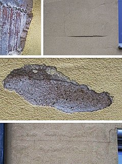 Und um den von Experten geplagten Bauherren immer an das Ende aller Dinge zu gemahnen, ertönt bei Wetterwechseln / Temperaturwechseln ein gräßliches Knacken des Mauerwerks und begleitet die unvermeidlich fortschreitende Konstruktionsselbstzerstörung dank EnEV-tauglicher Porenziegelei mit wirklich unüberhörbaren akustischen Warnsignalen, gegen die die Trompeten von Jericho ein zartes Kinderchörchen waren. Deutschland erwache! Hinzu kommt das Phänomen, daß bei mit Papierschlicker geporten Porenziegeln leider auch feindisperser Branntkalk aus den in der Soße befindlichen Kalkpigmenten entsteht - der Ziegel wird im Ofen ja ordentlich durchgebrannt. Und dieser Branntkalk will zwangsweise löschen, wenn er naß wird. Und Nässe empfängt er aus vielen Quellen, wie beispielsweise aus dem Anmachwasser des Mauermörtels, des Putzes, des Anstriches, aus Beregnung, aus Leitunsgleckagen und aus tauwasserbedingtem Kondensat, um mal die allergewähnlichsten Wasserquellen zu benennen. Und was passiert dann? Der Branntkal löscht zu Weißkalkhydrat in wässriger Lösung, die dann zur Oberfläche hin abtrocknet und bei dichtem Putz und Anstrich unter und in der Putzschicht beim Karbonatisieren auskristallisiert. Und dabei im Putz Blasen wirft und ihn abschält. Das Bild rechts zeigt, wie das dann praktisch aussieht (Bildquelle: Beratungskunde). 

Doch wie bewirbt die "Ziegel"-Industrie derlei hohles Gelöcher? Ein besonders krasses Beispiel muß uns genügen: 

_"Durch die dramatische Klimaveränderung, eine stark zunehmende Umweltverschmutzung und explodierende Energiepreise gewinnt monolithisch ausgeführtes, hochwärmedämmendes, rein keramisches Ziegelmauerwerk aus ... immer mehr an Bedeutung. Die Politik bemüht sich, durch zinsgünstige Kredite für "KfW-Effizienzhäuser" und Passivhäuser den CO2- Ausstoß von Wohngebäuden nachhaltig zu reduzieren. Die rein keramischen Produkte der ...- Serie von ... erweisen sich dabei aufgrund ihrer bauphysikalischen Eigenschaften als besonders ökologische und nachhaltige Lösung."_ 

Sollen wir nun lachen oder weinen über diesen klimaschutzbemühten Schmurchel-Werbetexter, der nun wirklich keine Ökoklamotte auslassen wollte? Ist derlei dramatisches Gestalten durch aufgeladenen Adjektivismus noch zu steigern? Vielleicht so: 

_"Die für ihre Ehrlichkeit seit Adam und Eva bekannte Politik unserer so überaus beliebten Politiker und Politikerinnen bemüht sich in ehrlichster Ausübung ihres Amtseides, den Untertanen vortrefflich zu dienen und jeglichen Schaden von ihnen fernzuhalten, ohne Unterlaß Tag und Nacht extremstens ..."_? 

Oder so: 

_"... besonders ökologische und nachhaltige Lösung, der in punkto Erlösung vor dem Weltuntergang bestimmt weder der zusammen mit dem Vollziegelmauerwerk bei und durch uns endlich abgeschaffte Lattengustl noch irgendein wohlfeiler Import-Mustafa oder sonstiger Soterius mit klein- bis großasiatischem Migrationshintergrund etwas vormachen können."_? 

Oder doch lieber so: 

_"rein keramisches Ziegelmauerwerk aus ..., dem aufgrund seines überaus und unübertreffbar hohen Luftgehalts zwischen ca. 38 bis 50 Prozent eine bisher sträflichst verkannte Absorberwirkung als effiziente und jeder morschen Eiche überlegene CO2-Senke zukommt, ..."_? 

Zur Versachlichung doch noch ein extra Beispiel, das uns zeigt, daß ein Porenziegel selten allein kommt, diesmal ein Bericht aus Dresden, dem altbekannten Tal der Ahnungslosen, aus der Allgemeinen Bauzeitung, Wochenzeitung für das gesamte Bauwesen, 30.07.2020, S. 18: 

_"Das erste Sachsens: Passivhaus mit einschaliger Ziegelfassade in Dresden errichtet ... Der Hausentwurf des Architekten sah - entsprechend dem für ein Passivhaus geforderten Wärmeschutz (U = 0,15 W/m²K) - ein 49 cm dickes (Wärmedämmziegel-)Mauerwerk für das Sockelgeschoß vor. Damit war die mit einem Mineralputz verputzten Außenwände ein ausreichender Wärmedurchgangskoeffizient von nur 0,14 W/(m²K) gewährleistet. Im Obergeschoß entschied man sich in Abstimmung mit den Bauherren für ein 36,5 cm dickes Mauerwerk aus (vom Darmstädter Passivhaus-Institut zertifizierten Wärmedämmziegeln) mit hinterlüfteter Vorhandfassade und 120 mm Mineralwolledämmung (U = 0,12 W/m²K). 

Das hochwärmedämmende Mauerwerk wird in der Gebäudehülle durch Passivhaus geeignete Dreifach-Warmverglasung von Fenstern und Glasfassade sowie eine 35 cm dicke EPS-Dachdämmung wärmedämmtechnisch gleichwertig ergänzt. Die installierte Lüftungsanlage mit Wärmerückgewinnung und eine Solaranlage zur Wärmeerzeugung gehören zu den typischen Komponenten eines Passivhauses. 

Als Heizquelle fungiert ein Pellet-Designofen im Wohnraum. Er beheizt den Raum direkt und produziert - in einem Wärmespeicher zwischengespeichert - die Heizwärme für die eingebaute Fußbodenheizung."_ 

Daß sich der Wärmedämmziegel mit nur 3 mm dicken Lagerfugen begnügt, wird hier als Vorteil in punkto Mörtelverbrauch propagiert. Jösses, wer bietet mehr "passivhaustypische Komponenten"? Darfs noch ein Ökokomponentchen mehr sein? Und wer kann sich das außer Oberlehrersgattinnen, Bankerehefrauen und Managertussen wirklich leisten? Ach ja, das soll ja alles beim Energieverbrauch eingespart werden! Von der Schadensträchtigkeit der Passivhaustechnik mal ganz zu schweigen. Kritische Zusatzinfo: [Dämmbauweise](213baust.md) - [Fenster](23bausto.md) - [Ökoenergie](7temp23.md) - [Einspareffekte durch Dämmung](7fehrtab.md) 

Sie wählen! 

Klapprige Fertighausbauweise oder pseudomassives Porenmauerwerk oder massiver Weißkunststein mit angebappter Schaumverschimmeldämmung - alles nach Vorschrift - Leute, so schlecht wie derart moderne EnEV-Neubauten wurde selbst der lumpigste Massivmauerwerks-oder Fachwerk-Altbau nie gebaut, oddä?

Mein Tipp: Nur mit kleinformatigem (z. B. 2 DF) Vollziegel (der alte Backstein!) ab 1800er Rohdichte aufwärts bauen, vermörtelt mit elastischem Luftkalkmörtel. 36,5 cm stark reicht. Und bei der Instandsetzung von historischem Bruchstein- und Mischmauerwerk: Wie unsere Vorfahren schöne Vollziegelflicken in die Fehlstellen bzw. mit unverseuchtem Altmaterial des Bestands reparieren. Soweit Verputz: Ebenfalls nur mit Luftkalkmörtel. Der ist und bleibt am wenigsten rißgefährdet.

Lerne: 

1. Wenn Mauersteine in das Fassadenmauerwerk außen, dann voller Ziegel, aber kein porosierter. Die angeblichen Vorteile bezüglich [Energiespareffekt](7wsvoant.md) entpuppen sich schnell als Trugschluß, wenn man wirklichkeitsnahe, also [mit der Speicherfähigkeit rechnenden Maßstäbe](7keff.md) ansetzt und die Schadensträchtigkeit und Rißanfällgkeit der Schwammsteine berücksichtigt. Mit hoher Rohdichte trifft man beim Fassaden-Ziegelstein die beste Wahl, was die Kombination Festigkeitsaufnahme, Speicher- und Dämmfähigkeit betrifft. Lassen Sie sich von den auf Laborwirklichkeiten beruhenden Lambda- und U-Werten nicht verblüffen. Diese wirklichkeitsfremden Stoffbeiwerte dienen nur den Dämmstoffherstellern, nicht dem Kunden. Für die Innenseite kann man dann kombinieren mt Hochlochziegel klassischer Bauweise oder Kalkputz auf dämmfähigen Putzträgern, da dann die heiztechnische Erwärmung der Innenwand schneller und mit weniger Heizenergie gelingt. Natürlich muß man auch dabei immer aufpassen, nicht energiesparvergeizt mit dem Schinken nach der Wurst zu werfen. Die Porosierungsindustrie rückte übrigens inzwischen auch mal vom k-Wert-Fanatismus ab, wie [jüngere Publikationen](7wdvs06.md#bochum-werne) nahelegen. Der DIN e.V. als Träger auch der verrücktesten Bauphysikdeformationen dient eben auch der Vermarktung, nicht vorrangig der besseren Technik. [Das sagen die Gerichte](2mbu.md)!

2. Kalksandsteine haben ein auch vom Institut für Bauforschung der RWTH Aachen (Prüfbericht A 2798, Dr.-Ing. Schubert) bewiesenes langdauerndes Schwindvermögen, das drastisch über dem geringfügigen und schnell abklingenden Quellen von Ziegelsteinen liegt. Das gilt auch für die Wärmedehnung. Darüber hinaus gibt der Bauskandal um einen großen Kalksandstein-Hersteller auch über die produzentenseitige Fachkompetenz doch sehr zu denken. Aus Kostengründen hat man dort jahrelang schwefelhaltig-vergipsten Kraftwerks-Filter-Kalk (REA-Kalk von Kraftwerks-Rauchgas-Entschwefelungsanlagen) untergemischt, mit mehr als übelsten Folgen für die betroffenen Hausbesitzer. Das Zeugs reagiert im Fall von Feuchte (vorwiegend bei Kellermauerwerk gegeben) durch Treibmineralbildung mit den aluminathaltig (C3A) verseuchten Zementbindemitteln im Mörtel und treibt deswegen die wunderlichsten Blüten, löst gar den Stein auf und rieselt dann vor sich hin. In der Baubranche ist das salzige Treiben von Gips und Zement bei Anwesenheit von Feuchte als Ettringittreiben bzw. Zementbazillus schon ewig bekannt, wird jedoch keinesfalls ausreichend beachtet. Sogar zementäre [Sanierputze](2sanipuz.md) werden auf vergipstes nasses Mauerwerk als Heilmittel empfohlen. Ein prima Ding für tragendes Mauerwerk, oder? 

Weitere Kalksandstein-Info hier: [Stern Bauskandal: Die Spur der Steine](http://www.stern.de/wirtschaft/unternehmen/:Bauskandal-Die-Spur-Steine/631468.html) 

3. Wenn Stein, dann keine Großblöcke. Deren verminderter Fugenbedarf ist bautechnisch kein Vorteil, berücksichtigt man die dadurch höhere Rißanfälligkeit. Der Systemschaden bei Mauerwerk aus porosierten Ziegel-"Steinen" ist ja die geradezu unausweichliche Rißbildung entlang aller Fugen, vor allem auf stärker sonnenbeschienenen Süd-und Westfassaden. Durch die damit enstehenden durchgängigen Mauer- und Putzrisse dringt dann kapillar das Regenwasser (Westseite!) ein und kann das schöne "Energiesparmauerwerk" sehr ordentlich und dauerhaft durchfeuchten. Entsprechende Schadensfälle sind bekannt - nur nicht in den maßgeblichen und allesamt werbeabhängigen Fachzeitschriften ordentlich und abschreckend genug publiziert! Die lachhafte Weismacherei der Baubranche, diesen bauphysikalisch unausweichlichen Problemen mit wasserabweisenden Leichtmörteln beikommen zu wollen, können bei sachkundig eingeweihten Bauhasen nur noch müdes Grinsen entlocken. Die hier beobachtbare babylonische Finsternis im Produktmarketing der Ziegelsteinbranche ist kein Grund, deren ziegelverpackten Luftschaumstoffen oder zusatzgedämmten Vorsatzschalen auf den Leim zu gehen. 

4. Vorsicht vor nicht voll bzw. ehrlich deklarierten Industrielabormörteln und -putzen. Ihre Laboreigenschaften weichen oft drastisch von denen am Bauwerk ab. Ihr Zementgehalt fördert Maurerkrätze, ihre geheimen Eigenschaften überraschen mit heimtückischen Bauschäden, die von [Schwachverständigen](3gutacht.md) der Ausführung und Planung/Bauleitung zugeschrieben werden.

5. Zu hohe Zementanteile wegen derer gewünschten Schmiereigenschaft bei der Frischmörtelpumpung, unzuverlässige Luftporenbildner, viel zu geringe Korngrößen mit entsprechend drastisch erhöhtem Bindemittelbedarf - die erhöhte Kornoberfläche muß ja mit ausreichend Bindemittelleim umhüllt werden - Hydrophobierungsmittel usw. mögen zwar die Verarbeitung fördern und der Norm entsprechen, ein guter und schadensfreier Mörtel/Putz muß daraus nicht entstehen. Gerade die Hydrophobierungs- und Feuchterückhaltemittel (i.d. R. Metallseifen und Zellulosederivate wie Tylose) behindern die Austrocknung des Frischmörtels und der später immer eindringenden Feuchte aus Kondensat und Beregnung.

Folge: Die katastrophalen Fassadenschäden, die wir überall sehen (Augen auf!) und die immer kürzere Wartungsarbeiten an Fassaden bedingen. Erkauft auch durch die gesundheitliche Belastung der Handwerker durch die [Zementkrätze](2beton15.md). 

6. Glauben Sie nie an die angegebenen Laborprüfwerte! Was sich am Bauwerk, unter den normalen Umgebungs- und Entstehungsbedingungen einstellt, zählt. Pfeifen Sie auf Zulassungen, wenn nicht dauerhaft gute Erfahrungen vorliegen. Verlangen Sie [ehrliche Volldeklaration](2volldek.md), ansonsten verweigern Sie den Baustoffeinsatz. 

7. Vermeiden Sie moderne Baustoffsurrogate, bleiben Sie bei traditionsbewährten, also störungstoleranten Bauarten, wenn Sie Schäden vermeiden wollen. Solange es sie noch gibt: 

Die am Ziegel zu beobachtenden Entartungen hin zum Dämmstoff und Betonfertigteil buchen wir unter Schaumschlägerei bzw. Großmannssucht ab. Man fragt sich, ob die Ziegelindustrie dumm, verrückt oder rohstoffarm ist, wenn immer weniger Ziegelton mit immer mehr Luft-, neuerdings sogar Dämmstoffanteil in immer größeren Einheiten (Großblock bis Fertigteilwände) angeboten wird. Hier werden Kernkompetenzen und hervorragende Alleinstellungsmerkmale aufgegeben, um der Dämmstoff- und Betonindustrie nachzueifern. Die grotesken Höhepunkte (bisher) im Totentanz der Ziegelwerke sind TWD-beklebte Ziegelblöcke und dämmstoffverstopfte Hohlkammer-Porenziegel. Mit sowas läßt sich auch noch jede künftige EnEV-Verschärfung mühelos meistern ...

Man läßt sich also die Betrugsargumente der Konkurrenz (U-"Wert") aufzwingen, unterstützt damit deren Wohlergehen und wirbt letztlich nur noch mit "nackerten Weibern" für einen modern mißbrauchten und pervers vergewaltigten Baustoff, der jahrtausendelang jedem Surrogat in jeder Hinsicht überlegen war. Ein Weg in den Abgrund, wie es die Neufassungen der [DIN 4108](7din4108.md) und EnEV zeigen. Professoren "beweisen" der wissenschaftsgläubigen bzw. ebenso korrupten Fachwelt, daß wärmegedämmte Kalksandsteinfassaden wirtschaftlicher als Ziegelmauern sind. Ja, wenn man nur den U-Wert betrachtet, kann man freilich mit mickrigen Wändchen aus feuchterückhaltenden Steinen, eingepackt mit Dämmstoff mehr qm erzielen! 

Vergleicht mal die tatsächlich gegebene energetische Wirkung unter Berücksichtigung der U-Wert-Hyperbel und der praktisch wirksamen Speicherfähigkeit, der Bauinvestition und Flächenerträge sowie der zu erwartenden Lebensdauer inkl. Entsorgung! Dann geht das Spiel anders aus. Doch das können solche Professoren gar nicht rechnen! Dazu braucht es Grundrechenarten, die kann man nicht fälschen. Oder noch 'nen Euro obendrauf.

8. Der zementäre Ersatz für die um den Faktor 10 schneller austrocknenden Luftkalkmörtel ist eine moderne Krankheit, aber kein langzeitbewährter Baustoff. Schauen Sie sich mal die alten Burgen und Kathedralen an. Alles Kalkmörtel! Und soweit mit inzwischen unverputzten und zementverfugten porösen Steinen (z.B. rhein. Tuffe) - alles hin! Auch heute geht das noch mit Kalkmörtel, der in der Praxis (nicht im verdursteten Laborprüfling) locker MG II-Qualitäten erreicht. Und bei traditioneller Vergütung, ein leider ungelöstes Geheimnis für viele Mineralogen und die meisten Mörtelforscher, auch bestes Frühfestigkeits- und Abbindeverhalten. Zu Handwerksfehlern mit Kalkprodukten lesen Sie [hier meine Erfahrungen](2kalkfel.md).

9. Massive Baustoffhüllen eignen sich selbstverständlich bestens für die Beheizung durch wärmestrahlungsoptimierte [Hüllflächentemperierung](7temper.md) - nur einbuddeln sollte man die heizwasserführenden Rohrleitungen lieber nicht, denn massiv heißt auch wärmeleitend und das saugt dann viel Wärmeenergie ins Nirwana.

10. Selbst der bewährte Baustoff Ziegel ist aber vor den gewissenlosen Schandtaten der Umweltpolitiker/-behörden, Wissenschaftler und der Produzenten nicht sicher, wie folgende Zeitungsmeldung (aus dem Archiv Dipl.-Ing. Architekt Thomas Funke, Dorsten) beweist:

**"_Giftziegel_** 
Behörden fördern Steine des Anstoßes

Bundesdeutsche Ziegeleien verbacken seit Jahren in großen Mengen giftigen Sondermüll. Eine Vorreiterrolle spielt dabei das Land der wohl gewissenlosesten Geizkrägen im Häuslebau usw. - Baden-Württemberg. Dort haben 15 Betriebe unter Begleitung der Landesanstalt für Umweltschutz in Karlsruhe Sondermüll in Backsteine gebrannt - unter anderem Galvanikschlämme, Säureteer und Filterstäube.

Manche Beimischungen wurden aufgegeben, nachdem die belasteten Ziegel bei 24-Stunden-Tests in Wasser gefährlich viel Schwermetall abgegeben hatten. Unter Experten gelten die Tests aber als ungeeignet, weil sie keine Aussagen über Langzeitfolgen zulassen. Dennoch werden den Steinen weiterhin schadstoffhaltige Metallhydroxidschlämme, Gießerei-Altsände, Kraftwerks- und Hochofenschlacke sowie schwermetallhaltige Braunkohlenflugasche beigemischt.

Das Umweltbundesamt fördert in Berlin sogar ein Versuchsprogramm der Universität Clausthal-Zellerfeld, das die "Verwendung eines möglichst hohen Anteils von Haushaltsmüll" bei der Ziegelherstellung vorsieht.

Den Herstellern von Leichtziegeln wiederum machen giftige Abgase zu schaffen. Das zum Bilden der feinen Poren benutzte Styropor etwa verursacht beim Brennvorgang krebserregende Benzol-Emissionen."

Ob damit schon der Gipfel der Materialverseuchung durch industrielle Produzenten und bösartige sowie auch mal käufliche moderne Drittmittel-Wissenschaftler erreicht wurde, wer weiß? Inzwischen muß man also schon Unbedenklichkeitserklärungen von Ziegellieferanten fordern, keinen Müll in ihr Produkt eingebaut zu haben. Daß man die Perversion des Mauerziegels durch absonderlichste Abfallverwertung immer weiter beschleunigt, darf da nicht mehr wundern. 

Sogar Schleifstaub von Bildschirmoberflächen soll manchen porosierten Steinen zugesetzt werden - mit dem Ergebnis der Kapillarporenverstopfung und weiterer Abschaffung bewährter Ziegeleigenschaften. Da manche Ziegeleien inzwischen aus Preisgründen "schweres", also sehr schwefelreiches Heizöl beim Brand verwenden, gehen die dabei abgegebenen Schadstoffe als Gips in die Ziegelstruktur ein. Wasser bzw. Regen drauf - wer deckt schon das entstehende Mauerwerk täglich ab? - Topp-Ausblühungen? Und natürlich dürfte es da niemanden verwundern, wenn gewitzte Bauschuttdeponien bei der Anlieferung des modernen Porenziegelbruchs vielleicht erst mal eine Schadstoffanalyse fordern und dann - wegen u.U. giftigen Schwermetallen im Porenziegel - Sondermüllpreise kassieren.

13. Wenn Fassade, dann nicht aus nach außen zunehmend dampfdiffusionsdichteren Bauteilen. Bei traditionellen Ziegeln im Luftkalkmörtelmauerwerk dürfte das Mischen aber kein Problem darstellen, da die Mauerfuge der bevorzugte Transportweg für die Feuchte darstellt.

14. Der absolute Wahnsinn, da teuer, am Massivbau energetisch sinnlos und schadensanfällig und außerdem seit Jahren nicht mehr im Fokus: Transparente Wärmedämmung. Befördert Mauerrisse und Feuchteprobleme (nachzulesen in Al Bosta: "Risse im Mauerwerk, Verformung infolge Temperatur und Schwinden, Baupraktische Anwendungsbeispiele, 2. Auflage 1999).

Nun besteht bei den brüchigmürbsplittrigen Dünnwand-Porenziegel aus Gründen der Bauschadensvermeidung und zur Minimierung der Regreßansprüche seitens zermürbter Bauherrn durchaus der Wunsch, dem Ton "stabilisierenden" Kram unterzujubeln - und so kam man (Anf. 2016 überraschend vorzeitig aus den Mediatheken gelöschten) ARD-/HR-Medienberichten zufolge drauf, aus Mineralfaserdämmstoffen und Schwermetallabfällen zusammengemisteten Granulations-Zuschlag zur (angeblichen?) Verstärkung in den Porenziegel reinzubacken. Auch Gipsbuden sollen das Zeugs für die Deckenplattenherstellung bezogen haben. Als Rechtfertigungslehre dienten den Medienberichten zufolge gaaanz tolle "Gutachten", die zu politischen und medialen Jubelschreien rund um die Vermarktung dieses neuen Höhepunkts abenteuerlicher Wiederverwendung von riskantem Dämmstoffabfall und giftigem Schwermetall als Qualitätsbaustoff führten. Zig Hausbesitzer bekamen so angeblich Sondermüllhäuser, obwohl sie doch nur ein gutes Ziegelhäuschen haben wollten. Ein Journalistenteam vom Hessischen Rundfunk nahm das mal kritisch aufs Korn, die Reaktionen waren entsprechend: 

http://www.daserste.de/information/reportage-dokumentation/dokus/videos/exclusiv-im-ersten-giftmuell-fuer-den-wohnungsbau-102.html - ARD Exklusiv: Giftporenziegel für den Wohnungsbau (Link tot) 
Weitere Info - sehr dialektisch durchmischt: http://www.swr.de/landesschau-aktuell/rp/mainz/gift-ziegel-skandal-in-hessen-rheinhessisches-unternehmen-beteiligt/-/id=1662/did=15909702/nid=1662/188dwuv/index.html - "Giftziegel"-Skandal in Hessen - Rheinhessisches Unternehmen beschwichtigt (Link tot) 
http://www.ffh.de/news-service/ffh-nachrichten/nController/News/nAction/show/nCategory/mittelhessen/nId/60749/nItem/woolrec-skandal-weitaus-groesser-als-bisher-angenommen.html - Skandal um die Firma Woolrec in Mittelhessen ist wohl weitaus größer als bisher angenommenLink tot 
[IG Tiefenbach zum Woolit-Skandal](http://www.ig-tiefenbach.de/9.html) 
"Europäische Gesellschaft für Gesundes Bauen und Innenraumhygiene EGGBI" zur Problematik [Woolit in Ziegeln und Reaktionen der Ziegelindustrie](http://www.eggbi.eu/forschung-und-lehre/zudiesemthema/woolit-sonderabfall-in-ziegeln-und-anderen-baustoffen/). [Neuer Woolrec-Skandal - Millionen belastete Ziegelsteine in Wohnhäusern verbaut](http://hessenschau.de/wirtschaft/neuer-woolrec-skandal-millionen-belastete-ziegelsteine-in-wohnhaeusern,woolrec-ziegel-100.html) 
[Krebserzeugendes Baustoffe in Häusern - Fragen und Antworten zum Woolit-Poren-Ziegel-Skandal](http://hessenschau.de/wirtschaft/antworten-auf-nutzer-fragen-zum-ziegel-skandal,woolrec-ziegel-102.html) 
[Woolrec und das Krebsrisiko](https://www.youtube.com/watch?v=75sIzsl235M) 
["Giftziegel"-Skandal in Hessen - Rheinhessisches Unternehmen nicht betroffen](http://www.swr.de/landesschau-aktuell/rp/mainz/gift-ziegel-skandal-in-hessen-rheinhessisches-unternehmen-beteiligt/-/id=1662/did=15909702/nid=1662/188dwuv/index.html) 
[Poren-Ziegelbranche wehrt sich gegen „Giftmüll“-Berichte](http://www.baustoffmarkt-online.de/aktuell/news-industrie/detail/116844-ziegelbranche-wehrt-sich-gegen-giftmuell-berichte/) 

Fazit: Was das Mauerwerk können muß 

Dämmen oder speichern? 

Die einfache Antwort: Sowohl als auch. Doch wie? Nach EnEV mit speicherfähige Hintermauerung + Dämmschale (WDVS) oder Dämmschicht + hinterlüftete Vorsatzschale bzw Kerndämmung, mit Porenbeton oder dämmstoffgefüllten Lochziegeln, oft schlecht vermauert mit Kalkzement-, Klebe- oder Dämmmörtel. 

Doch worauf kommt es wirklich an? 

1. Tragfähigkeit, Temperaturstabilität und Rißsicherheit - problematisch mit Poren-/Leichtbeton, Großblöcken sowie zementhaltig-rißempfindlichen Mörteln und temperaturempfindlichen Dämmschichten. 

2. Trocknungsfähigkeit - schlecht bei bindemittelgebundenen und porosierten Steinen/Ziegeln, Schalenmauerwerk aus außen dichteren und innen poröseren Steinen bzw. kapillardichten Beschichtungen auf kapillaraktiven Mauersteinen, Porenbeton, Vermauerung mit Zementmörtel und allen Schäumen und Gespinsten. 

3. Wärmeschutz in Sommer und Winter - den bieten nur speicherfähige Steine, wie das [Lichtenfelser Experiment](2139bau.md) und [die Praxis](7fehrtab.md) belegen. 

Wer kann alles, dauerhaft schadensfrei und wirtschaftlich? Das voll massive Backsteinmauerwerk aus nur einem Steinmaterial, giftstoffrei, luftkalkvermörtelt nach alter Väter Sitte, verfugt oder verputzt. Mit [EnEV-Befreiung](7temp24.md) und entsprechendem Bezug aus ehrlichen und preisgünstigen Ziegeleien nach alter Väter Sitte auch heute kein Problem. 

Hier weiter: [[Kapitel 15: Bemerkungen zur Rißbildung in historischem Mauerwerk]](29bau15.md)
