[🠔 Zur Übersicht: Wand & Fachwerk](29bau09.md)  
# Fachwerksanierung
**Kritische Betrachtung der Fachwerksanierung: Häufige Fehler, Baumängel durch falsche Sanierung und die Rolle der ARGE Fachwerkstädte. Vermeiden Sie 'kaputtsanierte' Häuser.**  
_von Konrad Fischer_

## Altbautaugliche Verfahren und Baustoffe 

Kapitel 9+10:

## Natursteinrestaurierung, Wandbildner und Fachwerkinstandsetzung [16]

Seite in Unterkapitel aufgeteilt - Naturstein: [[1]](29bausto.md) [[2]](29bau02.md) [[3]](29bau03.md) [[4]](29bau04.md) [[5]](29bau05.md) [[6]](29bau06.md) Steinboden:[[7]](29bau07.md) Reinigungstechnik:[[8]](29bau08.md) Wand: [[9]](29bau09.md) [[10]](29bau10.md) [[11]](29bau11.md) [[12]](29bau12.md) [[13]](29bau13.md) [[14]](29bau14.md) [[15]](29bau15.md) Fachwerk: **[16]** [[17]](29bau17.md) [[18]](29bau18.md) [[19]](29bau19.md) Bodenaufbau/Holzboden: [[20]](29bau20.md)

## 10a. _Fachwerksanierung_

(gilt im Prinzip auch für Blockbauten wie Lausitzer Blockbau/Umgebindehaus oder Waldlerhaus) 

Gleich mal vorab: Wenn Sie hier nach Symbolik, Sinnzeichen, Allegorien, Mythos und Mythologie, Runen, Runenmystik, Runengeheimnis, Runenmagie, Runenzauber, Geraune, Mystik, Schutzzauber und Zauberzeichen, Heilslehren und Heilsversprechungen im Fachwerkgefüge suchen, empfehle ich Ihnen zwei Meinungs-Links, die darüber zwei arg gegensätzliche Standpunkte repräsentieren - einmal "Fachwerk-Symbolik" (später "Formen, Schmuck und Symbolik im Fachwerkbau") vom Fachwerkpapst [Manfred Gerner](http://www.baufachinformation.de/denkmalpflege.jsp?md=1988067127035) und zum anderen vom Fachwerkketzer [G. Ulrich Großmann](http://forschung.gnm.de/htm/htm4/p0101.html). Eine schöne Rezension von Marcus Mrass zum themenrelevanten Buch von Hans-Günther Bigalke: "Geschnitzte Bilder und Figuren an Fachwerkhäusern in Deutschland von 1450-1700" finden sie hier: [Sehepunkte](http://www.sehepunkte.de/2010/03/15667.html). Wie fast immer, also auch bei der sonstigen Behandlung "heidnischer" Bildprogramme von der Vorzeit über die Antike und das Mittelalter bis zur Renaissance, dem Barock und dem Klassizismus gibt es sozusagen keinerlei Programmdeutung im Hinblick auf die darin befindliche Zodiakverrätselung bzw. Astralmythologie, aus der erst alle (!) sogenannten Grotesken, Schreckköpfe, Neidköpfe und sonstiges wunderliches - meist auch das christliche - Figuralbeiwerk auflösbar und sachlich erklärbar wird. Oft wird ja nicht einmal erkannt, daß es sich dabei um ein definiertes, geschweige denn astronomisch-astrologisches Bildprogramm handelt. Sei's drum. Soviel zum beliebten Thema Fachwerkmagie und Fachwerkzauber. 

Die [Arbeitsgemeinschaft Historische Fachwerkstädte e.V. (ARGE)](http://www.fachwerk-arge.de/) ist eine Interessensvertretung / Lobby ihrer Mitglieder - etwa 150 deutsche Fachwerkstädte vom Bodensee (Meersburg) bis zur Nordsee (Stade). 

Die ARGE gibt Informationen zur Fachwerksanierung heraus, organisiert als Dachorganisation die ["Deutsche Fachwerkstraße"](http://www.deutsche-fachwerkstrasse.de/) und verleiht den deutschen Fachwerkpreis. Neuerdings will sie im Rahmen einer [Fachwerktriennale](http://www.fachwerktriennale.de/) _"Strategien, Konzepte und Projekte zum Umbau von Fachwerkstädten bzw. -quartieren präsentieren."_ 

Da darf man schon gespannt sein, denn unter den Akteuren finden sich auch genau die, die dem deutschen Fachwerk schon viel Leid angetan haben und noch weiter antun. Nicht nur, daß leitende Mitarbeiter des einstigen Deutschen Zentrums für Handwerk und Denkmalpflege (heute aufgegangen in der Fortbildungseinrichtung ["Probstei Johannesberg gGmbH"](http://www.propstei-johannesberg.de/)) noch zum totalen Skelettieren von Fachwerkhäusern bis auf das nackte Holzgerüst als quasi unabdingbare Voraussetzung für eine fachgerechte Schadensbeurteilung und Sanierung aufriefen (sogar im öffentlich-rechtlichen Fernsehen!), als in Bayern schon lange und sehr erfolgreich die Mikrobefundung eingeführt war, sondern auch bei der auch aktuell immer noch betriebenen Vollvergiftung im Rahmen der Schädlingsbekämpfung und der Dämmpropaganda - egal ob mit Schäumen, Gespinsten, Schüttungen oder mit Leichtlehm und "U-Wert-optimierten Energiespar-Fenstern mit Wärmeschutzglas / Isolierglasscheiben". All das kann aber mangels bauphysikalischem Durchblick extreme Feuchteschäden auslösen. 

1997 berichtete der damalige Projektberater für Untersuchungen und Gutachten des Deutschen Zentrums für Handwerk und Denkmalpflege in Fulda, Rainer Klopfer, unter dem Titel _"Zehntausende Fachwerkhäuser "kaputtsaniert": 

"Wir haben Häuser gesehen, die hatten 300 Jahre keinen Schaden und jetzt, nach der angeblichen Grundsanierung, brechen sie zusammen. Die tragenden Balken verfaulen. Im Haus breitet sich der Schwamm aus. Sie sind verloren."_ Die Bauschäden entstünden _"durch falsche Außenanstriche, zu dichte Fenster, Wandaufbauten, die keinen Wasserdampf durchlassen oder falsche Isoliermaßnahmen."_ (nach Neue Presse Coburg, 21.6.97.) 

Was hier leider falsch ist - hätten Sie's gewußt?: 

Es geht bestimmt nicht nur um _"Wandaufbauten, die keinen Wasserdampf durchlassen"_ , sondern um all die famosen und von allerlei Fachwerkexperten inständig herbeigeflehten Schichtenkonstruktionen und Beschichtungen der konstruktiven Bauteile der Fassade, die einmal das Ausheizen der dort zwangsläufig anfallenden Kondensat- und Regenfeuchte verringern bis blockieren sowie um deren mangelnde Kapillarität - nicht Dampfdiffusion! Denn der Feuchtetransport aus Baustoffen erfolgt im Verhältnis 1000:1 kapillar und nicht durch Diffusion. 

Im Klartext: 

Im Baustoff liegt die Feuchte vorrangig in flüssiger Phase vor, und die kann überwiegend nur kapillar, also durch den Transport in den kapillaraktiven Porensystemen stattfinden. Vergessen: Das [falsche / konstruktionsbefeuchtende Heizen durch Konvektionsheizung](7temper.md). Korrekt, aber immer noch nicht hinreichend bekannt, neben den Falschfarben auch der Einfluß der neuen Fenster, die eben nicht mehr als Sollkondensator die überschüssige Raumluftfeuchte abtropfen lassen, sondern deren Extremkondensation in der Fachwerkfassade, Decken- und Bodenkonstruktion erzwingen. 

"Herr, schmeiß Hirn herab!", möchte man da aus tiefer Sorge ums Deutsche Fachwerk rufen. 

Joachim Görres beschreibt im Immobilienteil der Süddeutschen Zeitung, Seite V2/2 am 11.9.2009, unter Berufung auf Manfred Gerner, den ehem. Leiter des Handwerkszentrums in Fulda, die wesentlichen Schadensfaktoren für _"nicht mehr zu behebende Fäulnisschäden"_ seien _"das Verfliesen von Fachwerk-Außenwänden, das Schließen von Holzrissen mit dauerelastischen Materialien oder das Anbringen von stark wärmedämmenden Baustoffen auf der Innenseite von Fachwerk-Außenwänden"_. 

Aha. Immer noch werden auch die "leicht" dämmenden Baustoffe propagiert, obwohl diese - Leichtlehmbau, ick hör dir trapsen! - durch die zwangsläufige Wandverdickung die Austrocknung der in jeder Heizperiode von der Fachwerkfassade aufgenommene Feuchte be- bzw. verhindern. Und wer macht solche und die hier richtigerweise angeprangerten Todsünden der Fachwerksanierung (Fachwerksünden)? Und wer plant bzw. empfiehlt sowas - weit entfernt von jeder historischen Reparaturtradition und konstruktionsgerechtem Sanieren? Und welch von den Ökoprofiteuren beeinflußter Gesetzgeber verordnet das ganze Gedämme, auf das sich die auftragsgeilen Bauprofis landauf und -ab ständig frecher berufen? Und wer liefert Laborwerte und dank falscher Versuchsaufbauten auch falsche Institutsergebnisse im Namen der allmächtigen Wissenschaft und Bauphysik als abgefeimtes Marketing "moderner" - aber gleichwohl fachwerkschädigender Saniermethoden? Hä? Und welche Denkmalschutzstiftung und welches Denkmalamt fördert derartige Fachwerkhausvernichtung mit fetten Zerstörungsprämien? 

Und warum bestellt der unerfahrene Fachwerkbesitzer solche Todesurteile für sein schmuckes Häuschen - und zwar auf eigene Kosten, vielleicht auch etwas gefördert und bezuschußt? Wer macht den Reibach dabei, wer lebt von sowas? Experten über Experten, oft mit weisen und wohlmeinenden Ratschlägen auf Kundenfang in einschlägigen Bauherrenforen. Und voll im Trend. Also: 

## An welchen 12 Fakten / Todsünden erkennen Sie den für Ihr historisches Fachwerk bestens geeigneten "Fachmann"? 

1. Natürlicherweise (soweit gerissener/schlitzohroiger Handwerker) Totalverharmlosung aller jedem Fachmann sofort erkennbarer Altschäden bei der Kaufberatung ahnungsloser Opfer / vor dem Sanierauftrag. Fluglöcher des auf Hausschwamm / Naßfäulepilze angewiesenen gescheckten Nagekäfers? Einfach übersehen - aber dann: 

Totalzerstörerische Voruntersuchung mit Hammer und Pickel als Sanierungsvorbereitung. Danach bleibt kein Gefache mehr heil, keine Putzhaut mehr stabil, keine Renaissancebemalung mehr zu befunden: das Knochengerippe steht frei, die Bude ist entkernt, die Kosten explodieren, der Bauherr zahlt. Vom verformungsgetreuen Aufmaß, einer bau- und fassungsgeschichtlichen Befunduntersuchung und deren Analyse im Hinblick auf möglichst eingriffsarme Bauuntersuchung und erhaltende, sparsame Instandsetzung hat man ja noch nichts gehört. Der Ausbau einiger neuzeitlicher Wand- und Deckenverkleidungen hätte zwar genügen können - mehr Show ist jedoch die Totalmethode.

Das zeichnet eben den Experten aus - erst verharmlosen und danach möglichst viel Wind machen und das verrottete Fachwerk mal richtig durchlüften. 

 
_So sieht das dann aus. Fachwerkskelettierung bis zum Gehtnichtmehr. Die hohe Schule der Fachwerkverwüstung durch Holzschutzexperten - selbstverständlich unter den Augen des Denkmalamts. (Bild: Dipl.-Ing. Architekt Tamas Karascony)_ 

Die Fortsetzung der Sanierung fällt dann äußerst einfach: 

Nach dem Filetieren und Skelettieren ist das Bauwerk von allen Nichtfachwerkbauteilen befreit. Nun kann man - freilich erst nach DIN-gemäß überzogenstem Totalrückschnitt aller angegammelten morschvermulmten Hölzöi, egal, wie viel Resttragfähigkeit noch existiert - ans Geraderichten mit Hydraulpressen und Schrauben, mit Winden und Vorschlaghammer gehen. Daß die Verformungen schon sehr alt sind und viele Ausbaustufen bis zu den Anschlüssen von Boden, Wand und Decke, von Fenster und Türen auf die Verformung Bezug nehmen, stört dann ja nicht. Hauptsache die Baukosten explodieren und kein Gefach bleibt erhalten. Der Zimmerer hat's so besonders bequem, der Bauherrschaft und dem interessierten Planer unter Verweis auf den mangelnden Neubaucharakter und einiger sonstig verdächtigen Stellen der alten Konstruktionshölzer möglichst viel feuchtes Bauholz aus Rußland, Polen oder dem Hindukusch aufzuschwätzen. Aber unbedingt gebeilt! Vom Denkmalwert bleibt dann nur eine schale Erinnerung. Hauptsache, man sieht viel Holz zum Schluß. Auf erhaltungswürdige Bauteile muß man dabei nicht besonders achten, sie verrecken während der wüsten Baumaßnahme und müssen dann baukostensteigernd ersetzt werden. Baukosten: 3 x Neubau, Anschauungsmaterial zuhauf in den deutschen Fachwerkstädten. Da hat doch jeder was davon, Fachwerkfördermittel so simpel zu verwursten. Gut, wenn der Fachmann einen allerbesten Draht zur Förderbehörde hat!

Ein besonders brutales Beispiel fränkischer Fachwerksanierung bietet der überregional berümt gewordene Dauersanierungsfall ["Fachwerk-Pfarrhaus Gärtenroth"](4behoerd.md#gro)

2. Holz-für-Holzuntersuchung mit irrer Technik und Dokumentation. Der Bauherr zahlt´s ja. Warum sollte man sich mit weniger zufrieden geben, wenn man schon die expertentumbeweisenden Apparillos (z.B. für Bohrwiderstandsmessung) hat. Daß man Untersuchungstechnik nur gezielt und punktuell einsetzt, wenn andere Methoden nicht mehr weiterhelfen, rentiert sich ja nicht. Und wenn nur ein bißchen Erfahrung bei der Suche nach typischen Schwachpunkten der Holzkonstruktion genügt? Warum denn einfach, wenn´s auch brutal geht! Dafür erfolgt dann die Vornamensverleihung für jeden Holzwurm. Übertriebene Angsteinjagerei mit dollen Horroszenarien wegen einiger Befallsspuren im Splintholz, wodurch die Tragfähigkeit kaum beeinträchtigt wird. Dramatisierung von ggf. tatsächlichem Hausschwammbefall. Das kostet Totalerneuerung und Geld und bringt gar nix. Holzschutzschwachverstand pur. Der Bauherr zahlt doch einen empfohlenen Fachmann gern.

3. Verwechslung des Fachwerkkunst mit Disneyland. Konstruktive Fachwerke des 18./19. Jahrhunderts, ohne Zierformen wie Feuerbock oder Gefügekunst des Mittelalters - im Wahn der 30er germanisierend freigeholzt und von ihrem steinbautäuschenden Putzkleid gestrippt - werden unbedingt als Sichtfachwerk weitertradiert. Obwohl das gegen die Handwerksregeln verstößt werden dabei z.B. die Gefache kissenförmig wassersaugend aufgeputzt. Das Fassadenbild mit natursteinimitierenden Brettelgewänden mißachtet dann Technik und Stil - befriedigt aber durch Acrylverfugung und heimattümelnder Belackung und Lasur dennoch den Publikumsgeschmack. Hauptsache, das Holzgefüge wird maximal mißhandelt und zum baldmöglichsten Verrotten verurteilt.

4. Schwamm- und Pilzbekämpfung gegen Hausschwamm, braunen Kellerschwamm, weißen Porenschwamm und sonstigen Naßfäulepilzen mit Gift und metrigem Rückschnitt unter ritueller Beschwörung der vermarktungsfördernd-verbraucherfeindlichen Bauordnung und Holzschutz-DIN 68 800 in all ihren bösen Teilen. Mehr kann man Fachwerk nicht schädigen. Gleichzeitig macht das Anwender und Bewohnern krank. Warum sollte man auch [giftfreie Holzschutzmittel](2hsm.md) benutzen, die obendrein das Holz festigen und dessen Entflammbarkeit herabsetzen? Wofür bekommt denn der normentreue Statiker und holzschutzerkrankte Zimmermann seine Kröten, wenn sie dann das Bauwerk nicht unter ständigem "Hausschwamm, Hausschwamm!"-Gejubel optimal vergiften und zur Sondermülldeponie verwandeln dürfen - vollkommen uneigennützig und neutral beraten vom sogenannten "Holzschutzsachverständigen" und dessen Zufallsbekanntschaften aus der bauchemischen Industrie? Und spätere Reparaturen und Umbauten zum gnadenlosen Vergiftungsangriff auf den Handwerker vorprogrammieren? Strengstens nach Zulassung des DIBt, RAL, DIN und der BAM?

5. Ausspänen mit kunstharzkleber-eingeleimten baufeuchten Spänen. Gegenüber dem Fachwerkholz trockenere Späne hätten sich durch Feuchtannahme ohne Kleber eingeklemmt. Die Klebefuge wirkt dann als Trocknungssperre, das sichert Wasserstau und Verfaulen.

6. Neuholzschwellen werden mit Markzentrum in der unteren Hälfte eingebaut. Die unvermeidlich entstehenden Schwundrisse weisen dann als Wasserfalle nach oben. Und der Sockel wird gegen niemals [aufsteigende Feuchte](2aufstfe.md) "trockengelegt" und mit waserrückhaltendem "[Sanierputz](2sanipuz.md)" abgesperrt.

7. Ausfachung neuer Gefache mit möglichst wasserrückhaltenden Baustoffe wie Bims, Porenbeton oder porosierten Ziegeln. Der Super-Gau natürlich sind faserige / porige Dämmstoffe wie Weichholzfaser-Platten, Mineralwolledämmung und Polystrol-Schaumplatten. Zur Erheiterung der Holzschädlinge. Unterstützt mit möglichst trocknungsblockierender Versiegelung/Abdichtung der Gefach-Holz-Fuge sowie der Gefachfläche selbst. Das ist dann normgerecht. Und fördert durch Wasserstau hinter der Dichtfuge die Vermorschung. 

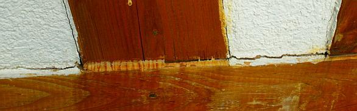\+ 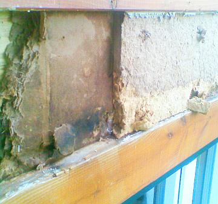\+ 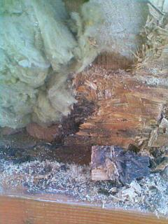 
_Die Industrielösung für das Fachwerkgefache, voll der Energieeinsparverordnung EnEV entsprechend mit allerbestem U-Wert / Dämmwert: 
Beschichtung mit wasserabweisendem Kunstharzputz auf Holzfaserplatten-Gefache, dahinter Mineralwolle-Gewöll und kunstharzverklebte Holzschnipselplatte (OSB-Platte). Die Versiegelung der unvermeidlichen Gefachefuge mit Silikon - im Fachwerk-Holzton täuschend überstrichen, ein Bravo dem Malermeister! - Alles bestens patschnass verrottend, da wassersaufend und schimmelpilzfördernd bis zum Totalverfall der Fachwerkbalken. Vorzustand und nach Freilegung/Öffnung/Ausbau des schimmelig-muffig bis in die Innenräumen herumstinkenden Gefacheinnenlebens._

Wobei die Gefachreparatur unbedingt zement- und traßhaltigste starrste, feuchterückhaltende und schadsalzreiche Mauermörtel auf, an und unter die arg weichen, rißvermeidend elastischen Luftkalkmörtel des Bestands draufsetzen muß. Immer möglichst andere Steinsorten verwenden! Auf blöde Formatanpassung an schrägen Holzverlauf unbedingt bzw. weitestgehend bitte verzichten. Weil doch immer gar zu bald das freche Brotzeitglöckerl läuten will! Vor mi a zwaa Läberkäissämpln mäd Gurggn, am Sänft un zwa Byr!

### Gute Beispiele aus dem Auftragsbuch denkmalerfahrener, -empfohlener, -geförderter und belobigter Planer, Zimmerleute und Maurer:

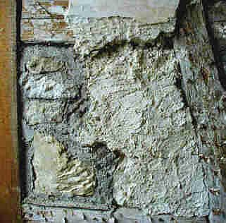+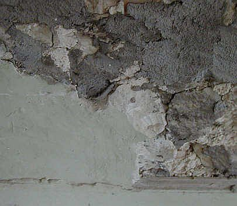+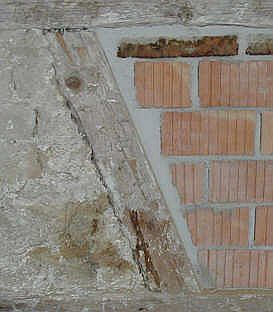 
_Ach wie schön, wasserspeichernd chromatgesund und würzig schadsalzhaltig der blaugraue[Zement](2beton.md#zement) in seinem reichen Farbenspiel mit handwerklich unübertreffbarer Noblesse! Das kann nur noch durch schimmelpilzbefallene naßdicht absperrende und ewig feuchterückhaltende, rißfreudige Stroh-Lehmgefache übertroffen werden! Aus denen hin und wieder auch mal das Getreide (Dinkel? Hafer? Gerste? Weizen? Emmer? Mais? Reis?) ökogrün rauswuchert. Alles schon gesehen. Sie auch?_

### Ein noch besseres Beispiel für die kostengünstige Fachwerksanierung, selbstverständlich nicht vom Zimmermann, sondern nach Maler-/Putzer-/Gipser-/Stukkateur-Bauweise. Billig-Denkmalpflege in Bayern heute (2009):

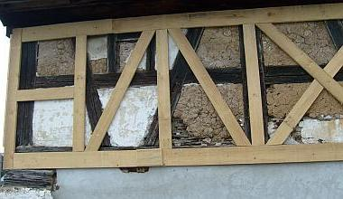+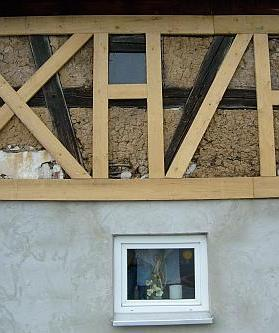+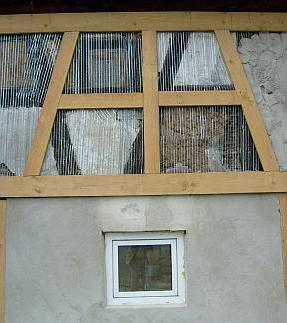+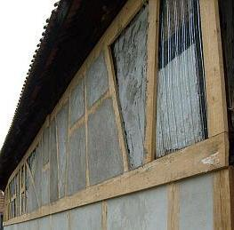+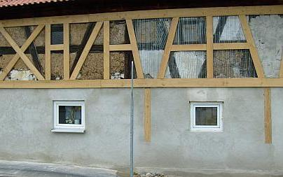+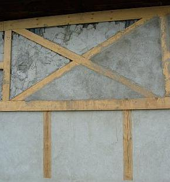 
_Unübertrefflich der das Original so dermaßen dialektisch verhohnepiepelnde Einfallsreichtum des Handwerksmeisters bei der jedes Vorbild sprengenden,nein, geradezu auf den Kopf stellenden Gestaltungsunordnung seiner Fachwerkimitation. Daß die so knstvoll geschreinerten "Gefachelchen" dann durch trocknungsblockierenden und sich flugs von der Brettlkante ablösenden und dann kapillar regensaufenden Zementmörtel zugeschmiert werden, darauf dann wasserabweisende und feuchtestauende Plastikpampensoße (pardon: Markenmaterial aus deutscher Bauchemieproduktion!) - ist doch selbstverständliche Übung und Ehrensache! 

Fein durchdacht, die kondensaterzwingende, nicht hinterlüftete Luftschicht durch "trockenen", will sagen unvermörtelten Vorbau der Vorsatzschale aus Brettfachwerk. Sehr, sehr lustig auch die äußersten, unübertreffbaren Gestaltungswillen verratenden "Lösungen" Pro & Kontra Fensterln. Das ganze zum Zeitpunkt der Aufnahme geradezu ein Kabinettsstückchen aus dem Lehrbuch des Meisters für Putzer- und Malerlehrbuben an Fachwerkfassden. Genau hingucken lohnt! 

Und die Fensterla im Erdgeschoß? Aus Plastik - man gönnt sich ja sonst nix. Das war aber der Schreiner! Alle dürfen ja ans Fachwerkhaus ran - Kompetenz und 25 Prozent weniger Lichteinfall als vorher garantiert, für was gibt es denn die elektrische Beleuchtung (künftig mit Energiesparlampen!)? 

Was fehlt? Die "gesetzlich vorgeschriebene" Wärmedämmung! Aber freilich kommt die als wassersaugende Schimmelpilzbrut-Innendämmung dran. Man will doch auch Energie sparen, wenn man sonst schon am Notwendigsten fleißgst eingespart und ansonsten keinen Aufwand gescheut hat ... 

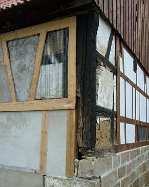+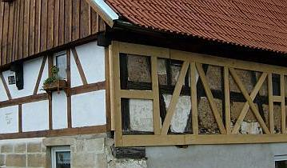 
Da ist der dorische Eckkonflikt ein Klacks dagegen, wa? "Heureka!", möchte man dem lattigen Meister des Brettlwerks zurufen. 

+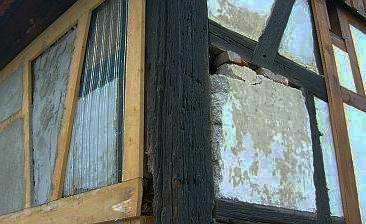 
Wobei auch die Maurerkunst bei der Gefachereparatur ihre geschichtlichen Pfusch-Spuren hinterließ: Wassersauge-Kunststein, früher die erste Wahl bei technisch falschen Ausfachungen. Und heute? Dreimal dürfen Sie raten ..._

[Noch weiter? Hier!](29bau17.md)
