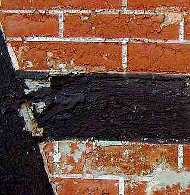
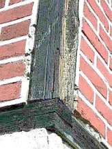
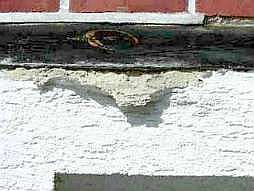
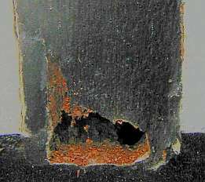

[🠔 Zur Übersicht: Wand & Fachwerk](29bau09.md)  
# Woran erkennt man den Fachwerk-Experten?
**Wie finden Sie den besten Fachwerkexperten? Todsichere Tips, reich bebildert. (2)**  
_von Konrad Fischer • aktualisiert 02.10.2009_

 Altbautaugliche Verfahren und Baustoffe 

## Fachwerkrestaurierung [17]

Die Kapitel 9-10 wurden in folgende Unterkapitel aufgeteilt - **9. Natursteinrestaurierung** : [[1]](29bausto.md) [[2]](29bau02.md) [[3]](29bau03.md) [[4]](29bau04.md) [[5]](29bau05.md) [[6]](29bau06.md) 
**Steinboden** : [[7]](29bau07.md) 
**Reinigungstechnik** : [[8]](29bau08.md) 
**10. Wandbildner im Vergleich** : [[9]](29bau09.md) [[10]](29bau10.md) [[11]](29bau11.md) [[12]](29bau12.md) [[13]](29bau13.md) [[14]](29bau14.md) [[15]](29bau15.md) 
**10.a Fachwerk/Blockbau** : [[16 - Die schärfsten Tipps zur Fachwerkrestaurierung: Woran erkennst Du einen Fachwerk-Experten?]](29bau16.md) **[17]** [[18]](29bau18.md) [[19.1]](29bau19.md) [[19.2]](29bau192.md) 
**Bodenaufbau/Holzboden** : [[20]](29bau20.md) 

**(aktualisiert 2.10.09)**

## Woran erkennt man den Fachwerk-Experten?

( [Vorige Seite 1-7](29bau16.md)) 

8. Gefacheoberflächen der Fachwerkfassade müssen mit möglichst [wasserabweisenden Verputzen und Anstrichen](23bausto.md) blockiert werden. Am besten auf Lehmgefachen, denn [Strohlehm soll ja Rauch verzehren und feuchteausgleichend, feuchtepuffernd und überhaupt sein](29bau10.md#lehm) - ein Alleskönner. Deswegen dichten kluge Leute, und nur solche finden wir beim Sanieren, Umbauen, Modernisieren und Instandsetzen von Fachwerkhäusern, auch gerne, vorzugsweise und unbedingt mit Lehm ab, wenn schon wärmegedämmt und wärmegedichtet werden soll und muß, egal, wat dat kost: Deiche + Teiche, Fundamente und Baugruben, Deponien und die zu vermorschende Luftdicht-Fachwerk-Bude. So lehmnazibraunverschmiert macht EnEV-Denkmalpflege erst so richtig Spaß. 

Deswegen haben Sie auch immer den Amtlichen Denkmalpfleger/Denkmalschützer auf Ihrer Seite, wenn Sie ihr einst so dünnes und winters perfekt trockenzuhaltendes Fachwerkwändle nun mit ewig nasser Leichtlehmpampe auch innen teuerst berucksacken (wir kommen noch drauf). Denn wir können ja heute alles besser, als die doofen Meister von anno dunnemals. Und die hervoragendsten Denkmalpfleger machen sich nun landauf und landab dran, für die Bedienung der Lehmpampenszene und deren professionelle Vergewaltigung der einst sinnvoll konstruierten Fachwerkwand mittels Leichtlehm/ Dämmlehm extra Fördermittel einzufordern, alles nach dem so arg zeitgeildoofen Motto: "Denkmalschutz ist Klimaschutz ist Denkmalschutz" oder so. 

Wenn's dann auch im Bio-Fachwerk-Haus dank denkmalgestützter und zuschußgeförderter Energieeffizienz-Sanierung so richtig angenehm muffig schimmelt und pilzt, krabbelt und mieft - eben EnEV + Öko = Denkmalpflege heute! 

Gut ist auch Bims und Gasbetonstein für's Gefach. Das hält auch wie Lehm das Wasser zurück ohne Ende und will nie richtig trocknen wie Ziegel oder Luftkalkmörtel. Den Energiespar-Denkmalpfleger haben Sie dabei bestimmt auch auf Ihrer Seite. Denn mit derartigen Ersatzbaustoffen spart er ja Förderung bzw. Zuschußmittel für sonstige Angriffe auf den Denkmalbestand. 

Dann auf den Lehm unbedingt wassersaugenden/wasserrückhaltenden zementären und / oder kunstverharzt-trocknungsblockenden Spezial-Putz drauf, bis auf Null auf die rohen Holzflächen aufgeschmiert und bitte immer ohne kapillarbrechenden Kellenschnitt. Die damit verringerte Regenwasseraufnahme im Gefach garantiert die maximale Regenwasserbeflutung der Kapillarfuge Gefach-Holz. Von dort wird es dann auch nicht mehr übers Gefach kapillar rausgetrocknet. Daß "diffusionsoffen-kapillardichte" Mörtel und Anstriche sehr wohl täglich Kondensat und nach ihrer baldigen Versprödung durch ihre Kapillarrißsysteme auch Regen aufnehmen, wird vornehm verschwiegen. Denn sonst könnte der Fachwerkbesitzer ja fragen, wie eingedrungene Nässe durch derartige Blockaden wieder möglichst schnell herauskommen soll? 

 
Hier offenbart sich des immer mindestsatzunterschreitenden Pfarrhausplaners und günstigen Kirchenmalers ganze Kunst. 
Seit ewigen Zeiten treu für Kirchbehörde, Denkmal und sogar Fachwerk herumwurstelnd. 
Ach so gute Leute.

 
Manchmal täuscht nur die Fugenweißfarbe im Gefache des Fachwerks Luftkalkmörtel vor. Was hier abfriert, ist aber zementär.

 
Was eine wirklich gute Plastikpampe aus Acrylat, Silikonharz oder PVA (Polyvinyacetat) ist, hält nicht nur eingedrungene Feuchte maximal zurück, auch die abgefrorenen Putzbröckli!

Die Augenauswischerei mit Dampfdiffusionswerten hat für die Bauteiltrocknung Null Bedeutung. Der [Kapillartransport von Wasser](2ivo.md#resistenzfaktoren) ist nämlich um den Faktor 1000 größer. Das verschweigen die Farb- und Putzheinis. Fachwerkexperten wären ja schön blöd, wenn sie nicht für ständigen Nachschub von Sanierungsschäden sorgen würden. Warum auch traditionsbewährte [Luftkalkmörtel](2kalk.md), wenn es salzreiche traß-, zement-, NHL-hydraulkalk- und kunstharzverschnittene Pampen gibt, die begierig die durch Kondensat bzw. Regen eingedrungene Feuchte zurückhalten, bevor sie knallhart von der Wand springen? Und im Falle der Dispersionstunken beste Lebensgrundlagen für Beschimmelung bieten (pH-Werte so um 8 herum).

9. Altanstriche, meist auf Kunstharzbasis, werden teuer mit holzschädigenden Techniken ([Abschleifen, Abdampfen, Ab-(wirbel-)strahlen, Abfräsen, Abbrennen, Abbeizen mit CKW/Alkali-Beizen](29bau08.md#reinigungsverfahren)) abgenommen. Warum sollte man auch chemiefreie Entlackungstechnik ohne Feuchte, Hitze und Dreckbelastung benützen?

 
_Sehr gerne verdient der Zimmermann an der Malerintelligenz. 
Ganze Fachwerkstädte können so durch fleißige Malermeister kaputtsaniert werden: 
Hausschwammdestruktion und folgender Trotzkopfbefall im kaputtgestrichenen Eichenfachwerk. 
Gefunden unter Spachtelmassen durch gezielte Suche bei einer [Bauberatung](2berat.md)._

10. Neuanstrich der Fachwerkhölzer mit schichtbildenden wasser- und trocknungsblockierenden harzhaltigen Anstrichsystemen. Sie folgen weder den künftigen Holzbewegungen, noch lassen sie die in Risse eindringende Nässe möglichst schnell raus. Vorsichtshalber bitte nur die Sichtfläche beschichten. So kann über die unbeschichteten Seiten und die dort hingeschmierten Trockenblockermörtel möglichst viel Wasser in das Holz reinfließen und die dichten Anstriche zu volldurchmorschten Schweinsblasen aufpumpen. Warum auch den menschlichen (Handwerk+Fachwerkexperten), tierischen (Insekten) und pflanzlichen (Pilze) Holzschädlingen mit trocknungsfördernden und wartungsfreundlichen [reinen Ölanstrichen](2oel.md) die Lebensgrundlage - feuchtes Holz und versprödende, wasserstauende und schichtbildende Anstriche - entziehen? Wir sind doch alle Freunde! Und der Bauherr hat den schwarzen Peter (auch A...karte genannt ;-))

11. Heizung mit wanddurchfeuchtender Umluftverpestheizung, während winterlicher Bauphase getoppt durch wasserspeiende Gasheizlüfter. Niemals [Hüllflächentemperierung](7temper.md), die Kondensatdurchfeuchtung, Beschimmelung, Hausschwammbefall und erhöhte Lüftungswärmeverluste ausschließt. Wie bekommt man denn sonst den heulenden Schwamm (Serpula lacrymans) in die kondensatgefährdeten Balkenauflager, wenn nicht durch falsches Konvektionsheizen? Und wenn schon Strahlungsheizung, dann maximal teuer und schlau: Erst nasse Lehmpampen dem armen Fachwerkwändlein vorgepampt: Dann im nassen Lehmputz (Lehminnenschale mit holzhackverscnitzelter Leichtlehm-"Isolierung") energievergeudende Heizschlangen ohne Ende, damit das erste Näglein das System lahmlegt, eine künftige Technikerneuerung einem Hausabbruch gleichkommt. Und dann dank irrer Wärmeableitung und Wärmewegspeicherung in der unsinnigen Lehmschale dreifach Heizkosten als nötig, um das arme Fachwerkwändlein im Inneren kräftig auf Schwung zu bringen. Das ganze dann dem vertrauensseligen Bauherrn als "Wärmedämmung" und Energieeinsparung" verkauft. Expertengestützt von "Altbaufachleuten" (vielleicht an der Kostensteigerung beteiligt?). Warum auch einfach, wenns doch so dolle kompliziert geht!

[Weiter? Hier!](29bau18.md)
