[🠔 Zur Übersicht: Wand & Fachwerk](29bau09.md)  
# Woran erkennst Du einen Fachwerk-Experten?
**Tipps und Hinweise, um einen qualifizierten Fachwerkexperten zu erkennen und häufige Fehler bei der Restaurierung von Fachwerkhäusern zu vermeiden.**  
_von Konrad Fischer • aktualisiert 05.11.2009_

 Altbautaugliche Verfahren und Baustoffe 
Kapitel 9. Natursteinrestaurierung, 10. Wandbildner im Vergleich und 10.a Fachwerkinstandsetzung 

## Fachwerkinstandsetzung [18]

Die Kapitel 9-10 wurden in folgende Unterkapitel aufgeteilt - **9. Natursteinrestaurierung** : [[1]](29bausto.md) [[2]](29bau02.md) [[3]](29bau03.md) [[4]](29bau04.md) [[5]](29bau05.md) [[6]](29bau06.md) 
**Steinboden** : [[7]](29bau07.md) 
**Reinigungstechnik** : [[8]](29bau08.md) 
**10. Wandbildner im Vergleich** : [[9]](29bau09.md) [[10]](29bau10.md) [[11]](29bau11.md) [[12]](29bau12.md) [[13]](29bau13.md) [[14]](29bau14.md) [[15]](29bau15.md) 
**10.a Fachwerk/Blockbau** : [[16 - Die schärfsten Tipps zur Fachwerkrestaurierung: Woran erkennst Du einen Fachwerk-Experten?]](29bau16.md) [[17]](29bau17.md) **[18]** [[19.1]](29bau19.md) [[19.2]](29bau192.md) 
**Bodenaufbau/Holzboden** : [[20]](29bau20.md) 

**(aktualisiert 5.11.09)**

[(Tipps 1-11)](29bau17.md)

12. Nachträgliche Dämmung innen oder außen nach Tabellen- und Rechenintelligenz ohne Energieersparnis und Verstand für praktische [Durchfeuchtung und Speicherwirkung der Wandkonstruktionen](7wdvs05.md#wã¤rmedã¤mmung). Geballtes Unverständnis gegenüber traditioneller Konstruktionskunst. Erzwingen von Bauschäden durch normierte Veränderung, Ersatz und Zerstörung bewährter Bauweise - unter Dauerbeschwörung der [Klimaapokalyptik und sonstiger Wahnvorstellungen der Ökoreligion](7wdvs04.md). Einbau überdichter Fenster, die der Bude Durchfeuchtung vorprogrammieren. Einbau von Lüftungstechnik, die dem Bewohner Sick-Building-Syndrom, Asthma und Allergie gönnt. Dämmtechnische Bekämpfung von schimmelempfindlichen "Wärmebrücken", ohne zu bemerken, daß nur der reduzierte Konvektionsheizluftstrom in den Ecken und Kanten des Raums dort für kühlere Oberflächen, das [überdichte Isofenster](23bausto.md) für überhöhte Luftfeuchte und beides zusammen für Kondensat und [Schimmel ](7schim.md)sorgt. Frei nach dem Motto: Dämmen for Dummies. Sinnlose Dämmung im Fußbodenaufbau, da man von der sich dort zwangsläufig entwickelnden "Wärmelinse" nach Prof. Klopfer noch nie gehört hat. Der Investor/Käufer/Mieter zahlt´s ja, die Behörde bezuschußt das und der Planer ist doch dort so wohlgelitten. Was braucht der denn den Bauherrn - na außer als Opfer vielleicht.

Dieser kleine Querschnitt durch Intelligenz bei der Fachwerksanierung ist nicht gerade selten, ob mit oder ohne öffentliche Förderung und Beratung, wiederzufinden. Prüfen Sie selbst! Und zahlen Sie weiter ohne Murren. Jeder bekommt doch das, was er verdient. Wenn Sie sich für Fachwerkschäden durch Wahnvorstellungen der "Experten" interessieren, fragen Sie nach in den Freilichtmuseen. Dort führt man es teils recht gern vor, wie doktorierte Zimmerbaukunst nach wenigen Jahren immerhin als abschreckendes Beispiel dient.

Oder Beispiel Leonberg: [Eröffnung der neuen Galerie verschoben - historische Pfleghofscheune vom Schimmelpilz befallen](2134bau.md#folgenschwere)

Daß sogar im Umfeld des WTA die dämmbedingten Schäden an Fachwerkbauten langsam aufstoßen, ist erfreulich. Gleichwohl kann es nicht befriedigen, wenn von Normengläubigen nach wie vor propagiert wird, den U-Wert-Dämmblödsinn nun halt in abgespeckter, sozusagen gemäßigter Form den armen Fachwerkhäuseln aufzuzwingen. Typisches Beispiel aus Dipl.-Ing. Frank Eßmann, Dipl.-Ing. Jürgen Gänßmantel, Dipl.-Ing. Gerd Geburtig: _"Energieeinsparung bei historischen Gebäuden - Möglichkeiten und Grenzen, Praktische Anwendung der EnEV 2002 auf Fachwerkaußenwände (aus: bauen mit holz 9/2002): ... Fachwerkbauten mit ihrem im Bestand eher reduzierten Wärmedämmstandard ... Werden Fachwerkwände ersetzt, so ist in der Regel die erforderliche Wärmedämmung nach [EnEV-Tabelle 1-] A2 (Außenseitige Bekleidung) bzw. A6 (Ausfachung) zu dimensionieren. ... Werden außenseitige Bekleidungen ... angebracht, sind Wärmedämmungen von etwa 10 cm (bei WLG 040) hinter diesen anzuordnen. Im Allgemeinen werden hierfür Faserdämmstoff-Platten verwendet. ... bei Erneuerung des Außenputzes eine zusätzliche Dämmung erforderlich (mindestens 7 cm bei WLG 040). ... Dämmschichtdicken nach WTA-Merkblatt 8-1-96/D ... sind zu empfehlen ... "_

Auch am historischen Fachwerkrathaus in Burgkunstadt, Oberfranken, schlug die Norm-Bauphysik in trauter Gemeinschaft mit dem Norm-Holzschutz erbarmungslos zu: 

Das Obermain-Tagblatt berichtet am 24.07.07: 

_"Verzögerung bei der Rathaussanierung - Stopp der Zimmererarbeiten wegen Schadstoffen / Belastung der Hölzer auch im Neubau mit PCP und Lindan ... Die Zimmererarbeiten am historischen Rathaus wurden nach einem erfolgreichen Beginn der Sanierung ... eingestellt, nachdem überraschend_ [KF: Ei der Daus! Hätte man nicht - wie sonst üblich - vor einer Sanierung entsprechende Voruntersuchungen anstellen können?] _Schwierigkeiten aufgetreten sind. Die Hölzer nicht nur im historischen Altbau, sondern auch im Neubau sind mit den Chemikalien PCP und Lindan belastet. ... Bei den Zimmererarbeiten klagten die Arbeiter ... über Atemprobleme und Schwellungen der Schleimhäute. Auch Architekt ... und seine Mitarbeiterin litten nach längeren Aufenthalten auf der Baustelle unter einem anhaltenden bitteren Geschmack im Mund und Kopfschmerzen. ... Messergebnisse der Stichprobe aus Holz und Staub teilweise stark überschrittene Grenzwerte bei den Chemikalien PCP und Lindan ... waren für den Ende der 1970er Jahre in Holzständerbauweise errichteten Anbau mit Holzschutzmitteln imprägnierte Balken, Bretter und Fensterrahmen verwendet worden, während das zum Teil noch aus der Barockzeit stammende Holz im Altbau nur nachträglich mit den gefährlichen Farben gestrichen worden war. Betroffen sind im Altbau vor allem das Dachgeschoss, der historische Sitzungssaal und die Büroräume. ... Teuer wird die Sanierung durch die nicht eingeplante Beseitigung der Schadstoffe ... Bohrlöcher zeugen noch von der Imprägnierung der Dachbalken mit den schadstoffbelasteten Holzschutzmitteln in den 1970er Jahren ..._ 

Wobei die derzeitige Sanierung ausgelöst wurde durch die geniale Innendämmung der Fachwerkfassaden. Austropfende schmierige Flüssigkeit machte die Mitarbeiter der Stadtverwaltung darauf aufmerksam, daß es nicht so ganz stimmte mit ihrer denkmalgeschützten Fachwerkwand. Nach deren Öffnung offenbarte sich das Desaster in ganzem Ausmaß: Vermorschungen der historischen Hölzer ohne Ende. Und auch der wettbewerbsgekrönte Neubau - ein Holzständerbau in "moderner" Formensprache und Bauweise - war von der um sich greifenden Verrottung schwer betroffen. Der Gipfel der Normanwendungen: Allet totalimente vergiftet. 

Und heute? Na freilich bauen alle Normwüstlinge noch prinzipiell genauso. Fragen Sie Ihren Abfallentsorger, in welche Sondermüllkategorie ein mit heutzutage zugelassenen Giftpräparaten "geschütztes" Holz fällt. Dat kost! Und fragen Sie den Schwachverständigen Ihres Vertrauens, was das Kondensat in den heute ebenso üblichen Dämmstoffverbauten im Fachwerkbau und sonstwo nach einigen Jährlein macht. Nein, wundern Sie sich nicht: Nach der klassisch genormten Sanierung ist Ihr Bauwerk eine Sondermülldeponie ekelhaftester Prägung und die Dämmschicht abgesoffen. Glückauf! Und sparen Sie bitte schon mal fett Kohle an für die zwangsläufig folgenden Sanierungen der Normsanierung! Die dann profimäßig vorbereitet und durchgeführt dermaßen Kostenexplosionen vorprogrammiert und dann auch auslöst, daß sich die Presse - hier das Obermain Tagblatt Lichtenfels vom 18.10.2009 - bei der Wiedereinweihung in ominösestes beredtes Stillschweigen hüllt und den Kostenskandal kleinlaut - nein geradezu ulkig - beschönigt und tarnt: 

_"Herzstück der Stadt für weitere Nutzung präpariert 

Rathaussanierung erfolgte mit Geduld, Sachverstand und Liebe zum Detail / "Erhalt die richtige Entscheidung" / Viel Lob bei der Einweihungsfeier 

[...] Alle Redner betonten beim Festakt in der Rathaushalle, dass die Generalsanierung vom Stadtrat, der Verwaltung, den Architekten, dem Landesamt für Denkmalpflege und den am Bau beteiligten Firmen sehr viel Geduld, Sachverstand und Liebe zum Detail erfordert habe. [...] 

Landrat Reinhard Leutner überbrachte die Grüße des Kreisrats und gratulierte der Stadt zur geglückten Sanierung des Rathauses im Rahmen der 950-Jahrfeier der Stadt. Leutner zeigte sich erfreut, dass die denkmalpflegerischen Aspekte berücksichtigt worden sind und verschwieg auch nicht, dass es bei derartigen Baumaßnahmen Überraschungen gebe, die Geld kosten. [...]" _ 

Am wenigsten Geld würden derartige Überraschungen aber kosten, wenn sie durch kompetente Voruntersuchung entdeckt würden und damit in kostensicherer öffentlicher Ausschreibung vergeben und nicht nach Regiestunden ... 

Es ist schon schlimm, wie Bauphysik und die wohl durch nichts zu übertreffende [Ahnungslosigkeit vieler öffentlicher, kirchlicher und privater Auftraggeber](4behoerd.md#gro) immer wieder zu Fehldeutungen, Veruntreuung und Vergeudung öffentlicher Mittel und Kirchensteuern sowie sinnloser Bauzerstörung Anlaß gibt. Auch vorgepampte Leichtlehminnenwände, die große Feuchteprobleme mitbringen und ewig trocknen müssen, gehören dazu. Hilft das dem wehrlosen Fachwerkmassivhausbesitzer? Was ist von der "Vorsicht vor Feuchteschäden"-Begleitmusik, die Normenflüsterer seriösitätseinflößend einstreuen, eigentlich zu halten? 

Der Gipfel:_"... Wärmebrücken sind besonders zu berücksichtigen. ..."_. Als ob es solche immer dort gäbe,wo es die Berechnung vermutet! Daß der als Wärmebrückenfolgen verdächtigte Schimmelpilzauswuchs in Ecken und Wand-Boden/Decken-Zwickeln in Wahrheit von heizluftunterversorgter Unterkühlung dieser Bereiche bei gleichzeitig überhöhter Feuchte kommt - Standard bei gummilippendicht-isolierglaszerstörten Wohnräumen mit bau- und bewohnerzerstörenden Heizluftkonvektion anstelle [Hüllflächentemperierung](7temper.md) - hat sich in solche "Fachkreise" noch nicht herumgesprochen. Bis dahin - Vorsicht ist die Mutter der Porzellankiste.

Vorsicht auch vor den Bescheiden der Baugenehmigungsbehörden / Unteren Denkmalschutzbehörden, soweit diese äußerst wohlmeinend, aber dummerweise im Normensinn, unsinnig, denkmalbeschädigend und teils ganz und gar industriehörig auf Baustoffe und Baukonstruktionen baurechtlich Einfluß nehmen wollen. Das kann ganz schnell ins Auge gehen und Superpfusch zur Weihe der Altäre des Denkmalkults erheben. Ein besonders mieses, gleichwohl ganz und gar nicht untypisches Beispiel aus einer (mir anläßlch einer [Bauberatung](2berat.md) vorgelegten "Denkmalrechtlichen Erlaubnis der Unteren Denkmalbehörde (UDB) gem. § 9 Abs. 1a und b Denkmalschutzgesetz DSchG NW GV 1980 S. 226" für den Umbau und die Sanierung eines denkmalgeschützten Fachwerkhauses in Nordrhein-Westfalen, wie es freilich geradezu überall in unserer ganzen Bundesrepublik vorkommen könnte und auch vorkommt: 

_"Auflagen denkmalgeschützter Altbau: 

1. Dach ... 
1.3 ... Das Oberbrett [des Holzwindborts am Ortgang] kann mit kleinformatigen,deutschen Naturschieferplatten bekleidet werden. ... 
1.8 Kaminköpfe sind mit einem Traßkalkputz - glatt abgerieben - ohne Farbzusatz zu verputzen. ... 

2. Fassaden 
2.2 Die Außendämmung hinter der Holzbekleidung ist auf max. 50 cm zu beschränken. Der genaue Wandaufbau (Abmessungen, Materialien) ist der Unteren Denkmalschutzbehörde vor Ausführung zur Prüfung und Genehmigung vorzulegen. 
2.3 Im Bereich der Sichtfachwerkfassade ist eine Innendämmung mit einem mineralischen Dämmputz in einer Stärke von max. 6 cm auszuführen. ... 
2.7 ... Die Gefache sind außen mit einem Traßkalkputz auszuführen ... 
2.8 Fachwerkhölzer sind mit einer Dickschichtlasur im Farbton schwarz-braun RAL 8022 zu streichen. Die Gefache sind mit einer Dispersions-Silkatfarbe im Farbton weiß zu streichen. ... 

4.Maßnahmen innerhalb des Gebäudes ... 
4.5 Für den Innenputz ist ein Lehm- oder Traßkalkputz zu verwenden und mit einer Kalk- oder Silikatfarbe zu streichen. ... 

Die _Nichtbeachtung dieser Nebenbestimmungen_ ... stellt eine **Ordnungswidrigkeit** gem. § 41 DSchG NW dar, die gemäß § 41 Abs. 2 DSchG NW geahndet werden kann. ..."_ 

Ja Sackerl Zement, da bleibt wirklich Baustoffkundigen schon a bisserl die Spotze weg: [Trocknungsblockierende Dispersionspampen bzw. Pseudo-Mineralfarben](22bausto.md) (Silikatfarbe=Dispersions-Silikatfarbe!) für Putz und Gefache, [Dickschichtlasur aus supersperrenden, wassersaugend-aufcraquelierenden Kunstharzschwarten auf den bewitterten Holzoberflächen](2oel.md) und als Gipfel der denkmaltypischen Rezepturkunst [Mörtel mit hydraulischen (Traß) und hochhydraulischen (undeklarierter Zement in so gut wie jedem Traßmörtel!) Bindemitteln](2beton16.md) als gesetzlich geschützte und bußgeldbewehrte Vorschrift der ach so materialkundlich wohlmeinend denkmalschützenden Bauverwaltung! Wenn auch die "50 cm" Außendämmung auf eine fehlerhafte Abschrift der zugrundeliegenden Schreibvorlage zurückgehen mögen, der Rest ist mit an Sicherheit grenzender Wahrscheinlichkleit bierernst gemeint! Bestimmt auch die konstruktionsgefährdende Idee der "Innendämmung", die ohne ausreichende Feuchteablüftung und stetiger Trockenheizung der Außenwände deren Auffeuchtung und Zerstörung geradezu vorprogrammiert. 

Fragt sich nur, aus welchem Kostenlos-Seminar der Baustoffindustrie, aus welchem Verkaufskatalog des industriellen Pharmareferenten-Sanierberaters / Produktberaters bzw. durch welche sonstig gelungene Kundenmanipulation des herstellereigenen Vertriebsmitarbeiters derartig denkmalfeindliche Wahnvorstellungen Eingang in die Behördenvorschriften der Unteren (oft leider allzuoft auch sonstiger) Denkmalbehörde finden konnten? Daß dann "deutsche" Naturschieferplatten gefordert werden,läßt in diesem Fall auch vermuten, daß die [negativen technischen Eigenschaften so mancher deutscher Naturschiefer-Provenienzien](212bau3.md) nicht bekannt sein dürften ... 

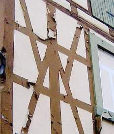 
Putzfassade oder Fachwerk? 
Beides, meint der brave Handwerksmann und zeigt, was in ihm steckt. 
Und in den superthermodehnfähigen Kunstharzschwartenfarben auf mineralischen und hölzernen Untergründen. 
Leider erst nach Ablauf der zweijährigen Gewährleistungsfrist.

Zum Thema Verputz muß jedoch klar sein: Auch bei allen Mühen um Perfektion wird es den rissefreien Fachwerkbau nie geben. Das muß dem Bauherr rechtzeitig klargemacht werden. Innen- und Außenputze über Fachwerkhölzern und Deckenbalken sind auch bei der Anwendung von teilweise untergrundentkoppelten Rohrmattenputzen (sie ermöglichen schlitzlose Elektroinstallation und den Erhalt der Altputze/Putzfragmente), gut geführten Kellenschnitten und sonstigen Bewegungsfugen nicht ganz ausschließbar. Ein Fachwerkbau lebt - und Holz bewegt sich eben. Vor allem, wenn das Bauwerk längere Zeit unbeheizt dastand, damit Holzfeuchten von 15-25% annehmen konnte und nach Betrieb über einige Jahre wieder auf 7-10% Holzfeuchte runtertrocknet. Na und? Schlimm ist das nur für Energiesparheinis, deren bösartig abdichtende Dampfsperren sich nach kurzer Zeit als zielgenaue Befeuchtungskonstruktionen entpuppen. Seit wann wären denn Fugendichtungen jemals dauerstabil? Na also.

[Fachwerk.de](http://www.fachwerk.de)- schön gemachte private Fachwerkseite mit Bauherrenforum (und teils mehr als ulkigen (industrieabhängigen) Antworten) 
Zu einigen meiner Forumsbeiträge im dortigen Fachwerkforum - Interessante Fragen, DIY-Bastelhinweise und Fachkompetenz im Wettbewerb: 
[Mein Profil auf Fachwerk.de](http://www.fachwerk.de/goProfil.html?id=2061) 
Bausanierung allgemein 
[Kein Fachwerkhaus aber genug Sorgen.](http://www.fachwerk.de/goForum.html?id=31645) <> [Laie sucht seriösen unabhängigen Profi](http://www.fachwerk.de/goForum.html?id=33377) <> [Kosten für Architekt](http://www.fachwerk.de/goForum.html?id=33271) <> [Fachwerkhaus, wie findet man Mängel?](http://www.fachwerk.de/goForum.html?id=34431) <> 
Gestaltung 
[Flachschnitzereien auf Eckständer](http://www.fachwerk.de/goForum.html?id=31222) <> 
Energiesparen an Dach und Wand 
[Isolation / Wärmedämmung Steinhaus](http://www.fachwerk.de/goForum.html?id=31058) <> [Altbau Wärmedämmung zwecks Energieeinsparung](http://www.fachwerk.de/goForum.html?id=33574) <>[ Ab wann muß man ein Haus dämmen](http://www.fachwerk.de/goForum.html?id=33521)? <> [Wärmedämmung meiner Scheune in Ostfriesland](http://www.fachwerk.de/goForum.html?id=29971) <> [Dachgeschoßausbau einer Scheune](http://www.fachwerk.de/goForum.html?id=29904) <> [Dämmen bei "alternativem" Dachausbau](http://www.fachwerk.de/goForum.html?id=31214) <> [Kd2 Glaswolle oder normaler Klemmfilz?](http://www.fachwerk.de/goForum.html?id=31506) <> [Rigips vor Fachwerk ok?](http://www.fachwerk.de/goForum.html?id=31639) <> [Rigips mit Styropordämmung und Ohne, einige Fragen???](http://www.fachwerk.de/goForum.html?id=31772) <> [(Innen-) Dämmung eines Windfangs mit Ziegel-Sichtmauerwerk](http://www.fachwerk.de/goForum.html?id=31865) <> [Kosten für Aussendämmung](http://www.fachwerk.de/goForum.html?id=32348) <> [Innendämmung von Fachwerkhaus](http://www.fachwerk.de/goForum.html?id=90779 ) <> [Innendämmung von Lehmaußenwand im Bad](http://www.fachwerk.de/goForum.html?id=31495) <> [Altbaudachdämmung](http://www.fachwerk.de/goForum.html?id=33132) <> [Aussenwände von innen Dämmen](http://www.fachwerk.de/goForum.html?id=32716) <> [Dachdämmung](http://www.fachwerk.de/goForum.html?id=32618) <> [Wandaufbau und Isolierung](http://www.fachwerk.de/goForum.html?id=33726) <> [Welches Material für Sparrendämmung?](http://www.fachwerk.de/goForum.html?id=33979) <> [Wärmedämmung auf Natursteinwand](http://www.fachwerk.de/goForum.html?id=34442) <> [Außendämmung mit Putz](http://www.fachwerk.de/goForum.html?id=34361) <> [Hanfisolierung?](http://www.fachwerk.de/goForum.html?id=33129) <> [Wärmedämmung eines Dachgeschosses](http://www.fachwerk.de/goForum.html?id=34474) <> 
Haustechnik 
[Leitungen im Fachwerk](http://www.fachwerk.de/goForum.html?id=31815) <> 
Heizung 
[Gas oder Öl??](http://www.fachwerk.de/goForum.html?id=30160) <> [Heizleisten pro/contra](http://www.fachwerk.de/goForum.html?id=29940) <> [Wandheizung für Bruchsteinhaus?](http://www.fachwerk.de/goForum.html?id=29433) <> [Wer hat Erfahrungen mit Elektro-Fussbodenheizungen?](http://www.fachwerk.de/goForum.html?id=33269) <> [Infrarot Heizsysteme](http://www.fachwerk.de/goForum.html?id=28897) <> [Wandheizung Heraklith Recycling](http://www.fachwerk.de/goForum.html?id=32485) <> 
Fenster 
[Welche Fenster?](http://www.fachwerk.de/goForum.html?id=30630) <> [Einfachverglasung - wirklich eine schlechte Idee?](http://www.fachwerk.de/goForum.html?id=18491) <> [Fenster richtig streichen](http://www.fachwerk.de/goForum.html?id=31327) <> [Günstiger Fensterbauer?](http://www.fachwerk.de/goForum.html?id=32726) <> [Fensterfarbe bei Fachwerk?](http://www.fachwerk.de/goForum.html?id=32715) <> [Haus Baujahr 1908, welche Fenster?](http://www.fachwerk.de/goForum.html?id=33862) <> 
Putz/Mörtel/Wand/Gefach/Gewände/Dach 
[Putztechniken an Bruchsteinmauer](http://www.fachwerk.de/goForum.html?id=31334) <> [Ausfachung mit Porenbeton](http://www.fachwerk.de/goForum.html?id=31847) <> [Alternativen zu Malervlies und Chemie-Kleber!](http://www.fachwerk.de/goForum.html?id=31913) <> [Ausfachung wie?](http://www.fachwerk.de/goForum.html?id=32331) <> [Fachwerkkonstruktion vor alte Wand bauen](http://www.fachwerk.de/goForum.html?id=32258) <> [Entfernung von Farbe auf Außenbalken](http://www.fachwerk.de/goForum.html?id=33500) <> [Granitmauer verfugen - Trasszement oder Trasskalk?](http://www.fachwerk.de/goForum.html?id=33309) <> [Lehmfarbe auf Gipsputz und altem Kalkputz](http://www.fachwerk.de/goForum.html?id=32298) <> [Fassade streichen, Grundierung](http://www.fachwerk.de/goForum.html?id=32445) <> [Schallschutzwand aus Beton?](http://www.fachwerk.de/goForum.html?id=33782) <> [Sandsteinmauer im Garten](http://www.fachwerk.de/goForum.html?id=33791) <> [Plastisches Mosaik an Fachwerkfassade](http://www.fachwerk.de/goForum.html?id=33765) <> [2. Wasserführende Schicht unter Dachdeckung mit Brettern?](http://www.fachwerk.de/goForum.html?id=33743) <> [Welche Farbe auf Kalk-Zement-Putz](http://www.fachwerk.de/goForum.html?id=34086) <> [Kosten Lehmgefachreparatur](http://www.fachwerk.de/goForum.html?id=33304) <> [Sandstein reinigen von Anstrich und verfestigen](http://www.fachwerk.de/goForum.html?id=34382) <> [Welche Fugenausbildung Holz-Gefach ist die Richtige?](http://www.fachwerk.de/goForum.html?id=34470) <> [versotteten Schornstein mit Lehm und Kuhdung verputzen](http://www.fachwerk.de/goForum.html?id=30186) <> [Entfernung von Farbe auf Außenbalken](http://www.fachwerk.de/goForum.html?id=33500) <> [Neue Balkonbretter - wie behandeln für Langlebigkeit?](http://www.fachwerk.de/goForum.html?id=34306) <> 
Feuchte Wände 
[Feuchte Innenwände - verstopfte Unterlüftung der Grund?](http://www.fachwerk.de/goForum.html?id=31082) <> [Feuchten Raum mit Lehm verputzen](http://www.fachwerk.de/goForum.html?id=30503) <> [Luftkalk oder hydraulischer Kalk (PM Binder)](http://www.fachwerk.de/goForum.html?id=31022) <> [Kellerinnenputz auf Basis Kaliumsilicat (Wasserglas)](http://www.fachwerk.de/goForum.html?id=30925) <> [Sandsteinhaus nicht unterkellert - Feuchtigkeitsprobleme](http://www.fachwerk.de/goForum.html?id=30746) <> [Alten Keller sanieren](http://www.fachwerk.de/goForum.html?id=31110) <> [Ammoniakgetränkte Stallwand sanieren](http://www.fachwerk.de/goForum.html?id=30477) <> [Suche Sachverständigen in Niedersachsen, Raum Harz (feuchte Wände)](http://www.fachwerk.de/goForum.html?id=32259) <> [Nasser Keller / trocknen oder nicht?](http://www.fachwerk.de/goForum.html?id=32513) <> [Sandsteinmauer / Tragendes Fundament feucht](http://www.fachwerk.de/goForum.html?id=33629) <> [Feuchte Wände](http://www.fachwerk.de/goForum.html?id=30976) <> [Beim Neubau Salpeter in Innenwänden](http://www.fachwerk.de/goForum.html?id=32767) <> [Parafin-Injektion](http://www.fachwerk.de/goForum.html?id=32947) <> [Feuchter, unisolierter Keller m. Brunnen - Dampfsperre zum EG?](http://www.fachwerk.de/goForum.html?id=31629) <> [Feuchteanstieg in einem Raum nach Wasserschaden](http://www.fachwerk.de/goForum.html?id=34056) <> [Feuchte Grundmauer](http://www.fachwerk.de/goForum.html?id=34071) <> [Schimmel auf neuem Lehmgefach](http://www.fachwerk.de/goForum.html?id=33207) <> [Sandsteinaußenmauer an einer stark befahrenen Straße neu verfugen und vor Straßenwasser schützen](http://www.fachwerk.de/goForum.html?id=34079) <> 
Fußboden/Treppe/Decke 
[Alte Vollziegel als Bodenbelag verlegt](http://www.fachwerk.de/goForum.html?id=31632) <> [Dielenboden über Lehm - welche optimale Wärmedämmung?](http://www.fachwerk.de/goForum.html?id=31011) <> [Reinigung von alten Fliesen](http://www.fachwerk.de/goForum.html?id=32434) <> [Dämmung ohne Estrich möglich?](http://www.fachwerk.de/goForum.html?id=32286) <> [Mal wieder Fußbodenaufbau und die Frage nach dem was mach ich nun ???](http://www.fachwerk.de/goForum.html?id=32182) <> [Risse in den Fliesenfugen - was nun?](http://www.fachwerk.de/goForum.html?id=33326) <> [Holzterrasse Risse](http://www.fachwerk.de/goForum.html?id=32915) <> [Bodenaufbau Holzbalkendecke](http://www.fachwerk.de/goForum.html?id=33789) <> [Holzbalkendecke wärmedämmen](http://www.fachwerk.de/goForum.html?id=32217) <> [Holzschaden durch Gußasphalt auf Holzfußboden?](http://www.fachwerk.de/goForum.html?id=26850) <> [Gussasphalt für Holzbalkendecke](http://www.fachwerk.de/goForum.html?id=31736) <> [Wie Parkett entfernen?](http://www.fachwerk.de/goForum.html?id=34087) <> [Bodenaufbau? Evtl. mit Schaumglas?](http://www.fachwerk.de/goForum.html?id=34366) <> [Sandsteinaußentreppe defekt - wie reparieren?](http://www.fachwerk.de/goForum.html?id=34350) <> [Bodenaufbau Holzbalckendecke](http://www.fachwerk.de/goForum.html?id=33789) <> 
Schimmel, Schwamm und Insektenbefall 
[Schimmel unter Latexfarbe an der Wand](http://www.fachwerk.de/goForum.html?id=31342) <> [Schimmelbefall im gesamten Haus!](http://www.fachwerk.de/goForum.html?id=31066) <> [Kleine Schimmelflecken](http://www.fachwerk.de/goForum.html?id=31758) <> [Imprägnierung, ja oder nein](http://www.fachwerk.de/goForum.html?id=30200) <> [Wie kriege ich die Holzwürmer aus der Treppe?](http://www.fachwerk.de/goForum.html?id=13447) <> [Holzwurm & Co.](http://www.fachwerk.de/goForum.html?id=31672) <> [Holzwurmbekämpfung im Ökoverfahren?](http://www.fachwerk.de/goForum.html?id=31848) <> [Befall mit Schadinsekten](http://www.fachwerk.de/goForum.html?id=32332) <> [Kleiner Käfer (kann fliegen) 3-5mm, schwarz/braun gestreift, Holzdielen ](http://www.fachwerk.de/goForum.html?id=34024)<> [Holzwürmer im Dachgebälk](http://www.fachwerk.de/goForum.html?id=33522) <> [Holzwurm für eine Ausstellung über Holzschädlinge gesucht](http://www.fachwerk.de/goForum.html?id=34027) <> [Hausschwamm](http://www.fachwerk.de/goForum.html?id=28684) <> [Wie hoch ist das Risiko eines Wiederauflebens des Schwamms nach Sanierung?](http://www.fachwerk.de/goForum.html?id=30772) <> [Hausschwamm durch Leichtlehmschüttung möglich?](http://www.fachwerk.de/goForum.html?id=31060) <> [Holzschutz Gutachter?](http://www.fachwerk.de/goForum.html?id=31758) <> [Beratung gesucht](http://www.fachwerk.de/goForum.html?id=32282) <> [Weißer Belag in Natursteinkeller](http://www.fachwerk.de/goForum.html?id=33530) <> [Knoff Hoff von Schimmelprofis ist gefragt](http://www.fachwerk.de/goForum.html?id=34314) <> [Hausbockbefall in altem Bauernhaus](http://www.fachwerk.de/goForum.html?id=34369) <> 
Abriß/Translozierung/alte Baustoffe/Verkauf/Finanzierung 
[Abriss und andernorts Neuaufbau eines gut erhaltenen Fachwerkhauses](http://www.fachwerk.de/goForum.html?id=30492) <> [Biberschwänze verkaufen?](http://www.fachwerk.de/goForum.html?id=33389) <> 
Hauskauf/Erbschaft 
[Hilfe! Bauchweh bei Kauf eines Fertigteilhauses Baujahr 1971!](http://www.fachwerk.de/goForum.html?id=29921) <> [Suche kompetente Kaufberatung](http://www.fachwerk.de/goForum.html?id=30871) <> [Suche Fachmann zur Schadensermittlung: Fachwerk-Sanierung](http://www.fachwerk.de/goForum.html?id=32458) <> [Beratung gesucht](http://www.fachwerk.de/goForum.html?id=32282) <> [Haus- und Schadensbegutachtung](http://www.fachwerk.de/goForum.html?id=32394) <> [Was kostet mich mein Lieblingshaus?](http://www.fachwerk.de/goForum.html?id=32177) <>[ Suche kompetente Kaufberatung in Nordbrandenburg/Mecklenburg-Strelitz](http://www.fachwerk.de/goForum.html?id=30871) <> [Sachverständiger/Gutachter Großraum Koblenz-Limburg](http://www.fachwerk.de/goForum.html?id=33934) <> [Erbschaft/Fachwerkhaus Anfang 1800 - Was nun?](http://www.fachwerk.de/goForum.html?id=34210) <> 
Diskussion über und mit Konrad Fischer - Freunde und andere 
[Papageien und Ventilatoren](http://www.fachwerk.de/goForum.html?id=31397) <> [Kurzmitteilung aus Meldungsdorf](http://www.fachwerk.de/goForum.html?id=32240) <> [Änderung im Forumsbetrieb](http://www.fachwerk.de/goForum.html?id=32762) <> [Gute alte Zeit - oder Heuschrecken und andere Egomanen](http://www.fachwerk.de/goForum.html?id=32817) <> [Das Fachwerk.de-Beitragsbewertungssystem (beta)](http://www.fachwerk.de/goForum.html?id=32573)

[Fachwerkhaus.de](http://www.fachwerkhaus.de), die obigen "Fachwerknachtrag" super aufgemacht hat: [Todsünden bei der Fachwerksanierung - oder: Generalabrechnung mit sog. Experten](http://www.fachwerkhaus.de/fh_haus/erfahrung/fwsani.htm#1#1) Danke! 
[Zimmmerin.de -> Über Restauro - Der Seite über Restauration im Holzbau.](http://www.zimmerin.de/portal/restauro.htm) 
**Neu:** Lehmbauseminare von Beatrice Ortlepp: [Gesund wohnen + preiswert bauen](http://www.lehm.bau.ms) - für Selbermacher, auf Wunsch auch in Ihrem Haus und mit eigenem Lehm! 
[www.weto.de](http://www.weto.de) - Holzbausoftware - auch für Fachwerkbau!

_Hier ein[Bild des Fachwerkhofs](1refernz.md#schwã¼rbitz), aus dem mein Vater stammt. Der große Bauern- und ehem. Brauereigasthof ist seit Jahrhunderten in Familienbesitz und noch nicht kaputtrestauriert. _

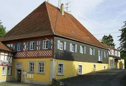 
_In diesem Fachwerkbau, eine ehem. Zisterzienser-Klostermühle in Hochstadt am Main, ist mein Büro. Der Fachwerkanbau hinten ist von meinem Vater (1974), vorne von mir geplant worden (1981), Innen- und Außeninstandsetzung ab 1987.[Ein Bild aus den frühen 60ern](muehle.jpg)_

So gehts auch, wenn man nicht immer abreissen will. Natürlich nur ohne "Fachleute", externe Holzschutzschwachverständige, Salzionenanalysierer und sonstige Mauerwerksschlechtachter (einige Fachwerk-Sanierungsprojekte meines Büros): 

+1. Barockes Torhaus vor und nach Sanierung (Dachdämmung Holz massiv!)

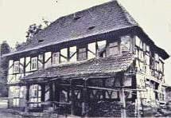+.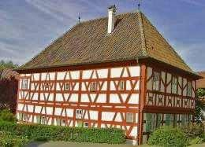.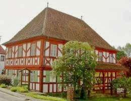.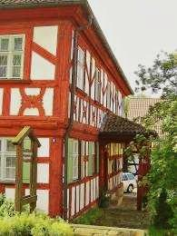2. Barockes Wohnhaus

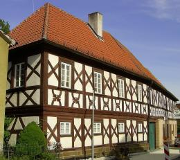3. Barocker Brauereigasthof

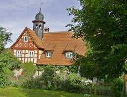.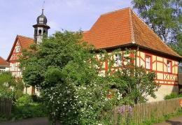.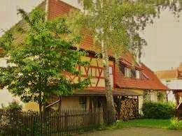4. Barockes Gemeindehaus

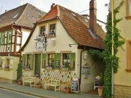.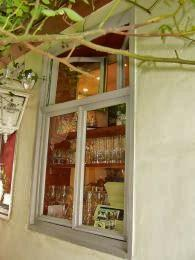.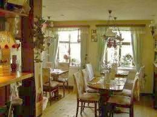.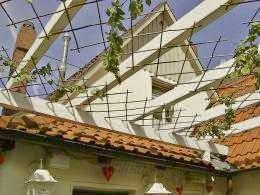5. Ehem. Schusterhäusla (Fachwerk verputzt) in Bad Staffelstein, jetzt gemütliches Restaurant für Brotzeiten und Spezialitätengastronomie mit ca. 50 Plätzen

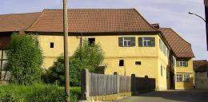6. Ehem. Gasthof zum Stern (Barockfachwerk verputzt) in Schwürbitz, Außeninstandsetzung (hier lebte meine Familie und war das erste Architekturbüro meines Vaters 1957-62)

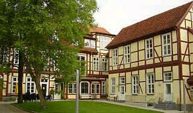7. Konservatorium im ehem. Ministerpalais in Schwerin ([mehr Bilder vor und nach Sanierung](2berat.md#5.+6.))

[Hier weiter: [Kapitel 19]](29bau19.md)
