[🠔 Zur Übersicht: Wand & Fachwerk](29bau09.md)  
# Fachwerkrestaurierung, Hausschwammbefall und Hausschwammsanierung [19.1]
**Hausschwammbefall in Altbauten ist oft von Mythen und Profitmacherei umgeben. Erfahren Sie, wie Profis Bauherren mit unnötiger Panik ausnehmen und warum die gängigen DIN-Normen nicht immer die Wahrheit abbilden.**  
_von Konrad Fischer_

 Altbautaugliche Verfahren und Baustoffe 

Die Kapitel 9-10 wurden in folgende Unterkapitel aufgeteilt - **9. Natursteinrestaurierung** : [[1]](29bausto.md) [[2]](29bau02.md) [[3]](29bau03.md) [[4]](29bau04.md) [[5]](29bau05.md) [[6]](29bau06.md) 
**Steinboden** : [[7]](29bau07.md) 
**Reinigungstechnik** : [[8]](29bau08.md) 
**10. Wandbildner im Vergleich** : [[9]](29bau09.md) [[10]](29bau10.md) [[11]](29bau11.md) [[12]](29bau12.md) [[13]](29bau13.md) [[14]](29bau14.md) [[15]](29bau15.md) 
**10.a Fachwerk/Blockbau** : [[16 - Die schärfsten Tipps zur Fachwerkrestaurierung: Woran erkennst Du einen Fachwerk-Experten?]](29bau16.md) [[17]](29bau17.md) [[18]](29bau18.md) **[19.1 - Hausschwammbefall in Holzkonstruktionen des Altbaus]** [[19.2]](29bau192.md) 
**Bodenaufbau/Holzboden** : [[20]](29bau20.md) 

### Der echte Hausschwamm im Dielen-Holzboden/Balken/Schwellen/Deckenbalken/Balkenlage des Altbaues/Fachwerks/Fachwerkhauses

Der Hausschwamm bietet in vielen Altbausanierungen gegenüber dem Holzbock/Hausbock/Holzwurm und Nagekäfer fast unendliches Glück für die beteiligten Profis, seien es Architekten, Ingenieure oder Handwerker wie Zimmerer und Maurer, seien es Firmenvertreter der Holzschutzhersteller oder deren Multiplikatoren und Pharmareferenten namens Holzschutzsachverständige. 

Kaum etwas ist von mehr Mythen, Märchen, Schwindeleien, Betrug und Lügen verdeckt, als der Befall und die Beseitigung des echten Hausschwamms, mit kaum etwas - vielleicht die ["Aufsteigende Feuchte"](2aufstfe.md), die ["Wärmedämmung"](213baust.md) und der [Fensteraustausch"](23bausto.md) ausgenommen, kann man bei der Altbausanierung mehr und leichter Geld verdienen, das der arme Bauherr oft genug gar nicht hat. 

Und warum? 

Weil sich fast alle Profis darauf spezialisiert haben, die einschlägigen - von der Holzschutzmittelindustrie und ihren staatlichen Partnern und Mietlingen erlassenen! - [DIN-Normen](http://www.din.de/de), [VDI-Richtlinien](https://www.vdi.de/technik/richtlinien/), Regelwerke, Bau-Vorschriften, Meldepflichten, Zertifizierungen, Zulassungen usw. selbst bei sonst eingeschränkter Hirnhelligkeit geradezu gebetsmühlenhaft auswendig herunterzubeten. Wobei sie sich nicht nur auf die tatsächlich gegebenen Fähigkeiten des Hausschwamms stürzen, sich von Holz zerstörend zu ernähren und dabei auch das trockene Holz nicht zu verschmähen, sondern es bei einem Wasserbrünnlein in der Nähe auch fertigbringt, sich von dorther über seine bis ca. 1 cm starken fadenförmigen "Wurzeln"/Hyphen (fadenförmige Pilzstränge in einem Mycel - das Pilzgeflecht aus Pilzfäden) - als "Myzelstränge"/"Mycelstränge" mit Wasser zu versorgen. Nein, die Hausbesitzerpanik wird dadurch ausgelöst, daß dem Hausschwamm Fähigkeiten unterstellt werden, die er so gar nicht hat. Beispielsweise alles und jedes Holz hier und da rundum zerstörerisch zu befallen. Und seine bösen Sporen außerdem in der ganzen Gegend herumsport, um auch jedes Fitzelchen Holz zu finden. Was aber beides so nicht stimmt. Denn das Holz muß als Nahrungsmittel für den Hausschwamm zunächst mal die ausreichende Feuchte mit allerlei eben nicht überall vorhandenen Nebenbedingungen und Umgebungskonditionen haben, damit dieser dann doch sehr wählerische Zeitgenosse da überhaupt reinbeißt und anwächst. Und diese im Holz selbst und seiner Ungebung unabdingbaren Randbedingungen sind eben hinreichend selten. Wobei der Hausschwamm seine Sporen so gut wie überall hat und auf der Suche nach Freßbarem herumdüst. Nicht nur in die Nähe irgendwelcher Fruchtkörper oder Myzelstränge. Sondern eben ubiquent, allgegenwärtig hier und da und dort. Wenn nun seine Sporen, die also sowieso überall auf der ganzen Welt vorhanden sind, ein feines, leckeres Holzplätzchen finden, bei denen alles - wirklich ALLES! - stimmt, dann, und nur dann schlägt er zu. Und nur da. So daß der Bauherr folglich nicht! sein ganzes Haus abreißen muß oder ersatzweise mit dem so guten Rat gebenden Holzschutzwüstling verwüsten und vergiften. Doch weiß das der Hausherr? Nein! Und warum wird ihm das dumme Zeugs dann immer erzählt? 

Weil es dem Bauprofi eben wie ein Geschenk des gütigen Vaters aus dem Himmel vorkommt, wenn er endlich, endlich mal auf einen Hausschwamm trifft. Weil er eben damit den wehrlosen, verängstigten, geschockten, verzweifelten Bauherrn in die ultimative Panikattacke hineintreiben kann, um ihn gewissenlos auszunehmen wie eine gefangene und betäubte und wehrlose Weihnachtsgans. Das betrifft beileibe nicht nur den privaten Hausbesitzer! Nein, noch wesentlich doller geht es dabei dem "Öffentlichen Auftraggeber", dem Rathaus, dem Staatsbauamt, der Kirche an den Kragen, bei dem die Abwehrkräfte gegen die Bauwüstlinge nicht so gesund ausgeprägt sind, wei bei einem vernunftbegabten Hausbesitzer. Denn dort sitzen noch wesentlich unkritischere und deswegen wehrlosere, da ausreichend unkundige und ausschließlich fremdes Geld veraasende Bauherren-Vertreter namens hin und wieder sogar korrupte Baubeamte, die vor wirklich keiner unwirtschaftlichen, geschweige denn überzogenen oder gar unsinnigen Baumaßnahme zurückschrecken. Die nie wirklich abreißende Kette von aufgedeckten - und das ist nur die Spitze des Eisberges - Baukorruptionsskandalen in den öffenlichen Bauverwaltungen des Staates und der Kirchen sprechen da eine mehr als deutliche Sprache von all den eckelhaften Böcken, die sich da als treusorgende Gärtner in den weichen Amtssesseln verbarrikadiert haben und ihre, nicht unsere Blümlein fleißlig gießen und das ihnen falscherweise anvertraute und uns aus der Rippe geschnittene Geld verschwenden und vergeigen und vergeuden. Und alle - ja, auch wir! - helfen dabei mit! Die Vergeudung zeigt sich an vielen Details. 

Sei es nun die ["energetische Sanierung" mittels Wärmedämmung](213baust.md), die sich niemals wirtschaftlich rechnet (was jeder weiß!) und für die Fassadendämmung noch nicht einmal stichhaltige Nachweise des Energiesparens, sondern nur für das [Energiemehrverbrauchen](7fehrtab.md) vorlegen kann, Einsatz von ["alternativen" Energien](7temp23.md), die sich nur dank Zwangsabzocke auf Kosten und zu Lasten der Armen rechnen (was auch jeder weiß), sei es [Horizontalisolierung gegen niemals aufsteigende Feuchte](2aufstfe.md) (was kaum einer weiß) oder eben vollkommen übertriebenes Herausreißen von alter Bausubstanz wegen ein bisserl Befall mit irgendwelchen Holzschädlingen, meinetwegen auch Hausschwamm anstelle Normalsanierung und dann richtige Lüftung und vor allem [Temperierung/Heizung](7temper.md). 

Tut mir gerade als biederer Steuerzahler außerordentlich leid, daß das so ist, aber das ist an wirklich unzähligen Fällen, die nicht nur die Rechnungshofprüfung und der Bund der Steuerzahler bemängeln, zu belegen. 

Hier mal eine Leserbriefaktion zum Thema, die ein Bericht im Obermain-Tagblatt am 2. August 2017 auslöste. Dort war zu lesen: 

_"Echter Hausschwamm im Gebälk - Schreckensnachricht für die Veitskapelle auf dem Ansberg - Hohe Kosten befürchtet ... der vermeintliche einfache Wasserschaden im Gebälk ... war keiner. Die Hiobsbotschaft: Der echte Hausschwamm hatte schon mächtig gewütet. Diagnose: akuter Handlungsbedarf. ... ihn zu bekämpfen, wird im Normalfall richtig teuer. ... nach ersten, vorsichtigen Schätzungen 35000-40000 Euro ... Zimmerermeister (erklärt) wenn man nicht bald handelt, wird er sich immer weiter ausbreiten. Dann werden die Schäden immer schlimmer." Der echte Hausschwamm ist hartnäckig. Es genügt nicht, schadhafte Balken zu ersetzen, denn er frisst sich zwischen Mauerwerk und Putz. "Mindestens ein Meter mehr Rücksprung bei Befall" lautet die Maßgabe für die Zimmerer. ... Balken grosszügig ausgeschnitten ... (Der Zimmerermeister:) "Außerdem muss eine Fachfirma das Mauerwerk tränken. Da wird die Chemiekeule ausgepackt"."_ 

Diese Grausamkeiten lösten mein tiefempfundenes Mitleid mit der Kirchengemeinde und dem ahnungslosen Diözesanbauamt Bauamt aus, die derlei Wüten finanziell wie immer unterstützen (_"Gottlob zieht der Domberg mit"_ steht dazu im oben genannten Zeitungsbericht). Am gleichen Tag reichte ich den folgenden Leserbrief ein, der gleich am Folgetag, dem 3. August 2017 erschien: 

_"**Nicht so dramatisch** 

Die Hiobsbotschaft vom Hausschwamm im Gebälk der Veitskapelle sollte die sanierungsgebeutelte Kirchengemeinde lieber nicht zum Veitstanz auffordern. Alter und abgestorbener Hausschwammbefall in Trockenstarre, die typische Folge einst undichter Dachdeckung, ist nämlich nicht so dramatisch, wie es dem Zeitungsbericht zu entnehmen ist. 

Ein bisschen Pilzkunde hilft da weiter: Ist die relative Luftfeuchtigkeit im betroffenen Bereich nahezu gesättigt, und hat das Holz mindestens 30 Prozent Holzfeuchtigkeit? Wenn nicht, ist Sporenkeimung und damit weiterer Befall auf bisher unbefallenem Holz ausgeschlossen. Und ein Pilzfädengeflecht, das „Myzel“, kann nur weiterwachsen, wenn die Holzfeuchtigkeit über 20 und die Luftfeuchtigkeit über 82 Prozent beträgt sowie keine Luftbewegung im gefährdeten Bereich vorliegt. Das Myzel stirbt nämlich schon nach zehn Minuten ab, wenn es einem Luftzug ausgesetzt wurde. Die Hausschwammstränge selbst können überhaupt nicht weiterwachsen, es muss immer erst ein neues Myzel entstehen, was die genannten Umgebungsbedingungen erfordert. Auch ein Fruchtkörper kann sich nur aus einem Myzel entwickeln. Wenn man etwas von der Lebensweise dieses Pilzes versteht, entfallen sofort alle unsinnigen und seit langem in Fachkreisen abgelehnten übertriebenen Bekämpfungsmaßnahmen nach Norm wie Rückschnitt, Gifteinsatz und durchfeuchtende (!) Mauerwerkstränkung. Diese zerstören sinnlos, treiben die Kosten zum Himmel und verwandeln das Bauwerk in eine Sondermülldeponie auf Kosten der Gesundheit. Ein umsichtiger und verantwortungsvoller Bauherr darf mit gutem Gewissen darauf verzichten. 

Konrad Fischer, 
Architekt, 
Hochstadt am Main"_ 

Ob sich nun die Gemüter beruhigen und nur die sinnvollen Maßnahmen kostengünstig ergriffen werden? Nie im Leben, denke ich mal, denn bei so vielen dollen Fachleuten im Spiel gäbe es so viele Gesichter zu verlieren, da heißt es sich verbünden und dem Überbringer der Guten Nachricht das Genick zu brechen. Oder? 

Einige weitere 2011er Beispiele zu typischen Hausschwamm-Katastrophen und Sanier-Exzessen - Der überraschender Befall mit dem echten Hausschwamm Serpula Lacrymans und die typischen Schreckreaktionen: 
[Turnhalle Großolbersdorf - Mehrkosten durch überraschenden Hausschwamm-Befall im Gebälk - Unwirtschaftliche Fassadendämmung](http://www.freiepresse.de/LOKALES/ERZGEBIRGE/ZSCHOPAU/Schule-und-Vereine-warten-auf-Bauende-artikel7682355.php) 
[Sanierung Kirche Woltersdorf - Überraschung! Hausbock und Trotzkopf (befällt nur pilzbefallenes Holz!) im Gebälk](http://www.maerkischeallgemeine.de/cms/beitrag/12097055/60889/Woltersdorfer-Kirche-erhaelt-einen-Veranstaltungsraum-mit-transparenter-Glas.html) 
[Varmissen Evangelische Kapelle: Schließung nach Pilzbefall mit Echtem Hausschwamm - zwei Jahre soll getrocknet werden!](http://www.goettinger-tageblatt.de/Nachrichten/Goettingen/Uebersicht/Pilzbefall-Kapelle-in-Varmissen-geschlossen) 
[Wörrstadt Neubornschule: Bauabriß wegen Hausschwammbefall - Ökoabzocke mit PV-Anlage - Energetische Sanierung unwirtschaftlich?](http://www.allgemeine-zeitung.de/region/alzey/vg-woerrstadt/woerrstadt/10852071.htm) 
[Halbe Dorfkirche: Hausschwamm macht sich breit - Geld für Sanierung fehlt](http://www.maerkischeallgemeine.de/cms/beitrag/12105889/62129/Eine-Rundfahrt-fuehrte-Sonntag-in-viele-kleine-Dorfkirchen.html) 
[Wendhausen Holländer-Mühle: Schleimpilz und Hausschwamm wollen für rund 100.000 EUR saniert werden!](http://www.newsclick.de/index.jsp/menuid/10195179/artid/14302015/compact/title/Ticker/true) 
[Greifswald Caspar-David-Friedrich-Zentrum: Unerwarteter Hausschwammbefall sorgte für Mehrkosten und Terminverzögerung](http://www.mvpo.com/index.php?id=56&tx_ttnews\[tt_news\]=2380&cHash=06b84dda97eb257ace6a58a02909c53e) 
[Rötha Jugendstilhaus in Bahnhofstraße: Bauverzögerung und Mehrkosten: Hausschwamm in Deckenbalken, Holzschutzfachmanns Gutachten begründet Zerstörung, Austausch/Erneuerung alle Holzdecken - ](http://nachrichten.lvz-online.de/region/borna/einzug-im-herbst/r-borna-a-91573.html) 
[Waldshut-Tiengen Kirche: Vollkommen überzogener Bauschwachsinn gegen Hausschwamm & Holzwurm - chemikalische Bohrlochinjektion im Kirchensockel als "horizontale Wassersperre" gegen unmöglich vorhandene aufsteigende Feuchte](http://www.suedkurier.de/region/hochrhein/waldshut-tiengen/Holzwurm-nagt-im-Gotteshaus;art372623,4912089) 
[Schloß Dieskau: Hausschwamm-Bekämpfung mit großem Aufwand](http://www.mz-web.de/servlet/ContentServer?pagename=ksta/page&atype=ksArtikel&aid=1300342892635) 
[Prämonstratenser-Kloster Roggenburg: Bekämpfung Feuchte und Hausschwamm führt zu unerwarteten Mehrkosten](http://www.swp.de/ulm/lokales/kreis_neu_ulm/Bald-hat-jeder-Frater-ein-Bad;art4333,973981) 
[Hörbering Pfarrkirche St. Jakobus: Putz wegen Hausschwammbekämpfung abgeschlagen](http://www.innsalzach24.de/neumarkt-stveit/kirche-hoerbering-steht-wieder-offen-hoerbering-innsalzach24-1264556.html) 
[Marsow Kirche: Hausschwamm nagt restaurierte Kirchenbänke an: Schreckhaftes Verbrennen derselben vernichtet sinnlos Sanierungsinvestition](http://www.svz.de/nachrichten/home/top-thema/article//hausschwamm-bedroht-kirche.html) 
[Marsow Kirche: Hausschwammbekämpfung extrem und teuer kennt kein Maß und Ziel: Naßchemische Vergiftung der Bausubstanz muß lange austrocknen](http://www.nnn.de/nachrichten/home/top-thema/article//hausschwamm-aus-kirche-verbannen.html) 
[Kaufungen Söhre Stiftskirche: Überraschungs-Maßnahmen mit Chemo-Vergiftung und Thermo-Verfahren gegen Pilzbefall / Hausschwamm - Sanierungskosten explodieren](http://www.hna.de/nachrichten/kreis-kassel/kaufungen/hausschwamm-nagt-kirche-922694.html) 
[Königshütte Evangelische Kirche - Sanierung ohne ausreichende Voruntersuchung - Hausschwamm-Überraschung kurz vor Sanierungsabschluß erzwingt Baustopp](http://www.elbingerode.de/verzeichnis/visitenkarte.php?mandat=42800) 
[Holzschädlinge,bauschädigende Experten und richtige Holzfreunde endlich mal unter sich - Hausschwamm an Dielung im Fachwerkforum](http://www.fachwerk.de/wissen/schwamm-hausschwamm-101018.html) 
Und so weiter und so fort, Googlen genügt ... 
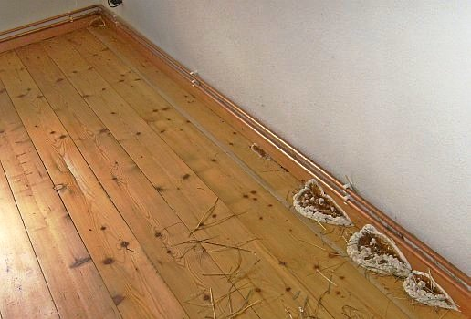 
Der echte Hausschwamm 01: Fruchtkörper auf den Holzdielen und der Sockelleiste des Fußbodens - wie Zinnsoldaten aneinandergereiht (Quelle: Bauberatung) 

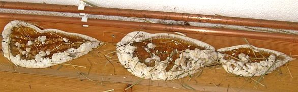 
Der echte Hausschwamm 02: Die drei zusammenhängenden benachbarten Fruchtkörper auf dem Holzfußboden im Erdgeschoß (Quelle: Bauberatung) 

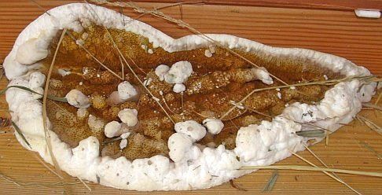 
Der echte Hausschwamm 03: Ein Fruchtkörper auf den Holzdielen mit weiß-wattigem Zuwachs-Rand und rostroter oranger Mitte: Die Sporen (Quelle: Bauberatung) 

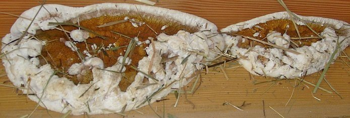 
Der echte Hausschwamm 04: Zwei zusammengewachsene Fruchtkörper auf Dielen (Quelle: Bauberatung) 

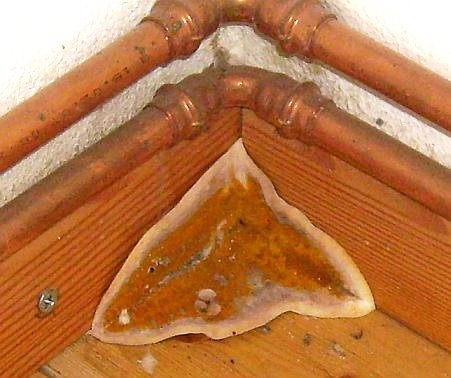 
Der echte Hausschwamm 05: Wie geschickt! Der rostrote Fruchtkörper mit weißem Zuwachsrand wächst ins Eck an drei Flächen: Holzdielenboden und Fußbodenleisten (Quelle: Bauberatung) 

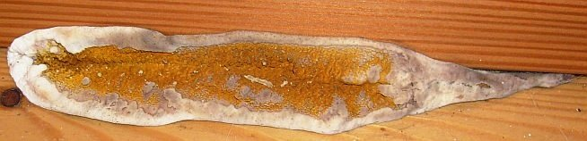 
Der echte Hausschwamm 06: Länglicher Fruchtkörper zwischen Fußleiste und Holzboden (Quelle: Bauberatung) 

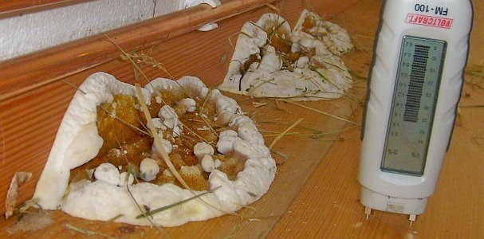 
Der echte Hausschwamm 07: Holzfeuchtemessung auf den den Fruchtkörpern benachbarten Boden-Dielen: 36 Prozent - ideal, das genügt dicke für prima Wachstum! (Quelle: Bauberatung) 

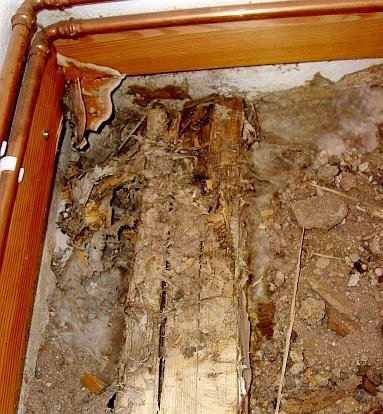 
Der echte Hausschwamm 08: Freigelegte Balkenlager / Bodenbalken / Lagerhölzer: In Ecke verrottet mit Würfelbruch, wattartiges Myzel/Mycel in Fußbodenschüttung (Quelle: Bauberatung) 

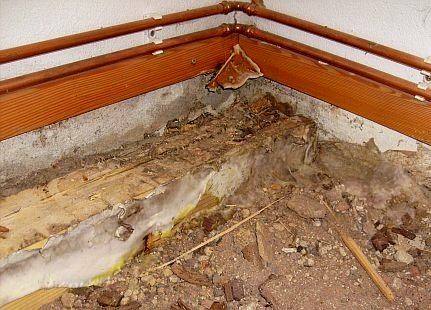 
Der echte Hausschwamm 09: Schwefelgelbe Bereiche der Lufthyphen als weißlicher Myzelwatte /Mycelwatte an Lagerbalken und Schüttung (Quelle: Bauberatung) 

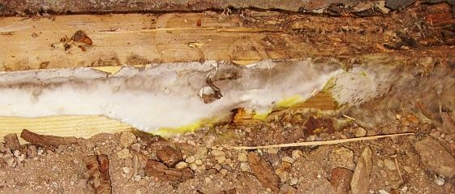 
Der echte Hausschwamm 10: Myzel-Watte/Luftmycel im Detail: Weiß und Gelb wie Schwefel an Lagerbalken und Schüttung (Quelle: Bauberatung) 

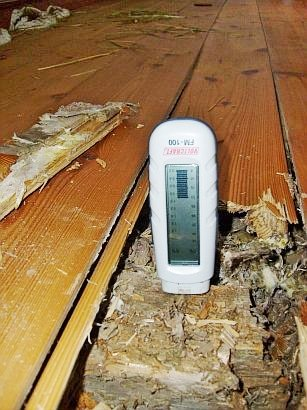 
Der echte Hausschwamm 11: Widerstandsmessung-Feuchtemessung in Lagerholz mit Würfelbruch: 20 Prozent - auch nicht schlecht! (Quelle: Bauberatung) 

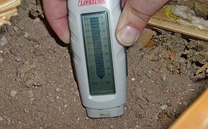 
Der echte Hausschwamm 12: Elektrische Messung mit Widerstandsmeßgerät Feuchte und Salzbelastung in Fußbodenschüttung: Feucht und belastet mit bauschädlichen Salzen, Nitraten / Mauersalpeter (Quelle: Bauberatung) 

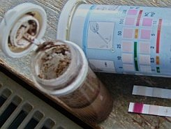 
Der echte Hausschwamm 13: Hohe Salpeterbelastung - Mauersalpeter/Nitratsalz - Messung Nitratgehalt in der myzeldurchwachsenen Fußbodenschüttung: extrem (Quelle: Bauberatung) 

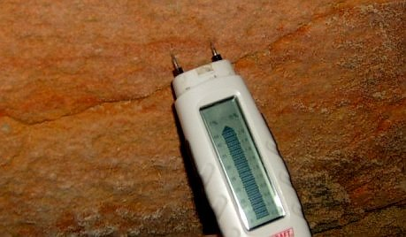 
Der echte Hausschwamm 14: Sandstein-Giebelwand - Fundamentbereich aus Sandsteinquader-Kellerwand: Extrem naß (Quelle: Bauberatung) 

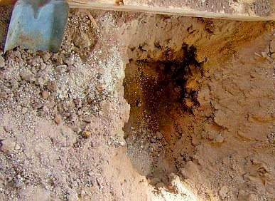 
Der echte Hausschwamm 15: Des Rätsels Lösung: Aushub der mit Myzelsträngen durchwachsenen Bodenschüttung im nicht unterkellerten Bereich unter dem Hausschwammbefall: Sohle stark durchfeuchtet und von oben nicht zu sehen - Die Feuchtequelle für den Pilzbefall (Quelle: Bauberatung) 

Auch dieser sehenswerte, bemerkenswerte und hübsche Hausschwammbefall in einem frisch sanierten Bauernhaus sorgte zunächst für Verzweiflung. Wohlfeile Ratschläge einschlägiger Bau-Fachleute und Holzschutz-Experten reichten vom Ausziehen und Abreißen des Hauses bis zum Vollvergiften und Tränken der Bausubstanz im engeren und weiteren Umfeld und Bereich des Hausschwammmbefalls mit den üblichen Gift-Holzschutzmitteln der Holzschutzchemie, toxische Voll-Tränkung des Mauerwerks mit Bekämfungsmittel inklusive. 

Woher denn der Hausschwamm-Pilz-Befall wirklich kam, wie die bautechnischen Randbedingungen des Befalls aussahen, woher vor allem die für den Hausschwammbefall unabdingbare Riesenfeuchte gespeist wurde, hat von den Sanierexperten niemanden interessiert. Eben toll, wenn man immer gleich bescheidweiß, wenn man einen Hausschwamm-Fruchtkörper sieht und seine champignon-pilzig-wohlriechenden Hausschwamm-Sporen und Hausschwamm-Myzele riecht, das zeichnet manche Hausschwamm-Sanier-Profis gem. DIN 68 800, Teil 4 oder auch des Deutschen Holz- und Bautenschutzverbandes (DHBV) eben aus. Bestimmt nicht immer, aber, aber? Und vielleicht auch sein der im DIN e.V. und seinen Vereins-Ausschüssen bzw. sonstwo herumsitzende Bauchemie-Industrie von eigenen Gnaden entwachsenes DIN-Norm-WTA-Regelwerk-Bauvorschrift-Sanierkonzept ohne Gnade, Kenntnis, Sinn und Verstand. Gift drauf, und Ruh ist. Dabei gäbe es Fall der Fälle durchaus [giftfreie Holzschutz-Alternativen](2hsm.md) neben dem konstruktiven Holzschutz, der eben die Lebensbedingungen der Holzschädlinge kennt und als Planungsvorgabe für die Konstruktion und Haustechnik respektiert. 

Wie die Randbedingungendes Befalls mit Holzschädlingen respektive Pilz und Hausschwamm aus baubiologischer, biologischer, physikalischer und technischer Sicht wirklich sind, welche Maßnahmen zur Bekämpfung und zukünftig sicheren Vermeidung des Befalls sich daraus - und nur daraus - zwangsläufig ergeben - schietegal für all diese Von-vornherein-Besserwisser mit normgeschwellter Brust. Weg, weg mit diesen! 

Zum Schluß kam dann endlich nach sorgfältiger und vorurteilsfreier Suche heraus, daß der Dielen-Holzboden auf Lagerhölzern/Holzschwellbalken und einer mächtigen myzeldurchwachsener Schüttung aus nitratverseuchtem (hygroskopisch feuchtesaugender Mauersalpeter!) Abbruchmaterial des abgebrannten Vorgängerbaus besteht und auf einem etwa 50 cm tiefer gelegenen alten Ziegelboden / Backsteinboden auf Lehmschlag liegt und sich der Hausschwamm seine Nässe von dort ganz unten heraufgezogen hat. So daß man die Feuchtequelle eben nicht oben sehen, sondern nur vermuten konnte. Ein ursprünglich offenliegender Bachlauf, der das Hangwasser einst in der engen Reihe zum Nachbarhaus wegspülte, und nun bei jedem besseren Regen den Kellerraum im nur halbunterkellerten Kellergeschoß bis zum Pumpensumpf durchrieselte, kam neben den Betonplatten vor dem mit Geflälle zum Haus auch noch dazu. 

Simpel-Sanierung: Feuchtequelle mit einfachsten baulichen Mitteln abgestellt, nur betroffene morsche Holzteile ausgetauscht, Rest wiederverwendet. Minikosten, und das Meiste in Eigenleistung. Hypernervöse Vergiftungs-Holzschutzsachverständige, umsatzgeile Bauwirtschaft, Bauhandwerker und Bauchemie in die berühmte Norm-Röhre, Durchmesser mindestens 1 Meter, gucken lassen. Das ist ja wohl selbstverständlich bei ausschließlich kundenorientierter Beratung, wie es sich eben eigentlich immer gehört. Auch gegenüber von Geldscheißern und sich bis Unendliche streckenden (Kirchen-)Steuerzahler-Eseln geplagten und verführten öffentlichen/kirchlichen Bauherren, oddä? Ein Mikroskop für die Suche danach? Bitteschön: 

### Aus der Fachwerktraum

Nochwas zur Abschreckung (aus einem meiner Gutachten) für Erwerbswillige, die einfach so auf Expertenzuruf ein schönes Fachwerkhaus kaufen wollen, ohne vorher eine solide Kaufberatung zu Rate zu ziehen. Und ein unentgeltliche Einblick in die Psychologie und Philosophie des deutschen Immobilienwesens und der Sanier-Branche: 

(Ort), ehem. ...haus, Objektbesichtigung am (Datum) 
Kurzgutachten zu Schadensumfang und Sanierungsaufwand 
Anlage: CD mit Baufotos vom Ortstermin

1. Teilnehmer Ortsbesichtigung

1.1 Bauherrschaft: (Name Auftraggeber) 
1.2 Vertreter des Objektverkäufers und Firmenvermittler: (Name) 
1.3 Architekt: Dipl.-Ing. Konrad Fischer

2. Anlaß des Termins

Der Termin fand statt, um nach einer Baubegehung den Bauschadensbefund und den damit sowie mit der künftigen Nutzung verbundenen Sanierungsaufwand vorläufig einzuschätzen sowie daraus Hinweise für das weitere Vorgehen zu entwickeln.

3. Baubegehung

Das ehem. ...haus, ein stattlicher zweigeschossiger Fachwerkbau des 19.Jhs. mit Schieferdeckung, steht in Ortskernlage unweit der Kirche. Nach den vorliegenden Plänen wurde es zuletzt im Erdgeschoß für ...zwecke, im Obergeschoß und teilausgebauten Dachgeschoß als ...wohnung mit Gästebereichen genutzt. Zum Objekt gehören eine Fertigteilgarage sowie Außenanlagen mit plattenbelegten Gehbereichen, einer Freitreppe, front- und rückseitige Stützmauern sowie Rasenflächen.

Das derzeit ungenutzte und nicht möblierte Anwesen wurde komplett außen und innen in allen Geschossen begangen. Dabei wurden die wesentlichen Baubereiche und sichtbaren Bauschäden besichtigt, technisch erläutert und fotografisch dokumentiert (vgl. Fotodoku in beiliegender CD, Destruktionsstruktur Holzbauteile durch [holzzerstörender Schädlinge](http://www.holzfragen.de/seiten/tier.html) - echter Hausschwamm und Trotzkopf - digital überarbeitet zur Verdeutlichung). Der derzeit vorhandene Ausbaustandard entspricht in wesentlichen Bereichen den 60er Jahren des letzten Jahrhunderts, die Heizzentrale ist jüngeren Datums.

Bauunterlagen zur detaillierten Einschätzung der früheren Bauvorgänge und geplanten Modernisierungsmaßnahmen liegen derzeit nicht vor.

4. Bauschadensbefund

4.1 Tragende Baukonstruktion

4.1.1 Bauwerk 
Die Fachwerkkonstruktion hat sich durch erhebliche Holzschädigungen der fassadenseitigen Auflagerbereiche in allen Bereichen - Fassade, Innenwände und Decken - verformt. Die sichtbaren Holzschäden, Nässespuren, Bauteilverformungen, Ausgleichkonstruktionen im Umfeld maßhaltiger Bauteile wie Fenster, die Gebäuderisse an Wänden und Decken und die innenseitig ablesbaren Tapetenaufwerfungen lassen mit hoher Wahrscheinlichkeit den Schluß zu, daß auch die derzeit nicht freiliegende Fachwerkfassade unter den Verschieferungen erhebliche Schäden zumindest in den Auflagerbereichen und im Umfeld undichter Fensteranschlüsse sowie Wasserleitungsstrecken aufweisen wird. 

Hinzu kommen Feuchteschäden an Innenwänden durch Wasserleitungsleckagen und in den oberen Konstruktionszonen durch undichte Dachdeckung mit erheblichem Wassereintrag in Wände und Decken. Da es am Besichtigungstag regnete, konnten aktuell vorhandene Deckschäden und ihre nachteilige Auswirkung an der schieferbekleideten Nordfassade exemplarisch besichtigt werden. 

Die exemplarische Untersuchung einiger Schadensbereiche an der Fassade ergab, daß durch schadensfördernde, konstruktiv ungeeignete Reparaturmethoden ältere Fehlstellen und Schadensbereiche des Fachwerks nur oberflächlich mit Pech und Anstrichen überdeckt, mit Verkittung und Zement-Vermörtelung verfüllt bzw. durch aufgesetzte Bretter kaschiert wurden. 

Die dort angetroffenen und in Teilbereichen offenbar bei zurückliegenden Bauuntersuchungen schon freigelegten Bauschäden sind durch dauerhafte Durchnässung der betroffenen Konstruktionsbereiche verursacht, verstärkt durch trocknungsblockierende Oberflächenbeschichtungen. 

Erhebliche Bereiche der geschädigten Hölzer weisen typische kreisrunde Fluglöcher des Trotzkopfs auf - ein holzzerstörender Käfer, der durch Naßfäulepilze vorgeschädigtes Konstruktionsholz befällt. Auch das den angemorschten Auflagerbereichen der Fachwerkstützen an der Ostfassade entnommene Holzmehl mit Resten des Spätholzschichten bestätigt als typisches Fraßbild das Vorliegen des Trotzkopfs und indirekt den damit zwangsläufig verbundenen gravierenden Schädlingsbefall mit Naßfäulepilz.

Im Erdgeschoß führten mehrere Wasserschäden zu Fleckenbildung mit Putz- und Anstrichzerstörung an den Wänden, die ihre Ursache überwiegend in Wasserrohrbrüchen bzw. sonstig undichten Rohrleitungen / Leckagen haben dürften. Teilweise kann auch Kondensateinlagerung aus feuchter Luft in unterkühlte Bauteile mangelhaft geheizter Räume eine zusätzliche Bauteildurchfeuchtung bewirkt haben. Im Obergeschoß verweisen Deckendurchfeuchtungen auf dachseits eingedrungenes Regenwasser.

Im WC belegt der würfelbruchartige Zerfall der nur noch in Resten anzutreffenden Türbekleidung Befall mit echtem Hausschwamm, der seinen Feuchtebedarf offensichtlich aus dem ausreichend durch direkte Beregnung, Spritzwasser und undichten Dachrinnen stark durchfeuchteten Sockelbereich / Sockelmauerwerk versorgte. Da auch die Befallsbereiche an der Fassade würfelbruchartige Schadensbilder aufweisen, liegt der Schluß nahe, daß dort ebenfalls Hausschwammbefall vorliegt. Über das Schädlingsvorkommen im Detail, die einzeln bzw. vergesellschaftet auftretenden Schädlingsarten, deren Aktivitätsstatus und den weitreichend anzunehmenden Gesamtumfang des tatsächlichen Befalls im gesamten Bauwerk kann nur eine weiterführende, derzeit nicht erforderliche Bestandsuntersuchung und holztechnische Begutachtung nach entsprechender Konstruktionsfreilegung weiteren Aufschluß geben.

Im Umfeld der befallsbedingt verformten Fachwerkhölzer sind auch die Gefache der Wände und Decken entsprechend geschädigt. Anzunehmen sind auch weitergehende Schäden der Verbindungselemente des Fachwerks wie überlastungsbedingte Brüche, Risse und Vermorschungen im Inneren des Gefüges. Auch hier kann nur eine Konstruktionsfreilegung weitergehende Klarheit verschaffen, die aus gegebenem Anlaß nicht nur punktuell, sondern im Hinblick auf ausreichende Planungssicherheit großräumig erfolgen muß.

4.1.2 Außenanlagen 
Die Stützmauern sind durch Auffrostung der Fugen in ihrer Standsicherheit erheblich gefährdet. Auch die Freitreppenkonstruktion ist erheblich frostgeschädigt.

4.2 Raumschalen und sonstige Bauteile 
Die Oberflächen aller Räume und Ausbauteile - Böden, Decken, Wände, Verkleidungen, Fenster und Türen - sind weitestgehend durch Nutzung und Alterung verschlissen, z.T. durch Feuchteschäden konstruktiv und gestalterisch erheblich beeinträchtigt und in den Hauptschadensbereichen bis in den Untergrund zerstört. Auch hier wird sich der Schadensumfang im Detail erst nach Freilegung der o.g. Konstruktionsschäden erfassen lassen.

Die Fensterkonstruktionen sind in vielen Bereichen durch Feuchteaufnahme und Anstrichvernachlässigung verzogen, auch einige Türen sind feuchtebedingt aufgequollen und schwergängig.

4.3 Haustechnik

Die veraltete und im Bereich Wasser und Heizung geradezu primitiv verlegte Haustechnik ist insgesamt aus Sicht einer modernen Nutzung erneuerungsbedürftig.

5. Sanierungsaufwand

Bei der Voreinschätzung des erforderlichen Sanierungsaufwandes sind zu berücksichtigen:

- Hoher Schädigungsgrad der langfristig vernachlässigten, nur mit handwerklich primitiver "Pinselsanierung" und oft schadensfördernd "instandgehaltenen" Bausubstanz 
- Offener und verdeckter konstruktionsgefährdender Befall von tragenden und nichttragenden Hölzern mit tierischen und pflanzlichen Holzschädlingen (echter Hausschwamm!), erhöhter Freilegungsbedarf der Baukonstruktion außen und innen zur Gewährleistung des Sanierungserfolgs 
- Insgesamt veralteter und unbrauchbarer Standard der Haustechnik, erhöhter Erneuerungsbedarf 
- Hoher Umbau- und Modernisierungsbedarf für künftige Eigen- und Fremdnutzung nach zumindest mittlerem Standard 
- Bestandsverträgliche Baustoff- und Konstruktionswahl für Sanierung im Gegensatz zu üblichen bauschädlichen "Neubaulösungen" nach Industrienorm und substanzzerstörender "Bauphysik"

Dieses sich jedem Baufachmann bei verständiger Beurteilung ohne weiteres erschließende Anforderungsprofil erfordert aus technisch und wirtschaftlich unabweisbaren Gründen einen Kostenansatz je qm Nutzfläche für die technische Bestandsaufnahme, Planung und Baudurchführung, der weit über eine geringfügige "Pinselsanierung" hinausgeht. 

Aus der ständigen Abrechnungserfahrung an inzwischen ca. 350 Altbauprojekten des ein bundesweit tätiges Architektur- und Ingenieurbüro führenden Unterzeichners erscheint derzeit ein Quadratmeteransatz von brutto (inkl. MWST) ca. ... EUR mit Toleranz +/- 25 % als angemessen und plausibel - vorbehaltlich neuer Erkenntnisse nach Freilegung der Hauptschadensbereiche und weiterer Planungskonkretisierung.

Auch die dem Unterzeichner vorliegenden Erkenntnisse aus der Seminarleitung für Altbauplanung bei Architekten- und Ingenieurkammern von Bayern bis Schleswig-Holstein seit 1988 sowie als langjähriger Vorsitzender des Beirats für Denkmalerhaltung der Deutschen Burgenvereinigung e.V. bestätigen diese Kalkulationsgröße als realistisch. Sie dürfte auch jedem Baufachmann unter Berücksichtigung des gegebenen Bauzustands nachvollziehbar sein.

Nach den vorliegenden Gebäudeunterlagen weist das Bauwerk eine Nutzfläche von ca. ... qm auf. Demnach errechnet sich der erforderliche [Sanierungsaufwand](11erhins.md) (Kostengruppen 1 -7 gem. DIN 276 exkl. Erwerbskosten) unter Berücksichtigung der obigen Einschränkungen und ohne Außenanlagen und Garage wie folgt:

... qm x ... EUR/qm = 520.000 EUR

Nach der gemeinsam durchgeführten vorläufigen Wirtschaftlichkeitsberechnung unter Berücksichtigung ortsüblicher Mieten für mittleren Nutzungsstandard ergibt sich ein möglicher Kreditbetrag aus beliehener Miete für das Gesamtobjekt zu ca. 50.000 bis 60.000 EUR. Damit ist die erforderliche Gesamtsanierung nicht finanzierbar.

Die verkäuferseits in der Beratung angeführten Aussagen zum seinerseits erwarteten Sanierungsaufwand gem. vorliegenden Angeboten von erfahrenen Handwerksbetrieben nach Ortseinsicht und eine angeblich vorliegende Gebäudewertermittlung um die 80.000 EUR erscheinen dem Unterzeichner fachtechnisch und wirtschaftlich keinesfalls nachvollziehbar. 

Da sich der schlechte Bauwerkszustand und der erhebliche Befall mit holzzerstörenden pflanzlichen und tierischen Schädlingen jedem Baufachmann ohne weiteres erschließen, gewinnen diese Aussagen nach fachlicher Auffassung des Unterzeichners - insbesonders unter Berücksichtigung der verkäuferseits nach eigenen Angaben vorliegenden großen Bauerfahrung und objektbezogenen Beiziehung fachlich erfahrenen Rates altbauqualifizierter Handwerksmeister - geradezu absurden bzw. interessensgeleiteten Charakter zuungunsten der Auftraggeberin.

Fazit

Das besichtigte Bauwerk erfordert zur Nutzbarmachung nach zumindest mittlerem Standard ganz erhebliche Aufwendungen, die sich aus wirtschaftlicher Sicht unter den gegebenen Umständen und vorgetragenen finanziellen Verhältnissen der Auftraggeberin keinesfalls rechtfertigen lassen.

Offenbare und sich aus dem offenbaren Bauzustand jedem Baufachmann erschließende verdeckte Mängel lassen den notwendigen Instandsetzungsaufwand auch zum jetzigen Zeitpunkt von der Größenordnung her zutreffend einschätzen.

Die von Verkäuferseite über seinen sich gegenüber der arglosen Auftraggeberin als besonders erfahrenen Baufachmann gebenden Objektvermittler in der Beratung und offenbar auch in den Verkaufsverhandlungen vorgetragene Schätzung des Gebäudewerts und Sanierbedarfs entbehren nach Auffassung und Erfahrung des Unterzeichners jeglicher Realität. Die vorliegende kritische Befallssituation mit holzzerstörenden Pilzen und Insekten - das unter Baufachleuten allgemein bekannte Hauptproblem im Fachwerkbau mit besonders hohem Sanieraufwand - blieb dabei wohl unberücksichtigt.

Nicht unbeachtet sollte dabei bleiben, daß ein Großteil der hausschwammbefallenen Teile der Türbekleidung zum Zeitpunkt der Baubegehung rückstandslos entfernt waren, möglicherweise, um das Objekt in einen dem Laien bzw. Kaufinteressenten unverdächtigeren Zustand zu versetzen. Auf kritische Nachfragen des Unterzeichners mußte die Verkäuferseite von einigen verharmlosenden Aussagen zum Sanierungsbedarf abrücken und den technischen Standpunkt des Unterzeichners zu den Saniererfordernissen bestätigen. 

Da die baulich notwendigen Aufwendungen die gegebenen Finanzierungsmöglichkeiten dramatisch übersteigen werden und nach der dem Unterzeichner bekanntgewordenen Sachlage keine vertretbaren Mittelergänzungen aus Abschreibung, Förderung und Mietertrag zu prognostizieren sind, wird von einer Weiterverfolgung des Bauvorhabens abgeraten. 

Von der Beauftragung der verkäuferseits ebenfalls (!) zur Vermittlung angebotenen Baufirmen muß deshalb ebenfalls dringend abgeraten werden. Eine kostensichere und wirtschaftlich vertretbare Bauvergabe setzt eine intensive Bauuntersuchung, Planung und das Ausschreibungs- und Wettbewerbssystem gem. VOB/A zwingend voraus. Die freie Vergabe an "vermittelte" Baufirmen auf vorläufigem Erkenntnisstand kann unter den gegebenen Umständen schlimmste Manipulationen und für den Bauherrn überraschende Kostenexplosionen durch raffiniertes Nachtragsverlangen nicht ausschließen. 

Dem Unterzeichner zumindest erscheinen die verkäuferseits erkennbaren Interessenskollisionen zuungunsten des Erwerbswilligen nicht hinnehmbar. Die hier zu erkennende systematische Überbeanspruchung der gegebenen finanziellen Möglichkeiten und Interessen des Erwerbswilligen durch einem vernünftigen Geschäftsgebaren Hohn sprechenden "Vermittlungsangebote" und "Ratschläge" betreffend Objektkauf und Auftragsvergabe erfordern äußerste Vorsicht und objektive Überprüfung.

Ob in Anbetracht der verkäuferseits herbeigeführten vollständigen technischen und wirtschaftlichen Fehleinschätzung seitens des Erwerbswilligen der Objekterwerb rückgängig gemacht werden kann und sollte, bedarf juristischer Beurteilung des Kaufvertrags und der gegebenen Erwerbsumstände. Hierzu ist aus Unterzeichnersicht dringend anzuraten. 

Aufgestellt: 
Dipl.-Ing. Konrad Fischer 
Architekt BYAK

Traurig, nicht wahr? Soweit zum Problem Hauskaufberatung. Wie man nun die ganzen Schäden von der Fachwerkschwelle bis zum letzten Fachwerkbalken und Gefach fachtechnisch einwandfrei saniert, ist eine Frage für sich. Eine Frage? Aber nein! Ein riesiger Fragenkomplex, der für jeden Einzelfall neu zu entscheiden ist. Fachwerk total entfachen, skelettieren, entbeinen, entgräten? So machen es viele Zimmerleute und empfehlen es viele Hozschutzsachverständige, Architekten und Planer. Ja mei, wenn das Geld sonst verrottet, die Denkmalsubstanz der Raumschalen egal, der Denkmalpfleger dafür, von mir aus. Ich habe sowas jedenfalls noch nie vorgefunden und deswegen immer die kleinteilige Reparatur Holz für Holz mit möglichst kleinen Gefach- und Balken-Freilegungen bevorzugen müssen, können und dürfen. Hin und wieder mal ein Eisenteil als zurückhaltend dimensionierte Verstärkung für wo am nötigsten, mit raffinierten [Bohrschrauben](https://www.lamprecht24.de/bohrschrauben-fassadenschrauben/bohrschraube-profiltraegern-6-mm) oder Schraubbolzen, Dübeln oder Laschkonstruktion kraftschlüssig mit dem Konstruktionsholz verbunden. 

Klappt doch auch, ist wesentlich billiger als der Totalangriff auf die Substanz - da mögen die gelahrten Herren Zimmerleute von mir aus dagegenhalten, was sie wollen, es stimmt doch immer. Wenn es geht auch ohne Zimmermannsnägel und Nagelbolzen und Verbindungswinkel Holz-in-Holz mit sogenannten zimmermannsmäßigen Holz-Verbindungen: 

Verklauung, Verzapfung, Verkämmung, Holznagel, Verleistung/Gratleisten, Holzdübel usw. Wie der Japaner eben. Oder der gute, alte Zimmermeister früherer Zeiten. Der war doch auch kein Depp! Und hat seine Buden auch nie mit Dämmstoff so vollgemüllt, wie heutige schwarzhutkrempenverschattete Cordhosenträger im einst edlen Holzbau-Gewerk. Eben zünftig! Und verboten sind auch das Doublieren von Bohlen auf morsche, ausgestemmte Balkenoberflächen, der falsche Zapfen und andere Spartricks nicht, denn sie sind technisch oft einwandfrei und Sparen Material, Zeit, Substanzverlust und Geld. Die Lehrbücher zur Fachwerksanierung habe ich gelesen, vielleicht mehr als mancher Balkennagler. Und gute, ehrbare und fleißige Zimmerleute habe ich auch genug kennenlernen dürfen. Das nur zur Abrundung. Ein Lehrbuch für das Best-Practise-Fachwerksanieren kann und soll das jedenfalls nicht werden, das sollen meinetwegen andere Schreibtischtäter und Bautheoretiker im besten Rentnenalter verfassen. Lernen will doch heutzutage eh kaum noch einer, da keine Zeit. Ich bringe lieber noch ein paar herzige Beispiele aus der Praxis: 

Aus meiner [Bauberatung](2berat.md): 

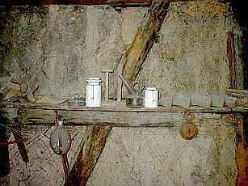 
Historisches Fachwerk in angemorschter Form. Wie weiter?

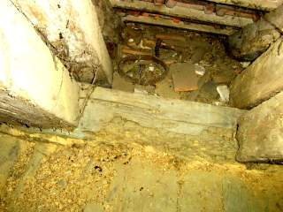 
Blick in den verschutteten Dachfußbereich unter dem Aufschiebling - wer hätte gedacht, daß hier nicht nur die Binderschwelle von Hausbock befallen, sondern umfangreich die Fußzapfen von Aufschiebling, Sparren und Binderstützen vermorscht sind, bis zur Vollvermorschung der hier überhaupt nicht sichtbaren Fußschwelle und außen anhängenden Traufgesimse.

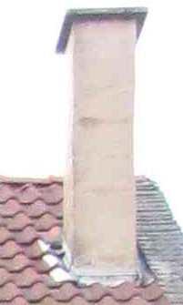 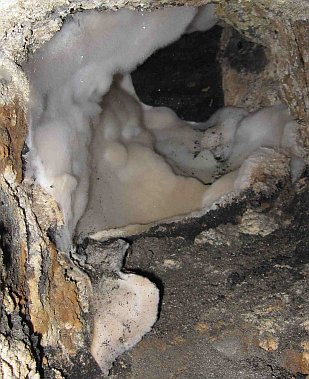 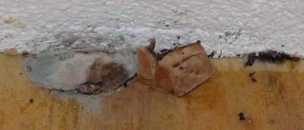 
Ein typischer Hausschwammbefall (Bilder: Matthias Stenger) 
1. Ein ungenutzter Kamin, in den es regnet. 
2. Im Kamin eine Verstopfung auf Bodenebene des Erdgeschoßes, hier sammelt sich die eingeregnete Feuchte und durchnäßt die angrenzenden Bauteile. Die Holzbauteile des Fußbodens im Erdgeschoß werden naß, dort siedelt sich aus den überall herumschwirrenden Hausschwammsporen der echte Hausschwamm - Serpula lacrymans - an. Im Kamin bildet sich sein dickes, polsterfömiges Luftmyzel, saugt die Baufeuchte auf und transportiert sie mittels seiner Strangmyzele in die benachbarten Holzkonstruktion. 
3. Aus dem Fußboden wachsen die Fruchtkörper des echten Hausschwammes hervor. Ein neuer Holzfußboden / Dielenboden! 
Frage: Muß nun aus dem Fußboden gemaß Holzschutz-DIN Norm 68800 Teil 4 unheimlich viel weggeschnitten werden, das angrenzende Mauerwerk erst abgeflammt und dann mit dem restlichen Haus vergiftet werden, und, und, und, oder, oder, oder, oder?

Hier weiter: [[19.2]](29bau192.md)
