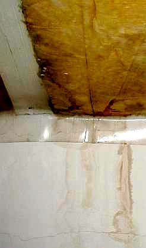
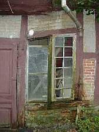
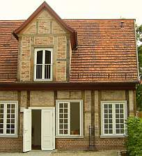
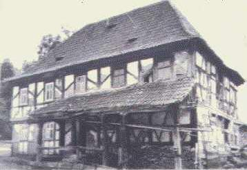
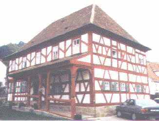

[🠔 Zur Übersicht: Wand & Fachwerk](29bau09.md)  
# Energiesparen durch Wärmedämmung im Holzhaus, Fachwerk und Fachwerkhaus, Fachwerkrestaurierung und Fachwerkinstandsetzung
**Altbautaugliche Verfahren und Baustoffe Kapitel 9+10: Holzhaus und Energiesparen durch Wärmedämmung, Fachwerk und Fachwerkbau, Fachwerkrestaurierung und Fachwerkinstandsetzung [19.2]**  
_von Konrad Fischer • aktualisiert 02.10.2009_

 Altbautaugliche Verfahren und Baustoffe Kapitel 9+10 

### Wandbildner: Energiesparen durch Wärmedämmung im Fachwerk und Fachwerkbau, Fachwerkrestaurierung und Fachwerkinstandsetzung [19.2]

Seite in Unterkapitel aufgeteilt - Naturstein:[[1]](29bausto.md) [[2]](29bau02.md) [[3]](29bau03.md) [[4]](29bau04.md) [[5]](29bau05.md) [[6]](29bau06.md) Steinboden:[[7]](29bau07.md) Reinigungstechnik:[[8]](29bau08.md) Wand:[[9]](29bau09.md) [[10]](29bau10.md) [[11]](29bau11.md) [[12]](29bau12.md) [[13]](29bau13.md) [[14]](29bau14.md) [[15]](29bau15.md) Fachwerk/Holzbau:[[16]](29bau16.md) [[17]](29bau17.md) [[18]](29bau18.md) [[19.1]](29bau19.md) **[19.2]** Bodenaufbau/Holzboden:[[20]](29bau20.md) 

**(aktualisiert 2.10.09)** 

Der heutige Holzhausbau wäre für die altehrwürdigen und in christlichen Handwerks-Zünften und -Gilden qualitätssichernd organisierten Zimmermeister der weitgespannten und konstruktiv ausgereizten Holztragwerke der Gotik, aber auch der robusten und langlebigen Holzblock- und Holzständerkonstruktionen höchstwahrscheinlich und bestenfalls ein gar übler Witz. Dem fränkischen Poetus und stabreimenden Schustermeisterla Hans Sachs wäre dazu vielleicht folgendes eingefallen: 

_Ehrbar war des Handwerch einst - heit' wird arch oft rumgeschweinst. 
Wenn nicht GOtt des Werch bestümmet, Deifelsdregg das Spiel gewünnet. 
Kummt ein solcherner Falschmeister - Kunden und sich sölbst bescheißt er - 
biet' Dir glanzlackürten Pfusch - hau ihm eine auf die Gusch!_ 

 Wir sind da natürlich wesentlich zurückhaltender und distanzieren uns von derlei grobfränggischen Humoresken. Doch wie bitterlich soll es eigentlich kommentiert werden, wenn man folgendes feststellen muß?: 

 * Der konstruktive Holzschutz ist heute zum Fremdwort geworden. Dafür wird das baukonstruktiv und bauphysikalisch falsch verbaute und falsch beschichtete Holz durch die Brühen und Tunken der Bauchemie zu lebensgefährlichem - zumindest gesundheitsschädlichem und umweltschädlichem Sondermüll vergiftet - um die Haltbarkeit (von "Lebensdauer" sollte man hier wohl nicht mehr sprechen) und den Widerstand gegen befallsbedingte Vermoderung zu verlängern.
 * Die Anstriche auf bewitterten Holzoberflächen erfolgen mit absperrenden Kunstharzschwarten, deren alterungsbedingte Sprödheit sich der Holzbewegung widersetzt und deswegen wassersaugende Kapillarrißnetze ausbildet.
 * Unter den Plastikanstrichen staut sich das eingedrungene Wasser und das übernasse Holz verrottet, da der holztypische Trocknungsverlauf von den dichten Schichten blockiert wird - gleichwohl wird "Ventilation" für diesen Lackquack versprochen. Und genau deswegen wird vor allem das synthetikbeschichtete Holz vergiftet, um möglich erst nach der Gewährleistungszeit anzumorschen. Schlauerweise verbietet man gleichzeitig die bewährte Bleiweißfarbe, obwohl deren früher riskante Herstellung mit herumpudernden Bleistäuben heutzutage in geschlossenen Sytemen bestens zu bewältigen ist und der Bleigehalt in der Farbe dem mikrobiellen Befall optimal widerstand.
 * Worauf die Ingenieurholzbauern besonders stolz sind und was auch die offenbar ganz und gar ahnungslose Holzwerbung (Holzbauatlas, Informationsdienst Holz, ...) in höchsten Tönen holzleimbaupepreist - die Leimbinderkonstruktion für früher unerreichbare Spannweiten - erweist sich mehr und mehr als lebensbedrohlicher Flop. Hatte man doch spreißelhafte Querschnittli mit Plastikkleber kilometerweise zusammengebappt in der trügerischen Hoffnung aller unerfahrenen Pfuscher: Werd scho hoitn! 

Hält aber nicht. Der von Menschenhand zusammengeschusterte Plastikbapp vergammelt genau wie ein alter UHU, TESA und PATTEX, sprödelt, brüchelt, krakelt, craquéliert, bröselt, fließt und verliert dabei logischerweise seine ach so gut berechenbare Normbindefähigkeit. Ja was, wen darf das eigentlich überraschen? Na gut, wenn die Berufsschulturnhallen- (Dachau 1.12.1999) und Mehrzweckhallendächer (Bad Reichenhall 2.1.2006) über den Nutzern [aus heiterem Himmel zusammenstürzen](212bau2.md), gibt das schon recht traurige Überraschungsmomente für die Betroffenen. Und die Verantwortlichen flüchten sich in die gewohnten Ausreden. Daß sich die Einstürze vorzugsweise in der bitteren Winterszeit ereignen, deutet ebenfalls auf die in der Branche doch seit langem [bekannte und mehr als ausreichend erforschte Materialermüdung der Chemiepampen](212bau2.md#leim) hin. Im Winter trocknen Holzkonstruktionen besonders stark aus und erleiden dadurch und durch temperaturbedingte Kontraktion besonders hohe Spannungen, die das Versagensrisiko der Leimbindung verschärfen. Und während in Dachau der Hausmeister drei Stunden vor dem Einsturz noch die schon bedenklich ächzende Halle sperren konnte, gelang dies in Bad Reichenhall bekanntlich nicht mehr. Die trügerische Gewissheit, daß das Hallendach rechnerisch für weitaus höhere als die vorhandenen 20 cm Schneelast bemessen war, mag dafür auch einen Grund geliefert haben. 
Merke: DIN-Normen dienen aufgrund der Zusammensetzung der erlassenden (und niemals erblassenden?) Normausschüsse vorrangig der Vermarktung 'moderner' Produkte und Konstruktionen. Dabei lassen sie hinderliche Baustoffwahrheiten schon eher mal unter den Tisch fallen - bestes Beispiel dafür bietet die überall zusammenstürzende Stahlbetonjahrtausendbauweise.
 * Ohne jegliches Verständnis für die konstruktiven Bedingungen aus Nutzung und Witterung - nicht jeder Fachwerk- und Holzfuzzi kennt eben Prof. Meiers hammerharte Aufklärungsschocker dazu - werden moderne Holzhaushüllen und neue Fachwerkhaus-Wände in feuchteriskanter Schichttortenbauweise mit unterschiedlich bis überhaupt nicht trocknungsfähigen Konstruktionslagen zusammengenagelt, gedübelt und geklebt. Den drohenden Schäden sollen dann gesundheitsschädliche Gifte und Lüftungsmaschinen abhelfen - was natürlich nicht gelingt. Das Deutsche Zentrum für Handwerk und Denkmalpflege in der Probstei Johannesberg, Fulda, meldete dazu schon im Juni 1997 auf seinem 4. Forum in der auch durch grausamste öffentliche und private Sanierleichen berühmt gewordenen Fachwerkstadt Duderstadt: 

_"Zehntausende Fachwerkhäser kaputtsaniert - Falsche Isoliermaßnahmen zerstören alte Häuser ... "Wir haben Häuser gesehen, die hatten 300 Jahre keinen Schaden und jetzt, nach der angeblichen Grundsanierung, brechen sie zusammen. Die tragenden Balken verfaulen. Im Haus breitet sich der Schwamm aus. Sie sind verloren" - so der Projektbearbeiter für Untersuchungen und Gutachten des Zentrums, Reiner Klopfer. Die Bauschäden entstehen demnach durch "falsche Außenanstriche, zu dichte Fenster, Wandaufbauten, die keinen Wasserdampf durchlassen oder falsche Isoliermaßnahmen.""_ 

Ja, das beschreibt genau all das, was sowohl bei der Fachwerksanierung wie auch beim Neubau von Holzbauten / Holzhäusern / Fachwerkhäusern zum klassisch gewordenen bundesdeutschen Standard (sogar hin und wieder in sogenannten Internet-Fachwerkforen!) geworden ist - dank allerlei Produktwerbung, darauf hereingefallenen Handwerkssimpln und Planerluschen sowie des effektiven Lobbyistensponsorings für unsere korrupte Administration und Politabzockerelite. 

Und so ist es gar kein Wunder, daß der Referatseiter beim Niedersächsischen Landesamt für Denkmalpflege, Reiner Zittlau, am 25.01. auch noch im Jahre 2008 zum Thema Dämmpfusch an Deutschlands Fachwerkbauten in der SZ wie folgt zitiert wurde: 

_"... bei der Dämmung von Fachwerkhäusern (wurde) zwischen der Wand und der Dämmung eine Folie angebracht, an der das Kondenswasser permanent herunterläuft. Wir haben inzwischen Tausende von Fällen, in denen diese Methode zur Zerstörung des Denkmals führt."_ 

Was Zittlau nicht sagt - auch ohne diese der überlegenen Intelligenz deutscher Baupfuisiker entsprungenen Dampfbremse / Dampfsperre saugt sich der Dämmstoff in Gefachen bei "günstigen" Konstruktions- und Umgebungsbedingungen unabänderlich voll Kondensatfeuchte, wenn es drauf ankommt, auch voll Regenwasser. Dann muß leider auch das vergiftetste Fachwerkbälkli vermorschen, weil Moderpilze, der echte Hausschwamm (Serpula lacrymans), sonstige Naßfäulepilze wie der weiße Porenschwamm und der braune Kellerschwamm, Blättlinge, giftige Schimmelpilze wie Schwarzschimmel und Weißschimmel (Aspergillus nidulans, Aspergillus niger, Aspergillus versicolor, Aspergillus fumigatus, Aspergillus flavus, Penicillium chrysogenum, Penicillium expansum, Penicillium verrucosum, Penicillium viridicatum, Fusarium, Stachybotrys chartarum (atra), Acremonium, Alternaria, Aureobasidium, Basidiosporium, Basidiomyceten, Poria incrassata, Botrytis, Chaetomium, Cladosporium, Trichoderma, Ulocladium), sogar Schadinsekten (Anobium punctatum - Gemeiner Nagekäfer, Xestobium rufovillosum - großer Holzwurm, Lyctus bruneus - Splintholzkäfer, Hylotrupes bajulus - Hausbock usw.) sich hemmungslos und leider oft allzulange Zeit stillverschwiegen ausbreiten, da beißt die Maus kein Faden ab. Der naßgesogene Dämmstoff am dadurch aufgefeuchteten Holz bietet nämlich diesen Holzliebhabern die feinsten Lebensbedingungen.
 * Der Gipfel: Das gerade für Energiesparbauweise ideale Holz wird mit schwammigen Feuchtesaugern beschichtet (Wärmedämmverbundsysteme WDVS, Sparrenaufdämmung und Untersparrendämmung / Sparrenunterdämmung) und umhüllt (Vollsparrendämmung, Zwischensparrendämmung, Gefachedämmung, Kerndämmung usw.) - angebliche Dämmstoffe, die aber die kostenlose Solarstrahlung nicht speichern können, damit in der Dämmwirkung kontraproduktiv wirken und jeglicher Bauerfahrung Hohn sprechen. 

 
Durchnäßte und durchschimmelte "Vollsparrendämmung" inkl. raumseitiger Dampfsperrenalufolie 

 
Nasse und mit Schimmelpilz befallene Vollsparrendämmung inkl. raumseitiger Dampfsperre. Noch mehr traurige Ergebnisse dieser Pfuschbauweise können Sie [hier ausgiebig besichtigen (mit vielen Grusel-Bildern aus Baugutachten / Bauberatungen)](21316bau.md) 

Diese minderwertigen Bauschäume und -gespinste bringen dann die vorteilhaften Dauereigenschaften der Holzbauweise in Mißkredit, züchten Hausschwamm und sonstigen Algen- und Pilzbefall - aber entsprechen gottseidank der Norm und den verschwiegenen Interessen der industrieprovisionsgelenkten Handwerker und ausschreibungstextversorgten Planer, inkl. Gewährleistung neuer Bauaufträge durch Pfusch.

Dagegen die in Block- und Ständerbauweise gefügten historischen Holzkonstruktionen: 

 * halten selbst unter sehr schlechten Bedingungen zusammen,
 * überraschen nie mit unvorhersehbarem Konstruktionsversagen und
 * sind dabei auch bei erheblichem Schädigungsgrad bestens reparabel, da Bauhölzer mit ausreichender Resttragfähigkeit ohne weiteres mit traditionellen und modernen Reparaturverbindungen an Neuteile angeschlossen werden können (Beispiele aus meiner Reparaturpraxis): 

  

  

 * sind selbst bei Holzstärken von 7-15 cm wahre Energiesparer, wie ausreichend Beispiele aus der Fachwerk- und Blockbautradition belegen können.

Jedoch, wie wird heutzutage gebaut? Na ja, nobody is eben perfect. 

Weiter zu :[Kapitel 20 - Bodenaufbau/Holzboden](29bau20.md)
