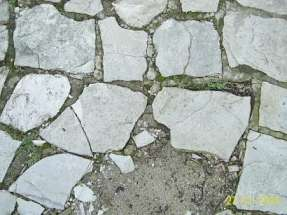

[🠔 Zur Übersicht: Wand & Fachwerk](29bau09.md)  
# Fußbodenaufbau allgemein/Holzboden
**Bestandsgerechte Baustoffe und -verfahren - Wie Sie einen Fußbodenaufbau verhunzen können - und eben nicht.**  
_von Konrad Fischer_

 Altbautaugliche Verfahren und Baustoffe 

## Bodenaufbau/Holzboden [20]

Die Kapitel 9-10 wurden in folgende Unterkapitel aufgeteilt - **9. Natursteinrestaurierung** : [[1]](29bausto.md) [[2]](29bau02.md) [[3]](29bau03.md) [[4]](29bau04.md) [[5]](29bau05.md) [[6]](29bau06.md) 
**Steinboden** : [[7]](29bau07.md) 
**Reinigungstechnik** : [[8]](29bau08.md) 
**10. Wandbildner im Vergleich** : [[9]](29bau09.md) [[10]](29bau10.md) [[11]](29bau11.md) [[12]](29bau12.md) [[13]](29bau13.md) [[14]](29bau14.md) [[15]](29bau15.md) 
**10.a Fachwerk/Blockbau** : [[16 - Die schärfsten Tipps zur Fachwerkrestaurierung: Woran erkennst Du einen Fachwerk-Experten?]](29bau16.md) [[17]](29bau17.md) [[18]](29bau18.md) [[19.1]](29bau19.md) [[19.2]](29bau192.md) 
**Bodenaufbau/Holzboden** : **[20]**

Zu guter Letzt oder Last but not least: 

## Fußbodenaufbau allgemein/Holzboden: 

Wir fangen an im Keller. Warum soll man hier eine wassergeschwängerte Betonplatte gießen, die dann die nächsten 10 bis 100 Jahre den Kellerboden mit schwer bis nie restlos austrocknender Überschußfeuchte versorgt, Bodenbeläge gefährdet, schüsselt, schwindet, wölbt, verpilzt, verrottet usw.? Viel einfacher wäre es doch oft mit Streifenfundament, Punkt-, vielleicht sogar Schraubenfundament und eingesandetem Pflasterboden (Ziegelplatten, Betonsteine, ...), darauf nach Bedarf in Trockenbautechnik z. B. Trockenestrich wie der bewährte Gußasphalt oder Plattenboden in gut trocknungsfähigem Luftkalkdickbett. Feuchteschutz nach unten durch kapillarbrechenden Schotter, bei Bedarf (z.B. in der Sahara auf artesischem Brunnen!) auch mit ["Brauner Wanne"](2aufstfe.md) als Tonabdichtung im Stil des 1000e Jahre funktionierenden Lehmstampfbodens der alten Baumeister. 

Und da mir ja kaum jemand so ohne weiteres glauben will, zitiere ich hier mal der Henkel-Thomsit-Mitarbeiter Wolfram Steinhäuser. der als _"Technik-Experte"_ in TrockenBauAkustik 6.2012 Folgendes unter dem Titel _"Risiko Feuchtigkeit"_ zum Besten geben darf: 

_"Herstellungsbedingt verfügt ein neu eingebauter Beton über einen hohen Anfangswassergehalt. So enthält Beton unmittelbar nach seiner Herstellung ca. 210 kg/m³ Wasser, das aufgrund der Porenstruktur des Zements und der Dicke von Betonbauteilen nur langsam entweicht. Daher braucht eine 20 cm dicke Betonplatte beispielsweise knapp 1,5 Jahre bei beidseitiger Trocknung, um auf ihre Ausgleichsfeuchte herunterzutrocknen. Kann sie nur einseitig trocknen, wie bei erdberührten Bodenplatten, braucht sie sogar 4 Jahre. ... Wissen sollte man auch, dass speziell auf neue Betonuntergründe häufig filmbildende Nachbehandlungsmittel aufgesprüht werden. ... Der Kommentar zur DIN 18365 "Bodenbelagsarbeiten", Stand 20120, ergänzt auf Seite 45: "Bei Betondecken ohne und mit Verbundestrich ist eine aussagefähige Messung des Feuchtegehalts mit gewerbeüblichen Messgeräten nicht möglich. Die in der oberen Zone des Untergrunds gemessenen Werte lassen keinen Rückschluss auf die Feuchte der Betondecke im restlichen Querschnitt zu. Da bei Betondecken ohne und mit Verbundestrich Trocknungszeiten von einem Jahr oder mehr erforderlich werden, sind durch die verbleibende Feuchte in solchen Untergründen Mängel oder Schäden an darauf verlegten Bodenbelägen aller Art nicht auszuschließen. ... Die Prüfung der Trockenheit der Deckenkonstruktion (u. a. der Rohbaudecke) ist keine Prüfpflicht des Auftragnehmers der Bodenbelagsarbeiten. ... Über 50 Prozent aller Bauschäden sind auf die Einwirkung von Feuchtigkeit zurückzuführen. Fußbodenkonstruktionen sind hier nicht ausgenommen. ... Besonders gefährdet sind erdberührte Fußbodenkonstruktionen, alte Gewölbekeller, nicht unterkellerte Räume sowie Bauten mit defekten oder fehlenden Abdichtungen. Bei Neubauten kommt der mögliche Feuchteeintrag durch neu eingebaute Baustoffe und Bauteile dazu."_ Soweit die Zitatauslese aus dem mehrseitigen Fachartikel. Und jetzt der sich jedem aufdrängende Tipp: Feuchtbauweisen vermeiden, stattdessen Trockenbautechnik! 

In den oberen Geschossen darf man auch heute noch Holzbalkendecken mit preisgünstiger Fehlbodenkonstruktion, Massivholzplatte aus Brettsperrholz, Einhängziegel und andere Trockenbautechniken anwenden. Wer will schon gerne Jahre warten, bis die ganze Bude wegen wasserspeichernder Naßböden ausgetrocknet ist und sich alle feuchtestauempfindlichen Bodenbeläge "beruhigt" und endverformt haben? Na eben.

Und Dämmschichten? Wegen was eigentlich? Den schnell auffeuchtenden Plunder im Kellerboden auf der kalten Seite, wo er überhaupt nix mehr bewirkt, vergraben, ist einfach zu schön für die Hersteller, [Handwerker](10hoai13.md) und Planerhonorare, aber was soll das bitteschön bringen? [Energieersparnis bestimmt nicht](2139bau.md#lichtenfelser experiment). Die Heizwärme reicht ja niemals aus, mehr als etwa 10 cm Beton mit nach unten stark abkühlender Temperatur aufzuladen. Der "Wärmedruck" nimmt wie der "Schalldruck" und der "Lichtdruck" bei zunehmender Materialdichte ab und aber. Nur die von Scharlatanen für leichtgläubige Baudeppen, Energieberater und Idioten herbeifabulierte "Bauphysik" schafft es, diese einfachen physikalischen Tatsachen hinter grausamst aufgeblähtem, verkürzeltem und sonstig hinter undurchdringlichen Softwarealgorithmen vernebeltem Formel- und Zahlenwust so zu vermurksen, daß geglaubt wird, die Dämmung auf der falschen, da kalten Seite würde Heizenergie sparen können. Praktische Belege mußte die angebliche Bauwissenschaft dafür allerdings bis heute schuldige bleiben, die [eigenen Messungen belegen das Gegenteil](7fehrtab.md) der sogenannten "Bauphysik". Und Wärme steigt außerdem nach oben. Und wer glaubt, die so wunderbare Speicherfähigkeit der Massivböden wäre doch so heilsam wirksam, hat sie nicht begriffen. Natürlich kann ein Massivstoff gut speichern. Und einen geringen Teil der Wärme wieder zurückgeben. Aber leider, leider verbraucht das "Anregen", "Bewegen", "Beschwingen" oder "Anstupsen" der Baustoffmoleküle durch die einstrahlende oder eingeleitete Wärmeenergie auch viel Energie, die dann zwar nicht futsch ist, aber sich im Baustoffinneren als für den Raum unspürbare Bewegung und punktuelle Erwärmung vergurkt. 

Nutzt die Bodendämmung vielleicht dem Schallschutz? Unter der Kellerbodenplatte bestimmt nicht. Anstonsten kommt es auf die massive, schwere Masse des Bodens an und bei Leichtbauweise auf die Entkopplung der Bodenbeläge. Ein paar Filzstreifen unter der Dielung, ein Bodenbelag (Platten, Dielen, Parkett, Linoleum) auf schwimmend verlegtem, trockenem Unterbau, das wärs. Natürlich auch aus Sicht der Wohnbehaglichkeit. Wer hat schon dauernd Tanzveranstaltungen über sich, zumindest im EFH? Etwas anders sieht die Sache z. B. im Mietwohnungsbereich aus. Das fordert dann eben etwas mehr Aufwand.

Wobei betreffend Fußwärme ja nicht Dämmschichten unter dem Bodenbelag - auch nicht unter der Decke zwischen Keller- und Erdgeschoß - etwas bewirken, sondern nur der Bodenbelag an der Kontaktfläche mit dem Fuß selbst. Denn dort entscheidet die Masse und Dichte der betretenen Oberflächenmoleküle, wie viel Wärme aus der Fußsohle abgenommen wird - bei Stein und Beton halt viel, bei Holz und Teppich logischerweise viel weniger. Deswegen haben [alte Häuser](altbau.md) aus Gründen unter anderem der Belastbarkeit und Pflegefähigkeit durchaus Plattenböden, auf die dann im Geh- und Sitzbereich Läufer und sonstige Teppiche ausgelegt werden. Man denke auch an die Holzgestühlspodeste in sonst plattenbelegten Kirchsälen. Liegt da nicht oft ein Läufer im Gang, ein Teppich vor dem oder um den Altar? Na also. Und wenn Sie hier nur Bahnhof verstanden haben, machen Sie das ultimative Dämmexperiment: Handfläche auf Tischdeckchen, auf Holztischplatte, auf Stahlfuß. Alle haben 20 Grad Zimmertemperatur - doch wo ist es nach einer Sekunde wärmer? Aha! Und jetzt die Hand mit ihrer 35grädigen Hauttemperatur an die 20grädige Wand vor Ihrer Nase. Und dann von der anderen Wandseite nach einer Minute, Stunde und Woche messen, wo und wann die Wandtemperatur auf 21 Grad steigt. Nirgends und nie! Aha, aha, aha? Na denn, alles klar.

Fazit: Wer Ihnen eine Dämmung in oder unter dem Kellerboden verkaufen will, ist entweder ein Depp oder ein Betrüger oder beides. Und wer jetzt noch glaubt, daß eine im Mörtel, Putz oder Estrich eingebettete Heizleitung das energiesparendste Heizen bewerkstelligt, obwohl ihr doch im Massekontakt unendlich Wärme entzogen wird, um massenweise angrenzende Molekülmassen zu stoßen, hat leider nicht alles verstanden. Soll ja vorkommen und ging mir früher auch so. Bleiben Sie dran! Und lesen Sie ["Richtig und falsch Heizen"](7temper.md). Vielleicht hilft's. 

Link: [Mineralische Bodenbeläge](29bau06.md)

So zerdeppert sieht ein zementär verfugtes Natursteinpflaster nach einigen Jährchen aus. Merke: Verfugte Freiflächen sind ein Problem, sie bewegen sich und werden unterfroren. Es gibt bessere Lösungen.

Auch hier können Sie sich zum Bodenthema informieren:[Blog zu Bodenbelag/Fussbodenbelägen, Laminat, Fliesen, Parkett, Teppich, Teppichboden, Fußbodenheizung](http://www.fussbodenbelaege.org/) 

Noch einige hölzerne Hinweise:

- Dielen

Nützlich für die stoßfreie Neuverlegung von Holzdielen im historischen Umfeld: 

z. B. Massivdielen, Längen bis zu 15 Metern! Standardbreite bis ca. 40 cm. Sie finden hier Anbieter in der Zeitschrift Burgen + Schlösser der [Deutschen Burgenvereinigung](http://www.deutsche-burgen.org) und anderen Fachblättern wie z. B. dem Holznagel der [IG Bauernhaus](http://www.igbauernhaus.de).

Behandlung der Holzboden-Oberflächen: Natürlich geölt mit Leinöl und danach heiß gewachst. Pflege: Trocken fegen, ab und zu Pflege mit Wischwachs (Zutat zum Wischwasser), Bohnern alle paar Wochen.

Altböden von Dreck und Farbe [schonend und wirtschaftlich reinigen](29bau08.md)

- Parkett

Am besten aus Sicht der Reparaturfreundlichkeit: genagelt. Problem bei Klebung: Dauerstabile Untergrundhaftung bei thermischer und hygrischer (Pflege) Dauerbelastung, die ein Boden nun mal hat. Und wenn das Parkett mal ächzt? Das ist doch schöön! 

Altbau-Tip: Massivholzboden 16 mm, oberflächenfertig trocken und schwimmend verclipst dank schlauer Fuge. Dafür gibt es verschiedene Anbieter.

Literatur: Peter Nickl (Hrsg.): PARKETT - Historische Holzfußböden und zeitgenössische Parkettkultur, Klinkhardt&Biermann, München 1995. Katalog zur Ausstellung der Handwerkspflege in Bayern vom 2. März - 22. April 1995, Bayerischer Handwerkstag e.V., Max-Joseph-Str. 4, 80333 München.
