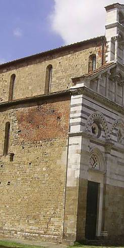
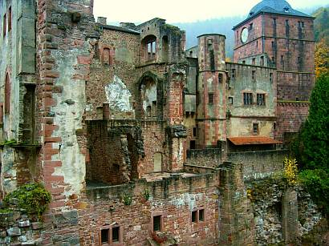
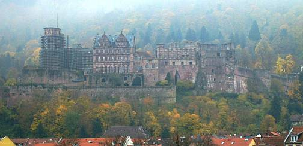
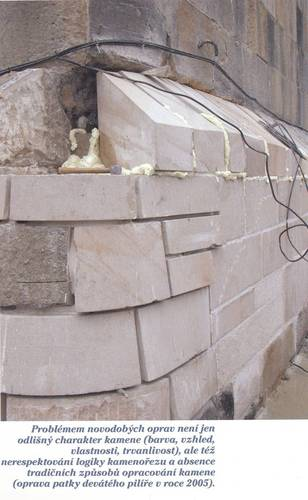
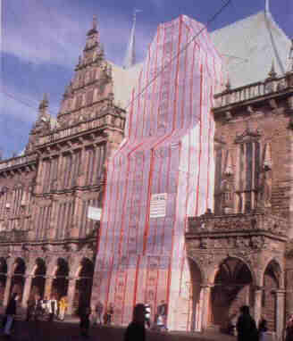

[🠔 Zur Übersicht: Altbau Restaurierung](20bausto.md)  
# Natur- und Ziegelsteinrestaurierung
**Bestandsgerechte Instandsetzung von Natur- und Ziegelstein an Wand und Boden.**  
_von Konrad Fischer_

> [!abstract]+ Kapitelübersicht: Natur- & Ziegelstein  
> 1. **Natur- und Ziegelsteinrestaurierung**
> 2. [Rekonstruktion oder Reparaturmörtel?](29bau02.md)
> 3. [Reparaturmörtel - Fluch oder Segen?](29bau03.md)
> 4. [Wasserabweisung / Hydrophobierung / Hydrophobisierung - Details](29bau04.md)
> 5. [Restaurierung Naturstein und Fachwerk, Wandbaustoffe im Altbau ...](29bau05.md)
> 6. [Die Kunst der Fuge](29bau06.md)
> 7. [Thema Boden/Verkleidung keramisch/mineralisch: Estriche und Bodenbeläge](29bau07.md)
> 8. [Reinigungsverfahren für verschmutzte Altoberflächen an Fassaden, Bauteilen und Kunstwerken](29bau08.md)

**Das Bild zum Thema:**  
   
_[Frans Francken - Der Tod und der Kaufmann (1620)](http://www.religionsunterricht.de/ifr/ifr45zd2.htm)_

> [!quote] Papst Paul IV. in seiner Enzyklika über den Fortschritt der Völker [POPULORUM PROGRESSIO](http://www.christusrex.org/www1/overkott/populo.htm)
>"Zum Unglück hat sich mit der Industrie ein System verbunden, das Profit als den eigentlichen Motor des gesellschaftlichen Fortschritts betrachtet, den Wettbewerb als das oberste Gesetz der Wirtschaft, Eigentum an den Produktionsgütern als absolutes Recht, ohne Schranken, ohne entsprechende Verpflichtung der Gesellschaft gegenüber. [...] Noch einmal sei feierlich daran erinnert, dass Wirtschaft im Dienst des Menschen steht."  

## Der Naturwahn

Am Altbau ist Naturstein bzw. Ziegel oft der vorherrschende Baustoff für Wand, Fassade und Boden. Zum Schutz gegen Witterung und zur Sicherung wirtschaftlicher Instandsetzbarkeit waren Natursteine bzw. Ziegelflächen regelmäßig mit Schutzschichten aus Mörtel/Putz/Farbe überzogen. An der "modernen" Fassade sind Natursteine und niedrig gebrannte Backsteine in Folge des Natursichtigkeitswahns und schädigender "Sanierverfahren" etwa ab der 1. Hälfte des 19. Jahrhundert erheblichem Witterungsangriff ausgesetzt, mit dem ihre Erbauer nicht rechnen konnten. Verheerende Bauschäden, Oberflächenabtrag, Teil- bis Totalzerstörung sind die Folge.

_Bild rechts: Berühmte Kirchenfassade in Italien - dem Touristen eine Augenweide, dem Kenner ein Beispiel organisierter Denkmalvernichtung. Die scharf geschnittenen Natursteine / Marmorbauteile der Front sind im Zeitalter der verschärften Vaterländerei (Risorgimento) erneuert, die original schützend und gestaltend überfaßten / überputzten Seitenwände freigelegt und der witterungsbedingten Verwüstung ausgesetzt. Größere Schadensbereiche wurden mit Ziegelflicken repariert - und sichtbar gelassen. Ein Zeichen von leerem Bauherrenbeutel, patriotisch aufgeladener Natursteintümelei oder wahnhafter Restauratorenehrlichkeit?_ 

## Zur Voruntersuchung, Planung und Vergabe

Ganze Heerscharen von natursteinkundigsten Planbekritzlern und Schabewerkzeugbesitzern, inzwischen sogar stirnlupen- bis computergestützt, widmen sich der Anfertigung und dem An-den-Denkmalpfleger-und-arglosen-Bauherrn-bringen von höchstaufwendigen Steinschadenskartierungen als "heute notwendige" Voruntersuchung. Motto: 321 Formenkreise des Sandelns, Schollens, mikrobiellen Bewachsens, des Reißens und sonstigen Fassadenschwächelns wollen  haarfeinst bunt kartiert werden. Ergänzt wird das meistens von "naturwissenschaftlichen" Untersuchungen an Stein und Mörtel. Um den störenden (da aufs Ganze guckenden und wirtschaftlich beratenden) Architekten auszuschalten, greift man für diese Kritzelarbeit gerne auf sog. "Experten" zurück, egal ob aus ausführenden Steinmetzbetrieben (die liefern die fettesten Geschenkpäckchen), aus Chemie- und Mineralogenlabors oder - am billigsten - aus Studentengeschwadern (manchmal von nebeneinkünftegeilen Professoren taktisch genau auf das verlockende Millionengrab angesetzt), die das denkmalgerechte Stifthalten sehr gut beherrschen. 

Unterstützt wird diese Truppe dann meistens von einschlägig vorbelasteten Mörtel- und Pampenherstellern, die allerdings auch dem Planer mit Umsonstplanungsleistung (garniert von lukullischsten Spezialitäten unter den Weihnachtsbaum) dienstfertigst und leibreizendst zur 24-Stunden-365-Tage-Verfügung stehen. Um ihre Produkte zu plazieren, nicht um das Denkmal mit geringstem Aufwand und bestandsgerechtester Reparatur zu retten, logo. Das fördert dann die Hintenrumhonorierung mittels [kostenexplosiver "Luxusplanung"](10hoai10.md). 

Konrad Fischer: Fassaden energetisch richtig und kostensparend sanieren 1 
 
[Teil 2](http://www.youtube.com/watch?v=Y1NSxAW15Cc) [Teil 3](http://www.youtube.com/watch?v=RAT7VzBo8k0) [Teil 4](http://www.youtube.com/watch?v=6TBII25iVQk) [Teil 5](http://www.youtube.com/watch?v=Kb0C4KiZvVA) 

 Der Gipfel des korrumpierenden Chemiewaffen-Produktplacements auf dem heißumkämpften Saniermarkt sind aber, neben den vielen herstellerkorrumpierten Experten (alle leicht erkennbar an ihren Gutachten- bzw. Ausschreibungstexten, in denen der das Neutralitätsverbot kraß mißachtende Begriff _"Produkt XY-Hersteller oder gleichwertig"_ Standard ist) unter falscher Flagge, die inzwischen teils sogar herstellerseits unter dem Titel "XY Fachplanung GmbH" frech und herstellerabhängig, oder unter wunderlichen Tarnbegriffen daherstolzierenden doktorierten oder sogar professorierten Chemiemuffi-Planungsabteilungen, die nicht nur wie selbstverständlich ausschließlich auf die Chemie-Wunderwaffen ihres Mutterunternehmens hinarbeitenden Untersuchungen des geschädigten Bestands, sondern teilweise auch alle weiteren Planungsschritte gem. HOAI - selbstverständlich nicht zu deren Konditionen!, am Markt offen feilbieten. Das Billighonorar wird dann mit den krassen Chemiewaffenpreisen dicke aufgespeckt. Fast schon rührend ehrlich, wenn derlei "Fachplaner" unter dem Markennamen firmieren. Derlei Beschiß ist bei allen untreuen öffentlichen und kirchlichen Baubeamten - jeglichem Neutralitäsgebot offen! hohnsprechend - seit jeher am beliebtesten - man schaue nur mal die beachtenswerten Referenzen an. Lieb Gewissen, lieb Rechnungshof, magst ruhig sein!

_Bild links: Das Heidelberger Schloß - eines der berühmtesten Opfer der jeweils herrschenden Denkmalideologie seit Dehios Aufruf: 'Konservieren, nicht restaurieren!' Und da in staatsbauamtlicher Betreuung. Ei, da wurde folglich immer fröhlich umgesetzt, was die Haushaltskasse gerade an Ausschüttungen (Motto: Zwerg Perkeo!) zuließ. In Anbetracht des dank sich ständig steigernder Fehlrestaurierungen ständig zunehmenden Verfalls - 'Für wo am nötigsten'. Details rund um brandschutztechnische und finanziell aufwendigste Verwüstungen und Sonderbarkeiten rund um allerlei Vergaben sparen wir uns lieber. Darf sich aber jeder seinen Teil denken, gelle!_

Nun fordert die VOB/A §9 für die Leistungsbeschreibung frech: _"Bestimmte Erzeugnisse ... sowie bestimmte Ursprungsorte und Bezugsquellen dürfen nur dann ausdrücklich vorgeschrieben werden, wenn dies durch die Art der geforderten Leistung gerechtfertigt ist."_ und _"Bezeichnungen für bestimmte Erzeugnisse ... (z.B. Markennamen ...) dürfen ausnahmsweise, jedoch nur mit dem Zusatz "oder gleichwertiger Art", verwendet werden, wenn eine Bezeichnung durch hinreichend genaue, allgemeinverständliche Bezeichnungen nicht möglich ist."_ , so sinngemäß auch in den novellierten Versionen der VOB 2006 ff. 

Und wo wäre es denn der Fall, daß allerüblichste Mörtel und Pampen, von x-beliebigen Produzenten in ähnlichster Weise produziert und mit geringstem Aufwand hinreichend genau produktneutral zu spezifizieren, die marktübliche Produktnennung erfordern? Für die Bieter bietet sich hierdurch obendrein die Möglichkeit, über den VOB-widrig benamsten Produkthersteller im Angebotsverfahren die Mitwettbewerber ausfindig zu machen und gemeinsame Kaffeeekränzchen zu arrangieren. Alles große Sauereien, auf Kosten des Bauwerks und des Bauherrn. 

 Dreimal dürfen Sie nun raten, wie beispielsweise am Heidelberger Schloß das Ergebnis aussehen würde, wenn man die Leistungsverzeichnisse der dort ablaufenden Sanierungen im Fassadenbereich, bei Dachdeckerarbeiten und wohl aller technischen Ausstattung sowie sonstiger Innenausstattung der letzten 20 Jahre mal prüfen würde, wie oft da schändlicherweise Produktnamen benamst wurden? 0-10 Prozent? 10-80 Prozent? 80-100 Prozent? 100-1.000 Proezent? 

Dreimal dürfen Sie auch raten, wieso es bei solchen Projekten so gut wie ausgeschlossen ist, nur einen einzigen [HOAI-gemäßen Planungsvertrag](10hoai.md) vorzufinden - also inkl. [§10.3a](103a.md), HZ IV mindestens Mittelsatz (entsprechend Bepunktung), Zuschlag § 24 mind. 30 Prozent bzw. § 27 mind. 50 Prozent, ausreichende - d.h. im Ausführungsmaßstab beauftragte geometrische und technische Bestandsaufnahme und vor allem: ungeschmälerte Leistungsphasen - egal ob nach alter oder neuer HOAI?! Mit dann [kostensicheren -und nachtragsvermeidenden Leistungsbeschreibungen - produktneutral und VOB-gemäß](9pbs.md) bis zum Exzeß? 

Doch wenn wir schon am großen Rätseln sind: 

Was glauben Sie denn, wie ein Planer die hier üblichen Unterhonorare auffängt und wer ihm beim Zuschustern, Einheimsen und Weiterverscherbeln für ihn kostenloser Planung bis zum fertigen - ja freilich: produktnamensgeschwängertem bzw. mit allerlei Nullnummerchens zur sicheren Angebotskalkulation eines graswachsenhörenden Bieters aufgespecktem - Ausschreibungstext treu und immer wieder zur Seite steht und warum? Wer hier an denkmalseligen Altruismus glaubt, oder daß es bei anderen öffentlichen, kirchlichen oder privaten Denkmalprojekten landauf und -ab irgendwo anders ablaufen würde, ist sicher auch noch ein treuer Fan vom Klapperstorch.

Auch sehr scherzig: Was alle Beteiligten wissen (eine harmlose Nachfrage würde das an den Tag bringen!) und dem Finanzverantwortlichen eisern verschweigen: Das ganze Dokumentations- und Tabellenzeugs der angeblichen Voruntersuchung ist nicht gerade selten für die Katz - hinter den prunkvollen Vorzustandskartierungen verbergen sich regelmäßig dramatische Abweichungen des Istzustands, mit erheblichem Nachtrags- und Änderungsbedarf bei der Ausführung. Den superfeinen Technoanalysen der angeblichen Wissenschaftler - in Wahrheit oft dem Goldmacherhandwerk barocker Prägung anhangenden Scharlatane - bis in das Elektronenraster der Denkmalsubstanz stehen leider nur kotzerbärmlichste Maßnahmenalternativen und verzweifeltste Rezepturpfuschereien gegenüber, die letztlich und geradezu zwangsläufig im bauphysikalischen Wahnsinn eines Dr. Eisenbarts enden - "Ich bin der Doktor Eisenbart, wide wide witt bumm bumm. Kurier' die Stein' nach meiner Art": 

Solche "Doktoren" definieren z.B. labortechnisch darstellbare Dampfdiffusionswerte des Neumaterials und vernachlässigen die demgegenüber 1000fach wichtigere Kapillartrocknungsfähigkeit. Der billigste Bieter oder der raffinierteste Nachtragsschinder oder gar vorinformierte Nullnummernspekulant kriegt dann den Auftrag - möglichst nach immer manipulationsverdächtiger beschränkter Vergabe, die meist als falschverstandenes Allheilmittel gegen Planungsirrsinn herhalten muß. 

Man einigt sich dann aber auf der Baustelle meist gütlich (eben unter Profis, die alle fett verdienen wollen, wenn schon mal Denkmalkohle zum Verbrezeln da ist): Kein Aufheben von den Kartierungs- und Planungsmängeln und weiter mit business as usual - nicht gerade allzu selten nach genauestens der Marschrichtung, die die freundlichen Produktberater der bauchemischen, wasserglasigen und trockenmörteligen Produktberatung gratifikationsgestützt vorgeben. 

## Steinfestigung und andere Restaurierungsspäße

Super-Radikalreinigung, dann silikatisch/zementäre/synthetisierte Festigungssuppen/Hydrophobierungen/Mörtelpampen mit Ewigkeitsanspruch von müllermeierschulze.de oder (die denkmalgerecht gewährleistungsfreie Variante) mineralogendoktoreninstitut.de, oder gar restauratorenwahnsinn.com, sind die allseits favorisierten Behandlungsmethoden, die am meisten Folgeschäden für das arme Steinchen verursachen können. Danach sind alle zufrieden und die künftige Sanierung der Sanierung trefflich vorprogrammiert. Bei maximalem Substanzschaden.

Wobei der wenigstnehmende Natursteinschwindler fast immer den Auftrag bekommt. Doch - was der vertrauensselige Auftraggeber (Kirch- und Staatsbauamt bevorzugt) nicht mitbekommt - der Schwindler nimmt auch vom teuren Festigungsmittel am wenigsten (fast sollte man ihn dafür loben, weil das dem Bauwerk helfen kann). Um dann dem strengen Herrn Bauleiter verbrauchte Gebinde vor- und abzurechnen, hat sich der allseits beliebte Trick eingebürgert, für diese Zwecke sogar extra viele leere Gebinde auf die Baustelle zu bugsieren. Man glaubt nicht, wieviel Nacht und Nebel auf deutschen Denkmalbaustellen herrscht. Die starke Schlempenverdünnung und monatelange Feuchthaltung der Festigungsstellen zur Verbesserung der Eindringtiefe ist in der Praxis dermaßen exotisch und teuer und unbequem, daß wir diese "Labormethode zu Apothekerkonditionen" hier mit Fug und Recht vernachlässigen dürfen.

Ach ja, die braven Steinrestauratoren. Sie bringen es ja auch ohne den geringsten Gewissensbiß fertig, noch die vorkonditioniertesten Beschichtungsprodukte hinter dem Rücken aller Beteiligten mit Billigzutaten zu verschneiden (Fallbeispiele bewiesen: bis über 70 % !! heimliche Zugaben). Es muß halt überall gespart werden - am besten bei der Qualität. Wie das im Extremfall aussehen kann, zeigt das Bild (Quelle: www.zachrante-karluv-most.cz) links: So restauriert die tschechische staatliche Denkmalpflege in Prag die Karlsbrücke - einst ein wahres Kleinod deutscher Handwerkskunst, heute der Abschaum des tschechischen Pfusches. Wobei auch deutsche Pfuscher sowas hinbekommen würden und haben, laßt uns bitte ehrlich sein - jeder fachmann weiß, zu welchen Schandtaten auch hierzulande angesehenste Steinrestautoren mit ihren Zementkunstharzpampen aus der Bauchemie anrichten - und zwar ohne mit der Wimper zu zucken und unter dem wohlgefälligsten Auge deutscher Baubeamten und Denkmalpfleger. Hier können Sie übrigens an einem sinnlosen Unterfangen persönlich teilnehmen - [Online-Petition](http://www.zachrante-karluv-most.cz/de/) gegen den [tschechischen Sanierpfusch unserer böhmischen Brüder im staatlichen Auftrag (Härrliche Buidlgalerie!)](http://www.zachrante-karluv-most.cz/de/photo-galerie.html).

Die international die chemikalische Verwüstung unserer wertvollsten Baudenkmäler vorantreibenden Natursteindoktoren kümmern sich nach all den bösen Krustenschäden endlich - aber viel zu spät - um die Optimierung der Eindringtiefe ihrer Festigungssuppen. Doch über arg zu wenige Millimeter kommen sie nicht hinaus. Entweder, weil die synthetischen Polymerzutaten in den Festigungslösungen schnell die Baustoffporen und weiter Mittelzufuhr verstopfen, oder weil die Soßen im Porenhohlraum zu schnell abbinden, verschlußfähige Kristallkomplexe bilden oder gar durch weitere wässrige Löungsmittelaufnahme anwachsen und aufquellen. Letztlich kommt es halt immer zur kapillarrißversprödeten trocknungsblockierenden Kruste, die den thermischen und hygrischen Angriffen auf der Fassadenoberfläche nur durch kluges Abscheren und -platzen gewachsen ist (der Klügere gibt nach). Das sieht dann fast aus wie "natürlicher" Steinzerfall und liefert neue Aufträge.

. 
_"Denkmalpflege" und gotische Kirchenfassade 2004: So überzeugend "patiniert" sehen einst restaurierend gefestigte Naturstein-Natursichtflächen nach einiger Natur-Bewitterung dann aus. Ja, das dumpf-trübe Mittelalter, da kommt ganz natürlich echt touristische Stimmung auf!_

. 
_Die selbe Pampe dann auch am Portalkapitell - krustig abscherbelnd im Bereich der Eindringtiefe, mehlig absandelnd darunter. So bereitet wackerer (Oh! Ha!) und immer unbarmherziger wütender Restauratorenfleiß unabdingbare Flächenerneuerung mit zementärkunstharzigem Antragsmörtel (recte: Spezial-Denkmalpflege-Restauriermörtel) auf neu gefestigten Untergründen vor. Der staatlichen und kirchlichen Denkmalpflege ist zu danken, daß die dies mitzuverantwortende Pfuscher- und Bauchemiezunft immer weiter goldenen Zeiten entgegensehen darf. Wir Steuerzahler und Klingelgeldspender garantieren ja gerne die Zukunft für derartige Opferstockplünderer.Wie sagte der große Petzet? "Die Denkmalpflege nagt immer wieder den selben Knochen ab". Das ist gewißlich wahr._

_Und wer wird von den "Restauratoren &Denkmalpflegern" dann als wahrer Schuldiger geoutet? Na klar: Der Liebe Gott. Denn seine (oder neuerdings der Ökogöttin Gaias) blöde Umwelt soll es sein, die den bösen Natursteinzerfall verursacht! Und nur die menschengemachte Großstadt-Umwelt ist also nach offiziöser Anschauung dran schuld, wenn der seit dem 19. restaurierungspampenverschissene Kölner Dom (Bauhüttchenspiel: wo ist der nächste Steinbrösel?) "allgegenwärtige umweltbedingte Steinschäden" aufweist, der nahebei - aber auf dem schafbeblöckten Lande - stehende sog. "Altenberger Dom" noch "seine 750 Jahre alten Abdrücke des Steinbeils auf dem Steinquader" vorweisen kann. Ein Faszinosum. Wers glaubt, wird selig._

Richtig wäre anstelle falscher Restauriertheorien im Dienst der www.de-s: eine _überwinterte Musterachse_ an der geliebten Fassade mit kritischer Kontrolle der gewählten handwerks- und baustoffgerechten, bestandsverträglichen, bestandsmaterialnahen, nicht trocknungsblockierenden und bestimmt nicht überfestigenden sowie voll reversiblen Reparaturalternativen als faktenreiche Planungsgrundlage, Verzicht auf alle vergebliche Liebesmüh betreffend ersatzweise Vorzustandskartierung und "naturwissenschaftlichem" Datenmüll des Bauchemiemarketings (Ausnahme: Farbefunde im technisch/konzeptabhängig notwendigen Umfang). Wobei es ebenbeispielsweise auch bewährte Festigungsmethoden auf Luftkalkbasis gibt, die betreffend Eindringtiefe, Vermeidung von Überhärte und Schalenbildung sowie Entfeuchtungsleistung - die wesentlichen Anforderungen an die Bestandsverträglichkeit und Dauerstabilitiät ohne Schadensrisiken für den Bestand - jeden Chemiepamp schlagen. Und dann natürlich die [VOB-gerechte Leistungsbeschreibung](9pbs.md) mit nachfolgender unbeschränkter öffentlichen Ausschreibung bei höchsten Anforderungen an die Eignung der Bieter und ihrer "Fachbauleiter". Das spart Baubudget und -substanz. Man könnte sogar - fast nie erreichter Gipfel der denkmalpflegerischen Herausforderung - ohne jeglichen Gestaltwandel einfach nur althergebracht durchreparieren, also die Löcher mit verträglichen Baustoffen stopfen. Doch nun zur technischen Praxis.

Reich bebilderte und erläuterte Beispiele: 

 
_[Die Musterachse an der Naturstein-Backstein-Fassade des Bremer Rathauses](11erh14.md)_

[www.domschatz-halberstadt.de/Kalkstein/1.htm](http://www.domschatz-halberstadt.de/Kalkstein/1.htm) - Die sagenhaft interessante, zeitraubende und teure Voruntersuchung zur Kalksteinrestaurierung am Halberstadter Dom. Ergebnis: Man probiert es mit den aus dem wiss. Untersuchungsprogramm logischerweise empfohlenen "Industrie/Chemie-Methoden" - und vorsichtshalber auch mit Kalktechnik. Weil man es offenbar ja nie so genau weiß. Wer weiß, wie das ausgeht?

Hier gehts weiter: [ Kapitel 2: Vierung, Rekonstruktion-Kopie oder Reparaturmörtel / Reparaturbaustoffe](29bau02.md)

---

**Inhaltsverzeichnis Baustoffkapitel:** 
[Einführung zum Problemkreis "Modernes Bauen"](20bausto.md#einfã¼hrung) 
[Einige Tips zur Produktvermarktung](10hoai22.md) - Ihre raffinierten (von Raffen?) Methoden, Tricks und Betrugsmanöver 
[Zusammenfassung](20bausto.md#zusammenfassung) 
Die anderen Kapitel: [0. Aktuelles](2baustof.md#aktuelles) 
[1. Gibt es "aufsteigende Feuchte"?](2aufstfe.md) 
[2. Erneuerung oder Erhalt von Altputzen](22bausto.md) 
[3. Erneuerung oder Erhalt von Altfenstern](23bausto.md) 
[4. Geeignete und ungeeignete Farbsysteme auf Holzuntergründen im Innen- und Außenbereich](23bau08.md) 
[4a. Rostschutzanstrich](23bau10.md#rostschutzfarbe) 
 [5. Wirksamer bekämpfender und vorbeugender Holzschutz ohne Gift](23bau16.md) 
[6. Luftkalkmörtel für Mauerwerk, Innen- und Außenputze, Dachdeckerbedarf, Verfugung und Verpressung](26bausto.md) 
[7. Mineralische untergrundverträgliche Anstrichsysteme](26bau07.md) 
[8. Ertüchtigung historischer Gründungen durch Stopfverfahren](28bausto.md) 
[9. Natursteinrestaurierung/Naturstein](29bausto.md) 
[9a. Boden/Verkleidung keramisch/mineralisch](29bau07.md) 
[9b. Reinigungsverfahren für verschmutzte Altoberflächen](29bau08.md) 
[10. Wandbildner im Altbau](29bau09.md) 
[10a. Nachtrag: Fachwerkbau/Holzfußboden/Fußbodenaufbau allgemein](29bau16.md) 
[11. Der Stahlbeton und Zement](2beton.md) 
[12. Dachdeckung und -konstruktion](212baust.md) 
[13. Wärmedämmung](213baust.md) 
[14. Brandschutz im Altbau](2baustof.md#14) 
[15. Arbeitssicherheit bei der Altbauinstandsetzung](2baustof.md#15) 
[16. Links zu verwandten sonstigen Themenbereichen ](2baustof.md#16) 

Das meinen die Anderen: 

**Natursteinliteratur / Bücher über Naturstein-Restaurierung / Naturstein-Instandsetzung:** 

**Fachwerkliteratur / Bücher über Fachwerkrestaurierung / Fachwerkinstandsetzung / Fachwerkreparatur / Fachwerkbau / Fachwerkhaus / Fachwerkgefüge** [(hier rezensiert)](8buch07.md): 

