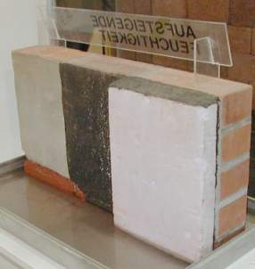
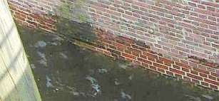
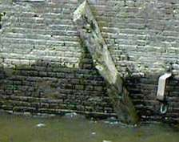
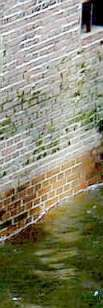
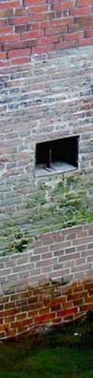

[🠔 Zur Übersicht: Fugt-Svindel 1](2auffdk.md)  
# Opstigende fugt og fugtspærre mod opstigende fugt på sokkel og vægge?
**Kontrovers med opstigende fugt: Efterfølgende horisontalisolering fugter murerne.**  
_von Konrad Fischer_

Information og oplysning 

Kapitel 2

 

Her følger nogle billeder fra "udtørringen" med badekarret i den indesumpede murværk fra Denkmalmesse 2004, Leipzig:

 
_Pas på: Ikke alle steder hvor der står "OPSTIGENDE FUGTIGHED", er der opstigende fugtighed indeni!_

 
_Ufatteligt, hvordan man med en smule fiffighed kan få overtalt den naive fredningsmyndighed til en sådan "tørlægning"._

 
_For medkonkurrenterne lykkedes det heller ikke at få fugten til at stige. 
Det kan man vente på indtil dommedag. _

Hvorfor? Læs endelig videre!

_Salt-fækalie-vand på Hamburgs kajmur uden "opstigende fugt" og uden horisontal isolering men med flodhøjde og bølgeslag:_ +

++

_Også i Bambergs "Altes Rathaus" inde i Regnitz-floden mangler "opstigende fugt": 
Pinlig!_

Alle mulige uanvendelige byggemetoder bruges i indsatsen mod "opstigende fugt". Den uvidende byggeherre har jo mere end nok penge! I Bautenschutz+Bausanierung hæfte 7/01 skriver forfatterne Dipl.-Chem. A. Detmann, Prof. Dr. rer. nat. habil. H. Venzmer, Dipl.-Phys. C.-M. Moewe und Dipl.-Phys. O. Bakhramov, alle fra Dahlberg-Institut Wismar _"Feuchteschutz, Die technische Gretchenfrage, Sind elektroosmotische Trockenlegungsverfahren anwendbar?"_ efter deres forskningsresultater på s. 57 er de kommet frem til følgende konklusion _"den elektroosmotiske metode [elektroosmose], som kun anvender minimale spændinger og der er stor afstand mellem elektroder, opnåede ikke noget brugbart resultat"_. 

 

Denne test har klargjort, at med disse metoder er det umuligt at opnå noget nævneværdigt kapillar-brydende effekt. Ærgerligt for den som er blevet bedraget ved dette system. Også ærgerligt for de mange kunder som har betalt for alle de idiotiske metoder som har udgravet, isoleret, påklæbet bitumen-systemer og inden har brugt [saneringspuds](2sanipuz.md), selvom om der kun var en smule kondens og saltudblomstring/saltudslag/saltudslip på den kølige kældervæg. Dårligere kan man ikke begrave sine penge.

**Opstigende Fugt?[Kap. 3](2aufdk3.md)**
