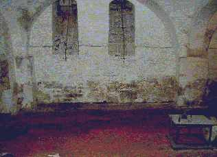
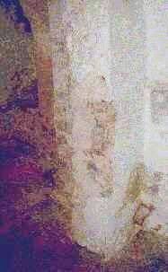
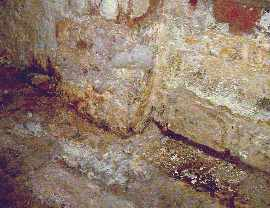
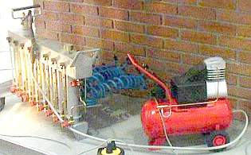

[🠔 Zur Übersicht: Fugt-Svindel 1](2auffdk.md)  
# Svindleri med den opstigende fugt 3
**Specialister i ødelæggende bedrageri, usikre „eksperter“: arkitekter og ingeniører, ofre for smart saneringsbranche. Øgede byggeomkostninger uden at løse rodproblemet.**  
_von Konrad Fischer • aktualisiert 20.06.2009_

## Opstigende fugt og fugtspærre mod opstigende fugt på sokkel og vægge?

Information og oplysning 

Kapitel 3

**(Opdateret 20.06.09)** 

 

Specialister i dette ødelæggende bedrageri, er de faglige usikrere "eksperter": arkitekter og ingeniører. De er de simpleste ofrer for incentiv-støttede tilhviskninger fra den smarte saneringsbranche. Tager en byggebedrager et jakkesæt på, straks overbeviser han de såkaldte akademiske byggeeksperter. Med de brutale saneringsmetoder bliver byggeomkostninger forhøjet og dermed flere penge i byggeeksperternes lommer, uden ekstra anstrengelser. Ekspertvældet støtter sig ligesom med [saneringspuds](2sanipuz.md), [statslige energispareforskriftelser](7wsvoant.md) og [vinduesudskiftninger](23bausto.md) til normtilbedelsen, forkerte diagnoser. Det er som at skyde spurve med kanoner og til syvende og sidst blive savet, boret, isoleret, påklistret, sprøjtet, ophedet og sat strøm til og hvad som ellers findes af værktøjer for at skabe det maximale antal af huller i bygherrens pung; pengene fosser ud. Kun en ting bliver der ikke gjort: problemet bliver ikke revet op med roden, således at salt og fugtighed i muren bliver mindsket eller helt fjernet. En særlig risiko er falske sagkyndige som siger noget om fugtighed og tørlægning af murværk og omtaler denne så godt som ikke-eksisterende opstigende fugt som et underordnet problem med flere løsnings muligheder. På den måde kommer det til forkerte foranstaltninger uden virkning. 

 

En seriøs godtroende skulle så her sige: "opstigende fugt i murværk kan af tekniske grunde **_ikke_** forekomme, lad os nu søge efter de virkelige grunde til fugt, (vand og regn udefra, skadesaltudladning i fugtigt murværk, kondens fra fugtigvarm luft i kølige bygningsdele) og lad os så finde de virkelige foranstaltninger til at bekæmpe dette. Tabeller og dyre fugt- og saltpetersforskning kan man derfor ikke bruge, men kun sin gode forstand (hvis dette da ikke nu om dags er forbudt) 

Det er dog ret sjældent. Og så undrer det ikke at få år efter, er dette kemivåbenangreb fra de kemiske fabrikker gået i vasken.

  _Middelalderkælder i murstensbyggeri ved slutningen af en byggekemisk "Tørlægning" hvor der er lavet en horisontalisolering spærremørtelfugning, derudover tætning og overfladebehandling med "saneringsbyggematerialer". Det mørke område betoner saltforløsning og kondensforstærket fugtkoncentration på gulvet og på væggen som en reaktion på "kiesel-"injektionsløsning, "spærremørtel", "specielaflejring for slam", "mursalt spærring" osv. af indbragte byggekemiprodukter. Salze efter kemisk analyse: Ettringit (stærk ekspanderende skadesalt Drivmineral), Kalisalpeter, Gips, Natriumkarbonat, Trona..._

_Også alle andre flader i rummet (gulvet, vægen og hvælvingerne) såvel som midtsøjler er ekstremt saltødelagt og krummet._ 

 _På injektionsområdet og under vokser centimeter lange saltudblomstringer. Overfladen på murværket er støvet, skæller af, og ujævn. Arkitekturoverfladen er totalødelagt. Her har den anvendte kemisuppe udført alt arbejdet_ 
 _Ved muresøjlen er der ved passage rykket nogle dele løs. Saltsprængningen har imidlertid brækket nogle kubikcentimeter af kanten_ 
 _På gulvet under "horisontalisoleringen" vokser pestbyldagtige saltbjerge. Bestanddele er skrællet af ligesom på væggene._ 

Alt dette sker få år efter "saneringen". Firmaet som har udført dette er væk og ingen arkitekt er mere mulig at få fat i. Der går lidt tid indtil det metertykke murværk, som udvendig med kemimørtlen (spærremørtel, tykke sikringer, ...) vandglasteknisk er blevet "(k)i(es)soleret" samtidig er rummet blevet indkondenseret med fugt. 

Og masser af salt vokser ud af vægen fra disse vidunderlige saneringsprodukter (her vil jeg spare jer for at citere omtaler fra disse firmaer med "saneringsråd", såvel som billedserien fra den 'blomstrende' ødelagte middelalderkælder besidder). 

 
_Endnu en vitrinær udstilling af en tørlægnings-installation fra messen "denkmal", Leipzig 2004. 
Her er ingen bedre rigt-indholderne skattejagt for byggebranchen end på den fugtige væg. 
Det er takket være den fremragende ekspertintelligens fra planlæggeren, fredningsmyndigheden og bygherren._

**Opstigende Fugt?[Kap. 4](2aufdk4.md)**
