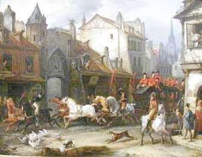

[🠔 Zur Übersicht: Fugt-Svindel 1](2auffdk.md)  
# Opstigende fugt og fugtspærre mod opstigende fugt på sokkel og vægge?
**Kontrovers med opstigende fugt: Efterfølgende horisontalisolering fugter murerne.**  
_von Konrad Fischer_

Information og oplysning 

Kapitel 5

Til den videnskabelige baggrund:

bausubstanz 7/98: Konrad Fischer: Senere horisontaltætning af historisk murværk 
(supplerende udgave)

_"Målgivende for den grad af gennemfugtighed er suge-muligheden , altså porestrukturen i de anvendte byggestoffer. Da****fugtigheden altid trænger fra den store pore til finporen lagene (aldrig omvendt)**** er det vigtigt hvordan porerne ligger mod hinanden."_

- således Heinrich Schmitt i: Hochbaukonstruktion, Die Bauteile und das Baugefüge, Grundlagen des heutigen Bauens, femte oplag 1974, S. 34. Det handler også om historisk murværk! Hvordan er det nu porrerne ligger ved siden af hinanden?

På jordbunden bliver fundament- og sokkelmurværket regelmæssigt holdt rigtigt sammen, altså tæt, finporet natursten. Bindemidlet bestod af storporet kalkmørtel, for det meste kun sparsomt anvendt. Det ikke tilmørtlede område på det tørre fundament mur og overgangen fra den finporede sten til storporet mørtel virker kapillarbrydende. Over sokkelen kommer ydermuren af natursten eller mursten, ofte med en tættere porestruktur som fundamentstenene. Således opbyggede den gamle arkitekt murværk, som huskede den opstigende fugt og som de ovenstående lærebogsudsagn kun gav få muligheder for. I det 19. århundrede gik den faglige viden desværre tabt, med tvivlen som indsats kom isoleringsmaterialet på banen. 

 

Også den gammeldags beskyttelse mod regn-transport gennem facaden inden døre blev ofte skabt med simple midler: Tolags murværk med grov indfyldning. Kapillartransporten af vand blev således afbrudt med overgangen fra finporet mursten til storporet kalkmørtel, ligesom den storporede kernefylding var sikkert forbundet.

Denne grundviden om kapillartransport benytter man i dag, det sker eksempelvis ved udførelse af den efterfølgende kemisk horisontalspærre, men også ved udvikling af komprespudsen. Til sidst må man pege på en kapillarporefuge, som med afvisning af den saltholdige løsning i det gamle murværk på tilsvarende vis giver mulighed for finporerne. Også ved ["WTA-certificeret mineralsk, hurtigt afbindende, saltresistent, trykfast saneringspuds ved en optimal porevolumen"](2sanipuz.md) springer det i øjnene, at ved finporerne er der forsalter og først da er den mest fordelagtige mulighed storporerne. 

Hvorfra kommer så de berygtede sokkelpudsskader, som på naiv måde bliver forklaret som "opstigende" fugt?

**1. Murværksforsaltningen**

Den historiske og moderne brug byder på mange muligheder for saltbelastningen af det historiske murværk:

- Det kan eksempelvis ske ved strø-eller salpetersalt,

 
_Gammeldags trafik_

- senere ved vejbyggeri eller gård ændring ved voksende planter ved foden ved muren. 
- Fækaliebelastning ved vinterligt sammenrykning af hus- og staldbeboere i stue etagens opvarmelige rum (i landslægens protokoller i det 19. århundrede op til 15 personer samt unge- og småkvæg), 
- Yderlige beboelse/stald benyttelse i land- og markbeboelsessteder, også i arbejderbebyggelse, 
- Beskyttelsesrumsbenyttelse for befolkningen i nød- og krigstider, som ville rede deres kvæg fra at blive slagtet af fjenden ved kirken eller ved borgen. 
- Misbrug af bolig/boligrum, lagerrum, eller helligrum som svinesti, ko stald, får laden, ged stald eller hestestald, som det eksempelvis Bamberg Domkirke blev under 30-års-krigen.

 
_Tidligere svinstald, i dag lager i kælder_

Det har så bredt sig med moderne skadesaltkilder hvor cement, trass og silikatindeholdende byggematerialer samt mange injektionsmaterialer. Også bekæmpningsmidler mod ægte hussvamp er saltindeholdende, det forsøger at hindre dets vandforsyning og virker derfor poreforstoppende. 

Når salt når murermørtelen, gør det porerne snævrere og letter kapillartransporten fra stenen. Meget vigtigere er dog den nu forhøjede hygroskopiske vandoptagelse. Salt lagres allerede ved mindre luftfugtig vand. Saltene går ved forbløffende lidt vandudbud i opløsning og viderebringer så det forkerte indtryk ved betydelig vandfugt. 

Hvad skal en horisontalisolering mod et forsaltet og hygroskopisk virkende murværk? Det er billigt, virksomt og rigtigt for gamle huse at gøre en pudsudskiftning, udkrasning af problematiske fuger, samt en nypudsning med offerpudsteknikken.

**Opstigende Fugt?[Kap. 6](2aufdk6.md)**
