[🠔 Zur Übersicht: Nordisk](nordisk.md)  
# Hjælper en fugtspærre mod „opstigende“ fugt på sokkel og vægge?
**Denne artikel kritiserer, hvordan 'opstigende fugt' udnyttes af byggebranchen til at sælge unødvendige analyser og skadelige 'løsninger'. Få indblik i de metoder, der ofte skader mere end de gavner.**  
_von Konrad Fischer_

## Hjælper en fugtspærre mod "opstigende" fugt på sokkel og vægge?

Information og oplysning 

Kapitel 1

> [!abstract]+ Kapitelübersicht: Fugt-Svindel 1  
> 1. **Hjælper en fugtspærre mod „opstigende“ fugt på sokkel og vægge?**
> 2. [Opstigende fugt og fugtspærre mod opstigende fugt på sokkel og vægge?](2aufdk2.md)
> 3. [Svindleri med den opstigende fugt 3](2aufdk3.md)
> 4. [Opstigende fugt og fugtspærre mod opstigende fugt på sokkel og vægge?](2aufdk4.md)
> 5. [Opstigende fugt og fugtspærre mod opstigende fugt på sokkel og vægge?](2aufdk5.md)
> 6. [Opstigende fugt og fugtspærre mod opstigende fugt på sokkel og vægge](2aufdk6.md)
> 7. [Opstigende fugt og fugtspærre mod opstigende fugt på sokkel og vægge?](2aufdk7.md)
> 8. [Opstigende fugt og fugtspærre mod opstigende fugt på sokkel og vægge](2aufdk8.md)

 Opstigende fugt eller opstigende jordfugt i fundament er (ligesom den indbildning at [varmeisolering isolerer varme](213baust.md),) vidunderligt for byggebranchen og byggesagkyndige som benytter sig af fejlen ved bygherrens uvidenhed. Vandglas eksperter og mursalpeter byggesagkyndig før kemisk eller mekanisk eller elektronisk bekæmpelse af fugt og salt og fugtskader og fjernelse fugtighed i kælder, lecablokke og tegelmur bliver tilkaldt, laver analyser og undersøgelser på hvordan man kan bekæmpe dette. Byggeherrens penge bliver brugt på laboratoriearbejde og han får alle mulige ubrugelige betegnelser for hvordan skaden kan beskrives. 

 

Hvad er det? 
Af-, på-, fra-, gennem-, til-, opstigende fugt? Fugtkilden: Jordfugt eller højt grundvand i kælder trænger igennem i kælderrums kælderydervægge eller kældergulve?

... 
. 
.. 
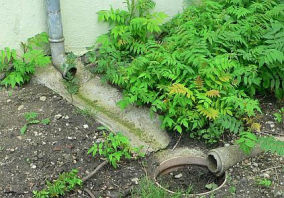.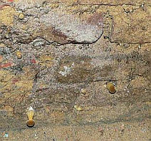.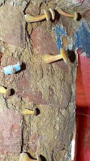.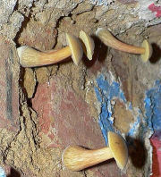. 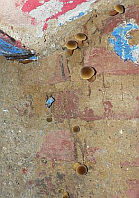 

 Eller så: 

... 
. 
 

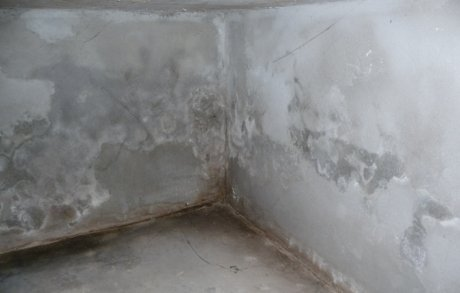 

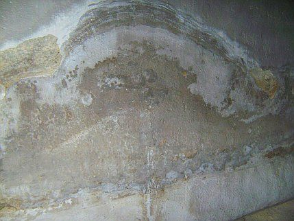 

Og det? 

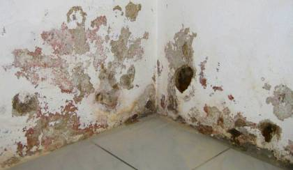 

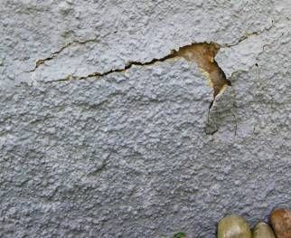 

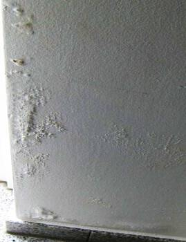 

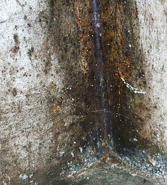 

(billeder fra min bygherrerådgivning) 

Før vi begynder: [kapillar-gåden](21bausto.md#kapillar)

Først er det med fuld overlæg at der bliver lavet et målrettet resultat som forinden er fastlagt. Man skal jo fange kunderne, ved hjælp af alle disse "seriøse" analyser. Så bliver der præsenteret "vigtige" tabeller med mange forskellige kemiske salt-formler, hvorved øjnene kan blive skadet. Derefter sker så ødelæggende indgreb (horisontal isolering som vandafvisende barriere i midten af muren, mur-gennemsavning, jernplader eller grødinjektion, flydende kemiske indsprøjtningssystemer indføres langs med mørtelskiftet i forborede huller, nogen gange måske endda med brandvarme eller tilisede kemikalier) med efterfølgende ødelæggende arbejder ([saneringspuds](2sanipuz.md), [hydrofobering](29bau04.md), [tørringsblokerende, vandafvisende, "dampdiffusionsåben" pudslag](22bau2.md#anstrichabnahme)) og forelagt godtroende kunder. Det skal eksempelvis hedde sig: "At efter indbringelsen af XY-horisontalspærren" er det er en fordel (ved muresalpeterudslag nødvendigt) at ved pudsarbejde på tilsvarende måde at tilføre specialpuds meningsløse store indpumpninger af injektionsmidler, så der også flere kvadratmeter spærrende "saneringspuds" medregnet. Således at virkningsløsheden af den idiotiske fremgangsmåde ikke med det samme kunne gå op for kunden.

Naturligvis er flere løsningsforslag undervejs, som "Fugtspærre", "tilbud om fjernelse af fugtskader / Fugt / grundvand, jordfugt, byggefugt på sokkel og vægge i kælder / kældevæggene" / "tilbud: XY-system - murtørlægning" / "tilbud af kældersanering" / "tilbud murværkssanering - XY-system" / "standsning af opstigende fugt" / "speciel fugtspærre mod opstigende fugt" med mere eller mindre tykke lag påpudset videnskabeligt virkende kaudervælsk og "referencer", måske endda tilbud om penge-tilbage-garanti tilføjet. Leverandørerne sparer så deres salt-påvisninger og vækker helt uforblommet det indtryk at deres tilbud vil skaffe "opstigende" fugt af vejen. Det sker også ret snedigt med fugt-før-fugt-og efter-målings "beviser", når man måler den første fugt i luft og byggefugt i sommerhalvåret som kommer efter den ikke fugtige systematisk tørre vinter, fortrinsvis januar. Flot trick, som man altid støder på: dramatiske udregninger af skadeflader i tilbudet og derefter ordretilbud med gode tilskyndelser ("som det også er nødvendigt for fladerne") hvor godtroende, og intetanende bygherrer er værgeløse. 

Med disse tricks lykkedes det at overtale den godtroende byggeherre. Det koster!

**[Opstigende Fugt? Kap. 2](2aufdk2.md) [3](2aufdk3.md) [4](2aufdk4.md) [5](2aufdk5.md) [6](2aufdk7.md) [7](2aufdk7.md) [8](2aufdk8.md)**
