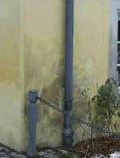
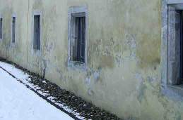
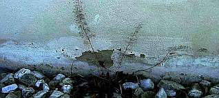
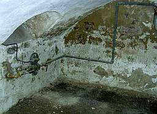
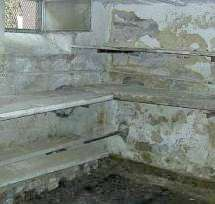
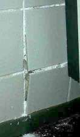
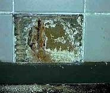
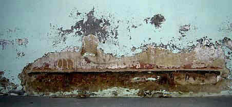
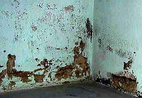

[🠔 Zur Übersicht: Aufsteigend Feuchte?](2aufstfe.md)  
# Feuchtequellen
**Warum Salze und Kondensat die wahren Ursachen feuchter Wände sind und herkömmliche Abdichtungen scheitern.**  
_von Konrad Fischer • aktualisiert 04.08.2009_

## Aufsteigende Feuchte + Keller-Sanierung und Trockenlegung 3

Aufsteigende Feuchte Kapitelübersicht 

**(aktualisiert 4.08.09)** 

(Fortsetzung von [2 - Ein schrecklicher "Trockenlegungsfall"](2auffe02.md)) Auch woanders darf man das beobachten: 
Und wie um die Ecke: Alles keinerlei gegen alle Bauphysik und gem. absurder "Bauwissenschaft" des trockenlegenden Gewerbes aufsteigende Feuchte, sondern ganz natürlich bedingt und nicht durch Wunder der Technik und des Geldrausschmeißens, sondern mit vergleichsweise wenig Aufwand und nicht durch Wunderbaustoffe und Zauberei, sondern lediglich etwas Wasser! lösbar. Selbst in Eigenleistung.

Aber nicht mit entfeuchtungssperrendem [Sanierputz](2sanipuz.md) und trocknungsblockierender "Mineralfarbe", die in Wahrheit allerdollste Plastikpampe - recte "[Dispersions-Silikat-Farbe](22bausto.md)" heißt. Das bröselt nämlich auch und schadet dem Fundamentmauerwerk.

---

Außerdem: Die brave Hausfrau düngerte den gut bewässerten Vorgarten, darunter der Keller diente dann als Nitrophoskasalzschaubergwerk bis zur kommenden Keller-Sanierung: 

Die wiederkehrenden Hochwasser - von unten im Keller als wirklich aufsteigende Feuchte aus dem Boden steigend und fäkaliengeschwängert dank Schweinehaltung im naheliegenden Schupfen und vermutlich auch im Kellerloch selbst - dramatisieren den Feuchtsalzeffekt. Er zeigt sich in nahezu ständiger hygroskopischer Feuchteaufnahme aus der Raumluft. Schon bei 50 Prozent geht das hauptsächliche Fäkalsalz - Kalziumnitrat = Mauersalpeter - in Lösung über, durch quasi Ansaugung der Raumluftfeuchte, und darunter entstehen die sich in Ausblühungen zeigenden Salzkristalle, die oft auch fälschlicherweise als Schimmelpilzmyzele verdächtigt werden. Der dabei entstehende Kristallisationsdruck zerstört dann die Oberflächen, an denen die Kristallisation stattfindet. So entsteht der sogenannte Mauerfraß durch Mauersalpeter (Nitrat-Salz, Kalknitrat), die mürben Putze, die abschollenden Anstriche, die aufbröselnden Mauerfugen, die aufschiefernden Natursteinoberflächen im Gewölbekeller, an Wänden und Mauersockeln usw. Was sollen hier Horizontalisolierungen im "sanierten" Mauerwerk, die der brave Mauerwerkstrockenleger so treuherzig anpries und der käufliche und technisch ahnungslose Sanierschwachverständige für teuer Geld empfahl bzw. im Hintenrumauftrag der dank fetter Kickback-Provision begünstigten Trockenlegungs-Bohrlochsperre-Mauerinjektionsverfahren-Abdichtungsmittel-Mauersäge-Firma herbeigutachtete - das Favoritenverfahren für gutgläubigste Ossis, pardon: Bewohner / Bevölkerung Mitteldeutschlands/Ostdeutschlands - je nach Gusto? 

Oder hier, noch näher am Schweineschupfen?:

Die kalte Salzwand des kellerigen Winterstalls nimmt warmfeuchte Luft dankend zur Kenntnis - das ist die ultimative Chance, endlich - bei relativer Raumluftfeuchte über ca. 50 % - in nasse Lösung zu gehen. Was soll da lächerliches Gebohre in die nasse Bausubstanz und Befüllen der Bohrlöcher mit Chemiegift nutzen? Verdrängen kann die Injektionssuppe die Porenfeuchte keinesfalls, und selbst, wenn man die Bohrlöcher ausheizt und erst dann den strohtrockenen Zustand verfüllt, entsteht noch lange keine wie erhofft funktionierende Horizontalisolierung, denn das hygroskopisch auffeuchtende und befeuchtende Schadsalz wird ja gar nicht bekämpft. Deswegen dann Kaschierputz gem. WTA druff - das kostet dann extraviel. Der Hausbesitzer hat's ja.

Hier platzt salzausblühbedingt der neue Fliesensockel - ca. 20 qm - ab. Ein guter Grund, für 70.000 EUR den historischen Bau - ein gutes Baudenkmal mit Handwerks-Knoffhoff bis in die innerste Mörtelfuge "trockenzulegen", wie es die "Fachfirma" anbietet und der renommierte Trockenlegungspapst von industriellem Gottesgnadentum vorbetet? Mauersäge + Sanierputz nach Salzpapst einmal rund herum? Aber nein:

Nicht aufsteigende Feuchte, nicht von außen drückende Feuchte - es ist der Treibmineral-Schadensklassiker doofer und komplett materialunkundiger Putzer und Fliesenleger. Details dieser Kellersanierung sparen wir uns, das würde sonst das Pfusch-Handwerk schädigen. Ein Gewährleistungsfall und schnell gelöst! Und zwar ganz ohne Mauersäge und eingetriebene Edelstahlbleche, ohne Bohrlochinjektion, ohne Erdstrahlen, Universalmagnetismus bzw. Magnetfeldumpolung und selbstverständlich auch ohne aktive oder passive Elekroosmos.

Ein Keller nach bester Bauart von 1939. Mit einer sauber eingebrachten Dichtmörtelfuge (kostete auch damals schon sinnlos extra), die hier als typische Horizontalisolierung wiederum nicht verhindert und auch selbstverständlich nirgends verhindern kann, daß es darüber bröselt.

Um die Ecke auch nicht. Der Grund liegt natürlich in nutzungsbedingtem Salzeintrag. Die Quellen dafür sind schnell ausgemacht. Und die wie immer preisgünstige Gegenmaßnahme auch.

---

Weiter? ===> **Aufsteigende Feuchte[Kapitel 4: Ziegel-Mauerwerk und Aufsteigende Feuchte](2auffe04.md)**
