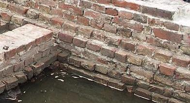
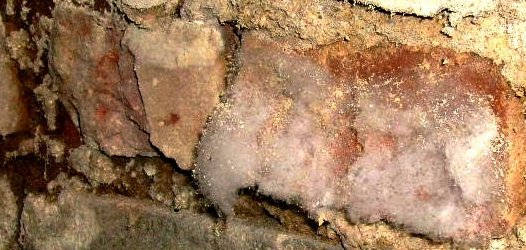
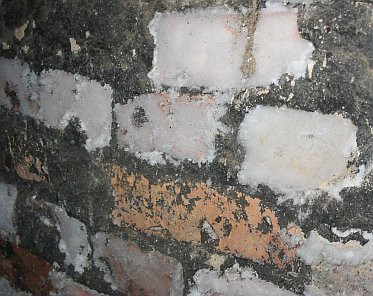
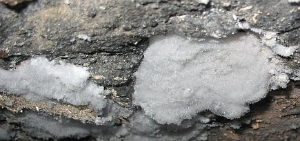

[🠔 Zur Übersicht: Aufsteigend Feuchte?](2aufstfe.md)  
# Ziegel-Mauerwerk und Aufsteigende Feuchte
**Vorsicht: Nicht überall, wo „AUFSTEIGENDE FEUCHTIGKEIT“ draufsteht, ist auch aufsteigende Feuchte drin, selbst nicht nach 5 Tagen Wasserbad!**  
_von Konrad Fischer_

## Aufsteigende Feuchte + Keller-Trockenlegung 4:

Aufsteigende Feuchte Kapitelübersicht 

Einige Bilder von in der Badewanne eingesumpften Mauerkörpern der "Trockenlege-Profis" auf der Denkmalmesse 2004, Leipzig:

 
Vorsicht: Nicht überall, wo "AUFSTEIGENDE FEUCHTIGKEIT" draufsteht, ist auch aufsteigende Feuchte drin, selbst nicht nach 5 Tagen Wasserbad!

 
Unglaublich, mit wie wenig Raffinesse dem arglosen Denkmalpfleger, dem heiligen Kirchbauamt, dem schlauen Baubeamten, aber auch dem geschmackssicheren Architekten und sogar dem klammen Bauherrn "Trockenlegung" aufgeschwätzt werden kann. Man prüfe nur mal die Referenzen des horizontalisolierenden + sanierverputzenden Gewerbes.

 
Auch dem Mitwettbewerber gelingt es nicht, die 5-Tage-Feuchte über die erste Fuge hinaus aufsteigen zu lassen. 
Da kann er bis zum jüngsten Tag drauf warten und stündlich seine Verdunstungsfeuchte in der Wanne nachgießen.

Im schönen Hamburg stimmen die Wassermauern / Kaimauern mit der Laborwanne überein. Es ist natürlich allerfeinst gesponnenes Seemannsgarn, wenn neben Seejungfrauen und Tiefseemonstern Hamburger "Bau-Experten" von "Aufsteigender Feuchte" fabulieren, wo nur Wellengang und Tidenhub das Salzfäckalbrackwasser in Elbe und Alster an die (wg. mangelhaft vermörtelter Fuge und entfeuchtungsstauenden Hydrophobierung oft sinterverschmutzten) Fundament- und Kaisockel spülen:

++++

Im zumindest für Oldenburger noch wesentlichen schöneren Oldenburg belegt der archäologische Grabungsbefund einer städtischen Baustelle vor dem Kaufhof, daß es im 17. Jahrhundert noch keine Horizontalisolierungsfans gab. Das gut erhaltene und selbstverständlich mit hydraulefreiem reinem Luftkalkmörtel gemauerte Backsteinmauerwerk zeigt weder Horizontalisolierung noch aufsteigende Feuchte, sondern über der Waterkant schöne trockene Mauersteine und Fugen - obwohl seit anno dunnemals im nassen Grundwasser stehend (Bildquelle: Architekt Richard Lindemann, ein aufmerksamer Besucher meiner Webseite - Dankeschön!):

Abgesoffene Grundmauern, Befund: Mittelalterliches Mauerwerk, perfekt in erstklassigen und porenreichen Kalkmörtel gelegte Backsteine (kein porosierter Ziegelschwamm!), keinerlei aufsteigende Feuchtigkeit! Bitte erklären Sie mal den Befund, meine hoch verehrten Herrlichkeiten und Dämlichkeiten der weltweit sägenden, verpressenden, bohrlochisierenden, injizierenden, osmotisierenden und kaschierenden Trockenlegungsindustrie / Bauchemie! Könnsenet? Ja, da bleibt nicht nur der Schnabel trocken ... 

Auch diese weißliche watteartige Belag als sehenswerte Mauersalpeter-Ausblühung neben naßfeuchter Mörtelfuge unter herabgefallenem Wandverputz (Foto von Objektberatung) ist weder Schimmelpilz-Befall, noch das effloreszierende Resultat aufsteigender Mauerfeuchte. 

Dieser auch nicht. Da werden die Berater der Bausanierung und Trockenleger-Profis und deren leichtgläubigen Opfer freilich sehr enttäuscht sein, denn weder toxische Pilzbekämpfung noch Mauerwerksvergiftung mit gräßlichen Injektionschemikalien, geschweige denn alle anderen Wunderlichkeiten der nachträglich-einträglichen "Horizontalisolierung" machen in diesem Fall Sinn: 

Hier ist die Kacke am Dampfen. Ergebnis früherer Hausschweinhaltung. Hausschweine? Ziegen und Schafe, Hühner, Gänse und Enten in deutschen Wohnungen, in Villenkellern, in den großstädtischen vornehmen und weniger vornehmen Bauten in Deutschland und Österreich? Wer hätte davon schon gehört? 

Fragt die Alten zum polithistorischen Kontext, zur Baugeschichte und treibt Bauforschung, lest ihre Briefe und sonstigen Aufzeichnungen! Ach so, das könnt ihr nicht, da ihr die deutsche Schrift, die Sütterlin nicht entziffern könnt? Pech eben. 

Wie es damals hierzulande wohl zuging, als der feine Karlspreisträger der noch feineren, und mit ihrem Karlswahn mit abstrusen Geschichtsmythen bestens konditionierten Stadt Aachen, der äußerst ehrenwerte britische Marineminister - "First Lord of the Admiralty" - Winston Churchill im ersten Weltkrieg zur Zielsetzung der von ihm mit auf den Weg gebrachten und persönlich überwachten völkerrechtsverletzenden (Deklaration von London) und völkermordenden englischen Kontinentalsperre und Hungerblockade für die eckelhaften Huns & Krauts schrieb (zitiert nach Nicholson Baker, Human Smoke: The Beginnings of World War II, the End of Civilization, Simon & Schuster, 2008, p. 2 ff): 

_"The British blockade treated the whole of Germany as if it were a beleaguered fortress, and avowedly sought to starve the whole population - men, women, and children, old and young, wounded and sound - into submission. ... We are enforcing the blockade with rigour ... It is repugnant to the British nation to use this weapon of starvation, which falls mainly on the women and children, upon the old and the weak and the poor, after all the fighting has stopped, one moment longer than is necessary to secure the just terms for which we have fought."?_ 

Ja, da war Schmalhans Küchenmeister und ein Schinken wurde fast mit Gold aufgewogen. Das Verhungernlassen der pöhsen Feinde war ja seit eh und je eine Lieblingsbeschäftigung angloamerikanischer Imperialen. Die rotköpfigen Iren und die rothäutigen Indianer können davon ihre Liedchen singen. Und was war die Folge im very british zerhungerten Nachkriegsdeutschland? Wer irgend konnte, pflanzte nicht nur im Vorgärtchen Runkelrüben und Kartöffelchen, sondern hielt sich auch möglichst nahrhafte Viecher, notfalls im Schlafzimmer. Denn ob man den draußen herumstreifenden Verhungernden trauen konnte, des Nachts die Stalltür unangetastet zu lassen, egal ob es deutsche Brüder und Schwestern oder gar aus den den Deutschen durch Polen und Tschechen und Welschen geraubten Ländereien Vertriebene oder irgendwelche mehr oder minder verletzte ein- bis zweibeinige Kriegsheimkehrer waren? Trau, schau, wem! 

Und bis Mitte 1919 sind dann locker etwa eine Million ekelhafter deutscher Unmenschen, meistens Kleinkinder, Buben und Mädchen, gebärfähige Weibsbilder, Tattergreise und Tattergreisinnen nicht nur dahingesiecht, sondern auch jämmerlich am Hunger und den damit einhergehenden Mangelkrankheiten elendiglich verreckt. Und der Versailler Preßvertrag zur Vorbereitunge der bald folgenden Attacke zur weiteren Ausmerzung des deutschen Verbrechervolks notgedrungen unterschrieben. Selbst schuld an der Kollektivschuld mit folgender Sippenhaft, gell? [Details](http://www.jungefreiheit.de/Single-News-Display.268+M55a37075fa8.0.html) 

Noch mehr an den ewig dreckigen Kragen ging es den deutschen Untermenschen jahweseidank dann freilich im lustigen Menschenbrennen dank rechtzeitig auf- und ausgerüsteter Bomberflotte - Dankeschön, Sir Winston und Sir Harris! - und besonders nach dem zweiten gegen die Hunkrauts geführten Ausrottungskrieg des 20. Jahrhunderts. Nicht nur, daß ein Herr und Nachkriegs-Bundeskanzler "Adenauer" geradezu allzu offenherzig in seinen "Erinnerungen 1945-1953" auf S. 186 berichtet (die Millionenopfer des westlich induzierten Genozids freilich vornehmst verschweigend): 

_"7,3 Millionen [der zwischen 13,5 bis 17 Millionen Vertriebenen] sind in der Ostzone und in den drei Westzonen angekommen. Sechs Millionen Deutsche sind vom Erdboden verschwunden. Sie sind verdorben, gestorben."_ 

Nein, die unfreiwillig Angekommenen sind dann auch noch mal fleißig von den sich möglicherweise nicht immer alle 24 Stunden täglich als liebevolle Befreier aufspielenden Fremden und ortskundigen sowie unmenschenkundigen einstigen Emigranten und deren willigen Helfershelfern urdeutschen Verbrechergeblüts wegrationalisiert worden, zusammen mit den deutschen Kriegsgefangenen in alliiertem Gewahrsam und der den Bombenterror gerade mal so überlebenden häßlichen Deutschen und noch häßlicheren in hitleristische Sippenhaftung genommenen Österreichern, was ja in den Augen der Ausländer sowieso irgendwie das selbe ist. Etwa eineinhalb Millionen in den "westlichen" Gefangenenlagern (in den Rheinwiesen-Lagern bei Bad Kreuznach war auch mein mit knapp über 40 Kilogramm entlassener Vater drin, der wußte allerlei unvergeßlich Unglaubliches vom Zwangsfasten und dessen schauerlichen Begleiterscheinungen rund um Nilpferdpeitschen und Stockschlägen seitens rachedurstiger Augewanderter, die nun in alliierter Uniform ihre einstigen Volksgenossen zu beglücken wußten, zu erzählen), und von den anderen auf ewig schuldbeladenen Zivilisten und selbstdranschuldigen Vertriebenen dann immerhinque etwa 5,7 Millionen, meist wieder mal die Kleinkinder und Alten von Mai 1945 bis 1949. Macht Summasummarum ca. 13,2 Verhungerte. Kaufmann, Hooton, Morgenthau und deren lieben Ausrottungsfreunden harvardscher Prägung sei ewig Dank für diesen Aufräumprozeß unter dem ganz und gar überflüssigen, nein, die so tugendhaften Nachbarvölker geradezu störenden und belästigenden und sogar gefährdenden deutschen Menschendreck. In einer Rezension über die neueste Auflage des Auklärungsschockers von Claus Nordbruch: ["Der deutsche Aderlaß - Alliierte Kriegspolitik gegen Deutschland nach 1945"](http://www.nordbruch.org/der-deutsche-aderlaß), Grabert 2012, weiß der Rezensent E.K. im Euro-Kurier 6-7/2012 über Nordbruchs Belegführung zu berichten, daß 

_"der auftretende Nahrungsmangel nach der Unterzeichnung des Waffenstillstands und die hieraus resultierende Hungersnot, der mehr deutsche Zivilisten zum Opfer fielen als beim sechs Jahre andauernden militärischen Schlagabtausch zuvor, von den Alliierten künstlich herbeigeführt (wurde) und eben nicht von den Deutschen selbst verschuldet"._ 

Den überlebenden und recht ordentlich traumatisierten übellaunig-verschreckt-angstverschissenen Rest konnte man nach entsprechender Unterjochung und Umerziehung ja noch in vielerlei Hinsicht und mit bewundernswertem Einfallsreichtum auf ewig und drei Tage immer wieder und wieder brauchen und gerne auch mißbrauchen. Z. B. zum Kriegsführen gegen asiatisches Lumpengesindel und manch andere weltordnungspolitisch alternativlose Maßnahmen ... 

Einen interessanten und beleggestützten Einblick in die mörderischen Nachkriegs-Hungerjahre liefert Ruth Berger in "Einseitiges Gedenken zum 17. Juni und die Kellerleichen der westdeutschen Demokratie. Quod licet iovi non licet bovi, oder: Nur die Guten dürfen böse sein". Daraus: 

"Die Leute froren und hungerten (viel mehr als "unterm Hitler", als man andere im Osten für sich hatte hungern lassen). Sie hungerten so sehr, dass sie kaum arbeiten konnten, ein Teufelskreis. ... Man protestierte gegen den Hunger, politische Forderungen mischten sich am Rande darunter. Ein großer Streik der Bergarbeiter 1947, mit Forderung nach Enteignung der "Kohlebarone", wurde effizient beendet, indem man den Streikenden die Lebensmittelrationen halbierte. ... In Braunschweig kam es zu Ausschreitungen gegen die britischen Besatzer, die setzten gepanzerte Fahrzeuge dagegen ein. In Hessen wurden auf dem Höhepunkt der Hungerkrise im Frühjahr 1947 Streiks und Proteste von der Militärregierung unter Androhung der Todesstrafe verboten. ... Gewerkschaftskundgebungen in den drei Zonen wurden verboten. In Stuttgart verhängte die Besatzungsmacht eine nächtliche Ausgangssperre, bei Zuwiderhandeln seien, hieß es, alle Strafen außer der Todesstrafe drin." ([Quelle](http://www.heise.de/tp/artikel/45/45209/1.html)) 

Daß man heute von der fäkalgeschwängerten Nachbefreiungszeit in deutschen Häusern und Wohnställen, als so viel deutsches Nazipack von den lieben Befreiern vor sich hin verhungert wurde, offenbar rein nix mehr weiß, macht sich auch die Trockenlegerbranche zunutze: vor den fäkalienverseuchten Mauern landauf und landab, die einst vielleicht eben nicht nur Hund und Sau, Ziege und Hase, Karnickel und Lamm und zweibeiniges Federvieh, sondern auch massenhaft ausgebombte und/oder vetriebene Heimatlose oder gar Gefangengenommene dahinvegetieren, hungern und auch dahinsiechen und sterben und dazu auch deren wohlfeilen ekelhaften Ausscheidungen und Ausdünstungen gesehen hatten, schwatzen die Trockenlegungsexperten dümmlich Zeug von "aufsteigender Feuchte", wo u.U. aufsteigende Tränen oder wenigstens aufsteigender Würgereiz doch viel besser angebracht wären. 

Das macht aber freilich niemanden unter uns ehrlosen Superstarbesessenen, die wir alle sonstwo dahergelaufenen politischen und medialen Schweine fett durchfüttern, so recht betroffen. Wer aber zur Nachkriegs-Befreiungs-History-Zeit (Oberschul(dbe)lehrer Knopp, wo biste denn mit Deinen Fakes und Belehrsamkeiten?) eben und nur konnte, fütterte damals seine äecht schwarze Sau und anderes vier- und zweibeiniges Getier mit irgendwelchen Abfällen und notfalls auch geklauten Kartoffelschalen und Runkelschnitzeln bis zum Schwarzschlachttermin durch, vorsichtshalber eben nicht nur im Wald und auf der Heide, im Stall und auf der Weide, sondern oft auch unter Jammern in Kammern, neben Buben in Stuben oder mit Spaß im Kellergelaß oder mit Weh und Ach in sonstigen Räumen unter dem Wohnhausdach, egal ob in der Stadt oder auf dem Land. Damit der kranke Nachbar, der neidische Kriegsgewinnler und die immer im Dienste der Besatzer stehende Bullizei von derlei verordnungswidrigem Schwerverbrechertum auch möglichst rein gar nichts merkt. Und manchmal durfte auch das zwangseingewiesene Fremdgelichter aus Schlesien, Ostpreußen, der Bukowina, Galizien, der Zips, Böhmen und Mähren, Pommern oder sonstwo in den Stall und das daraus ausgewiesene Viehzeugs inkl. insektuösen Parasiten von der Schafs- oder Krätzmilbe über Floh, Laus und Wanze zum Besitzer in dessen besitzerstolzgeschwängerte Wohnung. Überfüllung und Gerüche hin oder her. Wird sich Ziegä äben gewänen missen. Oral history bringt sowas hin und wieder noch hervor. Ehret Euere Greisinnen! Und den Kanadier James Baque, der zu all diesen Themenkomplexen allerlei heimliche Unheimlichkeiten ans publizierte Tageslicht beförderte. Hut ab! 

---

Weiter provozieren lassen? ===> **[Aufsteigende Feuchte Kapitel 5](2auffe05.md)**
