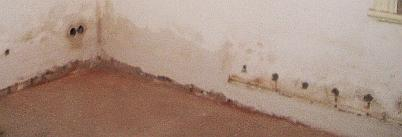
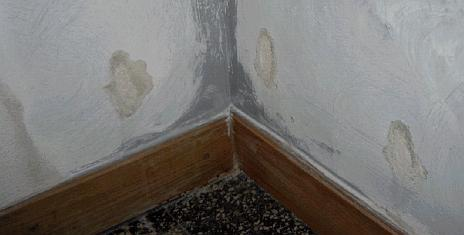

[🠔 Zur Übersicht: Aufsteigend Feuchte?](2aufstfe.md)  
# Nachträgliche Horizontalabdichtung und Mauerwerksversalzung
**Umfassende Betrachtung der nachträglichen Horizontalabdichtung historischen Mauerwerks. Analyse von Mauerwerksversalzung und den physikalischen Grundlagen der Feuchtedurchdringung in Baustoffen.**  
_von Konrad Fischer_

## Aufsteigende Mauerfeuchte + Bauwerks-Trockenlegung 6: 
Mauerfeuchte, Horizontal-Abdichtung Mauerwerk, Mauerwerksversalzung + Bauwerks-Trockenlegung

### Entsalzung nasser Mauern & Mauerwerksversalzung in feuchten Wänden entsalzen - wie & warum? Fundament-Feuchtigkeit trockenlegen - Lösungen & Pfusch: Mauertrockenlegung + Trockenlegung

Aufsteigende Feuchte Kapitelübersicht 

bausubstanz 7/98: Konrad Fischer: 

## Nachträgliche Horizontalabdichtung historischen Mauerwerks
Feuchte Wände - warum?

(ergänzte Fassung)

_"Maßgebend für den Grad der Durchfeuchtung ist die Saugfähigkeit, also das Porengefüge der verwendeten Baustoffe._

_Da die****Feuchtigkeit immer aus den grobporigen in die feinporigen Schichten dringt (nie umgekehrt)**** , ist es von Belang, wie die Poren zueinander liegen."_ 

- so Heinrich Schmitt in: Hochbaukonstruktion, Die Bauteile und das Baugefüge, Grundlagen des heutigen Bauens, Fünfte Auflage 1974, S. 34. Das gilt auch im historischen Mauerwerk! Wie liegen nun dort die Poren zueinander?

Auf der Bodensohle wurde das Fundament- und Sockelmauerwerk regelmäßig aus recht festen, also dichten, feinporigen Natursteinen errichtet. Die Bindung brachte grobporiger Kalkmörtel, meist nur sparsam verwendet. Die unvermörtelten Bereiche der "Trocken"-Fundamentmauer und der nahezu unüberwindliche Kapillarwiderstand am Übergang vom feinporigen Stein in den grobporigen Mörtel wirken kapillarbrechend. Über dem Sockel kam die Außenwand aus Natursteinen oder Ziegel, oft mit weniger dichter Porenstruktur als die Fundamentsteine. So errichteten die alten Baumeister Gemäuer, die der aufsteigenden Feuchte ganz im Sinne der obigen Lehrbuchaussage wenig bzw. keine Möglichkeiten boten. Ab dem 19. Jh. ging dieses Fachwissen leider verloren, der Einsatz von zweifelhaften Experten und Isoliermaterialien begann.

Obendrein gibt es in den feinporigen Steinen nicht die nennenswerteste - und ja berechenbare - Transportleistung für kapillares Steigen einer Wassersäule. Schon gleich nicht, wenn gar kein Wasserpegel am Fundamentfuß ansteht.

Auch der "historische" Schlagregenschutz für die Innenräume wurde oft mit einfachen Mitteln erreicht: Zweischaliges Mauerwerk mit grober Innenfüllung. Der Kapillartransport von Wasser wurde sowohl am Übergang von den feinporigen Mauersteinen zum grobporigen Kalkmörtel, wie auch zur grobporigen Kernfüllung sicher unterbunden.

Diese Grundkenntnisse zum Kapillartransport nutzt man heute z.B. beim Verzicht auf nachträgliche Horizontalabdichtungen, aber auch bei der Entwicklung von Kompressenputzen. Letztere müssen ein Kapillarporengefüge aufweisen, das dem Austritt salzhaltiger Lösung aus dem alten Mauerwerk entsprechende Feinporigkeit anbietet. Auch bei [Sanierputzen ](2sanipuz.md)fällt auf, daß zunächst die Feinporen versalzen und erst dann die im günstigsten Fall gebildeten Grobporen.

Woher kommen nun die berüchtigten Sockelputzschäden und Kellerfeuchten, vereinfachend einer "aufsteigenden" Feuchte zugewiesen (wohl immer ohne Nachweis eines gem. Kapillarporenanalyse der Baukonstruktion berechneten Kapillartransports oder gar eines anstehenden Fundament-Wasserspiegels)? Auf die Abstellung der Feuchtequelle kommt es ja vorrangig an, wenn der Feuchte der Garaus gemacht werden soll. Und das braucht oft kein Analysenequipment ein Transporter voll, und eben auch oft keine besonders eingreifenden und superteuren Gegenmaßnahmen.

**1. Mauerwerksversalzung**

Die historische und moderne Nutzung bietet viele Möglichkeiten der Schadsalzbelastung historischen Mauerwerks: 
- Sei es z.B. Streusalz oder früher übliche Fäkalbelastung der Straßen, Wege und Plätze, 

 
_Bei solchen Verkehrsverhältnissen auf öff. und privaten Wegen und Plätzen blieb bestimmt kein Auge und kein Mauerfuß trocken und salpeterfrei!_

_. 
Projektbeispiel für Entsalzung der Streusalz- und Nitratbelastung am Mauerwerk der Tordurchfahrt mit Lehmkompressentechnik auf kapillaroffener Trennschicht (Verfahrensplanung und -betreuung: Architektur- und Ingenieurbüro Konrad Fischer, 2005) - allerdings keine Garantie für Dauerstabilität bei neuerlicher Schadsalzbefrachtung durch den Winterstreudienst 
_

- nachträglich durch Straßenbau oder Hofaufschüttung gewachsene Geländehöhen am Mauerfuß, 
- Fäkalienbelastung durch winterliches Zusammenrücken der Haus- und Stallbewohner in heizbaren Räumen des Erdgeschosses (in Landarztprotokollen des 19. Jhs. nachgewiesen bis zu 15 Personen, Jung- und Kleinvieh), 
- sonstige Wohnstallnutzung in Land- und Ackerbürgerstädten, auch in Arbeitersiedlungen, 

 
_Ein Kuhstall im Haus ist ein sicherer Garant für Fäkalsalzeintrag in Mauern, nicht nur über den Odel / Mist / die Fäkalien am Boden, sondern auch über ammoniakgeschwängerte Raumluft, die im Inneren und fassadenseits in die Wand einkondensiert und dort in Verbindung mit Kalk im Mörtel Kalziumnitrat - Mauersalpeter - bildet._

 
_Ein Stall am Hang - nur im Bereich Schadsalzbefrachtung gibt es erhöhte Mauerfeuchte und Putzschäden. 
Kann hier eine Horizontalisolierung die vorliegende Durchfeuchtung wirklich beeinflussen, gar stoppen?_

- Kanalrückstauereignisse mit nachbarlicher Kackbrühe knöchelhoch im Kellergeschoß vor den Zeiten der Rückstauklappe 
- Schutzraumnutzung in Not- und Kriegszeiten für die Bevölkerung, die ihr Vieh dem Feind sicher nicht schlachtreif vor der Kirche oder Burg anpflockte, von deutschen Nachkriegsereignissen 45 aufwärts ganz zu schweigen oder gar 
- Mißbrauch von Wohn-, Lager- oder Sakralraum als Pferdestall, wie es z.B. im 30-jährigen Krieg für den Bamberger Dom belegt ist, wobei auch Schweine, Ziegen, Hunde und Hühner bemerkenswert schadsalzbefrachtende Fäkalien absondern, 
- Pökelung oder Salzlakenkonservierung im Sauerkraut- oder Heringsfass und last but not least 
- Schlachthausnutzung inkl. Gedärmreinigung in der kellerlichen Waschküche.

Weitere moderne Schadsalzquellen sind zement-, traß- und silikathaltige Baustoffe sowie viele Injektagematerialien, teils sogar "gegen aufsteigende Feuchte" erst eingebracht. Auch Bekämpfungsmittel gegen Hausschwamm sind salzhaltig, sie versuchen dessen Wasserversorgung zu unterbinden und wirken deshalb porenverstopfend.

 
_Salzbedingte Putz- und Anstrichschäden im Umfeld von Elektroinstallationen und Heizkörper. 
Die Wiederinbetriebnahme der Heizung in der Heizperiode begünstigt den Ausblühprozeß der im Sommer in Lösung befindlichen Schadsalze. 
Auch Elektrogips kann durch Treibreaktionen mit Zementmörtel bei ausreichender Feuchte solche Schadensbilder begünstigen. _

Wenn Salz in die Mauermörtel gelangt, verengt das die Poren und erleichtert den Kapillartransport aus dem Stein. Viel wichtiger ist aber die nun erhöhte hygroskopische Wasseraufnahme. Salz lagert schon bei geringer Luftfeuchte Wasser an. Die hygroskopisch die Luftfeuchte aus der Luft anziehenden Salze gehen bei erstaunlich geringem Feuchteangebot in der Umgebungsluft / Luftfeuchtegehalt in Lösung und vermitteln dann den falschen Eindruck erheblicher Wandfeuchte.

 
_Fehlgeschlagene Horizontalisolierung durch Bohrloch-Injektion von angeblichem Dichtungsmittel. Aus dem Anschreiben des Beratungskunden: "Das Objekt ist ein Mietshaus in Hamburg aus der Gründerzeit. Im Souterrain bzw. Erdgeschoss befinden sich ein Laden und eine Wohnung. Es wurde schon an verschiedenen Stellen Horizontalsperren mittels Injektionsverfahren eingebracht. ... Es treten immer wieder feuchte Stellen mit Ausblühungen im unteren Wandbereich in verschiedenen Räumen auf." (Bildquelle: Beratungskunde)_ 
 
_Das Dauergeschäftsmodell am Bau: Fehlgeschlagene Horizontalisolierung durch von Anfang an untaugliche Horizontalsperre / Horizontalisolierung mittels Bitumenpappe und nachträgliche Bohrlochinjektion mit einer Mikroemulsion und Bohrlochfüllung mit einer angeblich abdichtenden Bohrlochsuspension als Bohrlochsperre, also Bohrlochverschluß mit einem geradezu lachhaft arg schrumpfendem Aluoxid-Schwindmörtel, oft sogar noch Auftragung von trocknungsblockierenden Dichtschlämmen und Sperrputzen. Feucht wird die Wand darüber wie darunter. Weil die mehr oder weniger nur angeblichen Horizontalisolierungen der tatsächlichen Feuchtequelle - verborgenes Stauwasser vor dem Fundament und Salpeterbelastung der ganzen Wand und auch Kondensat von Luftfeuchte an kühleren Kellerwänden überhaupt nichts entgegensetzen kann. 
Ob hier wieder einmal der nette Sanierberater/Fachberater des Chemiepampenherstellers den zuständigen Architekten mit [Hintenrum-Kostenlos-Planung, die der Architekt dem Bauherren weiterverkauft](10hoai22.md), bestechen konnte, ob der beauftragte Handwerker sich beim Hereinlegen des arglosen Bauherren vom geschniegelten Produzenten und dessen geschliffenem Auftreten unterstützen ließ oder sich der vertrauensselige Bauherr gleich selbst durch die sogar kostenpflichtige Fachplanungsabteilung eines Herstellers (mit naturgegebenem Umsatzmaximierungs-Interessenskonflikt inklusive), bei einem schwachverständigen und schlechtachtenden Sachverständigen bzw. Gutachter / Ingenieur oder gleich in einem Kostenlos-Taugtnix-Bauforum kaputtschlaumeiern ließ, muß hier leider ungeklärt bleiben. Einer dieser Fälle traf zu - Raten Sie doch selber, welcher!_ 
 
_Bauherrenbetrug seit Anfang an: Mißglückte Horizontalisolierung durch Bohrloch-Injektage von salzabspaltendem Dichtungsmittel in einem Münchner Mietshaus. Viele hydrophobierenden und damit wassereinsperrenden Injektageflüssigkeiten / Injektionsflüssigkeiten / Bohrlochsperren sind wässrige Lösungen auf Kieselsäurebasis oder aus Silikonharzen (z.B. Methylsilsesquioxane-Emulsionen) wie Silikonmikroemulsion. Die Inhaltsstoffe wie Kaliumhydroxid, Kaliumsalz, Kaliummethylsilantriolat spalten bei der Abbindung selber hygroskopisch wirksame Schadsalze ab oder sperren im Siloxan-Silikonharz-Fall die in ihrer wässrigen Lösung eingebrachte Feuchte gerne ein. So sorgen sie selber für hohe Wandbefeuchtung, wie hier an den Feuchterändern um die Bohrlöcher ablesbar (Bildquelle: Beratungskunde)._

Was soll also eine Horizontalisolierung gegen versalztes, hygroskopisch wirkendes und kondensatbelastetes Mauerwerk, eventuell durch Kanalrückstau innen oder außen wirkender Befeuchtung mit Regenwasser und/oder Schmutzwasser? Preisgünstiger, schonender, wirksamer und auch denkmalgerechter wäre eine einfach handhabbare Entsalzung des Mauerwerks mittels geeigneter Auswaschtechnik, nachrangig käme vielleicht auch eine Kompressentechnik- bzw. Opferputztechnik (mit salzaufnehmenden Kompressen (z.B. aus Methylzellulose, Buchenholzzellulose, Sprühzellulose oder Bentonit-Sand-Gemisch), mit dem dafür am besten geeigneten und möglichst kapillaraktiven Simpelmörtel (baustellengemixter Luftkalkmörtel als Kompressenputz/Opferputz) bzw. geeigneten sonstigen Kompressenmaterialien in Frage, vielleicht auch nach der vorher durchgeführten - vom durchfeuchteten Bauherren selbst mit billigstem Equipment ergebniskontrollierten, vielleicht sogar selbst durchgeführten - Entsalzungsaktion und Trockenlegung der Kanäle und Baugrube gegen unbeabsichtigtes Stauwasser - ebenfalls mit den sich als jeweils vorteilhaftestest zeigenden Trockenlegungstechniken und Abdichtungstechniken, derer es freilich so einige gibt. Je nachdem, wie sich die objektbedingten, lagebedingten, schadensbedingten und finanzierungsbedingten Verhältnisse vor Ort eben zeigen.

Allereinfachste Lösungen hätten vielleicht auch für die sieben Säulen der Schloßkapelle Callenberg bei Coburg die günstigste Lösung bieten können, die nach einem Bericht der Neuen Presse Coburg am 2.12.2006 "Diamantseile kappen Säulen in Callenberg" aufwendigst durchgesägt werden mußten. Grund "Aufsteigende Feuchtigkeit hat ... mittlerweile einigen der Säulen so stark zugesetzt, dass Teile der marmorierten und gewachsten Putz-Oberflächen bis zur Empore hinauf abplatzen konnten. Um diesen fortschreitenden Schäden Einhalt gebieten zu können, (wurde architektenseits) entschieden, die Kapillaren des Sandsteines, die für den Aufstieg des Wassers verantwortlich sind, sprichwörtlich zu kappen. ... Schon während des Schnittes wird eine Kunststoffplatte "nachgeschoben". Der Vorgang ist insofern nicht ganz unproblematisch, da aus statischen Gründen darauf geachtet werden muss, dass die Last des Gewölbes oder der Empore immer abgefangen wird." Ja, und dann soll es "etwa drei Jahre" dauern, "bis das Mauerwerk ausgetrocknet ist." Viel Glück!, möchte man da wünschen ... Ob es wohl mal Stallnutzung in der Kapelle gab? Das wäre ja die natürliche Begründung für die beschriebenen Oberflächenschäden. Deren Ursache und folgende Salpeterbelastung dann keinesfalls durch Seilsägen und Kunststoffplatten beseitigt werden können. Soll ich mir das Späßle erlauben, dort mal die Feuchte nachzumessen? Die drei Jahre sind nun ja schon lange vergangen.

---

Weiter? ===> **Aufsteigende Feuchte[Kapitel 7](2auffe07.md)**
