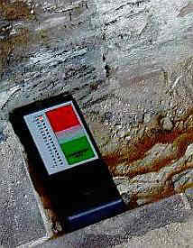
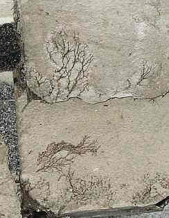
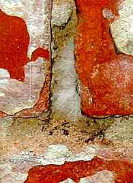
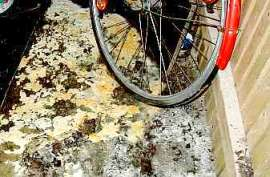
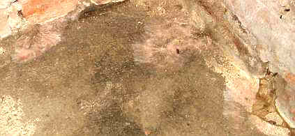
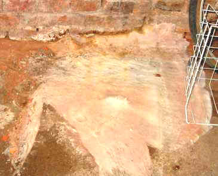
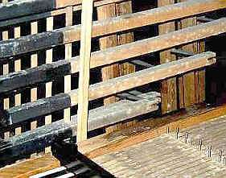

[🠔 Zur Übersicht: Aufsteigend Feuchte?](2aufstfe.md)  
# Kondensat und Hygroskopie im naßkalten Keller und sonstwo
**Warum Sommerlüftung Wände erst recht nass macht und Schadsalze die Luftfeuchtigkeit wie ein Schwamm in das Mauerwerk saugen.**  
_von Konrad Fischer_

## Trocknung nasser Wände + aufsteigende Feuchtigkeit 7 
Kondensat und Hygroskopie im naßkalten Keller und sonstwo

Aufsteigende Feuchte Kapitelübersicht 

## 2. Kondensation

Der Mauerfuß steckt im kalten Erdreich. An ihm kondensiert täglich, auch und vor allem im Sommerhalbjahr, eine Unmenge von Luftfeuchte als Kondenswasser. Natürlich gilt das auch für die im Vergleich zur Raumluft oder gar zuströmenden Wärmluft von Außen kühleren Bauteile innen wie Innen- und Außenwände, Decken und Böden, Mobiliar und Lagergut. Nicht gerade wenige Hausbesitzer kommen an schwülheißen Sommertagen auf die Idee, ausgerechnet jetzt ihre dumpfkühlen Kellerlöcher mit Außenluft zu "belüften", um sie mittels weit geöffneter, auf Durchzug und sekundenschnellen Luftaustausch gestellter Kellerfenster, man höre und staune - zu TROCKNEN! 

In Wirklichkeit klatscht dann das Kondensat einer ca. 30grädigen und feuchtebeladenen Sommerluft in rauen Unmengen in die so um 14 bis 16 Grad Celsius unterkühlten Kellerbauteile, je kühler, umso mehr. Unbarmherzige Bauphysik! Und was soll dieses eingedrungene Kondensat jemals wieder heraustrocknen, wenn im nassen Loch nie eine ausreichende Heizung läuft? 

Verschärft wird das Einwandern nasser Feuchte und feuchter Nässe aus der Raumluft in die Baukonstruktion auch bei schadsalzbefrachteten - hygroskopisch aktiven - Oberflächen. Schon ab nur 50 Prozent Luftfeuchte geht beispielsweise der Mauersalpeter (Kalknitrat) in flüssige Phase über und sorgt dann für jahraus und -ein patschnasse Böden und Wände im Keller. Was soll denn eine Horizontalisolierung gegen einkondensierendes und hygroskopisch im Bauteil aufgenommenes Wasser bewirken? 

Wirksame Gegenmaßnahmen: 
- [Wandtemperierung](7temper.md) gegen Kondensation, auch als Unterstützung für die Austrocknung, die sonst [jahrelang dauern kann](29bausto.md#cadiergues), 
- [Einfachfenster ](23bausto.md)als Sollkondensatfläche (entlastet Innenwand von Feuchtekondensation, vermeidet sicher Schimmelwachstum), 
- dauernde Luftentfeuchtung (gut geeignet für zu feuchte Kellerräume) 
- Entsalzung hygroskopisch aktiver Schadsalzfrachten mit dafür geeigneten Techniken, 
- Wandbeschichtung mit offenporigen, perfekt kapillaraktiv trocknenden und feuchteverträglichen Beschichtungen zum Abpuffern der Feuchtespitzen. Kapillarsperrende Polymere wie in Dispersions-, Silikonharz- und "Mineralfarben/Dispersionssilikatfarben" dürfen da nicht drin sein. 

## 3. Beregnung

 
_So mauerbenässend sah es 1838 in Partenkirchen aus, jedenfalls nach Meinung des Malers Heinrich Bürkel._

Der Mauerfuß wird vom Dachvorsprung oft zu wenig vor direkter und Spritzwasserberegnung geschützt. Durch stillgelegte Kamine, undichte Rinnen und Grundleitungen, ein Muß bei Verlegung in unzureichend verdichteten Baugrubenauffüllungen (Standard des Handwerks, weils eh keiner sieht, was verfüllt und verkleidet wird!), dringt drückendes Wasser in und durch die Wand und in das Keller- bzw. Sockelmauerwerk. Auch bodenberührende Außenputze saugen sich gerne mit Salz und Wasser voll. Sogar undichte Hauswasserleitungen (alte Bleirohre?) können die Ursache für grandiose Auffeuchtung von Mauerwerk sein. Was hilft aber eine Horizontalisolierung gegen das alles?

Hier ist handwerkliches und denkmalpflegerisches Verständnis gefragt, um bestands- und konstruktionsgerechte Lösungen zu finden. Auch mit einem vom Boden abgetrennten offenporigen zement- und traßfreien Mörtel (kein teurer Sanierputz!, der in Wahrheit nur als [feuchteverstärkender Sperrputz](2sanipuz.md) funktioniert). Fachmännisch ausgeführt, bringt das dauerhafte Lösungen, trotz aller mißlungenen Versuche mit angeblichen "Denkmalputzen". Probleme wie Streusalzbelastung und Spritzwasser bei zu knappem Dachüberstand, konzentrierte Wassersammlung am Sockel bei wasserabweisenden Fassaden usw. bleiben natürlich außen vor.

Zum Abschluß:

Aufsteigende Feuchte, in der Fachliteratur und von interessierten Kreisen oft behauptet und mit nur stationär gültigen Laborformeln (nach Hagen-Poiseulle, Grün, Mayer/Wittmann) für einschichtige Körper "berechenbar", wird am Bauwerk nie als solche bewiesen. Ein kapillar vollgesogener Porenbetonstein in der Laborwanne, erdbodennahe Mauerdurchfeuchtungen und nasse Keller in reicher Zahl oder nach innen bzw. oben abnehmende Salz- und Feuchtegehalte im Mauerwerk sind kein Beweis für aufsteigende Feuchte im historischen Bestand. 

 
_Patschnass würfelbrüchig vermorschte Innenwandschwellen sind kein Beweis für kapillar aufsteigende Feuchte aus dem feuchten Keller!_

 
_Auch nicht angewachsene Porenschwammyzele unter den Bodenplatten des Erdgeschosses_

 
_Und ebenso nicht wieder ankeimende "Hausschwammwatte" über abgebrannten Resten auf der Kellerwandverfugung_

 
_Auch Hausschwamm auf dem Kellerboden beweist keine aufsteigende Feuchte aus dem Untergrund in den Fußboden 
_

_ 
Auch hier nicht. (Foto: Aus Beratungsfall, Bild: R. Gundelach) 
_

 
_Ebensowenig wie verschimmelte Orgel-Innerei Nässe aus dem Untergund unter dem Kirchfußboden. Die teuer einzubringende Bodenunterfolisierung, schlimmstenfalls plus Dämmstoffverbuddelung kann also flugs eingespart werden, kommt nur ein bisserl Sachverstand ins Spiel._

Wissenschaftlich zuverlässige Praxisuntersuchungen beweisen im Gegenteil den maßgeblichen Einfluß der Salz- und Kondensatbelastung (vgl. Kloster Maulbronn, Jahrbücher des Sonderforschungsbereichs 315, Karlsruhe, Verlag Ernst und Sohn). Die Injektagematerialien für Horizontalisolierungen sind in der Fachwelt ohnehin stark "umstritten". Gerade in feuchte und versalzte Wände dringen sie nicht zuverlässig ein (vgl. Venzmer (Hrsg.): Bautenschutzmittel, Verlag für Bauwesen, Berlin 1997) und liefern meist zusätzliche Schadsalze, auf jeden Fall unsinnige Bauzerstörung.

---

Weiter? ===> **Aufsteigende Feuchte[Kapitel 8](2auffe08.md)**
