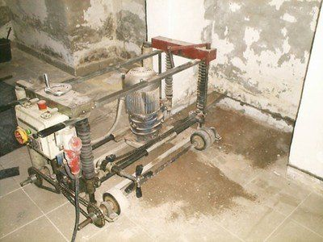

[🠔 Zur Übersicht: Aufsteigend Feuchte?](2aufstfe.md)  
# Trockenlegungsschwindel: Marketingtricks und das Kleingedruckte
**Kritische Analyse des Trockenlegungsschwindels: Wie Marketingexperten Feuchtequellen identifizieren, irreführende Messgeräte einsetzen und das Kleingedruckte nutzen, um Kunden zu täuschen.**  
_von Konrad Fischer_

## Aufsteigende Feuchte + Mauerwerk-Trockenlegung 9

Aufsteigende Feuchte Kapitelübersicht 

## Trockenlegungsschwindel -
die Marketingtricks und das Kleinstgedruckte

Die Identifikation einer Durchfeuchtungsquelle gelingt Marketingexperten meist ohne weitere Untersuchung. Man sieht feuchte Wände und Putze mit den typischen Merkmalen einer "aufsteigenden Feuchte": Feuchteränder im oberen Bereich des Sockels, klar abgrenzbare wolkige Feuchteflecken und Ausblühungen, Flächenfeuchte - und Jeder weiß sofort: Das kann ja nur "aufsteigende Feuchte" sein. Sie erscheint und "ist" demnach ja "aufgestiegen". Und gaaaanz raffinierte "Sachverständige" für Schäden an Gebäuden, auftragsheischende "Umsonstuntersucher" der Trockenlegerbranche oder sonstwas nehmen raffinierterweise und teuer (der akademische Grad des doktorierten oder diplomierten oder gemasterten Untersuchers oder mindstens sein - da keine geschützte Berufsbezeichnung - an jeder Straßenecke erhältliche Sachverständigentitel oder eben der teuer erworbene ö.b.u.v. Gutachtenrang müssen ja bezahlt werden) oder umsonst ein idiotensicheres Meßgerät als Expertennachweis zur Hand, das bei dieser vorschnellen Diagnose sogar noch vollkommen irrelevante Anzeigewerte auf einem Display herbei zaubert: Das elektrische Widerstandsmeßgerät, das Feuchtemeßgerät, das Materialfeuchtemeßgerät, den Feuchtemesser, der Baufeuchte-Indikator, das Feuchtigkeitsmessgerät, den Feuchtigkeitsmesser oder Feuchtefühler oder, oder, oder. Dabei werden Meßgeräte eingesetzt, die als erstes die englische Firma Protim (Handelsnamen Protimeter, andere z.B. Gann Hydromette, Voltcraft FM, Trotec Feuchtemeßgerät, Testo, TFA Materialfeuchtemeßgerät usw.) 1959 eingeführt hat und es wirklich jedem dahergelaufenen Heini erlauben, zwei Elektroden oder eine kapazitive Feldmeßkugel der Wand zu nähern. Beim Widerstandsmeßverfahren zwischen Kathode und Anode fließt dann meßbar der Stroms. Bei der kapazitiven Feuchtemessung geht es etwas indirekter zu: Anhand der am Kondensator - dem sogenannten Herzstück des "dielektrischen" (Dielektrikum: Nichtleitfähiges Isoliermaterial wie Papier, Kunststoff oder Keramik als Trennmaterial zwischen den Kondensatorplatten) Meßverfahrens - je nach Kapazitätsmeßwert als Folge eines elektrischen "Streufelds" des kondensatornahen Meßbereichs (z.B. "Wand"), ergeben sich die am Meßgerät angezeigten Meßwerte. Welche als gefährlich rot blinkende Dioden oder "hohe" Digitalmeßwerte namens einheitslosen "Digits" auf einer geräteintegrierten Meß-Skala / Skalierung / Meßwertskalierung - vielleicht sogar in oft nur scheinbaren "Prozentzahlen" äußern. Oft genug nur fälschlicherweise auf angebliche Feuchtewerte verweisend. Wobei natürlich je nach Feuchtegehalt der Anzeigewert nach oben geht. So ein gerätegestütztes und interpretationsfehleranfälliges Gemesse könnte jeder Hausbesitzer freilich für ca. 15 EUR - so viel etwa kostet ein funktionsfähiges Feuchtemeßgerät auf Widerstandsmeßbasis - auch selber besorgen. Und wenn es volle Pulle im Gegensatz zum unteren Anzeigewert an einer definitiv trockenen Wand irgendwo im Haus ausschlägt, weiß er es definitiv: Feucht. Oha! 

Während das elektrische Meßverfahren mit den Einstechelektroden in Holz je nach Exaktheit der Kalibrierung durchaus funktionieren kann, muß das Experiment in mineralischen Baustoffen hinsichtlich seiner Exaktheit versagen. Die elektrische Leitfähigkeit ist als sogenannter Summenparameter für in Flüssigkeiten gelöste (dissoziierte) Stoffe zu verstehen. Ihr mit den üblichen Leitfähigkeitsmeßgeräten bestimmter Meßwert hängt einmal von der Konzentration der ladungstragenden Ionen und deren Verteilung (Dissoziationsgrad) und andererseits von der Temperatur der Meßprobe und der Wanderungsgeschwindigkeit der Ionen ab. Über die Art der Ionen - also ob es H+ oder OH- oder Na+ oder Cl- oder auch Ca+ oder N03--Ionen sind, kann der schöne Meßwert freilich nichts aussagen. Genauere Aussagen zur Art und Konzentration der in der gemessenen Substanz vorhandenen Elektrolyte (Stoffe in flüssiger oder fester Phase, die elektrische Ladungen (Ionen) aufnehmen und abgeben und transportieren können) wären nur dann möglich, wenn von vornherein deren chemische Zusammensetzung und Äquivalentleitfähigkeit bekannt sind. 

Also: Der stolz präsentierte Meßwert ist grundsätzlich abhängig vom Ionenfluß zwischen den in die Probe hineingesteckten Elektroden, und der wird eben nicht nur durch im Baumaterial / Baustoff ggf. anwesendes Wasser - wie im (von salzhaltigen Holzschutzgiften verschonten!) Holz, sondern im mineralischen Baustoff auch durch die dort immer anwesenden und je nach Feuchtegehalt mehr oder weniger gelösten "löslichen" SALZE wesentlich beeinflußt. Aber auch kohlehaltige Backsteine (Folge des historischen Brandverfahrens) sind beispielsweise selbst im trockensten Zustand extrem leitfähig (Jeff Howell). 

Im Klartext: 

Eine versalzte, ansonsten aber nahezu furztrockene Wand liefert schrecklich beindruckende hohe elektrische Meßwerte der damit örtlich verbundenen Leitfähigkeit in der Probe, die aber weder zur Herkunft der Salzbelastung noch zur Quelle ggf. vorhandener Materialfeuchten die geringsten Aussagen zulassen. 

Der vom Trockenlegerprofi gelackmeierte Hausbesitzer freilich staunt über die erschröcklichen Anzeigewerte, hält den technisch gewappneten Schlechtachter für einen seriösen Gutachter, den Schwachverständigen für einen ehrlichen Sachverständigen und schenkt ihm sein unendliches Vertrauen, wenn er angesichts der hohen Anzeigewerte in seinem Depperlesgerät triumphiert: 

"Guggemaldo/Eidaguck/Göidoschaugst/Glotzemol/Kiekmal: Aufsteigende Feuchte!!!" 

Wobei der Geräteeinsatz bei entsprechendem Kenntnisstand und ausreichend gewissenhafter Ehrlichkeit (gibt es die heute wirklich noch?) des Anwenders freilich hilfreich sein kann, um dann eben lediglich schadsalzbelastete Bereiche einzugrenzen und sachgerecht eingeschränkte Aussagen zum Feuchtestatus erlauben. Aber keinesfalls die Diagnose, woher die ggf. festgestellte Feuchte und Schadsalzbefrachtung denn tatsächlich herstammt und wie ihr denn sinnvoll beizukommen ist. Und auch der Einsatz von Geräten und Methoden, die die absoluten Feuchtewerte ohne verfälschenden Schadsalzeinfluß liefern können (Darrmethode: Auswiegen von Bohrproben vor und nach Darr-Trocknung, CM-Messung, Mikrowellen-Feuchtemeßgerät, ...) ist allermeist gar nicht so sinnvoll, wie es erscheint. Denn vor ihrem Einsatz besteht ja in entsprechenden Feuchtephänomenen Gewissheit, daß der Baustoff feucht ist und mit ein bisschen Köpfchen braucht es keine teuren Feuchteanalysen, umherauszubekommen, wo die Feuchte herkommt und wie man sie beseitigt. Eben gewußt was, wo, woher und wie! 

Was sollte da auch die teuere Analyse bringen, die dann auf 97 Kommastellen genau aussagt (wenn man dem Expertenlabor überhaupt vertrauen soll!), wieviel Feuchteprozent im Material als Volumenprozent bzw. Masseprozent vorliegen? Solche Detailversessenheit mag zwar Einnahmen für die gerne im weißen Mantel auftretenden Scherzkekse generieren, nützt aber dem feuchtegeschädigten Hausbesitzer meist gar nix. 

Es handelt sich bei der "aufsteigenden Feuchte" (neben dem [Wahn, daß Dämmstoff Energiesparen garantiert](7fehrtab.md)) also um einen für die gesamte Baubranche wunderbarsten Irrtümer der Bauherrn, Laien und schwachverständigen Keksperten vom Handwerker über den Planer bis zum gerichtsnotorischen öbuvS - leider auch Richter sowie die Geräteindustrie und die Laborinstitute. Anstelle zielgerichteter Bauwerksreparatur werden in ihrem Namen Maßnahmen herbeigeführt, die vom analysegeilen Baustofflaboranten über die [untreue Planerlusche](10hoai10.md) bis zum blindesten Bauhandwerker auch die bodenlosesten Taschen füllen. Die vergebliche Liebesmüh wird gleichwohl dem Bauherrn als Expertentum betr. "Bauwerkstrockenlegung / Mauertrockenlegung / Mauerwerkstrockenlegung / Kellertrockenlegung" (oder andere Begriffe (aus der Säuglingspflege?)) vorgespiegelt.

Ein sehr wirkungsvoller Trick gegenüber leichtestgläubigen Bauherrn (funkioniert besonders gut, wenn "nur" Steuergeld verbaut wird) ist auch, über Wohl und Wehe der verschiedensten "Trockenlegungsverfahren" und Analyseverfahren lang und breit daherzusalbadern, zu granteln und derartige Experten-Ergüsse mit aus teuerster chemischer Analyse gewonnenen Salzionentabellen garniert auf geduldiges Pergament zu krakeln. Um dann den wirkungsvollsten Abzocktrick anzuwenden: den seriösesten aller Sanierexperten mimen und die ach so bösen "Zauberkästchen" und "Entlüftungsröhrln", fallweise auch die elektrischen Verfahren empörtest, meinetwegen sogar berechtigterweise, zu beschimpfen. Aber mit keinem Wort auf die tatsächlichen Verhältnisse rund um den Kapillareffekt einzugehen, sondern halt doch Gürtel + Hosenträger zu verschreiben, bevorzugt dann mit Flötentönen garniert: "zur besseren Sicherheit" - die teuersten all der sinnlosen Verfahren: 

Probenreich aufgespeckte "Analyse" mit dickem Tabellenwust und überflüssigen Bildern, die niemandem nutzt und darauf immer aufgesattelt die schon voraus gewußte "Diagnose" und "Therapie": 

Mauersäge, Blech + Sanierputz. Meinetwegen auch Bohrung, Heizstab + (teils giftige oder selbst schadsalzabspaltende) Pampeninjektion (Paraffin, Wasserglas, usw.). Solche hochmögend akademistisch aufgebeppte Scharlatanerie trabt pseudo-wissenschaftlich daher und überzeugt noch jeden Kunden, auch und vor allem im akademisch besetzten Bauamt. Vor latinisierenden Effloreszenzen, vor seitenlangen Ionenplussen und -minussen, vor Glauberit und Glaubersalz fällt leider auch die gesundeste Skepsis auf die Knie. Der Keksperte muß es doch wissen. Jössesmarria, Heiliger Josef und Heilix Blechle!

In der täglichen Praxis des Bauherrenbetrugs gibt es aber auch ganz besonders abscheuliche Methoden des Kundenfangs: 

Aus meiner Bauberatung - Fall 1: 

Ein feuchtkellergeplagter Kunde fällt auf die Zeitungswerbung der Trockenlegerfirma herein und ruft dort an. Die Firma schickt einen angeblich unabhängigen Sachverständigen KOSTENLOS! vorbei, der in seinen Schriftstücken das Siegel eines von einer Handwerkskammer öffentlich bestellten und vereidigten Sachverständigen führt und damit Vertrauen ohne Ende erweckt (WUNDERLICHERWEISE!!!). Daß sich später herausstellt, daß dieser schöne Schwachverständige sein ewiges Leben im Himmel dadurch riskiert, daß er heimlich Provisionen der Sanier- und Abdichtungstechnikfirma für die von ihm gebrachten Firmenumsätze erhält, gehört offenbar in das ganz normale Umfeld solcher bauchemiepampenverseuchter Schwindelunternehmen. 

Der SV erstellt nun während seines Kurzbesuchs ein sogenanntes "Sachverständigengutachten", beinhaltend ein Blatt "Bauzustandsprotokoll", in dem er tabellarisch sagenhafte "Durchfeuchtungsschäden", irre extremen "Salzfraß", im Kellerbereich "Schwarzschimmelbefall" und ansonsten neben allerlei angekreuzten Befindlichkeiten auch "Salzwerte 82%", "evtl. Gesundheitsgefährdung", "überhöhte Heizkosten 18 %" und "Wertminderung des Hauses 25 %" feststellt, um nicht hochtrabend wortschwallend zu sagen: "konstatiert". 

Doch damit nicht genug: 

Es folgen eine mit Wandsystemskizzen aufgespeckte alternative Beschreibung des "Schwerkraftverfahrens" und des "Niederdruckverfahrens", um dem ahnungslosen Kunden weiszumachen, das später empfohlene Verfahren wäre im Unterschied zur bösen Konkurrenz der Weisheit letzter Schluß, daran anschließend ein "Sanierungskonzept", eine Argumentationsanhäufung, was der arme Kunde für sein teuer Geld für wunderbare Vorteile erhält - je eine Seite - und als Höhepunkt eine Leistungsbeschreibung, was man alles mühsam und inklusive herumpampen werde - jedoch ohne jegliche faktisch wirksame Erfolgsgarantie im Sinne des Kunden! Und auf "Material, Ausführung und Dichtigkeit" dann noch eine "30-Jahre-Geld-zurück-Garantie" mit schriftlicher Urkunde. Damit kann sich der hereingelegte Kunde angesichts des Kleinstgedruckten im Bauvertrag dann den H abwischen oder A abputzen oder auch die T trocknen, je nach dem. 

Doch auch damit noch nicht genug: 

Als Krönung wird ein Kostenvoranschlag mit Festpreisgarantie, aufgespeckt (mit Speck fängt man Mäuse!) mit 3% Skonto und 6% Referenzrabatt hingeschmiert, und dann vom errechneten Angebotspreis von knapp 15.000 EUR noch ein Sensations-Nachlaß auf ca. 11.600 EUR eingeräumt. Inkl. Mehrwertsteuer, wie überaus schnäppchenmäßig günstig! Und noch den Architekt gespart - Juhu! 

Was übrigens auch immer fehlt, ist das EU-Sicherheitsdatenblatt, aus dem Jeder sofort erkennen könnte, daß anstelle harmlos klingender "Silikonharzlösung" in Wahrheit Giftstoffe mit wunderlichsten "R-Werten" und allerdollsten Gesundheitsgefahren verpumpt werden sollen. Dafür werden lieber noch allerlei Vorzüge bis zur Versicherung, nur perfektestens ausgebildetes Personal aus deutschen Landen frisch auf den Tisch einzusetzen (da lacht des Deutschen Rassistenhärtz, gell!) und Referenzen aus dem Mund von bärtigen Popen, weihrauchumwehten Priestern, untreuen Beamten oder gar daabgschlognen Architekten vorgelegt, die bei verschärfter Prüfung oft allermerkwürdigstes Stirnrunzeln, kreischiges Aufgeschrei oder auch lebensgefährliche Lachanfälle verursachen. Doch niemals nicht beim schwarzschimmelgekreuzigten Tropfsteinhöhlenbesitzer. Der bekommt dann sogar noch ein Belehrungsblättchen, wieso er für sein Geld den allerdollsten Garantiehit bekommt, und was denn im Preis alles für Nebenkosten und Betriebskosten usw. enthalten sind. Denn das nachträglich zwangsweise Wundern des irgendwo immer skeptisch bleibenden Bauherren über das bisserl Bohren und Pampen, das von wenigen Bausäfteln in allerkürzester Zeit über die Bühne gebracht wird, für so ungeheuer viel mühsam erspartes Geld! - kennt der erfahrene Trockenlegungsmeister und beugt da gleich schriftlich vor. Damit der Bauherr dann bei jedem hochnotpeinlichen Verwunderungsanfall was Schönes zum Lesen hat. 

Der kann nun nicht mehr aus, und so legt der Sachverständige gleich den vorbereiteten Festpreisauftrag vor, in dem dann gleich vier kleingedruckte Klauseln, auf deren gottseidankigen Entfall im Anwendungsfall nur im Mündlichen hingewiesen wird, die Vergiftungszerbohrung des Bauwerks ohne jegliche Zusicherung von den kundenseits herbeigewünschten baulichen Verbesserungen garnieren. Hier als kostenlose Leseübung für den neugierigen Leser das kleine Kleingedruckte: 

1. Bei Chlorid-/Nitrat-/Sulfat-Salzeinlagerung in der zu behandelnden Bausubstanz muß aus Gründen der Bauphysik oder als "Flankierende Maßnahme" ein Sanierputz drauf. 
2. Wenn vor der "trockenzulegenden" Wand drückendes Wasser zu befürchten ist, muß eine druckwasserbeständige Vertikalisolierung aufgebracht werden. 
3. Wenn Kondensat bzw. Tauwasseranfall durch Taupunktunterschreitung an sog. Wärmebrücken droht, müssen diese fachgerecht beseitigt werden, und 
4. Das erhoffte Wandaustrocknen dauert erfahrungsgemäß sechs bis zwölf Monate, vielleicht aber auch länger. 

Ja, so versucht man sich quasi nebenbei von allen Gewährleistungsansprüchen zu befreien, wenn doch mal ein Kunde draufkommt, daß gegen fäkalsalzverschissenes und hygroskopisch vor allem im Sommerhalbjahr Luftfeuchte ausaugendes Mauerwerk, unterkühltes Mauerwerk, das dank grottenfalschigester Lüftung hektoliterweise Sommerkondensat einsaugt ohne Ende und über den Kellerboden nach dem Prinzip der kommunizierenden Röhren aus der abgesumpften ehemaligen Baugrube einsprudelndes und hochdrückendes Regen- und Tauwasser nicht durch eine Horizontalisolierung im Mauerquerschnitt oder andere Bescheißereien gegen niemals aufsteigende Feuchte zu bekämpfen ist. Glabstes na! 

Und hier gibt es grundsätzlich nun zwei Fallgestaltungen: Entweder bekämpft der Mauertrockenleger nur die angeblich aufsteigende Feuchte- das garantiert zumindest schnell abzuschließende Geschäftchen, oder er verschärft als Super-Verkaufsprofi seinen Reibach und macht den Sanierputz, vielleicht sogar die Vertikalisolierung und letztlich auch den Einbau sogenannter Perimeterdämmung gleich mit. In unserem Fall 1 führt der Mauertrockenleger nur die Mauerwerksvergiftung aus und weg das Geld und ab die Post. 

Es kommt dann, wie es kommen muß: An der versalzten Wand tut sich gar nix. Halt, fasch: Aus den verschmierten Bohrlöchern blühen Pampensalze aus! Die fallen aber wieder ab. Knapp vor Ende der Gewährleistungsfrist kommt es dann doch zum Beweissicherungsverfahren. Wegen Schadenssumme beim Landgericht. Der LG-Richter kennt einen Gutachter, oh Gott! Ein Prof. Dr.-Ing. und von einer IHK ö.b.u.v. SV für die Baugrube und dort im Spezialtiefbau, aber nicht unbedingt in Wohnhäusern ausgeführter Injektions- und Abdichtungstechnik, kommt nebenverdienstlich angerannt und schlechtachtet und kassiert vorsichtshalber im voraus. 

Was bekommt er heraus? Daß die Firma gemacht hat, was angeboten war. Gebohrt und gepampt. Zwar nicht einwandfrei nach den (lachhaften, von den Pampern sich selbst erlassenen!) WTA-Regeln, sondern schlechter und damit kostensparender, aber der Erfolg: Im Darrverfahren an Probekörpern erwiesene GERING FEUCHTE WÄNDE!!! - beweise es ja, daß alles O.K. ist. Na Bravo und Applaus! Daß die parallel mit seiner elektrischen Gann Hydromette erhobenen Leitfähigkeitsmeßwerte in der Höhe ganz und gar nicht mit seinen Proben-Feuchtegehalten korrespondieren und daß der im Firmenauftrag tätige Schwachverständige die Anfangsfeuchte auch nur fälschlich elektrisch "bewiesen" hat und damit von einem zweifelsfreien Trocknungserfolg als Vorher-hoch-Nachher-gering-Beziehung in keinster Weise die Rede sein kann, fällt ihm - als typischer Vertreter der technisch nur sehr schwachverständigen, aber wirtschaftlich sehr erfolgreichen Professoren- und Doktoren- und Ingenieurs-Schlechtachterzunft natürlicherweise nicht weiter auf. Wäre ja noch schöner! 

Damit sind die Erfolgsaussichten des enttäuschten Hausbesitzers erst mal auf Null geschrumpft. Wie es weitergeht? Seh'n mer mal. 

Daß diese Methode Methode hat, zeigt ein verwandter Fall 1b, bei dem die System-Gutachterei so beginnt, daß der Bauherr ein vielversprechendes Trockenklegungsinserat in seinem Käsblättle findet und daraufhin die so großsprecherisch-wohltönende Firma (Z) anruft. Die schickt ihm dank ihrer langjaährig ausgereiften Erfahrung in der Geschäftsanbahnung mit Bautölpeln erst mal auf eigene Kosten - genauso wie im vorigen Fall einer anderen Firma, wer da von wem abkupfert verrat ich net! - einen sogenannten Bausachverständigen - in welchem Sachverstänigenverband derjenige welche stempelberechtigtes Mitglied ist, verrat ich auch net, ich bin doch net blöd! - vorbei. Ein "Sachverständiger für Altbausanierung" mit dem "Spezialgebiet Mauerwerktrockenlegung" auf der Baustelle erscheint. Hut ab und Kratzfuß, das überzeugt schon durch die fettgedruckte Briefkopftitelei in kapitalen Lettern, als ob sie der große AUGUSTUS persönlich in den Kunstmarmor gehackt hätte. Seiner selbstdefinierten Aufgabe gemäß soll er besichtigen und Schadensanalyse betreiben sowie einen "fachlichen" Lösungsvorschlag erarbeiten. 

Von all den massiven und offensichtlich auf eine Dschungelcampschule verweisenden Rechtschreibfehlern mal abgesehen, kommt dieser bei der Trockenlegungsfirma zurecht hochangesehene Experte unter mehr oder weniger fachkundigen Zuhilfenahme seines unten erwähnten Meßequipments flugs eine Zeile unter der "Aufgabenbeschreibung" zu seiner "Bewertung", wonach es sich um aufsteigende sichtbare und messbare Feuchtigkeit "im Bereich des Außen-Mauerwerk und dem Innen-Mauerwerk im Kern des Mauerwerk über 90% durch starke Versalzung des vorhandenen Putzes" handele. Und "dadurch wird hygroskopische Feuchtigkeit sehr schnell im Salzbestandteil des Putzes gebunden und verursacht die sichtbaren Schäden. Siehe Fotos ... bis 1,2m Höhe durchfeuchtet ... massive Schimmelbildung." Vor allem hinter der Gipskartonschale, den die verzweifelten Vorbesitzer dem nassen Kladderadatsch auf ihrem Salzbergewerk einst vorschnallten. 

Da brummt der Schädel. Und so mancher Bauherr stellt sofort das Denken ein, Kants aufklärerischer Apell an den Gebrauch des eigenen Verstandes hin oder her. 

Wie gut, daß der Experte auch gleich die Lösung für das Dilemma Salz, Feuchte und Schimmel parat hat: "Abhilfe schafft hier wie im Innen-Mauerwerk das einbringen einer Horizontalsperre." Worauf nach seinen Angaben das vorhandene Wasser verdunsten soll, kein neues hinzukommen kann, die Schimmelbildung zurückgeht und auch die "Geruchsbildung" - also der Mief nach und verschwinden soll. Ja, das will der Bauherr unbedingt - und deswegen steht es da. 

Ebenfalls steht - wer hätte es auch anders von so einem Experten erwartet? - da, daß die Kosten für das "Abdichten einer funktionsfähigen Horizintalsperre ... für den Meter mit 20 Liter Verbrauch" mit exakten hunderten Euro anzusetzen sind. So daß sich für das "Außen Mauerwerk" und das "Innen Mauerwerk" exakt, und zwar incl. Mwst. schlappe über 30.000 EUR ergebn. In zwei separat zu beauftragenden eigenen A4-Angeboten. Doch das beste kommt am Schluß: 

Der mit vier A4-Seiten final expertierende Gutachter hat nicht nur schon auf Seite 3 eine Materialempfehlung, sondern auch gleich die ausführende Firma im Schlepptau, jawohl, genau die, die ihn geschickt und finanziert hat, huch wie seriös: "Materialempfehlung: Fa (X), Produkt (Y)," Zertifizierung nach ISO 9001/2000 ..., Zertifizierung lt. Landesbauordnung: MFPA (Leipzsch), und ein Bauchemie "Prof. Dr. rer. Nat. habil." aus einer Ossi-Universität hat auch konstatiert, daß alles gut ist, und zwar schon 1999. Dann muß doch alles in Butter und Schmalz sein. Und glar wie Glosbriehe. 

Und damit dem doofen Bauherren alles superklar ist, kommt nun zweimal (!) untereinander: "Ausführung der Arbeiten: Fa. (Z) GmbH, "Patentinhaber von Material und Verfahren". Das beeindruckt, denn darauf kommt es nun wirklich an. Dobbelt gemobbelt häld eben besser. 

Auf der Seite 4 steht dann noch, daß das "Gutachten" nicht vervielfältigt werden darf und der "Sachverständige versichert, dass er diese Stellungnahme unparteiisch und nach bestem Fach- und Sachwissen erstattet hat ... (und) dass ihm keine Ablehnungsgründe entgegenstehen, aus denen jemand als Beweiszeuge oder Sachverständiger nicht zulässig ist oder seinen Aussagen keine Glaubwürdigkeit beigemessen werden kann." Und unterzeichnet mit freundlichen Grüßen und schreibt als letzten Satz in sein Papierchen: 

"Ein Angebot wird wunschgemäß von der Firma (Y) erstellt." 

Und dann kommt ein Zettel, auf dem der Herr Gutachter seine elektrischen Meßgeräte aufzählt und erläutert. Vom MMS Moisture Measurement System, über das Messgerät Surveymaster und das Messgerät Mini bis zum Einsatz einer Infrarot-Kamera (IR) FLIR-System. Ja, da muß doch was bei rauskommen! Oder gilt auch hier die alte Meßregel: "Wer mißt mißt Mist"? 

Sicherheitshalber liegen dem Papierchen des unparteiischen Herren Gutachters dann gleich zwei abenteuerlich bunte Werbeblätter mit Grafiken und Texten offensichtlich der Fa. (X) als Gutachten-Schwellkörper bei, an denen außer der Firmenbezeichnung und der Produktbenennung des Injektionsmittels (Y) aus ehrfurchtheischenden Zahlen und Kürzeln und registered Trademark sozusagen fast nix stimmt. 

Witzig darin: 

Die "zerstörte Sperrschicht (Horizontalsperre)" im frei erfundenen Mauerwerksquerschnitt, der das Mauerwerk als homogenen Kaugummi darstellt, eben ohne Steine und Mörtelfugen. Wo es doch so eine "Horizontalisolierung" bis ins oft von Schlaumeiern aufgeklärte 19. Jahrhundert niemals gab. Und auch danach nie sollgemäß funktionierte. Weil es ja gar kein kapillares Aufsteigen vom feinporigen Stein in den grobporigen Mörtel im Mauerwerk gibt, ätsch! 

In der Systemskizze taucht dann eine zweireihige Bohrlochsperre im Abstand von etwas unter 10 cm in der Höhe und etwas über 10 cm in der Breite, mit einem Bohrdurchmesser von etwas unter 1,5 cm in das Mauerwerk perforiert auf, darunter steht geradezu höhnisch: 

"Die preiswerte (X)-Doppelsperre funktioniert auch an Ihrem Haus. _mit 10 Jahren Garantie._ ohne Risiko - ohne Schädigung des Mauerwerks." 

Ein offensichtliches Wunder - Mauerbohren ohne Mauerschaden! Jösses! Das macht aber wirklich enorm und dolle Eindruck, wa? Ich möchte nicht wissen, wie oft dergleichen Zeugs mit Wohlwollen und verlorenem Zuschuß des Denkmalamts in Denkmalmauern an Kirchen, Burgen und Schlössern, Bauernhaus, Bürgerhaus, Villa und Handwerkerhaus, Kloster und Kasten usw. usf. schon Einsatz fand. Auf allerhöchste Empfehlung externen und unglaublich unabhängigen Sachverstands! Jawollja Herr Gemeinderat! 

Unparteiisch? OK, DIE PDS-LINKE wurde vom Herrn Sachverständigen nicht genannt. Und bei Honi kam es ja wirklich nicht darauf an, zu welcher volksverhetzenden und volksverletzenden und christenleutverketzernden Partei sich ein dahergelaufener gottloser Genosse bekannte. Bestes Fach- und Sachwissen? Statt "Bestes" vielleicht besser "Eigenes"? Ablehnungsgründe und Glaubwürdigkeit? Dazu würde ich mal nen Rechtsanwalt oder Richter befragen. Wer weiß, was der zu solch streng riechenden Bräten meint? 

Und so kommt es flugs nur einen Tag nach der Gutachtendatierung zum Angebot. Da ist die Freiwillige Feuerwehr ein Dreck dagegen. Oder erst Godot! 

Und was wird da nun angeboten? Eine nachträgliche Horizontalisolierung im Injektions-Bohrlochverfahren mit Dosierdruck. Und da man ja ein verflucht nasses Zeugs einspritzt, wird die "Nachkontrollmessung auf Wunsch nach frühestens 12 bis 18 Monaten angeboten." Und da man offenbar weiß, wie es wirklich um die Wirksamkeit einer söddernen Bohrlochsperre steht, wird im Kleinstgedruckten wieder mal "bei starker Salzeinlagerung oder schadhaftem Putz im Schadstellenbereich ein Sanierputzsystem" gefordert. Um die "Aufnahme hygroskopischer Feuchtigkeit" zu vermeiden. Sls "flankierende Maßnahme ... aus bauphysikalischen Gründen." 

Na sowas! Warum wird das dann im gegebenen Fall, der genau diesen Voraussetzungen entspricht, nicht angeboten? Und warum hat der schöne Gutachter darauf ganz und gar nicht hingewiesen? Na klar, entdweder gibt es jetzt einen fetten Nachtrag - ÜBERRASCHUNG! - oder - oft der Regelfall - wenn die Chose nix nutzt, ist die Ausrede schon vorprogrammiert: Ja wo isser denn, der kleingedruckte Sanierputz? 

Doch das genügt freilich noch nicht, es kommt noch dicker! Im weiteren Kleinstgedruckten darf man allfälligerweise lesen, daß "im erdbedeckten Bereich ... bei kontinuierlicher starker vertikaler Wasserbelastung ... eine druckwasserbeständige Vertikalabdichtung" gefordert wird. Ansonsten wie Sanierputz: Wg. Bauphysik, als Flankierung, und im Angebot als Kosten ebenso wie im "Gutachten" - dort sogar als Erfordernis! - vornehm unterschlagen. Feine Herrschaften! Vornehm geht der Bau(herr) zugrunde ... 

Genug der Tricks? Nein, man zieht nun wirklich alle Register und fordert "bei vorhandenen Wärmebrücken" oder "Kondensfeuchte" "geeignete Maßnahmen wie Stoßlüftung, Temperaturerhöhung, Wärmedämmung etc." Sonst wie vor. 

Und weil auch das noch nicht langt, wird "bei starker Hanglage und ständigem Druckwasser vom Hang" noch eine Drainage gefordert. 

Und dann folgt der Hinweis, daß alle "vorgenannten flankierenden Maßnahmen" im Angebot nicht enthalten sind. Weil ein Bauherr meist nur etwas Geld und keinen Geldscheißer zuhause hat, kommt man vielleichtenstens so sicherer zum Bohrlochspritzauftrag? Nachtigall, ick hör Dir, und zwar nicht nur trapsen! 

Krönend dann der Text zur "Garantieleistung": Sie bezieht sich auf Material, Ausführung, Austrocknung und Haltbarkeit und auf 10 Jahre "gemäss Garantieurkunde" und vergißt nicht, auf die "Verputzvorschriften" zu verweisen. 

Ja Leut, wenn man all das Kleinstgedruckte und die Verputzvorschriften pflichtgemäß außerhalb des dollen Angebots dann erledigt hat, braucht es dann wirklich noch eine "Bohrlochsperre"? Na gut, der Pumpensumpf zum Absenken temporär aufsteigenden Grundwassers ist noch vergessen, das nur als Tipp. Und irgendwann kommt das bestimmt auch noch als "flankierende Maßnahme" in das Kleinstgedruckte, oddä? Soviel zum Fall 1 - ""Gutachter" + "Firma" - der sich tagtäglich in diesem unserem schönen Lande genauso oder ähnlich abspielt und seine "Mauertrockenleger" ernährt. 

Doch nun zu Fall zwei: 

Ein die Ökofahne hissendes Bausanierungsunternehmen hat versucht, dem Bauherrn eines altehrwürdigen Sakralbaues, der möglicherweise einmal nach der Säkularisation und zum zweiten und auch dritten nach den Weltkriegen wieder von Hungernden bzw. Flüchtlingen stallmäßig mißbraucht wurde, angesichts des Mauergebrösels und dunkelfeuchter Flecken nicht die Story vom wohl an der Mauersauerei auch beteiligten Pferd zu erzählen, sondern eine aufsteigende Feuchte als Bären aufzubinden - selbstverständlich mithilfe des elektrischen Meßgerätchens: Göidaschaugst! 

Angeboten wird dann die Anwendung von WTA-zertifizierten - diesmal drucklos eingeträufelten - Horizontalsperren und eines Sanierputz-Systems als unbedingt erforderliche und vertrauensheischende Saniermaßnahme zur Behebung von Feuchtigkeitsschäden und zur Mauerwerkssanierung sowie Trocknung. Plus ein bisserls Vertikalisolierung. Summa summarum fast 415.000 EUR inkl. Umsatzsteuer. Darfs sonst noch was sein? Darfs ein bisserl mehr sein? Man gönnt sich ja sonst nix. 

Flankierend wird - ach wie bescheiden! - eine Garantie von nur 20 Jahren seitens des silikonharzigen Giftpampenlieferanten versprochen. Für was die Garantie? Daß die Horizontalsperre 100% wirksam sei. Im Mittel 99%. Mit Prüfzeugnis. Drucklos eingebracht. Ohne jegliche Vorbehandlung des Mauerwerks. Aha. Das braucht jeder Bauherr. Was er aber nicht zu brauchen scheint, ist wieder einmal das EU-Sicherheitsdatenblatt, auch im Internet schlauerweise nicht ausfindig zu machen. Denn wenn der Kunde wüßte, wie augenreizend die Brühe für seine unschuldige Wand wäre, könnte vielleicht auch deren betäubende Wirkung das Geheule über den Pfusch nicht mehr verhindern. Und so manches Gschäftle vermiesen. 

Interessant wieder mal die auch hier angewendeten Gewährleistungsklauseln im anhängenden Kleinstgedruckten - nach den unfaßbar vielen Schlechtreibfühlern darin - übrigens Teutschzensur 6! 

Ich zitiere vorsichtshalber nur sinngemäß: 

- Gewährleistung nach VOB und der lachhaften Garantie. 
- Bei Versalzung ist es unabdingbar, zertifizierten Luxus-Sanierputz/Spezialputz nach WTA auf die Wand zu schmeißen. 
- Gewährleistung auf Dichtheit aber nur, wenn zusätzlich Vertikalisolierung/Vertikalsperre außen auf Wand aufgeschmiert - von wegen ohne jegliche Mauerwerksvorbehandlung gem. beigelegtem Garantie-Hochglanz-Papier, das wegen Hochglanzdruck auch im Herzerlhäuserl nur sehr bedingt trockenlegungstechnisch einzusetzen ist. 
- wenn nach Starkregenfällen, deren Folgen für den hydrostatischen Druck auf die Fundamente nicht berechnet werden können, Mängel an der Abdichtung auftreten, können diese - "unter Umständen mehrmalig" kostenpflichtig auf Kosten des Auftraggebers nachgebessert werden - eine besonders schöne "Darfs-ein-bisserl-mehr-sein"-Klausel und wohl ein Ergebnis der in ausreichender Anzahl vorliegenden Schadensfällen! 
- Wenn möglicherweise Risse als Folge von Bewegungen, Setzungen, heftigem Regen usw. im angeblich sanierten Mauerwerk auftreten - bei der dort als Weisheit letzter Schluß angebotenen Bohrerei, Giftsuppenversoßerei, Brecherei, Hackerei und sonstiger Freilegerei ja keinesfalls auszuschließen - ist jegliche Gewährleistung für irgendeinen Leistungserfolg vollständig "ausgeschlossen". 
- Sind nach der Leistungserbringung auftretende Feuchteschäden auf falsches Lüftungsverhalten, nicht diffusionsoffene/atmungsaktive Anstriche, Wärmebrücken bei geringen Wandquerschnitten, mangelhaft angebrachte bzw. unterdimensionierte Wärmedämmung zurückführbar: Null Gewährleistung, keine Haftung! 
- Im Versagensfall keine Berufung auf DIN-Norm und Regeln der Technik möglich, da diese - hört, hört! - nur für Neubau gelten. 

Oh, welch' schlechte Erfahrung muß wohl hinter so einem Regelwerk stehen. Ob das AGBG-konform ist und der Rechtssprechung standhält? Wer weiß das vor einem mindestens 1000fach bestätigten BGH-Urteil schon mit hinreichender Sicherheit? 

Fazit: Ich wäre mißtrauisch bei sowas, selbst wenn ich - Credo quia absurdum (Tertullian) - noch so sehr mit Anlauf und heißem Herzen bei ausgeschalteter Vernunft an Unmöglichkeiten wie aufsteigende Feuchtigkeit glauben würde. Doch viele schlaumeiernden Bauherren nicht, denn die Menschheit will heute mit "Wissenschaft" betrogen werden, und da leistet das schon erwähnte "Guggemoldo"-Elektrogrädle mehr Wunder über Wunder, als alle Heiligen der Kirche und Uri Geller zusammen seit 2.000 Jahren. Räschpäggt! 

 
Was ist das? 
Auf-, Ab-, Ein-, An-, Durch-, Zu-, Übersteigende Feuchte?

Themeneinstieg: [Das Kapillarologen-Rätsel](21bausto.md#kapillar)

Zuerst wird also mit vorher im Sinne der angezielten Verfahren festgelegtem Ergebnis möglichst umfangreich - man will ja als seriöser Schlechtachter oder Trockenlegefirma durch Masse begeistern und wo käme man denn hin ohne umfangreichste und taschenfüllendste oder alternativ schnellstbilligstsachverständigste "Voruntersuchung"? - befundet und analysiert. Dabei werden chemische Salzformeln tabelliert oder gefährlichste Kreuze gekreuzt, daß einem die Augen schmerzen und man sich wie dreißigmal gekreuzigt fühlt. Daraus dann bauzerstörende Eingriffe (Horizontalisolierung / Mauerwerkstrockenlegung mittels Mauersäge, Rammbleche aus gar edlem Stahl oder Gift- bzw. Paraffin-Pampeninjektion als "Bohrlochverfahren / Bohrlochverkieselung / Bohrlochisolierung / ...") mit flankierend pfuschkaschierenden Vernichtungsmaßnahmen ([Sanierputz](2sanipuz.md), [Hydrophobierung](29bau04.md) bzw. [trocknungssperrend wasserabweisende "dampfdiffusionsoffene" Anstrichschwarten](22bausto.md) oder auch gleich schwarzwannige Vertikalisolierungen gegen drückende Feuchte oder auch Drainageneinbau außen) abgeleitet und dem entgeisterten bzw. arg vertrauensseligen Kunden aufs Auge gedrückt. 

 
Beispiel Mauersägeverfahren (Bildquelle: [Oliver Struve](http://www.bau-st.eu) - mit freundlicher Genehmigung des Autors)

Da heißt es beispielsweise dann: "Nach dem Einbringen einer XY-Horizontalsperre ist es von Vorteil (bei Versalzung notwendig) die Putzarbeiten mit entsprechenden Spezialputzen auszuführen" - und damit werden neben dem mauerdurchlöchernden Einpumpen von gräßlichen Injektionschemikalien auch viele Quadratmeter sperrender "Chemie-Sanierputz" teuer mitvermarktet. Damit der Kunde die Wirkungslosigkeit der supraintelligenten Verfahren nicht gleich mitbekommt. Haben also die Baufachleute im Verein mit zigtausend betrogenen Trockenlegungskunden recht, die die sogenannten Mauertrockenleger und deren Helfershelfer in Wissenschaftsinstitutionen, Chemiefabriken und Gerichtssälen nur noch als Pest oder Cholera oder gleich als Zecken, Parasiten oder Geißel der keller- und fassadenverkoteten Menschheit reden? Urteilen Sie gefälligst selbst! Und bedenken Sie: Gerade der beschissene Mensch will immer und immer wieder beschissen werden. Oddä? Ganz schön ergebnisoffen, die Diskusion hier, newwa? ;-)

Viele, allzuviele Sanierer sind also landauf und landab geradezu unermüdlich unterwegs, die ihrem "Angebot zur Behebung von Feuchteschäden" / "Angebot: XY-System - Mauertrockenlegung / Mauerwerkstrockenlegung" / "Angebot für Kellersanierung" / "Angebot Mauerwerksanierung - XY-System" nur mehr oder weniger dicke Anlagen aus aufgeplustertem wissenschaftlich wirkendem Kauderwelsch und "Referenzen", gerne auch Geld-zurück-Garantien beilegen. Diese sparen dann die Salznachweise gleich ganz ein und erwecken ganz unverblümt den Eindruck, ihr Angebot will "aufsteigende" Feuchte beseitigen. 

Das läßt sich auch recht trickreich mit Feuchte-vorher-Feuchte-nachher-Messungen "beweisen", wenn man die Erstfeuchte im kondensatbedingt luft-und bauteilfeuchten Sommerhalbjahr mißt, die Endfeuchte im systematisch lufttrockenerem Winter, vorzugsweise Januar. Schöner Trick, auf den man fast immer stößt: Dramatische Unterkalkulation der Schadensflächen im Angebot, um dann im Auftragsfall durch gutes Zureden ("die Fläche hätte es eigentlich auch nötig") auf den wehr-, arg- und ahnungslosen Bauherrn die "Trockenlegungskosten" bis ins Unendliche zu steigern.

Kundeneinschüchternd wirken auch angebotsbegleitende Aussagen wie "Wir sanieren gem. Ö-Norm 3355-2, "Trockenlegen von feuchtem Mauerwerk, Teil 2: Verfahren gegen aufsteigende Feuchtigkeit im Mauerwerk"", oder "Lastfall nach DIN 18.195 (Teil 4), "Abdichtung gegen Bodenfeuchte (Kapillar- und Haftwasser) und nichtstauendes Sickerwasser an Bodenplatten und Wänden, Bemessung und Ausführung."", oder auch die Berufung auf deutsche oder gar internationale Patente für allerlei monströse Mysteriösitäten, die der angeblich aufsteigenden Bodenfeuchte die Umkehr aufzwingen sollen. Vor allem, wenn die wahre Herkunft der Feuchteflecken dank Unverstand oder Absicht vollkommen außen vor blieb. 

Um die Ecke denken, mit Kanonen auf Spatzen schießen, aus Mücken Elefanten machen und in aller Verschraubt- und Verschwurbeltheit den Wald vor lauter Bäumen nicht zu sehen ist dabei nicht auf die Trockenleger-Profis beschränkt, sondern eben auch im krausen Denken so mancher Hausbesitzer, Immobilienbetreuer, Hausverwaltungen, WEG-Beiräte, Handwerker und Planer zu finden. Warum einfach, wenn es auch geheimnisvoll kompliziert geht?, ist offenbar das Lebensmotto arg vieler rettungslos verschmurchelter Menschen. Man umarmt ja auch Bäume statt Menschen, weihräuchert, ölt, schängpfuit, baubiologisiert und heilsteint, was das Zeugs hält. Heiliger Bimbam, hilf!

Weiter? ===> **Aufsteigende Feuchte[Kapitel 10](2auffe10.md)**
