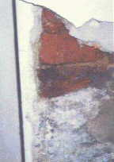
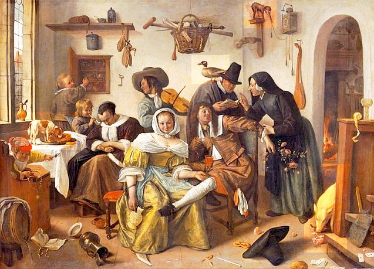
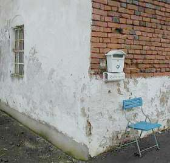
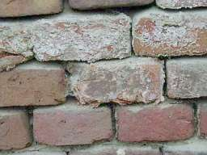

[🠔 Zur Übersicht: Aufsteigend Feuchte?](2aufstfe.md)  
# Mauerfeuchte woher? Zum historischen und wissenschaftlichen Hintergrund
**Eine Analyse der baugeschichtlichen Hintergründe von Feuchteschäden und warum moderne Abdichtungsversuche der letzten Jahrzehnte oft an den physikalischen Realitäten alter Bausubstanz scheitern.**  
_von Konrad Fischer_

## Aufsteigende Feuchte + Bauwerkstrockenlegung 15

4. Veröffentlichung Bayer. Bautenschutz-Fachplanung, Geschäftsbereich Silicone, Wacker Chemie, Abt. Bayplan, München, nachzulesen in: Helmut Weber: "Fehlervermeidung, Sanierputzsysteme im Langzeiteinsatz unter erschwerten Bedingungen" bausubstanz April 1999: 

_"In den letzten Jahrzehnten hat man immer wieder versucht, feuchtebedingte Mauerwerks- und Putzschäden durch nachträgliche abdichtende Maßnahmen im Horizontal- und Vertikalbereich dauerhaft zu beseitigen._

_Dabei mußte man immer wieder feststellen, daß dies nur bedingt möglich ist, da - wie heute allgemein bekannt - viele der sichtbaren Schäden im feuchte- und salzbelasteten Mauerwerk in erster Linie auf die Wirkung von Salzen zurückzuführen sind. Diese lösen sich im Wasser, wandern durch das Mauerwerk und konzentrieren sich dort, wo die günstigsten Verdunstungsbereiche sind. Sie führen dann zu mechanischen Schäden im Putz- und Mauerwerksbereich durch Kristallisations- und Hydratationsvorgaänge auf der einen Seite und zu einer Erhöhung des Feuchtegehalts durch hygroskopische Effekte._

_Durch diese hygroskopische Wasseraufnahme wird der Feuchtehaushalt der Wand nachhaltig im ungünstigen Sinne beeinflußt."_

5. Bautenschutz und Bausanierung B+B 5/2005: Dr. Dirk Hoffmann, BAM - Bundesanstalt für Materialprüfung, Berlin: "Wie wirksam? Nachträgliche Maßnahmen gegen Feuchtigkeit im Mauerwerk - Verfahren und ihre Ergebnisse in Praxis und Labor

... (nach allerlei widersprüchlichen Ergebnissen verschiedener Bohrlochtränkungsverfahren, als Ergebnis einer Testreihe im Labor mit einem firmenseits angewendeten Injektagemittel unbekannter Zusammensetzung)

_Der Mauerausschnitt stand bis zur Installation eines chemischen Verfahrens zwei Jahre im Wasser und hatte zum Zeitpunkt des Versuchsbeginns 43,3 kg Wasser aufgenommen. In der 3. Ziegellage oberhalb des Wasserspiegels (= 4. Lage von unten) sind dann jeweils acht Bohrlöcher eingebracht worden. ..._

_Diese wurden dann mit einer chemischen Lösung unbekannter Zusammensetzung gefüllt. Da sich innerhalb eines halben Jahres keine Masseabnahme, sondern eine Zunahme von 1,4 kg einstellte, erfolgte durch die Firma nach Einbringen neuer Bohrlöcher eine zweite Injektion in die 4. und 5. Ziegellage oberhalb des Wasserspiegels._

_Nach wiederum einem halben Jahr ließ sich auch hier eine Massezunahme um weitere 5 kg feststellen. Auf der Oberfläche der Ziegel und der Fugen hatten sich erhebliche Mengen an Ausblühungen gebildet. Daraufhin wurde der Versuch abgebrochen."_

(Erst eine Injektionsmethode nach Ausheizungen reduzierte die Wasserbefrachtung. Das vermag allerdings nicht zu verwundern. Verwundern muß allerdings die "Wasseraufnahme im Mauerkörper. Und verdächtigerweise wird uns im Bericht nichts davon verraten, wie es dem Laboranten gelungen ist, die Porengeometrie des verwendeten Mauermörtels so (praxisfremd) an die der Mauersteine anzupassen, daß eine kapillare Transportleistung im Mauerstein-Mauermörtelsystem überhaupt möglich wurde ...)

6. Leo Pel, Moisture transport in porous building materials, Ph.D. thesis, Eindhoven University of Technology, the Netherlands (1995) 
["Moisture Transport Across Brick/Mortar Interface"](http://www.phys.tue.nl/nfcmr/Restop04.html)

Holländische Bauforschung um Dr.ir. Leo Pel, Eindhoven University of Technology, Department of Physics, Centre for Material Research with Magnetic Resonance, [Transport in Permeable Media](http://www.phys.tue.nl/nfcmr/cmrmain.html), verwendet - typisch Wissenschaft - in der Baupraxis vollkommen unbrauchbare Mörtel mit extrem geringem Luftporengehalt und Porenvolumen, um zumindest minimale Transportvorgänge aus dem Ziegelstein in den Versuchsmörtel zu erzwingen - trotzdem eine Bestätigung des normalerweise unendlich hohen Kapillarwiderstands zwischen Stein und baustellenüblichem bzw. historisch gebräuchlichem porenreichem Kalkmörtel. Zitat zum Wassertransport zwischen Ziegelstein und Mörtel und umgekehrt:

_"In the case of absorption from brick to mortar, moisture profiles start to develop in the mortar when the water reaches the interface. Since the mortar absorbs water rather slowly, the brick is quickly saturated up to its capillary moisture content. In the case of absorption from mortar to brick, the water is quickly absorbed by the brick when it reaches the interface, and after a few hours an almost stationary moisture profile develops in the mortar."_ 
(Beim Feuchtetransport vom Ziegel in den Mörtel wird der Feuchtegehalt des Mörtels ansteigen, wenn das Wasser die Materialgrenzfläche zwischen Ziegel und Mörtel erreicht. Da der Mörtel das Wasser ziemlich langsam aufsaugt, werden die Ziegelporen schnell mit Feuchte gesättigt sein. Bei der Feuchteaufnahme aus dem Mörtel in den Ziegel wird das Wasser schnell im Ziegel aufgesaugt, wenn es die Materialgrenzfläche erreicht, und nach ein paar Stunden entsteht ein nahezu gleichbleibender Feuchtigkeitsgehalt im Mörtel. - Übers. K.F.)

(Auf der angelinkten Webseite Grafiken, die den stark verminderten Transport vom Stein in den Labormörtel verdeutlichen)

7. Heinrich Schmitt: Hochbaukonstruktion, Die Bauteile und das Baugefüge, Grundlagen des heutigen Bauens, Fünfte Auflage 1974, S. 34.

"Maßgebend für den Grad der Durchfeuchtung ist die Saugfähigkeit, also das Porengefüge der verwendeten Baustoffe. Da die Feuchtigkeit immer aus den grobporigen in die feinporigen Schichten dringt (nie umgekehrt), ist es von Belang, wie die Poren zueinander liegen." 

8. Der Maueraussatz im 3. Buch Mose (Leviticus) Kapitel 14, Vers 33-54 nach der Übersetzung von Dr. Martin Luther (1545)

Sehr schön verweist der Levitucus auf den Mauerfraß bzw. "leprösen" Maueraussatz ("Aussatz" hebräisch: "Zaräath" griechisch: "Lépra"), der die die typisch löchrigen Folgen der hausnahen Tierhaltung - nicht gerade selten bei Bauern und Hirten - an der Maueroberfläche beschreibt. Als ob es der liebe Gott selber sei, der einem Haus den vermaledeiten Mauerfraß anhext. Ja, es braucht also immer Sanier-/Heilmittel des von Gott gesandten Priesters, heute "Wissenschaftlers", um den bösen Wandkrebs hinwegzuzaubern. Alter Wein in neuen Schläuchen. 

_"33 Und der HERR redete mit Mose und Aaron und sprach: 
34 Wenn ihr in das Land Kanaan kommt, das ich euch zur Besitzung gebe, und ich werde irgend in einem Hause eurer Besitzung ein Aussatzmal geben, 
35 so soll der kommen, des das Haus ist, es dem Priester ansagen und sprechen: Es sieht mich an, als sei ein Aussatzmal an meinem Hause. 
36 Da soll der Priester heißen, daß sie das Haus ausräumen, ehe denn der Priester hineingeht, das Mal zu besehen, auf daß nicht unrein werde alles, was im Hause ist; darnach soll der Priester hineingehen, das Haus zu besehen. 
37 Wenn er nun das Mal besieht und findet, daß an der Wand des Hauses grünliche oder rötliche Grüblein sind und ihr Ansehen tiefer denn sonst die Wand ist, 
38 so soll er aus dem Hause zur Tür herausgehen und das Haus sieben Tage verschließen. 
39 Und wenn er am siebenten Tage wiederkommt und sieht, daß das Mal weitergefressen hat an des Hauses Wand, 
40 so soll er die Steine heißen ausbrechen, darin das Mal ist, und hinaus vor die Stadt an einen unreinen Ort werfen. 
41 Und das Haus soll man inwendig ringsherum schaben und die abgeschabte Tünche hinaus vor die Stadt an einen unreinen Ort schütten 
42 und andere Steine nehmen und an jener Statt tun und andern Lehm nehmen und das Haus bewerfen. 
43 Wenn das Mal wiederkommt und ausbricht am Hause, nachdem man die Steine ausgerissen und das Haus anders beworfen hat, 
44 so soll der Priester hineingehen. Und wenn er sieht, daß das Mal weitergefressen hat am Hause, so ist's gewiß ein fressender Aussatz am Hause, und es ist unrein. 
45 Darum soll man das Haus abbrechen, Steine und Holz und alle Tünche am Hause, und soll's hinausführen vor die Stadt an einen unreinen Ort. 
46 Und wer in das Haus geht, solange es verschlossen ist, der ist unrein bis an den Abend. 
47 Und wer darin liegt oder darin ißt, der soll seine Kleider waschen. 
48 Wo aber der Priester, wenn er hineingeht, sieht, daß dies Mal nicht weiter am Haus gefressen hat, nachdem das Haus beworfen ist, so soll er's rein sprechen; denn das Mal ist heil geworden. 
49 Und soll zum Sündopfer für das Haus nehmen zwei Vögel, Zedernholz und scharlachfarbene Wolle und Isop, 
50 und den einen Vogel schlachten in ein irdenes Gefäß über frischem Wasser. 
51 Und soll nehmen das Zedernholz, die scharlachfarbene Wolle, den Isop und den lebendigen Vogel, und in des geschlachteten Vogels Blut und in das frische Wasser tauchen, und das Haus siebenmal besprengen. 
52 Und soll also das Haus entsündigen mit dem Blut des Vogels und mit dem frischen Wasser, mit dem lebendigen Vogel, mit dem Zedernholz, mit Isop und mit scharlachfarbener Wolle. 
53 Und soll den lebendigen Vogel lassen hinaus vor die Stadt ins freie Feld fliegen, und das Haus versöhnen, so ist's rein. 
54 Das ist das Gesetz über allerlei Mal des Aussatzes und Grindes, 
55 über den Aussatz der Kleider und der Häuser, 
56 über Beulen, Ausschlag und Eiterweiß, 
57 auf daß man wisse, wann etwas unrein oder rein ist. Das ist das Gesetz vom Aussatz."_ 

Zum Abschluß:

Da die Saniervertreter bzw. ihre "Merkblätter" zu Injektions- und Dichtungspampen auch gerne noch [Sanierputz ](2sanipuz.md) als "flankierende", ein Dr.-Ing. Helmut Künzel sogar als alleinig ausreichende Maßnahme vorschlagen/vorschreiben, empfehle ich auch die kritische Durchleuchtung dieser Wunderwaffe, z.B. durch Drücken dieses fabelhaft weggeschwarteten Sanierputz-Bildleins. Und den Feuchteexperten, die mit schwachverständigen Schlechtachten zu den Vorzügen und Nachteilen verschiedenster Trockenlegungsmethoden bei Bautölpeln hausieren gehen, ohne die hier vorgetragenen Argumente gegen sinnlose Versuche darzustellen, sei geweissagt: Das geht dermaleinstens bis bald schief und die angespreizte Reputation schwindet dann dahin.

Nachschlag 1:

Ein Fund zur amtlich vorgeschreibenen Schweinehaltung in Wohnungen in Frank-Dietrich Jacob, Evamaria Engel: Städtisches Leben im Mittelalter, Schriftquellen und Bildzeugnisse, Böhlau 2006:

_"Der Rat ist übereingekommen und gebietet, weil etliche Leute ihre Schweine in der Stadt aufziehen und auf den Straßen umherlaufen lassen und dadurch anderen Leuten Schaden zufügen, daß jedermann, der Schweine aufziehen will, diese nach dem nächsten Allerheiligenfest [1. November] in seinem Haus oder Hof oder in seiner Wohnung halte und sie nicht in der Stadt umherlaufen lasse, es sei denn, man wolle sie zum Wasser, zur Tränke oder zum Hirten oder aufs Feld treiben. Das kann man tun, aber man soll sie dann möglichst schnell durch die Gassen treiben. 

Wenn man danach noch Schweine, junge oder oder alte in den Gassen vorfindet, es wäre am Tage oder in der Nacht, so hat der Rat bestimmt, daß die Scharwächter nachts und der Stockmeister am Tage bei ihrem Eide die Schweine ausnahmslos eintreiben sollen. Und man soll von jedem Schwein, klein oder groß, 1 Schilling Heller Strafe nehmen. 

30. September 1421, Verordnung des Rates der Stadt Frankfurt am Main, in: Armin Wolf, Nr. 186, S. 276 f."_

Nachschlag 2:

In einem gülleverseuchten Haus gefunden: "Markt und Kloster Sonnefeld, Eine Heimatkunde von Oberlehrer Herrmann Wank, Sonnefeld 1925, Gedruckt in der Buchdruckerei von A. Roßteutscher in Coburg, Kapitel "Die Bevölkerung Hofstädtens im 18. Jahrhundert", Seite 108":

_"Die Reinlichkeit ist unter diesem Himmelstrich nicht zu Hause. ... Wenn z. B. ein neuer Fußboden in die Stube gelegt wird, so werden die Bretter nicht gehobelt, und nun kann dieser Fußboden 30, 40, 50 Jahre liegen, ohne ein einzigesmal gewaschen oder nur mit Sand bestreut zu werden. Von diesem Umstande kann der Leser sicher auf alle anderen Reinlichkeitsartikel fortschließen, und sich dabei noch die Bemerkung gemacht sein lassen, daß in einer solchen Stube im Frühjahr neben der Menschenfamilie auch noch junge Schweine, Gänse, Hühner, junge Ziegenböcke, Lämmer, auch wohl Kälber, mit allen Exkrementen 4, 5, 6 Wochen zu Hause sind, welche Bevölkerung mit dem Brudel aus 2 Ofenblasen eine solche injuriöse Ausdünstung verursacht, daß es ein nicht Gewohnter kaum aushalten kann. Ländlich, sittlich! Doch ist keine Regel ohne Ausnahme."_

1663, also etwas nach Mitte des 17. Jahrhunderts, sah der niederländische Maler Jan Steen ein fast vergleichbares Idyll bei vornehmen 

holländischen Bürgersleuten mit etwas liebevollerem Blick (Die verkehrte Welt, Kunsthistorisches Museum Wien): 

Aktuell ergänzend: 
[Darf man ein Hausschwein in der Wohnung halten?](http://www.gutefrage.net/frage/darf-man-ein-hausschwein-in-der-wohnung-halten) 
[Forum Schweinefreunde - Die krasse Fan-Seite für die Haussau!](http://www.schweinefreunde.de/forum/wbb2/thread.php?postid=86156) 
[Gerichtlich gem, BGB §§ 535, 550, 242 erlaubte Schweinehaltung in einer Mietwohnung in Köpenick](http://www.mieterverein-regensburg.de/zeitung/2001-12-05_sauerei.htm) 
[Nutzviehhaltung in, an und um Wohnungen](http://de.narkive.com/2005/10/27/1357827-h-hner-und-schweinehaltung-beim-einfamilienhaus.html) 
[Schweine und Schweinehaltung in Entwicklungsländern (Kraß!)](http://www.payer.de/entwicklung/entw086.htm) 
[Schweinehaltung / Minischweine in der deutschen Wohnung - Tipps und Tricks](http://www.minischweinzucht-schienerberg.de/minischweinezucht/Das_Minischwein_/Haltung/haltung.html) 
[Hausschweinhaltung total in Konstanzer Wohnung](http://www.tagblatt.de/Home/nachrichten_artikel,-Im-Bett-mit-zwei-Schweinen-Paar-in-Konstanz-lebt-mit-Minischweinen-zusammen-Tierschuetzer-skeptisch-_arid,85991_print,1.html)

Nachschlag 3:

Zum historischen Hintergrund der Salzbelastung am Bauwerk schreibt Otto Krätz in der SZ am Wochenende, 10.11.01 (S. I): 

_"Drastisch beschreibt der Technologe F. Knapp 1847 die unter den damals recht großzügigen hygienischen Bedingungen allenthalben zu entdeckende Salpeterbildung._

_"In stark bevölkerten Städten in engen Straßen, wo sich die Exkremente der Zugtiere, der Abfall der Schlächtereien, Spülwasser aus den Häusern, Abfälle von den Märkten, wo man Fleisch, Geflügel, Fische und andere Nahrungsmittel verkauft werden, wo sich diese und viele derartige Dinge mit dem flüssigen Inhalt der Gossen vermischen und in fortwährender Fäulnis bgriffen sind, sieht man,wie der Mörtelverputz an dem Fuße der Außenmauern nach und nach zerfressen wird und sich mit schneeartigen, weißen, kristallinigen Ausblühungen bedeckt und "Salpeterfraß" genannt wird."_

_Noch im 18. Jahrhundert nutzte die kurbayerische Armee den besonders reichlichen Mauersalpeter der jaucheumspülten und meist nicht unterkellerten Bauernhäuser. Von Soldaten geschützte Abgesandte der Salpeterkommission überfielen im Morgengrauen wehrlose Gehöfte, rissen die Bodendielen heraus und kratzten den Salpeter ab. Die Bauern [...] setzten mit Unterstützung der Kirche durch, dass zumindest jener Teil der Wohnstube, der der religiösen Andacht diente, verschont blieb. Durch demonstrative und reichliche Anordnung von Herrgottswinkeln, Hausaltären und Heiligenbildern konnte man die Salpeterkommission aushebeln. Diese Schlitzohrigkeit begründete den bis heute anhaltenden Ruf tiefer Frömmigkeit des bayerischen Landvolks."_

Mir boarischen Engel, mir san scho Hünd ... so etwa könnts ausgsehn ham, was die Saliterer narrisch machte:

. 
Man beachte, wie vereinzelte Salzflächen der Annahme einer flächig aufsteigenden Feuchte Hohn sprechen

Für den kleinen Schlaumeier: Ein paar ergänzende Infolinks zur historischen Salpiterey, zum Handwerk der Saliterer, der Salpetersieder: 
[Referat: Salpetergewinnung und Salpeterwirtschaft vom Mittelalter bis in die Neuzeit (Chemie)](http://www.gimpy.de/forum/print.php?threadid=14134&page=1&sid=03c350fdfc3e3bfe23a61857606e788b) 
[Wikipedia: Salpetersieder (auch Saliterer oder Salpeterer)](http://de.wikipedia.org/wiki/Salpetersieder) 
[Salpetergewinnung in: Die Pulvermühlen von Meckelfeld und Bomlitz: Die Fabrikation von Schießpulver im 18. und 19. Jahrhundert am Beispiel zweier Pulvermühlen von Carsten Walczok von Lit Verlag](http://books.google.de/books?id=DN0BKmptdY4C&pg=PA171&lpg=PA171&dq=salpetergewinnung+schießpulver&source=bl&ots=-78_0Kx_60&sig=lJRFyhE-AtGM3awVFdJrRwSAMus&hl=de&ei=umlyTYHMLs-Sswb2uZWEDg&sa=X&oi=book_result&ct=result&resnum=8&ved=0CEsQ6AEwBw#v=onepage&q=salpetergewinnung schießpulver&f=true#v=onepage&q=salpetergewinnung schießpulver&f=true) 
[Der Salpetersieder (auch Saliterer, Salpeterer oder Salpetersammler) - mit Abbildungen](http://www.bessarabia.altervista.org/deu/3bauern/01.51_salpetersieder.html) 
[Kaliumnitrat](http://www.uni-protokolle.de/Lexikon/Kaliumnitrat.html) 
[Der Hochaltar von Sankt Laurentius Ebersheim - die Stiftung eines Salpeterkratzers](http://www.bistummainz.de/pfarreien/dekanat-mainz-stadt/ebersheim/Informationen_zur_Pfarrei/hochaltar.html) 

Nachtrag 4:

Karl-Heinz Rothenberger: Die Hungerjahre nach dem Zweiten Weltkrieg am Beispiel von Rheinland-Pfalz, Kriegsende und Neubeginn. Westdeutschland und Luxemburg zwischen 1944 und 1947, 7. Alzeyer Kolloquium 1995. Hrsg. von Kurt Düwell und Michael Matheus. Stuttgart 1997, "Geschichtliche Landeskunde", Band 46, https://www.regionalgeschichte.net/bibliothek/texte/aufsaetze/rothenberger-hungerjahre.html:

"Die Bedeutung von Hamsterwesen und Schwarzem Markt 

Für die ländlichen Normalverbraucher sollte man den Grünen Markt, also Kleintierhaltung und Selbstanbau, im Umfang nicht unterschätzen, wenngleich die Verhältnisse nicht für alle gleich waren. Ein Gartengrundstück von 10 x 15 m erbringt immerhin 2-3 Zentner Kartoffeln, die Jahresration eines Normalverbrauchers. Die private Hühnerhaltung war so verbreitet, dass bei Eiern 45% der Bevölkerung von den Ernährungsämtern als autark bezeichnet wurden. Gleiches kann man für Stallhasen annehmen. Die Kleintierhaltung – "Kellerschwein", "Balkon-Huhn" und "Speicher-Geiß" – war selbst in den Städten anzutreffen." 

Hierzu paßt: ["Borkumer Geschichten: Das Kellerschwein"](http://heimkehr-hamburg.de/blog/index.php/2011/09/12/borkumer-geschichten-das-kellerschwein/) 

Das Kellerschwein war aber nicht nur nach dem zweiten Weltkrieg Teil des Überlebenskampfes der hungernden Land- und Stadtbevölkerung, sondern begann schon im ersten Weltkrieg: 

[LN-Serie zur Ausstellung „Die Unschuld verloren“ in Lüdenscheid - Teil eins](https://www.come-on.de/luedenscheid/ln-serie-ausstellung-die-unschuld-verloren-luedenscheid-teil-eins-3787494.html) 

"Bald schon, im Februar 1915, wurde Brot rationiert, später kam die Milchrationierung hinzu. Fettkarten wurden eingeführt, der Kartoffelverkauf streng kontrolliert und Eierkarten verteilt. „Wieviele neue Begriffe sind damals geprägt worden Heute stehen sie wie schattenhafte Zeugen jener Zeit vor uns: Kriegsbrot, Steckrüben, Marmelade, fragwürdige Fettigkeiten, Süßstoff, Kartoffelwalzmehl, Wibbelbohnen, Konservenfleisch. Das Kellerschwein und die Pensionskuh. Die Brotmarke, der Lebensmittelschein “ zitiert Simon den Lüdenscheider Chronisten Dr. Hans Strobel."

Und hier noch thematisch zur oben angeführten Kritik an der bösen Normenreiterei passende Auszüge aus einem bemerkenswert kritischen Fachartikel in ARCONIS 1/02, Dietrich Hinz: PE-Folien in Fußbodenkonstruktionen gegen Erdreich bei reiner Bodenfeuchte (hat`s vielleicht zu lange in die Baugrube geregnet, liegt sie im Hochmoor oder Torfsumpf, liegt da gar ein artesischer Brunnen vor? - Sachen gibt`s, die gibt`s gar net! Dafür machen schlechtberatene Bauherren gerne selbst ihre Bude naß - durch den Einbau von Unterböden aus Beton. Wieviel Jahrzehnte daraus die unheimlichen Feuchtemengen herauskriechen, wie so eine brutale Betonplatte sich erst böse wölbt (wenn sie oberseitig abtrocknet), um danach (wenn die Restfeuchte nach Einbau Bodenbelag dann nach oben stößt und sich dort staut) heimtückisch zu schüsseln, und um dann zu schlechter Letzt den Oberboden nach besten und geradezu unheimlichen Kräften zu beschädigen) fragt sich so ein Bauherr lieber nicht! Dabei gäbe es so schön bewährte Lösungen in Trockenbauweise ...):

_"[...] In vielen Details werden - praxisgerecht - PE-Folien ohne zusätzliche Abdichtungsbahnen [unter Beton-Kellerbodenplatten] angegeben. Wird jedoch keine zusätzliche Abdichtungsbahn [ein Muß gem. DIN 18195-4:2000-08/1.4/ Ziffer 6.2.1 Satz 1] vorgesehen, werden Tausende von m² Gebäudegrundflächen nicht regelgerecht gebaut, weil im Sinne der Norm die Bodenplatten nicht gegen Bodenfeuchte abgedichtet sind. Deshalb müssen diese Konstruktionen jedoch nicht zwangsweise mangelhaft sein._

_Jener Mangelbegriff, der sich bei fehlerfreier Ausführung ausschliesslich auf einen Verstoss gegen die allgemein anerkannten Regeln der Technik (a.a.R.d.T.) beruft, ist zunehmender Kritik unterworfen._

_Würde die Neufassung der Norm alles Erforderliche zum Schutz vor Schäden aus Wasserbelastungen enthalten, was zum Stand der Herausgabe technisch richtig und in der Praxis erprobt ist, so müsste die ganze Republik mit Baumängels wegen fehlender wirksamer Abdichtung überschüttet sein. Nachdem dies jedoch nicht der Fall ist, muss hinterfragt werden, weshalb eine Vielzahl von Gebäuden mit PE-Folien als einzige untere Trenn- und Abdichtungslage ohne Schäden sind._

Zwischenfrage KF: Vielleicht ist der Boden gar net so feucht, wie viele annehmen?

_Leider sind auch viele Gutachten bekannt, die alleine das Fehlen einer DIN-gerechten Abdichtung mit Bitumen-, PVC- oder Kunststoffbahnen zum Baumangel erklärten, weil nicht normgerecht gebaut worden sei. Für diese Gutachter bedeutete dieser Sachverhalt, dass sie keine weiteren Anstrengungen unternahmen, um nach der eigentlichen Ursache der aufgetretenen Schäden zu forschen._

_Der betroffene Unternehmer wurde allein aus diesem Grunde ohne Einschränkung zur Mangelbeseitigung verurteilt, weshalb eine Vielzahl von Bodenplatten unsinniger Weise herausgerissen und neu errichtet werden mussten. Die Verhältnismässigkeit der Mangelbeseitigung trotz hoher Kosten wurde damit begründet, dass nur der Abbruch und die Neuerrichtung mit regelrechter Abdichtung zum Erfolg der Mangelfreiheit führen könne._

[Es wird richtigerweise weiter ausgeführt, daß die normgemäß vorausgesetzten Feuchtelasten gar nicht vorliegen bzw. nicht zwangsläufig so vorliegen müssen oder können, daß daraus eine [KF: in Anbetracht der Realität geradezu widersinnige] Muß-Forderung abzuleiten ist]

_Fazit: [...]_

_- Der vielfach geäusserte Verdacht, dass Lobbyisten die fachlichen Aussagen von DIN - Normen verfälschen, kann auch in diesem Fall leider nicht entkräftet werden. Die Notwendigkeit der mit masslosen Kosten belasteten Beschaffung des Regelwerks DIN 18195 sollte kritisch überprüft werden. Zu den allgemein anerkannten Regeln der Technik kann dieses Regelwerk wohl nicht gerechnet werden."_

Wie wahr! Solch normverliebte Schwachverständige kenne ich sogar persönlich. Adresse auf Anfrage. Und noch eins: 

Nach all diesen zitatgestützten Ausführungen dürfte wohl klar geworden sein, daß eine "Horizontalisolierung gegen die aufsteigende Feuchte" auch inkl. einer "Flankierenden Maßnahme - Sanierputz" schon lange nicht mehr zu den "allgemein anerkannten Regeln der Technik - a.a.R.d.T." gehören kann. Vor allem Dank Praxis, Forschung und Wissenschaft. Wacker, Fraunhofer und Uni Wismar sei Dank.

---

Danke für Ihre Aufmerksamkeit. Jetzt sind Sie fertig. Oder doch nicht? Ach so, Sie glauben mir nicht, weil Sie doch selber schon so oft aufsteigende Feuchte gesehen haben? Vielleicht hilft Ihnen dann das weiter, meine Rezension eines Buches eines englischen Baumeisters: 

_**Die perfekte Aufklärung** 

Jeff Howell ist Mauerer und arbeitete 15 Jahre in der Bauindustrie, bevor er als Lehrer für Baukonstruktion an der South Bank University, London berufen wurde. Dort erforschte er durch praktische Versuche die Baufeuchte, gefördert durch die Britische Regierung. Inzwischen arbeitet er als Autor und schreibt jede Woche seine Kolumnen "Doctor on the House" und "On the Level" für den Sunday Telegraf. 

1993 stellte er seinen Studenten die Aufgabe, verschiedene Horizontalisolierungen auszutesten, ließ dafür vier Mauerwerkspfeiler zum Vergleich der verschiedenen Produkte errichten und stellte sie in Wasserwannen. Zu seiner eigenen Überraschung gab es an dem Referenzpfeiler ohne Horizontalisolierung (damp-proof course) ebensowenig eine "aufsteigende Feuchte (Rising damp) wie an den "isolierten". Daraufhin versuchte er es mit mehr porigen Ziegelsteinen, verschiedenen Mörtelsorten, brach gar Mauerpartien aus Victorianischen Häusern - nie stieg irgendeine Feuchte auf! 

Er reiste zu Feldstudien nach Holland und stellte dort fest, daß all die Häuser im sumpfigen Gelände unter dem Meeresspiegel ohne irgendwelchen Horizontalisolierungen auskamen. Weil es eben keine aufsteigende Feuchte gibt. Die englische Bezeichnung dafür: "Rising damp" wurde erst 1951 erfunden und füllt seitdem die Taschen einer Betrugsmafia, die auch in Deutschland Oberwasser bei den doofen bzw. leichtgläubigen öffentlichen und privaten Bauherren hat. Selbstverständlich alles nach DIN. 

Interessant auch seine Versuche mit den üblichen Horizontalisolierungen: Nach deren Anwendung blieben vorhandene Feuchten bestehen. Das erklärt die kaschierenden Pseudo-Heilputze (Sanierputze), die unsere "Trockenleger" noch hinterher verkaufen. 

Dieses Buch klärt auf, zeigt die Tricks der Feuchteschwindler und gibt Rat. Klasse!_ 

Zuguterletzt - das Ergebnis einer [telefonischen Bauberatung](2berat.md): 

Betreff: vergebliches Trockenlegen 
Von: "PG" PG...@gmx.de 
Datum: 10.05.2013 20:53 
An: info@konrad-fischer-info.de 

Die lange Suche nach der Wahrheit, 
Nach über 22 Jahren vergeblichen Bemühungen unsere Scheune und Ställe nachhaltig trocken zu legen bin ich auf ihre Seite gestoßen.Hier habe ich erfahren, dass es aufsteigende Feuchte gar nicht geben kann! Sondern das Problem an der Salzbelastung durch unsere Tiere lag. Kurz nach der Wiedervereinigung, ich war damals gerade 12, ließ sich mein Vater Injektionslösungen für mehrere Tausend DM zum Trockenlegen aufreden, er bohrte nach Feierabend und am Wochenende diese wahnsinnstiefen Bohrungen. Geholfen hat es gar nichts. Jetzt, ungefähr drei Jahre später, kam die Radikallösung: wir stemmten mit einem Riesenstemmhammer, den ich mit 15 kaum halten konnte, 36cm dicke Vollziegelwände durch - und das unmittelbar über dem Fußboden - also im Liegen. Einen Meter ausstemmmen, dann doppelte dicke Folie legen und ausmeiern, einfach eine Scheißarbeit in Zwangslage! So ging es ungefähr 150 meter über mehrere Jahre! Ich am Wochenende und mein Vater nach und vor der Arbeit. 

Als wir fertig waren und merkten, dass diese Methode auch nichts hilft, versuchte es mein Vater mit Sanierputz, da wir einen Mieter für eine Garage hatten. Dieser schweineteure Putz war nun aufgebracht, als nach einigen Monaten der Mieter aufgeregt sagte: "An der Decke müsst ihr unbedingt was machen, der Putz fällt auf das Auto." Schließlich mussten wir eine Zwischendecke einziehen - was für ein Aufwand! Mittlerweile kam der Putz teilweise auch wieder von den Wänden. Uns blieb nichts anderes, als regelmäßig zu kehren. Die Mieteinahmen deckten nicht ansatzweise die Kosten, wir zahlten mehrere tausend Euro und von der Arbeit ganz zu schweigen. Jetzt war der Punkt gekommen, als wir resigniert hatten. Klar nach so vielen Jahren, unendlichen Stunden, Einsatz und einem halben Vermögen! 

2010 war das Jahr, als wir begannen, unser altes Fachwerkhaus zu sanieren und da ich jetzt alles richtig machen wollte, suchte ich so lange nach der Wahrheit, bis ich sie schließlich hier fand. Aufsteigende Feuchte gibt es nicht und mit der Entsalzung nach einem beschriebenen einfachen und extrem kostengüstigen Verfahren durch Sie, haben wir mit verhältnismäßig wenig Zeit und Geld unsere Wände trocken bekommen und vor weiterem Mauerfrass geschützt. 

Danke! 

Mit freundlichen Grüßen 

PG 

Nochmals von vorne? Bitteschön: Aufsteigende Feuchte Kapitel [1](2aufstfe.md) [2](2auffe02.md) [3](2auffe03.md) [4](2auffe04.md) [5](2auffe05.md) [6](2auffe06.md) [7](2auffe07.md) [8](2auffe08.md) [9](2auffe09.md) [10](2auffe10.md) [11](2auffe11.md) [12](2auffe12.md) [13](2auffe13.md) [14](2auffe14.md) [15](2auffe15.md)
