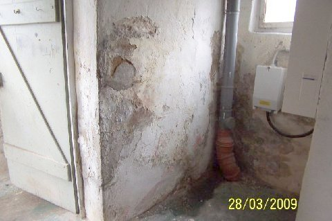
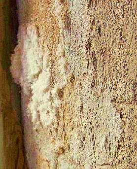
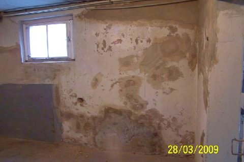

[🠔 Zur Übersicht: Feuchte Kellerwände](21bausto.md)  
# Schwindelei Aufsteigende Feuchte
**Warum Horizontalsperre und Sanierputz versagen und welche Methoden wirklich helfen.**  
_von Konrad Fischer_

[🠔 Zur Übersicht: Feuchte Kellerwände](21bausto.md)  

**Warum Horizontalsperre und Sanierputz versagen und welche Methoden wirklich helfen.**  
_von Konrad Fischer_

> [!abstract]+ Kapitelübersicht: Aufsteigend Feuchte?  
> 1. **Schwindelei Aufsteigende Feuchte**
> 2. [Ein schrecklicher „Trockenlegungsfall“](2auffe02.md)
> 3. [Feuchtequellen](2auffe03.md)
> 4. [Ziegel-Mauerwerk und Aufsteigende Feuchte](2auffe04.md)
> 5. [Naturstein-Mauerwerk und Aufsteigende Feuchte](2auffe05.md)
> 6. [Nachträgliche Horizontalabdichtung und Mauerwerksversalzung](2auffe06.md)
> 7. [Kondensat und Hygroskopie im naßkalten Keller und sonstwo](2auffe07.md)
> 8. [Trockenlegung oder Bauwerksschäden durch Horizontalisolierung?](2auffe08.md)
> 9. [Trockenlegungsschwindel: Marketingtricks und das Kleingedruckte](2auffe09.md)
> 10. [Elektroosmose und die typischen Trockenleger-Ausreden bei Mißerfolg](2auffe10.md)
> 11. [Trockenlegungsexperten? - Planer und Gutachter](2auffe11.md)
> 12. [Trockenlegung - Industrieberatung oder der gesunde Menschenverstand?](2auffe12.md)
> 13. [Mauertrockenlegung - Die klassischen Fehler](2auffe13.md)
> 14. [Nasse Wände sanieren - Was sagt die Wissenschaft?](2auffe14.md)
> 15. [Mauerfeuchte woher? Zum historischen und wissenschaftlichen Hintergrund](2auffe15.md)

## Einführung in die Problemlage

### Sie machen einfach "SCHNIPP" und weg ist Ihr Feuchteproblem!

Ach, wäre das schön, was? Ganz so einfach ist es ja nicht, aber oft wesentlich einfacher, als es in den drei Angeboten auf Ihrem Tisch steht. Und wer weiß schon, welches dieser Angebote reine Scharlatanerie ist und sich den durchnäßten Kunden als bequemes "Trockenlegungs"-Opfer ausgesucht hat, was dann nur für den Geldbeutel zutrifft? Keines? Alle? Darum geht es hier. Und Ihnen, stimmt's? 

Jedes Haus - nicht nur die ammoniakgetränkte Stallwand voller Salpeter/Mauersalpeter/Mauerfraß/Kalziumnitrat - hat doch irgendwo ein feuchtes, salzbröseliges, salpeterverpusteltes, ausblüheffloreszierendes, naßschuppiges oder fruchtkörper-verpilzt-schimmelschwammiges Eckchen, oder? Im Gewölbekeller (egal ob Tonnengewölbe oder Preußisches oder Böhmisches Kappengewölbe, Stallgewölbe oder Kellergewölbe), dem mit Betondecke, Betonsteindecke, Holzbalkendecke, Eisenträgerdecke oder Hourdis überdeckten Kellerraum, am Sockel der Kellerräume oder im Erdgeschoß und auch an irgendwelchen Innenwänden aus Naturstein, Backstein, Ziegelmauerwerk oder sogar Fachwerkwänden kennt man das - landauf und landab - Feuchtes Mauerwerk und Mauerfeuchtigkeit - mit oder - wie es früher gute Handwerkssitte war - auch ohne Feuchtesperre, ganz wie belieben: 

... 
. 
.. 
....  
 

 So kann es freilich auch aussehen: 

... 
. 
 

 

 

Oder so: 

 

 

 

 

(alle Bilder aus meiner Bauberatung) 

---

**Herumdoktern und Verwüsten - möglichst teuer und sinnlos!** 

Das SCHREIT nach Mauerentfeuchtung und Trockenlegung, Bautrockner, Fundamentausgrabung, Kellertrocknung, Drainage/Dränage, Geländetieferlegung, Wanddauerheizung / Temperierung, Putzaustausch und Fugmörtelerneuerung, Stirnrunzeln und Haareraufen, Verzweiflung und Panik, oder? Auf dem Mauerfeuchte-/Kellerfeuchte-Markt tummeln sich folglich viele Akteure: 

Sachverständigen, Fachautoren / Fachjournalisten - teils aus gewisser Nähe zur Trockenlegungsindustrie, Handwerker, Sanierer, Trockenlegungspäpste und -gegenpäpste - alles erfolgreiche Experten fürs "Trockenlegen" und die "Feuchtesanierung" durch Einbau / Installation einer "nachträglichen Horizontalsperre / Horizontalabdichtung / Horizontalen Sperrschicht / Horizontalabsperrung / Horizontalisolierung / Horizontaldichtung / Mauerwerksabdichtung / Mauerwerksisolierung" wie: 

* drucklose Injektion / Flascheninjektion / Kapillarstäbchen-Injektion oder Druckinjektion mit Injektionspackern (Bohrpacker / Schlagpacker / Schraubpacker / Klebepacker / Heizpacker) / Injektionsschlauch / Injektionsdübel / Bohrlochventil / Injektionsnippel oder im zuflußgeregelten Impulsverfahren bzw. mit Mehrstufeninjektion (1. Injektion einer mikroporösen Zementsuspension, 2. Injektage Siliconmikroemulsion, 3. Nachinjektion alkalisches Injektionmittel) von allerlei gift-, lösemittel-, polymer- bzw. salzhaltigen Injektions-Flüssigkeiten (!) / wasserlösliche, niedrig-viskose Injektionsmittel: Polyacrylat-Gel, Alkalisilicat (Schadsalze wie Soda abspaltendes Natriumsilikat, ebenso schädliches Pottasche abspaltendes Kaliumsilikat/Kali-Wasserglas -> Alkalisilikataufwachsungen, Hygroskopizität!), ebenso schadsalzabspaltende Alkalisiliconate / Siliconate, Alkalimethylsiliconat oder wasserabweisende / hydrophobierende silan-/siloxanhaltige Cremes / Silane, Siliconmicroemulsion SMK ( Silanemulsion / Siloxanemulsion, Silikon-Mikroemulsion), erwärmte Paraffine in mit Heizstäben erhitzte Mauerwerksbohrungen (Paraffinverfahren mit druckloser Injektion oder im Kombinationsverfahren auch mit Druck), Paraffinöl + Spezialharz / Polymerharz / Polymer-Kunststoff
* nach Seilsägeverfahren bzw. Mauersägeverfahren eingelegten Kunststoffbahnen, Kunststoff-Vergußmaterial, teils schwermetallhaltigen Metallfolien und eingerammten Blechplatten (Edelstahlblechplatten - V4A-Blech, Chromstahlblech, Chromnickelstahlblech, Chromnickelmolybdän-Stahlblech, bituminierte Aluminiumbahnen, Bleiplatten, mechanische Horizontalabdichtung mittels Mauersäge-Verfahren oder gar Maueraustausch-Verfahren),
* Elekroosmose und sonstige Erdwellen-/Erdmagnetismus-Umpolungs-/Resonanzverfahren bzw. Prinzipien des Ying-Yang-Systems, der vedischen Wohn- und Baukunst Vasati, dem I-Ging, der Ayurveda-Heilkunst, dem Feng shui, der Aromaölmethode, dem Handauflegen, der Schauberger-Wasserbeschwörungs-Systematik, dem Tesla-Prinzip und weiterer Magnetismus-Spiritismus-Zaubereien für entgottet-dämonensüchtige Kundschaft,
* die Entlüftungsröhrchen nach Knapen (Knapensche Röhrchen / Lüftungsrohre / Mauerröhrchen schräg nach oben ins nasse Mauerwerk gebohrte Löcher mit keramischen oder porösen Rohr-Kunststoffeinsätzen ("Mauerlungen"), die die Wand durch vermehrten Kondensateintrag noch mehr auffeuchten, ebenso wie die vor der Wand angelegten abgedeckten Luftschächte / Belüftungsschächte), besonders im mediterranen und sonstigen europäischen Ausland durchaus noch am Markt
* Die ständige oder kliamgeregelte Dauerbeheizung des feuchten Sockels als Bauteilheizung / Bauteltemperierung durch eingefräste Unterputz-Heizrohre, Unterputz-Heizkabel oder auch in Unterboden oder Aufputzmontage, gerne kombiniert mit geregelter Lüftungstechnik

Je geheimnisvoller, je undurchsichtiger die Vor- und Nachteile der verschiedenen Verfahren, je "seriöser" das Auftreten der Propagandisten mittels Kravattismus, Luxuskarre, Titulatur oder gar Amtlichkeit, je drastischer und teurer der Eingriff in die geplagte Bausubstanz, je kostenintensiver der Wartungs- und Betriebsaufwand, umso besser und überzeugender für den durchnässten Bauherren? Doch nicht jeder Hausbesitzer ist ein Fuchs. Und so binden die Feuchteexperten, Hausdoktoren, Bauphysiker oder - gaaaanz einfach nur - Bautenschützer / Bausanierer / Mauertrockenleger nicht gerade selten dem armen Bauherren den teuren Bären auf, es handle sich ausgerechnet bei seiner salzigen Feuchtigkeit / Nässe / Mauerfeuchtigkeit / Mauernässe / Wandfeuchtigkeit / Wandnässe um "aufsteigende" oder reine kondensierende und bei ihrer einmaligen Isolierungs-/Kaschierungs- oder gar Feuchte-auf-immer-und-ewig-Wegzauberungs-Methode um etwas gaaanz Sicheres, wissenschaftlich erprobt und ausgetestet, WTA-/DIN-/ÖNorm-qualitätsgesichert. Notfalls mit Geld-zurück-Garantie. Mit untersuchungsgestütztem Nachweis des Trocknungserfolgs, egal wie feucht die "behandelte" Feuchte im Bauteil noch vor sich hin dunsten mag. 

Früher hat eine Lehmpackung, am rechten Platz und in handwerklich anständiger Manier verarbeitet, die staunässende Mauerfeuchte durch am Fundament anstehendes Wasser in den Griff gekriegt (Lehm / Ton / Bentonit ist auch heute noch ein Dichtstoff! In Deponieton-Güte, als frostsicher abgemischtes Verdichtungsmaterial aus Bentonit und Sanden dichtet eine Lehmschicht auch heute noch, wir kommen noch darauf ...), heute braucht es dazu Spezialisten und gaaanz geheime Wunderwaffen bzw. Chemiekampfstoffe, oder? Oder einen gewissenlosen Heini, der für teuer Geld Mauerproben - zerstörerisch aus Ihrem wehrlosen Wändli herausgebohrt - untersucht, obwohl schon ein bloßes Hingucken die ganze Antwort geben könnte, was da los ist und was einzig hilft? 

Sehr beliebt bei den erfahrungsgemäß immer alles toppenden Putzern, Stuckateuren und Malern: Im Zweiwochenrhythmus-Sonderangebotswechsel ständig neue [Wunder-Spezial-Sanierputze](2sanipuz.md), Extrem-Porenputze, wasserabweisende kunstharzhaltig-synthetische Sperrputze, gar Trockenlegungsputze / Entfeuchtungsputze. 

Oder eben auch [Kalzium-Silikatplatten / Calcium-Silikatplatten oder andere Kaschierungshilfen](21316bau.md#kalziumsilikat). Gerne chemikalische Injektagemittelchen sowieso - für den begeisterten Bohrer und Spritzer. 

Übrigens alles aus dem Rezeptbuch des Pharmareferenten, im Baugewerbe auch "Sanierberater" genannt, inkl. fettem Kickback für erwiesene Freundschaft. Der rennt den Planern die Büros, den Handwerkern die Stuben und den Sach- und Schwachverständigen das Institut ein und erklärt den Experten, mit welch neuer Wundermedizin seiner marktführenden Firma irgendeine nasse Feuchte, irgendein ausblühendes Salz, irgendeine Vorschrift, irgendein Gebrösel und auch sonst irgendwas jetzt nach neuesten Erkenntnissen, nach DIN, nach WTA oder sonstwas gaanz sicher zu behandeln, zu heilen (=sanieren) sei, ohne auch nur das Geringste von den wirklich gegebenen Schadenszusammenhängen zu verstehen. Das gefällt dem manchmal von Minderwertigkeitsgefühl geplagten "Scherzperten", der sich dadurch weiter ermutigt fühlt, in der Branche den Fachmann für alles und jedes zu spielen und titelstolz herumzustölzeln. Eben herumdoktern an den Symptomen ohne echte Heilung der Ursachen. Das tiefenpsychologisch geschickte Dauergeschäft der Feuchtebranche, abgeglotzt von der Beruhigungspillen- / Betäubungspillen-Industrie und mit den genau gleichen Marketing-Fortbildungen am Laufen gehalten. Mit gleichem incentivgestützten Kickback-Marketing in den Markt der gernnehmenden Ahnungslosen gepreßt. Möglichst teuer, und in Wahrheit immer alter Wein in neuen Schläuchen, genauer "altes Schwein mit neuen Seuchen". 

Wie übrigens auch bei fast allen anderen "modernen" Bauerfindungen. Und leicht abzuprüfen, indem man den "Hausärzten" mal ein bis zwei fachliche Fangfragen gönnt und sich dann am zwangsweise einsetzenden Gestotter weidet. Im Falle aufsteigende Feuchte z. B.: Wie schafft es die Feuchte im Mauerwerk, aus dem feinporigen Stein heraus die kapillarbrechend grobporige Mörtelschicht kapillar zu durchdringen? Freuen Sie sich auf die Antworten! 

Konrad Fischer: Fassaden energetisch richtig und kostensparend sanieren und trockenlegen 1 
 
[Teil 2](http://www.youtube.com/watch?v=Y1NSxAW15Cc) [Teil 3](http://www.youtube.com/watch?v=RAT7VzBo8k0) [Teil 4](http://www.youtube.com/watch?v=6TBII25iVQk) [Teil 5](http://www.youtube.com/watch?v=Kb0C4KiZvVA) 

 Warum sind nun die schönen Industriechemiebomben bei den "Experten" so beliebt? Weil sich sowas Teures bestens verkauft, möglichst - da so neu! - ohne jegliche Gewährleistung und mit fetter Provision. 

Ganz raffiniert werden - nicht nur in Österreich! - die sinnlosesten und wirkungslosesten Trockenlegungsmethoden inzwischen auch als unbedingte Voraussetzung für eine nachfolgende [- sehr fragwürdige - Wärmedämmung](213baust.md) der Fassade beworben und durchgeführt - nasse Wände dämmen ja so schlecht! 

Du armer Gewölbekeller! Weh Dir, nasse Wand! Freu Dich auf Nachschub, salzverpestetes Mauerwerk: das Handwerk, nein, die Spezialisten, ach wo, DIE WELTWEIT EINZIGARTIGEN EXPERTEN für Bautenschutz & Bausanierung, für Trockenlegen & Mauerentfeuchten rücken an! Angebot / Erstbesichtigung inkl. Feuchteprüfung & Feuchtekontrolle, Salzanalyse dank begleitender Laboranalytik, fachmännisch ausgearbeiteter Expertenrat mit Saniervorschlag im Angebotstext, "urheberrechtlich geschützt" (schon seit den 1930er Jahren vagabundieren die immer gleichen Textbausteine durch die Lande) und kost nix. 

Der Gipfel des Chemiewaffen-Produktplacements auf dem heiß umkämpften Saniermarkt sind aber, neben den vielen herstellerverpflichteten Experten (erkennbar an ihren Gutachten- bzw. Ausschreibungstexten, in denen der das Neutralitätsverbot kraß mißachtende Begriff _"Produkt XY-Hersteller oder gleichwertig"_ Standard ist), die inzwischen teils sogar herstellerseits unter dem Titel "XY Fachplanung GmbH" offen herstellerabhängig, oder maskierten Bauchemie-Planungsabteilungen, die nicht nur ausschließlich auf die Chemie-Lösungen ihres Mutterunternehmens hinarbeitenden Untersuchungen des geschädigten Bestands, sondern teilweise auch alle weiteren Planungsschritte am Markt feilbieten. Das Planungshonorar ist dann unausgewiesener Teil des Produktpreises. Das schluckt sich besser. Vor allem bei staatlichen und kirchlichen Baubehörden. Lieb Rechnungshof, magst ruhig sein! Und auch die staatliche Denkmalpflege tut ihr Äußerstes, um den brutalen Angriffen der Trockenlegermafia auf der feuchtegeplagten Altbau allerbeste Schützenhilfe zu bieten. 

Im Heft _"Vorsorge, Pflege, Wartung. Empfehlungen zur Instandhaltung von Baudenkmälern und ihrer Ausstattung, Denkmalpflege Informationen, Ausgabe A 88, Oktober 2002, Hrsg. Bayerisches Landesamt für Denkmalpflege, München"_ , heißt es auf Seite 19 im Kapitel 22 "Sockel" unter anderem: 

_"**Grundsätzliches:** Der Sockel eines Gebäudes ist häufig von aufsteigender Feuchtigkeit sowie von Spritzwasser in Mitleidenschaft gezogen. Aufsteigende Mauerfeuchtigkeit gibt es in fast allen Gebäuden. Es kommt nur darauf an, sie nicht zu hoch steigen zu lassen, um großflächige Schäden in Putzen, Wandmalereien und auch im Stuck zu verhüten. 
**Inspektion:** Aufsteigende Mauerfeuchtigkeit zeigt sich als markante horizontale Zone, die durch Salzausblühungen oder Absanden gekennzeichnet ist. Durch Ausbesserungen mit diffusionsdichten Sperrputzen wird diese Schadenszone nicht beseitigt, sondern nur höhergelegt: Ihr Beginn wandert an die Oberkante der Ausbesserung. 
Pflege: Ausbesserungen nur mit zementfreien Mörteln vornehmen. Wandnahen Bewuchs entfernen._" 

Wieder mal eine echte Steilvorlage für den Betrug mit aufsteigender Feuchte und die Vergewaltigung unserer feuchtegeplagten, geliebten Baudenkmäler, oft auch mit Steuergeldern und sonstigen Zuschußmitteln. Leider, leider. 

Was hier eigentlich als Schaden beschrieben wird, ist nun keinesfalls "aufsteigende Feuchte" an und Pfirsich, sondern schadsalzbelastetes, hygroskopisch oder auch durch Spritzwasser oder Kanalleckage auffeuchtendes Mauerwerk, das dank der physikalischen Phasenwechsel der Salze vom gelösten in den kristallinen Zustand, vielleicht auch durch frostbedingte Eisbildung in den aufgefeuchteten Baustoffporen und des dadurch hervorgerufenen mechanisch wirksamen Sprengdrucks an der Kristallisations- bzw. Verdunstungs- bzw. Durchfrostungszone zermürbt wird. Und dagegen hilft auf Dauer weder zementärer, noch "zementfreier Mörtel", geschweige denn "Bewuchsentfernung" (die selbstverfreilicht auch nicht schaden ...). Übrigens auch nicht unbedingt eine ganzjährige [Sockelemperierung](7temper.md) (Einbau von Warmwasser-Heizrohren oder Elektro-Heizkabeln, oft genug Wundermittel neuerer, meist an Baudenkmälern wie Burgen und Schlösser, Kirchen und Kapellen, Bürger- und Bauernhäusern Einzug gehaltenen Empfehlungskunst, deren oft genug vorprogrammiertes - wenn auf falscher Schadensanalyse (Aufsteigende Feuchte!) beruhendes Versagen dann wie bei allen anderen Gewaltkuren meist durch teuren Sanierputz=Sperrputz=Zementputz eine gewisse Zeit kaschiert wird. Bis das Schadsalz wieder ausschlägt oder vorher den Saniersperrputz abgestoßen hat und alles wieder so feucht wie anfangs ist. Wobei die Temperierung gegen reine Kondenswasserfeuchte infolge Taupunktunterschreitung durchaus ein wirksames und sinnvolles Mittel sein kann, es kommt eben immer darauf an. 

Wenn dann der durchfeuchtete Bauherr spätestens nach dem grandiosen Fehlschlag mit "zementfreiem Mörtel" und "Bewuchsentfernung" verzweifelt, schreit er wieder nach dem üblichen Trockenlegungsschwindel mit untauglichen Drainagen, zerstörerischen Horizontalisolierungen jeglicher Couleur sowie sonstigen Wunderwaffen im vernichtenden Endkampf gegen die Bausubstanz und den Geldbeutel. Bestimmt nicht ohne auf den Unverstand des Denkmalamts in bekannter Manier zu schimpfen - trotz all der gegen die "in fast allen Gebäuden aufsteigende Mauerfeuchtigkeit" - für das Bauwerk jedenfalls - sinnlos vergeudeten Fördermittel. Irgendwie schade. 

Was sagt nun das WTA-Merkblatt 4-5-99/D "Beurteilung von Mauerwerk - Mauerwerksdiagnostik" zur Bewertung der in der Labor-Analytik von Mörtelproben/Mauerwerksproben festgestellten Schadsalz-Ionen? 

Hierzu die tabellarische Übersicht - Bewertung der schadensverursachenden Wirkung verschiedener Salzionen in Mauerwerkskörpern (Angaben in Masseprozent / M-%): 

Cloride < 0,2 M-% 0,2 bis 0,5M-% > 0,5M-% 
Nitrate < 0,1 M-% 0,1 bis 0,3 M-% > 0,3 M-% 
Sulfate (bez. auf leicht lösliche Sulfate) < 0,5 M-% 0,5 bis 1,5 M-% > 1,5 M-% 
Bewertung (Maßnahmenbedarf nicht nur von Salzbewertung abhängig) Belastung gering - Maßnahmen im Einzelfall erforderlich. Belastung mittel - Weitergehende Untersuchungen zum Gesamtsalzgehalt (Salzverbindung, Kationenbestimmung) erforderlich. Maßnahmen im Einzelfall erforderlich. Belastung hoch - Weitergehende Untersuchungen zum Gesamtsalzgehalt (Salzverbindung, Kationenbestimmung) erforderlich. 
Maßnahmen erforderlich. 

Maßnahmenbedarf hier und Maßnahmenerfordernis da. Doch welche? Dreimal dürfen Sie raten! 

In der Kirche wollen wir nix glauben, dem seriösesten aller seriösen "Praktiker" aber möglichst alles. Sogar WTA-Sanierputz-Empfehlung und Kapillarwassersperre durch Edelstahlplatten, Silikonharz-Injektion oder andere geheimnisvolle Wunderkuren bis hin zur Jahraus-und-ein-Dauerbeheizung schadsalzfeuchter Sockel. Ja, aber? Genau!: 

Unbedingt flott aufgemacht mit wissenschaftlicher, nein! wissenschaftlichster Hochglanz-Vierfarbdruck-PDF-Video-Download-Expertise des dahinterstehenden Produzenten und seiner Freunde aus der Bauwissenschaft, Bauchemie und Bauphysik, also Professoren und / oder mindestens Doktoren / Doktoranten. 

Docta ignorantia (selber googlen macht schlau!) - darunter machen wirs nicht, wir sind doch sooo aufgeklärt, dem ach so finsteren Mittelalter und seinem Aberglauben glücklichst entronnen und bedienen uns doch immer wieder so gerne unseres ganz und gar unendlichen Verstandes! Vor allem bei Astro-TV und den Lebenshilfe-Anrufen (3,89 Ct/sec) bei verhexten Tarot-SpezialistInnen und allerlei sonstigen Kristallkuglern bis zur Bauexpertenschaft. Man gönnt sich ja sonst nix. Deswegen holt sich ja auch Dein ahnungsloser Planer derlei Expertenrat, um Dir gegenüber seine fachmännische Brillanz nachzuweisen. 

Fazit: [Gutachten](3gutacht.md) müssen sein!!! Freilich nur, um Dir die Augen auszwischen, deswegen werden sie genau von den Suppen- und Tunkenproduzenten und deren scheinheiligen Mietlingen nicht nur zurechtgetürkt, sondern deren Bedarf schlau, am liebsten durch allerlei - wegen Fundamentierung durch [Schwachverständige](3gutacht.md), an Kenntnisreichtum und Verstand nicht zu übertreffende - Gerichtsurteile herbeigeschrieben. 

Stimmts oder hab ich recht? Na ja, weiß nicht so recht? Vielleicht einfach mal a bißla weiterlesen: 

 _Fäkalsalzgeschädigter Sockel eines Reetdachhauses 
Keine kapillar aufsteigende Feuchte / Wandfeuchte / Mauerfeuchte, sondern Folge von aktuellem Spritzwasser, wasserrückhaltenden Zementfugen und früherer Tierhaltung 
Vorschlag des Handwerkers: Bohrlochinjektion mit salzabspaltender Injektionsflüssigkeit als Horizontalisolierung / horizontale Sperrschicht! 
 

  
Aus meiner Bauberatung (Foto Bauherr): Versalzte Wand, falsch verputzt - das Ergebnis: 
[Mit Zementmörtel verputzte](2beton16.md) Mauerziegelschale wird durch Salzkristallisation (z.B. Salpeter-Ausblühung, Salz-"Ausblähung"), Feuchtestau und Frost abgesprengt. Der Übergang der kristallinen Phase in eine wässrige Lösung von z.B. Kalziumnitrat beginnt ab einer relativen Luftfeuchte von ca. 50 Prozent, von Kaliumkarbonat schon ab ca. 42 Prozent r.F., von Natriumnitrat ab ca. 74 Prozent und von Streusalz / Natriumchlorid ab ca. 75 Prozent. Bei Luftfeuchten über der sog. Gleichgewichtsfeuchte / Gleichgewichtsfeuchtigkeit kommt es zur Lösung des Salzes durch aufgenommene Luftfeuchtigkeit, liegt die Luffeuchte darunter, kommt es zur Kristallisation. 
Das freigelegte Fundamentmauerwerk im speicherfähigen Erdreich hält die Schadsalz-Befrachtung aus. 
Dort gibt es ja wg. mehr oder minder Dauerfeuchtezustand weniger Kristallisationsdruck, wg. Speicherfähigkeit und Salzgehalt (Salz setzt den Gefrierpunkt des Wassers herab und erhöht den Siedepunkt) weniger Frostangriff und keinen wassersperrenden / hydrophoben Feuchteblockerverputz. 
Die Mörtelfugen im Fundament waren natürlich auch hinüber. 

 
Ähnlicher Schadensfall aus Bauberatung (Foto Bauherr): 
Hier liegen nur teilweise Salzüberlastungen vor - ein Unding, wenn man an "aufsteigende Feuchte" glaubt - die ja - vom salzaufkonzentrierten Verdunstungszonen mal abgesehen - eher eine von unten nach oben ziemlich einheitliche Salzlösung und Salzbeladung und Schädigung des Mauerwerks voller nasser Schadsalzfrachten hervorbringen sollte. Feuchteblockierender Zementverputz schädigt dann an den salzüberlasteten Mauerpartien am meisten. Die Mauerziegelfragmente lassen sich mit dem Finger herauspulen. 
Wie es hier weitergeht? Fragen Sie mal versuchsweise drei Mauertrockenleger. (Zum [Handwerkerquiz](10hoai13.md)) 

   
Aus Bauberatung (Foto: Schukraft): Feuchte und salpeterbelastete Wäned mit Salzausblühung / Salzkristallisation auf dem alten Putz (Luftkalkmörtel) - Folge der Fäkalbelastung im historischen Umfeld (Tierhaltung, Abort, Klärgrube). Die Ausblühung am Türgewände ist voraussichtlich durch dort an der im Winter kältesten Bauteiloberfläche abkondensierende ammoniakhaltige Fäkalabgase (Schweinehaltung?) zurückzuführen, die mit dem Kalk im Mauermörtel Kalziumnitrat / Mauersalpeter bilden. Und das wollen wir durch Heilputz / Sanierputz heilen? Und durch Paraffininjektionen oder Wasser-Umkehr-Schwingungen oder gar mechanische Horizontalisolierung bekämpfen? Ehrlich?_

Aus einer nicht ganz untypischen [Beratungsanfrage](2berat.md) (25.8.07): 

_Schadensbeschreibung ... Das Nebengebäude ist nicht unterkellert und mit der Stirnwand ... an ein Nachbargebäude angebaut. ... Baujahr ca. 1890 ... vermutlich früher als Stall oder ... Schlachthaus betrieben ... Vor gut 20 Jahren ... als Wohnhaus ausgebaut ... Im und am Haus zeigen sich Feuchtigkeitsschäden durch abblätternde Farbe und Putz ... Kristalline Ausblühungen ... keine, schwarze Schimmelstellen nur ganz wenige. ... Vor zwei Jahren haben wir (die zugänglichen Wände) von außen isolieren lassen. ... Das Aussenmauerwerk wurde bis auf den Fundamentfuss in ca. 0,60 - 0,80 m Tiefe freigelegt. ... Bruchsteinfundament ... Wandoberfläche ... mit einer ca. 15cm dicken Betonschale aus wasserfestem Beton "verkleidet", anschließend mit einer Bitumendickbeschichtung versehen und mit Pordrainplatten abgestellt. Am Fuss wurden um das Haus Drainagerohre verlegt, die aber an keinen Abfluss angeschlossen wurden. ... Die Feuchtigkeitssituation im Haus ist nach nunmehr zwei Jahren leider unverändert, wenn nicht sogar noch schlimmer geworden. Die Luftfeuchtigkeit im Erdgeschoss ist sehr hoch, die Wände sind rundum mehr oder weniger feucht. Man fühlt das ... durch Auflegen der Handflächen an die Wände ... Außen fühlen sich die Wandflächen trocken an, obwohl dort teilweise auch der Anstrich abgeblättert ist. ... Messungen mit Widerstandsmeßgeräten ...: Stirnwand A: hohe Feuchtigkeit bis in eine Höhe von 170 cm! ... Wände B und C mittlere Feuchtigkeit bis in ca. 35 cm Höhe ... Innenwände E und F: partielle, stärkere Feuchtigkeit, speziell an der Wandinnen- und Wandaußenecke der Wand E ... Folgende Sanierungsmaßnahmen haben uns Fachleute vorgeschlagen: 

- Anbringen einer Horizontalsperre (z.B. als Injektionsverfahren mit Paraffin ...) an allen Innenseiten der Außenwände resp. an den Innenwänden 
- Alternativ Verkleidung aller Wandinnenseiten mit sog. Wohnklimaplatten auf Calciumsilikatbasis (...) 
- Vertikale Innenabdichtung der Stirnwand analog zur Außenabdichtung 

Alles ist teuer und nach der scheinbar nutzlosen vertikalen Außenabdichtung nicht zwingend erfolgversprechend. Denn keine der Maßnahmen geht den möglichen Ursachen auf den Grund ... 

Aber was tun? ... Meiner Meinung nach muss es ... einen regelmäßigen Wassernachschub geben. Aber wo könnte der herkommen? ... Abflussrohre der Regenrinnen des Haupthauses sind im Erdreich kaputt, sodass das Regenwasser der Dächer nicht ordnungsgemäß abfließen kann, sondern unkontrolliert ins Erdreich versickert. ... Auf dem Grundstück des Nachbarn ... Brunnen im Garten (Grundwasserspiegel ca. auf 12 m). Das Wasser wird aus dem Brunnen elektrisch hochgepumpt. Könnte da etwas undicht sein, was unbemerkt eine ständige Versickerung im Erdreich zur Folge hat? ... der nicht mehr genutzte Schornstein ...? ... mögliches Wasser im Erdreich durch die Außenisolierung nun nicht mehr nach außen wegdiffundieren kann, also dadurch verstärkt an den Innenwänden aufsteigt ... starke Kondensation auf den Wandinnenseiten ... die Wände überhaupt nicht gedämmt ..._" usw. usf. 

Nun, die empfohlenen Maßnahmen haben einmal die "Aufsteigende Feuchte" im Blick. Drei mal kurz gelacht! Seit wann gibts den sowas? Oder sie wollen nur kaschieren, ohne die Feuchte abzustellen. Kann denn das wirklich sinnvoll sein? Wird das die schimmelpilzfördernde Wohnfeuchte verringern? Aber nein!!!

Hier möchte ich das hochverehrte Publikum mal auf das Sensationsurteil mit perfekter deutscher Rechtssprechung gegen die Trockenlegungs-/Sanierungs-Branche hinweisen, das leider kaum bekannt ist und am Saniermarkt doch ziemlich aufräumen könnte: 

Das Oberlandesgericht / OLG Celle hat in einem Urteil vom 20.05.2009 - 14 U 22/09 entschieden, daß ein beratungspflichtiger Unternehmer - hier eine sog. "Fachfirma für Bautenschutz" für eine zwar mangelfreie, jedoch unwirksame Trockenlegung keinerlei Vergütungsanspruch hat. Was war vorausgegangen? 

Der Auftragnehmer hat dem feuchtegeplagten Auftraggeber nach typischer Falschanalyse des Feuchteschadens als "Aufsteigende Feuchte und defekte Horizontalisolierung" (in Wahrheit war Lochfraß in der Heizungsleitung / Warmwasserleitung Ursache der Baufeuchte / Feuchtigkeitsschäden) ein fehlgeschlagenes Trockenlegungsverfahren - im gegebenen Fall eine nachträglich im Mauerwerk einzubringende "Horizontalisolierung / Horizontalsperre" - empfohlen. 

Der Auftraggeber hat entsprechend Empfehlung (= auftragnehmerseitige Planung) diesen Auftragnehmer beauftragt. Die Horizontalsperre wurde auftragsgemäß und selbstverständlich mangelfrei eingebaut, bei hohen Kosten und mit vorhersehbar keinerlei Ergebnis im Hinblick auf die damit erwartete Trockenlegung. Obwohl die angebotene Leistung also fach- und sachgemäß ausgeführt wurden, hat die Firma die von ihr als Nebenpflicht des Werkvertrags geschuldete Beratungspflicht im Zuge der Ursachenermittlung bzw. Schadensanalyse verletzt. Da sich die von ihr sinnlos erneuerte Horizontalisolierung als nicht zielführend und unbrauchbar erwies, mußte sie dem Bauherren den vollständigen Werklohn zurückzahlen - gem. BGB §§ 280 Abs. 1; § 311 Abs. 2 Nr. 1. 

Der Auftraggeber wollte nach dem Fehlschlag sein Geld zurück und klagte, der Unternehmer verlor. Außerdem wurde er verurteilt, zusätzlich zu seinem eigenen Geldverlust dem Auftraggeber auch die Gutachterkosten für die Suche nach den wahren Ursachen der Feuchte bezahlen. Na ja, und eben auch die gar nicht unerheblichen Kosten des Rechtsstreits, die sich die Anwälte und das Gericht irgendwie aufteilen. 

Mit der unmöglich aufsteigende Feuchte seit über 100 Jahren täglich neu hereingelegte Auftraggeber, aufgepaßt: 

Kein Anspruch auf Werklohn / Lohn / Geld / Honorar bei nutzloser Leistung infolge einer Verletzung der Beratungspflicht! Das läßt doch gewaltig aufhorchen, oder? 

Und was passiert eigentlich all den Millionen Gutachtern und Planern, die dem Hausbesitzer dergleichen vorprogrammierte Fehlschläge empfehlen bzw. planen? Nun verstehen Sie die Strategie der Pfuschkaschierung durch Sanierputz auf "trockengelegter" Wand besser. Dann entdeckt der Bauherr den Pfusch / Fehlschlag nämlich erst nach der Gewährleistungsfrist. 

Aus einer weiteren Beratungsanfrage vom 15.11.08: 

_Aufsteigende Feuchte ??? 

Sehr geehrter Herr Fischer, 
leider muss ich mich seit längerer Zeit mit der Frage beschäftigen, ob in dem Mauerwerk unseres Hauses Feuchtigkeit aufsteigt. Während meiner Suche nach Erklärungen bin ich auf ihre Homepage gestoßen und habe ihre Ausarbeitung mit großem Interesse gelesen. 

Unser Haus wurde 1913 von meinen Urgroßeltern gebaut und in den letzten Jahren durch meine Familie renoviert. Seit ca. 2,5 Jahren bewohne ich mit meinem Freund das Haus und habe im Sommer 2007 leider die feuchten Wände festgestellt. Ausschlaggebend war ein muffiger Geruch in einem von uns nur selten genutzten Zimmer. Irgendwann habe ich die Fußleisten abgenommen und dahinter Nässe und Schimmel an den Wänden und Fußleisten feststellen müssen. An allen ursprünglichen Wänden des Hauses habe ich diese Feststellungen gemacht. 

Völlig verzweifelt haben wir nach Ursachen geforscht, aber keine Erklärung gefunden. Danach begann der „Gutachter-Marathon“ und die Zweifel sind immer größer geworden. 

1. Baugutachter: 

Nach ein paar kurzen Messungen mit einer sog. Hydromette und einem Rundgang durch das Haus stand die Erklärung fest: Aufsteigende Feuchte durch eine fehlende Horizontalsperre. 

Beratung: Nur durch eine nachträgliche Verkieselung kann die Feuchtigkeit gestoppt werden. 

Auf der Rechnung stand als Empfehlung: Folie einziehen! 

Danach kamen div. Firmenvertreter und wollten uns ihr Produkt aufzwängen. 

2. Firma A: 

Völlig theatralisch lief der Mann mit seinem Messgerät durch das Haus und machte uns immer mehr Angst: 
- das ist hier alles sehr schlimm und sie müssen sofort handeln 
- die Feuchtigkeit wird schnell 2 Meter hinaufziehen 
- es besteht große Gefahr für Pilze und Hausschwamm 
- der Putz muss bis zu 2 Meter Höhe entfernt werden 
- die Fugen müssen raus 
- Holzbalken müssen ausgetauscht werden 
- Versiegelung 
- Sanierputz und nur spezielle Farbe 
- nie wieder Tapete etc. 

Nach den Ansagen war ich am Ende, hatte keine Kraft mehr und wollte das alles nicht mehr durchziehen, obwohl es mir immer sehr wichtig war, das Erbe meiner Familie zu erhalten. Unsere Träume und Zukunftspläne scheinen geplatzt und es bestehen nun noch Zweifel. 

Nach einigen Monaten haben wir dann noch mal Kontakt zu zwei weiteren Firmen hergestellt, wobei eigentlich kein anderes Ergebnis herausgekommen ist. 

3. Firma B: 

Nach einigen Messungen kam der Mann zum selben Ergebnis. Putz 1 m von der Wand entfernen, Fußboden/Estrich in einem Abstand von 25 cm zu der Wand entfernen, Versiegelung, Spezialputz etc. 

4. Firma C: 

Endlich mal jemand, der auch mal skeptisch war. Die feuchten Wände stellte auch er fest, allerdings konnte er sich das nicht so richtig erklären. Seiner Meinung nach liegt das Haus zu hoch und komischerweise sind auch die Räume oberhalb des Kellers betroffen. 

Vorschlag: 
Den Putz an einigen Stellen abmachen, Bohrungen und Messungen im Stein durchführen. Sollte die Bohrung „positiv“ ausfallen, dann Boden 25 cm von der Wand entfernen, Putz entfernen, Horizontalsperre mit Druck injizieren. 

Den Putz hatten wir bereits entfernt und wollten in einem Raum mit der Bohrung beginnen, aber dann bin ich auf ihre Seite gelangt und meine Zweifel sind noch größer geworden. 

Die Kosten für die Horizontalsperre sollten sich auf ca. 30.000 EUR belaufen. Die erheblichen Kosten waren bereits ein großer Schock, aber erneut den Boden aufzureißen und den Putz von der Wand zu schlagen ist für uns einfach unvorstellbar. Wir denken nicht, dass wir diese Belastung momentan bewältigen würden. 

Keine der Firmen konnte uns erklären, woher die Feuchtigkeit kommt. Keiner konnte uns eine tatsächliche Garantie geben. Es würde zwar bislang immer klappen und keine Spätfolgen etc. bekannt sein, aber eine wirkliche Garantie würde es nicht geben. 

Da mir das zu schwammig ist und ich ohne eine wirkliche Erklärung keine Maßnahmen treffen möchte, haben wir bislang versucht, die ganze Problematik zu verdrängen. 

Die Hoffnung, eine Erklärung zu bekommen und eine Erfolg versprechende Lösung zu finden, war ausschlaggebend, zu Ihnen Kontakt aufzunehmen. 

Meine Zweifel ergeben sich aus folgenden Feststellungen: 

- Zimmer über dem Keller sind ebenfalls betroffen 
- Im Sommer ist die Feuchtigkeit deutlich stärker als im Winter. 
- Bei der Renovierung haben wir eine solche Feuchtigkeit nicht festgestellt. Der alte Lehm war zwar an einigen Stellen im unteren Bereich leicht feucht, aber nicht in allen Räumen. Darüber war er staubtrocken 
- Der Holzbalken im Eingangsbereich ist an einigen Stellen feucht, aber der Putz darüber ist trocken. Auf der Innenseite im Büro (Putz bis auf den Boden) ist die Wand hingegen feucht. 
- Bislang gibt es für mich keine Erklärung, woher die Feuchtigkeit kommt. 

Die Wand ist insbesondere ganz unten feucht/nass und wird nach oben weniger. Bis ca. 50 cm ist die Feuchtigkeit deutlich feststellbar. 

Für mich ist sehr wichtig zu wissen, woher die Feuchtigkeit kommt und wie wir weiterhin in dem Haus leben können. Für uns hängen unsere gesamten Zukunftspläne von dem Ergebnis ab. Alle weiteren Baumaßnahmen haben wir gestoppt und wissen einfach nicht mehr weiter. 

Anbei sind eine Auflistung der Renovierungsmaßnahmen, einige Lichtbildaufnahmen des Hauses und weitere Unterlagen. Über eine erste Einschätzung und einen Kostenvoranschlag für einen Besuch wäre ich Ihnen sehr dankbar. ... 

Mit freundlichen Grüßen ..._ 

Und hier noch ein, zwei herrliche Laien- & Fachleute-Diskussionen im Fachwerkforum: 
[Edelstahlverfahren und WTA-zertifizierte Firmen wie Colfirmit, Remmers, Epasit, Isotec usw.](https://web.archive.org/web/20080304183841/http://www.fachwerk.de/wissen/feuchte-wand-50147.html) 
[Porofin, Lotupor und Isotec - Ergebnisse?](https://web.archive.org/web/20100613020440/http://www.fachwerk.de/wissen/merkblatt-isotec-84698.html) 

 [Hier weiter ... Aufsteigende Feuchte Kapitel 2](2auffe02.md)

---

[Fast Alles, bestimmt jedoch das Wichtigste zum besseren Bauen für Bauherren und Baufachleute in Tagesseminaren bundesweit](12akt.md#w-praxis) 
[Baustoffseite](2baustof.md) 
[Fauler Zauber: Sanierputz](2sanipuz.md) 
[Wirksam gegen feuchte Wände - Die Hüllflächentemperierung](7temper.md) [Das Handwerkerquiz](10hoai13.md) \+ [Das Planerquiz für schlaue Bauherrn](10hoai.md#planerquiz) 
[Spannende Bau-Umfragen](umfrage.md) - Machen Sie mit! 
[Gegengutachten - auch zur "aufsteigenden Feuchte"](3gutacht.md#gegengutachten) 
[The Fraud of the Rising Damp - the Hoax with Salt, Moisture and Dampness in Buildings](2auffen.md) 

