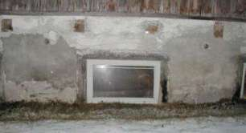
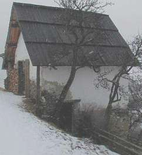

[🠔 Zur Übersicht: Slavisk](slavisk.md)  
# Обман про поднимающуюся влагу
**Фирмы предлагают услуги по борьбе с поднимающейся влажностью, обманывая клиентов о реальных причинах влажности и продавая ненужные решения.**  
_von Konrad Fischer_

И к сожалению не каждый домовладелец способен верно оценить ситуацию и принять правильное решение. Вот здесь и распахиваются широкие врата свободного рынка, с их неисчерпаемыми возможностями. Представители фирм самых новейших технологий, куча экспертов из отрасли химии, специалисты строительных компаний, лазерно-термоядерной физики и космонавтики, помошники-шабашники и т.д. и т.п. предлагают свои услуги по борьбе с поднимающейся влажностью. И далеко не редкость, когда против влажности от солевых отложений доверчивому клиенту втирают что-то о поднимающейся влаге и продают, порой за немалые бабки, свои услуги. Курам на смех! 
И с каких это пор? 

По словам одной фирмы, специализирующейся на осушении сырых помещений, это наглядный пример поднимающейся влажности. По их словам здесь должны были проведены инъекционные работы. При этом стоило осмотреть обратную сторону медали:

 Забитая водосточная труба и водяные брызги от оградительной стены старательно орошают этот угол дома.

---

Похожее можно видеть и в этих случаях: 

А что за углом?:  Всё это не противоречит правилам строительной физики, не объясняется абсурдной "наукой" умников из фирм-"осушителей", а имеет простые ответы и решения без "чудес техники" и без на смарку пущенных денег. Многое можно без особого труда устранить самому. 

Но не с "помощью" закупоривающих ремонтных и [санирных](2sanipuz.md) строительных растворов, препятствующих естественному выходу влаги, минеральных красок (на самом деле жидкий пластик 1-го сорта!) под названием "[дисперсионная" или "силикатная краска](22bausto.md)". Они тоже будут отлупляться и вредят к тому же фундаменту.

Примерная жена владельца удобряет и поливает палисадник, а тем временем подвальные помещения превращаются в фабрику по производству нитрофосфата: 

 Наводнения из смеси воды и канализации соседнего свинарника, которые время от времени заливают подвал, усугубляют эту проблему. И что должна дать хваленая инъекция, так уверенного в успехе продавца-специалиста? Или вот, ещё ближе к фермерским постройкам?:

 Холодная стена зимовника использует свой шанс и с удовольствием принимает тепло-влажный воздух. Результат – насквозь промокшие стены.

 Здесь благодаря процветанию солевых соединений отлетело 20 кв. м. плитки цоколя одного реставрированного архитектурного памятника. Стоит ли предложение по устранению "поднимающейся влаги" 70.000,- Евриков за хи-тек (заказчик, услышав сумму не хи-хикал) из репертуара "осушителей"? Бетонный резак, [ремонтный раствор](2sanipuz.md) и вперёд на мины? Нет конечно: 

 Это не поднимающаяся влага, ни давление грунтовых вод снаружи - это всего лишь классический пример ребят-шабашников не знающих свойств строительных материалов, с которыми они работают. Ясное дело - привести в порядок по гарантии - так что в этот раз повезло!

 А это подвал в лучшем стиле 1939 года. С отлично выполненным в качестве горизонтальной изоляции швом из уплотнительного раствора (уже тогда стоило лишних денег), но он всё же не смог предотвратить подобного облезания стен. 

 По ту сторону тоже нет. Причина в образовании солей, зависимой, конечно же от эксплуатации. Источники быстро найдены и устранены по сходной цене.

А вот несколько курьезных примеров с выставки охраны памятников проходившей в немецком городе Лайпциге в 2004 году: 
кирпичная стена помещенная одной из „осушительных“ фирм в ванну с водой и надпись: „Поднимающаяся влага“: 

 
Смотрите сами: Не везде где написано „Поднимающаяся влага“, она на самом деле существует. 
Даже после 5-дневного замачивания в ванной! 

 
Невероятно, как без особой изощренности, безобидному охраннику исторических памятников архитектуры, 
представителю церкви, грамотному сотруднику стройнадзора, а так же архитектору с хорошим вкусом и даже 
заказчику, вынужденному экономить каждую копейку, навязывается так называемое осушение. Стоит только 
заглянуть в портфолио фирм под заголовком „наши клиенты“ из отраслей горизонтальной изоляции 
или [„ремонтных“ растворов](2sanipuz.md) со списками их жертв. 

 
Так же ничего не видно и у конкурентов: после 5-дневой замочки вода так и не 
проходит за пределы первого шва раствора. Жди хоть до китайской пасхи!

Похожую картину можно наблюдать в известном городе Гамбурге. И здесь находятся специалисты-сказочники, которые верят (и уверяют других, мол, сам видал) в небылицы про эту-такую-сякую „поднимающуюся влагу“. На самом деле, это всего лишь последствия прибоя загаженно-солоноватой воды, приливов и отливов Эльбы и Альстера, а так же недостатки строительного раствора в каменной кладке, гидрофобность и зачастую загрязнения сталактитовых накоплений:

 \+  + + +

В городе Бамберге, что стоит на речке Регниц, есть ратуша с каменным мостом, выстроеным ешё старыми мастерами своего дела, которые перебились и без горизонтальной отсечной герметизации. И тамошний бургомистер не ходет и промокшими ногами: 

Как сказал бы известный кёнигсбергский мыслитель Эмануель Канторович: Не бойся пользоваться собственными глазами! 

Так оглянись же вокруг! Видишь! Любой каменный мост подтвердит, что это везде так! Почему? 
Читай дальше о научной точке зрения:

Выдержки из журнала „bausubstanz“ за 7/98, Конрад Фишер: 
"Дополнительная горизонтальная изоляция стен" ("Nachtraegliche Horizontalabdichtung historischen Mauerwerks") 
(дополненный текст) 

„Значительно для степени промокания материалов является их поглотительная способность, то есть пористость применяемых материалов. Она играет решающую роль при движении влаги в строительных материалах. Движение происходит только из крупных пор в более мелкие (и никогда наоборот).“

 

- так пишет Х. Шмитт в „Строительное конструирование – основы современного строительства“, пятое издание, 1974 г., стр. 34. И это остается действительным для исторической каменной кладки! Ну а как же расположены поры? 

Основание, фундамент и цоколь строений всегда выполнялись из твердых, тоесть плотных, мелкопористых материалов (природный камень, валуны). Связующим элементом был экономно используемый известковый раствор. Зоны без растворной – „сухой“ кладки и переходы из мелкопористых камней к крупнопористому раствору являются нарушителями капиллярного движения. На цоколь ложится каменная или кирпичная кладка внешней стены, как правило, с меньшей плотностью, чем фундамент. Таким образом старыми мастерами возводились стены, которые в соответствии с вышеуказанным учебником, не оставляют поднимающейся влаге никаких шансов. С 19-го века постепенно утрачиваются эти знания, и начинается применение сомнительных изолирующих материалов. 

И не смотря на это, в мелкопористых кирпичах по прежнему не существует достойного упоминания и тем более, поддающегося расчету капиллярно-проводящего транспорта, повышающего водный уровень. Ну а при отсутствии уровня грунтовых вод и тем более. 

Защита помещений от осадков достигалась тем же простым способом: двойная стена, внутренний слой из более крупнопористого материала. Таким образом капиллярный транспорт надежно прирывается как в переходах от раствора к кладке, так и при переходе от внешнего к внутреннему слою. 

Эти знания о капиллярном транспорте используются сегодня для избежания дополнительных работ по горизонтальной герметизации, а так же при разработке и производстве компресс-растворов. Последние должны иметь мелкопористую структуру, которая способствует выводу солевых соединений из старых стен. Похожее можно наблюдать и у [ремонтных (или санирных) растворов](2sanipuz.md) : сначала засаливаются мелкие поры, а только затем (в лучшем случае вообще образовавшиеся) крупные. 

Так откуда же берутся пресловутые повреждения штукатурки цоколя и стен подвальных помещений, вину которым приписывают так называемой „поднимающейся влаге“ (несмотря на отсутствие соответствующего анализа и подтверждения капиллярного транспорта или даже наличия грунтовых вод под фундаментом)? В первую очередь важно устранение источников влаги, если от неё хотят избавится. И это зачастую не требует битком набитый специальными приборами микроавтобус, а так же особо сложных и супер-дорогих мер по их устранению. 

1. Засаливание стен 

Как раньше, так и сегодня существует много видов ущерба посредством засоления фасадов и стен исторических зданий: 

- Будь то дорожная (посыпная) соль или раньше распространенное избавление от экскрементов и прочих нечистот прямо на улице, 

 
_В таких уличных условиях основания домов наверняка не оставались сухими и свободными от селитры!_

- нарастание земляного уровня у стен домов в следствии дорожного строения, 
- повышенное использование отопляемых помещений первого этажа в зимний период (по протоколам врачей 19-го века насчитывалось 
до 15 человек плюс мелкий скот на одно помещение), 
- прочее использование жилых помещений в провинциальных городах а также в рабочих поселениях, 

 
_Хлев в жилом доме это надежный гарант образования соляных следов на стенах,_ 
_в том числе и путем насыщенного солями воздуха_

 
_Хлев на склоне – только в области повышенного засоления из-за постоянного хранения в углу помещения навоза, образовывается сырость и портит штукатурку и стену. Может горизонтальная герметизация здесь повлиять на увлажнение стены или даже остановить ее?_

- защитные помещения во времена воин и бедствий для населения, которое явно не хотело без присмотра оставлять на привязи свою скотину (про послевоенное время и говорить не стоит). Или же 
- использование складов, жилых и церковных помещений под конюшни (например Бамбергский Кафедральный Собор во времена 30-летней Войны) 

К современным источникам вредных солей относятся материалы с содержанием цемента, трасса или силиката, а так же многочисленные инъекционные материалы, частично даже те что „против поднимающейся влажности“. Так же средства против домового грибка содержат солевые соединения, которые должны прерывать водоснабжение и поэтому закупоривают поры.

Если соль попадает в раствор кладки, она сужает его поры и облегчает этим капиллярный транспорт из камня. Но намного важнее есть повышенная водопоглотительная способность солевых соединений. Даже при низкой температуре воздуха соль способна поглощать влагу. Соли переходят при удивительно малом количестве воды растворимое состояние и создают ложное впечатление значительной концентрации влаги в стенах. 

Что должна дать горизонтальная герметизация в засоленной, гигроскопически действующей стене? Дешевле, бережливей к материи, эффективнее, а так же положительней со взгляда охраны памятников архитектуры, является простой метод "жертвующей" штукатурки с помощью специально для этого пригодного раствора.

2. Конденсация 

Основание цоколя постоянно находится в прохладном грунте. Особенно в летнее время года на нём конденсирует огромное количество воды из влажного воздуха. Естественно тоже самое происходит и в наружных стенах, температура которых ниже температуры воздуха. Что даст горизонтальная изоляция против конденсата? 

Эффективные способы борьбы: 
- [Темперирование стен](7tempr.md) против конденсации, а так же в качестве вспомогательной поддержки для осушения помещений, которые иначе длились бы [несколько лет](29bausto.md#cadiergues), 
- [простые окна](23bausto.md) как вспомогательная поверхность для образования конденсата (освобождает внутренние стены от конденсата, надёжно предотвращает возникновение плесени) , 
- постоянное освобождение воздуха от влаги (хорошо подходит для особенно сырых подвальных помещений) 
- использование настенных поверхностных покрытий хорошо переносящих влагу и позволяющие пропускать для временного накопления и последующей отдачи при больших перепадах влажности ((кухня, душ и.т.п.). Не должны применятся капилляроблокирующие полимеры типа дисперсионных красок, красок с содержанием кремнийорганических полимеров (силикон), дисперсионно-силикатные или "[минеральные](22bausto.md#wasserabweisende anstriche)" краски. 

3. Орошение дождеванием 

 
_Так подвергались осадкам стены городка Партэнкирхен в 1838 году, если верить художнику Генриху Бюркельу_. 

Основание стен часто недостаточно защищается навесом кровли от дождевых брызг. Негерметичность желобов и водостоков, а так же недостаточно качественно проложенный и плохо уплотненный тепло- и водопровод (почти стандарт, что закопано - то не видно!) ведут к проникновению воды в стены подвалов. Штукатурка, имеющая контакт с земной поверхностью, так же охотно впитывает в себя воду и соли. И даже неисправные старые трубы могут являться причиной грандиозно намокших стен. Что принесет в этих случаях горизонтальная герметизация? 

Для конструктивного решения подобных проблем требуется компетентность и понимание, как строителей, так и сотрудников Охраны Памятников Архитектуры. Долговечные решения с использованием материалов, не содержащих цемент или трасс (и выполненные со знанием дела), приносят желаемые результаты даже в тех случаях, где потерпели неудачу так называемые [ремонтные и санирные штукатурки](2sanipuz.md). Не в счет конечно, проблемы связанные с засоленностью дорог, недостаточным перекрытием навеса, концентрацией водных стоков у цоколя и.т.д. 

И в заключение: 

В специальной литературе для заинтересованного круга людей часто утверждается, что поднимающаяся влага может быть рассчитана и описана с помощю специальных формул (Хаген-Пуацёль <Hagen-Poiseulle>, Грюн <Gruen>, Майер/Витман <Mayer/Wittmann>) для однородных материалов в стационарных условиях. На строительных объектах поднимающаяся влага не доказуема. Залитый в лабораторных условиях водой пористый бетон, промокшие у основания стены, сырые погреба, отложения с убывающим содержанием соли и влажности снаружи-внутрь и/или снизу-вверх стен - всё это не служит доказательством наличия поднимающейся влаги в исторических сооружениях. 

 
_Насквозь промокшие, пороги внутренних стен с отваливающимися кусками материала_ 
_это ещё не доказательство поднимающейся из погреба влаги!_

 
_То же относится к разрастающемуся грибку домашней плесени под каменной плиткой первого этажа_

 
_И к стелящемуся несмотря на выжигание ковра плесени в подвале_

 
_А так же разрастание грибка на полу погребного помещения не доказывает наличия поднимающейся влаги из почвы в пол_

 
_Как в прочем сырость и плесень внутри церковного органа. Немного знания дела и компетентности - и можно_ 
_экономить на герметизации пола и тем более на "утеплении" с помощью "изоляционных" материалов_. 

Научно-практические исследования доказывают, что образование солей и конденсата оказывают решающее влияние на промокание стен (смотри монастырь Маульборн, ежегодный исследовательский доклад 315, Карлсруэ, Издательство Эрнст унд Зон). Инъекционные материалы для горизонтальной изоляции и без того горячо "оспариваются" в кругу экспертов. Именно во влажные и засоленные стены они внедряются не надежно (сравни Венцмер „Защитные строительные материалы“, Строительное Издательство, Берлин 1997 г.) и приносят в большинстве случаев бессмысленное разрушение объектов. 

С помощью дорогих, дополнительно внедренных горизонтальных изоляций, зданию наносится огромный ущерб: сверление и прорезы, внедрение и инъекция сомнительных химикатов (не в счет применение "волшебных" сундучков: западной мафии удалось купить даже [Российский Музей](http://www.atlant.ru/stroy/lib/agr16/art2914/)). Это опустошает кошелек заказчика или общественную казну, кроме того, препятствует финансированию рациональных восстановительных работ. Выгоду приносят подобные изоляции изготовителям, поставщикам, внедрителям в прямом и переносном смысле, а так же экспертам и консультантам. Толпы простодушных чиновников, духовных представителей и других ответственных лиц опустошают доверенные им кассы, легко инфицированные болезнью "осушения". И с какими выводами и последствиями? Продолжать в том же духе и выкидывать деньги на ветер? Или не так? 

И без дополнительного оснащения горизонтальным барьером можно качественно и экономно проводить ремонт сырых стен. 

 
_Даже этих!_

**Вернемся к традициям строительных мастеров и здравому уму!**

А в большинстве случаев все наоборот. Речь идет о удивительно распространенном заблуждении "поднимающейся влаге" (наряду с сумасбродством, что "изоляционные" материалы утепляют здания) в строительной отрасли: среди заказчиков, непрофессионалов, "сведующих" консультантов, стройработников, даже архитекторов и юристов. Вместо целенаправленного ремонта прибегают к мероприятиям, которые набивают бездонные карманы неверных проектировщиков, шустрых представителей строительных компаний, а затем лаборантов-исследователей констатирующих размах катастрофы. При этом напрасный труд выдается за знание дела по "осушению" стен, этажей, подвальных помещений и т.д. и т.п. 

Хорошо срабатывает тюк с доверчивым заказчиком (особенно когда дело касается общественных средств), которому сначала старательно ездят по ушам о различных возможностях и методах "осушения", потом его загружают таблицами под ионно-слоеным-соусом распечатанным на шикарной глянцевой бумаге. И в заключение строят из себя экспертов и хают (пусть даже поделом) таких-сяких сторонников "волшебных" коробочек с их электро-физическими методами. Но при этом ни одним словом не упоминая действительные причины и капиллярный эффект. Зато советуется (чтоб уж наверняка и намертво) использовать сразу двойные методы с соответствующей стоимостью. Заверяется все это дело навороченным анализом с толстыми рукописями, разъясняющими графиками и ничего не говорящими иллюстрациями, и, пользуясь замешательством заказчика, ему предоставляются результаты с заранее ясным "диагнозом" и уже готовую для подписки "терапию": резак для стен, жесть, ремонтный раствор. Ну, пожалуй, ещё сверление, всевозможные "осушители" и инъекционная бурда. Шарлатанство с такими накрученными псевдо-научными аргументами легко убеждает даже сотрудников строительного надзора. От научной терминологии вроде "эффлорисценсия", бесконечных ионоов-плюс и ионов-минус, глауберитов и т.п., к сожалению, падает всякий клиент на колени. Как же, эксперт то знает что говорит. Свят-свят-свят!.. 

 
_Что это?_ 
_Поднимающаяся, снисходящая, вы-, пре-, при-, или заходящая влага?_

Введение в тему здесь: [Загадка для капиллярологов](21bausto.md#kapillar)

Для начала исследуется и анализируется в пользу заранее намеченного результата, по возможности обширно, в конце-концов надо же показать свою серьёзность - посредством проделанного объема "работы" это легко удается. При этом составляются таблицы с таким количеством солей, что начинает рябить в глазах. На этих основаниях навязывается и дается добро на вторжение в наличные сооружения (сверление, врезы, заливка различной химией и другие уничтожительные работы). Следующим этапом (что подтверждает бездействия первичных работ!) объявляется о "целесообразном" (при засолении необходимым) использовании "соответствующих" мер ([ремонтный раствор](2sanipuz.md), [водоотталкивающая наружная обработка](29bausto.md#wasserabweisung/hydrophobierung)). Вобщем наряду с изрешечением (изрешечиванием?) стен с заливанием химической кашей, продаются многочисленные кв. метры дорогого [санирного раствора](2sanipuz.md). Это чтобы безрезультатность супер-продвинутых методов не сразу бросалась в глаза. 

Конечно, существует много "предпринимателей" с их сногсшибательными предложениями типа "единственное в своем роде предложение нашей фирмы", "осушение стен вашего дома с помощью системы XY", "сухие стены благодаря фирме XY", "с применением запатентированого метода XY", так же напичканные более или менее толстыми приложениями, расхваливающие с "научной" точки зрения той иной вундэр-продукт. Встречаются даже восклицания о гарантии возврата денег. Эти полностью отказываются от каких-либо исследований и с ходу пытаются произвести впечатление беспощадной борьбы с поднимающейся влагой. Это подкрепляется уловкой "влажность-до-и-после" якобы "доказывающей" успех, при этом контрольные измерения проводятся почему-то сначала летом, а затем, предпочтительно, в более сухое время года (само лучше в январе). Или вот классный трюк, который снова и снова практикуется: сначала экстремально занижаются расценки, а после путем давления "ну и в этом месте нужно бы что-то предпринять", "было бы не плохо (или даже необходимо, т.к. после вскрытия обнаружены следующие недостатки..) применить метод XY" из заказчика вымогаются все большие суммы. 

В действие идут всевозможные технологии и методы. У доверчивого заказчика, интересы которого все чаще очень плохо защищают домоуправление или строй отдел, денег же куры не клюют! В немецком журнале "Bautenschutz+Bausanierung (Защита и реставрация строительных сооружений)" номер 7/2001, авторы статьи "Защита от сырости, вопрос совести" был поднят основной вопрос - применимы ли электоро-осмосные методы для устранения влаги? инженеры физических наук К.-М. Мёве, О. Бахрамов; инженер химических наук А. Детман; кандидат наук, проф. Х. Венцмер (все от Дальберг-Института г. Висмар) после соответствующих исследований пришли к следующему заключению, касающегося наиболее распространенных электро-осмосных методов: "электро-осмосные методы, работающие только с малыми напряжениями и относительно большими расстояниями между электродами, не могут принести пригодных результатов". При проведении тестов стало очевидным, что этими способами не может производиться существенный отвод влаги через капиллярные системы строительных сооружений. Жаль [тех кто попался на этот крючок](http://www.atlant.ru/stroy/lib/agr16/art2914/). Так же тех, кто проводит вскрытие грунта, изолирует, уплотяет и утепляет наружные стены, с последующим наложением ремонтного раствора внутри, хотя в действительности причина, к примеру, в конденсате или незначительных солевых отложениях на холодных стенах подземельных помещений. Так просто и без всякой пользы зарывается (часто в прямом и переносном смысле слова) куча денег. Ах, как было бы хорошо высушить источники дохода всех так называемых "специалистов по осушению", сколько сколько налогов для государственной казны можно бы было сэкономить! То, что частные инвесторы выкидывают их деньги на ветер - это их дело, каждый сам себе голова. 

Передовиками в этой области являются неуверенные (без важных профессиональных знаний) проектировщики, плановики, прорабы. Они являются наглядным примером легко поддающихся презентам и нашептываниям продажных шарлатанов. Надень любому придурку, с более-менее подвешенным языком, красивый галстук - вот тебе и готов мессия обращающий таких архитекторов и инженеров-строителей. К тому же с повышением стоимости строительства, повышается и их гонорар (без малейших затрат на дополнительное планирование). Эксперты охотно прячутся за далеко не безупречными и идеальными нормами DIN-а и ГОСТА, стреляя из пушек по воробьям, дырявя стены исторических зданий, а с ними и портмоне заказчика. Не делается только одно: смотреть в корень, искать действительную причину наличия влаги и солевых отложений с целью смягчения их последствий либо полного избавления от них. Особенно рискованно прислушиваться к советам консультантов-экспертов, которые упоминают (пусть даже как одну из возможных причин) в строительной практике практически не существующей поднимающейся влаги. Так могут легко возникнуть сумасбродные меры, не приносящие желаемых результатов. 

Совет: 
Если Вы попали на такие обещания избавить здание от влаги, после проведенных работ вновь измерить влажность стен, но обязательно при тех же погодных условиях, как и в первый раз (температура и влажность воздуха). Не пугайтесь значительно большей влажности [ремонтного раствора](2sanipuz.md) или [санирующей штукатурки](2sanipuz.md). После проведенных работ, показания будут те же, что и до них. И что теперь, регресс? 

Серьезный эксперт при наличии сырых стен сразу скажет: "поднимающаяся влага по техническим причинам это быть не может, давайте искать причину там, где её действительно можно найти (давление грунтовых вод, засоления гигроскопично-влажных стен, конденсат тепло-влажного воздуха на холодных строительных элементах, дождевая негерметичность), а затем найдем подходящее решение с минимальными затратами финансов и времени. Толстые протоколы и дорогие исследования для этого не нужны, в большинстве случаях хватает здравого ума (хоть это сегодня и строго запрещается)." 

К сожаленью такое встречается довольно редко. И поэтому не стоит удивляться, что после советов и многолетнего внедрения "химического" оружия со стороны индустрии всё дело идет на смарку:

 Средневековый подвал кирпичного здания после "осушения" с помощью горизонтальной изоляции, запорного раствора, наложения наружного изоляционного слоя и обработки наружных поверхностей "санирными" стройматериалами. Тёмные пятна подчеркивают пораженные солями места и наличие концентрации конденсата на полу и стенах в следствии применения кремнекислотной инъекции, запорного раствора, обработки отмученным мелом и др. продуктов стоительно-химической отрасли. Согласно анализу, выявлены следующие соли: эттрингит (сильно разростающийся минерал), калийная селитра, гипс, едкий натр, карбонат натрия ... 

Остальные поверхности помещений (полы, стены, своды и колонны) так же сильно пострадали от солей и крошатся. 

 В местах проведенных инъекций, а так же под ними разрастаются длинные бороды солей. Кирпичные стены подвалов крошатся, шелушатся и осыпаются. Полное разрушение исторической архитектуры. Здесь постарались химические супы. 
 Пилон в проходе распадается по частям. Подрывы солей уже десятками дециметров выломали куски углов. 
 Под так называемой "горизонтальной изоляцией" прорастают большие чумаобразные нарастания с подобными стенам шелушениями. 

Всё это произошло уже после нескольких лет после "ремонта". Фирмы выполнявшей работы больше не существует, архитектора и след простыл. Требуется время на то чтобы метровые стены, закупоренные и залитые всяческой бурдой, накопили в себе столько воды из влажного воздуха. И пошла реакция солевых соединений наличных материалов с продуктами нашей прославленной химической промышленности (я воздержусь от опубликования цитат из текстов условий по конкурсу выполняемых работ) бурно разрастающихся на стенах этого здания. 

 
Вот ещё один любимый экспонат "осушителей" представляемый на Выставке охраны памятников архитектуры в 2004 году. 
Нет лучше поприща для экспериментов, чем сырые стены. Вот и резвятся исходя на нет, благодаря готовым к любым 
экспериментам проектировщиков-экспериментаторов, чиновников и заказчиков. 

Правильней нужно бы было принять, к примеру, следующие меры: 

1. Повышение уровня температуры на подверженных опасности конденсации поверхностей с помощью[ темперирования наружных стен](7tempr.md). 

2. При необходимости очищение ("всухую"!) стен от солевых отложений. 

3. При наличии большого содержания соли в стенах, перемещение кристаллизационого фронта в слои пожертвующей штукатурки, не содержащей цемент или трасс (тоесть бедной солями). По потребности - замена раствора с предварительной реставрацией швов кладки. 

Ни в коем случае не применять строительные растворы с содержанием цемента, способствующие интенсивному росту минералов и ответственных в большей степени в образовании солей! Ремонтный раствор означает "Да" образованию растущих минералов, "Да" - повышенной прочности и соответственно напряжению при тепловом расширении (ведущих к отслоениям и отшелушиваниям поверхностей), а так же "Да" солевой блокаде, предотвращающей естественное высыхание под слоем штукатурки.

4. В случае необходимости также отказ от различных покрытий и битумных мастик для вертикального уплотнения снаружи. В большинстве случаях они всё равно не приносят толку. Попробуйте долговременно уплотнить историческую стену с потрескавшейся поверхностью в переходе фундамента к основанию стены подобным мазутом черного цвета, согласно стандартам DIN-а или ГОСТ-а – успехов и попутного вам ветра! И запасайтесь терпением для высыхания грунтового раствора. Также работа участками при предписанном земельном образовании береговых террас в котлованных могут стать настоящим кошмаром. 

Альтернатива: к примеру, ремонт при необходимости неисправного трубопровода и контролируемый отвод проникающей с поверхности воды. В крайнем случае "уплотнение" глиной. Недорого, опробовано с древних времён, надежно, длительно остается герметичным, минимальные остатки влаги строительство с поверхностями из известковой штукатурки может хорошо переносить и отдавать в воздух. Особенно плотные глины не пропускает даже самые ядовитые сточные воды. "Коричневые ванны" с покрытием бентонита являются самой надежной защитой против воды в легко проницаемой земле берлинских подземных помещениях и подвалах и служат даже водной преградой у строительных котлованов! В местах стыков белых ванн бентонит даже используется как уплотнитель. 

Важно: 
- квалифицированная оценка и выбор глины. Она должна позволять себя уплотнять на фактор проницаемости, по меншей мере до kf 10-10. Для этого глиняный материал не должен иметь повышенную влажность. 
- Правильная техника уплотнения с грамотной планировкой и формированием ландшафта для предотвращения стока к сооружению. Иначе все полностью зальет. 

С технической и экономической точки зрения интересно, что все эти уплотнения можно добиться индивидуально оптимизированными смесями (никаких трещин из-за усадки, усыхания рецептуры, хорошее прилегание к неровным поверхностям, порой достаточно лишь 20 см толщины, никаких подготовительных работ касающихся выравнивания грунтовой поверхности, простое стыкование вертикальных и горизонтальных участков). 

Много полезной информации по этой теме можно найти на странице коллеги Матиаса Буманна: [DIMaGB.de](http://www.dimagb.de/info/bautec/bwa01.html) - в отделе: Bauwerksabdichtungen. Компетентная консультация по земляным работам и технике „Коричневых ванн“. А [здесь](http://www.ele-e.de/) практически ведущая научно-исследовательная лаборатория: [Землестроительная лаборатория города Эссен ELE](http://www.ele-e.de/)

НО: Если нарушаются условия обработки и в жижу котлованов небрежно пихают эту глину без замены мокрого грунта, не достаточно уплотняя со связующим глинистым грунтом ни дно котлована, ни вокруг сооружения, используя не достаточно стойкие против надломов стройматериалы (трубы, световые шахты подвалов), которые при уплотнении легко трескаются и теряют свою герметичность, так как не были предварительно защищены соответствующей конструкцией, в не накрываемые на время дождя траншеи трасс, или может по старой привычке продырявив только что закопанные трубы (да, да – всё испытал на своем веку!) – тогда извините и самая глиняная глина не поможет. Она не является чудодейственным средством и не удается автоматом каждому дилетанту. Уплотняющие работы всегда были и остаются квалифицированным трудом и требуют опыта, разумного обращения и преданности делу, даже если речь идет только о "глине". 

5. Никаких инъекций химической кашей, откладывающей соли (каким вообще образом они должны проникать в наполненные соленой водой поры? Ах, да, как же, в последнее время имеются специальные методы по высушению и испарению! Особенно дорогие против не существующей поднимающейся влажности, охотно купленных против ни в коем случае не изменяемых гигроскопичные накопления существующих в кладке солей); никакого дополнительного горизонтального заграждения прочих натур. 

6. И не надо верить ни услужливому агенту, распространяющему свою заразу, ни дешевому проектировщику с опытом равному нуль, зато с толпой прямых или косвенных спонсоров за своей спиной. 

---

Дополнения из: 

1. Исследовательского отчета „Дальберг Института Диагностики и Восстановления Исторических Сооружений“ в научно-исследовательском центре города Висмар, можно перечитать в публикации заседания 9. Сессии реставраторов на тему „Ремонтные штукатурки“, Кюлюнгсборн, 1998 год, издательство строительного дела, Берлин: 

_" В настоящее время имеются критические замечания к существованию " восходящей влажности " [...]с полным основанием указывается, что, прежде всего в исторических сооружениях прием влаги из воздуха преобладает над подземным, так как высокая концентрация растворимых солей играют доминантную роль._ 
_Эта проблематика является немаловажной и должна далее обсуждаться, а именно уже просто поэтому, чтобы применение методов осушения с дополнительным вмонтированием горизонтальных уплотнений не переоценивалось. "_ 
_(Venzmer, Lesnych, Kots: Опытные модели исследования при осушении ремонтных штукатурок на кирпичной кладке)_

2. Исследовательского отчета [Fraunhofer-Institut fuer Bauphysik IBP Institutsteil Holzkirchen](http://www.hoki.ibp.fhg.de),можно перечитать в публикации: Эльке Нюрмбергер: „Строительное исследование, лаборатория под свободным небом, Фрауэнхоффер-Институт строительной физики IBP – самое большое во всем мире учреждение опытов под открытым небом“, Журнал „Arconis“ за 1/99: 

_" Поднимающаяся влажность: этот диагноз часто не правилен, так как сопротивление перехода между различными материалами очень высоко, например строительного раствора и кирпича. Поэтому высота подъема является при кирпичной кладке примерно 20 см, при кладке бутового камня она может быть несколько больше."_

3. Хельмут Кюнцель: „Строительная физика – история в рассказах. Восходящая влажность: большой вопросительный знак!“ в журнале „ARCONIS“ за 4/02:

_" [...] Уже десятилетия вплоть до недалекого прошлого различными учреждениями проводились лабораторные испытания на стенных пробах, которые были помещенны в водяную баню, чтобы количественно охватить восходящую влажность. Во всех случаях были установлены только увлажнения на высоту не более 2-3 кирпичей. Это вовсе не совпадает с опытом из практики с картинами увлажнения целых этажей. [...] Объяснение: водопоглощение кладки из камня (кирпича) и строительного раствора зависит в первую очередь от переходного сопротивления между камнем (кирпичом) и строительным раствором и далее строительным раствором и следующим камнем. Поэтому представление, что кладка из хорошо впитывающего влагу кирпича и хорошо впитывающего влагу известкового раствора, якобы также хорошо впитывает влагу – неверно и должно быть исправлено. Хотя известковый строительный раствор при непосредственном контакте очень хорошо принимает воду, однако из-за высокого переходного сопротивления, водопоглощение из влажного кирпича в раствор гораздо меньше. И так продолжается от слоя к слою. [...]_

_Итог: восходящая влажность встречается на практике не настолько часто как её диагностицируют и применяя невероятнейшие мероприятия „борятся“ против неё. Настоящие причины вреда от влаги на практике нужно приписывать в первую очередь солям в кладке (напр. стенная селитра) и летней конденсации. [...] Поэтому, собственно и не нужен дополнительный горизонтальный (отсечный) слой в фундаменте. [...]_

_До сих пор такого рода убытки от влаги в старых зданиях связывались с тем, что только примерно с 1900 стали использовать горизонтальную изоляцию под кладкой стен и что поэтому "восходящая влажность" у более поздних строениях больше не выступила. Но также с этой датой можно связывать и улучшение гигиены окружающей среды. [...] Для этого требуется только один с технической точки зрения признанный специалист, который, однако, не был знаком с проблемами гигроскопии и влияния солей, чтобы выдвинуть гипотезу горизонтальных изоляций. Так она и переренималась другими кругами специалистов. Такие ошибочные приговоры могут иметь долгую жизнь, как мы видим из опытов „дышащих стен“._

_Надлежало бы после представленных условий вычеркнуть это сомнительное понятие "Осушать" из строительно-физического словаря. Необходимые в описанных случаях мероприятия по ремонту не имеют с ним ничего общего."_

а так же 

Сообщение IBP 337, 25 (1998) „Новые результаты исследования, коротко сформулированы Х. Кюнцельем, Причины повреждения старых зданий: поднимающаяся влага, гигроскопичная влага или талая вода?“ 

**_[...]Поднимающаяся влага_** 
_Поднимающаяся влага обсуждается в сочетании с вспомогательными мероприятиями (такими как дренаж, горизонтальная отсечная изоляция или инъекцированые стены) гораздо чаще чем она встречается на практике. Наружные стены замков окруженные рвами с водой или стены причалов, с непосредственным контактом с водой, намокают максимально до второго или третьего камня. Это соответствует и результатами, добытыми в прошлом в различных исследовательских институтах [иллюстрированная ссылка]. В то время как в сплошном слое строительного раствора или штукатурки можно наблюдать большую высоту подъема, она очень незначительна в каменной кладке и кончается уже примерно после 20 см. Причиной того является большое переходное сопротивление между различными материалами как кирпич и строительный раствор. Поэтому восходящую влажность нужно ожидать в кирпичной кладке до высоты около 20 см, а при кладке бутового камня с большим использованием строительного раствора несколько выше._ 
__

**_Гигроскопичная влажность (стенная селитра)_** 
_При более высоких очевидных увлажнениях стен (от нескольких дециметров и до высоты всего этажа) причиной тому является, как правило, гигроскопичная соль. Чем больше содержание соли, тем больше накопления влаги, которая откладывается в штукатурке фасада или каменной кладке за счет поглощения влаги из влажного наружного воздуха. [...] Так как улучшение городской гигиены происходило на рубеже 19. и 20 столетий, совпадающее с внедрением горизонтальных изоляций зданий, которой ошибочно и приписали очевидный спад стенной влажности. [...] "_

4. Публикация Баварского Баутэншуц-Фахпланунг (Планирование и защита строительных сооружений), специализация в области „Силоксаны“, Wacker Chemie, отдел Байплан, Мюнхен, можно перечесть в журнале Баусубстанц 04/99, статья Хельмута Вебера „Избежание ошибок, системы ремонтных штукатурок при долговременном применении и затрудненных условиях“: 

_" В последних десятилетиях пытались всё снова и снова длительно устранять влажно-обусловленный ущерб каменной кладки и штукатурки методом дополнительного внесения горизонтальной и вертикальной изоляции._ 
_При этом каждый раз приходилось констатировать, что это возможно только условно, потому что - как сегодня общеизвестно - многие из очевидных повреждений нужно приписывать в первую очередь влиянию солей на внутреннюю и поверхностную влажность стен. Они растворившись в воде, проходят через стены и откладываются в наиболее благоприятных для испарения областях. Затем они ведут к механическим разрушениям путем кристаллизации и к повышению влажности, благодаря гигроскопичным эффектам._

_Это гигроскопичное поглощение воды неблагоприятно влияет на стены. "_

И в заключение: 

Так как представители [ремонтных](2sanipuz.md) ([санирных](2sanipuz.md)) растворов и их "памятки" также охотно предлагают к химическим супам для впрыскивания еще и свои продукты в качестве "дополнительных мер", а инженер и кандидат наук Хельмут Кюнцель даже как единственно-достаточное мероприятие, я рекомендую критически смотреть на это чудо-оружие в борьбе со влагой, и предлагаю взглянуть на следующую картинку этого чудесно [отлупляющегосясанирного раствора](2sanipuz.md). 
И будет сказано всем экшпертам-консультантам идущим торговать вразнос, нахваливая или проклиная те или иные способы осушения, не упоминая при этом приведенных здесь аргументов против бесполезных и бессмысленных попыток: когда-нибудь вам это вылезет боком и ваша репутация лопнет, как мыльный пузырь. 

Добавка: 

К историческому плану о засолении сооружений автор Отто Крэц пишет в выходном выпуске „Зюддойче Цайтунг“ за 10.11.01 (стр. 1): 

„технолог Ф. Кнапп радикально описывает в 1847 повсюду образовавшуюся при тогдашних гигиеничных условиях селитру: 

" В сильно населенных городах на тесных улицах, где экскременты животных, отбросы и отходы от мясников и рынков, где продаются мясо, домашняя птица, рыба и другие пищевые продукты, а также помои из домов и многие другие жидкообразные гадости смешиваются с содержанием водосточных желобов, тухнут и загнивают в постоянной гнили, видно, как штукатурка строительных построек в основании наружных стен прогрызется и постепенно покрывается подобными снегу, белыми, кристаллическими выцветами селитры. " 

Еще в 18 веке баварская армия использовала для производства пороха особенно обильную стенную селитру омываемых навозной жижей и в большинстве случаев деревенских домов, не имеющих подвалов. Делегаты „комиссии по сбору селитры“ под охраной солдат нападали в рассвете на беззащитные усадьбы, вырывали полы и соскабливали селитру. Крестьяне, которым это вовсе не нравилось, добились при поддержке церкви того, что по крайней мере та часть дома, которая являлась гостиной и служила религиозному благоговению, оставалась нетронутой. Наглядным и обильным расположением домашних алтарей, святых картин и украшением углов поклонения Господу Богу, можно было противостоять „комиссии по сбору селитры“. Это хитрость и находчивость баварских сельских жителей и по сегодняшний день сохранила славу глубокой набожности.“ 

Примерно так это могло выглядеть:

 . 
Обрати внимание, как отдельные пятна соли насмехаются над гипотезой поверхностной поднимающейся влаги 

А вот еще, подходящие по теме выше указанной критики к злоупотреблениям норм, выдержки по замечательно критической статье Дитриха Хинца из журнала „ARCONIS“ номер 01/2002, „Полиэтиленовые прослойки в конструкциях пола при наземной влажности“: 

_" [...] Во многих детальных чертежах указываются – так же применяемые на практике – П(оли)Э(тилен)-пленки без дополнительных уплотнителей (под бетонными плитами подвала). Но если не применяются никакие дополнительные уплотнители (согласно. Германскому промышленному стандарту 18195-4:2000-08 / 1.4/цифра 6.2.1), то тысячи кв.м. зданий строятся в несоответствии этим правилам, так как каменные плиты не уплотнены против наземной влажности согласно нормам. Тем не менее, эти конструкции не должны считаться в принудительном порядке неполноценными._

_Это понятие неполноценности, которое при правильном исполнении ссылается исключительно на нарушение общепризнанных правил техники, всё больше подвергается критике._

_Если бы новая формулировка норм содержала все необходимое для защиты от ущерба и убытков из за водных нагрузок, что на данный момент считалось технически правильным и испытаным на практике, то вся республика должна была бы быть снесена и возведена заново из-за недостаточно эффективного уплотнения. А так как это не является действительностью, должен быть поставлен вопрос, почему множество зданий с единственным разделяющим нижним слоем из ПЭ-пленкок и без дополнительных уплотнителей остаются без неприятных последствий._

_К сожалению, известны также много экспертизных заключений, которые объявляли застройки в несоответствии строительным стандартам, лишь из-за отсутствия соответствующего DIN-у уплотнения битумом, рубероидом или дорогими изолирующими материалами. Для таких экспертов это положение вещей значило, что они не должны предпринимать никаких следующих усилий, для выявления настоящих причин приводящих к убыткам._

_Предприниматель осуждался только по этой причине без ограничений на устранение недостатка. Поэтому множество каменных плит должны были бессмысленно вырываться и укладываться заново. Пропорциональность устранения недостатка вопреки высоким издержкам обосновывалась тем, что якобы только снос и возведение вновь с нормовым уплотнением ведут к успеху._

_[Далее выполняется то, что по нормам предположенные водные нагрузки не должны существовать вовсе или не должны существовать в обязательном порядке, что из этого требуется обязательное их выполнение]_

_Итог: [...]_

_- Многократно выраженное подозрение, что лоббисты фальсифицируют отдельные высказывания DIN-а (Немецкий Промышленный Стандарт), к сожалению нельзя отрицать также и в этом случае. Необходимость норм по DIN-у 18 195, обременённые чрезмерными расходами, должна быть критически проверенна. К общепризнанным правилам техники эти нормы, пожалуй, не могут считаться."_

Как верно! Такие влюбленные в норму слабоумные эксперты мне даже лично знакомы. Адрес по запросу. И еще: После всех этих цитат, надеюсь становится ясно, что "горизонтальная отсечная изоляция против поднимающейся влаги" также включая "дополнительные работы [ремонтной или санирной](2sanipuz.md) штукатуркой" уже давно не могут относится к "общепризнанным правилам техники". Прежде всего, благодаря практике, исследованию и науке, в частности Институтам Ваккер и Фрауэнхофэр, а так же Висмарскому Университету. 

---

Темы: Счет. Счет. Здание финансирование. Архитектура. Инженер-строитель. Здание стоит. Оценка. Фонд поднимающий. Физика. Химия. Реклама. Энергия спасают. Консультант энергии. Энергия Консультируются. Паспорт энергии. Структура. Проложите. Работа фасада.Структурное повреждение. Ноу-хау. Крыша. Потолок. Влажность. Взнос. Здоровье. Исправляя. Нагревание стоит. Энергия стоит.работают. Кирпич проложение работает. Внешняя и внутренняя изоляция. Недвижимость. Проверьте изоляцию крыши. Пассивный дом. Низкий дом энергии. Здания. Изготовление исследования. Инвентаризация. Работа древесины. Цвет. Соприкосновение. Покрытие. Естественный камень. Окрашивать работу. Церковь. Известь. Знание. Затраты. Взяточничество. Цена. Дотация. Поддержка. Дотации. Гранты. Планировка стоит. Планировщик. Список исполнения. Кладка. Огонь. Повреждение огня. Каменное восстановление. Восстановление кладки. Каменщик. Консервация и сохранение древних памятников. Естественное каменное восстановление. Планировка взнос. Шаблоны. Конкретное восстановление. Подкрепленный конкретный. Тенденция. Ремонт. Восстановите. Пожарная охрана. Восстанавливая. Восстановите. Ремонт. Страховка. Размещение приказов. Стена. Пол. Живой. Квартира. Цемент. Кирпич. Кирпич кладка. Концепция консервации. Памятник контора. Замок. Торговецr дом. Дача. Конструктор. Ратуша.Вода. Дворец. Замки. Основание. Окно. Стена нагревание. Под отоплением через пол. Центральное отопление. Вода. Воздух. Воздух смачивают. Архитектурная контора. Планировка контора. Техника контора. Технология. Часовня. Аббатство. Летняя резиденция. Шаблоны. атакуют. Атака водоросли. Червь дерева. Бурав дерева. Сосна Скучный трамбует. трамбуют. Коза. Предохранение дерева. Высушите гниение. Коричневый подвал Белая пора sponge. Известь Восстановление. Ремонт. рамки-дом восстановление. покупают. продают. планируют. строят. обновляют. перестраивают. изолируют. сдерживают. экономят. дешево. малозатратно. недорого. благоприятно. бесплатно. безвозмездно. Сельское культурное наследие и так далее. Расчет. Финансирование строительства. Старый дом. Оздоровление. Архитектор. Архитектура. чинят. Объявление. Энергию экономят. Энерго-консультанты экономят. Энерго-совещание. Энерго-паспорт. Строительство. Строительный фонд. Информация. Строениям. Инженер-строитель. Строительная коррупция. Затраты на строительство. Строительная халтура. Строительная физика. Работа окраски. Оздоровление фасадов. Работа фасадов. Кровельщик. Кровельные работы. Строительное оздоровление. Убыток в области строительства. Стройматериал. Стройматериалы. Убытки в области строительства. Ноу-хау. Бетон. Крыша. Обеспечение. Влажность. Сырость. Мокро. Отопление. Гонорар. Производственный каталог. Кладка. Пожар. Убыток от пожара. Каменное оздоровление. Реставрация кладки. Убыток от пожара. Оздоровление убытка от пожара. Каменщик. Охрана исторических памятников. Реставрация природного камня. Гонорар планирования. Обновляют. Обновление. Ремонт. Ремонт. Реставрируют. Пожарная охрана. Реставрация. Оздоровляют. Оздоровление. Плесень. Плесневой грибок. Бетонное оздоровление. Железобетон. Temperierung. Страхование. Предоставление заказа. Строительное страхование. Страхование от огня. Страхование от огня. Стена. Палубы. Земля. Пол. Стена. Воздушная влажность. Архитектурное бюро. Офис планирования. Инженерное бюро. Техника. Статика. Планирование несущей поверхности. Несущая поверхность. Капелла. Монастырь. Аббатство. загородный замок плесень. Плесневой грибок. Поражение плесневого грибка. Водоросли. Поражение водорослей. Дровосек домовый. Точильщик. Защита древесины. Настоящий домовый гриб. Коричневая губка подвала. Белая губка пор. Известковый раствор. Известковая краска. Фахверк. Фахверковый дом. Фахверковая реставрация. Фахверковое оздоровление. Фахверковый ремонт. Оздоровление фахверкового дома. Культурное наследие дорого. Завышает цену. повреждено. в поврежденном состоянии. мокро. сухо. сохнут. влажные как стена. и т. д. расчет финансирование старого дома физику старого дома реконструкцию старых зданий архитектора архитектуру чинят объявление энергию энерго-консультанты экономят экономят энерго-совещание энерго-консультанта Энергиаусвайса Энергипасса строительство строительный состав информацию строениям финансирование строительства инженера-строителя Баукорруптиона затраты на строительство строительную халтуру строительную физику работу окраски оздоровление фасадов работу фасадов кровельщика кровельные работы строительное оздоровление убыток в области строительства информацию стройматериал стройматериалы убытки в области строительства ноу-хау бетон крышу обеспечение влажность
