[🠔 Zur Übersicht: Altbau Restaurierung](20bausto.md)  
# Stahlbeton und Zement – Jahrhundertbaustoff oder Sanierungsfalle?
**Eine kritische Analyse der Langzeitbeständigkeit von Beton. Erfahren Sie, warum der einstige „Spitzenbaustoff“ oft vorzeitig versagt und welche Probleme Zement in der Denkmalpflege und im Wohnungsbau verursacht.**  
_von Konrad Fischer_

## Der Stahlbeton und der Zement 1

Inhaltsverzeichnis der Betonkapitel 

> [!abstract]+ Kapitelübersicht: Stahlbeton  
> 1. **Stahlbeton und Zement – Jahrhundertbaustoff oder Sanierungsfalle?**
> 2. [Betonschäden durch schlechte Baustoffqualität](2beton02.md)
> 3. [Baustoff und Baupfusch für eine Sklavenhaltergesellschaft?](2beton03.md)
> 4. [Macht Betonieren krank? Folgen moderner Bauweise](2beton04.md)
> 5. [Betonbau als Sakralbauweise? – Zwischen Kult und Bauschaden](2beton05.md)
> 6. [Betonsanieren und die Zementberatung](2beton06.md)
> 7. [Balkonien](2beton07.md)
> 8. [Sichtbeton!](2beton08.md)
> 9. [Bauschäden an Betonfassaden und sonstigen Betonbauteilen - Literatur](2beton09.md)
> 10. [Stahlbeton an Brücken](2beton10.md)
> 11. [Architekturphantasien aus Stahlbeton - Der Turmbau von Babel](2beton11.md)
> 12. [Materialtücke Beton: Wenn die Bauchemie zur Zeitbombe wird](2beton12.md)
> 13. [Stahlbeton und Krebsalarm](2beton13.md)
> 14. [Die Stahlbeton-Merksätze](2beton14.md)
> 15. [Zement: Der schmutzige Mythos vom sauberen Baustoff](2beton15.md)
> 16. [Zement – Ein unreiner Baustoff?](2beton16.md)

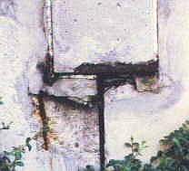 
Preisgekrönte Architektur: 
Olympiazentrum München, zigfaches Stahlbeton-Fassadendetail nach 10 Jahren 
Foto: K. Fischer 

[www.arminwitt.de/schreck.html](http://www.arminwitt.de/schreck.html) - Zu Brückenbauschäden mit Katastrophenbeton

[Betondecke mit Eisen - Pro&Kontra zu dieser Seite im Haustechnikdialog](http://www.haustechnikdialog.de/forum.asp?thema=69615) - Viel Spaß! 

**_"Wer eine deutsche Universität besucht, 
den kann das Grausen packen. 
Die Betonbauten aus den Zeiten der großen Bildungsexpansion verrotten, 
es regnet durch die Dächer, 
und Abfall säumt die Wege - 
ein Bild äußerer Vernachlässigung, 
das den inneren Zustand widerspiegelt. ... 
Erst wenn die Deutschen den Wert der Bildung erkennen, 
werden die deutschen Universitäten wieder die führende Rolle spielen, 
die sie einmal, zu Zeiten Humboldts, hatten."_ 
Jeanne Rubner in: "Uni-Adel und Proletariat", Süddt. Zeitung 26.1.02, S. 4 

_"Es gibt kaum etwas auf der Welt, 
das nicht irgend jemand ein wenig schlechter machen 
und etwas billiger verkaufen könnte, 
und die Menschen, 
die sich nur am Preis orientieren, 
werden die gerechte Beute solcher Machenschaften."_ 
John Ruskin 

_"Kein Geld ist vorteilhafter angewandt als das, 
um welches wir uns haben prellen lassen, 
denn wir haben dafür unmittelbar Klugheit eingehandelt."_ 
Arthur Schopenhauer

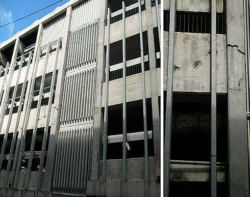_"Da werden Flure von Architekten als "Lehrstraßen" bezeichnet, 
die aus Lehrer-und Schülersicht als "kalt", "monoton" oder "abweisend" erscheinen. 
Eine Zeitung berichtete kürzlich: 
"An ein Gefängnis oder einen Bunker fühlten sich entsetzte Eltern und Kinder erinnert, 
als sie die Realschule zum ersten Mal von innen sahen." 
Die Sichtbetonwände, 
auch von Pädagogen als "Knastoptik" empfunden, 
rechtfertigte die Architektin jedoch mit dem Hinweis auf eine "interessante Patina", 
wenn der Beton alt werde. 
Auch hätten ja berühmte Architekten 
wie Le Corbusier 
mit diesem strapazierfähigen Baustoff gearbeitet. 
Ein preisgekrönter, 
doch an eine Kaserne erinnernder 
Schulbauentwurf der Stadt Berlin 
wurde von befragten Schülern als Fabrikansicht 
oder eine "Ausbildungsstätte für Klontruppen" bezeichnet. 
Ein voluminöses Dach, 
das auf befragte Jugendliche wie eine schwer lastende Landschaft übereinandergeschobener Eisblöcke 
und so erdrückend im Hinblick auf den Unterbau wirkt, 
wird vom Architekten als 
"Verbindung von behütender Geste über dem Schulleben und der umgebenden Berglandschaft" deklariert. 
Reihen von Giebelbauten, 
die Lehrern monoton erscheinen, 
gelten dem Architekturbüro als 
"Ensemble voller räumlicher Überraschungen". 
Eine schwarz gestaltete Pausenhalle, 
die auf Schüler düster und abweisend wirkt, 
ist aus der Sicht des Farbgestalters kinderfeundlich, denn 
"Schwarz ist die geeignete Hintergrndfarbe für das bunte Spiel der Kinder" ... 
Eine Schule, die für die Bedürfnisse von Schülern entworfen ist, 
wirkt im günstigen Fall wie eine anregungsreiche und deshalb interessante, 
freilassende und schließlich auch dialogbereite, 
warmherzige Person."_ 
Christian Rittelmeyer: Baukünstler und Bildungslücken, in: DABkompakt 1/10, Beilage zum Deutschen Architektenblatt DAB 1, 2010

**

## 1 Moderne Stahlbetonbauten - eine gute und menschliche Architektur mit Spitzenqualität?

Unter dem Untertitel _""Felsen aus Beton und Glas": Eine Frankfurter Ausstellung würdigt den großen Architekten und Kirchenbauer [X.Y.]"_ resumiert ein Oliver Herwig in der SZ vom 2.9.2006 das Werk eines berühmten Avantgardisten der Betonitis: _"Dass seine anspruchsvollen Arbeiten aus Sichtbeton, die bei ihrer Entstehung oft aufwendige Schalungsarbeiten erforderten, heute gelegentlich noch aufwendiger saniert werden müssen, gehört zu den tragischen Aspekten seines Werks."_

Diese Seiten gehen auf die Tragödie der Wegwerfarchitektur aus Stahlbeton ein, mit der uns die staatlich geförderte Wegwerfgesellschaft nahezu ein Jahrhundert lang schon quälte. Und während die traditionell gebauten Konstruktionen noch Jahrhunderten als Steinbruch für neue Bauwerke dienten, man denke nur an die fast bis zum letzten Stein recycelten Tempel-, Burg- und Stadtmauern, an die geradezu unendliche Anzahl zweit- bis drittverwendeten Bauhölzer aus historischen Fachwerk- und Dachkonstruktionen, an die unzähligen umgedeckten Dachziegel aus Ton, kann aus dem schnöden Stahlbeton selbst nach aufwendigster Zerhäckselung und Abfalltrennung bestenfalls Straßenschotter und Rohstoff für die Stahlverschrottung "gewonnen" werden. Daß dabei die öffentliche Hand als Besitzer der selbstzerstörerischen Beton-"Bauwerke", wie auch die gewerblichen und privaten Liebhaber dieser "modern"-modernden Bauweise mit der damit verbundenen Sanierungs- und Schuldenfalle an den Rand ihrer Existenz geraten, soll hier nur nebenbei bemerkt werden.

Konrad Fischer: Fassaden energetisch richtig und kostensparend sanieren 1 

[Teil 2](http://www.youtube.com/watch?v=Y1NSxAW15Cc) [Teil 3](http://www.youtube.com/watch?v=RAT7VzBo8k0) [Teil 4](http://www.youtube.com/watch?v=6TBII25iVQk) [Teil 5](http://www.youtube.com/watch?v=Kb0C4KiZvVA) 

Sie finden hier eine Zusammenstellung kritischer Artikel, Stellungnahmen und Kommentare zum angeblichen "Jahrhundertbaustoff" Stahlbeton. Es geht um seine typischen Schäden von der Karbonatisierung - die kristalline Festigung des Kalkhydroxidanteils zu Kalkkarbonat - über den grausamen und tödlichen [Betonkrebs](http://de.wikipedia.org/wiki/Alkali-Kieselsäure-Reaktion) - die Alkali-Kieselsäure-Reaktion (AKR) der Betonbestandteile, bei der Löschkalk und Quarz treibende Silikatgele / CSH-Phasen (Calciumsilikathydrate) entwickeln, die den Beton krebsartig durchwuchern und zerstören - die Korrosion - also rosttreibende Zerstörung der Armierung und Spannungsrißkorrosion bis zum Bauwerkseinsturz und seinem maurerkrätze- und salztreibenden Bindemittel Zement. Außerdem finden Sie ebenso Kritisches zur Betonsanierung. Es geht aber auch um das "moderne" Bauen an sich, um nur designende Planer, menschenverachtende Hochschullehrer und nur ausführende Baufirmen, die dem Kunden - oft mit Hilfe der öffentlichen Baubeamten und der Parteipolitiker, diesen Ekelbaustoff draufschnallen, ohne das Geringste zu dessen gravierenden Nachteilen zu verraten. 

Die technischen, wirtschaftlichen und geistigen Folgen ihrer Perversionen wollen sie gewiß nicht verantworten, da kommt es auf einmal nicht mehr drauf an, wer was gemacht hat. Ohne Materialverstand, aber mit stolzgeschwellt materialistischer Gesinnung hoben sie dem anständigen Bauen das Massengrab aus und gehen auch im weltweiten Maßstab über all die Leichen ihrer Einsturzopfer frech weiter am Gängelband ihres teuflichen Lehrmeisters. Inzwischen toben die unterpriviligierten Jugendlichen der betonisierten Vorstädte ihre Entfremdungsdepression an Autos und Bauwerken aus - beides Produkte der Massenproduktion und immer in glückseliger Umarmung von Ghettoburgenbau und Betonpiste anzutreffen.

Zur Einstimmung hier ein paar Bilder einer Stahlbetonruine und demnächst Betonleiche - eine staatlich erbaute Schule irgendwo in Westdeutschland aus den 60er Jahren. Schauen Sie sich um, sie finden diese herrlich-schauerlichen Details auch an fast jeder Schule in ihrem Dorf, ihrem Marktflecken oder überall in jeder deutschen Stadt - egal ob Nord,Ost, Süd oder West (Fotos aus meinem Gutachten): 

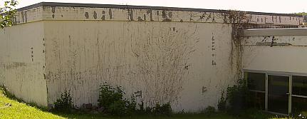Betonfassade nach Betonsanierung. Ach, wie hochgelobt wurde dieses Wunderbauwerk bei seiner Einweihung, wie glücklich sollten die braven Schüler in solch Hasenstall-Primitivbauweise werden, wie stolz konnten die (damals noch überwiegend einheimischen) Bürger doch sein, ein so modernes Bauwerk vor ihre Nase gepflanzt zu bekommen! Wir wollen Details sehen: 
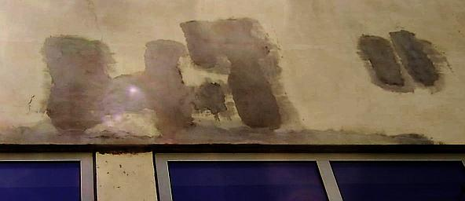Die Flachdachattika der Schul-Turnhalle rostet trotz Betonsanierung (Planung Städtisches Hochbauamt, jetzt Bau+Immo-GmbH&CoKG) fleißig weiter vor sich hin. Der Efeu konnte einiges überdecken - doch nach Freilegung der Fassade kommt die Wahrheit des Betonierens ans Sonnenlicht. 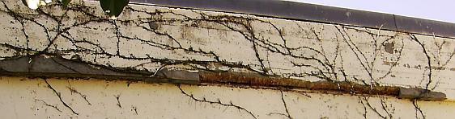Und auch am Verwaltungstrakt ist der Freilegung der verrosteten Armierungseisen mit nachfolgendem Rostschutz und Übermörtelung mit zugelassener Gruselpampe aus Zement, Füller und Kunstharz nur wenig Lebensdauer beschieden. 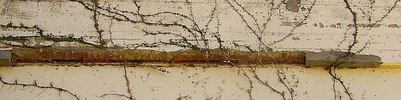Im Detail sieht das so aus. Es rostet weiter und weiter. Man nennt das in den eingeweihten Kreisen oder gar unter Experten und Fachleuten "Korrosion". Über dem rostgeschwollenen Eisen namens "Betonstahl" (!!!) platzt dann der Beton / die Betonüberdeckung ab. Logo. 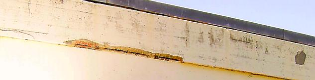Und das ist nicht nur auf wenige, besonders bewitterte Stellen und Bereiche beschränkt - nein, das zieht sich um alle Betonbuden, trotz "Betonsanierung". 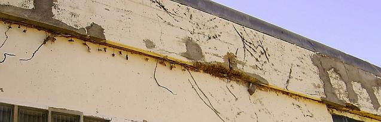War das eine Investition aus Haushaltsmitteln, von schlauen Baubeamten geplant und betreut - und jetzt solche Löcher! 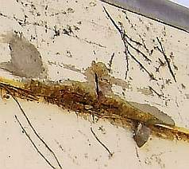Im Detail. Ja, die Armierungseisen / die Betonbewehrungen sind es - neben der immensen Temperaturdehnung des vermaledeiten Stahlbetons - die dem Betonzeitalter seine selbstzerstörerischen Qualitäten verleihen. 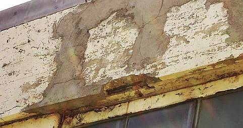Über die Schäden an Stützen, Fenster- und Türanschlüssen wollen wir hier nicht weiter räsonieren. Es ist auchso grausam genug, was nach der Betonsanierung so schrecklich bald geschieht. 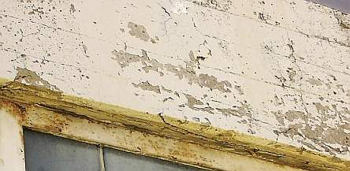Nein, auch die wasserabweiendste CO2-Bremse, vulgo Kunstharzanstrich, Dispersionsfarbe, Silikonharzfarbe, Beschichtung oder gar Plastikpampe kann den Verfall nicht bremsen, sondern wegen Feuchtestau nach Verspröduung und damit einhergehender Kapillarrßbildung nur weiter beschleunigen. 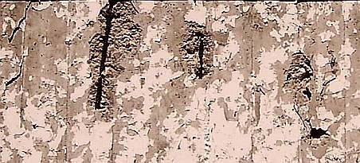Auch die freiliegenden Armierungseisen (Stahlbetonbewehrung) können das nur bestätigen. 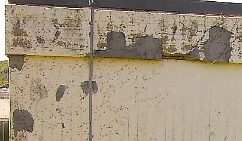Die Gebäudeecke nach Abnahme des Efeus. 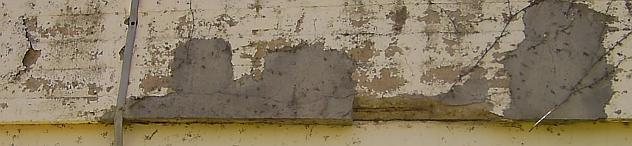Im Detail. Bewundern Sie die Reste der deutschen Handwerkskunst. 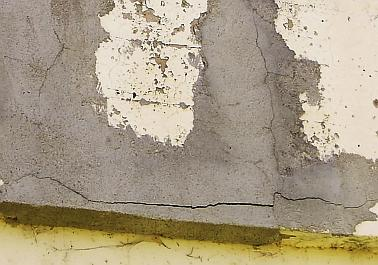Oder war das so geplant? Wer sich als Ingenieur schon mal mit der Betonfrage auseinandergesetzt hätte - ich meine nicht die auf etwas längere Sicht geradezu erbärmlich verlogenen Tabellenwerke und statischen Berechnungen - müßte ja wissen, was Sache ist. Und den so adrett gekleideten und so geschenkebeladenen Fachberatern der Beton- und Pampenindustrie etwas kritischere Fragen stellen, als: "Können Sie mir das Leistungsverzeichnis für die Betonsanierung mit Ihren Wunderprodukten ausarbeiten, kostenlos freilich?" Das Flachdachthema - was glauben Sie denn, wie es damit aussieht? - müssen wir hier etwas aussparen, dafür gibt es [ein eigenes Kapitel](212bau7.md). 

Welches Menschenbild liegt der so arg auf- und abgeklärten Betonmoderne zugrunde? Der entwurzelte, heimatlose Durchschnittsstatist des glorifizierten Ameisenstaats, der in der Fremde die Käfighaltung genießen darf und nach der Charta von Athen selbst dort keine beheimatende Einheit zwischen Wohnen, Leben, Arbeiten, Freizeit geboten bekommen darf? Funktionale Trennung, Brutalarchitektur für die Benutzungsarchitektur der großbrüderlich regimierten Massen(un)menschen, Dekor, Schönheit und Gutes Bauen als Verbrechen am Zeitgeist. Gemüt und Gemütlichkeit verboten, Mensch als Massenprodukt ohne Eigenwert, Familie als Auslaufmodell, Architektur als Größenwahn der Geschmacksdiktatoren, Demokratie als Demokratur, Gott als Witzfigur.

Doch der so unglückselig von der Moderne Betroffene will trotz aller ihm entgegengebauter Verachtung kein Massenprodukt sein, identifiziert sich keinesfalls mit den seelisch verwüstenden Bauformen. Da können die medial manipulierenden Chefpropagandisten des ganz und garnicht wohlfeil gebauten Schwachsinns der "Aufklärung" grad lobhudeln und lamentieren, was sie wollen. Der auch baulich verängstigte Betonbürger brennt Schulen und Kindergärten nieder, die angeblich für ihn, in Wahrheit doch nur für korrumpiert gesteuerte Scheusalarchitektur von Architektenscheusalen entstanden sind. Er ist nicht gemeint mit diesen Bauformen, macht sich nicht gemein damit, macht kaputt, was ihn kaputt macht und durch die typischerweise an bewitterten Betonbauteilen bald auftretenden Betonschäden sowieso schon fast kaputt ist. Die SZ titelt am 12.11.05 auf Seite 13: 

_"Formen des Zorns, Licht, Luft und Randale: Welche Verantwortung tragen Architekten und Stadtplaner für die exzessive Gewalt in den französischen Vorstädten?"_ 

und benennt als eines der wesentlichen Bildmotive in den Medienberichten von den Banlieu-Unruhen: 

_"das stockwerksweise sich in den rußigen Himmel perpetuierende, hässliche, aus Beton, Satellitenschüsseln, Zorn und Drogen zusammengeschraubte Haus. ... (Gerhard Matzig)"_. 

Das stimmt und offenbart Realität!

Sogar im Betonbau selbst ging die Entwicklung mit Anlauf in den Abgrund: Die historische Betontechnik mit weniger fein gemahlenem Zement und deswegen höherem Zementgehalt konnte noch dauerhaftere Bauwerke - auch aus Stahlbeton - errichten. Zugunsten des Billigpfuschs wurde die "Westwall"-Qualität z.B. der Organisation Todt abserviert.

Literaturtipp: Franz W. Seidler: **"Die Organisation Todt, Bauen für Staat und Wehrmacht 1938-1945"** , Bernard & Graefe Verlag, Bonn 1998, ISBN 3-7637-5842-9 
Die OT führte die deutsche Bauwirtschaft zu bis dahin unbekannter Schlagkraft. Erfolgreiche und mächtige Baukonzerne, das Ineinandergreifen von Baustellenlogistik und Konstruktionsfortschritt, innovatives und qualitätsbewußtes Bauen mit einfachen und differenzierten Methoden auch des Eisenbetonbaus erhielten hier Impulse und Organisationsformen, deren Auswirkung die Niederlage zwar nicht verhindern konnten, aber in der Nachkriegszeit und Wiederaufbauphase zur Blüte gelangten. 
Der Verfasser liefert umfangreiches Zahlen- und Bildmaterial, das diese technische, menschliche und organisatorische Großleistung im europäischen Maßstab vom Atlantik bis an den Ural nachvollziehen läßt. Viele Aktenbelege und Originalzitate aus den Jahren des Wirkens der von Fritz Todt gegründeten Nichtpartei- und Nichtwehrmachtsorganisation werfen lebendige Schlaglichter. Die Schattenseiten der Zwangsarbeit, der kriegsbedingten Verwerfungen, der Korruption und anderen menschlichen Versagens werden dabei nicht verschwiegen, sondern nüchtern dargestellt. 
Keine Schönfärberei, aber auch kein gehässiges Buch. Lesenswert für alle, die an der Entwicklung moderner Bauwirtschaft und -technik, aber auch der Zement- und Betonmafia Interesse haben. 

[Hier gehts weiter zu Kapitel 2 - Betonschäden durch schlechte Baustoffqualität](2beton02.md) 

---

Alte Ankerlinks: bitte drücken bei Interesse - keine automatische Weiterleitung 

[7 Balkonien](2beton07.md) [15 Zement](2beton15.md) [16 Zement und Hydraulsalze](2beton16.md)
