[🠔 Zur Übersicht: Stahlbeton](2beton.md)  
# Betonschäden durch schlechte Baustoffqualität
**Beton- und Zementindustrie vernachlässigt Kernkompetenzen durch falsche Öko-Argumente und fehlerhafte Bauphysik, was zu Qualitätseinbußen und Betonschäden führt.**  
_von Konrad Fischer_

## Der Stahlbeton und der Zement 2

## 2. Betonschäden durch schlechte Baustoffqualität

Anstelle die Vorzüge der auch für den Beton gültigen Massivbauweise eindeutig herauszustellen, läßt sich die Beton- und Zementindustrie von der Konkurrenz auf falschen Annahmen beruhende "Öko"-Argumente aufzwingen. Damit verläßt sie ihre Kernkompetenzen - zum Nachteil der Qualität. Die kritiklose Übernahme der [U-Wert-Theorie, die gerade für real bewitterte speicherfähige Massivbaustoffe nicht gilt](7wdvs05.md#wã¤rmedã¤mmung), behindert den energetisch durchaus sinnvollen Einsatz auch der Betonbauweise. Die dadurch falschen Konstruktionsvorschläge der Betonindustrie (vgl. "Bauphysik nach Maß", Beton-Verlag 1995) entsprechen vielleicht den Wünschen der Dämmfanatiker, nicht jedoch dem Wunsch nach energetisch sinnvollem Bauen. Energieverluste durch Abschirmung der Solarstrahlung und mangelhafte Speicherfähigkeit mittels äußerer Dämmstoffschichten bzw. unzureichende Nutzung der Wärmestrahlungsabsorbtion sind die Folge dieser bauphysikalischen Narreteien. Man empfiehlt also Dämmung, obwohl in "Bauphysik nach Maß" richtigerweise zu lesen ist (S. 44): 

_"Die physikalische Wirklichkeit ist [...] sehr komplex und nur mit größerem Aufwand zu berechnen. Bei den üblichen Wärmeschutzberechnungen werden stationäre Bedingungen, das sind gleiche oder nur wenig schwankende Temperaturen, vorausgesetzt. Unter diesen Verhältnissen hat die Wärmespeicherung keinen Einfluß auf den Heizenergiebedarf, und die Berechnungsmethoden sind einfach. Müssen aber instationäre Wärmevorgänge wie der Wärmebedarf beim Anheizen oder der Einfluß der tagsüber stark schwankenden Sonneneinstrahlung auf das Raumklima im Sommer oder den Heizenergiebedarf berücksichtigt werden, ist die Wärmespeicherfähigkeit der Bauteile zu beachten."_ 
- was dann in den dann folgenden Rechenbeispielen leider unterbleibt! Ist das dem Vorwortschreiber in diesem Buch, Prof. Dr.-Ing. Herbert Ehm (+ Okt. 2000, Gott sei seiner Seele gnädig), amtlicher Durchsetzer dieser falschen Bauphysik, geschuldet? Weiter im Text: _"Wenn die von der Sonne eingebrachte Wärme in den Bauteilen gespeichert und erst dann an die Raumluft abgegeben wird, wenn außen bereits kühlere Temperaturen herrschen, entsteht im Sommer ein angenehmes, ausgeglichenes Raumklima. Im Winter ermöglicht die langsame Abkühlung von Bauzeilen mit gutem Wärmespeichervermögen Betriebspausen der Heizanlage. Auch die Gefahr von Wasserdampfkondensation an den Bauteiloberflächen während einer nächtlichen Betriebspause der Heizanlage (Nachtabsenkung) ist geringer als bei einer leichten Bauart. [...]"_ 
- Alles richtig, wobei die mit dem Massivbau bestens korrespondierende [Hüllflächentemperierung](7wsvoant.md), die **alle** Feuchtegefahren der Nachtabsenkung vermeidet, leider nicht bekannt zu sein scheint. Diese Aussagen stellen aber die etablierte Bauphysik mit ihrer "speicherlosen" Simulation auf den Kopf! Warum daraus im Ergebnis keine zutreffenden Schlüsse gezogen werden, wird wohl auf immer das Geheimnis dieser "Fachbuch"-Autoren bleiben. Zum bleibenden Schaden für den Massiv- und Betonbau. Und die Ökopropaganda mit den natürlichen Bestandteilen des Betons wird nicht nur wegen der giftträchtigen Abfallverwurstung der Zementwerke konterkariert, sondern auch durch praktische Übernahme der Leichtbauideologie, deren Steckerlesbauweise schon den Holzbau und Porenwut den Ziegel ins technische Abseits befördert hat. Ein Bravo der Dämmstoffreklame! 

Die Betonkampagne "Es kommt drauf an, was man draus macht" schiebt nun den schwarzen Peter des Baustoff- und Konstruktionversagens den Ingenieuren und Architekten zu, genau den Multiplikatoren, die man für besseres Bauen eigentlich braucht. Dümmer gehts nümmer. Dem Negativimage durch Medienberichte über Zementkrätze, Kunstharzpampensanierung von falsch konstruierten Betonbauwerken, Einstürze unterdimensionierter Stahlbetongerippe, potthäßliche und menschenfeindliche Stahlbetonarchitektur usw. kann man so nicht erfolgreich entgegentreten. Auch die Abfallbeimischung im Zementwerk und der Verzicht auf allgemein bessere Zementqualität (z.B. Chromatbelastung des Silozements) hilft vielleicht die Herstellungskosten verringern - für den aufgeklärten Kunden, Verarbeiter und Ingenieur spricht das gegen die Zementbranche. Layoutkampagnen auf Hochglanzpapier sind hier vergebliche Liebesmüh. Besser wäre es, den freilich konstruktiv auf unterstem Niveau "aufgeklärten" Planern leicht faßliche Kost z.B. zum Thema "Betonschäden vermeiden" zu gönnen. Bekanntlich greift mancher Architekt nicht ungern zur Betonkonstruktion, weil dafür zwei mit Schraffur gefüllte Zeichenstriche genügen. Den Rest soll ein tabellengläubige Statiker erledigen. Von Baupraxis und Bauschaden verstehen solche Ings - so zeigt´s zumindest die Praxis - nicht viel bis nichts.

Allerdings gibt es immer wieder mal Versuche, dem Beton den Schein einer besseren Welt abzupressen und dem Betonagitprop gerecht zu werden - "es kommt ja nur drauf an, was man draus macht". Was der katalanische Spanier Ricardo Bofill - "Stararchitekt" - in diesem Sinne im Auftrag des linkssozialistischen Bürgermeisters, Juraprofessors und Weltverbesserers George Frêche von Montpellier ab 1979 auf einem verlassenen Militärgelände leistete, geriert sich als 40 Hektar-Stadtviertel recht antik hochdahertrabend (wir sind in La Grande Nation!) unter dem Namen "Antigone" und drückt postneofaschistischen Betonismus mit mehr als 1200 Sozialwohnungen ins klassisch-eklektizistische Korsett. Ja, so sollte man Menschen in die Phantasmagorien des utopischen Sozialismus schreddern, bis sie den neu aufgemotzten Sozialgleichmachereien mit pseudoindividuellem Anstrich gerecht werden und "funktinieren". Wenn es mit der Funktionshühnerstallarchitektur a la Neue Heimat und DDR (die hatten wenigstens noch Schrebergärten auf enteignetem Grund, um neben Kombinatgenossenverzweiflung bei Möhrchenzucht, Zementsackklau und Zwergerlhobbyarchitektur den individuellen Traum des freien Bauern auf eigener Scholle zu leben) nicht klappt, dann halt so - lassen auch Sie sich davon verbessern und begeistern:

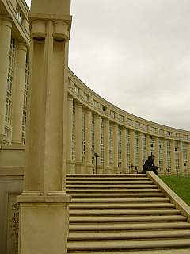Man denkt ans White House, Westminster Palace oder an die versteinerten Phantasien des einst (?) so sehr geliebten verhinderten Architekten und Führers und des noch verehrteren Duces, wie es hier so säulenmäßig wuchtet. Dat is Ordnung, strammgestanden, äh, pardonnez moi: Parbleu!

Ach so, wir leben ja im Nietzscheanischen Zeitalter - der höchstgezüchteten Reinkultur des hedonistischen Dionysismus - da darf der altgriechische Meister mit seinen betörenden Tönen aus der Rattenfängerpfeife nicht fehlen. Tüdelüüt! In den Ecken dahinter verkaufen schwarze Gestalten die heutzutage probaten Verstärkungsmittel für rauschige Ausschweifereien. Ob sie auch bocksbeinig sind und langschweifige Schwänze tragen? Pantastisch!

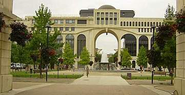Ist das ein gefräßiges Monster vom Stern der Fliegen, ein assymetrisch mißglücktes Zitat aus Mussolinis EUR oder neonapoleonischer Frankismus? Alles falsch- das ist ein Portalbau. 

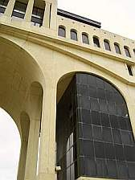En Detail. 

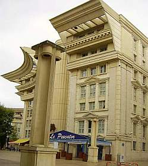Lampe, Säule, Baseballkappenvariationen - Merveilleuse! 

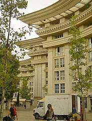Runde Ecken? Man beachte das Sägezahnprofil - und andere griechische Profiliererei. Gab's wohl im Sonderangebot. 

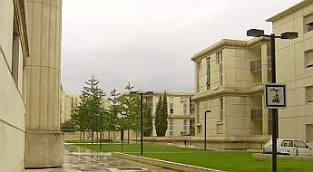Auf der Rückseite dann ein gediegener Rückschritt in die 1930er. Fast originale Dessauer Käseschachteln - Formidable!

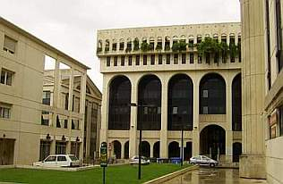Sinnfrei offene Bauwerksecke, Mussolinis Colosseo Quadrato, Tempelgiebel, Säulengestik - doller kann man den Fascismo wohl kaum glorifizieren. Nur zum Carrara-Marmo hat's net gelangt.

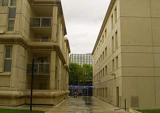Ja was denn nu - Wulstprofil oder Plattenfuge, Archlochfassade oder Glaskisterlvogelkäfig oder beides? Wie sieht sie jetzt aus, die moderne Betonitis? Ach so, klaro, Toyota: Allet is möchlich, anything goes! Wenn's (fremde) Geld nur langt, kann Verarchitekture aschurdhui wirklich verzaubern, newwa? 

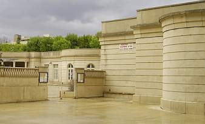Sogar auf Fortifikatorisches brauchen wir nicht zu verzichten, Carcassones Viollet le Duc feiert hier fröhliche Urständ. Ist das jetzt Revolutionsarchitektur?

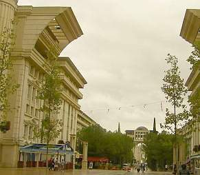Achsen, Achsen, Achsen - wer soll denn hier mal aufmarschieren? Nur der Citoyen, der Bourgeois, oder doch nur die macdonaldsverwöhnten Sklaven unserer Sklavenhaltergesellschaft? Wo wohnt eigentlich der Architecte? Wie einst Corbu im Bauernhäusel des 17. Jhs. weit über der Cite radieuse in stillschöpferischer Einsamkeit? Doch jetzt genung der Kulissenschieberei, wir wollen mal genauer hingucken:

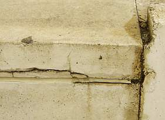Ein Treppendetail.

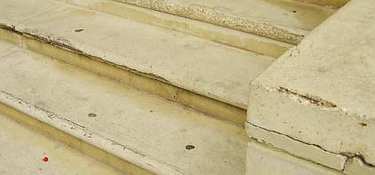Noch eins.

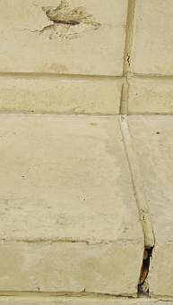Moniereisen glotzt, Plastikfugmasse kotzt.

En Detail.

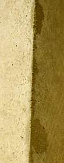An besonders erhabenen Stellen wird schon fleißig betonsaniert.

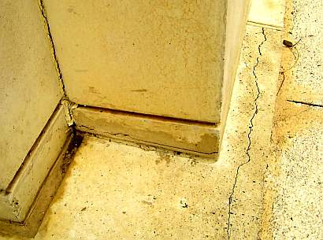Doch nur an diesen - der Rest darf einfach kaputtgehen.

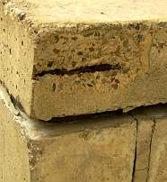Das rostet nicht nur, das klafft schon.

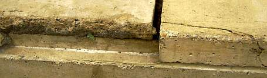Bis es ganz weg ist. Bitte bedenken: Es gibt so gut wie keinen Frost in Montpellier.

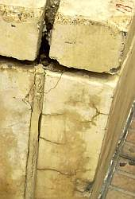Bröckeln, Bröseln, Verspröden bis zum Abwinken. Ist da wieder einmal der blöde Handwerker dran schuld?

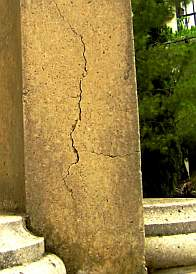Was nützt das schönste Säulenrund, wenn eim die Wand entgegenkummt?

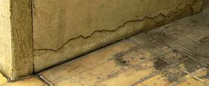Nicht nur am Fundament sieht's bös aus.

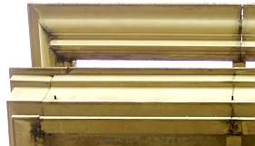Auch die freikragenden Attiken haben so ihre Probleme, nicht nur an der Ecke,

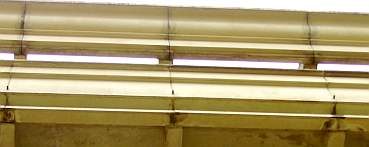Das geht die ganze Wand lang so. Äscht luschtig, die petit Wasserspeierlein, ou?

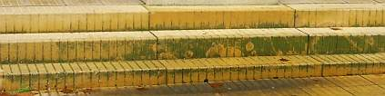Da tropft es hin.

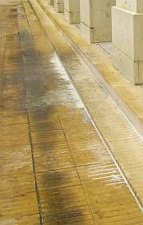Auch die ganze Wand lang. Und der Beton kalkt auch gleich mit aus. Die damit einhergehende Entfestigung muß uns keine Sorgen machen, ist doch heutzutage jeder sich selbst der Nächste.

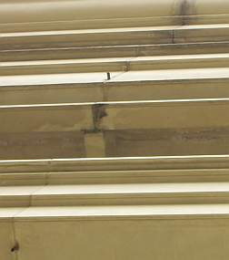Irgendeiner hat die Wasserspeierfehlkonstruktion bemerkt - unten wird endlich ein äschtes Regenröhrli draus - nun mag der Pluie ranrauschen. Irgendwie witzig, oder?

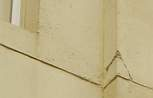Auch mitten aus der Wand springen schon die Betonbrocken. Ob hier die Platte nächtens leise knirscht? Oder zirpt?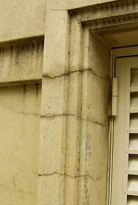Das ist KEINE Profilverzierung! Und der Rißschaden kommt nicht von der Drehbewegung des Fensterladens. Es ist ganz einfach der Armierungskorb, der sich gnadenlos nach Freiheit sehnt und durch Dick und Dünn rostend nach draußen strebt. Betonstein und Eisen bricht, aber unsere (Verarchitektur-)Liebe nicht ... 

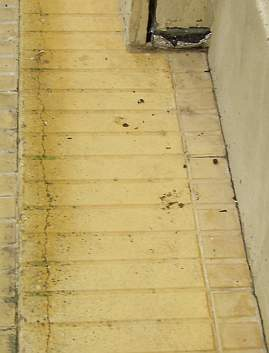Stützen, Pfeiler, Treppen, nichts ist mehr zu retten. 

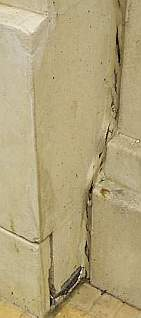Nun reißt auseinander, was nicht zusammengehört. 

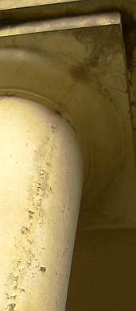Da ändert auch keine synthetisch plastifizierte Karbonatisierungsbremse was dran, bekommt sie Witterung, reißt sie auseinander und darunter rostet's verschärft weiter. Da darf nun alle paar Jahre wieder gepinselt werden. Toll für die Bauchemie und Bauindustrie. Betonbau- ein echtes Konjunkturförderprogramm Keynesianischer Prägung. 

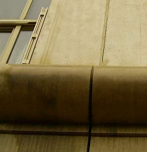Hieß es nicht immer: Die Fugenkitte der neuen Generation sind weniger versprödungsanfällig und gaaanz sicher in der Lage, auch die allerdollsten Fugenbewegungen dauerelastisch zu überbrücken? Oder waren hier einfach wieder mal die allzubekannten Bauexperten am Werk und haben hinter dem Rücken der spanischen Bauleitung das französische Genialprodukt gegen italienischen Billigschrott ausgetauscht? 

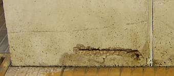Dieses üble Schadensdetail am Pfeilerfundament steht nicht einmal, oder zehnmal, nein hundertemale herum. 

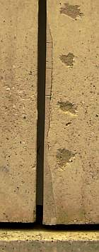Da kann man reparieren, wie man will. Wer sich dabei auf die alchymische Sanierindustrie und nicht den gesunden Menschenverstand verläßt (Similis-System Hahnemann: similia similibus curantur - Gleiches mit Gleichem heilen!), ist verlassen. Solcher Reparaturmist fliegt einem eben schon nach kurzer Zeit wieder um die Ohren. Zu fest, zu dicht, zu spröd, zu blöd. 

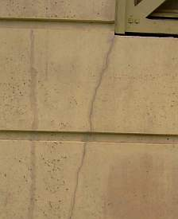Der Fluch des Fertigteils: Risse an jeder Fensterecke. 

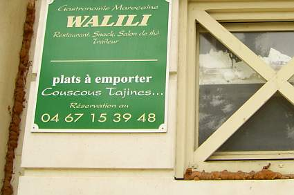Haben sich nun die Bauteile auseinanderbewegt und die Marokkaner Selbsthilfe geübt? Oder ist das Fugendetail das gewöhnliche Soll aus der Geniekiste des deutschen Fensterbäuerleins (Handcous, Handcouscous!!)? 

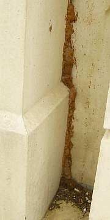Der PUR-ismus zieht sich bis in den letzten Dreck. Was muß es vorher da reingepfiffen haben! 

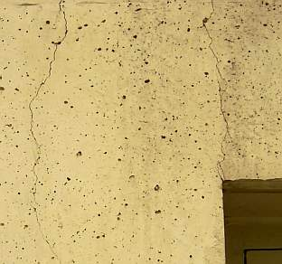Beton reißt eben, das ist doch allseits bekannt! Deswegen ist er doch flächenbewehrt, oder? 

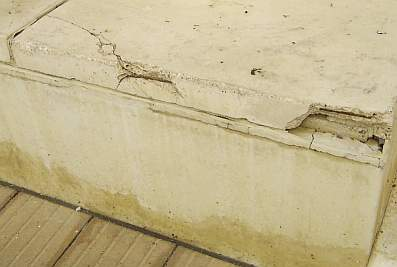Sic transit gloria mundi - aprè nous le déluge. Das kommt davon, wenn man ausländische Architekten ranläßt, Franzosen hätten das nie hingekriegt, oder? Und es kommt eben gar nicht drauf an, was man draus macht - Beton bleibt Beton,da hilft keine Pathetique. Wobei es die befreiten DDR-Genossen vormachen, wohin die Marschparade geht: Raus aus der Sozialwüste, rein ins Einfamililienhaus mit Gärtli, Froschtümpli und Stellfläche für Polenzwergli und Satschüsseli. SED-Genössli zuerscht! Und das neue Protzen ist bestimmt nicht durchbetoniert. Sondern geziegelt - auch wenn dabei nur auf [rotgeport-rißempfindliche Luft](29bau14.md) gesetzt wird. Der Mensch will ja beschissen werden. Die WB 60/70/80-Kisterl werden "rückgebaut".
