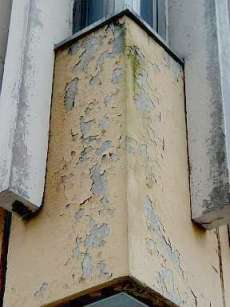
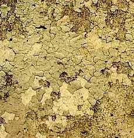

[🠔 Zur Übersicht: Stahlbeton](2beton.md)  
# Baustoff und Baupfusch für eine Sklavenhaltergesellschaft?
**Der Artikel beleuchtet, wie unehrliche Baustoffinformation und ruinöser Preiswettkampf das Marktgeschehen diktieren, entgegen etablierter Bauphysik und Öko-Ansichten, was zu schlechten Betonbauwerken führt.**  
_von Konrad Fischer_

## Der Stahlbeton und der Zement 3

Inhaltsverzeichnis der Betonkapitel 

---

## 3 Baustoff und Baupfusch für eine Sklavenhaltergesellschaft?

Solange die Baustoffinformation sich nicht auf Ehrlichkeit und Qualitätsbewußtsein besinnt - durchaus gegen die herrschende Meinung der etablierten Bauphysik, Ökoapostel und Klimaapokalyptik - wird das Marktgeschehen weiter vom ruinösen Preiswettkampf diktiert. Und eines scheint sicher: Sklavenfabriken der 3. und 4. Welt können Dreckzement noch billiger auf den Markt schmeißen, Sklaventrupps schlechte Betonbauwerke noch schneller hochziehen - wie schon in den gastarbeitergeprägten 60ern, heute in Berlin und anderswo. Ist das gewollt? Besseres Bauen ist mit derart fehlgeleitetem Marketing bestimmt nicht zu haben.

Die in der Fachpresse zunehmenden Beiträge zum Thema Stahlbetonsanierung entsprechen überwiegend folgendem Tenor, der der Ausgabe "Bautenschutz+Bausanierung 2/2000" entnommen ist:

_"[...] Vor allem durch durch Witterungseinflüsse und Emissionen sind viele Sichtbeton-Bauwerke inzwischen im unterschiedlichen Ausmaß geschädigt. [...] Schwere Schäden an Stahlbetonbauten entstehen insbesondere durch die Carbonatisierung. Das bei der Hydratation des Zementes entstehende Calciumhydroxid reagiert mit dem Kohlendioxid. Dabei wird der ursprünglich hoch alkalische Beton in den oberen Zonen chemisch neutralisiert._

**_Unsichtbare und sichtbare Abläufe_**

_Die Geschwindigkeit dieser Carbonatisierung ist umso höher, je mehr Fehlstellen, Nester, Poren oder ungleichmäßige Verdichtungen der Beton aufweist. Der eingebettete Stahl korrodiert, sobald der umgebende Beton carbonatisiert._

_Der nach außen sichtbare Effekt sind Risse und Abplatzungen in der Betondeckschicht. Wo bereits solche Oberflächenschäden deutlich werden, ist eine Sanierung von Grund auf unverzichtbar. [...]"_ S. 16 ff., Verfasser: Axel Knauer 

_"[...] Eine der häufigsten Schadensformen an Stahlbetonbauteilen in Parkhäusern, aber auch bei Brücken, Kläranlagen, Rohren, Behältern, Küstenbauwerken etc., ist die Korrosion der Bewehrung infolge Chloridbelastung mit oft gravierenden Folgen für die Standsicherheit und Gebrauchsfähigkeit der Bauteile. [...]"_ S. 18 ff., Verfasser: Dr.-Ing. Michael Raupach, Dipl.-Ing. Josef Meeßen

Und nun greift z.B. im Hochhausbau folgender Ablauf: Die Hausverwaltung - baulich kompetent bis zum Gehtnichtmehr und wirtschaftlich total unabhängig von ihren Auftragnehmern - beauftragt sachverständige Planer, etwas gegen die Betonkorrosion vorzunehmen. Man leitet mit einer Superfirma eine Betonsanierung ein, die das arme Bauwerk mit letztlich Kunstharzsuppe übergießt - unter dem Vorwand der Versiegelung gegen CO2. 

Was geschieht nun? 

Wie immer: Die Kunstharzpampe altert, binnen kurzem ist sie zum Kraquelee zerrissen und überzieht die Fassade mit einem Rißnetz.

So kann das dann nach einiger Zeit in Potsdam aussehen: 

Oder so in Marburg: 

Die Risse nehmen kapillar Regenwasser und über Kondensation Luftfeuchte auf. Die flüssig in der Fassade vorliegende Nässe kann nicht mehr ordentlich austrocknen - die "dichten" Kunstharzinseln sorgen dafür. Folge: Die Fassade verrottet schneller als vorher, sie verschmutzt wie Sau, veralgt und verschimmelt. Schon nach wenigen Jahren darf der nächste Sanierungsschritt eingeleitet werden. Alles nach Norm und Instandsetzungsvorschrift vorprogrammiert.

[Flachdachschäden und andere Schandtaten moderner Betonitis](212bau7.md) 

Links zum Thema Karbonatisierung von Beton:

<http://www.campusfavoriten.at/bau@home/Baustoffkunde/daten/1.3.4.1.htm> 
<http://www.elkage.de/PHP/fachbegriffe.php?id=2539> 
<http://www.elkage.de/PHP/fachbegriffe.php?id=1037> 
<http://www.math.uni-bremen.de/zetem/projekte2004/materialwissenschaften/beton.html> 
<http://www.sued-fassaden.de/balkone.htm>

Heute bieten sich der von den Auftragsbegünstigten weihnachtsgeschenkverwöhnten Hausverwaltung und ihrem Planungsspezl zwei Alternativen: 

1. Vollwärmedämmung mit Kunstharzputz. Folgen siehe diesen [Link](213baust.md).

2. Neuanstrich mit angeblich schmutz- und wasserabweisenden Kunstharzsuppen neueren "Lotus"-Typs. Folgen siehe [hier](2lotus.md).

Ergebnis: Schwachsinn bzw. intelligente Sanierung3. So beutet man unseren neuerdings so oft bewiesenen Wunderglauben an technische und andere neuheilige Märchen aus. Glückliche Eigentümergemeinschaft! Wenn´s nur dem Geldbeutel so richtig weh tut. Deutschland - ein Land von Tertullianern: Credo, quia absurdum - auf neudeutsch: Ich glaub´s, weil´s Sch... ist.

Weiter hier: [4: Macht Betonieren krank und sichert Arbeitsplätze?](2beton04.md)
