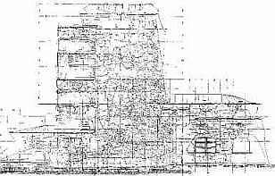

[🠔 Zur Übersicht: Stahlbeton](2beton.md)  
# Macht Betonieren krank? Folgen moderner Bauweise
**Eine kritische Untersuchung der gesundheitlichen Auswirkungen von Betonbauten und der oft überschätzten Lebensdauer von Stahlbetonfassaden im Vergleich zu traditionellen Baustoffen.**  
_von Konrad Fischer_

## Der Stahlbeton und der Zement 4

Inhaltsverzeichnis der Betonkapitel 

---

## 4 Macht Betonieren krank und sichert Arbeitsplätze?

Auch aus gesundheitlichen Aspekten ist die Stahlbetonbauweise nicht gerade verbraucherfreundlich, selbst wenn es "nur" Arbeiter betrifft:

Auszug aus "Hochbau 3/99":

**_"Betonarbeiten: Rücken gefährdet_** 
**_Bewehrungsarbeiten auf Baustellen - Gefährdungen und Belastungen aus arbeitsmedizinischer Sicht_**

**_Der Transport von Betonstahl auf Baustellen kann erhebliche Sicherheitsrisiken und Unfallgefahren bergen. Hinzu kommen Belastungen und Beanspruchungen der Bauarbeiter durch ungünstige Arbeitsbedingungen. Vor allem Bewehrungsarbeiten bringen häufig hohe Belastungen mit sich._**

_Insbesondere bei Bewehrungsarbeiten an Bodenplatten und anderen horizontalen Bauteilen müssen die Mitarbeiter bei Bindearbeiten in tief gebückter Körperzwangshaltung arbeiten. Außerdem müssen häufig schwere Stahlteile von Hand bewegt und in die richtige Position gebracht werden. Zusätzlich zur Körperhaltung erhöhen die Lasten, die bewegt werden müssen, die Druckbelastung der Bandscheibe. Dies hat Auswirkungen auf die Gesamtbelastung des Rückens._

_So haben 54 Prozent der Betonbauer häufig Rückenbeschwerden im Lendenwirbelbereich. Man kann den Druck auf die Bandscheiben rechnerisch im Modell ermitteln. Wird in tief gebeugter Körperhaltung mit vorgestreckten Armen eine Last von 10 kg (= 100 N) bewegt, wirk eine Druckkraft von über 5100 N auf die Bandscheibe (L5/S1) ein._

_Auch wenn ein kritischer Grenzbereich bis heute nicht sicher angegeben werden kann, sollte aus Gründen der Prävention die Druckbelastung der Bandscheiben begrenzt werden._

_Rückenbeschwerden bedeuten nicht nur eine subjektive Beeinträchtigung für die betroffenen Bauarbeiter,_

_Hohe Rückenbelastungen durch schweres Heben und Tragen sowie Körperzwangshaltungen können unter Umständen nach längerer Einwirkung auch zu dauerhaften Schäden der Bandscheiben führen._

_Auch für die Unternehmen werden erhebliche Kosten durch Krankheitszeiten von Mitarbeitern verursacht. [...]"_

Und der Bauherr erhält dafür besten Pfusch, auch davon sind unsere Fachzeitschriften und anderen Publikationen ja voll: 

bausubstanz 2/99:

_"**Wohnmaschine**_ 
_Betonsanierung an der Fassade der Maison Radieuse von Le Corbusier_ 
_Von Guy Archambault_

_Die zu Zeiten von Le Corbusier errichteten Betonbauwerke leiden alle an denselben Krankheiten, zumindest was ihr Äußeres betrifft. So sind auch an der Maison Radieuse in Rezé Maßnahmen zur dauerhaften Sanierung der Bausubstanz dringend nötig, da Teile des Bauwerks zu zerfallen drohen. Die Gründe hierfür sind unter anderem Mängel in der Betonqualität und eine inhomogene Vermischung der Betonanteile sowie Schwächen bei der Einkleidung der Stähle._

_Diese Mängel ziehen mehr oder weniger drastische Beschädigungen und Veränderungen in der Armierung nach sich. Außerdem erzeugen die oxidierten Stellen der Armierung einen mechanischen Druck, der ebenfalls Beton absplittern läßt. Letztlich kann ein derart angegriffenes Bauwerk zur Ruine verfallen. [...]_

_Angesichts der zum Teil sehr stark fortgeschrittenen Zersetzung von Fassadenplatten, bestimmten Sonnenblenden und Loggia-Brüstungen und der Gefahr, daß bestimmte Teile verfallen, hat der Verwalter des Baukomplexes, die Loire Atlantique Habitations, entschieden zu handeln. [...]_

_Der Ursprung der Zersetzungen ist wie in den meisten dieser Fälle sehr vielschichtig._

_Zur ursprünglichen Porosität des Betons gesellten sich Fehler beim Bau, vor allem beim Anrühren des Betons, was eine Entmischung der Betonanteile nach sich zog. [...]_

_Der Beton enthielt auch zuviel Wasser. Aufgrund unzureichender Dichtheit drang Feuchtigkeit in die Bausubstanz, und die korrosive Atmosphäre wegen des nahen Meeres sowie die Abgase des benachbarten Kraftwerks in Cheviré wirkten ebenfalls zerstörerisch. [...]_

_Für großformatige Teile wurde Gußbeton verwendet, vorgefertigte Elemente tragen die Loggien, die Fassadenelemente, die Sonnenblenden und die dekorativen Trennwände. Gerade diese sind von der Zersetzung besonders betroffen. An einigen Stellen sind die Armierungen so stark korrodiert, daß ein Bruch bevorsteht."_

Fast noch besser: 

Süddeutsche Zeitung 12.3.1999

_"Fällt Fallingwater ins Wasser?_

_Man könnte sagen: "Mann beißt Hund". Aber weil es eine amerikanische und eine traurig-ironische Geschichte ist, und weil es darin um das berühmteste Wohnhaus der modernen Bau-Welt geht, deshalb ist in jenem Artikel der gestrigen New York Times zu lesen: "House Crushes Boulder". Was man auch so übersetzen kann, daß es offensichtlich einen Ort gibt, wo mit einem Glashaus nach Steinen geworfen wird._

_Der Ort heißt "Bear Run" und liegt in einem schönen Tal in Pennsylvania. Dort hat ein Architekt, der in den fünfziger Jahren noch kurz vor seinem Tod einen demütigen Reporter angeblafft hatte, er sei keineswegs der berühmteste Architekt seines Zeitalters - sondern der größte Architekt aller Zeitalter, dort hat jener Frank Lloyd Wright im Jahr 1937 ein Haus erbaut: das berühmte "Fallingwater", welches kaum aus Glas, dafür aber aus Stein und Stahlbeton besteht. Und darum geht es, um den Stahlbeton, dessen weiteres Bestehen offenbar gefährdet ist - wie unter dem Titel "Saving Fallingwater From a Fall" zu erfahren ist. Wobei die Ironie des Falles eben darin liegt, daß das Haus, welches auch "Haus auf dem Wasserfall" genannt wird und das als Hommage an die Symbiose von Natur und Baukultur erdacht war, daß dessen Architektur ausgerechnet jene Natur bedroht, von deren Schönheit sie lebt: Es könnte ins Wasser fallen oder den Fels zerquetschen._

_Das Haus [...] ist zu einem Wallfahrtsort der Baugeschichte geworden. Zuletzt besucht von 150.000 Architektur-Touristen pro Jahr; zu den Öffnungszeiten startet alle sieben Minuten eine Führung. Jetzt aber, als Anfang März die "Saison" eröffnet werden sollte, standen die Besucher angeblich mitten im Wohnzimmer [...der Raum zwischen der unteren und der oberen Terrasse] vor einem Loch im Boden, "groß wie eine Badewanne". Von dort aus wird schon seit einiger Zeit untersucht, warum sich das Haus so komisch benimmt wie der schiefe Turm von Pisa: Es neigt sich. Berichtet wird von einer enormen Schieflage der Haupt-Terrasse, man spricht von fast 20 Zentimetern. Das liegt offenbar am Stahlbeton, der - nach Wrights Anweisungen - weniger Stahl, mehr Beton ist. Auf jeden Fall: zu wenig Stahl für die Frechheit, einem Wasserfall an Schönheit überlegen sein zu wollen._

_Wright wollte mit Fallingwater all seine europäischen und eher zu konstruktiven Experimenten aufgelegten Kollegen auf die Plätze verweisen. (Stubenfliegen wurden im Wright-Atelier abwechselnd Mies, Gropius oder Le Corbusier genannt.) Trotz Warnungen des Bauunternehmers, trotz Berechnungen der Statiker und Ingenieure, trotz Bedenken seines Bauherrn Edgar J. Kaufmann: Wright wollte die Welt neu und schöner erschaffen. Dem Bauherrn schrieb er: " Wenn Sie mir nicht vertrauen - zur Hölle mit dem ganzen Ding!" Wright hatte recht. Und auch, wenn das ganze Ding vorerst mit dicken Balken und Stahlstützen gesichert werden muß, so daß das Haus angeblich aussieht wie "ein Champion auf Krücken" - zur Hölle mit jenen, die nicht in den Himmel wollen! ...zig"_

**_"Expressionistischer Pflegefall_** 
**_Zur Instandsetzung des Einsteinturms in Potsdam_** 
[aus: Stadtforum - das journal für ein nachhaltiges Berlin, August 99] 

_Der Einsteinturm von Erich Mendelsohn zählt zu den bedeutendsten Zeugnissen der expressionistischen Architektur. Mit Hilfe des Turmes sollte der Nachweis der Rotverschiebung von Spektrallinien gelingen, die Einstein als Nachweismöglichkeit seiner Allgemeinen Relativitätstheorie angeführt hatte._

_Aus einem konventionellen Entwurf entwickelte Mendelsohn die einzigartigen organischen Formen, die den Weltruhm dieses Baudenkmals begründeten, das wie eine großformatige Skulptur wirkt. Doch schon kurz nach Fertigstellung des Turmes traten Bauschäden auf. Feuchtigkeit im Untergeschoß, Rostbildung an Eisenträgern sowie Risse im Beton machten 1927/28 eine erste Sanierung notwendig. Die dabei vorgenommenen Eingriffe waren allerdings nicht immer zum Nutzen des Bauwerks. Die Verblechung der horizontalen Bereiche des Turmes veränderten nicht nur sein Aussehen; durch sie wurde der Beton zusätzlich geschädigt._

_Trotz der Sanierung begann die Feuchtigkeit kurze Zeit später erneut durchzuschlagen. 1940/41 wurde eine weitere Abdichtung des Untergeschosses notwendig. Den Beschädigungen durch eine Luftmine folgten nach dem Krieg Instandsetzungen nahezu im Zehnjahrestakt. [...]_

_Eine der Hauptursachen der Schäden am Turm liegt in seiner Errichtung in einer Mischbauweise aus Beton und Mauerwerk. Während der eigentliche Turm bis zu dem abschließenden Betonkranz, auf dem die Kuppel aufliegt, konventionell gemauert wurde, sind die Anbauten im Erdgeschoß aus Beton. Die unterschiedlichen Materialien sowie Wandstärken, die zwischen 30 und 180 Zentimeter schwanken, begünstigen thermische Spannungen. Rißbildungen und eindringende Nässe sind die Folge._

 
Aus der Bauforschung des Bayerischen Landesamtes für Denkmalpflege am "Einsteinturm" unter der Leitung meines verehrten Lehrers Dr.-Ing. Gert Th. Mader. Rißbilddokumentation des Zementmörtels, Original 1:25, Oktober 1998. 

_[...] die Herrichtung des Turmes ist [_ nach aktueller millionenschwerer Sanierung mit aufwendigst rekonstruiertem Erscheinungsbild; Anm. KF _] keineswegs abgeschlossen. Die Bauausführung macht ihn zu einem architektonischen Pflegefall. Jürgen Tietz"_
