[🠔 Zur Übersicht: Stahlbeton](2beton.md)  
# Betonbau als Sakralbauweise? – Zwischen Kult und Bauschaden
**Eine sarkastische Abrechnung mit dem modernen Betonkult: Warum der blinde Glaube an den „Wunderbaustoff“ trotz massiver Pfusch-Anfälligkeit und technischer Mängel ungebrochen bleibt.**  
_von Konrad Fischer_

## Der Stahlbeton und der Zement 5

---

## 5 Betonbau - eine Sakralbauweise?

Inkl. - VORSICHT!!! - einiger den ungeheuerlichen Bauschäden und dem Betonpfusch gewidmeten sarkastischen Ironien. 

Stahlbeton ist nun nicht nur bei allen totalitären Herrschaftsbauten der Moderne das Mittel der Wahl - zeigt es doch in prägnantester Weise, daß dem vom lieben Gott befreiten Menschengeschlecht jede entartete Ungeheuerlichkeit möglich und machbar erscheint - sondern selbstverständlich auch bei den vorgeblichen Sakralbauwerken des Christentums. Der Machbarkeitswahn - früher Superbia und Todsünde genannt - hat nämlich die stolzen Kirchenoberen und Sakralbaumeister nicht verschont. Ganz im Gegenteil - die allermeisten Vorbeter wurden in geradezu verschärfter Weise vom Modernismus ergriffen und lieferten damit das kirchliche Baugeschehen in leider allzuvielen Fällen dem teuflischen Einfluß des sogenannten Fürsten dieser Welt hemmungslos aus. Selbstverständlich mit allerlei neuartigen Gottesbegrifflichkeiten scheinheilig getarnt, sonst hätt' doch das tumbe das Kirchenvolk allzusehr augemuckt, hätten die Schäflein allzulaut geblöckt. 

Was entstand dabei für kirchliche Architektur? Schauen Sie sich bitte die ungeheuerlichen grauschwarzgrünrostigbraun-flachdachtropfigen Betonmonster selber an und vergleichen Sie mit den historischen Kirchen, Kathedralen und Domen. 

Wo werden Sie mehr von sakraler Laune gepackt, wo von andachtsvollerer Stille ergriffen, wo lernen Sie das größere Staunen vor dem göttlichen Schöpfungswerk, das uns modernen Depressiven freilich von den großen Vordenkern verpönt und nach besten Kräften madig gemacht wird? In den gar bald auseinanderbröckelnden Stahlbetonlagerschuppen? 

Mensch, sei ehrlich! Bringt nicht noch die ruinierteste Klosterkirche, das fragmentierteste Kap&oumlllerl, das abgesandeltste Marterl, der aufschieferndste Kreuzschlepper aus alten Zeiten trotz aller Vergänglichkeit und an Einstiges und Ewiges gemahnende Patina immer noch recht viel fromme Besinnung hervor? Auch und gerade bei uns kirchenfernsten Atheisten, die wir uns die Zukunft unseres erbärmlichen Vorsichhinvegetierens durch glückseligkeitenversprechende Fernsehastrologen verheißen lassen, Glückssteine in der Tasche herumschleppen, Bäume umarmen und allerlei sonstige Beschwörereien praktizieren? Und jeder schwarzen Katz aus dem Weg gehen, egal ob von rechts oder links? 

Und das Nach-Erleben vergangener Frömmlerei vergleichen wir jetzt mit dem Ehrfurchtsgrad angesichts einer vor sich hin rostenden Stahlbetonruine in Dreicks-, Kurven- oder Rechteckform namens "Moderner Kirchenbau". Ätschbätsch! 

Ein typisches Beispiel des bautechnisch und - VORSICHT!!! DAS IST KETZEREI, FÜR DIE SIE GESTEINIGT UND/ODER IN ACHT UND BANN GESCHLAGEN WERDEN KÖNNEN! - nach Ihrer Meinung vielleicht auch gestalterisch verpfuschten und verhunzten Kirchenbaues: 

Ludwig Haaf berichtet am 3. Februar 2007 in "Bote vom Unter-Main", die Miltenberger Lokalausgabe des Aschaffenburger "Main-Echo", von einer römisch-katholischen Spessartkirche, eingeweiht 1961, Ortsname tut nichts zur Sache, es könnte ja überall sein: 

_**"Pfarrkirche muss dringend saniert werden** 
Gutachter erläutert Pfarrgemeinde die Schäden - Noch keine Kostenschätzung vorgelegt 

... Die Schäden sind groß, die Sanierung unausweichlich. ... Schäden, besonders an der Wetterseite ... gravierend. Teilweise liegt an den Stützpfeilern das Eisen frei, an vielen Stellen platzt der Beton weg. Der Putz hält nur noch notdürftig, da dieser in der Bauphase direkt auf den Beton aufgebracht wurde, die Glasfenster sind praktisch alle gesprungen. 

... ein Teil (des Kirchengebäudes hat sich) abgesenkt. Das hat zu einem langen Riss im Fußboden des Kirchenraums geführt. Die Deckenplatten in der Kirche lösen sich teilweise, die Dämmung im Dachbereich ist nicht ausreichend. 

Betonschäden gibt es auch am Turm und an der angebauten Sakristei ... Die schlechte beziehungsweise fehlende Dämmung aller Wände, vor allem der großen Glasseite und der Decke sind für einen hohen Energieverbrauch verantwortlich. Auch die Scheiben im Oberlichtbereich über dem Altarraum müssen erneuert werden. ... Am eigentlichen Baukörper soll mit einer Betonsanierung der Stützpfeiler begonnen werden. Anschließend müssen die zerbrochenen Scheiben durch Isolierglas ersetzt und neu eingefaßt werden. Die übrigen Arbeiten ... neuer Putz auf alle Außenwände mit Vollwärmneschutz, ... Sanierung und Dämmung der Stahl-Dach-Konstruktion, Erneuerung und Dämmung der Glaselemente über dem Altarraum, Betonsanierung an Turm und Sakristei. Zu den voraussichtlichen Kosten wollte sich (der Gutachter) nicht äußern.

_

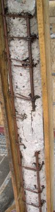 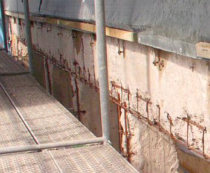 Herrgottsack und Sackzement! Wieder folgt man dem satanischen Zeitgeist des Industrialismus und schwafelt den armen - allzu leichtgläubigen? - Kirchenmäusen eine auch unter dem Aspekt der Schlagworte "Solarabsorber, Betonkernaktivierung" völlig unsinnige "Dämmung" auf. Wie soll bitteschön die Betonaußenhülle nach äußerer "Beschattung" durch Dämmung aus Fasern und Schäumen die kostenlos eingespeicherte Solarenergie sowie Wärmezustrahlung aus der Bauwerksumgebung heizkostenmindernd verwerten? Das kostet oft nur und bringt gar nix, wie die Beispiele hier zeigen: [Gedämmte Buden ohne Energieeinsparung](7fehrtab.md). 

So programmiert man weitere Bauschäden ohne Ende vor: 

Nur allzubald wird einem die erbärmliche Wärmedämmfassade - trotz aller Verpestung durch Fungizide, Algizide und Brandschutzhemmer - naß, verpilzt und veralgt als Sondermüll um die Ohren fliegen. Und die dichten Isoliergläser können nicht mehr wie das Einfachglas bisher die überschüssige Raumluftfeuchte in der Heizperiode abkondensieren lassen und damit den Kirchenraum trocken halten. 

Todsichere Folge: 
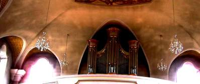 Mehr Nässe an den Wänden und Decken, mehr Staubablagerung und Verrußung, schneller wiederkehrende Intervalle für die Rauminstandsetzung. Bei mehr als fraglichen Energiespareffekten auch durch Isolierglasfenster, die - wenn schon - wohl kaum wirtschaftlich begründbar sind und außerdem zu einem weiteren Bauschadensrisiko führen: Die nun nicht mehr an den Fenstern abtropfende Überschußfeuchte - Ergebnis falscher Heizmethode und unzureichender Lüftung im Feuchtefall - muß zwangsläufig in die Wand und Decke rein - und wird dort für höhere Korrosionsraten der vor sich hin rostenden Bewehrungseisen des Stahlbetons sorgen. 

Details hierzu finden Sie hier: [Dämmstoff näßt auf, rottet, fällt von der Wand und kann Solarstrahlung nicht verwerten - außer zur irren Ausdehnung und Abwölbung vom geringer temperaturdehnfähigen Untergrund](213baust.md), [Richtig und falsch heizen - die Hüllflächentemperierung](7temper.md), [Sind Isolierfenster das Gelbe vom Ei?](23bausto.md) 

Am 6. September 2007 berichtet Ludwig Haaf dann in "Bote vom Unter-Main" vom Fortgang der Sanierung: 

_**"Nur die Pfeiler stehen noch** 
... Die Arbeiten an den Betonpfeilern und der Einbau eines völlig neuen Fensters sollen ... etwa 250 000 Euro kosten. 

Derzeit sind die Sanierungsarbeiten für die Betonpfeiler in vollem Gange. Zunächst wurde der lockere Beton abgeklopft und die Stahlarmierung mit Sand abgestrahlt. Nachdem nun an den freigelegten Eisenträgern ein Rostschutz angebracht ist, werden die Pfeiler eingeschalt und mit Beton ausgegossen. ..._ 

Einige Bilder des Sanierfalles - der freigelegte Stahlbeton-Fenstersturz und die freigelegten Fenster-Pfeiler - von Ludwig Haaf runden diesen traurigen Sanierfall ab. 

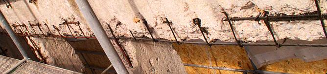 Der armen Kirchengemeinde - von ihrem schnöden Saniermonster dank moderner Kirchen- und Bauobrigkeit schon an den Rand des Bettelstabs gebracht - ist noch viel Glück zu wünschen. Sie soll mal kräftig weitersparen - für das gewiß allzu bald sichtbar werdende nachkommende dicke Ende. Hoffentlich hat es ein noch paar reiche Jünglinge, die unbedingt in das moderne Himmelreich kommen wollen und solch Dämm-Plunderpfusch bezuschussen ... 

Ein weiterer von unzähligen unendlichen Pflegefällen wie all die Pfuschbauten mit liederlicher, bzw. von Anfang an mißlungener Bauausführung aus selbstzerstörerischem Stahlbeton und [Zementmörtel](2beton15.md), die unsere Moderne so grausam schlecht und menschenfeindlich versauen - oder in Anbetracht des erbsündigen Menschen und des bocksfüßigen Fürsten dieser Welt menschengerecht aufpeppen? 

Das Obermain-Tagblatt berichtet am 29.11.02 von einer evangelischen Kirche:

_**"Betonsanierung an Kirche** 
Baukosten 41500 Euro / Tischabendmahl der Frauenhilfe 

... (XY) gab bekannt, dass die Abendmahlspenden der Frauen für die geplante Betonsanierung der evangelischen Kreuzbergkirche verwendet werden sollen. [...] Auf Grund mangelhafter Bauausführung bei der Errichtung des Gotteshauses in den Jahren 1970/71 halte die Außenfassade der Kirche den Witterungseinflüssen nicht mehr stand. Deshalb sei eine gründliche Betonsanierung der Kirche mit anschließender Versiegelung der Fassade unumgänglich.

[...] evangelische Landeskirche hat [...] Dringlichkeit der Maßnahme anerkannt. Allerdings erwarte die Kichenleitung von der örtlichen Kirchengemeinde, dass sie einen beachtlichen Teil der Baukosten von 41500 Euro selbst aufbringt. Die Gemeinde benötige deshalb Spenden der Gläubigen. ...-bk-"

_ Schon lustig! Erst zwingt die qualitätsfeindliche Nachkriegsverschwörung aller Baubehörden auch via Landeskirchen- und Diözesanbauamt Brutalobetonshit in den Kirchenbau. Ohne Rücksicht auf regionale Bautradition, ohne Sinn und Verstand für Schönheit, Harmonie, Baukonstruktion und Baustoffeigenschaften. Es mußte halt unbedingt das Allerhäßlichste und Allerschlechteste sein, womit ein moderner Kirchenbau dem braven Kirchenvolk beweist, wie schlau die hohen Kirchbauherren sind und wie billig deren honorarbeschnittenen Architektenlieblinge Konstruktionsschund des neuen Bauens aus den Zeichenmaschinen rausfunscheln. Oft gegen die besonnenen Kräfte der Kirchengemeinde. Eben total kritikresistent, da ideologisch festbetoniert auf Häßlichkeit und besserwisserischem und menschenverachtenden Menschenhaß hoch 3. "Lasset uns Menschen schaffen", dachte man da wieder mal, aber man wollte eben modernere, als der Liebe Gott sich einst ausgedacht hatte. 

Und dann, wenn diese bald leergezogenen Selbstzerstörungshütten endlich wegrosten, findet man flugs plumpe Ausreden ("mangelhafte Bauausführung" - ja aber, wer hat denn diese menschen- und damit auch gottverachtende Mistbauweise mit all den teuflisch-heimtückischen Material- und Konstruktionseigenschaften anno dunnemals und auch heute und wohl - man kennt doch seine Pappenheimer! - bis zur so sehnsüchtig nach solchen Antichristlichkeiten ersehnten Wiederkehr unseres Herren Jesus Christus gefordert, durchgesetzt, geplant, ausgeschrieben, baugeleitet, abgenommen? Bestimmt nicht die armen Kirchenschafe und ihr bauahnungsloser Hirte, die gar nicht mal so selten lieber dem alten "Aberglauben" an einen gnädigen Gott im Himmel und auf Erden weitergefrönt hätten, aber dank der weisen Kirchenleitung partout nicht durften und zur Umerziehung in die Betonwüste verbannt wurden!). Und läßt die Kirchengemeinden für vergebliche Reparaturversuche Zaster löhnen. Wobei die Maßnahmen ("Versiegelung" (Johannesapokalypse?)) bestimmt nicht für den Jüngsten Tag, sondern wieder nur knapp bis über die Gewährleistungsfrist "taugen". Diese sind nämlich aus dem selben Mist wie die Ursprungsplanung. Aber diesen reinen Wein schenkt man dem doofen Kirchenvolk besser nicht ein. 

Die katholische Kirche will ihre Betonruinen gar abreißen, wie erste Pressemeldungen im Herbst 2003 verlautbarten. Gute Lösung: wenn in die mehr und mehr gebetsbefreiten Zonen eh keiner mehr mangels sinniger Unterhaltung neigeht, warum dann weiter unterhalten? Nur wegen Denkmalschutz? Die gruseligen Buden werden ja inzwischen als Zeugen einer (scheinbar) abgeschlossenen Epoche unter Schutz gestellt und in Denkmallisten eingetragen. Abruchtipp zum Kostensparen und Versicherungsgeld einsacken: Mit Flugzeugangriff a la 9/11. A weng a Spaß muß scho sei, sunst gät kaaner mit auf die Leich.

Genauer wird die Problemlage am 7.5.04 in der SZ (S. 43, _"Gotteshaus günstig gegen Gebot abzugeben"_) in einem Interview mit dem Theologen Marcus Nitschke beschrieben:

_"Marode Gotteshäuser und kein Geld für die Renovierung - sollen die Kirchen für das Problem eine radikale Lösung wählen? [...]

**SZ:** Münchens Protestanten müssen radikal sparen. Wenn es so schwierig ist, Kirchen zu verkaufen, zu welcher Alternative raten Sie dann? 
**Nitschke:** Nicht nur die Protestanten müssen sparen. Man muss deutlich sehen, dass es für viele Kirchengebäude, vor allem in Randlagen, keine tragfähige Nutzung mehr geben wird. Die katholische Linie hat einiges für sich. Dort steht man auf dem Standpunkt: Findet sich keine andere christliche Gemeinschaft, die die Kirche übernimmt, reißen wir sie lieber ab.

**SZ:** Solch ein Denken ist in Bayern aber noch ein Tabu. 
**Nitschke:** Dann wird es Zeit, dass man damit bricht. Natürlich denke ich nicht an unverwechselbare Kirchen, sondern an marode 60er-Jahre-Bauten. Die Kirchen gehen einfach pleite an diesen Gebäuden. [...]"

_

Resümee: Wie der Herr, so's G'scherr. Der Jahrhundertbaustoff ist das bauliche Jahrhundertproblem. Wenn schon die Großmeister der Moderne so mies und roh bauten, wie ging es dann den Kleinmeistern? Am mangelnden Stahlgehalt kann das aber nicht liegen. Sehen Sie die Betonbauwerke vor ihrer Nase an! Die sind auch heute noch nicht besser. Von den Eigenschaften des Baustahls, wegen dessen hoher Schrottanteile in "chemischer" Korrosion ohne Wasser und Sauerstoff von außen zerfallen zu können, ist in dem Projektbericht nicht einmal die Rede. Auch nicht davon, daß unter den kunststoffhaltigen CO2-Bremssanieranstrichen nach deren schneller Zersprödung der Betonzerfall doppelt so geschwind vor sich gehen kann - sie sorgen für ideales Korrosionsklima. Und hier präsentiere ich aus dem Archivmaterial des Bistums Würzburg ein paar fränkische Betonmonsterkirchen der 60er Jahre, die wegen ihrer brutalen Betonschäden abgerissen werden sollen, dazu auch die zugehörige [Pressemitteilung des Bistums "In der Diözese Würzburg werden in den kommenden Jahren drei Betonkirchen der 1960er Jahre abgerissen ..."](http://www.bistum-wuerzburg.de/bwo/dcms/sites/bistum/information/medien/pressestelle/nachrichten/index.html?f_action=show&f_newsitem_id=23876##): 

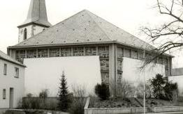 Katholische Pfarrkirche St. Jakobus d. Ä. Waigolshausen 
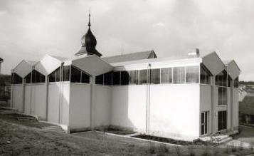 Katholische Kirche Waldfenster, Lkr. Bad Kissingen 
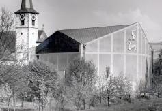 Katholische Sankt-Immina-Kirche in Himmelstadt 

Die hier gezeigten Schwarz-Weiß-Archivbilder des Bistums dürften knapp nach der Erbauung geknipst worden sein und verschweigen die gravierenden Korrosionsschäden an der grottigen, aber diözesanbauamtsmäßig geförderten Stahlbetonitis. "Sanierung teurer als Neubau" titelt die Mainpost zum Thema. Fahren Sie selbst vorbei und gucken Sie sich die Baupfuschkatastrophen an, da braucht es viel Gottvertrauen und Gebete, um dort heiligmäßigen Gedanken nachzugehen und an die Weisheit der gottgegebenen Obrigkeit weiter zu glauben ... ;-) Und über den subbersagrahlen Bauschtil nach bauamtlichem Geschmäggle sang mer lieber nix. Der liebe Gott wird sich schon wohlfühlen in solch' regionaltypisch fränkischen Baywabunkern, dem graust es ja auch sonst vor gar nix ...

Echt göttlich auch die reich bebilderte Diskussion auf kreuz.net zum Abriß der scherz-katholischen Betonkirche in [Sailauf, eine 1971er "Auferstehungskirche"](http://www.kreuz.net/article.9584.html) bei Aschaffenburg, Bistum Würzburg, die entsprechend des wahren Konzilgeists nach dem 2. Vatikanischen Konzil (2. Vatikanum) der modernen evangelischen Landeskirchenverräterei nicht nur dem Namen, sondern auch der Unform nach folgte.

Es geht aber auch anders, Gottseidank: Wir gründen ein Kloster (Video von Konrad Fischer) 

Ein spektakuläre Beispiel der menschenfeindlichen Betonitis bietet die Berliner Schwangere Auster (Kongreßzentrum), heute Haus der Kulturen der Welt. Die fiel gräßlich erst anläßlich der Jahrestagung der deutschen Makler am 21. Mai 1980 aus heiterem Himmel ein, brachte dabei den Journalisten Hartmut Küster vom SFB (Sender Freies Berlin) um, wurde neu aufbetoniert und CO2-geschützt - Wiederaufbaukosten rund 25 Millionen Euro, typischerweise ein Vielfaches der ursprünglichen Baukosten, und rostet und reißt schon wieder gar gräßlich vor sich hin. Hin und von außen angucken, solange sie noch steht. Berlin ist ja immer noch eine Reise wert.

Auch in der Schweiz steht es um die zur Pseudoreligion erhobene Betonmoderne nicht besser als anderswo. Eines der künstlerisch als hochwertig eingeschätzten Bauwerksensembles aus Beton steht in Dornach. Dort hat Rudolf Steiner für sein esoterisch angehauchtes Goetheanum als Zentrum der Anthroposophie aus dem Niederbrand des aus Holz erbauten Vorgängerbaus die seiner Formgebungsmethode nahestehende Betonbauweise gewählt. In ihr kann man skulptieren, was das Zeugs hält. Es folgt ein Rundgang um den Hauptbau mit seiner Vollsichtbetonfassade, inzwischen bzw. für manche ebenfalls ein heiligmäßiger Sakralbau der Moderne (alle Bilder und noch viele mehr von Konrad Fischer):

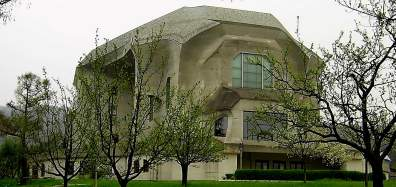 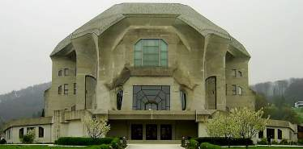 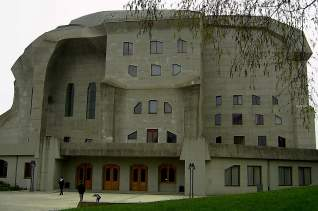 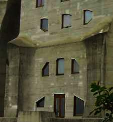 Die sich hell abzeichnenden Flecken sind jüngere lokale Betonsanierungen. 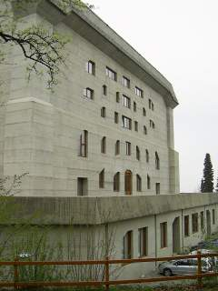 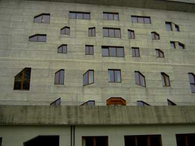 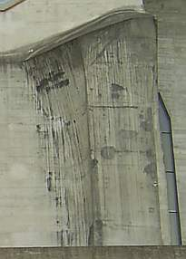 Hier sind es die dunklen Flecken, die auf örtlich begrenzte Betonreparaturen verweisen. 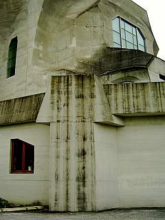 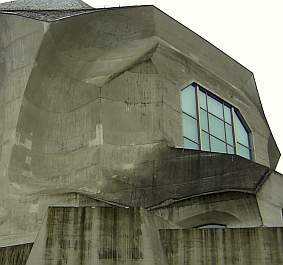Hier wieder die hellen. 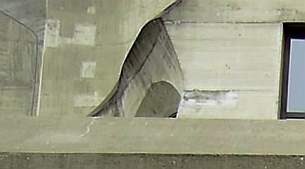 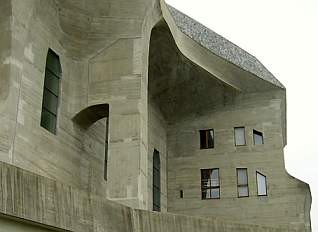 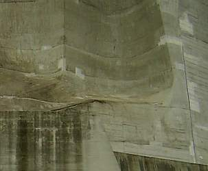 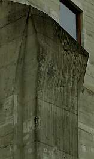 Nun ist gegen eine lokale Reparatur von Schäden in der Betonoberfläche nichts einzuwenden. Auch nicht, wenn sie sich als Flickerlteppich zeigt. Solche Erscheinungsbilder haben in gealterten Fassaden Tradition und in der Reparaturmethode sicher auch Berechtigung, verweisen sie doch auf den unvermeidlichen Alterungsvorgang. Kaschierung, Retusche, Überdeckung, Unkenntlichmachung als Alternativen sind eigentlich keine: Erstmal kosten sie mehr Geld, das dann der erhaltenden Reparatur fehlt, zum zweiten altern sie nach einiger Zeit doch unerbittlich auseinander. Problem bei der Betonsanierung ist aber, daß der Schaden immer weiter fortschreitet, in der Fläche und in den Bauteilkern. Und so stellt sich bald die Frage, wie lange der Spaß noch weitergehen soll. 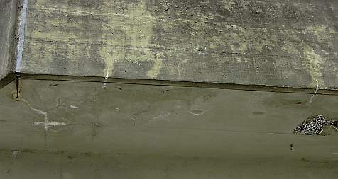 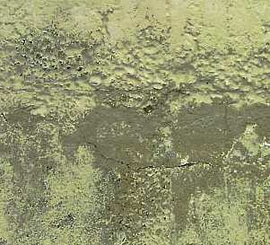 Hilflos fällt die Bauwerksreparatur wie immerauf dieLobpreisungen und verklärenden Gesänge der Bauchemie herein: Ihre Weissagungen machen uns weis, daß mit klebrigen Pampen aus ihrer Hexenküche - unter wissenschaftlicher Beweihräucherung am Kreuzweg in Schwarzmondnächten nach dreimaligem Käuzchenruf eingekocht - die Bauwerksalterung gestoppt werden könne. Porenverkleisternde und trocknungsblockierende, versprödende Kunstharzgallsüppli sollen in der Lage sein, den zerstörerischen Zutritt von CO2 - Kohlendioxid in die empfindliche Betonoberfläche zu stoppen. Schön gedacht, aber dieWahrheit sieht anders aus. Das Zeugs macht die irren Temperaturbewegungen an Fassaden bestimmt nicht lange mit, reißt lokal auf, läßt Wasser rein aber schlecht raus und beschleunigtso die flächige Schädigung. Klaro sieht es erst mal abnahmefähig aus (das ist der eine Trick), klarissimo ist die Dampfdiffusionsfähigkeit im Labor gegeben und einwandfrei nachgewiesen. Doch wer verrät dem Kunden, daß Kunstharze an Fassaden durch UV, Sonne, Wind und Wetter unausweichlich schnell verspröden und imBaustoff garkein Dampf zum diffundieren existiert - trotz Glaserdiagramm! - sondern wegen der unerbittlichen Kraft derWasserstoffbrückenbindung das allermeiste H2O in flüssiger Form in den Baustoffporen vorliegt und somit 1000:1 kapillar entweichen muß? Pech für die synthetisch verschmierte, verstopfte und blockierte Fläche - da geht das nämlich nicht mehr, wie es vorher ging. Und damit wird der schädliche Angriff kohlensäurehaltiger Gewässer auf die rostempfindlichen Armierungseisen durch Karbonatisierungsbremsen eben verstärkt. Diese peinliche Realität läßt sich nach einiger Zeit an entsprechend sanierten Flächen allerorten belegen. Leider schaut niemand hin. Detail: 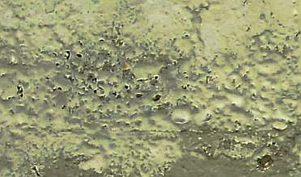Was da kraterförmig abplatzt ist bestimmt eine in der schweizer Betonsanierung zugelassene und bestens zertifizierte CO2-hemmende Beschichtung eines renommierten international tätigen Herstellers / Chemiegiganten. Taugt trotzdem nix.

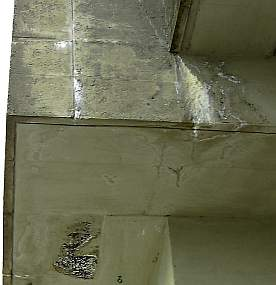 Die lösende Kraft des lebendigen Wassers holt Kalksinter aus der Tiefe des Betons. Hier ist was undicht, gerissen, gelöchert! 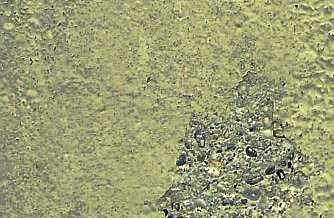 Die drückende Kraft des Wassers sprengt störende Chemiepampen, wenn's drauf ankommt, auch flächig ab. Untersicht als Detail aus vorigem Bild. 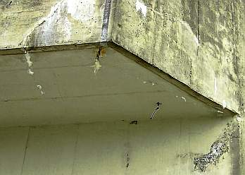 Exponierte Bauteile sind selbstverständlich besonders gefährdet. 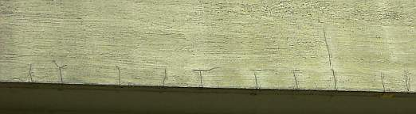 Und gerade an Kanten reißen Betonflächen besonders gerne, das bringt besonders viel kohlensaures Wasser und ausreichend Sauerstoff an die korrosionsgefährdeten Betoneisen der Korbarmierungen, der Flächenarmierungen und alle sonstig vorhandenen Betonstähle. 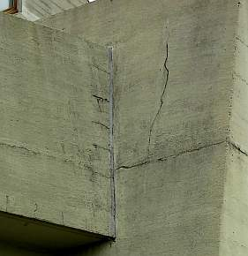 Es reißt, es rostet, es bröckelt, es bricht. Da hilft eben keine Beschichtung, die nur dem Chemieumsatz, aber keinem Bauwerk dient. 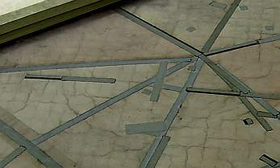 Auch keine Flachdachbahn. So sieht es dachseits aus. 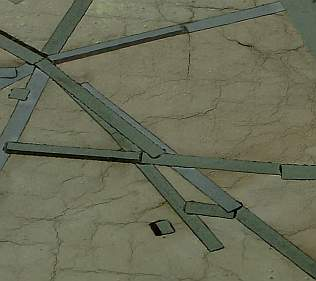 Das kann auch im Detail nicht begeistern. Spannend auch hier der Versuch, der flächigen Verwesung durch lokale Reparaturen beizukommen. Motto: Für wo am nötigsten. 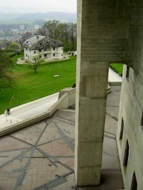 Der Blick schweift zum Archivgebäude. 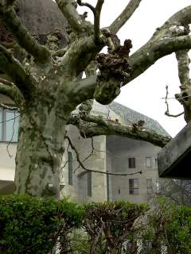 Herrlich, wie sich die naturale Altanenform mit dem expressiven Betonimus des Rudolf-Steiner-Archivbaus so trefflich ergänzt. 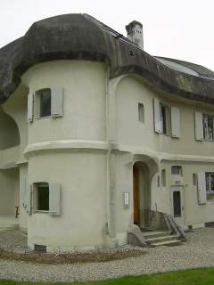 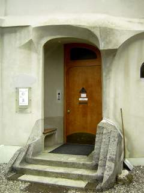 Lehrbuchmäßig! 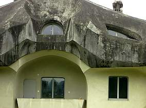 War das eine Farbe oder ist das natürliche Bewitterung? Schwer zu entscheiden. 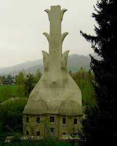 Dieses vulkanöse Haus birgt die Heizungszentrale für die Bauwerke des Goetheanums. 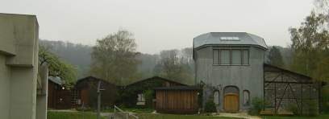 Nahebei steht die Schreinerei des Goetheanums, ein Holzbau im Style anthroposophischer Architekturgestik, daneben historische Werkstattschupfen. 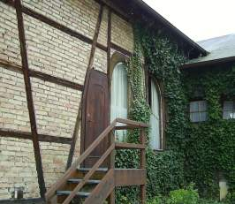 Im Detail auch anthroposophisch angehaucht. 
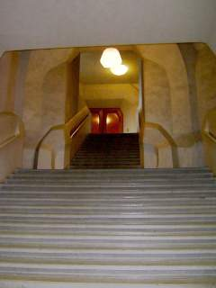 Nun geht's hinein und hinauf: 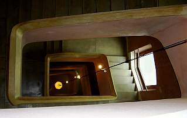 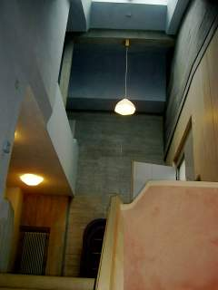Ein reiches Spiel der Formen und Farben. 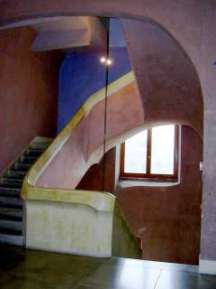 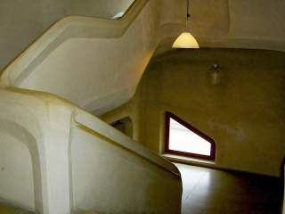 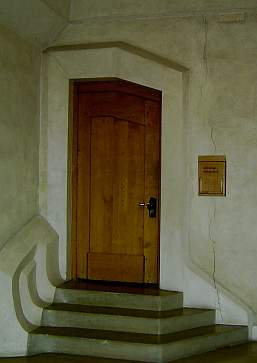 Leider reißt der schöne Bau auch innen etwas. 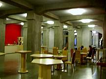 Die Cafeteria. 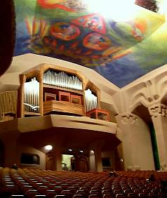 Der Festsaal mit Orgel. 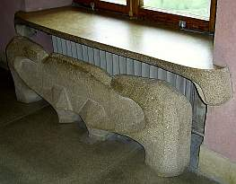 Die Heizkörperverkleidung. 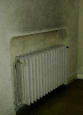Auch hier [verschmutzt das konvektive Heizen](7temper.md) die Lungen und Räume. 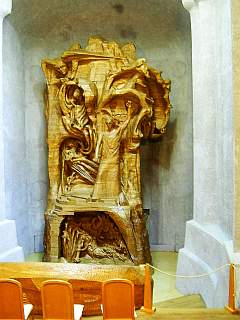Die berühmte Skulptur in der "Kapelle" - Der Mensch in der Auseinandersetzung mit den Kräften des Geistes und der Natur. 

Diese Auseinandersetzung kann bezüglich den offenbar weitgehend unbekannten Geheimnissen des Stahlbetons zu folgenden Einsichten führen: 

1. Stahlbeton besteht aus rostendem Eisen und karbonatisierendem Zementstein - eine Mischung aus den Zuschlagstoffen Sand und Kies sowie dem Bindemittel (Leim) Zement. 

2. Während seiner Kinder- und Jugendzeit ist das Eisen im Stahlbeton durch die Alkalität des noch nicht karbonatisierten (durch Kohlendioxidaufnahme zu Kalkstein erhärtenden) Zementsteins rostgeschützt. Gleichwohl bilden sich schon bei der Abbindung allein schon durch die sukzessive in verschiedenen Wirkungsphänomenen erfolgende Wasserabgabe / Erhärtung und das damit verbundene Schrumpfen, Kriechen, Quellen, Dehnen, Schüsseln, Beulen und Reissen mehr oder weniger ausgeprägte Rißsysteme im Beton, die dann Wasser und Luft ins Innere dringen lassen. Diese Risse nehmen bei zunehmender Alterung zu, ebenso durch Zufuhr wässriger Kohlensäure die Umwandlung des alkalischen und im Betoninneren unabgebundenen Kalziumhydroxid in das neutrale Kalkgestein auf der Betonoberfläche (Versinterung). Der alkalische Rostschutz geht damit perdu. Die Konstruktion sprengt sich über kurz oder lang selbst auseinander, da erstens die nach der Ersterhärtung des Betons mit seinen feingliedrigen und dichten CSH-Phasen (Calcium-Silikat-Hydratphasen) und Ettringiten entstehende Karbonatisierung mit den dabei aus Ca(OH)2 und CO2 und H20 entstehenden klumpigen CaCO3-Karbonaten das dichte Betongefüge sprengen und zermürben und dann das für die Eisenoxidation erforderlichen Wasser und Sauerstoff besten Zugang zum Armierungsstahl / BEwehrungseisen finden und so zweitens die dabei enstehende Rostschicht den Beton darüber absprengt. Leider betrifft diese grauenhafte Rostsprengung auch alle Naturwerksteinbauwerke seit urdenklichen Zeiten, die auf Eisen-, nicht auf Bronzeanker für den trotz aller Mörtelei zusätzlich notwendigen Steinverbund gesetzt haben. Und seit dem 19. Jahrhundert die Metallanker nicht in Bleiverguß korrosionsgeschützt, sondern in Zementmörtel eingebettet haben. 

3. Ein wesentlicher Faktor der dauerhaft schädlichen Rißbildung, die das zerstörerische Geschehen bisweit in die Tiefen der Betonkonstruktion tragen, sind die Temperaturspannungen. Stahlbeton bewegt sich unter Temperatureinfluß etwa doppelt so sehr wie Ziegelmauerwerk: 1,2 mm je 100 Kelvin. Logischerweise weisen dünnbrüstige Bauteile die größten Temperaturspannungen auf, sie können mangels Speichermasse die witterungsbedingten Temperaturunterschiede am schlechtesten wegpuffern. An Ecken und bewitterten Flächen verstärken thermische Schockzustände aus Schattenbildung, kalter Beregnung, Wind und Beeisung den Schadensfortschritt geradezu dramatisch. Hier muß der Bauwerksschutz - soweit es die Gestaltung zuläßt, am ehesten ansetzen. 

4. Eine Reparatur bzw.Betonsanierung darf die Gesetze des Materialverbunds und der Feuchtetransporte in Baustoffen nicht vergessen. Keine physikalisch und chemisch unterschiedlichen Reparaturbaustoffe (Chemiemörtel), keine trocknungsblockierenden, rißversprödenden Beschichtungen (es gibt doch Alternativen)! 

5. Eine langfristige Sanierung muß wie bei allen Reparaturen an historischer Substanz die gleichen Regeln des Dreischritts von der Bestandsaufnahme (Anamnese) über die Diagnose (Analyse des Schadensbildes im Hinblick auf Schadensursachen und Reparaturfähigkeit) hin zur Therapie (technisch sinnfällige, wirtschaftlich vertretbare und möglichst langfristig wirksame Reparatur) befolgen. Erfolgsnachweis vor der Sanierung über Bemusterung, auch als Kalkulationsgrundlage für Budgetierung und kostensichere öffentliche Ausscheibung! Was man hier allerorten jedoch geboten bekommt, wird diesen theoretisch anmutenden Prinzipien nicht immer in alle Gänze gerecht. Und die Einflüsterungen der Sanierberater mit Umsonstplanungsleistungen (sehrstens erwünscht bei baustoffunkundigen Planern) sowie branchenüblichen Gratifikationen (immer erwünscht bei unterhonorierten Dumping-Planern) zur Manipulation der Planung in vorgegebene (oft überaus untaugliche!) Material- und Reparaturkonzepte trägt dafür wohl ein gerüttelt Maß an Verantwortung. C'est la vie. 

Daß es im Jahre 2007 auch das architektonisch und erinnerungskulturdogmatisch heiß umstrittene Symbolbauwerk der Holocaustreligion (so manche auch jüdische Kritiker) - das Holocaust-Mahnmal/Holocaust Memorial in Berlin - trifft, läßt die National-Zeitung am 17.8.07 hämisch titeln: _"Risse im Bewältigungs-Monstrum - Holocaust-Mahnmal bereits nach zwei Jahren ein Sanierungsfall"_. Auch alle "normalen" Zeitungen (im Ausland _"Cracks found in foundations of Holocaust memorial in Berlin", "Cracks appear in Berlin's Holocaust memorial", "Monument in Danger? Widespread Cracking Found in Berlin's Holocaust Memorial", "Cracks - some several metres long - have appeared in the two-year-old Holocaust memorial in the heart of Berlin.", "Two years on, Berlin Holocaust memorial needs repair", "The Memorial to the Murdered Jews of Europe in the centre of Berlin is Germany's central Holocaust memorial site, a place for remembrance and commemoration of six million victims. Lots and lots of pillars of the holocaust memorial in berlin already show cracks or even worse holes. Some pillars are to even too dangerous to pass by.", "Berlin's Holocaust Memorial deteriorating after just two years", "Cracking Memorial. It's unlikely that jumping tourists are to blame, but Berlin's Holocaust Memorial, which opened two years ago, is already in need of repairs.", "Berlin to repair Holocaust site. Cracks have appeared in 393 of the 2711 concrete slabs that form the Holocaust memorial in central Berlin.", "Fissure in slab at Holocaust memorial." "Berlin's two-year-old Holocaust memorial already in need of restoration"_) berichten geradezu hingebungsvoll, was die "Selbstbezichtigungs-Architekur" des geschätzten Kollegen Prof. Peter Eisenman vor allzulanger materieller Verewigung unserer Dauerschuld bewahrt: Risse, die sich teils meterlang durch die bis zu knapp fünf Meter hohen Schandmal-Klötze ziehen. Optisch super betont durch weiße Kalksinterschlieren, die nun aus den Rissen tränengleich (Besucherin: "Wie Tränen") herausgespült werden. Sie enstehen aus dem noch unabgebundenen Ca(OH)2 - Kalziumdihydroxid im Betonkern, das an der Oberfläche zu Kalksteinkarbonat CaCO3 abbindet. 

Vorwiegend trifft es die Blöcke des Süd-West-Bereichs des Stelenfelds. Logisch: Dort sorgt die Sonne einmal für bessere Austrocknung aus den Tiefen des Betons, dabei entstehen erhöhte Schwundrißrisiken. Und obendrein sorgt die Sonnenhitze auch für erhöhte Temperaturbeanspruchung und Temperaturspannung. Die seitens der Verantwortlichen als Sommerlochthema verharmlosten Risslein sollten dann in Gewährleistung mit Kunstharz verpreßt werden. 

Meine Weissagung 2006: Alle Blöcke werden über kurz oder gar nicht so lang reissen müssen. Eine typische Eigenschaft des Stahlbetons, siehe oben. Schlauerweise hat die offensichtlich betonerfahrene Baufirma vor Baubeginn schon auf die Möglichkeit der Rißbildung hingewiesen. Na, vielleicht wird sich ja ein guter Ostküsten-Wiedergutmachungsanwalt finden, um solch Widerspenstigkeiten in bewährter Manier zu brechen. Hat die Stadt Berlin doch schon das milliardenschwere Grundstück gespendet, der Bund die Baukosten mit unerwartet hohen 28 Millionen Euro aus Steuermitteln spendiert - da werden doch die jetzt schon anfallenden Millionen für den Dauersanierungsfall Stahlbeton aus den bautechnischen Kriegsgewinnen aus der Portokasse abzudrücken sein. Daß auch die Lichtanlage durch ständige Ausfälle unerwünschte Düsternis über dem Stelenfeld ausbreitet, daß Regen die Pflasterflächen unterspült bis zu metertiefer Lochbildung - sind da nur weitere Marginalien eines Trauerspiels von Anfang an. 

Typisch Chuzpe, was Architekt Professor Peter (!) Eisenman (!) - sollen wir auf diesen Stahlbetonfelsen unsere neue Kirche bauen? - zum Thema in der SZ am 8.8.07 verkündigt: _"Wenn Sie 2.700 Weintrauben kaufen, sind auch ein paar faulige darunter. [...] Immerhin stürzt hier nichts ein und tötet Menschen wie bei der[Brücke in Minneapolis"](2beton10.md#minneapolis)_ [am 1. August 2007] - Na ja, hätte man für die Milliardenkosten des so trefflich eisenbetonierten Schuld- und Sühneschreins nicht ein paar Verhungernden je ein halbes Körnchen Reis zukommen lassen? Oder wenigstens den noch lebenden Opfern des Naziregimes oder deren Nachfahren? 

Und weiter: 

_"Wenn immer Sie ein Gebäude dem Regen, der Sonne und dem Frost aussetzen, werden Sie früher oder später Probleme haben. Und in einem extremen Klima wie dem in Berlin erst recht. ... Wenn Sie mit Beton bauen, wissen Sie nie, wie genau das Material altern wird. Sie wissen nie, ob sich die Farbe verändern wird, ob der Rostton von der Stahlarmierung durchkommt. Alles Mögliche kann passieren. Schauen Sie sich die älteren Betonbauten in Berlin an. Da sehen Sie die tollsten Sachen. Schauen Sie sich Norman Fosters Gebäude an. Beton bleibt nun einmal nicht lange monolithisch."_ 

Ach übrigens, der Herr Prof. Peter Eisenman forderte für seinen selbstverdichtenden Spezialbeton für das Berliner Extremklima (War es die Berliner Luft, Luft, Luft?) übrigens als eines der wesentlichsten Kriterien: _"Keine Risse"_. Vielleicht nur ein Trick des deutschfreundlichen Architekturprofessors, und ganz absichtsvoll ein auf schnellstmögliche Selbstzerstörung angelegte Mahnmalerei? Lachen Sie sich krank über den Lobhudelbericht _"Dezentes Anthrazit für die 2751 Betonstelen des Holocaust-Mahnmals"_ vom 7. Januar 2004 über die genialen Lösungen für die extremen Anforderungen auf [www.baulinks.de/www.neubau24.de](http://www.neubau24.de/news/baulinks/webplugin/2004/0016.php4), Zitat: _"Beton hoher Qualität ..., der sehr gleichmäßig, fließfähig und selbstentlüftend ist, und außerdem alle Grenzwerte der DIN 1045 und EN 206-Teil 1 erfüllt. ... Zum Einsatz kommen speziell ausgewählte Sande und Kiese, der Spezialzement Optacolor, Basaltmehl, Eisenoxid-Farbpigmente und PCE-Hochleistungsfließmittel. Der w/z-Wert liegt bei maximal 0,34. Ein ausgeklügelter Mischvorgang sorgt für die gleichmäßige Verteilung der Farbpigmente und hohe Homogenität des Frischbetons. Die bis zu 5 Meter hohen Stelen werden im Fertigteilwerk mit der Betonpumpe in einem Zug betoniert. Prof. Eisenman ließ sich bei der Begutachtung der ersten Stelen zu der Äußerung hinreißen, "er habe in Berlin nie besseren Beton gesehen". Fazit: Die Berliner Betonstelen zeigen uns heute, was morgen möglich sein wird."_ 

Ja, stimmt genau, aber man sieht eben nur, was man weiß, vielleicht auch als Professor! Es kommt dann alles, wie es kommen mußte: Schon neun Monate nach der Eröffnung tauchten ja die ersten Betonrisse an den dahinreißenden Stelen auf. Sie bestehen aus wasserarm angemachtem selbstverdichtetendem Spezialbeton mit überwiegend Mikroporen und deswegen besonders glatter Oberfläche. Das extremistisch harte Zeugs aus SVB-Selbstverdichtendem Beton gilt als besonders empfindlich für Rißbildung, einmal durch die üble Temperaturdehnung, die bei Stahlbeton (unbekannterweise?) gegenüber anderen Wandbildnern mit 1,2 mm/m bei 100 K Temperaturunterschied sehr hoch liegt [(Details Temperaturdehnzahlen von Baustoffen im Vergleich)!](29bau13.md) Außerdem muß doch das Anmachwasser raus dem gegossenen Bauteil. Wegen der vergleichsweise hohen Wasserrückhaltung der Betons dauert das eben. Auch wenn es sich bei den Stelen - abgesehen von den ganz kleinen Blöcken - nicht um Massivbetonblöcke, sondern um Hohlblöcke handelt mit nur ca. 10 bis 12 cm dicken Wandungen - die dann in besonderem Maße - unten noch kalt, oben dank Sonne extrem heiß - auch den angreifenden Kräften aus der Temperaturdehnung ausgesetzt sind. Und zwar himmelsrichtungsabhängig in ganz unterschiedlichem Maß, was weitere Zwängungen verursacht. 

Der besonders feinkörnige Beton kann wegen seiner erhöhten inneren Oberfläche auch - trotz aller wasserbedarfmindernden Fließmittelzusätze - besonders viel Anmachwasser binden, das dann zu einem erklecklichen Teil wieder raustrocknen muß. Dabei hinterläßt es "Fehlstellen", die sich zu Rißsystemen kumulieren können, aus denen der kapillar aufgenommene Regen dann das noch unabgebundene Kalziumhydroxid (Ca(OH)2 auswäscht, das dann durch CO2-Aufnahme zu Kalziumkarbonat CaCO3 (Kalkstein) erstarrt. Je nach lokaler bewitterungsbedingter (Sonnenschein, Verschattung, Beregnung ...) Situation, Bewehrung, Bauteilgeometrie und herstellungsbedingtem Wassergehalt entwickeln sich dann die Austrocknung, Rißbildung und Ausschwemmung von Kalziumhydroxid / Kalziumdihydroxid mit folgender Kalksteinbildung unterschiedlich. 

Ob der Kunde von diesen betontypischen Unabänderlichkeiten vorher wußte und diese so bestellte? Der Architekt? Seine Doktorarbeit "Die formale Grundlage der modernen Architektur" wird auf dem o.g. Link so gepriesen: _"Sie wurde 1963 am Trinity College in Cambridge (GB) als Dissertation eingereicht und gibt sich als eine "erkenntnis-theoretische" - und nicht bloß "ideengeschichtliche" - Erörterung der Grundlagen des architektonischen Entwerfens der Moderne."_ Und die Allgemeine Bauzeitung berichtet am 24. August 2007: _"Architekt Eisenman weist Verantwortung für Risse zurück ... Sein Team habe ursprünglich Stein und andere Betonmischungen vorgeschlagen ... Die Wahl des verwendeten Betons sei schließlich unter Zustimmung des namhaften Baustoffexperten Prof. Bernd Hillemeier von der Technischen Universität Berlin erfolgt. "Ich habe nicht die geringste Ahnung,wie es zu den Rissen kommen konnte". Sie zeigten aber, dass sich auch Experten irren können. ... Wir wissen ja nicht, was die Haarrisse sonst noch nach sich ziehen"."_ Genau. Denn die Risse sind kapillaraktiv und saufen Regenwasser ein. Steter Tropfen - so eine Weisheit des Volkes - höhlt den Stein. Auch den Beton? 

Was wußte die staatliche Bauverwaltung mit ihrem bautechnischem Fachpersonal als Vertreter des Auftraggebers beim Milliardenvergurke von den Betonzwangsläufigkeiten? Absichtsvolle deutsche Perfidie des Tätervolks? Vielleicht wußte die Baufirma was? Doch lesen Sie selbst: [netzeitung 12.01.2006: Baufirma sieht bröckelndes Mahnmal gelassen.](http://www.netzeitung.de/kultur/377174.html) Fein. Ende 2006 waren es 20 gerissene Stelen. 8/07 hat schon jede sechste Stele - 393, um genau zu sein - Risse. Bald jede. Hier eine kleine Bildergalerie der Schäden, die ich am 23.08.07 vor Ort vorsichtshalber mal selbst dokumentierte: 

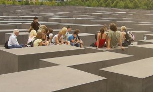Eine Schülergruppe mit Lehrer widmet sich in vorbildlich hingerissener Weise dem schönen Mahnmal, hier einige der rissigen Stelen mit den ach so harmlosen "Haarrissen" im Detail: 
                

"Die Welt online" fragt am 8.8.07 schlauerweise gleich, ob die "Entfestigung" der Stelen gar ein Teil der eisenmanschen "Wahrheit" wäre? Und _"Dem gewieften Theoretiker kommt die Sache eigentlich sogar recht. Er ist nämlich an Destabilität und Veränderung interessiert."_ Na, na, ist solch Gezweifel eigentlich schon wieder oder noch immer erlaubt bei so haarigen Themen? Da drängen sich doch die geradezu ungeheuerlichsten Assoziationen auf ... 

Am 22.01.2008 fegt ein neues Gutachten durch die Schreibstuben: Das Politmagazin Cicero war so frech und hat einen unabhängigen vereidigten Sachverständigen für Sichtbeton - den Lehrbeauftragten Joachim Schulz von der Technischen Fachhochschule Berlin - mit einem Gutachten beauftragt. Er findet im Dezember 2007 heraus, daß inzwischen schon nahezu jede zweite Stele Risse aufweist: 60 Prozent mit Rißbreite kleiner, 40 Prozent größer als 0,2 mm. Damit sind nun 1361 der 2711 Stelen mehr oder minder geschädigt. Erst waren es mal 20, dann 393, jetzt 1361 - wer bietet mehr? In nur nur einem schlappen Sommer haben sich die bekannten Schäden verdreifacht - wie soll das jemals enden? 

Dieser Schadensverlauf läßt wohl unweigerlich den purer Logik folgenden Schluß zu, daß in absehbarer Zeit auch der Rest noch drankommen wird - eben ein typischer Systemschaden, der auf die grundsätzliche Problematik des Baustoffs Stahlbeton verweist. Die im Jahr 2007 von der Stiftung angesagte Rißsanierung im Zuge der Mängelhaftung und Gewährleistung durch die Baufirma sei "an Abstimmungsschwierigkeiten mit der beteiligten Baufirma gescheitert". Ihr will man das unabänderliche Baustoffproblem in die Schuhe schieben. Auf 100.000 bis 200.000 EUR wird die derzeitig anstehende Rißsanierung inzwischen eingeschätzt. 

Meine Prognose: Das wird für diese Dauerbaustelle aus Systemgründen bestimmt auf Dauer nicht ausreichen. Die ursprünglichen, vom Bund - und damit von uns allen - komplett übernommenen Baukosten des Stelenfeldes in Höhe von 13,9 Mio. EUR (Gesamtkosten 27,6 Mio) dürften ein ewiges Millionengrab installiert haben. Man spricht von Auswechslung der gravierend geschädigten Stelen. Tipp: Noch etwas warten und dann alles neu! Oder das wertvolle Grundstück mit etwas Sinnvollerem bebauen? Ein Denkmal aus Quallenschleim für Äinschi? Die Stelenbrösel geschreddert dürften eine recht passable Fundamentverbesserung abgeben ... 

Hier ein äußerst elegisches Video der Problem-Stelen: 

Und der Link zum CICERO-Artikel: [Neue Bauschäden am Holocaust-Mahnmal](http://www.cicero.de/97.php?ress_id=9&item=2292)

Der besorgte Empörungskulturbürger fragt sich in seinem Kleinmut vielleicht, ob das auf ewig und drei Tage angelegte Fundament der sakral verehrten Holoreligion ebenso von oben bis unten, von hüben bis drüben rissig, brüchig und hinfällig wie die Stelen sein könnte und der Architekt dem materiell-ästhetischen Ausdruck geben wollte? Solche Gedanken - um nicht zu sagen gemeine Zweifel an berechtigterweise unumstößlichen Tatsachen und gerichtsmassig wohlbekannten und keines Gegenbeweises mehr zugänglichen Glaubenswahrheiten - sind aber hierzulande gaaanz zu Recht verboten und deswegen muß die richtige und selbstverständlich einzig wahre Antwort immer lauten: Aber nein!!! 

Ach, übrigens: Auch die dem Gedenken der vom im Weltmaßstab bekanntermaßen einzigartig bösen Nazis (vergessen Sie sonstige massenmordende Waisenknaben wie Napoleon, Stalin, Pol Pot, Tito, Eisenhower, Roosevelt, Churchill, die Kolonial-, Ausrottungs- und Sklavenhaltermächte USA, Belgien, Holland, Spanien, Portugal, Frankreich und vor allem England!) mit ihrer ungeheuerlich industriemäßig funktionierenden Tötungsmaschinerie ermordeten jüdischen Mitbürgern - Ehre ihrem Angedenken! - gewidmete Gedenkstätte in Stuttgart, eine 70 Meter lange Betonwand am Nordbahnhof, erst im Sommer 2006 eingeweiht, zeigt schon im folgenden Sommer 2007 die allerherrlichste Rißbildung. Alles gaaaaanz normal. Denn der nur von ganz Dummen als "tot" angenommene Beton "lebt"! Und altert in selbstzerstörerischer Manier und beraubt deswegen unsere Gesellschaft als "Diebstahlbeton" um Instandhaltungsaufwendungen über Instandhaltungsaufwendungen, wie der Fachmann und der interessierte Laie bis zum letzten Gemeindekämmerer schon lange weiß!!! Wofür jedes Betonbauwerk schon nach kürzester Zeit den jedermann sicht- und greifbaren, chemisch, physikalisch und allen kriminologischen Ansprüchen genügenden unumstößlichen Beweis liefert. Auch das Holomahnmal, das nun einer millionenschweren Wiedergutmachung der Risseschäden harrt - ganz typischerweise auf Dauer bis in alle Ewigkeit angelegt. Ein Denkmal der deutschen Schande (Höcke), auch der Betonbauweise? 

Bleibt noch die Frage, wie man die Reißerei verhindern oder wenigstens vermindern hätte können? Dazu fällt mir nur ein, erstens keinem Laborergebnis, zweitens keinem Hersteller, drittens keinem Handwerker und viertens keinem baustofftechnisch unerfahrenen Planer zu trauen, sondern vorsichtshalber unterschiedlich gemischte (es gibt ja in der Branche wenig bis gar nicht bekannte Spezialvergütungen / Additive zur Verbesserung der Rißbeständigkeit) und bewehrte (Bewehrung wirkt der Rißfreudigkeit entgegen, erhöht aber die betontypische Aufrostungsproblematik) Stelen rechtzeitig vor Baubeginn dem Berliner "Extremklima" auszusetzen, das Verhalten über eine ausreichend lange Zeitdauer kritisch zu prüfen, evtl. parallel dazu Extremklimabelastung in einer Klimakammer an Vergleichsbauteilen auszuprobieren, und anhand der kritisch gewürdigten Testergebnisse die vergleichsweise beste Bauart zu wählen. Ein spezieller reflektierender Anstrich zur Abminderung der enormen sommerlichen Erwärmung durch Solarstrahlung - ja, sowas gibt's tatsächlich! - wäre auch in Betracht zu ziehen. Das wäre das professionelle Vorgehen, zumindest in der Denkmalpflege und experimentellem Neubau, um für Fachleute ("Experten") vorhersehbare Problemlagen rechtzeitig abzuwägen und das geeignetste Bauverfahren aus den praxisnahen Bemusterungen herauszufiltern. Das gilt übrigens auch für die nun ins Auge gefaßten Sanierungstechnologien. Schaun mer mal ...
