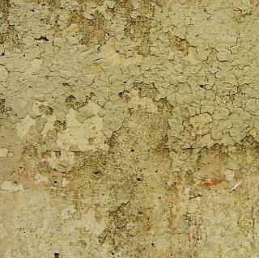

[🠔 Zur Übersicht: Stahlbeton](2beton.md)  
# Betonsanieren und die Zementberatung
**Schlimm, daß aus der sogenanten „Zementberatung“ zu den verschiedenen werkstofflichen Varianten der Betonsanierung so gut wie keine klaren, praxisgestützten Aussagen zur technisch besten Methode zu haben sind.**  
_von Konrad Fischer_

## Der Stahlbeton und der Zement 6

Inhaltsverzeichnis der Betonkapitel 

---

## 6. Betonsanieren und die Zementberatung

Schlimm, daß aus der sogenanten "Zementberatung" zu den verschiedenen werkstofflichen Varianten der Betonsanierung so gut wie keine klaren, praxisgestützten Aussagen zur technisch besten Methode zu haben sind. So jedenfalls nach meiner Recherche. Wie soll man nun die abgeplatzten Betonfehlstellen am wirtschaftlichsten sanieren - mit Spritzbeton, mit Zementmörtel, vielleicht chemiepampenveredelt? Was hält vergleichsweise am besten? Wie sieht es aus mit der Bildung sperrender Bindemittelhäutchen, für die die dispersionsvergüteten Reparaturmörtel leider nur unter Eingeweihten bekannt bzw. berüchtigt sind? Und was ist nun wirklich los mit dem Karbonatisierungsgeschehen unter craquelierten, gerissenen Kunstharz-CO2-Bremsen, die das eindringende Wasser eher zurückhalten als großzügig abtrocknen lassen?

So sieht das an einem öffentlichen Bauwerk aus nach ein paar Jahren Freibewitterung.

Die schönsten Richtlinien zur Instandsetzung nutzen eben nichts, wenn die Praxisschäden dabei außer acht gelassen werden. Das haben wir ja schon bei der Überdeckungsnorm erlebt, die dann - als alles zu spät war - geändert wurde. Von 1,5 auf 3cm Überdeckungsvorschrift.

Grundsätzlich am besten funktioniert schon nach den Gesetzen der Physik die Ergänzung von Fehlstellen mit möglichst artgleichem Material. Also originalgetreue Sieblinie, Zementsorte und Mahlfeinheit. Oberflächenstruktur gem. Bestand. Das ist zwar zunächst etwas mühsamer, als die chemieversuppte Synthetikpampe aus dem Fertigtopf, spart aber nachfolgende optische Retusche und Plastikpelle. Und die Enttäuschung, wenn die dispersiv "vergütete" Pampe schnell kaputtgeht. Sie bildet nämlich beim schichtenweisen Auftrag trennende Plastikhäutchen, die den CSH-Phasen-dfinierten Haftverbund zwischen Neumörtel und Altuntergrund dolle mindern. Außerdem blockieren Plaste die Kapillartrocknung, sie lassen nämlich - da "diffusionsoffen" - eindiffundierendes Kondensat rein, aber das dann logischerweise daraus oder vom Anmachwasser oder dank Beregnung entstehende Porenwasser nur äußerst ungern wieder raus. Steht das schon im technischen Merkblatt? Hier zählt Erfahrung und eigenes Denken.

Was man wissen muß: Historische Zemente waren gröber und lieferten dank höherem Rezeptanteil bessere Alkalitätsreserven. Es gibt auch heute noch Lieferquellen dafür. Und wenn man Reparaturflicken mittels purem Hydraulmörtel einbringt, liefert die im technischen Sinn beste Originalnachstellung auch das konstruktv beste Ergebnis. Logo!

Ein weiteres kritisches Thema stellt sich beim Umfang der technisch gebotenen Voruntersuchung. Wieviel Restüberdeckung mit alkalischer Rostschutzbremse (passivierte Oxidschicht) über dem Bewehrungsstahl ist noch vorhanden, in welchem Korrosionsstatus befinden sich die Bewehrungseisen? Was muß dafür alles zerstörerisch abgepickelt werden, um an den dann freiliegenden Eisenarmierungen die zutreffenden Feststellungen und Schlußfolgerungen für den erforderlichen Sanierungsumfang zu treffen? 

Der die nötigen Freilegungen begleitende Einsatz zerstörungsfreier bzw. zerstörungsarmer "elektrischer" Untersuchungsmethoden zur Auffindung der Armierungseisen / Bewehrung und deren Betondeckung oder die von der MPA Neuwied einsatzreif entwickelte Potentialfeldmessung zur Feststellung der unterschiedlichen negativen elektrischen Potentiale der korrodierten und der noch alkalisch passivierten Armierungseisen. Die das Potentialfeld-Meßergebnis beeinflussenden Randbedingungen wie Zusammensetzung, Chloridgehalt, Temperatur, Feuchtegehalt, Sauerstoffgehalt und Überdeckung des Betons, Sauerstoffgehalt an der Bewehrung, Schichten/Beschichtungen mit hohem elektrischem Widerstand aus Kunstharz/Synthetik/Hydrophobierungsmittel sind dabei zu berücksichtigen und das Meßergebnis durch Detailfreilegungen abzusichern, ohne das ganze Betonbauwerk dabei abzuschaben. Hinzu kommt der Einsatz des Schmidtschen Pendelhammers, auch als Schmidthammer, Rückprallhammer oder Betonhammer bekannt, bei dem der aus definierter Höhe auf die Betonoberfläche fallende Hammerkopf je nach Druckfestigkeit des Betons (oder Putzes) mehr oder weniger zurückprallt und so zu bewertbaren Meßergebnissen als Rückprallwert führt. Mit einer Wärmebildkamera kann die Betonoberfläche auf unterschiedliche Temperaturen abgesucht werden, die ihrerseits auf Hohllagen oder sonstige Gefügestörungen rückschließen lassen. Und mit Salztests, die nur an der Oberfläche das Vorhandensein löslicher bauschädlicher Salze nachweisen (Nitrat, Chlorid) kann ohne Bohrkernentnahme und Laboranalyse erste Orientierung gewonnen werden. 

Wie immer gilt: Gute Voruntersuchung lohnt sich, mindert die Baukosten und führt zur kostensicheren Planung, Ausschreibung und Abrechnung - sogar bei der Betonsanierung! Und wird dennoch allzuhäufig eingespart. Um anschließend nach besten Kräften mit den verwüstendsten Ergebnissen kaputtsaniert und die Kostenexplosion gezündet oder am falschen Ende angepackt, um nach kurzer Zeit wieder loslegen zu können. Konjunkturförderung eben.

## Sanierung von Chloridtreiben in der Tiefgarage und dem Stahlbeton-Parkhaus

Eines der besten Beispiele für manchmal geradezu an Betrug grenzende Kostentreiberei bietet das hochbeliebte Sanierspielfeld der Bauingenieure, der freien und sonstigen Untersuchungsinstitute wie Materialprüfanstalten LGA- und TÜV-Materialprüfer sowie der Betonsanierbranche mit ihrer intimen Bindung zur Bauchemie und Trockenmörtelbranche: Die Tiefgarage und das Parkhaus. Die Spielzüge: 

1. Irgendeiner kommt auf die Idee, mal einen "Fachmann" die Tiefgarage bzw. das Parkhaus zu "inspizieren". Sei es, weil es irgendwelche Indizien für Baumängel gibt wie abbröselnde Anstriche/Beschichtungen auf Wand und Stahlbetonstützen, abschiefernde /abscherende Betonoberflächen an der Garagenzufahrt oder verdächtige Risse an Wand, Decke, Stütze und/oder Boden oder aus anderen Motivationen. 

2. Ein "befreundeter" Experte (oder Bruder/Clubmitglied von Lions, Rotary, Schützenverein oder Kirchenchor) wird gerufen, kommt und wittert das hier bald blühende Riesengeschäft. Jagt dem Bauherrn maximale Angst bis zum Totalzusammenbruch des ganzen Bauwerks ein, da ja unsichtbare Kräfte namens Chloridtreiben und Karbonatisiertung die zerstörerische Verrostung des Bewehrungsstahls / Armierungseisens inklusive heimtückischer Lochfraß das Bauwerk über kurz oder lang so schädigen können und empfiehlt nähere Untersuchung durch wiederum befreundete Netzwerkexperten - hochgradig zertifizierte Ingenieure mit irgendwelchen Materialprüfern im Backing. 

3. Letztere nehmen Witterung auf und es gelingt ihnen, für teuer Geld mithilfe undurchsichtiger Expertisen, Untersuchungs- und Ergebnistabellen irgendwelche Verdachtsmomente zu bestätigen, die nach den im auch wohlverstandenen Eigeninteresse erlassenen Branchenregeln vereinzelt "die fachlich gültigen Grenzwerte/Toleranzen" - meist für den Chloridgehalt der gezogenen Betonproben überschreiten. 

4. Das volle Unheil nimmt nun seinen Lauf, gespickt mit bunten Schadens- und Maßnahmenplänen. Obwohl möglicherweise kaum ein echter Bauschaden vorliegt, wird nach dem "wohlverstandenen" Vorsorgeprinzip eine umfangreiche Totalsanierung eingeleitet, bei der alle verdächtigen und oft auch unverdächtigen Betonoberflächen bis auf die Bewehrung abgepickelt werden und dann nach üblicher, da richtliniengetreuer Betoninstandsetzung im brutalstmöglichen Umfang und Aufwand eine sechs- bis siebenstellige Baumaßnahme herbeigeschrieben. Das geht zum Beispiel bei Wohnungseigentumgemeinschaften nach dem WEG kaum bis niemals ohne dolle Sonderumlagen, die den einzelnen Wohnungseigentümer bis aufs Hemd ausplündern können. Sei's drum, wofür haben wir denn das Instandsetzungsregelwerk der Betonsanierbranche namens Instandsetzungs-Richtlinie (DAfStB) und all die feinen Ingenieure und Doktoren, die sich ebenfalls damit maximal bereichern können? Eben. 

Ach so, was wäre denn die Alternative? Bitteschön: 

Durchführen einer Ortsbesichtigung und Kurzuntersuchung der Bauschäden inkl. Vor-Ort-Chloridtest und Nitrattest, um das Vorliegen von Chlorid- und Nitratfrachten sowie die Bauwerksrisse und ihre voraussichtliche Ursache(n) erst mal mit wenig Aufwand vorläufig zu bewerten, dazu vergleichende Voruntersuchung von salzbelasteten Betonzonen mit dem Schmidt'schen Pendelhammer, um entweder vorhandene Festigkeitsstörungen zu belegen oder tendenzmäßig auszuschließen. Wobei man bei den Chloridwerten, die die Laboranalyse liefert, nicht nach agressiven mobilen Chloriden und im Beton fest gebundenen und damit nicht gefährlichen Chloriden unterscheiden kann und damit aus jeder toten Mücke eine tollwütige Elefantenherde konstruieren darf. Bedarfsweise kann man an Problemzonen mit Phenolphtalein die Karbonatisierungstiefe bestimmen (setzt freilegenden Eingriff voraus) und auch die Armierungsüberdeckung messen. 

Nach Gesamtbewertung der Situation Beurteilung, ob weitere Untersuchungen tatsächlich gerechtfertigt werden können. Ansonsten Entwicklung eines Sanierprogramms, das lieber die bauschädlichen Salze mittels nachweisbarer Entsalzungstechnik aus dem Bauwerk herauslöst, dazu geeignete und vergleichsweise kostengünstige Vorbeugemaßnahmen, um die Salzwanderung an das Bewehrungseisen dauerhaft zu verhindern. Hier gibt es nicht nur die Alles-neu-macht-der Mai- und die Beschichtungsvariante! Eben je nach tatsächlicher Schadenssituation und ohne Dramatisierungsstrategie. 

Und was hat es mit den Chloriden wirklich auf sich? Sie entstammen - wie das Nitrat, das oft genug sträflich vernachlässigt wird und dank seiner sprengenden Eigenschaften - es ist ja der altbekannte Mauersalpeter - dem Streusalz, das die parkierenden Autos im Winter an Reifen und Karosse in anhaftendem Regen- und Schmelzwasser, Schnee und Eis in das Bauwerk eintragen. Die Salzlösung spritzt dann an Boden, Wand und Stützen und sickert dort solange ein, wie das Bauteil feucht ist. Als Mauersalpeter entwickelt das Schadsalz seine bekannte Sprengwirkung, wenn es aus gelöstem Zustand an der Oberfläche bei einer Luftfeuchte unter 50 % rF kristallisiert. Das Chlorid kann als Natriumchloridlösung NaCL + H2O in den Beton hineinschwimmen und in gelöstem Zustand bis irgendwo eindringen. Es reagiert als Calciumchlorid nach Reaktion (Sulfatverdrängung) des Natriumchlorids mit dem betoneigenen Monosulfat (3 CaO x Al2O3 x CaSO4 x 12 H2O) weiter mit dem Tricalciumaluminat C3A des Betons zum Friedelschen Salz, ein schwerlösliches Monochlorid, abbinden: 3CaO x Al2O3 x CaCl2 x 10H2O. Da das schwerlöslich ist, geht davon erst mal keine Gefahr für das Armierungseisen aus. 

Erst wenn diese Reaktion sozusagen gesättigt ist und immer weiteres Natriumchlorid eingeschwemmt wird, besteht für die Stahlarmierung des Betons, Gefahr. Irgendein Chloridwert aus der Laboranalyse kann also das tatsächliche Risiko durch gefährlich-mobile Chloride für die Bewehrung nicht abschließend nachweisen. So behilft man sich mit düsteren Prognosen nach dem Motto: Geschäft mit der Angst. Wird übrigens der Beton über 90 °C erhitzt, kann das gebundene Chlorid wieder freigesetzt werden, ebenso bei Zufuhr von Wasser und CO2 aus der Luft, die dann zur Karbonatisierung des Kalkhydroxids im Beton führt. Das kann man sich bei der Sanierung zunutze machen.

Irgendwelche weiteren Fragen? [Hier](2berat.md)!
