[🠔 Zur Übersicht: Stahlbeton](2beton.md)  
# Balkonien
**Warum Balkone zu den anfälligsten Bauteilen gehören und wie fehlerhafte Betoninstandsetzungen oft mehr Schaden als Nutzen anrichten.**  
_von Konrad Fischer_

## Der Stahlbeton und der Zement 7

Inhaltsverzeichnis der Betonkapitel 

## Betonprobleme 7. Balkonien

Der Balkon gilt als eines der größten Sorgenkinder der Hausbesitzer und stellt dem Saniergewerbe außerordentliche Herausforderungen. Als Kühlschrank und Raucher-Rampe, als Zusatzwohnfläche und Grillplatz, zum Wäschetrocknen und hin und wieder sogar als Sitzplatz oder Aussichtsplattform genutzt, ragt der typische Balkon aus der Fassade heraus und sich der Witterung entgegen. Diese gestalterische Wichtigtuerei geht in unserern Breitegraden erfahrungsgemäß nicht allzulange gut - trotz aller bautechnischen und baukonstruktiven Anstrengungen. Das italiensüchtige Bauteil Balkon als Merkmal afrikanisch-arabischer Flachdachkultur entartet dank genialer Architektenkunst auch hierzulande leider meist zum vorprogrammierten Reinfall. So sieht das schon in Italien an den bewehrten / bewährten Stahlbeton-Balkonkonstruktionen aus: 
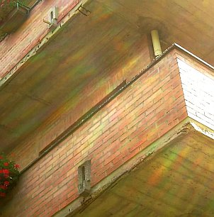 
Im Detail: 
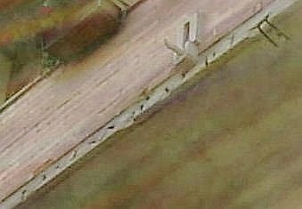 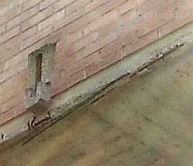 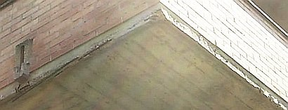 
Durch Korrosion / Verrostung der Armierungseisen / Bewehrung abgeplatzte Überdeckung des Stahlbetons nach nur wenigen Jahren. Deswegen braucht man also nicht ins sonnen- und ruinenverwöhnte Welschland fahren. Das kennen wir auch hier zur Genüge, oder? 

Wenn man sich mal überlegt, wie lange es unsere konstruktionsoptimierten Flachdächer aushalten, bis die Brühe durchrinnt - kommt schnell heraus, daß die üblicherweise sehr dünn konstruierten Balkonplatten deutlich schneller in die Knie gehen müssen. Sommerhitze und Sonnenstrahlen, die auch im Winter die Oberfläche der Balkonplatte auf Temperaturen weit über 40 Grad Celsius aufheizen, bringen die Balkonoberfläche dank enormer Temperaturdehnung zum Ausdehnen, kommt ein Regenguß, die fleißig gießende Hobbygärtnerin oder die Nacht, schrumpft die Konstruktion mehr oder weniger schnell schlagartig zusammen. Da häufig versucht wird, die Oberflächen mit im Verbund verlegten Baustoffen zu "gestalten", kommt es zu inneren Materialabrissen, die sich dann über kurz oder noch schneller zwangsläufig bis an die Oberfläche fortsetzen. 

Folge: Wasser dringt ein, setzt sich in den meist kunstharzhaltigen bzw. schlecht trocknungsfähigen, nicht kapillaraktiven Bauteilschichten fest und führt zur nachfolgenden hygrischen Dehnung und im Winter selbstverständlich auch Frostsprengung. Die typischen Frostschäden hat jeder schon gesehen. 

Wenn man also dieser Grundproblematik möglichst entkommen will, ist eines wohl sofort klar: Eine nicht im Materialverbund, also von der Dichtebene entkoppelte Belagkonstruktion ist gegenüber allen fest verbundenen, verfliesten bzw. sonstig beschichteten Oberflächen / Gehbelägen von vornherein um Lichtjahre überlegen. Und ein Belag aus massiven Platten jedem dünnfliesigen Beläglein. 

Wie sehen nun die üblichen Belagschäden aus, woher kommen sie? 

Die brutale Mischung aus Hitze und Kälte, Wasser, Dampf und Eis ist es, die dem Balkon und seinen meist nach Bauherrengeschmack von Handwerksmeistern konstruierten Wunsch-Belägen arg zusetzt. Und so dehnt sich der Belag grauenhaft aus und schrumpft dann wieder - doch wer mag schon alle paar Millimeter eine notwendige Bewegungsfuge sehen? Lieber läßt man den Fliesenbelag in der Feinsteinzeugfliesen-Fläche reißen, sowieso auch in der Fuge. 

Was dann passiert? Klaro, Wasser dringt ein und beginnt im Untergrund zu wühlen. Da der geflieste Belag sowieso nie vollflächig bzw. flächenbündig auf dem Untergrund eingebettet / satt im Mörtelbett verlegt ist, gibt es Risse und Hohlräume, in denen sich das Wasser sammeln kann und dort verschärft "arbeitet". 

Ohnehin kann sich der sehr dichte Fliesenbelag aus Feinsteinzeug nur sehr bedingt am Mörteluntergrund verankern - in seine paar offenen Pörchen gelangt auch von unten her ja kaum Bindemittelleim. Und wie schlau doch der Ästhet wieder war: Möglichst enge, schmale Fugen zwischen riesigen Fliesen und Platten, das größte Format ist ja oft noch zu klein. Leute, das muß doch schiefgehen - Plattenriß und Fugenriß sind so sicher vorprogrammiert. Und dann möglichst kein Gefälle, auf jeden Fall weniger als 2 Prozent. Opa könnte doch ausrutschen und dann übers Geländer stürzen. So bleibt Wasser extra lang auf dem Plattenbelag und hat dann extra lange Zeit, sein übles Spiel zu entfalten, wozu auch die meist vollkommen unbeachtet bleibende aber dennoch grausame Umkristallisierung der Mineralkristallphasen im Mörtel hin zu Treibmineralien gehört, die das Mörtelgefüge unauswechlich zermürben. 

Selbstverständlich ist auch die Tropfkante vorne und seitlich nur unzureichend bzw. ganz danebenkonstruiert. Hier stoßen Materialien mit vollständig unterschiedlichen Temperaturdehnungen / Ausdehnungskoeffizienten zusammen - das zieht und klafft und reißt ohne Ende, die Randprofile stauchen und drücken sich nach oben. Schön auch die beliebte Lösung, die Abdichtung / Eindichtung des Randprofilblechs als Kombination aus zementärer Dichtungsschlämme mit Abdichtungsband auszubilden. Da hier nahezu dampfdichte Materialien im Spiel sind, trocknet die Zement-Kunstharz-Schlämme nie richtig aus, bindet nie wie gewollt ab und reißt dann eben, weil sie den gegebenen Belastungen gar nicht standhalten kann. 

Folge für die Bewässerung und Entwässerung der Balkonoberfläche: 

Die schlußendlich doch abtropfwillige Regenbrühe kommt nicht vom Balkon weg, sondern wird letztlich kapillar in den Untergrund unter den abklaffenden Fliesen und Mörtelbetten gesaugt. Da wächst dann über den Balkonpfusch auch recht schnell Gras drüber. Außerdem hat der Mörtel die Eigenschaft, das in Rissen eingesickerte Wasser kapillar nach oben zu transportieren - ein besonders schöner Effekt, wenn auf der mörtelbelegten Dichtungsbahn das Wasser steht - und dann vom Mörtel bis unter die Plattenbeläge transportiert wird, wo dann - der Angriff kommt von außen - erst mal der Belag und dann das Mörtelbett wegfriert. Nicht ohne gigantische Ausspülungen / Auslaugungen / Ausblühungen / Versinterungen der dabei ausblutenden Kalklaugen. Das sorgt dank Kalkkrusten-Bildung für Rückstaueffekt des Regenwassers an der Balkonplattenkonstruktion und oft edelste Tropfsteinbildung unter der Balkonplatte, Eintritt frei! 

Verlegt wird die ganze Chose natürlich nicht, wenn das Wetter paßt, sondern wenn der Handwerker endlich kann. Insofern herrschen meistens ideale Witterungsbedingungen für die größtmögliche Schadensentwicklung durch unzureichendste Verarbeitungsbedingungen, die schon bei der richtigen Wahl der Verlegewerkzeuge, Materialien und Verlegemethode / Ausführungsart scheiterten. Es heißt ja nicht zu Unrecht Handwerk und nicht Kopfwerk, wie Milliarden Quadratmeter Belagschäden auf Deutschlands Balkonen nicht müde werden, zu beweisen. 

Und dann, kaum ist die Platte neu verlegt, wird sie belastet. Egal, ob der Verlegemörtel schon die vollständige Festigkeitsentwicklung erreicht hat oder nicht. Der Zementstein ist dann noch nicht verfestigt und auskristallisiert, der "vergütende" Zusatz von Kunststoffdispersion noch gar nicht vollständig verfilmt. Immer druff und damit möglichst viele wasseraufnehmende Frühschäden namens Mikrorisse / Spannungsrisse in den jungen Belag und den Fugenmörtel reinkriegen. 

Auch der mitverwendbare Rest des Altbalkons hat sein Tücken - die Restfeuchte genannt wird. Darauf wird der neue Kram verlegt, nimmt dann die Feuchte auf, diese kann mangels ausreichender Dampfdiffusion - je größer die Fliesenformate, je geringer der Fugenanteil, je schmaler die Fugenbreiten, umso weniger! - nicht abtransportiert werden, reichert sich als Kondensat unter den Fliesen und im Mörtelbett an und friert und frostet dann im nächsten Winter die schöne Konstruktion kaputt. Na gut, kann im Idealfall schon ein paar Jährchen dauern, aber nicht viele! Hohllagen, Klapperfliesen, Risse, Abplatzungen ... 

Daß im Rahmen von sogenannten "energetischen Sanierungen" dann gerne vorgeschlagen wird, die Altbalkone gleich ganz wegzureißen, um sie dann mit besser konstruierten Vorsatzkonstruktionen aus Stahl zu ersetzen, verwundert da nicht weiter. Auch wenn es in diesem Umfeld viele andere Merkwürdigkeiten zu bewundern gibt, wie es [3sat in "Die verpackte Republik" [Kritisch kommentierte Version]](https://www.youtube.com/playlist?list=PLsv5nPUU0m4WhiWCFT6OQoP1CxMoirnhX) aufzuzeigen wußte. 
Ehrlich gesagt, braucht es für Balkonarbeiten eigentlich immer eine komplette Einhausung, wenn "Übliche Belagaufbauten" mit längeren Reifezeiten der Belagschichten anstehen. OK, doch wer macht das wo? 

Nun versuchen ganz Schlaue, das quasi unvermeidliche Wasser unter dem Balkonbelag durch ein Drainagesystem kontrolliert abzuführen. Eigentlich eine schöne Idee, mal so kurz angedacht. Es gibt dafür Drainagematten, Drainageplatten und Drainagevliese, alle aus Kunststoff (Polyester, Polyethylen, ...). Sie liegen meist schwimmend auf dem Gefälleestrich und entkoppeln so den Belag vom Untergrund. Klingt meist sehr hohl, ist meist nicht dolle belastbar. Und setzt sich zu! Herrliche Biotope können so unter dem Plattenbelag oder Holzrost/Bretterrost entstehen, und was kreucht und fleucht nicht alles in solchen Drainagesümpfen. Das gleiche gilt selbstverständlich auch für die Drainagemörtel (Monokornmörtel, Einkornmörtel) aus Quarz und Harz (Verbunddünnschichtdrainage, Dickschichtdrainage, ...), denn Wasser ist eben nun mal Leben, und wenn es irgendwo eindringt, ist das immer ein Biotop. Es sei denn, man schmeißt Gift rein - das dann aber logischerweise über kurz oder bald ausgespült wird und dem unteren Nachbarn in die Kaffeetasse, Blümelein und Laufstall tropft. Macht ja nix, hilft aber auch nix. 

Superidee waren und sind auch die Dichtungsbahnen für die Balkonflächenabdichtung aus Kunststoff. Sie geben unvermeidlicherweise Weichmacher ab, das führt zum Schrumpfen der Kunststoffdichtungsbahn und dann zieht sie sich aus den Anschlüssen weg, wo dann die Chose undicht wird und mehr und mehr Wasser kapillar reinzieht. Ja, die Bauchemie ist schon immer wieder für Superpfusch gut gewesen. Ich jedenfalls bevorzuge kunststofffreie Abdichtungsbahnen und Balkonbeläge ohne dieses Dauerschadenspotential. 

Auch sehr beliebt sind Versiegelungen der gefährdeten Beläge des Balkons oder wasserdichte Imprägnierungen. Das Material der Wahl: Kunststoffpampe. Ebenso die nachträgliche Abdichterei mit Epoxidharzmörtel bzw. Dichtmassen / Kitte / Fugenmaterialien aus Silikon, Polyurethan, Polysulfid und so weiter. Funktioniert natürlich alles nicht, da dann die immer in der Unterkonstruktion eingeschlossene Feuchte ganz sicher noch dollere Schäden noch schneller hervorbringt. Versprochen. Ganz davon abgesehen, daß der versprödende und rissebildende Alterungsprozeß dieser Kunstbeläge sofort nach dem AUshärten einsetzt und so niemals nicht für die gegebenen Extrembeanspruchungen taugen kann - Werbung und Chemiepropaganda hin oder her. Tipp: Lassen Sie sich 10 Jahre alte Referenzen zeigen! 

Die Frage nach Saniermaterialien und Saniertechnik vom Großbau bis zur letzten Einfamilienhütte ist eben auch, wenn es an die Balkonsanierung geht, entscheidend. Gerade, wenn man wenig Aufbauhöhe für ein ordentliches Gefälle und entsprechend vorgeschädigten Altpfusch des Handwerks und der Bauindustrie vor sich hat - von der Detailplanung gar nicht zu sprechen. Brutalste Durchdringung der Abdichtungsschicht mit den Geländerpfosten / Geländerstäben / Geländern ist ja offenbar Pflicht gewesen. Denn unbedingt müssen die Balkonunterseiten ebenso abfrieren, abplatzen, aufreißen und zuguterletzt möglichst gefährlich abstürzen. 

Keine anderen Bereiche der Fassade sind also so ungünstig konstruiert und in geradezu ungeheuerlichster Weise durch Wetter gefoltert, wie der Balkon. Hitze, Kälte, Feuchte, Trockenheit, Schnee und Eis, Bliemchengießwasser mit schadsalzhaltigsten Düngenitrophoskatreibmineralzusätzen, gar Tierhaltung vom Meerschwein über den Kanari bis zum Hausschwein - alles was für Baukonstruktionen gräßlich ist, muß ein Balkon aushalten. 

Was ein Stahlbetonbalkon jedoch gewiß nicht in dem Umfang, wie immer beschworen ist: eine "Kältebrücke" bzw. "Wärmebrücke". Wenn es auch von Bauphysikern behauptet wird. Vielleicht auch, um Fassadendämmung zu propagieren. 

Wieso nicht? Weil die balkonnahen Schimmelecken im Innenraum wie auch an der Innenraumecke und hinter dem Schrank nur durch überhöhte Raumluftfeuchte in Verbindung mit ungenügender Wärmeversorgung mittels Heizluftkonvektion gedeihen. Die Heizluftwalze erreicht halt die Ixel und Zwickel nicht ordentlich - dort bleibt es dann kühler - und patsch: schon flutscht das Kondensat bei zu hoher Luftfeuchte dank dichter Fenster und Blowerdoorwahnsinn in die Kaltfläche. Alles weitere dazu [hier](23bau05.md) und [hier](7temp04.md#wã¤rmebrã¼cke?).

Eine andere Sache ist freilich die in die Dachfläche oder Geschoßfläche eingeschnittene Terrasse auf Stahlbetonplatte. Hier gibt es durchaus Probleme, wenn im Winterhalbjahr die Nachtauskühlung rund um den Bodenablauf schnell in die Betonplatte hineinkriecht und an der Decke in schlecht gelüfteten Wohnstuben den sogenannten Taupunkt unterschreiten läßt, worauf sich erst mal ordentlich Kondensat da einlagert, dem der Schimmelpilz dann zielsicher folgt.

Als Dauerbaustelle sorgen unsere stilsicher oder geschmacklos an Fassaden angebappten Balkone ganz sicher dafür, daß dem Hausbesitzer das Geld ständig aus der Tasche gezogen wird. Oder er zusehen kann, wie sein Balkon kaputtgeht. Oder eben beides. Damit das wirklich gut funktioniert (beides), bietet der vereinte Schwachverstand von Bauchemie über Planer bis Handwerker allzuviele Möglichkeiten an. Was hier an bechipster Kunstharz-Pampen-Kultur getrieben wird, geht bestimmt auf keine Kuhhaut. Wie immer schlägt meist das Produktplacement der schlauen Industrieberater zu, und "rät" dem ahnungslosen (?) "Handwerker" und "Planer" anstelle sorgfältiger Detailausbildung (unter Respektierung der tatsächlichen bauphysikalischen Eigenschaften der verwendeten und im Bestand anzutreffenden Baustoffe bis zur frostsicheren Entkoppelung frostgefährdeter Verbundsystem) zum Einsatz geradezu lächerlich schlechter Systeme wie der Harzbesuppung oder sonstig plumper Beschichtereien bis zur aufgeklebten Fliese. Hauptsache, ein Umsätzlein geht. 

So kommt es dann zum Einsatz von Klebemassen, Spachtelmassen, Kunstharz-Kitte, Silikon-Fugen, Epoxi-Harzen / Epoxidharz und Kunststoff-Folien / Kunststoffbahnen / Folienbahnen mit oder ohne oder mit zu geringen Überlappungen, was das Zeugs hält. Hauptsache, das Material und die damit erstellten Schichten und Anschlüsse können sicher niemals lange halten. Wofür gibt es denn die Bauchemie und ihre schlauen Partner im Handwerk der Betonsanierer, Balkonsanierer, Dachdecker, Klebekünstler und Kunststoff-Modelleure. 

Schlimm auch, wenn aus einer doch respektabel lange haltenden Simpelkonstruktion im Sanierungsfall aus Prinzip eine an Verbundproblemen unübertreffbare Sanierlösung nach aktuellster DIN, dicken Platten auf Mörtelsäckchen und selbstverständlich mit fettester zusätzlicher Wärmedämmung auf und unter doppelter Abdichtungsebene werden soll. Da heißt es schnell, die ganze Fassade mit allen Bauteilanschlüssen neu zu erstellen, nach vorherigem Weggerupfe aller eigentlich noch brauchbarer Altbauteile. Weil eben keine alte Balkontür mehr an die normgerechte Sanier-Anschlußausbildung paßt. Und durch die neuen Aufbauten aus zig Kunststoff- und sonstigen Konstruktionsschichten auf der dünnen Betonplatte weder ein machbarer Türanschluß mit gleichzeitig ausreichendem Gefälle der regenwasserführenden Balkonplatten-Oberfläche, noch die notwendige Geländerhöhe gegen den Absturz des Balkonbesitzers machbar ist. 

Von den wunderlichen Anschlüssen an den Randübergängen zwischen der Horizontale an die vertikalen Brüstungen und die Hausfassade mit allen dort befindlichen komplizierten Ecken und Kanten und das Einbauen der Geländerpfosten von oben mitten durch die Abdichtungsebene gar nicht zu reden. Hauptsache, es kostet. 

Meine Meinung: Auch hier darf man darüber nachdenken, nicht nach neuester Norm, sondern weitgehendst entsprechend Bestand zu sanieren. Wir könnten das zum Spaß als "Denkmalpflege" deklarieren. Vorausgesetzt, daß jedoch kein Prinzipfehler, also Konstruktionspfusch von Anfang an vorliegt, der schon seit dem ersten Tag die undichte Durchtropfkonstruktion garantierte. Wenn es jedoch nur um wenige Schäden an wenigen Balkonen einer ansonsten auch nach zig Jahren noch funktionierenden Balkonfassade geht, darf man durchaus darüber nachdenken, nur "sparsam" zu sanieren. Was natürlich ein sehr sorgsames Auseinandersetzen und Analysieren der partiell vorhandenen Bauschäden voraussetzt. Und eine schriftliche Vereinbarung mit der Bauherrschaft, daß eine aus den Neubau-Normen herausfallende Reparaturkonstruktion vertraglich gefordert, angeboten und ausdrücklich vereinbart ist. Sonst lieber nicht. Beratung und Ehrlichkeit von Anfang an! 

Stratgie-Tipps: Nicht übers Ziel hinausschießen, nicht alles über einen Leisten schlagen, nicht Umsatzmaximierung ohne Sinn und Verstand, nicht die üblichen DIN-Drohgebärden als Vermarktungstrick, keine Chemiekampfwaffen als pfuschiger Billigmachertrick, aber auch nicht mit Kanonen auf Spatzen zielen und bitte keine Elefantenherde aus jeder Mücke machen. Wobei freilich trotzdem gilt: Wat mutt, dat mutt! Allet chlor?

Daß die anstelle herkömmlicher - vielleicht sogar glasfaserverstärkten - Bitumenbahnen / Bitumenschweißbahnen - so gar gerne eingesetzten synthetischen Imprägnierungen, Hydrophobierungen, Versiegelungen Kunstharze, Flüssigfolien und Kunststoffbahnen / Folienabdichtungen trotz aller auf Ewigkeiten versprochenen Elastizitäten und modernstem Heißluftverfahren oder Quellverfahren / Quellschweißmitteln dennoch flugs verspröden und die thermischen Dehnungen der frei bewitterten Kragkonstruktionen in Anbetracht der balkontypischen / terrassentypischen Belastungen weder im Verbund noch alleine nicht lange bzw. über die gewerktypische Gewährleistungszeit hinaus halten, daß das auch für Zementhäute gilt, daß Armierungen im Balkoneingeweide vor sich hinrosten, bis die Chose plötzlich abstürzt und man dort schon mal gucken sollte, was los ist, daß Bleche unterseitig ankondensieren und bei ungenügender Falzung sehr wohl Wassereintrieb oder gar Kapillarwasser aufnehmen, daß Wasser gemeinsam mit Temperaturdehnung die größten Feinde der dünnhäutigen Verbundkonstruktionen sind, daß die Betonüberdeckungen oft nur geringsten Rostschutz bieten, daß in Zement verlegte Platten auf nicht überdachtem Balkon und frei bewitterter Terrasse eben recht bald bis gleich hochfrieren, auch wenn sie "dauerelastisch" versiegelte Fugen bekommen und der Verlegemörtel synthetisch "vergütet" ist und sie meinetwegen auch entkoppelt verlegt werden - all diese Hochnotpeinlichkeiten werden geradezu professionell ausgeblendet und mit Hochglanzbroschüren übertüncht. Wenn man nur schnell noch eine weitere angebliche "Billig"-Lösung an den dauersanierend geplagten Balkonbesitzer losbringt. 

So kommte es dann wieder und wieder zu vorprogrammierten Schadenskatastrophen, die freilich ihr Geld kosteten - gerade weil die Bauherrnschaft - oft auch eine WEG / Wohnungseigentümergemeinschaft mit arg kompetentem Beirat und vertrauensarchitekten- bzw. -handwerkerbestückter Hausverwaltung - so schön zu sparen wußte - und auf eine Mehrjahresgarantie hereinfiel, die dann wieder an den unausbleiblichen Ausführungsmängeln scheiterte. 

Wie immer bei "Geiz ist geil"-Planung: Penny wise and Pound foolish - Saving the Penny and losing the Pound. Oder mit dem Schinken nach der Wurst werfen. 

Einige Beispiele aus meiner (HOAI!-)Projektplanung und Bauberatung:

 
Das Bremer Rathaus: Südfassade nach der Reparatur - über den Arkaden große Balkone, über dem Traufgesims eine begehbare verblechte Traufe. Fassaden- und Dachreparatur ohne teuren Gestaltwechsel nach neuester Denkmalmarotte.

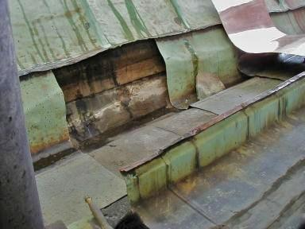 
Traufe während Freilegung. Mit dem Neublech startet gerade die Detaillierung der erforderlichen Konstruktionsverbesserung mit dem Handwerker.

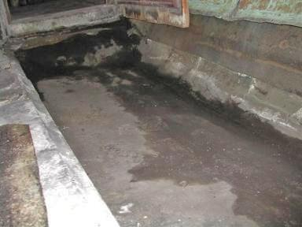 
So patschnaß sah es dann unter der oberflächlich überzeugenden Traufverblechung am Bremer Rathaus aus. Nur die Freilegung konnte diesen zunächst überraschenden Befund, den wir im Zusammenhang mit der Bauschadensanalyse der Traufschäden vermuteten, in seinem ganzen und zerstörerischen Umfang belegen. Auch Kupferblech bietet eben keine Gewähr für Dichtigkeit der Unterkonstruktion.

Die dann dank jahrelanger Unterspülung und Hinterfeuchtung unterseitig so aussah (rechts Bestand Traufgesims, links nach Reinigung und Retusche):

 
Mit kosten- und substanzsparendem sowie optisch passendem Altblech dann die Neuverwahrung der Traufgesimskante. Die rückseitige Rinnenauskleidung dann in Neukupfer. Man beachte auch die bleiwolleverstemmten Fugen zwischen Balusterfuß und Blechhaut. Das hält länger dicht als Kunstharzpampenmörtel. Es kommt immer aufs Detail und die Materialstrategie an, wenn wir langlebieg konstruieren und reparieren wollen.

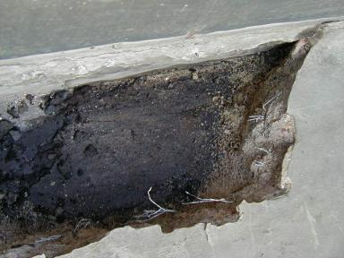 
Hier sehen wir in das Freilegungsloch der zementären Abdeckung des Balkons am Bremer Rathaus. Alles naß. Und die Zementestrichschwarte mit feinen Haarrissen durchzogen. Trotz Armierung.

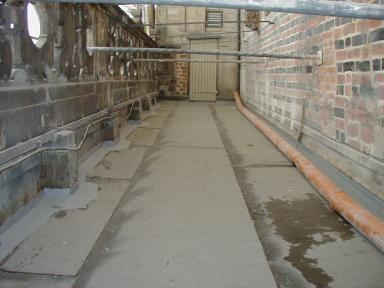 
Aus der Bauphase der Balkonreparatur. Regenableitung provisorisch. Mit echten Schweißbahnen und einem konstruktiv durchdachten Gesamtaufbau, der sowohl die bauphysikalischen Bedingungen aus Trocknung der feuchten Unterkonstruktion (sie kann ja dank Luftunterspülung immer Kondensatfeuchte aus feuchter Warmluft im unterseitig verschatteten, kühler temperierten Bereich aufnehmen) wie auch die Wetterbelastung von oben sicher verkraften kann. Eben dämpfungsfähig und störungstolerant. Mit Baustoffen, die seit über einem Jahrhundert funktionieren. Nicht erst seit der jüngsten Produktrenovierung der reformgeilen (um Altschäden an verrufenen Produkten marketingmäßig zu bearbeiten?) Bauchemie. Und so darf man auch Betonschäden nur mit materialidentischen Werkstoffen aus Steinderln, Sand und Portlandzement ausflicken, da dann die Chance nach einer dauerhaften Verbundwirkung des Reparaturpflatschens am allergrößten ist. Logo, oder? Doch wie macht es der klassische Betonsanierer? Kunstharzgepampe! Er möchte ja baldmöglichst wiederkommen.

Auch bei der Bodenplättelung von flachdachöähnlichen Terrassen und Balkonen wird es mit irgendwelchen Plattenbelägen und Fliesenbelägen / Fliesen / Keramikfliesen auf Zement-Mörtelbett immer Probleme geben, die dieses Bild wohl klar genug erahnen läßt: 
 
Daß es bei der dichten und dauerstabilen Belegung solcher freibewitterten Gehflächen andere Stratgeien braucht, dürfte nun klar sein. 

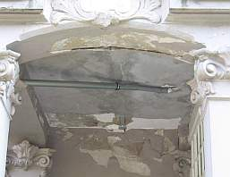 
Über dieser feuchten Orgie eine industriehandwerkliche Abdichtbemühung vom Feinsten. Schad, daß es nix nutzte.

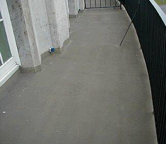 
Sieht doch schön aus, so eine Kunstharzversoßung. Und geht doch schnell und billig, wa?

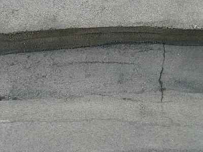 
Ja was ist denn das? Schon bald nach Auftrag der Soße Risslein, die gar feucht erscheinen? Gerade im Bereich der ausgeschmierten Rinne.

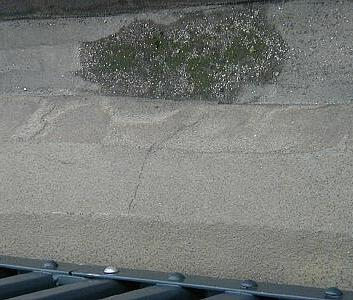 
Es moost so grün ...

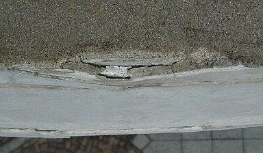 
Und an der Frontkante (Blick nach unten) gar Auffrostung und hinterläufige Abplatzereien? Wollte man hier Wassersäcke bauen?

 
Ja, da schau an! Die Frontansicht sieht aber gräßlich aus! Rostabsprengung der Bewehrungseisen, Verputz rissig aufgefroren, Unterseite gar ein Bomben-Frostschaden.

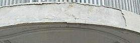 
Gut, daß das alles schon abgefallen ist. Sonst wäre es ja gefährlich.

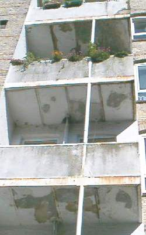 
Klar, daß hier durch undichte Abflußdetails und Konstruktionszerfrostung bedrohte Mieter und geplagte Hauseigentümer Abhilfe suchen. Die eine Front durch Abriß und Schicki-Micki-Neubau (das kostet Bauleistung und bringt fett Honorar!) oder durch (mein Rat) bestandsgerechte und vergleichsweise preisgünstige Reparatur mit geeigneten Werkstoffen. Wie und was genau? Ja, das ist eben Planungsleistung gem. HOAI oder gem. Verkaufsliste des Industrieberaters.

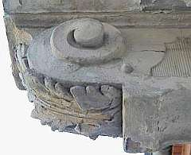 
Wenn alle 17 Balkonkonsolen dann so brüchig wegfleddern, ist bestimmt mehr im Spiel als nur ein bisserl Abnutzung. Hier muß es an die eisernen Eingeweide gehen - und das bei maximaler Substanzbewahrung! Ohne Freilegung und Bemusterung der Reparaturtechnologie wird das echt Risiko.

Es kommt also nicht darauf an, was man aus Synthetikpampe scheinbar billig am Beton macht, sondern daß man hier Bescheid weiß, wie es wirklich geht. Der hinzugezogene Dachdecker empfahl übrigens - ganz schön schlau aber dennoch falsch - Blech drüber. Das bringt ihm Geld - und dem Bauherrn bald neue Sorgen. Insofern bleibt nur die handwerklich sauber durchdetaillierte Reparatur mit bestandsverträglichen Werkstoffen. Und die kostet zwar Geld, sogar für die Planung, aber hält dann wenigstens besser.

Das schönste Rezept hilft natürlich auch nichts, wenn schon die Verarbeitung daneben geht und die berühmten Kapillarrißnetze im thermisch überbeanspruchten Deckbeton auftreten:

_"Im Verlauf eines heißen Sommertags kann die Betontemperatur im oberflächennahen Bereich über 40 Grad Celsius erreichen. Hohe Luft- und Frischbetontemperaturen sowie die Hydratationswärme führen zu Spitzentemperaturen von weit über 50 Grad Celsius im Betonquerschnitt._

_Die dadurch zu rasche Austrocknung der oberflächennahen Bereiche bedingt eine unzureichende Hydratisierung und damit eine unzureichende Gefügeausbildung, die bei späterer Nutzung zu einem erhöhten Abrieb führen kann. Niedrige Nachttemperaturen oder Gewitterschauer können zu einer kurzfristigen Abkühlung der Oberfläche und damit zu thermisch bedingten Zugspannungen führen. Temperaturdifferenzen von 25 Kelvin innerhalb weniger Stunden sind hier keine Seltenheit."_ 
[aus: Allgemeine Bauzeitung 1.12.00] 

Logischerweise führen die so entstehenden Rißnetze zu erhöhter Wasseraufnahme bei Beregnung und beschleunigter Karbonatisierung des Betons und Verrostung der oberflächennahen Bewehrung.

50er-Jahre-Betonitis am archäologischen Denkmal in Good Old England: [Westbury White Horse fades to old grey mare](http://stones.non-prophet.org/archive/Ancient/002700/1023499971017d09.html) [Horse will be white again](http://www.thisiswiltshire.co.uk/wiltshire/archive/2001/01/26/west_news_local5ZM.html)

Und was zuguterletzt auch mal angesprochen werden soll: Man kann 

1. Balkone komplett aus rostgeschütztem / verzinkten Stahl oder sogar Edelstahl konstruieren oder 
2. Balkone überdachen 
um den witterungsbedingten Angriffen auf deren Baukonstruktion abzumildern. Ist dann halt neben der konstruktiven auch eine Kosten- und Geschmacksfrage. 

Irgendwelche weiteren Fragen? [Hier](2berat.md)!
