[🠔 Zur Übersicht: Stahlbeton](2beton.md)  
# Stahlbeton an Brücken
**Einsturz-Gefahr bei 300 Stahlbetonbrücken im deutschen Bundesfernstraßennetz! Diskussion über Korrosion, Sanierung und die finanzielle Belastung für Steuerzahler.**  
_von Konrad Fischer_

## Der Stahlbeton und der Zement 10

Inhaltsverzeichnis der Betonkapitel 

**10 Stahlbeton an Brücken** 

[www.arminwitt.de/schreck.html](http://www.arminwitt.de/schreck.html) - Zu Brückenbauschäden mit Katastrophenbeton - u.a.: Philipp Schreck schreibt an Dr. A. Merkel betr. Brückenmafia, zum die Einsturzkatstrophen vorprogrammierenden deutschen Sonderweg im Spannbeton-Brückenbau usw.. Spannend!!! 
[www.brueckenweb.de/Themen/katastrophen/katastrophen.php](http://www.brueckenweb.de/Themen/katastrophen/katastrophen.php) - Brückeneinstürze chronologisch im Brückenweb 
[BILD 11.04.2011: Einsturz-Gefahr bei 300 Stahlbetonbrücken im deutschen Bundesfernstraßennetz!](http://www.bild.de/politik/inland/bruecken/achtung-autofahrer-einsturzgefahr-bei-300-bruecken-17375648.bild.html) - Antwort der Bundesregierung auf SPD-Anfrage entlarvt desaströse Baupolitik des Bundes - Für Ökowahnsinn gibt es Geld ohne Ende, die Autofahrer werden dafür gemolken, bis sie in den Abgrund stürzen! 

Schon 1993 hetzte die ADAC motorwelt (3/93), Leib-, Magen- und Vereinsblatt der deutschen Autofahrer, gegen den höchstgelobten Jahrhundert-Baustoff der hochgemuten Ingenieure, Architekten und Bauindustrie und schrieb über die Probleme eines der häßlichsten Betonmonsters in München (Auszüge): 

**_"DIE ROSTRUINE_** 
**_Donnersberger Brücke in München: Schon nach 20 Jahren müssen solche Bauwerke mit Millionenaufwand saniert werden._**

_[...] Frühjahrsmorgen in München. ... Donnersberger Brücke [...] In der Nacht hat es geregnet. Jetzt ist der schmutziggraue Betonkoloß wieder trocken._

Doch der Schein trügt. Denn innen ist das Bauwerk naß. Durch winzige Risse, Fugen und Löcher hat sich das Wasser Jahr für Jahr unbeirrt seinen Weg nach unten gesucht, hat Winter für Winter aufgelöstes Tausalz mitgeschwemmt.

Das hat aus der Brücke eine Rostruine gemacht. Tief ist die agressive Salzbrühe in den Beton eingesickert - bis zu den dicken Stahlstäben, die dem 750 m langen Bauwerk seine Festigkeit geben. [...]

Für den Münchner Verkehr ist die auf drei Jahre angesetzte und 31 Millionen Mark teure Sanierung des maroden Monstrums eine Katastrophe. [...]

Nach ADAC-Recherchen droht diese Schicksal noch Hunderten von Betonbrücken aus den 60er und 70er Jahren. [...] Professor Dr. Alfred Schmuck, Straßenbauexperte der Universität der Bundeswehr: "Über viele 100jährige steinerne Bogenbrücken rollt heute noch der Verkehr. Dagegen halten neuzeitliche Betonbrücken unter dem zerstörenden Einfluß von Tausalz nicht - wie von ihren Erbauern erwartet - 70 bis 90 Jahre, sondern sind in Einzelfällen schon nach 30 bis 40 Jahren vor sich hinrostende Ruinen. Das wird den Steuerzahler jeweils zweistellige Millionenbeträge kosten - da kann einem schon Angst werden." Allein in Hamburg stehen beispielsweise hundert Brücken zur Generalüberholung an.

Gerade in der heutigen Zeit, wo überall Geld fehlt, wurmt das den Steuerzahler ganz besonders. Und er fragt sich: Muß das überhaupt sein?

Ja - aus Sicherheitsgründen ist es leider zwingend nötig. Denn keiner will Verantwortung dafür übernehmen, daß eine Brücke in sich zusammenstürzt. [...]"

Wie sieht es nun aus unter unseren Autobahnbrücken aus - interpretiert man die Finanzkatastrophe durch marode Straßenbrücken richtig - Mord- zumindest aber Diebstahlbeton, denn unsere künftigen Generationen werden ganz sicher noch mehr z.T. erschlagen oder verletzt, auf jeden Fall zur Gänze um Unmengen ihrer Steuergelder beraubt durch die instandsetzungserpresserischen Ergebnisse der Stahlbetonmafiosi als unsereiner? Hier eine Bilddokumentation von - im Verbund mit all den anderen Stahlbetonbauten - den Staatsbankrott vorprogrammierenden Autobahnbrücken, von mir aus dem Auto aufgenommen im August 2007: 

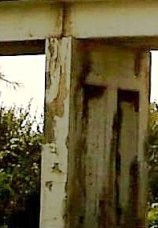1. Rostschaden an Stahlbetonbrücke - Rostsprengung an Pfeiler und Auflager 

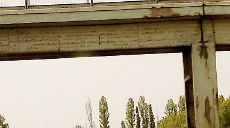2. Rostschaden an Stahlbetonbrücke - Betonabplatzung an Stütze, Träger, Fahrbahnplatte, Brückenauflager 

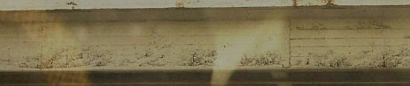3. Freiliegende und angerostete Bewehrung an Stahlbetonträger 

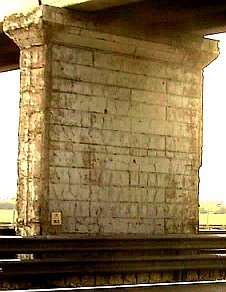4. Korrodierte und nach Abplatzung der Betonüberdeckung freiliegende Bewehrung an Brückenpfeiler 

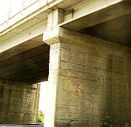5. Verrostete Zugbewehrung an Brückenplatte, abplatzende Überdeckung am Stützpfeiler 

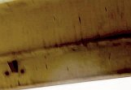6. Untersicht der Brücke mit freiliegender und verrosteter Stahlbetonarmierung 

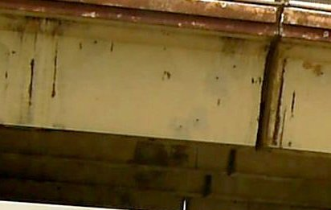7. Abgeplatzte Stahlbetonüberdeckung an Bewehrungseisen des Brückenträgers 

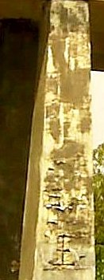8. Durch verostete Stahlbetonbewehrung geschädigte Brückenstütze 

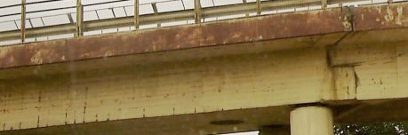9. Stahlbetonträger einer Autobahnbrücke mit Betonschäden an Überdeckung und Bewehrung 

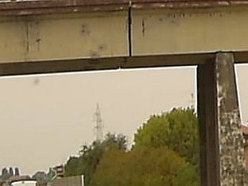10. Brückenträger und Brückenpfeiler mit Rostschäden an Bewehrungseisen und abgeplatzter Überdeckung 

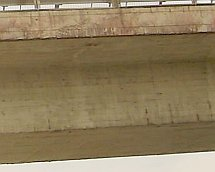11. Ankorrodierte Brückenarmierung 

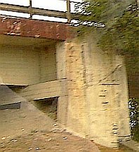12. Freiliegende und angerostete Pfeilerbewehrung und Stahlbetonplatte 

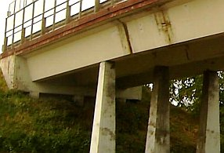13. Rostschäden am Stahlbeton der Brückenstützen, am Brückenauflager und dem Brückenträger 

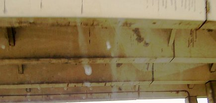14. Rostschaden an Untersicht der Stahlbetonbrücke 

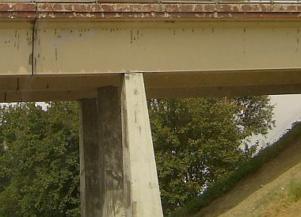15. Rostschaden an den Stahlbetonträgern der Autobahnbrücke 

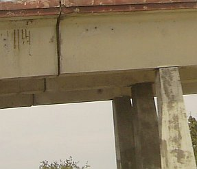16. Verrostete Armierung und abgeplatzter Beton am Brückenträger 

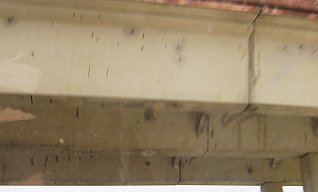17. Untersicht der Stahlbetonträger mit Betonschäden an Betonüberdeckung und Armierungseisen 

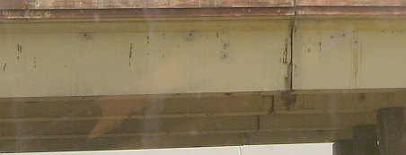18. Durch Oxidierung angerostetes Trägersystem der Brücke 

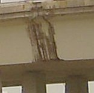19. Verrostete (oxidierte) Stahlbetonarmierungen 

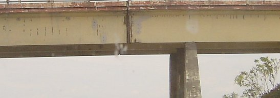20. Stahlbetonschäden an Brückenträger 

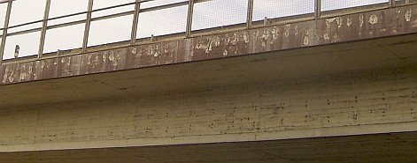21. Betonschäden an Träger und Brückenplatte 

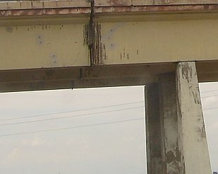22. Rostschäden an Trägerstoß und Fahrbahnplatte 

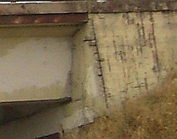23. Korrodiertes Brückenauflager 

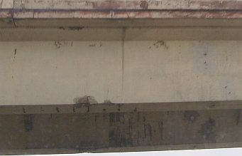24. Angerostete Zugbewehrung des Brückenträgers 

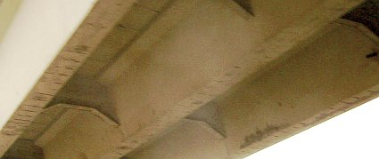25. Stahlbetonschäden an Brückenuntersicht 

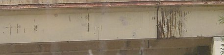26. Flächig abgeplatzte Überdeckung und aufgerostete Bewehrung an Träger der Betonbrücke 

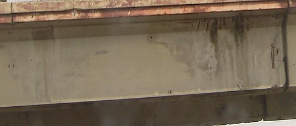27. Armierungskorrosion an Träger und Platte der Straßenbrücke 

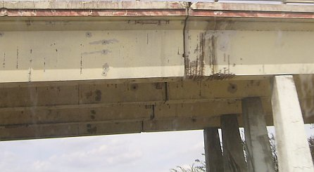28. Rostschaden an Brückenträger und Stahlbetonpfeiler 

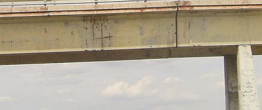29. Armierungsverrostung und abgesprengte Betonüberdeckung an Stahlbetonbrücke 

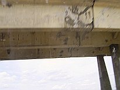30. Aufgerissene und angerostete Trägerstöße 

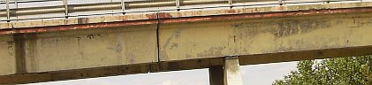31. Betonschäden am Brückenträger 

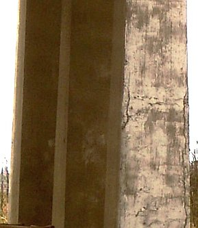32. Aufkorrodierter Brückenpfeiler 

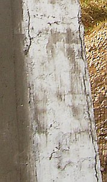33. Schäden am Brückenpfeiler - Detail 

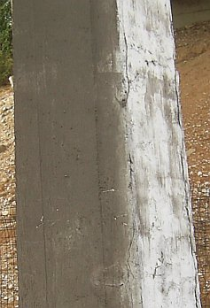34. Aufgerissener Stahlbeton und Korrosionsschäden an Brückenstütze 

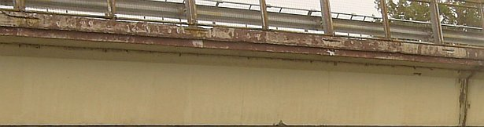35. Freiliegende angerostete Bewehrung und Abplatzungen an Brückenplatte und Trägerstoß 

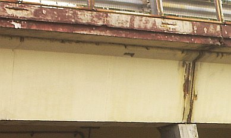36. Rostschäden an Stahlbetonbewehrungen von Brückenstoß und Brückenplatte 

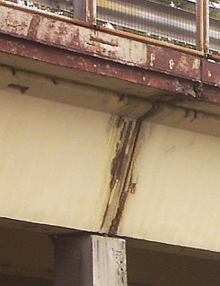37. Bewehrungsschäden durch Eisenoxidation an Stahlbetonbauteilen im Detail 

Am 1. August 2007 schreckte die Welt wieder mal richtig auf, als die durch Bauterroristen vorsätzlich aus einer Stahl-Stahlbeton-Verbundkonstruktion konstruierte achtspurige Autobahnbrücke über den Mississippi von St. Paul nach Minneapolis (Minnesota) in ihrem über den Fluß führenden mehrteiligen Mittelabschnitt aus heiterem Himmel justament in der abendlichen Rushhour in sich zusammenstürzte und zahlreiche Fahrzeuge mit in die Tiefe riß. [Hier der Bericht von Spiegel online mit Fotostrecke](http://www.spiegel.de/panorama/0,1518,500408,00.html). 13 Autofahrer kamen dabei um, rund 60 Menschen wurden verletzt und zwischen Metall- und Betonteilen eingekeilt. Die 581 Meter lange Brücke auf 14 Pfeilern war erst 1967 eingeweiht worden und bei der letzten Prüfung 2006 noch als verkehrstauglich freigegeben worden. Mängel u.a. an den Auflagern waren aber bekannt - egal. Seit den letzten Jahren häuften sich im gelobten Land Amerika die Brückeneinstürze: Drei Menschen kamen beim Einsturz der Autobahnbrücke auf der Interstate 95 in Connecticut um, herabfallende Betonteile einer Brücke in Akron, Ohio, erschlugen ein darunter spazierengehendes Ehepaar. 

Nicht zu vergessen die Brückenkatatsrophe am 30. September 2006 in Kanada, als in Laval (Montreal) eine Stahlbeton-Straßenbrücke in sich zusammenstürzte und fünf Menschen erschlug, nebst sechs teils schwer Verletzten. Stundenlang vorher lösten sich nach einem kanadischen Zeitungsbericht schon Brocken aus dem Brückenbeton und stürzten herab. Schauen Sie sich also um, ob solche bedrohlichen Anzeichen an den Brücken wahrzunehmen sind, unter bzw. über die Sie fahren wollen ... 

Die staatliche Ingenieurkammer "American Society of Civil Engineers" - deren Mitglieder genug Stahlbetonproblemchen auf dem Gewissen haben, verlautbarte im September 2003: _"Unsere Straßen, Brücken, Versorgungsleitungen, Schulen und Staudämme befinden sich zunehmend in einem katstrophalen Zustand. DieLebensqualität von Millionen von Menschen ist bereits erheblich beeinträchtigt und mit Todesopfern muß gerechnet werden."_ 

Ach, wie billig: Wo bleibt der Expertenaufschrei gegen diese Bauweise mit dem sich selbst zerstörenden Baustoff Stahlbeton? Still ruht der See - und immer weiter rollt diese Lawine auf uns zu. Das Wirken der Zement- und Betonmafia, der bei Neapel geborene Journalist Roberto Saviano beschrieb es nach jahrelanger internationaler Detailrecherche in seinem 2007 erschienenen Buch "Gomorrha" detailkundig und weist darin bzw. in Interviews explizit auf die "Zementindustrie" und die "ostdeutsche Bauindustrie" in der Hand von Mafiaroganisationen wie die Camorra und die 'Ndrangheta hin, wird hierzulande so gut wie nicht behindert und liefert uns immer weitere Mistbauwerke. Die lächerlichen Strafen gegen die verschwörerisch agierende Zementmafia, die immer wieder mal durch kartellerechtliche Verfahren gegen ihre widerlichen Preisabsprachen auffällig wird, können deren bewährte Baukriminalität wohl auch künftig kaum stoppen. Übrigens, man weiß sich dort auch zu wehren. Saviano kann wegen der vielen Morddrohungen nur noch unter Polizeischutz an geheimen Orten wohnen. Das ist die europäische Union, in ihren administrativen und politischen Strukturen bekannterweise selbst korrupt bis auf die Knochen, die sich unsere Eliten-Großmeister und der Geldadel der "Guten" offenbar wünschen. Mord an "Störern" inkusive. Wer kennt nicht die in Hafenbecken versenkten Betonkläötze als Sargersatz für Mafiaopfer? 

Lt. VDI-Nachrichten (des Vereins Deutscher Ingenieure VDI) vom 10.8.07 hat die US-Autobahnverwaltung "25 % aller Fernstraßenbrüücken in den USA als stark geschädigt oder überaltert eingestuft. "Die US-Infrastruktur verfällt zusehends. Ob Flughäfen, Straßen, Tunnel, Brücken, Gleiskörper, Stromversorgung usw. - überall wird nicht vorbeugend in Stand gesetzt, sondern abgewartet bis etwas passiert. Das global tätige Urban Land Institute hat im Mai 2006 einen Bericht veröffentlicht, wonach die USA über 1.500 Mrd $ bis 2010 allein für die Instandsetzung ihrer Infrastruktur aufwenden müsste. Inzwischen sehen Bevölkerung und Wirtschaft im schlechten Zustand der Infrastruktur eine größere Gefahr als vom Terrorismus." Doch was unternimmt man hierzulande gegen den Bauterrorismus der Stahlbetonfraktion unter Bauherren, Baufirmen und Planern? 

Weiter im VDI-Text: "In Deutschland ist für die Brücken alle 6 Jahre ein "handnahe Prüfung" vorgeschrieben. Trotz einer angestrebten Lebensdauer von mind. 100 Jahren müssen einzelnen Komponenten wie Lager, Abspannseile, Korrosionsschutzsysteme u.a. erwartungsgemäß erneuert werden. In Deutschland gibt es 37.110 Brücken im Bereich der Bundesfernstraßen, (etwa 25 % des Gesamtbrückenbestandes), davon wurden 86 % nach 1960 gebaut. Der Zustand der Brücken der Bundesfernstraßen wird wie folgt benotet: 

19 % keine Maßnahmen außer laufender Unterhaltung erforderlich, 

66 % Instandsetzungsmaßnahmen erforderlich aufgrund von zu erwartenden Problemen mit der Dauerhaftigkeit, 

15 % Nutzungseinschränkung, umfangreiche Instandsetzungsarbeiten wg. Beeinträchtigung der Dauerhaftigkeit." 

(VDI-Nachr. 10.8.07, S.8, www.vdi-nachrichten.com/bruecke). 

Staat und Wirtschaft in Deutschland müssten künftig umfangreichste Mittel für Infrastrukturmaßnahmen bereitstellen, denn Ereignisse wie in den USA treten in Deutschland erfahrungsgemäß mit einigen Jahren Verspätung ein. Ob nun der Klimaschutz oder unsere akut gefährdete Sicherheit wichtiger sind - raten Sie selbst, wie "unsere" Politiker und Administratoren entscheiden werden ... Das Problem ist ja auch hierzulande schon lange genug bekannt: **Statik und die müde Wirklichkeit** _- Auto_ Bild 4.5.1987: 

Bildunterschrift (Bild: Eingestürzte Brücke, im Fluß unter Fehlstelle Brücke, ein hinabgestürzter demolierter Bus): _"Wiener Reichsbrücke: 1976 riß urplötzlich der Beton, versank die Brücke in den Donaufluten. Nur weil es an einem Sonntag ganz früh geschah, waren keine Opfer zu beklagen."_

Bildunterschrift (Bild: Eingestürzte Brücke): _"Der letzte Fall? Am 23. April, zwei Stunden vor der Sprengung, fiel die Autobahnbrücke bei Schwarmstedt zusammen - von alleine."_

Bildunterschrift (Bild: Rundholzunterstützung unter Autobahnbrücke): _"Aichelberg-Viadukt auf der A8 zwischen Stuttgart und München: Der kranke Beton hält nur noch mit Hilfe von Holzstempeln."_

Bildunterschrift (Bild: Prüfer in Auslegerkran-Korb unter Autobahnbrücke): _"Die Heubachbrücke auf der A 45 (Sauerlandlinie) bei Warburg: Auch hier fanden Prüfer Rost am Stahl und Risse im Beton."_

Bildunterschrift (Bild: Die eingestürzte Kongreßhalle "Schwangere Auster"):_"Kongreßhalle Berlin. 1980 fiel sie - keine zwanzig Jahre alt - in sich zusammen. Auch hier das Baumaterial: Spannbeton!"_

**_Wie lange halten die Brücken noch?_**

**_An den Autobahnen bröckelt und bröselt der Beton, ganze Brücken stürzen ein. Der letzte Fall am vorletzten Donnerstag: Eine Brücke auf der A7 bei Schwarmstedt fällt in sich zusammen. Eine Frage baut sich auf: Wie sicher sind die Autobahnbrücken?_**

_Soll man weinen oder lachen? Letzten Donnerstag, zwei Stunden bevor sie gesprengt werden soll, bricht auf der A7 bei Schwarmstedt eine abgesperrte Autobahnbrücke in sich zusammen, ohne daß eine der angebrachten Sprengkapseln gezündet wurde. Mitsamt drei Fahrzeugen versinkt der Sprengmeister in den Fluten der Aller, kann zum Glück aber gerettet werden. [...]_

_Die Ursache des Unglücks? Der stellvertretende Leiter des zuständigen Straßenbauamts in Verden, Oberbaurat Hermann Behrmann: "An der Statik der Brücke kann es nicht gelegen haben. Die wurde von renommierten Büros geprüft." Bleibt als Ursache - wie schon bei anderen Brückeneinstürzen der letzten Jahre - ermüdetes Material. Der verwendete Spannbeton nämlich, eine Verbindung aus Zement, Kalk, Gips und Asphalt mit darin eingelagerten Stahlzügen, ist [...] keineswegs so sicher, wie es die Brückenbauer immer wieder glauben machen wollen._

_Der Einsturz der Berliner Kongreßhalle vor sieben Jahren, der Kollaps der Wiener Reichsbrücke vier Jahre zuvor und die Schwimmhalle im schweizerischen Uster, die zwölf Menschen zur tödlichsten Falle wurde: Immer war es "der Jahrhundertbaustoff" Beton, der irgendwann ohne Vorankündigung urplötzlich nachgab._

_Dabei warnen versierte Ingenieure schon seit Jahren vor dem bröselnden und bröckelnden Baumaterial. Besonders in den fünfziger und sechziger Jahren wurde bei eilig hochgezogenen Betonbauten oft so gepfuscht, daß die eingebetteten Stahlverbindungen schon nach kurzer Zeit rosteten und feine Risse den Baustoff wie ein Geschwür zersetzen._

_Im Anfangsstadium läßt sich der Krebs im Beton nur schwer feststellen. Einfacher ist die Diagnose, wenn - wie bei den Wohnsilos im Berliner Märkischen Viertel oder am Hamburger Mümmelmannsberg - ganze Platten von den Wänden platzen, bis die verrosteten Stahlmatten hervortreten._

_Anders bei den Brücken. Schlecht gemischte und minderwertige Bindemittel lassen Wasser in feinen Rinnsalen bis zu den Stahlarmierungen im Inneren vordringen. Und unerkennbar von außen, frißt dann der Rost, bis die stählernen Zugkonstruktionen reißen, der Beton bricht. [...] Der frühere Münchner Prüfingenieur für Baustatik Philipp Schreck warnte die Baubranche. Über 8000 Spannbetonbrücken in der Bundesrepublik, so seine Warnung, wiesen solche Risse auf, seien einsturzgefährdet. Die Dementis aus dem Bundesverkehrsministerium können nach dem Brückenbruch von Schwarmstedt nur wenig überzeugen. [...]"_

Weit über 2000 Kastenprofilbrücken in Spannbetonbauweise sind auf deutschen Autobahnen im Jahr 2000 neben den anderen schadhaften Betonbrücken in Sanierung bzw. kurz davor. Die zumindest volkswirtschaftlich suboptimale Bauweise - staatlicherseits durch immer wieder [durch Bestechungsskandale glänzende Bauämter](4behoerd.md) hervorgebracht - kostet so viel, daß von dem Geld leicht die Fehlstellen in unserem Autobahnnetz geschlossen werden können. Und anstatt die verrückte Betonbauweise ausreichend zu geißeln und hier bessere Technik zu fordern, schreien die Automobilclubs nach mehr Geld für den Straßenbau. Wem nützt das wirklich? 

Und die Entwicklung im Plattenbau? Schreck laß nach, die einsturzgefährdeten Wohnkolosse werden durch schadenskaschierenden Dämmstoff zu Schimmelbrutanstalten umfunktioniert und den doofen Mietern untergejubelt oder eben zur "Stadtperforierung" "rückgebaut" - altdeutsch: abgebrochen/abgerissen. Alles - wie deren Neubau - gefördert durch öffentliche Mittel. Baupolitik ist, wenn man trotzdem lacht. Betonbrücken sind weiterhin modern. Auch Pfusch. Siehe hierzu:

Allgemeine Bauzeitung 10.3.2000:

**_"Besonderer Beton für Expo-Brücke_**

_LEIPZIG (dpa). - Bei dem Bau einer Brücke anlässlich der Weltausstellung "Expo 2000" wird in Leipzig angeblich einweltweit einmaliges Verfahren angewendet. Für eine Stahlbetonbrücke werde ein Beton verwendet, der doppelt so fest wie herkömmlicher und zugleich wesentlich leichter sei, sagte Architekt Burkhard Pahl während des Baubeginns in Leipzig. "Der Beton ist so leicht, dass er sogar schwimmen kann"._

_Der tragende Brückenbogen wird nach Angaben von Pahl nur 35 Zentimeter schmal sein und eine Spannweite von 40 Metern haben. "Es wird eine filigrane Brücke", sagte der Architekt. Sie überspannt den Karl-Heine-Kanal im Stadtteil Plagwitz und wird Fußgängern und Radfahrern dienen. Die Arbeiten an der insgesamt 50 Meter langen Brücke, dem "Karl-Heine-Bogen", sollen im Mai beendet sein. Er wird einen Radweg mit einem Ausstellungsgelände der Expo in Plagwitz verbinden. Die Kosten betragen Pahl zufolge rund 850.000 Mark."_

Oh je, wenn Architekten "filigranen" Beton verbauen, das ist jedenfalls bis heute weltweit noch nicht so gut gegangen, oder? Beim Stahlbeton kommt es nämlich - auch wenn er zum schwimmenden Luftikus aufgeschäumt wird - immer auf die Karbonatisierungsbremse durch Alkalitätsreserve an. Und hier zählt neben dem Zementgehalt vor allem die Überdeckung. Interessanter Ortsname: Plagwitz!!! 

Gut, daß wenigstens ein paar unserer Autobahnbrücken inzwischen mit der nicht gerade billigen aber zerstörungsfreien online-Schallemissionsanalyse dauerhaft und in Echtzeit überwacht (Monitoring) werden. Bisher hat man immer nur mal hingeguckt (kommt leider noch oft genug vor, dank mehr und mehr "sparsamer" Autobahnverwaltung (Wartung kommt von Warten?) und staatsverschuldet leerem Säckel) und konnte deswegen die Spannbetonstahlbrüche im Querschnittsinneren gar nicht feststellen, die dem für alle Brücken ohne rechtzeitigen Abbruch (oder Unterstützung mit Behelfskonstruktionen) unausweichlichen Einsturz unfehlbar vorausgehen. Nun montiert man also neuerdings Mikrofonsysteme an den Brückenträgern und "horcht" nach Knirsch und Knack, das wird dann online nach Kalifornien (US-Patent) gemeldet und dort auf Schadensrelevanz ausgewertet. Na hoffentlich klappt das immer! Was man so alles von Kalifornien weiß - ob da die Deutsche Gründlichkeit (ein Phantom heutzutage?) mit Microsoftereiabstürzen und US-typischem Drogenkonsum in allen Gesellschaftsbereichen immer kompatibel ist? Wir hoffen es. Alternativ gibt es auch Aufzeichnung der Betonknaller in einem Datenlogger, da muß man dann immer wieder hin und die Krächzgeräusche des Betons im nachhinein (und hoffentlich rechtzeitig) auswerten. Eigentlich auch ein passables System für die allerlei sonstig einsturzgefährdeten Betonruinen und sowieso für die allerorts [einsturzgefährdeten Flachdach-Hallenkonstruktionen](212bau2.md), oder? Ja, dolle Technik für den Bauschaden und ein breites Betätigungsfeld für die Baubranche. Motto: Bau Pfusch, das hilft am besten weiter. 

Beton-Infolinks: [Schallemissionsanalyse SEA](http://e-collection.ethbib.ethz.ch/ecol-pool/diss/fulltext/eth14490.pdf) ... [Die Beton-Haß-Seite](http://www.bbvh.nl/hate/)
